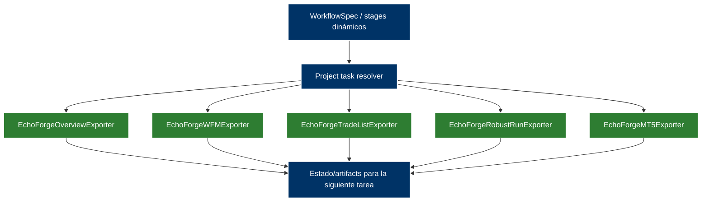

# Echo Forge

> [!info]+ Echo Forge
> **Área:** [[Echo]] · **Estado:** active · **Prioridad:** P1 · **Sprint:** [[A26Q2S7]]
> Programa general para el desarrollo y puesta en marcha de **Echo Forge** (SQX Adaptive E2E Pipeline).

## 🎯 Objetivo

- Desarrollar la fábrica/admisor de estrategias upstream para el ecosistema Echo. Automatizar el flujo completo desde la generación en frío en StrategyQuant hasta el despliegue automático en cuentas demo MT5 e ingesta de finalistas en Echo Core vía API.

## 📊 Estado actual

- **Producto integrado y Factory V2 — 2026-09-07:** el padre canónico de producto es [[Echo — Producto Integrado]]. El delivery restante de factory vive en el subproyecto de agente [[Echo Forge — Factory V2 Completion]] (F-01…F-05; C1/C2 fusionados en F-02). Este programa histórico **no** es el tercer hijo de producto ni reabre B1A/B1B/B2. Contrato SDK: [[Echo SDK — Canonical Forge Integration and Analytics Contract V1]] B + FR-1…FR-5 en S0 de Echo. Sin código/runtime modificado.


 - **Etapas 1 a 3 Completadas**: Cimiento, plugin Java de exportación física, base de datos MongoDB estructurada, motor de clasificación y ranking adaptativo, y el Evaluador Go de estabilidad WFM con warnings estáticas y consistencia OOS.
 - **Etapa 4 — lista para Review (`PASS` E2E)**: **EF-G29 está deprecado a propósito**; los `.cfx` de XAUUSD son fixtures de prueba configurados desde el JSON y no son un bug ni una condición de cuarentena. EF-G31 sigue diferido. EF-G30, EF-G32, Robust Run y TradeList están corregidos y desplegados. La wave `test/example_flow_75/v1` reconcilió 8 estrategias entre Go, MinIO y Mongo; quedan sólo deudas documental/operacional no bloqueantes. La tarea puente está en Review; el owner decide Done. Control detallado: [[Echo Forge - Cierre de Etapa 4]].
 - **Robust Run — `CLOSED / PASS` (2026-08-04)**: commit `994ffdb`, helper fail-fast, aplicación física de parámetros WFM y `MagicNumber`, rollout y canaries verificados en Zeus/Hera/Kronos. Los gaps TradeList pendientes no reabren este componente. Ver [[2026-08-04-echo-forge-robust-run-closure-certificate]].
 - **Invariante de proyectos fijos dinámicos**: los proyectos especializados autorizados en SQX son `EchoForgeOverviewExporter`, `EchoForgeWFMExporter`, `EchoForgeTradeListExporter`, `EchoForgeMT5Exporter` y `EchoForgeRobustRunExporter`. Son piezas independientes seleccionables desde la definición dinámica del flujo. `EchoForgeAutomator` está deprecado y no debe reaparecer en configuración, despliegue ni planificación activa.
 - **Etapa 6 — CLOSED / PASS (2026-08-14)**: F10 observado (release `0.2.42`, 12 EX5 + 12 HTM, Temporal Completed, worker Windows `kor`). F11 PASS. Merge a `master` `b6e7629`. Residual UTF-16 sanitizer es follow-up, no bloqueo. Control: [[Echo Forge - Etapa 6]].
 - **Cross-Platform Stager — diseño en Review (2026-08-08)**: arquitectura Go one-shot, activación recuperable, systemd Linux, launcher SCM Windows y roadmap F0-F6 completos; no se implementó producción. Control: [[Echo Forge - Cross-Platform Stager]].
 - **Stager independiente — cerrado (2026-08-09)**: core MVP e integración aceptados por el owner; descarga/verificación/staging multi-plataforma y `CURRENT`/`PENDING` concluidos. Quiesce/drain y supervisor Windows son una iniciativa distinta, no deuda de este proyecto. Control: [[Stager]].
- **Stager ↔ Symphony Publisher — cerrado tras cutover `0.2.40` (2026-08-09)**: Stager Go + bridge en Zeus/Hera/Kronos; release productiva aplicada y workers `active` desde `releases/0.2.40`. Control: [[Stager - Symphony Publisher Integration]].
 - **Stager Deployment Lifecycle — cerrado (2026-08-14) + hotfix cutover (2026-08-15)**: G3 ACCEPTED. Post-cierre: `staged` no adoptaba runtime (`Request` ausente, `0700`, `state/CURRENT`). Hotfix desplegado en flota; oneshot `noop`. Control: [[Stager - Cross-Platform Deployment Lifecycle]] · [[stager-staged-without-runtime-request]].
 - **WFM exporter C1-C3 — CLOSED (2026-08-15)**: ejecución única, una estrategia por task, heartbeat contextual. Release `9.9.11`, wave `example_flow_4` PASS. Control: [[Echo Forge - Optimización de Latencia WFM Exporter]].
 - **Hotfix mmLots / state 0644 / salida 9.9.x — Review (2026-08-15)**: plugin vía `Snippets.jar`; 8/8 `.mq5` de `example_flow_7` con `mmLots=0.1`; Stager one-shot escribe state 0644; flota en `0.2.44`; `example_flow_8` en curso. Residual: backtest Windows `tester.ini` path (no es mmLots). Known errors: [[sqx-custom-analysis-loads-snippets-jar]] · [[stager-state-0600-runtime-kor]].
 - **Arquitectura de datos + MT5 — M0–M6 `CLOSED` (2026-08-19)**: MT5 cierra M6-TOP (canonical symbol/timeframe, configured period CFX, predicado restaurado). M7 BLOCKED. Slot Pool V2 NORMAL A `PASS / CLOSED`. Cross-host ownership TOP V2 `PASS / CLOSED` como diseño, parcialmente superseded por [[2026-09-06-echo-forge-mt5-fencing-and-cancellation-v3]]; B2 y cert física global pendientes. MT5 Long-Running V2 slice B1A `PASS` (2026-09-06, commit `185825c`): ownership global ETCD CAS (`echo-forge-mt5-global-owner.v1`), reuso durable EX5/HTM antes de owner, retry backtest artifact ilimitado; sin release/deploy; desviación documentada: `mt5_backtest_workflow_test.go` actualizado fuera de Allowed Files. Slice B1B `PASS` (2026-09-06, commit `ef65dd1`): wall-clock timeout físico eliminado (legacy, slot y artifact runner), `tasks[].mt5.timeout` deprecado/ignorado (validación sin parse), techo técnico Temporal `MaxInt64-1s` con heartbeat 2m, hard-cap Campaign `=4` eliminado (la cardinalidad lógica ya no se rechaza por capacidad física). Slice B2 `PASS` (2026-09-06, commit `db8a022`): clasificador de cancel cause D1-D4 con modelo de dos contextos (NotFound/outage/shutdown ya no matan el cálculo MT5; sólo la cancelación Temporal explícita mata el Job Object propio), Finalize/ownership/slot sobreviven a la pérdida del attempt, singleton Windows `Global\echo-forge-sqx-mt5-worker` con prueba de muerte del worker previo, recuperación local de leases stale y same-host de owners (cross-host prohibido), drain CTRL_BREAK→worker.Stop intacto. Certificación física del singleton/recovery pendiente en WORKER-KRONOS. Próximo MT5 exacto: `ECHO-FORGE-FINALIST-MODEL-V2-CORE-PROMOTION-WARNINGS-STRUCTURAL-GATES-NORMAL-C1`. Controles: [[Echo Forge - Arquitectura de Datos y Migración de Persistencia]] · [[Echo Forge - Reconciliación y Scoring MT5]] · [[2026-09-06-echo-forge-mt5-global-physical-ownership-v2]].
 - **Bloqueos de Salida (Etapas 8-9)**: Bloqueado conceptualmente a la espera de que Echo Core defina los contratos API de ingesta (`NI-EI-1/2` y `NI-DL-1`) y se spikee el attach de MT5 (`NI-MP-1`).

## 🔄 Arquitectura de Proyectos Fijos (Hito 1)

El pipeline de Go orquesta piezas pequeñas y desacopladas. La definición dinámica del flujo decide qué proyecto fijo ejecutar, en qué orden y con qué inputs; el diagrama muestra el registro seleccionable, no una secuencia obligatoria:



### Tabla de Responsabilidades

| Proyecto SQX | Propósito | Snippet Java |
| --- | --- | --- |
| `custom` | Plantilla dinámica de ejecución pura (Builder/Retester/Optimizer); no pertenece a la whitelist de proyectos fijos especializados. | Ninguno (Limpio) |
| `EchoForgeOverviewExporter` | Extracción de metadatos básicos y métricas (`overview.ndjson`). | `SQXOverviewJsonExporter` |
| `EchoForgeWFMExporter` | Extracción de matriz Walk-Forward y corridas OOS (`wfm_matrices.ndjson`). | `WFMOptimizerJsonExporter` |
| `EchoForgeTradeListExporter` | Exportación contractual e independiente de operaciones cerradas (`trades.ndjson.gz` + manifest). | `EchoForgeTradeListExporter` |
| `EchoForgeRobustRunExporter` | Aplicación física de la celda robusta WFM, parámetros seleccionados y Magic Number. | `EchoForgeRobustRunExporter` |
| `EchoForgeMT5Exporter` | Traducción genérica de estrategias a código MetaTrader 5 (`.mq5`). | `EchoForgeMT5Exporter` |

Cada proyecto debe poder ejecutarse de forma independiente mediante el mismo contrato dinámico de tarea `project`. El flujo no debe codificar una secuencia fija ni alojar TradeList dentro de WFM/RobustRun; solo debe validar que los inputs declarados existan cuando se seleccione cada pieza.

## 🧩 Subproyectos

```base
filters:
  and:
    - 'type == "project"'
    - 'file.hasLink(this.file)'
views:
  - type: cards
    name: Subproyectos
    order:
      - file.name
      - note.status
      - note.priority
```

## ✅ Tareas

### Tareas del programa (mías + puentes, por subproyecto)

%% Vista humana: solo #owner/me (incluye tareas puente #type/supervision), agrupada por subproyecto. Las tareas de agente NO se muestran acá; viven en su proyecto de agente (carpeta agentes/). %%

```dataviewjs
const meta={" ":["To Do","var(--text-muted)","var(--background-modifier-border)"],"/":["WIP","#ba7517","rgba(234,124,12,.18)"],"r":["Review","#185fa5","rgba(55,138,221,.18)"],"x":["Done","#3b6d11","rgba(99,153,34,.18)"],"X":["Done","#3b6d11","rgba(99,153,34,.18)"],"-":["Canceled","var(--text-faint)","var(--background-modifier-border)"]};
const ord={" ":0,"/":1,"r":2,"x":3,"X":3,"-":4};
function linkify(s){return String(s).replace(/\[\[([^\]|]+)(?:\|([^\]]+))?\]\]/g,(m,a,b)=>`<a class="internal-link" href="${a}" data-href="${a}">${b||a}</a>`).replace(/#[\w/-]+/g,m=>`<span style="opacity:.55;font-size:12px">${m}</span>`).replace(/📅\s*(\d{4}-\d{2}-\d{2})/g,(m,d)=>`<span style="opacity:.7;font-size:12px">📅 ${d}</span>`).replace(/[⏫🔼🔽⏬🔺]/g,"").replace(/✅\s*(\d{4}-\d{2}-\d{2})/g,"");}
function has(t,tag){return new RegExp(`(^|\\s)#${tag}(\\s|$)`).test(String(t.text));}
function render(tasks){const el=dv.el('div','');el.innerHTML=tasks.map(t=>{const[label,fg,bg]=meta[t.status]||["?","var(--text-muted)","var(--background-modifier-border)"];return `<div style="display:flex;align-items:center;gap:8px;margin:5px 0;"><span style="font-size:11px;font-weight:600;padding:1px 9px;border-radius:999px;background:${bg};color:${fg};min-width:56px;text-align:center;flex:none;">${label}</span><span>${linkify(t.text)}</span></div>`;}).join("");}
let any=false;
for(const p of dv.pages('"10-projects/Echo Forge"').sort(x=>x.file.name)){
  const t=p.file.tasks.array().filter(x=>has(x,"owner/me")&&x.status!=="x"&&x.status!=="X").sort((a,b)=>(ord[a.status]??9)-(ord[b.status]??9));
  if(t.length){any=true;dv.el('h4',p.file.link);render(t);}
}
if(!any)dv.paragraph("_Sin tareas mías abiertas en el programa._");
```

> [!example]- Fuente de tareas (General) — editar aquí
> - [ ] [[echo-forge]] Definir fechas del roadmap para etapas 5 a 10 #owner/me #type/admin #area/echo
> - [ ] [[echo-forge]] Sincronizar con el equipo de Echo Core los contratos de la API de Ingesta (NI-EI-1/2) #owner/me #type/admin #area/echo #blocked
> - [x] [[echo-forge-wfm-troubleshooting]] arrancar + seguimiento (proyecto de agente) #owner/me #type/supervision #area/echo
> - [x] [[Echo Forge - Etapas 1-3]] arrancar + seguimiento (proyecto de agente) #owner/me #type/supervision #area/echo
> - [x] [[Echo Forge - Etapa 4]] arrancar + seguimiento (proyecto de agente) — cerrada `PASS` E2E #owner/me #type/supervision #area/echo #sprint/A26Q2S7
> - [x] [[Echo Forge - Cierre de Etapa 4]] arrancar + seguimiento (proyecto de agente) — cierre aceptado por el owner #owner/me #type/supervision #area/echo #sprint/A26Q2S7
> - [ ] [[Echo Forge WFM Dashboard]] arrancar + seguimiento (proyecto de agente) #owner/me #type/supervision #area/echo
> - [x] [[Echo Forge - Etapa 6]] arrancar + seguimiento (proyecto de agente) — cerrada `PASS` 2026-08-14: F10 observado + F11 PASS; owner pidió Done #owner/me #type/supervision #area/echo
> - [r] [[Echo Forge - Cross-Platform Stager]] arrancar + seguimiento (proyecto de agente) — diseño y roadmap F0-F6 listos para revisión #owner/me #type/supervision #area/echo #sprint/A26Q2S7
> - [x] [[Stager]] arrancar + seguimiento (proyecto de agente) — cierre aceptado por el owner; lifecycle Windows fuera de alcance #owner/me #type/supervision #area/echo #sprint/A26Q2S7
> - [x] [[Stager - Symphony Publisher Integration]] arrancar + seguimiento (proyecto de agente) — cierre aceptado por el owner tras cutover Go Stager `0.2.40` #owner/me #type/supervision #area/echo #sprint/A26Q2S7
> - [x] [[Stager - Cross-Platform Deployment Lifecycle]] arrancar + seguimiento (proyecto de agente) — cerrado 2026-08-14: G3 ACCEPTED; E2E Stager PASS; F3.9 diferido; `report_not_found` es Symphony. #owner/me #type/supervision #area/echo
> - [ ] [[Echo Forge - Etapas 5 y 7]] arrancar + seguimiento (proyecto de agente) #owner/me #type/supervision #area/echo
> - [ ] [[Echo Forge - Etapas 8-10]] arrancar + seguimiento (proyecto de agente) #owner/me #type/supervision #area/echo
> - [r] [[Echo Forge - Arquitectura de Datos y Migración de Persistencia]] arrancar + seguimiento (proyecto de agente) — schema-boundary fix PASS/CLOSED en `9ef5549`; T1–T5 y directed/race/vet PASS; máximo 2 archivos de repo, sin release `0.2.94`, sin Campaign física #owner/me #type/supervision #area/echo
> - [r] [[Echo Forge - Reconciliación y Scoring MT5]] arrancar + seguimiento (proyecto de agente) — M0–M6 CLOSED (M6-TOP 2026-08-19); M7 BLOCKED; listo para review humana #owner/me #type/supervision #area/echo

## 📋 Tablero

#### 🟦 To Do
```tasks
sort by priority
path includes 10-projects/Echo Forge
tags do not include #owner/agent
status.name includes Todo
short mode
hide task count
```

#### 🟡 WIP
```tasks
sort by priority
path includes 10-projects/Echo Forge
tags do not include #owner/agent
status.name includes WIP
short mode
hide task count
```

#### 🔵 Review
```tasks
sort by priority
path includes 10-projects/Echo Forge
tags do not include #owner/agent
status.name includes Review
short mode
hide task count
```

#### ✅ Done
```tasks
sort by priority
path includes 10-projects/Echo Forge
tags do not include #owner/agent
done
short mode
hide task count
```

## ⚠️ Backlog de GAPs y Deudas (Auditoría de Sistemas)

%% Deudas técnicas y vulnerabilidades detectadas en el monorepo symphony/sqx durante la auditoría integral %%
- [x] [[echo-forge]] Corregir timeouts y heartbeats de Temporal en el workflow adaptativo para soportar ejecuciones largas de SQX (GAP EF-G08) #owner/agent #type/dev #area/echo
- [x] [[echo-forge]] Eliminar spans OTel no deterministas creados con context.Background en workflow adaptativo (GAP EF-G09) #owner/agent #type/dev #area/echo
- [x] [[echo-forge]] Corregir la contradicción de logical_type requerido en JSON Schema del plugin Java (GAP EF-G05) #owner/agent #type/dev #area/echo
- [x] [[echo-forge]] Agregar soporte para configurar el request_id desde el archivo JSON de configuración para poder reanudar ejecuciones detenidas #owner/agent #type/dev #area/echo
- [ ] [[echo-forge]] Desarrollar plugin Java único de extracción profunda (Metadata, WFM, Trades) (GAP EF-G01) #owner/agent #type/dev #area/echo
- [ ] [[echo-forge]] Diseñar modelo de warnings (R:R, DD recovery, estacionalidad mensual) y selección profunda Go (GAP EF-G15) #owner/agent #type/dev #area/echo
- [x] [[echo-forge]] Implementar y certificar Robust Run setup: selección WFM, aplicación física/fail-fast de parámetros, MagicNumber, fecha de reoptimización y rollout en los tres workers (GAP EF-G17) #owner/agent #type/dev #area/echo
- [ ] [[echo-forge]] Implementar verificación física en MT5 con ticks broker y filtro de desviaciones (GAP EF-G18) #owner/agent #type/dev #area/echo
- [ ] [[echo-forge]] Configurar inmutabilidad física en MinIO para la tríada de finalistas y lineage de 7 eslabones (GAP EF-G16) #owner/agent #type/dev #area/echo
- [ ] [[echo-forge]] Automatizar MT5 Publish (attach desatendido en cuenta demo) y link en Echo Core (GAP EF-G07) #owner/agent #type/dev #area/echo
- [ ] [[echo-forge]] Llevar dinamismo de stages y backtracking por tipo al loop adaptativo (GAP EF-G14) #owner/agent #type/dev #area/echo
- [ ] [[echo-forge]] Resolver duplicación y divergencia estructural de StrategyState en base de código (GAP EF-G12) #owner/agent #type/dev #area/echo
- [ ] [[echo-forge]] Implementar inicialización automática de índices únicos en MongoDB al boot (GAP EF-G13) #owner/agent #type/dev #area/echo
- [ ] [[echo-forge]] Resolver vulnerabilidad de password demo MT5 expuesta en tester.ini temporal (GAP EF-G27) #owner/agent #type/dev #area/echo
- [x] [[Echo Forge - Optimización de Latencia WFM Exporter]] arrancar + seguimiento — G5 accepted; `9.9.11` + `example_flow_4` PASS #owner/me #type/supervision #area/echo
- [r] Hotfix mmLots=0.1 + Stager state 0644 + salida `9.9.x` → `0.2.44` — overnight `example_flow_7` 8/8 mq5; `example_flow_8` despachado; residual `tester.ini` path #owner/me #type/supervision #area/echo
- [ ] [[echo-forge]] Iterar y mejorar la generación y exportación de reportes finales de wave a Obsidian #owner/me #type/dev #area/echo
- [ ] [[echo-forge]] Evaluar y ejecutar migración de Echo Forge a un repositorio nuevo/limpio o al repositorio de Echo Core #owner/me #type/admin #area/echo

## 📆 Bitácora

 - **2026-09-07** — Roadmap operativo de cierre V2 vive en [[Echo Forge — Factory V2 Completion]] bajo [[Echo — Producto Integrado]]. Este programa conserva historia/etapas cerradas; no duplicar F0/F1/D/F2 aquí.
 - **2026-09-06** — MT5 Long-Running V2 slice B2 `PASS / CLOSED` (commit `db8a022`): preserve jobs across temporal attempt loss + singleton Windows + same-host recovery + drain. Control: [[Echo Forge - Arquitectura de Datos y Migración de Persistencia]].
 - **2026-08-30** — Product resume post Foundation V1: el pipeline físico 0.2.82 ejecuta E2E; no hay fábrica autónoma ni superficie de entrega. NEXT EXACT `ECHO-FORGE-RESULT-SURFACE-V1-NORMAL`. Control: [[2026-08-30-echo-forge-post-foundation-product-resume]].
 - **2026-06-12** — Baseline documental cerrado con 5 nuevas SPECs, 6 canonizaciones y 10 CHANGE-SPECs aprobadas.
 - **2026-06-22** — Finalizada implementación de Etapa 2 (Classification y ranking adaptativo).
 - **2026-06-27** — Finalizada implementación de Etapa 3 (WFM Matrix Exporter y Go Evaluator). Integrado el flujo adaptativo en Zeus. Se identificaron errores de configuración en los archivos `.cfx` del Retester de StrategyQuant y se destiló el conocimiento adquirido a la base de memoria (AGENTS OS).
 - **2026-07-08** — Auditoría de alineación de etapas. Sincronización del estado de implementación real en el repositorio contra Obsidian. Enlazada la raw memory de la sesión [[80-agents/journal/sessions/raw/2026-07-08-echo-forge-ten-stage-audit-raw|L0 Raw Session]].
 - **2026-07-09** — Hito 1: Desacoplado el flujo de exportación y robustez en 4 proyectos fijos e independientes en SQX (`EchoForgeOverviewExporter`, `EchoForgeWFMExporter`, `EchoForgeAutomator`, `EchoForgeMT5Exporter`), limpiando las plantillas `.cfx` del builder/optimizer. Desplegado y verificado en Zeus (v0.1.68). Enlazada la raw memory de la sesión [[80-agents/journal/sessions/raw/2026-07-09-echo-forge-decoupled-projects-raw|L0 Raw Session]].
 - **2026-07-12** — Estabilización de MongoDB Multitenancy y `apply_selected_run` en Zeus (v0.1.94). Desacoplados y saneados todos los proyectos `project` en el archivo de configuración `input/example/config.json`. Resuelto error de descarga de llaves lógicas de MinIO. Enlazada la sesión de cierre [[80-agents/journal/sessions/2026-07-12-echo-forge-apply-selected-run-summary|L1 Session Summary]].
 - **2026-07-23** — Reabierto el cierre formal de Etapa 4 con evidencia de gaps en trade list, evaluación profunda y warnings tipados. El plan v0.3 quedó dividido en seis fases de desarrollo con paquetes autónomos y validación obligatoria entre gates; tarea puente en WIP.
 - **2026-07-23** — Plan de cierre v0.4: se cerraron las ventanas/fuentes confirmadas por el owner y quedaron para aprobación tres propuestas acotadas (`OD-M03` recovery, `OD-M05` score de curva y `OD-M10` warnings shadow). G0 sigue sin aceptar; no comenzó implementación.
 - **2026-07-23** — Plan de cierre v0.5: warnings POC aprobada; comparación de curva rediseñada como algoritmo intercambiable, inicialmente ajustado por riesgo y con Net Profit de peso menor. Quedan `OD-M03/M05` y spike SQX antes de aceptar G0.
 - **2026-07-23** — Plan de cierre v0.6: `OD-M05` aprobada. Antes de comenzar Fase 1 todavía deben cerrarse `OD-M03`, el spike/reconciliación real de SQX y la propagación contractual de Fase 0; G0 sigue pendiente.
 - **2026-07-23** — Plan de cierre v0.7 listo para F0: `OD-M03` aprobada y registro de decisiones cerrado. F0 ahora tiene paquete y despacho autónomo para Minimax M3; cada Fase 0–6 usa un agente/contexto separado y requiere aceptación humana de su gate antes de la siguiente.
 - **2026-07-23** — Arquitectura corregida nuevamente por decisión explícita del owner: `EchoForgeTradeListExporter` es el quinto proyecto fijo independiente. Overview, WFM, TradeList, MT5 y RobustRun se seleccionan dinámicamente desde el flujo; Automator continúa deprecado.
 - **2026-08-06** — Etapa 6 separada a su propio proyecto de agente [[Echo Forge - Etapa 6]] tras entrevista de requerimientos con el owner; el proyecto que la contenía quedó como [[Echo Forge - Etapas 5 y 7]]. Alcance de Etapa 6 acotado a dos tareas atómicas que solo producen artefactos en MinIO, con clases de worker (`sqx` / `mt5`) resueltas por task queue de Temporal. El diseño cierra además el GAP `EF-G27` al eliminar las credenciales demo del `tester.ini`.
- **2026-08-07** — Etapa 6 cerró F3: keys opacas, listing MinIO aditivo, afinidad MT5 y `list_mt5_artifacts` en worker principal (`917965c`). F4 queda como siguiente fase.
- **2026-08-07** — Etapa 6 cerró F6: `mt5_compiler` integrado en Generic/Group con fan-out determinista, fallo parcial tolerado y routing Temporal verificado (`e3aee85`). F7 queda como siguiente fase.
- **2026-08-08** — Etapa 6 cerró F7–F8: runner portable MT5 credential-less, preflight SQ, logs por delta sanitizados y `mt5_backtest_artifact` suben reporte/INI/tres journals antes de cleanup; regresión, `-race` y cross-build Windows PASS (`6fc3999`, `b4cc7b4`). F9 queda como siguiente fase.
- **2026-08-08** — Creado [[Echo Forge - Cross-Platform Stager]] como proyecto de agente. Discovery y diseño cross-platform completos; tarea puente movida a Review. Rotación de credenciales versionadas queda como P0 previo a rollout.
- **2026-08-08** — Creado [[Stager]] como proyecto independiente `github.com/xKoRx/stager`; el diseño precursor se acota al MVP KISS con `PENDING.next`, coexistencia legacy y Symphony como primera integración.
- **2026-08-08** — [[Stager]] entregado a Review: repo Git local, core RunOnce/MinIO/filesystem y documentación SDD completos; tests, vet y cross-build Linux/Windows pasan. Symphony permanece sin cambios y legacy sigue disponible.
- **2026-08-08** — Creado [[Stager - Symphony Publisher Integration]] con baseline `9612f83`, decisiones, manifest exacto, Allowed Files, plan F0-F5, pruebas, rollback y handoff autónomo; implementación queda To Do.
- **2026-08-08** — F0/SPECIFY de [[Stager - Symphony Publisher Integration]] queda `READY`: contrato durable escrito y validado sin hallazgos. El gate humano debe confirmar D-P01 antes de habilitar PLAN/TASKS; no se tocó código productivo.
- **2026-08-09** — [[Stager - Symphony Publisher Integration]] completó F4/G4: nueva cobertura verificó release multi-plataforma, manifest-last y retry; la prueba ETCD quedó integration-only con autorización explícita. La suite Deployer quedó hermética y pasó junto a vet, syntax y cross-builds. F5 conserva MinIO/Stager/shadow como siguiente gate, sin cutover productivo.
- **2026-08-09** — [[Stager - Symphony Publisher Integration]] avanzó F5 parcialmente con laboratorio real aislado: release/manifest Symphony, MinIO y Stager Linux/Windows validaron staging/noop e integridad ante corrupción. La conexión a Zeus/MinIO de clúster no está disponible desde esta máquina y el watcher aislado no supera init ETCD; no hubo cutover y el gate G5 sigue abierto.
- **2026-08-09** — [[Stager - Symphony Publisher Integration]] cerró F5/G5 en Zeus (`stager-publisher-int`/`9.9.9`, shadow `staged`→`noop`, corrupción rechazada). Un harness fallido publicó `9.9.10` a `deploy` por error y se revirtió a `0.2.39` en Zeus/Hera/Kronos. Tarea puente → Review.
- **2026-08-09** — Cutover productivo de [[Stager - Symphony Publisher Integration]]: Stager Go + wrapper en Zeus/Hera/Kronos; publicada y aplicada `0.2.40`; workers activos desde `releases/0.2.40`. Bash queda como backup.
- **2026-08-09** — Owner cerró [[Stager]] y [[Stager - Symphony Publisher Integration]]. Se separa explícitamente quiesce/drain y supervisión Windows como trabajo futuro de Symphony, no como deuda del core Stager.
- **2026-08-09** — Aprobadas la SPEC y D-P01 de [[Stager - Symphony Publisher Integration]]; catálogo Symphony en `Spec-Active`. PLAN queda como próximo gate, todavía sin iniciar y sin código productivo.
- **2026-08-09** — F0 de [[Stager - Symphony Publisher Integration]] completa por instrucción del owner: SPEC, PLAN y TASKS listos; G0 aprobado. Próximo paso F1 (release local Linux+Windows), sin cambios productivos aún.
- **2026-08-09** — [[Stager - Symphony Publisher Integration]] cerró F3/G3: watcher único Linux+Windows con allow-list, fallback legacy de plataforma y manifest Go aditivo validado. No se alteró la invariante manifest-last ni `deployer_screen.log`; F4 queda pendiente para la suite nueva y verificación hermética.
- **2026-08-07** — Etapa 6 cerró F9: child workflow de backtesting en queue principal, activity física MT5, timeout dinámico con buffer, agregación compartida con compiler e integración equivalente Generic/Group. Suite completa, `-race`, regresión legacy, vet y builds Linux/Windows PASS (`d724059`). F10 queda como siguiente fase.
 - **2026-08-07** — Etapa 6 cerró F0/F1/F2: contrato Windows portable validado por el owner, SPEC activa, PLAN/TASKS aprobados y contratos MT5 más validación recursiva integrados. Commits `47e7275`, `dffe786`, `aa4bcc1`, `e6a1fa1`, `3f5d9a7`. F3 queda como siguiente fase.
- **2026-08-14** — Owner cerró [[Stager - Cross-Platform Deployment Lifecycle]]: G3 ACCEPTED + E2E Stager PASS. Residual F3.9/`RUNNING`. El recolector `.htm` de backtest queda en Symphony ([[symphony-mt5-backtest-report-htm-absent]]).
- **2026-08-14** — Diagnóstico con subagentes de la ejecución lenta `sqx-main-00_configs-v1-XAUUSD-H1-L-1786733372` (74 min reales): el 77.8% es `wfm_exporter` (57.6 min) por doble ejecución del proyecto SQX en `import_metadata` más extracción de matriz 6x9 con reflexión por trade en el plugin Java. Propuesta P1-P4 registrada en el backlog; corrección queda para un agente dedicado. Ver [[2026-08-14-echo-forge-wfm-exporter-slow-summary]].
- **2026-08-14** — Creado [[Echo Forge - Optimización de Latencia WFM Exporter]] como proyecto de agente para ejecutar la corrección bajo SDD. La validación confirmó la doble ejecución, pero descartó recortar la matriz a 3×3: el contrato 6×9 y la evaluación de todos los centros se preservan. La tarea detallada fue reemplazada por una única tarea puente de supervisión.
- **2026-08-14** — Corregido [[Echo Forge - Optimización de Latencia WFM Exporter]] tras rechazo del owner: quedan exactamente ejecución única, una estrategia por task y heartbeat contextual. Se elimina aislamiento/lock/scope/fan-in inventado y se eleva como contrato [[2026-08-14-echo-forge-one-vm-one-worker-one-task]]: `1 VM = 1 worker = 1 task`, sin concurrencia dentro del worker. El proyecto queda `ready_for_phase_0`; la tarea puente sigue To Do.
- **2026-08-14** — [[Echo Forge - Optimización de Latencia WFM Exporter]] completó F0/F1 documental en Symphony: SPEC/CHANGE/RCA y PLAN/TASKS acotados a los tres cambios, sin código productivo ni tests modificados. G0 aceptado por el despacho explícito del owner; G1 queda en Review y la tarea puente pasa a WIP.
- **2026-08-14** — Revisión final de [[Echo Forge - Optimización de Latencia WFM Exporter]] contra Symphony `master` `17a4b2e`: SPEC/CHANGE/RCA ahora obligan a despachar todas las activities unitarias antes del join indexado, reutilizando el patrón vigente de futures. G0 permanece aceptado; G1 vuelve a pending hasta revalidar PLAN/TASKS. Sin código productivo.
- **2026-08-14** — [[Echo Forge - Optimización de Latencia WFM Exporter]] completó la revalidación F1: PLAN/TASKS exigen dispatch-all-before-wait en Generic/Group, sin helper ni arquitectura nueva. G1 queda en Review; la tarea puente permanece WIP hasta continuar el proyecto. Sin código productivo ni tests.
- **2026-08-14** — [[Echo Forge - Optimización de Latencia WFM Exporter]] cerró F2: ejecución única del exporter fijo con tests de call count; A != B preservado. G1 accepted por despacho del owner; G2 en Review. La tarea puente permanece WIP.
- **2026-08-14** — [[Echo Forge - Optimización de Latencia WFM Exporter]] cerró F3: una estrategia por task Temporal con dispatch-all-before-wait en Generic/Group. G2 accepted por despacho del owner; G3 en Review. La tarea puente permanece WIP.
- **2026-08-14** — [[Echo Forge - Optimización de Latencia WFM Exporter]] cerró F4: heartbeat contextual con estrategia, fase, attempt y elapsed. G3 accepted por despacho del owner; G4 en Review. La tarea puente permanece WIP.
- **2026-08-14** — [[Echo Forge - Optimización de Latencia WFM Exporter]] cerró F5: VERIFICATION PASS para C1-C3; TEST_CHANGE_REQUEST abierto para dos tests existentes; rollout live diferido. G4 accepted por despacho; G5 en Review. La tarea puente pasa a Review.
- **2026-08-15** — Owner cierra [[Echo Forge - Optimización de Latencia WFM Exporter]] (G5) y el hotfix de cutover Stager. Wave `example_flow_4` PASS en `9.9.11`.
- **2026-08-15** — Creado [[Echo Forge - Reconciliación y Scoring MT5]] como proyecto de agente para ingestar HTM de MT5 en MongoDB, reconciliar métricas contra SQX y calibrar un score conservador en `shadow` antes de habilitar invalidación.
- **2026-08-15** — [[Echo Forge - Reconciliación y Scoring MT5]] actualizado a v0.2 y tarea puente en WIP: plan F0–F9 por tamaño de modelo, gate cruzado con [[Echo Forge - Arquitectura de Datos y Migración de Persistencia]] y próximo paso F0.1/GX0.
- **2026-08-15** — Revisión arquitectónica challenge-first cerrada como `READY_WITH_GATES`: modelo lógico, contratos, cardinalidades, timeline, ownership y binding MT5 quedaron documentados; proyectos transversal y funcional permanecen separados. Próximo gate humano G0-L; evidencia física G0-P y writers MT5 siguen pendientes.
- **2026-08-15** — Owner aprueba G0-L con amendments vinculantes y se reorganizan ambos proyectos por capacidad TOP/NORMAL. G0-P deja de exigir métricas futuras y pasa a A1 diseño físico MVP; G2-REAL-WORKLOAD valida assumptions después de waves shadow.
- **2026-08-16** — [[Echo Forge - Arquitectura de Datos y Migración de Persistencia]] completó A1: G0-P y G1-MT5 cerrados con identidad, schemas, constraints, índices, assumptions de escala, dual-write/read, recovery y rollback aprobados. El proyecto transversal avanza a A2-TOP; [[Echo Forge - Reconciliación y Scoring MT5]] continúa M0-NORMAL y puede adoptar persistencia en M4 sin reabrir el diseño.
- **2026-08-16** — Corrección del cierre A1: la aprobación inicial se invalidó por falta de frontera SDK/Core/adapter y recovery completo. El blueprint rehecho supersede esa versión, excluye ranking/decisiones de G1, mantiene SDK sin cambios y restablece `G0-P/G1-MT5 = CLOSED`; M4 queda habilitado bajo A1 después de M0–M3.
- **2026-08-16** — Cierre definitivo A1: owner acepta `APPROVED_WITH_FINAL_AMENDMENTS`; se resuelven formula/unique de StageExecution, token FlowRun, durability Mongo majority, origin importado y precondición cero legacy gaps. Conformance 19/19 PASS; A1 queda congelada, Arquitectura pasa a A2-TOP y MT5 sigue M0 antes de M1→M2→M3→M4.
- **2026-08-16** — `ARCHITECTURE FREEZE`: limpieza final A1 fija `flow_intent_token` global unique, conflicto cross-config y documentación origin/import/Markdown consistente. A0/A1 permanecen cerrados (`7/15`, 47%); no se abre nueva decisión ni se implementa código.
- **2026-08-16** — [[Echo Forge - Arquitectura de Datos y Migración de Persistencia]] completó A2-TOP (`9/15`, 60%): `FEAT-SQX-DURABLE-PERSISTENCE-FOUNDATION` implementa refs/identity v1, ports tipados, state machine/recovery/rollback y migration PostgreSQL aditiva con verification PASS. Próximo A2-NORMAL; tarea puente permanece WIP porque el proyecto transversal continúa.
- **2026-08-16** — Review posterior de `b34a2ec` invalida temporalmente el PASS de A2-TOP por cuatro gaps de implementación sin reabrir A1. Arquitectura vuelve a `7/15` (47%), A2T.1/A2T.2 WIP y A2-NORMAL queda pausado hasta corregir ports, reconciliación y canonicalización.
- **2026-08-16** — [[Echo Forge - Arquitectura de Datos y Migración de Persistencia]] corrige los cuatro findings post-review mediante `CHANGE-002`/`RCA-001`: boundaries completos, reconciliación explícita, Score canonical y FLOW con ref única; migration `002` aditiva. A2-TOP vuelve PASS (`9/15`, 60%), próximo A2-NORMAL y puente permanece WIP.
- **2026-08-16** — [[Echo Forge - Arquitectura de Datos y Migración de Persistencia]] cierra A2 Foundation (`DONE`, `8336122`, `legacy|v1`). CHANGE-003 elimina dual-write/projection ceremonial; T9 cierra residuos mecánicos. A3/A4/A5 pausados. Trabajo activo: [[Echo Forge - Reconciliación y Scoring MT5]] M0N.2, M0N.3 y M0T.1.
- **2026-08-16** — [[Echo Forge - Reconciliación y Scoring MT5]] completa M0N.2/M0N.3/M0T.1/M1.1/M2T.1 en `0b96e63`: corpus de 4 fixtures build 6090 (mixed/locale siguen como gaps owner), inventario campo↔typed, matriz semántica con SQN/Sharpe `NO_COMPARABLE_V1` y proposal `mt5_validation_delta.v1` PENDING_OWNER, SDDs parser/normalización fail-closed y PLAN de slices 1–6. Próximo paso: M2N.1 (TASKS) y M3 (implementación parser).
- **2026-08-16** — Owner aplica micro-corrección TOP al proyecto MT5: taxonomía de comparabilidad COMPARABLE/COMPARABLE_CONDICIONAL/PENDING_VERIFICATION/NO_COMPARABLE (solo con evidencia positiva), Sharpe/SQN/PF/DD pasan a PENDING_VERIFICATION, contradicción GP/GL resuelta sin concluir basis, DD en 4 variantes preservadas, `ret_dd`↔Recovery Factor COMPARABLE_CONDICIONAL (fórmula plugin verificada), TradeSet assembly fail-closed 1in→1out, `trade_key` source-based, PLAN sin legacy projection desde v1. Corregido, validado y pusheado en `550bdb0`+`00a2d7f`. M0–M2-TOP CLOSED; próximo M2-NORMAL (READY / NOT STARTED).
- **2026-08-16** — [[Echo Forge - Reconciliación y Scoring MT5]] cierra M2-NORMAL y M3 (`a3ee934` TASKS, `e93d02b` parser/normalizer, `a23bbaa` verificación). Parser fail-closed + TradeSet 1IN→1OUT in-memory. M4-TOP READY / NOT STARTED. Tarea puente permanece WIP.
- **2026-08-19** — [[Echo Forge - Reconciliación y Scoring MT5]] cierra M6-TOP y M6. Predicado restaurado; canonical symbol/timeframe; configured period desde CFX. M7 BLOCKED. Tarea puente a Review. Próximo trabajo: [[Echo Forge - Arquitectura de Datos y Migración de Persistencia]] (migración big-bang durable).
- **2026-08-17** — [[Echo Forge - Reconciliación y Scoring MT5]] cierra M5-NORMAL y M5 (`78de0b0`). Scoring shadow `mt5_fidelity_shadow.v1` con baseline exact Reretester; currency/configured-period SQX siguen gaps producer → `NOT_COMPARABLE` durable. M6-NORMAL READY / NOT STARTED. Tarea puente permanece WIP (proyecto no cerrado; máximo Review, nunca Done por el agente).
- **2026-08-20** — [[Echo Forge - Arquitectura de Datos y Migración de Persistencia]] cierra APPLY-SELECTED-RUN-NORMAL (`d0a14b873c6f156e8c926679de757b139fb6be14`, FINAL PASS) y FINAL-RERETESTER-NORMAL (FINAL PASS, evidencia durable; commit de esta sesión). `apply_selected_run` ya materializa el `.sqx` robusto autorizado por Decision y el final reretester conserva el carrier exacto, emite Evaluation/MetricSet durable y preserva `DecisionRef`; el puente permanece WIP porque A6 continúa. Próximo exacto: DURABLE-TRADE-LIST.
- **2026-08-15** — Hotfix mmLots/state/versión a Review: `Snippets.jar` + gate Go; Stager state 0644; flota `0.2.44`; `example_flow_7` 8/8 `mmLots=0.1`. HTM de esa wave no subió por `tester.ini` path en Windows (otro fallo). `example_flow_8` corriendo. Tarea puente → Review.
 - **2026-08-10** — Creado [[Stager - Cross-Platform Deployment Lifecycle]] como proyecto de agente sucesor de [[Stager]]. Su planificador único concentra cuatro fases SDD: baseline/contención, activación durable, runtime Linux/Windows y migración Symphony con retiro legacy. La tarea puente queda To Do para inicio de F0.
 - **2026-08-23** — Auditoría adversarial POC/identidad (38 hallazgos Forge): config_id sin hash de contenido (mutación silenciosa), keys MinIO sin segmento de run (overwrite en re-runs), magic 888111 compartido por wave confirmado como input makeExternal del EA exportado (no metadata inerte), REUSED/IMPORTED inalcanzables, mt5_deployments vacío, ingesta prometida vive solo en workflow DEPRECATED con activities no registradas. Nuevo hito propuesto **F0 — Magic Allocation & Stamping** antes de ingesta a Echo. Registro completo y recomendaciones: [[Echo - Auditoria POC e Identidad Forge-Echo 2026-08-23]].

## 🧭 Decisiones de Programa

## Session checkpoint — 2026-09-06 — ECHO-FORGE-MT5-CROSS-HOST-OWNERSHIP-AND-RETRY-SAFETY-V2-TOP-CORRECTION

SOURCE: `a10c26c887e4d203b403d2557e292ed773830b0e` == HEAD == origin/master; parent `14899376c4d188cf09b699859426b0763e387b4c`; SDK `c85594440f6755443ceb97ec4e333cd0ddb5b0ed`; release `0.2.96`; dirty foráneo preservado. TOP read-only: cero source mutation.

VERDICT: `PASS / CLOSED`. NORMAL A permanece PASS / CLOSED y no se revierte. El anti-duplicate local-only queda `SUPERSEDED / INCOMPLETE` para `LIVE_PHYSICAL_EXECUTIONS <= 1` en flota. Congelado `ECHO_FORGE_MT5_GLOBAL_PHYSICAL_OWNERSHIP_V2`: ETCD persistente no-TTL + CAS; TTL rechazado; takeover automático prohibido; retry wait-on-owner / ACK HTM; singleton OS. Evidence: [[2026-09-06-echo-forge-mt5-global-physical-ownership-v2]]. Graphify symphony stale (2026-09-03), no reparado. NEXT EXACT: `ECHO-FORGE-MT5-LONG-RUNNING-GLOBAL-OWNERSHIP-RETRY-DRAIN-V2-NORMAL-B`.

## Session checkpoint — 2026-09-06 — ECHO-FORGE-FINALIST-ELIGIBILITY-AND-FIDELITY-WARNINGS-V2-TOP

SOURCE: `3b0737c1efe153f1f72eec40465fd1aa883887d0` == HEAD == origin/master; SDK `c85594440f6755443ceb97ec4e333cd0ddb5b0ed`; release `0.2.96`; dirty foráneo preservado. TOP read-only: cero source mutation.

VERDICT: `PASS / CLOSED`. Se acepta `ECHO_FORGE_FINALIST_MODEL_V2` con amendment: membresía = cohort estructural post-reconcile; fidelidad/ranking/`top_n` no admiten; V1 ranking-bound queda `SUPERSEDED FOR NEW FLOWS`. Period mismatch = `NOT_COMPARABLE` + warning + finalista. Instrument/timeframe vs requested = gate estructural, no warning. Evidence: [[2026-09-06-echo-forge-finalist-model-v2]]. Graphify symphony stale (2026-09-03), no reparado. NEXT EXACT: `ECHO-FORGE-TRADELIST-BASELINE-DURABILITY-PREFLIGHT`.

## Session checkpoint — 2026-09-06 — ECHO-FORGE-MT5-SLOT-POOL-AND-LONG-RUNNING-EXECUTION-V2-TOP

SOURCE: `3b0737c1efe153f1f72eec40465fd1aa883887d0` == HEAD == origin/master; SDK `c85594440f6755443ceb97ec4e333cd0ddb5b0ed`; release `0.2.96`; dirty foráneo preservado. TOP read-only: cero source mutation.

VERDICT: `PASS / CLOSED`. Finalist Factory V1 permanece PRODUCT READY; el blocker FULL es política física MT5 (`backtest_timeout` por `mt5.timeout=45m` sobre ventana `2016.01.04→2026.06.05`), no colapso del funnel de robustez. Congelado `ECHO_FORGE_MT5_EXECUTION_MODEL_V2`: un worker process por máquina, N slots portable, un job físico por slot, backlog Temporal, lease local durable, compile+backtest en el mismo pool, sin timeout de negocio, heartbeat de liveness, cancel slot-scoped, quarantine por build desconocido. El hard-cap Campaign `=4` se supersede como safety física y no se muta aquí. `mt5.timeout` se depreca como killer. SQX adopta el contrato semántico long-running en TOP futura, no slots. Evidence: [[2026-09-06-echo-forge-mt5-execution-model-v2]]. Graphify symphony stale (2026-09-03), no reparado. NEXT EXACT: `ECHO-FORGE-FINALIST-ELIGIBILITY-AND-FIDELITY-WARNINGS-V2-TOP`.

## Session checkpoint — 2026-09-04 — ECHO-FORGE-CAMPAIGN-REPLENISHMENT-BUILDER-SUPPLY-IDENTITY-CORRECTION-TOP

SOURCE: `93c66651251edefcc65ef183ac9f7b832b4de5de` == HEAD == origin/master. TOP read-only recertificado. VERDICT: PASS / CLOSED. Mint V1 = `BuilderSupplyBatchRef`, not execution Wave. Probe recert: same stem w000001 vs w000002 → same canonical. Evidence: [[2026-09-04-echo-forge-campaign-builder-supply-identity]]. NEXT EXACT: `ECHO-FORGE-CAMPAIGN-REPLENISHMENT-RESUME-POLICY-V1-NORMAL`.

## Session checkpoint — 2026-09-04 — ECHO-FORGE-CAMPAIGN-REPLENISHMENT-RESUME-POLICY-V1-TOP

SOURCE: `93c66651251edefcc65ef183ac9f7b832b4de5de` == HEAD == origin/master; SDK `c85594440f6755443ceb97ec4e333cd0ddb5b0ed`; release `0.2.92`; dirty foráneo preservado. TOP read-only: cero source mutation.

VERDICT: Replenishment V1 `PASS / CLOSED`. Contrato: NEW_BUILDER_SUPPLY bounded; Builder Budget integrado (`max_builder_candidates_per_wave`); Stop Policy intacta; `CAMPAIGN_PARTIAL_PIPELINE_REUSE` POST_V1; mint wave-scoped de `canonical_strategy_id` REQUIRED para que CONTINUE no colapse Identity v2. Evidence: [[2026-09-04-echo-forge-campaign-replenishment-resume-policy-v1]] · [[2026-09-04-echo-forge-campaign-replenishment-resume-policy-v1-summary]]. NEXT EXACT: `ECHO-FORGE-CAMPAIGN-REPLENISHMENT-RESUME-POLICY-V1-NORMAL`.

## Session checkpoint — 2026-09-04 — ECHO-FORGE-RELEASE-0.2.92-AND-C3-FINAL-RECERT-NORMAL

SOURCE: `93c66651251edefcc65ef183ac9f7b832b4de5de` == HEAD == origin/master; SDK `c85594440f6755443ceb97ec4e333cd0ddb5b0ed`; foreign dirty preserved. Release `0.2.92` published exact: manifest `8e03857f8d87bbfc4465b10f811b8431eaccf7e8143e60d6adfd0da8442ba800`, Symphony `e21e73f95a933348baddeaa4391dba122ea4ea3c7109810bb1731e29cb22f236`, Windows worker `8d58323f591e50828c967143ce1345a0f2992fbf7cd36527238d57265fd4ebdb`; input example SHA unchanged `2204bf0f478eb71a30f02e2bc55a3a20d648fb976b6e1e5ba4dc48baf7b9ed40`.

PHYSICAL: fleet 4/4 at `0.2.92`; terminal build `6140` allowed; CFX ephemeral period `2026.05.04`→`2026.06.05` parsed by `runtime.ParseCFXConfiguredPeriod`; exactly one Campaign `a9e73e66-5062-44d7-b665-22740383c676`, one wave `forge-a9e73e66-5062-44d7-b665-22740383c676-w000001`, FlowRun `4f135030-ad0c-4b41-9e32-f2f8c466c50b` completed. Branch A supply: 20 retester rows, 7 optimizer/WFM, 3 robust/apply/final reretester; 3 compile + 3 MT5 backtest children, reconcile PASS; RankingSnapshot and Promotion durable with one finalist.

STOP/REDELIVERY: Campaign `COMPLETED`, `TARGET_REACHED`, target=1, max_waves=1, no wave2; exact redelivery preserved Campaign/wave/FlowRun/Promotion/stop evaluation and SQL cardinalities `1/1/1/1/1`. Verified read and result surface equivalent both agree; direct parent→Generic child exactly one, Generic→3 compile+3 backtest. Detached replay historical contaminated Campaign + new Campaign + new Generic + one MT5Backtest child = `nondeterminism=NONE`. Initial long `cfg_id` intake failure classified C / harness issue and corrected only in ephemeral intake shape.

VERDICT: `ECHO_FORGE_CAMPAIGN_STOP_POLICY_V1 PHYSICALLY CERTIFIED / FROZEN`; `ZERO_SUPPLY_CONTROL_FLOW_CLOSURE PHYSICALLY CERTIFIED / CLOSED`; `C3 PASS / CLOSED`. Graphify stale and historical Campaigns remain documented, not repaired or reused. Evidence: [[2026-09-04-echo-forge-c3-final-recert-summary]] · [[2026-09-04-release-0-2-92-physical-c3-closure]]. NEXT EXACT: `RETURN_TO_LEAD_AFTER_C3`; do not start Builder Budget, Campaign Replenishment or A0 Live Validation.

- **Frontera API-First**: Echo Forge nunca escribe en la base de datos de Echo Core. Toda la comunicación es unidireccional vía API.
  - ⚠️ Estado real 2026-09-13 (campaña [[Echo — Knowledge Base Consolidation]]): la entrega vía API NO está cableada hoy — el pipeline termina en FinalistPromotion V2 + Apply y no existe transporte Forge→Echo. Estado implementado y gaps: [[echo-forge-integration-boundary]].
- **Mock-First**: Ante bloqueos de APIs externas (Echo API, MT5), se desarrollan simuladores contractuales.
- **Registro dinámico de proyectos fijos SQX**: `EchoForgeOverviewExporter`, `EchoForgeWFMExporter`, `EchoForgeTradeListExporter`, `EchoForgeMT5Exporter` y `EchoForgeRobustRunExporter`. Cada uno es una unidad desplegable/ejecutable independiente elegida por la definición del flujo. `EchoForgeAutomator` es legado deprecado.

## 🔗 Docs / Links

- [[echo-forge]] (Aplicación)
- [Especificación de Features (SPECS.md)](file:///Users/rjara/go/src/github.com/xKoRx/symphony/specs/SPECS.md)
- [PRD Canónico](file:///Users/rjara/go/src/github.com/xKoRx/symphony/docs/prd/SQX_Adaptive_E2E_Pipeline_PRD.md)
- [RFC Canónico](file:///Users/rjara/go/src/github.com/xKoRx/symphony/docs/prd/SQX_Adaptive_E2E_Pipeline_RFC.md)
- [Auditoría Integral de GAPs (Documento Padre)](file:///Users/rjara/go/src/github.com/xKoRx/symphony/reports/echo-forge/ECHO_FORGE_SPEC_IMPLEMENTATION_AUDIT.md)
- [Reporte de Alineación Documental](file:///Users/rjara/go/src/github.com/xKoRx/symphony/reports/echo-forge/ECHO_FORGE_DOCUMENTATION_ALIGNMENT_REPORT.md)
- [Stage 3 Implementation Report](file:///Users/rjara/go/src/github.com/xKoRx/symphony/reports/echo-forge/ECHO_FORGE_STAGE_3_IMPLEMENTATION_REPORT.md)
- [Stage 4 Implementation Report](file:///Users/rjara/go/src/github.com/xKoRx/symphony/reports/echo-forge/ECHO_FORGE_STAGE_4_IMPLEMENTATION_REPORT.md)

## Session checkpoint — 2026-09-04 — ECHO-FORGE-C3-ZERO-SUPPLY-END-TO-END-CLOSURE-NORMAL

SOURCE: `93c66651251edefcc65ef183ac9f7b832b4de5de` == HEAD == origin/master; baseline autorizado previo `9641c9f11b2a321041f61ea6b8d93ef199d5a38e`; SDK authority `c85594440f6755443ceb97ec4e333cd0ddb5b0ed`. Dirty foráneo preservado y no stageado.

IMPLEMENTATION: `ZERO_SUPPLY_CONTROL_FLOW_CLOSURE` PASS / CLOSED. Cohort exacto vacío por quality gates omite Final Reretester vacío y stages caros, no crea RankingSnapshot, materializa Promotion V1 empty explícita y permite FlowRun COMPLETED; MODE A ranking-bound permanece evidence-bound. Commit publicado: `93c6665` (`fix(sqx): close zero-supply campaign flow`).

VERIFICATION: T1–T12 deterministas dirigidas PASS; worker/domain/forge completos PASS; race dirigido de workflow/worker PASS; vet PASS; PostgreSQL campaign matrix dirigida PASS. Suite workflows completa conserva fallos baseline por tests sin `flow_run_start`; suite PostgreSQL completa fue interrumpida por duración/integración concurrente, sin cambiar el veredicto dirigido.

C3: `BLOCKED / CLOSED` permanece sin release `0.2.92`, deploy, Campaign real o recertificación física. Graphify stale: documentado, no reparado. Memoria: [[2026-09-04-echo-forge-c3-zero-supply-closure]] · [[2026-09-04-echo-forge-c3-zero-supply-control-flow]]. Log: [[2026-09-04-echo-forge-c3-zero-supply-closure-implementation]]. Agent run: [[2026-09-04-codex-unknown-echo-forge-c3-zero-supply-closure-normal]]. Feedback: [[2026-09-04-echo-forge-c3-zero-supply-closure-session-feedback]]. NEXT EXACT: `ECHO-FORGE-RELEASE-0.2.92-AND-C3-FINAL-RECERT-NORMAL`.

## Session checkpoint — 2026-09-06 — ECHO-FORGE-MT5-WALL-CLOCK-TIMEOUT-AND-CAMPAIGN-CAP-V2-NORMAL-B1B

SOURCE: `185825cea426083117b92d7eb91df03f99b1f46d` == HEAD == origin/master == merge-base; `sqx/go.mod` → `go.temporal.io/sdk v1.35.0` (build efectivo resuelve v1.44.1 vía go.work, documentado); dirty foráneo preservado (deploy/input/specs, sin stage).

VERDICT: `PASS / CLOSED`. Commit `ef65dd1` (`fix(mt5): remove backtest wall-clock limits`), 12 archivos exactos, pusheado origin/master. Legacy `Runner.Backtest` y `BacktestOnSlot` sin `mt5/backtest_timeout_ms` ni `context.WithTimeout` ni `ErrBacktestTimeout` sintetizado; artifact runner sin `parseArtifactBacktestTimeout`, sin atributo `task_timeout`, sin rama timeout, cancelación explícita preservada; `MT5BacktestArtifactActivityOptions()` sin timeout de negocio, `mt5ActivityTechnicalCeiling = MaxInt64ns − 1s`, Heartbeat 2m, MaximumAttempts 0; `tasks[].mt5.timeout` deprecado/ignorado (omitted/empty/0s/-1h/banana válidos); hard-cap Campaign `=4` + `validateCampaignMT5BacktestCohort` eliminados (planned 4/5/12 aceptados; Slot Pool dueño de la concurrencia física). El techo se codifica seguro (round-trip durationpb sin overflow); el valor que ve la actividad en testsuite queda acotado por run-timeout de plataforma (constante 87600h del SDK, idéntica en v1.35.0). T1–T18 cubiertos; vet PASS; race dirigido PASS; suite workflows conserva exactamente los 19 fallos baseline reproducidos en worktree `185825c` (+1 flaky order-dependent presente en ambos árboles); resto de `./sqx/...` PASS. Residuos clasificados: tipos históricos de dominio (`ErrBacktestTimeout`, `ArtifactErrorBacktestTimeout`) y chequeo de compatibilidad `isTechnicalFailure` en activities/worker (sin dependencia de ejecución). Graphify symphony stale, no reparado. B1A intacto; compile timeout (`mt5/compiler_timeout`) retenido; adaptive/5d-10d-20d NORMAL D sin tocar (deuda documentada). NEXT EXACT: `ECHO-FORGE-MT5-CANCEL-CAUSE-JOB-LIFETIME-SINGLETON-DRAIN-V2-NORMAL-B2`.

## Session checkpoint — 2026-09-04 — ECHO-FORGE-CAMPAIGN-GENERIC-MT5-BACKTEST-HARD-CAP-V1-NORMAL

SOURCE: baseline/source autorizado `9ef5549da3308b286ecff52f2d825af8024c27fe`; SDK `c85594440f6755443ceb97ec4e333cd0ddb5b0ed`; commit publicado `0f18ef0`; dirty foráneo preservado. ROOT CAUSE: `executeMT5ArtifactTask` construía el plan completo de backtest pero no validaba su cardinalidad antes de `ExecuteChildWorkflow`, permitiendo materializar cinco children en Wave2.

IMPLEMENTATION: `CAMPAIGN_GENERIC_MT5_BACKTEST_HARD_CAP_V1` PASS / CLOSED. `MaxCampaignMT5BacktestChildrenPerGeneric = 4` es la autoridad única; el guard se activa sólo para `ArtifactOperationBacktest` con `ForgeCampaignWave` tipado presente, falla cerrado si el plan exacto supera cuatro y no trunca ni agenda parcialmente. Compile permanece sin este límite.

EVIDENCE: H1-H12 dirigidos PASS; H4 observó exactamente 4 children; H5/H6 observaron 0; H7 probó compile=5 con un fallo y backtest=4; H8 dejó compile=5 intacto y bloqueó backtest=5; zero-supply, replay/determinism y ParentClosePolicy/WaitForCancellation sin regresión. Focused race y `go vet ./sqx/workflows/...` PASS. Las fallas amplias son baseline: fixtures sin `flow_run_start`, `sqx/tools` con múltiples `main` y `registry-postgres` prolongado.

PHYSICAL CONTINUITY: la evidencia 0.2.94 de Wave1 CONTINUE y Wave2 `g000002` como suministro genuinamente nuevo se conserva; el fallo de certificación ocurrió después de Replenishment y no degrada esa evidencia. `FINALIST_FACTORY_V1`: implementation complete, pending final physical recertification. No se creó 0.2.95, no hubo deploy ni nueva Campaign. Evidence: [[2026-09-04-campaign-generic-mt5-backtest-cap]] · [[2026-09-04-echo-forge-campaign-generic-mt5-backtest-hard-cap]] · [[2026-09-04-codex-unknown-echo-forge-campaign-generic-mt5-backtest-hard-cap]] · [[2026-09-04-echo-forge-campaign-generic-mt5-backtest-hard-cap-session-feedback]]. Graphify stale preservado, no reparado. NEXT EXACT: `ECHO-FORGE-RELEASE-0.2.95-AND-FINALIST-FACTORY-V1-FINAL-PHYSICAL-RECERT-NORMAL`.
