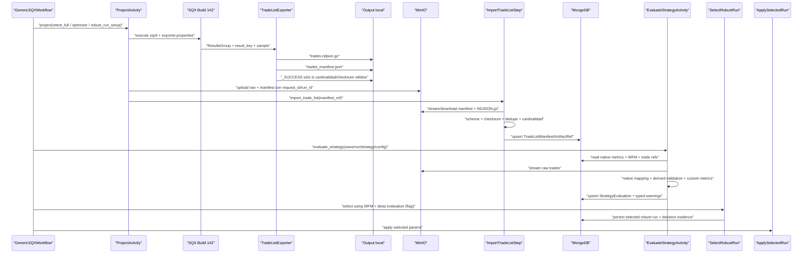

# Echo Forge - Cierre de Etapa 4

> [!info]+ Echo Forge - Cierre de Etapa 4
> **Padre:** [[Echo Forge]] · **Área:** [[Echo]] · **Estado:** completed · **Prioridad:** P1 · **Sprint:** [[A26Q2S7]]
> Proyecto de agente para investigar, definir y ejecutar el cierre técnico real de la Etapa 4: listado bruto de operaciones, evaluación profunda post-optimizer, integración de warnings y validación completa.

## 🎯 Objetivo

- Determinar el alcance real que falta para cerrar la Etapa 4, separando el núcleo operativo ya validado de las capacidades que siguen incompletas o solo existen como debug/agregados.
- Diseñar un plan de implementación completo, verificable y ejecutable por otro agente, con trazabilidad desde los objetos de trades de StrategyQuant hasta la decisión final de selección robusta.
- Implementar posteriormente el alcance aprobado: exportación contractual del listado de operaciones, evaluación profunda en Go, integración al selector/warnings, pruebas y validación E2E.

## 📊 Estado actual

- **2026-08-06 — decisión explícita del owner: EF-G29 está deprecado y no es un bug.** La combinación `config.json: NDX/H1` con templates `.cfx` de `XAUUSD_darwinex` es **intencional** en los fixtures de prueba; el instrumento efectivo de esas pruebas se configura desde el JSON y no representa una afirmación de producción. No implementar `PatchChartIdentity`, mapeos `instrument → símbolo`, validaciones `IDENTITY_MISMATCH`, ni cuarentena por este motivo. El hallazgo de la auditoría queda clasificado como lectura incorrecta del alcance de test, no como corrupción de datos. La igualdad byte a byte de `retester_test.cfx` y `reretester_test.cfx` tampoco es un blocker: el re-retest recibe la estrategia ya mutada por Robust Run y se verifica en el output SQX.
- **2026-08-06 — confirmación del owner: EF-G30, EF-G32, Robust Run y TradeList están corregidos y desplegados en los workers.** El estado anterior que los describía como sólo working tree queda obsoleto. EF-G30 preserva identidad completa de TradeList y EF-G32 conserva una activity remota autosuficiente; ambos se consideran `resolved/deployed` para este ciclo. La falla local de `go test` no descalifica el despliegue ya confirmado. EF-G31 permanece diferido y no bloquea este ciclo.
- **2026-08-04 — BUG ROBUST RUN CORREGIDO Y VALIDADO EN SQX BUILD 142.** La causa era el matching manual contra `<Variables>`: allí solo viven `MagicNumber` y señales, mientras los optimizables están en `<Param>`. El fix KISS usa `StrategyBase.transformToVariables(...)`, aplica cada `testParameter` con `Variable.setFromString(...)`, vuelve a números y falla si falta alguno. Canary real en Zeus sobre `example_flow_69` (`26% OOS / 7 runs`): SQX reportó 7 parámetros aplicados y el XML final quedó `Fast=9`, `Slow=14`, `Smooth=12`, `ExitAfterBars=13`, `ProfitTarget=212.75`, `StopLoss=24.5`, `TrailingStopCoef=5.29`, `MagicNumber=888111`. Simulator de 62 fuentes y regression fail-fast: OK. `Snippets.jar` y sources de Zeus quedaron respaldados antes del canary.
- **2026-08-04 — ROLLOUT ROBUST RUN COMPLETADO EN HERA Y KRONOS.** Ambos hosts Build `142.2399` compilaron el fix contra su SDK local con exit `0`; se respaldaron sources, `Snippets.jar`, `automator.properties` y databanks antes de modificar. Se actualizaron únicamente `SQ/CustomAnalysis/EchoForgeRobustRunExporter.class` y `SQ/Utils/StrategyParametersHelperV2.class` dentro de `internal/libs/Snippets.jar`; `unzip -t` pasó y el JAR quedó con solo esas dos entradas cambiadas. Canary real con `26% OOS / 7 runs`, `MagicNumber=888111`: el log reportó `EchoForgeRobustRun: applied 7 parameters`, cada host dejó exactamente un output y cero procesos residuales. Diff físico exacto en ambos: `Fast 8→9`, `Slow 17→14`, `Smooth 9→12`, `ExitAfterBars 16→13`, `ProfitTarget 185→212.75`, `StopLoss 35→24.5`, `TrailingStopCoef 4.6→5.29`, `MagicNumber 11111→888111`. Respaldos: Hera `/home/kor/sqx/user/extend/Snippets/.echoforge-backups/20260803_225918`; Kronos `/home/kor/sqx/user/extend/Snippets/.echoforge-backups/20260803_230916`. El rollout cierra únicamente el bug Robust Run; el proyecto completo de cierre de Etapa 4 permanece abierto.
- **2026-08-04 — CERTIFICACIÓN FORMAL DEL SUBALCANCE ROBUST RUN: `CLOSED / PASS`.** Revalidación independiente contra HEAD `994ffdb` y los tres workers: sources canónicos idénticos; JAR efectivo presente; respaldos disponibles; Hera/Kronos conservan evidencia textual de compilación, instalación, integridad, canary y diff; Zeus conserva artefactos antes/después y el diff físico; flow 71 confirma que la mutación persiste en `04_optimizer_robust`, `05_reretester` y `.mq5`. Este certificado cubre selección WFM, aplicación completa/fail-fast de `testParameters`, `MagicNumber`, `.sqx` robusto y rollout. `EF-G28/30/32` y el smoke TradeList son downstream independientes y no reabren Robust Run. Ver [[2026-08-04-echo-forge-robust-run-closure-certificate]].
- **EF-G28 — resuelto por configuración existente, sin desarrollo adicional.** El flujo ya ejecuta `05_reretester` con `reretester_test.cfx` después de `04_optimizer_robust`; `trade_list_exporter` recibe `source_folder: "05_reretester"` y construye su key desde esa etapa. Ese retest es el productor de órdenes para TradeList. No crear `05_pips_retester`, un sexto proyecto Java ni wiring adicional; el smoke E2E comprobará el conteo real como parte de su verificación normal.
- **EF-G30 — bloqueante de integridad para el smoke, no de disponibilidad.** La activity Go escribe sólo `wave_key`, `stage`, `source_folder` y `output_dir`. El plugin usa defaults para `request_id`, `run_id`, `variant`, `instrument`, `timeframe` y `source_timezone`; por eso puede exportar y aun así producir NDJSON/manifest con identidad falsa (`req-001`, `run-001`, `EURUSD`). El fix mínimo es completar esas propiedades desde la identidad ya disponible en Go antes del smoke.
- **EF-G32 — contrato remoto, implementación lista para integrar.** El cambio `2f6708e` elimina el salto de un path local entre dos activities: `trade_list_exporter` ahora debe exportar, publicar en MinIO y hacer upsert Mongo en la misma activity. Está en Review y debe desplegarse/ejercitarse en el smoke porque, sin él, Temporal puede ejecutar el upsert en otro worker donde el NDJSON local no existe.
- **2026-08-06 — smoke E2E PASS: listo para Review.** La wave `test/example_flow_75/v1` completó `00_configs → 06_trade_list` sobre la release `0.2.39` en Zeus, Hera y Kronos. Para 8 estrategias, NDJSON gzip, manifest, MinIO y Mongo conciliaron exactamente `trade_count`, tamaños y SHA-256; `exporter.properties` conservó identidad real sin defaults, y el resultado Temporal no transportó paths locales. EF-G28, EF-G30, EF-G32 y Robust Run quedan validados en runtime. MEN-1 (`_SUCCESS` remoto), MEN-2 (nombre del bucket) y MEN-3 (acceso desde laptop) son deudas documental/operacional no bloqueantes. La tarea puente pasa a Review; sólo el owner decide Done.

### Roadmap operativo de cierre — actualizado desde la auditoría 2026-08-06

| Hito | Alcance | Gate de salida |
| --- | --- | --- |
| 1. Smoke E2E | `PASS` en la wave `test/example_flow_75/v1`; 8 estrategias conciliadas entre Go, MinIO y Mongo. | NDJSON gzip, manifest SHA válido, objeto MinIO, documento Mongo e igualdad de counts/sizes/SHA. |
| 2. Reconciliación y Review | `PASS`; la evidencia no exige cuarentena por TradeList. | Tarea puente del padre en Review; el owner decide Done de Etapa 4. |

**Fuera de este roadmap:** EF-G17 y Robust Run están cerrados en su alcance; la fecha de reoptimización de EF-G17 sigue explícitamente provisional según su SPEC y no bloquea estos hitos.

- **Planificación v0.9 con Fase 0 reabierta de forma acotada (45%)**: `OD-M01..OD-M10` y `OD-A01..OD-A02` están cerradas por el owner o resolución técnica. La evidencia previa de F0 se reutiliza, pero T0.1/T0.2/T0.4 deben incorporar el quinto proyecto independiente y la composición dinámica antes de aceptar G0.
- El núcleo de Robust Run, `ApplySelectedRun`, persistencia y exporters desacoplados está operativo; el cierre formal sigue abierto por el contrato de trades, la evaluación profunda y la integración tipada de warnings.
- **Registro fijo dinámico obligatorio**: los proyectos autorizados son `EchoForgeOverviewExporter`, `EchoForgeWFMExporter`, `EchoForgeTradeListExporter`, `EchoForgeMT5Exporter` y `EchoForgeRobustRunExporter`. Cada uno es independiente y seleccionable desde la definición dinámica del flujo. `EchoForgeAutomator` está deprecado.
- La evaluación no debe recalcular indiscriminadamente lo que SQX ya entrega. El plan distingue métricas `SQX_NATIVE`, métricas `DERIVED_VALIDATION` y métricas `CUSTOM_RJARA`; Go conserva el valor nativo como canónico y calcula solo las derivadas/custom necesarias.
- Las métricas custom confirmadas por el owner incluyen: R:R sobre los 12 meses operativos anteriores a la última operación cerrada; recuperación de la peor racha de meses negativos; cobertura del peor año histórico por el mejor mes histórico; y mejora de la curva optimizada frente a la curva base. La jerarquía de fuentes, fórmulas y reglas confirmadas está en §3 y §7; no quedan propuestas de negocio sujetas a aprobación antes de F0.
- Cada fase de implementación es pequeña, entregable y bloqueante: no se inicia la siguiente hasta que la evidencia de la fase anterior sea validada y la compuerta quede aceptada por el owner.
- `EchoForgeOverviewExporter` ya inspecciona trades y puede emitir `trades_debug.ndjson`, pero esa salida es opcional y no es contrato oficial. `EchoForgeWFMExporter` usa trades para agregados y mantiene deshabilitado el listado bruto.
- La nota original de [[Echo Forge - Etapa 4]] y el proyecto padre contienen afirmaciones históricas contradictorias (`80–95%` vs `100%`). Para este cierre manda la evidencia inventariada en §2; no se marcará Etapa 4 cerrada antes del DoD de §13.

### Estado de Fase 0 (corte 2026-07-23 22:50 CLT, pase v0.9 — F0 cerrada, G0 accepted)

- **Task Status**:
  - `F0-T0.1` Baseline → **cerrado v0.9**: §1.6 Inventario arquitectónico añadido (whitelist efectiva, clases Java, cadena runtime, contrato dinámico exacto `task.type × task.folder × exporter_project × config × source_folder`, matriz empírica TradeList por contexto). `EchoForgeAutomator` confirmado **inactivo runtime** (lookup muerto en `verify_metadata.go:44‑50`; plugin Overview v1.1.0 emite `"exporter":"EchoForgeOverviewExporter"`).
  - `F0-T0.2` Contratos → **cerrado v0.9**: paquete `OD-A01/OD-A02` aplicado a las 3 SPECs (`FEAT-SQX-JAVA-EXPORTER-PLUGIN`, `FEAT-SQX-METRICS-CONTRACT`, `FEAT-SQX-STRATEGY-EVALUATION`) — 5 proyectos congelados, `EchoForgeAutomator` deprecado, contrato dinámico exacto documentado en cada SPEC.
  - `F0-T0.3` Spike SQX → **cerrado v0.9**: ejecutado spike real contra Zeus Build 142 con `javap` sobre `SQTradingLib.jar` + `SQDataLib.jar`. Reconciliación firmada en `phase0/spike_javap/SHA256SUMS.txt`. 8 campos promovidos de `unsupported/not_tested` a `supported` (commission, swap, MAE, MFE, sample_type, direction, pnl_basis, gross_profit nativo). Validaciones contra el checklist: conteos FULL/IS/OOS segregables (`OrdersList.filter`), portfolio identity (`OrdersList.identifier`), timezone (`Symbol.timezone=EET`, `sourceTimezone=Etc/UCT`), nulls (`MAE/MFE nullable si la strategy no los calcula`).
  - `F0-T0.4` Cierre G0 → **cerrado v0.9**: 7 `.cfx` firmados (4 EchoForge + 3 waves) en `phase0/fixtures/cfx/SHA256SUMS.txt`; smoke semántico ejecutado (versión `142.2399` consistente, `FullDatabank1` idéntico al nombre del proyecto, schema `Results + input + output` independiente por proyecto, waves con símbolo `XAUUSD_darwinex` periodo `2016-01-04 → 2026-06-04` y `sampleName="Custom"` fitness `NetProfit + ComputeFromStrategyResult`). Handoff final en `specs/FEAT-SQX-METRICS-CONTRACT/phase0/G0_HANDOFF.md`. Gate G0 → **`review`** (no autoaceptado; sólo el owner lo promueve a `accepted`).
- **Progreso**: 4/4 tareas cerradas. **G0 aceptado por el owner** el 2026-07-23 a las 22:50 CLT (14/14 ítems ✅ del checklist G0).
- **Bitácora**:
  - **2026-07-23 — F0-T0.3 v0.9 (Spike SQX real)**: transferencia de `SQTradingLib.jar` y `SQDataLib.jar` a Zeus, ejecución de `javap` contra clases `ResultsGroup`, `OrdersList`, `Order`, `Trade`, `SampleTypes`, `Directions`, `PlTypes`, `WalkForwardMatrixResult`. Confirmado: `ResultsGroup.orders()` devuelve `OrdersList` (no `Object`); `Order` (no `stockchart.Trade`) es la clase correcta para TradeList v1; `OrdersList.filter(field, direction, sampleType)` segrega FULL/IS/OOS oficialmente; `SampleTypes` no incluye `FUTURE`; `OrdersList.identifier` da portfolio identity. Artefactos firmados en `specs/FEAT-SQX-METRICS-CONTRACT/phase0/spike_javap/`.
  - **2026-07-23 — F0-T0.4 v0.9 (Cierre G0 + handoff)**: captura de 7 `.cfx` desde Zeus (4 EchoForge + `builder_test`/`retester_test`/`optimizer_test`) con SHA-256 firmados; smoke semántico extraído de `config.xml` + `CustomAnalysis-Task1.xml` + task XMLs; capability report ampliado con §7 (reconciliación del spike real SQX: 6 hallazgos v0.8 → v0.9 + matriz de 10 campos financieros + 4 validaciones de coherencia) y §9 (entregables v0.9 actualizados); `G0_HANDOFF.md` con diff vs v0.8 + checklist 13/14 + tareas puente a F1/F2 + comando de aceptación del owner; SHA-256 maestro del paquete G0 en `phase0/SHA256SUMS.txt`.

## 🧭 Alcance y límites

### Dentro del alcance

- Auditoría de código, configuración, contratos, fixtures, tests, historial Git y documentación relevante.
- Implementación de `EchoForgeTradeListExporter` como quinto proyecto fijo independiente, invocable desde la definición dinámica del flujo igual que los demás `EchoForge*`.
- Contrato de datos del listado de operaciones: identidad, wave/run, estrategia, etapa/celda, período, timestamps, precios, dirección, PnL y campos adicionales justificados por las métricas.
- Persistencia, versionado, idempotencia, particionamiento físico en MinIO/MongoDB, límites de tamaño y trazabilidad.
- Evaluación profunda post-optimizer: R:R, Win%, recovery de drawdown, estacionalidad mensual, comparación de curvas y cualquier métrica adicional que el PRD/SPEC exija.
- Integración determinista con el selector robusto y el gestor transversal de warnings.
- Tests unitarios, integración, fixtures, E2E, observabilidad, fallbacks explícitos y rollout.

### Fuera del alcance inmediato

- Contratos de ingesta de Echo Core y publicación/attach de MT5 de Etapas 8-10.
- Backtracking adaptativo, lineage finalista y `WaveReporting` de Etapas 5 y 7, salvo interfaces necesarias para no romper el pipeline.
- Migración de repositorio, salvo que la investigación determine que bloquea materialmente la implementación.

## ✅ Tareas

> [!note]+ Ownership y tarea puente
> Este es un proyecto de agente. La tarea puente humana vive en [[Echo Forge]]. La nota de este proyecto es el planificador único del trabajo delegado.

> [!example]- Fuente de tareas — editar / mover de estado aquí
> - [x] Auditar estado real, código, tests, contratos, artefactos y documentación; distinguir HEAD, cambios locales, stubs y reportes #owner/agent #type/research #area/echo
> - [x] Reconciliar el alcance original y clasificar cada gap como done, partial, replaced, missing o blocked #owner/agent #type/research #area/echo
> - [x] Diseñar arquitectura, contrato de trades, integración Go/Temporal, tests, rollout y DoD #owner/agent #type/research #area/echo
> - [x] Cerrar con el owner `OD-M01..OD-M10`; `OD-M03`, `OD-M05` y `OD-M10` quedaron aprobadas y las demás decisiones están resueltas/reclasificadas en §3/§7 #owner/agent #type/supervision #area/echo
> - [-] **Fase 0** — Plan contractual supersedido por el cierre runtime consolidado; evidencia G0 conservada para trazabilidad #owner/agent #type/research #area/echo
> - [-] **Fase 1** — Plan histórico supersedido; no se requiere como gate separado para el cierre actual #owner/agent #type/dev #area/echo
> - [x] **Fase 2** — `EchoForgeTradeListExporter`, registro dinámico y smoke SQX integrados y desplegados #owner/agent #type/dev #area/echo
> - [x] **Fase 3** — Transporte MinIO, import/persistencia Go/Mongo y contrato remoto validados E2E #owner/agent #type/dev #area/echo
> - [-] **Fase 4** — Métricas custom/derivadas y warnings quedan como trabajo posterior, no bloqueante para este cierre #owner/agent #type/dev #area/echo
> - [-] **Fase 5** — Integración tipada de warnings queda como trabajo posterior, no bloqueante para este cierre #owner/agent #type/dev #area/echo
> - [x] **Fase 6** — E2E real, rollout y reconciliación completados con resultado `PASS` #owner/agent #type/dev #area/echo
> - [x] [[Echo Forge - Trade List Export Contrato Remoto]] PR [#50](https://github.com/xKoRx/symphony/pull/50) integrado en la release desplegada #owner/me #type/supervision #area/echo
> - [x] **Bugfix RobustRun** — aplicar los `testParameters` del run WFM seleccionado a la estrategia mediante la API nativa de variables de SQX Build 142, fallar ante aplicación incompleta y verificar input→output #owner/agent #type/dev #area/echo
> - [x] **Rollout RobustRun Hera/Kronos** — desplegar con respaldo del `Snippets.jar` efectivo, ejecutar canary real en ambos hosts y adjuntar diff de los siete parámetros + MagicNumber #owner/agent #type/dev #area/echo
> - [x] **Certificar cierre RobustRun** — reconciliar código, tests, deploy, canaries Zeus/Hera/Kronos, flow 71 y límites downstream; estado final `CLOSED / PASS` #owner/agent #type/supervision #area/echo
> - [x] **EF-G28** — resuelto por el `05_reretester`/`reretester_test.cfx` ya declarado: TradeList consume `source_folder: 05_reretester`; no crear etapa ni proyecto adicional #owner/agent #type/dev #area/echo
> - [x] **EF-G30** — identidad completa de `exporter.properties` corregida y desplegada en los workers; no se aceptan defaults de identidad #owner/agent #type/dev #area/echo
> - [x] **EF-G32** — contrato remoto autosuficiente corregido y desplegado: export → MinIO → Mongo sin paths locales entre activities #owner/agent #type/dev #area/echo
> - [-] **EF-G29** — **DEPRECADO A PROPÓSITO.** `XAUUSD_darwinex` en los `.cfx` es una configuración intencional de los fixtures controlada por el JSON de pruebas; no es bug, no es corrupción, no requiere patch, validación ni cuarentena #owner/agent #type/admin #area/echo
> - [-] **EF-G31** — diferido por owner: release trazable del plugin, prioridad baja y fuera del ciclo bloqueante actual #owner/agent #type/admin #area/echo
> - [x] **Evidencia runtime + Smoke E2E + cuarentena** — PASS sobre `00_configs → 06_trade_list`; TradeList reconcilia Go/MinIO/Mongo y no aporta evidencia para cuarentena histórica #owner/agent #type/dev #area/echo
> - [x] **Cierre** — Etapa 4 y tarea puente aceptadas por el owner con evidencia runtime completa #owner/agent #type/supervision #area/echo

## 🔁 Handoff entre agentes

1. El plan v0.9 reutiliza la investigación previa, pero F0 está reabierta por la corrección arquitectónica; esta nota es el planner único.
2. Minimax M3 recibe el prompt de §15 más **un solo** bloque de despacho de §15.1.
3. Cada agente ejecuta únicamente F0, F1, F2, F3, F4, F5 o F6 y deja su gate en `review`.
4. El owner revisa la evidencia; si acepta, el estado del gate se persiste como `accepted`.
5. Recién entonces se abre un agente/contexto nuevo con el bloque de la fase siguiente.
6. La entrega final llega a `Review`; solo el owner decide `enforce` final, cierre de la tarea puente y Done de la Etapa 4.

## 🧪 Prompt maestro original de investigación — referencia histórica

> [!warning]
> No usar este bloque para ejecutar fases. Minimax M3 debe recibir exclusivamente el prompt de §15 más un bloque de §15.1.

```text
Actúa como Principal Software Architect, investigador técnico y responsable de planificación de implementación para Echo Forge (SQX Adaptive E2E Pipeline).

Tu misión en esta fase NO es implementar código. Debes investigar profundamente el estado real del sistema y producir un plan de implementación completo, detallado y ejecutable por un segundo agente (Minimax 3M).

## Contexto

Repositorio principal:
- `/Users/rodrigojara/go/src/github.com/xKoRx/symphony`
- Área principal: `sqx/`
- El vault contiene el proyecto `Echo Forge` y la nota de cierre `Echo Forge - Cierre de Etapa 4`.

La Etapa 4 tiene un núcleo operativo ya validado: selección/persistencia de Robust Run, `ApplySelectedRun`, aplicación de parámetros/Magic Number, exportación MT5 y flujo desacoplado de exporters. El alcance pendiente de cierre es la evaluación profunda post-optimizer, cuyo insumo principal debe ser el listado bruto de operaciones de StrategyQuant.

Hay una posible confusión que debes resolver con evidencia, no asumir:
- `EchoForgeOverviewExporter` ya encuentra trades y puede emitir `trades_debug.ndjson` bajo configuración.
- `EchoForgeWFMExporter` usa trades internamente para métricas y resultados mensuales, pero deshabilita el listado bruto.
- La documentación menciona `TradeListExporter` como pendiente.
- `evaluate_wfm` ya evalúa WFM y warnings, pero no necesariamente consume un dataset completo de operaciones para R:R, recovery de DD, estacionalidad y curvas.

## Reglas de investigación

1. Inspecciona primero el estado real del repositorio: branch, commits recientes, cambios locales, archivos no trackeados, versiones y artefactos. No borres, resetees, hagas checkout destructivo, reescribas commits ni sobrescribas cambios locales.
2. Distingue siempre entre `HEAD`, cambios locales sin commit, artefactos generados, código de producción, stubs de test, scripts y documentación. Indica qué evidencia pertenece a cada categoría.
3. Usa como jerarquía de verdad: código y tests ejecutables > configuración y contratos > reportes de implementación > notas de roadmap. Si hay contradicción, documenta ambas fuentes y decide qué debe verificarse.
4. Busca por símbolos y contratos, no solo por nombres de archivos. Traza llamadas, formatos, rutas, claves lógicas, wave/run/request ID y fronteras Java-Go-MinIO-MongoDB-Temporal.
5. No inventes campos, umbrales, definiciones matemáticas ni requisitos de negocio. Si falta una decisión, márcala como `OPEN DECISION` y propone opciones con trade-offs.
6. No implementes nada. No edites archivos. Puedes ejecutar comandos de inspección y tests read-only si no alteran el working tree; reporta comandos y resultados.
7. El plan debe ser agnóstico del agente que lo ejecutará, pero suficientemente concreto para que Minimax 3M pueda implementarlo sin reinterpretar el alcance.

## Investigación obligatoria

### A. Estado y alcance

- Inspecciona `git status`, branch, commits relevantes y versiones.
- Lee las notas del vault relacionadas con Echo Forge y Etapa 4.
- Revisa PRD, RFC, SPECs y reportes de implementación realmente existentes.
- Construye una tabla: requisito original | evidencia actual | estado (done/partial/replaced/missing/blocked) | fuente | acción requerida.
- Determina si `.cfx` sigue siendo un gap real o si la restauración automática en Go lo reemplazó; no lo cierres sin evidencia.

### B. Pipeline actual de datos

Traza de extremo a extremo:

`SQX ResultsGroup/Result/trades -> Java exporter -> NDJSON/archivo -> MinIO -> import Go -> MongoDB -> evaluate/selector -> ApplySelectedRun -> artefactos finales`

Para cada salto documenta:
- clase, función, activity, workflow y archivo;
- formato exacto de entrada/salida;
- identificadores de correlación y particionamiento;
- condiciones de error, retry, idempotencia y fallback;
- límites de tamaño, truncamiento o pérdida de datos;
- qué sucede con WFM IS/OOS/Full y con el período futuro.

### C. Exportación del listado bruto de operaciones

Determina con evidencia si conviene:

1. convertir `trades_debug.ndjson` en contrato oficial;
2. extender `EchoForgeOverviewExporter`;
3. extender `EchoForgeWFMExporter`;
4. crear un `TradeListExporter` dedicado;
5. combinar exporters por responsabilidad sin duplicar extracción.

Compara alternativas por acoplamiento a SQX, compatibilidad con portfolios, build headless, volumen, mantenibilidad, reejecución e idempotencia.

Define un contrato propuesto con JSON/NDJSON de ejemplo y versionado. Incluye como mínimo, solo si la API real los soporta:
- `schema_version`, `wave_key`, `run_id`, `request_id`, `strategy_id`, `stage`, `cell_key`;
- período y origen del resultado;
- entry/exit timestamp;
- entry/exit price;
- dirección;
- gross/net profit, fees/commission/swap si existen;
- trade index y orden estable;
- instrument/timeframe y timezone si existen;
- campos opcionales para MAE/MFE, duración y etiquetas.

Define explícitamente:
- si se exportan trades IS, OOS, Full o todos con `sample_type`;
- cómo se evita mezclar resultados de distintas celdas/runs;
- cómo se manejan portfolios y estrategias sin WFM;
- comportamiento cuando faltan precios/timestamps/PnL;
- duplicados, orden determinista y reintentos;
- retención, compresión, tamaño máximo y seguridad de los artefactos.

### D. Evaluación profunda en Go

Diseña cada métrica con fórmula, unidad, fuente, período y edge cases:
- R:R;
- Win%;
- profit factor si aplica;
- recovery factor / recovery de drawdown;
- drawdown máximo y curva de equity;
- estacionalidad mensual;
- estabilidad IS/OOS/Full;
- comparación de curvas y degradación;
- cantidad y frecuencia de trades.

Para cada métrica indica:
- si se calcula por trade, período, estrategia, celda o wave;
- si necesita capital inicial, balance, equity o solo PnL;
- cómo trata cero trades, pérdidas cero, DD cero, NaN, infinitos, datos incompletos y outliers;
- cómo se versiona la fórmula;
- qué threshold/config se necesita y quién debe aprobarlo.

### E. Integración con selección y warnings

Traza dónde debe entrar la evaluación profunda:
- antes o después de `evaluate_wfm`;
- antes de `select_robust_run`;
- como activity independiente o parte de una activity existente;
- qué datos persiste y qué lee el selector;
- cómo se combinan warnings WFM y warnings profundos;
- cómo se preserva determinismo de Temporal y se evita telemetría no determinista en workflows;
- qué errores son retryable y cuáles non-retryable;
- cómo se mantiene request_id/run_id/lineage.

Incluye pseudoflujo del workflow y contratos de activities.

### F. Tests y validación

Diseña una matriz completa:
- tests unitarios Java del extractor con Result/ResultsGroup reales o stubs honestos;
- tests de schema/fixtures NDJSON;
- tests unitarios Go de cada métrica y edge case;
- tests de persistencia MinIO/MongoDB;
- tests de integración Java-Go;
- tests de workflow Temporal;
- E2E con datos reales o fixture representativo;
- regresión para portfolios, estrategias sin WFM, trades faltantes y reintentos;
- validación de artefactos, métricas y warnings.

No uses “100% coverage” como sustituto de evidencia funcional. Define asserts de negocio y invariantes.

### G. Operación y rollout

Define:
- estrategia de compatibilidad con waves/artifacts antiguos;
- feature flags o modo shadow si corresponde;
- migración/backfill si corresponde;
- despliegue de plugin Java y worker Go;
- smoke test y criterios de rollback;
- dashboards/logs/metrics/traces necesarios;
- límites de performance y paralelismo;
- riesgos de duplicación de archivos, claves MinIO, stale Mongo documents y mismatches de WFM.

## Entregable requerido

Entrega un documento de planificación con esta estructura exacta:

1. Resumen ejecutivo y conclusión sobre qué falta realmente.
2. Estado actual verificado, con tabla `done/partial/replaced/missing/blocked`.
3. Alcance, no-alcance y decisiones abiertas.
4. Arquitectura actual y arquitectura objetivo.
5. Diagrama de secuencia del flujo de datos.
6. Contratos de datos propuestos con ejemplos NDJSON/JSON.
7. Definiciones matemáticas de métricas y reglas de warnings.
8. Plan de implementación por fases ordenadas por dependencias.
9. Mapa archivo por archivo y símbolo por símbolo: qué crear, modificar o no tocar.
10. Plan de tests, fixtures y validación E2E.
11. Plan de despliegue, observabilidad, migración y rollback.
12. Riesgos, supuestos y decisiones que requieren respuesta humana.
13. Definition of Done y checklist de aceptación.
14. Lista final de tareas atómicas para Minimax 3M, cada una con objetivo, archivos, precondiciones, implementación, tests y evidencia esperada.
15. Prompt de ejecución para Minimax 3M.

Cada afirmación importante debe tener una fuente: archivo/línea, test, commit, SPEC o gap explícito. No presentes una hipótesis como hecho.

## Criterio de calidad

El plan está listo solo si otro agente puede implementarlo sin volver a descubrir el sistema, sin duplicar exporters, sin inventar contratos y sin decidir de manera implícita la semántica de las métricas. Si alguna decisión no puede resolverse con la evidencia disponible, déjala claramente bloqueada y especifica exactamente qué dato humano o externo la desbloquea.
```

## 🗺️ Plan canónico de implementación v0.9

> [!warning]+ Regla de ejecución por fases
> Esta sección reemplaza al chat como fuente durable del plan. Cada fase es un encargo independiente. El agente ejecutor debe detenerse al completar su gate, actualizar tareas/estado/bitácora y esperar aceptación humana antes de iniciar la fase siguiente. No agrupar dos fases en una misma implementación aunque quede contexto disponible.
>
> Las descripciones cortas de §8 son el roadmap. Los **Paquetes de ejecución autónomos** de §8.1.1–§8.7 son la fuente canónica para implementar. El ejecutor no debe redescubrir el alcance ni redistribuir responsabilidades entre fases.

### 1. Resumen ejecutivo y conclusión sobre qué falta realmente

La Etapa 4 tiene completo el eje `evaluate_wfm → select_robust_run → apply_selected_run → MT5 export`, pero **no** el sistema de evaluación profunda que el negocio espera. Faltan cuatro capacidades conectadas:

1. un contrato oficial y completo de operaciones cerradas, separado de `trades_debug.ndjson`;
2. su transporte idempotente Java → archivo → MinIO → Go → MongoDB;
3. un catálogo ejecutable que distinga lo que SQX ya calcula de lo que Echo Forge deriva o calcula como regla custom del owner;
4. warnings tipados y su integración shadow/enforced con selección robusta.

No se debe “calcular todo de nuevo en Go”. La regla objetivo es:

| Clase | Autoridad | Conducta de Echo Forge |
|---|---|---|
| `SQX_NATIVE` | valor reportado por SQX para un resultado/sample/stage concreto | ingerir, normalizar nombre/unidad y conservar como canónico; no reemplazarlo con un cálculo propio |
| `DERIVED_VALIDATION` | fórmula estándar necesaria para comparar períodos/orígenes o auditar el dato nativo | calcular en Go con `formula_version`; no sustituir silenciosamente al valor SQX; persistir delta/reconciliación |
| `CUSTOM_RJARA` | criterio propio de selección confirmado por Rodrigo | calcular en Go exactamente sobre la ventana y fórmula documentadas; nunca atribuirlo a SQX |

Esta separación ya está alineada con el non-goal existente “no recalcular métricas que SQX ya provee” ([Strategy Evaluation SPEC §7](file:///Users/rodrigojara/go/src/github.com/xKoRx/symphony/specs/FEAT-SQX-STRATEGY-EVALUATION/SPEC.md#L210)) y corrige el plan anterior, que trataba varias métricas nativas como si necesariamente fueran cálculos propios.

**Conclusión arquitectónica:** crear `EchoForgeTradeListExporter` como quinto proyecto fijo SQX, pequeño e independiente, reutilizando un `TradeExtractionService` común a nivel de código sin alojarse dentro de Overview/WFM/RobustRun. El flujo dinámico decide cuándo ejecutarlo y qué output previo consume mediante configuración explícita. `trades_debug.ndjson` queda como diagnóstico no contractual. MinIO conserva el NDJSON comprimido como evidencia raw; MongoDB conserva manifest, referencias, resúmenes, métricas y warnings, no arrays gigantes de trades.

### 2. Estado actual verificado, con tabla `done/partial/replaced/missing/blocked`

Baseline auditado:

- rama `master`, HEAD `7e511ff` (`ok`), alineada a `origin/master` al investigar;
- working tree de `symphony` sucio: cambios productivos locales, documentación, artefactos generados, JAR/classes trackeados eliminados y numerosos archivos no trackeados. Nada de eso pertenece automáticamente a esta implementación;
- manifest/deploy local observado en `0.1.130`, mientras HEAD contenía una versión anterior; no inferir que el estado local está publicado;
- tests read-only: `go test -count=1 ./core/wfm ./core/robust` pasó. `go test -count=1 ./activities/worker ./workflows` pasó en workflows y falló en tres tests de `ApplySelectedRun` por escrituras relativas bloqueadas por sandbox, no por un assert funcional del negocio;
- no se ejecutó el build Java porque `build.sh` borra `target/` y el repo ya tenía artefactos locales eliminados.

| Requisito original | Evidencia actual | Estado | Fuente | Acción requerida |
|---|---|---:|---|---|
| Selección/persistencia Robust Run | Activity, dominio, índices y tests existentes | `done` | [robust_activity.go](file:///Users/rodrigojara/go/src/github.com/xKoRx/symphony/sqx/activities/worker/robust_activity.go), [metadata-mongo/robust.go](file:///Users/rodrigojara/go/src/github.com/xKoRx/symphony/sqx/adapters/metadata-mongo/robust.go) | no rediseñar |
| `ApplySelectedRun`, parámetros y magic number | flujo productivo y verificación histórica | `done` | [generic_workflow.go §apply](file:///Users/rodrigojara/go/src/github.com/xKoRx/symphony/sqx/workflows/generic_workflow.go#L655), [EchoForgeRobustRunExporter.java](file:///Users/rodrigojara/go/src/github.com/xKoRx/symphony/sqx/exporter-plugin/src/SQ/CustomAnalysis/EchoForgeRobustRunExporter.java) | mantener regresión |
| Export MT5 desacoplado | exporter y activity presentes | `done` | [EchoForgeMT5Exporter.java](file:///Users/rodrigojara/go/src/github.com/xKoRx/symphony/sqx/exporter-plugin/src/SQ/CustomAnalysis/EchoForgeMT5Exporter.java), [generic_workflow.go](file:///Users/rodrigojara/go/src/github.com/xKoRx/symphony/sqx/workflows/generic_workflow.go#L755) | no mezclar con evaluación |
| `trades_debug.ndjson` | opcional, mínimo, sin lineage/sample/fees, errores silenciosos | `partial` | [Overview exporter L96-L126](file:///Users/rodrigojara/go/src/github.com/xKoRx/symphony/sqx/exporter-plugin/src/SQ/CustomAnalysis/EchoForgeOverviewExporter.java#L96), [L367-L412](file:///Users/rodrigojara/go/src/github.com/xKoRx/symphony/sqx/exporter-plugin/src/SQ/CustomAnalysis/EchoForgeOverviewExporter.java#L367) | mantener solo debug y crear contrato oficial |
| extracción WFM Full/IS/OOS | `filterWithClone` obtiene los tres samples y usa Full para monthly | `partial` | [WFM exporter L325-L344](file:///Users/rodrigojara/go/src/github.com/xKoRx/symphony/sqx/exporter-plugin/src/SQ/CustomAnalysis/EchoForgeWFMExporter.java#L325), [L550-L572](file:///Users/rodrigojara/go/src/github.com/xKoRx/symphony/sqx/exporter-plugin/src/SQ/CustomAnalysis/EchoForgeWFMExporter.java#L550) | extraer vía servicio común, sin duplicar |
| listado bruto desde WFM | código comentado y hard-disable de args | `missing` | [WFM exporter L335-L342](file:///Users/rodrigojara/go/src/github.com/xKoRx/symphony/sqx/exporter-plugin/src/SQ/CustomAnalysis/EchoForgeWFMExporter.java#L335), [L1048-L1073](file:///Users/rodrigojara/go/src/github.com/xKoRx/symphony/sqx/exporter-plugin/src/SQ/CustomAnalysis/EchoForgeWFMExporter.java#L1048) | no reactivar inline; exporter dedicado |
| proyecto `EchoForgeTradeListExporter` productivo | SPEC lo exige; clase/contrato/proyecto ejecutable no existen | `missing` | [Java Exporter SPEC L31-L41](file:///Users/rodrigojara/go/src/github.com/xKoRx/symphony/specs/FEAT-SQX-JAVA-EXPORTER-PLUGIN/SPEC.md#L31), búsqueda por símbolo en `sqx/exporter-plugin/src` | implementar en Fase 2 como quinto proyecto fijo independiente y registrarlo para composición dinámica |
| import Go de trades | importer acepta metadata/overview/WFM, no trades | `missing` | [steps.go L928-L1167](file:///Users/rodrigojara/go/src/github.com/xKoRx/symphony/sqx/activities/worker/steps/steps.go#L928) | implementar después del contrato |
| persistencia Mongo de trade list/evaluation | nombres e índices existen, no hay modelo/CRUD completos | `partial` | [adapter.go L40-L47](file:///Users/rodrigojara/go/src/github.com/xKoRx/symphony/sqx/adapters/metadata-mongo/adapter.go#L40), [L612-L723](file:///Users/rodrigojara/go/src/github.com/xKoRx/symphony/sqx/adapters/metadata-mongo/adapter.go#L612) | implementar puertos/repositorio y corregir claves por run/stage |
| WFM evaluator + warnings actuales | funciona, pero `Warnings` es `[]string` y selector penaliza strings/hardcodes | `partial` | [evaluate_wfm.go](file:///Users/rodrigojara/go/src/github.com/xKoRx/symphony/sqx/activities/worker/evaluate_wfm.go), [selector.go L11-L28](file:///Users/rodrigojara/go/src/github.com/xKoRx/symphony/sqx/core/robust/selector.go#L11) | migrar compatiblemente a warnings tipados |
| evaluación profunda | SPEC activa, código productivo no existe | `missing` | [Strategy Evaluation SPEC L116-L154](file:///Users/rodrigojara/go/src/github.com/xKoRx/symphony/specs/FEAT-SQX-STRATEGY-EVALUATION/SPEC.md#L116) | Fases 4-5 |
| métricas custom del owner | R:R, recovery mensual, año negativo, PnL, fuentes, warnings POC y algoritmo de comparación están definidos y aprobados | `partial` | respuestas owner 2026-07-23 + §3/§7 + [Metrics Contract L112-L120](file:///Users/rodrigojara/go/src/github.com/xKoRx/symphony/specs/FEAT-SQX-METRICS-CONTRACT/SPEC.md#L112) | verificar capabilities y propagar contratos en G0 |
| `.cfx` de proyectos exporters fijos | Go puede omitir download si no hay Config y los proyectos están preinstalados | `replaced` para exporters fijos | [pipeline builder](file:///Users/rodrigojara/go/src/github.com/xKoRx/symphony/sqx/activities/worker/pipeline/builder.go), configuración local auditada | smoke real por VM antes de declarar cierre |
| `.cfx` builder/retester/optimizer | Go repackea/reemplaza clases, pero error puede degradar a warning y no prueba semántica de fitness/backtest | `partial` | [project_activity.go](file:///Users/rodrigojara/go/src/github.com/xKoRx/symphony/sqx/activities/worker/project_activity.go), [[Echo Forge - Etapa 4]] | Gate separado con resultado SQX real; no decir “restauración automática” sin prueba |
| Temporal determinista | Generic workflow crea telemetría con `context.Background`; retries 0 = ilimitados | `partial` | [generic_workflow.go L43-L55](file:///Users/rodrigojara/go/src/github.com/xKoRx/symphony/sqx/workflows/generic_workflow.go#L43) | no agregar I/O/telemetría no determinista; políticas acotadas por activity |

Jerarquía aplicada: código y tests > contratos/configuración > reportes > roadmap. Por eso el `100%` del proyecto padre no cierra este proyecto: contradice el código faltante y la nota histórica.

### 3. Alcance, no-alcance y decisiones abiertas

#### Alcance

- exportación contractual de **operaciones cerradas**, no órdenes/deals sin reconciliar;
- baseline `retest_full` y variante optimizada/robust seleccionada con lineage explícito;
- samples `FULL`, `IS`, `OOS` cuando la API real los produzca sin duplicación semántica; `FUTURE`, si existe, queda segregado como audit-only;
- MinIO, import Go, referencias Mongo, catálogo de métricas, evaluación, warnings, selector, tests y rollout;
- actualización de las SPECs afectadas antes de código.

#### No-alcance

- ingesta Echo Core, attach demo MT5, backtracking completo y wave reporting final de Etapas posteriores;
- reemplazar métricas nativas SQX por clones Go;
- activar un score compuesto de “curva mejorada” sin fórmula, pesos y versión aprobados;
- evaluar operaciones abiertas o reconstruir arbitrariamente trades desde órdenes parciales;
- backfill masivo de waves históricas sin solicitud y costo aprobado.

#### Registro de decisiones de Gate G0

Estados: `CONFIRMED` viene del owner; `TECHNICAL_RESOLUTION` cierra una duda de integridad sin crear una regla de negocio; `PROPOSED_FOR_APPROVAL` queda definido para futuros cambios, pero ninguna fila vigente conserva ese estado.

| ID | Estado | Resolución vigente | Evidencia / pendiente |
|---|---|---|---|
| `OD-M01` | `CONFIRMED` | `rr_recent_max_win_loss_v1` usa exclusivamente los últimos 12 meses operativos del resultado `FULL`; no usa IS/OOS como sustituto silencioso | respuesta owner 2026-07-23 |
| `OD-M02` | `CONFIRMED` | ventana móvil `(last_trade_exit_utc - 12 meses calendario, last_trade_exit_utc]`; el ancla es la última operación cerrada del `FULL` evaluado, no la fecha de ejecución del pipeline | respuesta owner 2026-07-23; G0 debe confirmar timezone/unidad de la API |
| `OD-M03` | `CONFIRMED` | evaluar la racha contigua de meses negativos de mayor duración; empate por mayor pérdida acumulada y luego la más reciente. Medir meses hasta recuperar su pérdida acumulada, `recovery_speed_ratio`, recuperación en un mes y cobertura diagnóstica opcional del Max DD SQX | aprobación owner 2026-07-23; fórmula y clasificación en §7.5 |
| `OD-M04` | `CONFIRMED` | comparar el mejor mes de todo el histórico contra el peor año calendario histórico completo | respuesta owner 2026-07-23; año parcial queda excluido y etiquetado |
| `OD-M05` | `CONFIRMED` | contrato `CurveComparisonAlgorithm` intercambiable; algoritmo inicial `risk_adjusted_delta.v1` con Ret/DD, PF, Sharpe, SQN, Max DD y Net Profit de peso menor. Pareto NP/DD queda solo diagnóstico | aprobación owner 2026-07-23; fórmula, pesos y versionado en §7.7 |
| `OD-M06` | `TECHNICAL_RESOLUTION` | SQX nativo es autoridad para Max DD/equity/excursiones y monthly profit cuando esté disponible; trade list aporta R:R y fallback/reconciliación mensual. Nunca llamar “Max DD SQX” al DD reconstruido por closed trades | owner confirmó disponibilidad; G0 verifica métodos/unidades reales de Build 142 |
| `OD-M07` | `CONFIRMED` | toda custom usa `net_profit` después de comisión y swap; persistir `pnl_basis=net_after_commission_swap` y componentes de costo si la API los expone | respuesta owner 2026-07-23 |
| `OD-M08` | `TECHNICAL_RESOLUTION` | no es una duda de métricas: nació del requisito original de compatibilidad con portfolios. La POC evalúa estrategias individuales; portfolio se conserva como regresión de exportación y no puede mezclar componentes anónimos | prompt original §C/F; detalle §6.4 y nota explicativa posterior |
| `OD-M09` | `TECHNICAL_RESOLUTION` | no es una métrica custom: nació del requisito original de documentar el período futuro. Si SQX lo emite, se exporta/persiste separado como audit y queda excluido de métricas, warnings y selección | prompt original §B; evita leakage |
| `OD-M10` | `CONFIRMED` | POC `deep_warnings_shadow_v1`: warnings tipados y verdict `PASS/WARN/INSUFFICIENT_DATA`, sin penalty, descarte ni cambio del selector; reglas mínimas en §7.10 | owner aprobó avanzar con la POC 2026-07-23 |

No quedan decisiones humanas abiertas para iniciar Fase 0. Gate G0 permanece `pending` hasta ejecutar la prueba técnica de capabilities SQX indicada en `OD-M02/M06`, reconciliar closed trades, actualizar las tres SPECs y entregar su evidencia para aprobación. `OD-M03`, `OD-M05` y `OD-M10` no requieren aprobación adicional.

#### Registro de decisión arquitectónica de proyectos fijos

| ID | Estado | Resolución vigente | Evidencia / pendiente |
|---|---|---|---|
| `OD-A01` | `CONFIRMED` | El registro autorizado contiene cinco proyectos fijos independientes: `EchoForgeOverviewExporter`, `EchoForgeWFMExporter`, `EchoForgeTradeListExporter`, `EchoForgeMT5Exporter` y `EchoForgeRobustRunExporter`. `EchoForgeAutomator` está deprecado y no puede aparecer como proyecto, mapping, deployment target ni fallback activo. | corrección explícita del owner 2026-07-23; reemplaza la interpretación v0.8 |
| `OD-A02` | `CONFIRMED` | Los cinco proyectos son piezas pequeñas seleccionables por la definición dinámica del flujo. El workflow no impone una secuencia global ni aloja TradeList dentro de otro exporter; cada task declara proyecto, input/source y output necesarios. | definición explícita del owner 2026-07-23; F0 debe validar el contrato dinámico y la matriz de inputs/stages soportados sin inventarla |

> [!info]+ Por qué aparecieron portfolio y período futuro
> `OD-M08` no nació de una hipótesis del plan: el prompt original exigía comparar compatibilidad con portfolios, definir cómo manejarlos y cubrirlos en regresión (§C y §F del Prompt maestro). Se reclasifica como integridad de exportación/test, no como métrica custom.
>
> `OD-M09` provino de la obligación original de documentar qué sucede con WFM IS/OOS/Full y con el período futuro (§B). Se resuelve como segregación anti-leakage: audit opcional, nunca evaluación/selección. Ninguna de las dos requiere una nueva definición de negocio del owner para la POC individual.

### 4. Arquitectura actual y arquitectura objetivo

#### Actual

```text
SQX ResultsGroup
  ├─ EchoForgeOverviewExporter
  │    ├─ overview.ndjson
  │    ├─ monthly.ndjson
  │    └─ trades_debug.ndjson (opcional/no contractual)
  └─ EchoForgeWFMExporter
       └─ wfm_matrices.ndjson (usa Full/IS/OOS internamente)

Project activity
  execute_sqx → collect_results → import_metadata → upload_results
  import_metadata solo metadata/overview/WFM

MongoDB
  WFM + selección robusta
  trade_lists/strategy_evaluations: índices nominales sin implementación completa

GenericSQXWorkflow
  evaluate_wfm → select_robust_run → apply_selected_run
```

Fuentes: [Overview exporter](file:///Users/rodrigojara/go/src/github.com/xKoRx/symphony/sqx/exporter-plugin/src/SQ/CustomAnalysis/EchoForgeOverviewExporter.java), [WFM exporter](file:///Users/rodrigojara/go/src/github.com/xKoRx/symphony/sqx/exporter-plugin/src/SQ/CustomAnalysis/EchoForgeWFMExporter.java), [pipeline builder L19-L24](file:///Users/rodrigojara/go/src/github.com/xKoRx/symphony/sqx/activities/worker/pipeline/builder.go#L19), [Generic workflow L191-L755](file:///Users/rodrigojara/go/src/github.com/xKoRx/symphony/sqx/workflows/generic_workflow.go#L191).

#### Objetivo

```text
SQX ResultsGroup/Result
  → TradeExtractionService (una sola extracción/reconciliación)
      ├─ EchoForgeWFMExporter consume views Full/IS/OOS
      └─ EchoForgeTradeListExporter (proyecto fijo independiente) serializa evidencia raw
          → trades.ndjson.gz + trades_manifest.json + _SUCCESS
              → upload_results (misma ejecución Project)
                  → MinIO (raw inmutable por run)
                      → ImportTradeListStep
                          ├─ valida schema/cardinalidad/checksum/lineage
                          ├─ guarda manifest/ref/resumen en Mongo
                          └─ stream hacia core/evaluation
                              → StrategyEvaluation versionada
                                  → warnings tipados
                                      → selector en shadow/enforced
                                          → ApplySelectedRun sin cambio de responsabilidad
```

Decisión de responsabilidad:

- **Dedicado como proyecto fijo** `EchoForgeTradeListExporter`: volumen, lifecycle, configuración y fallos independientes.
- **Compartido** `TradeExtractionService`: evita que Overview, WFM y TradeList inventen tres formas de identificar un trade.
- **No** convertir `trades_debug` en oficial: su formato es insuficiente y su error se ignora.
- **No** incrustar raw trades en cada celda WFM: multiplica volumen y mezcla evidencia con agregados.
- **No** escribir arrays completos en Mongo: riesgo de BSON 16 MiB ya reconocido en [adapter.go L24-L33](file:///Users/rodrigojara/go/src/github.com/xKoRx/symphony/sqx/adapters/metadata-mongo/adapter.go#L24).
- **No** reactivar `EchoForgeAutomator`: Robust Run y Magic Number pertenecen a `EchoForgeRobustRunExporter`.
- **No** hardcodear el orden de los cinco proyectos: la composición pertenece al contrato dinámico del flujo.

### 5. Diagrama de secuencia del flujo de datos



Orden obligatorio: `evaluate_wfm → evaluate_strategy → select_robust_run → apply_selected_run`. La evaluación profunda es una activity independiente para aislar I/O, retries y versionado; el workflow solo encadena resultados deterministas.

### 6. Contratos de datos objetivo con ejemplos NDJSON/JSON

La estructura, identidad, samples, nulabilidad y responsabilidades aquí descritas están congeladas. F0 solo reemplaza placeholders de versión/capability con evidencia de Build 142; no rediseña el contrato.

#### 6.1 Identidades

- `wave_key`: campaña/wave.
- `request_id`: correlación de solicitud/reanudación.
- `run_id`: ejecución física del stage; no derivarlo implícitamente de `request_id`.
- `strategy_id`: identidad estable.
- `stage`: `retest_full`, `optimizer`, `robust_run_setup` o `tick_retest`.
- `variant`: `baseline` u `optimized`.
- `result_key`: key real SQX.
- `cell_key`: solo cuando el resultado corresponde a celda/run WFM.
- `sample_type`: `FULL`, `IS`, `OOS` y `FUTURE` solo si SQX lo emite explícitamente; nunca inferido desde carpeta. `FUTURE` es audit-only.
- `trade_key`: hash determinista del scope + secuencia/campos estables.

Clave física confirmada:

```text
waves/{wave_key}/requests/{request_id}/runs/{run_id}/strategies/{strategy_id}/stages/{stage}/variants/{variant}/samples/{sample_type}/trades.v1.ndjson.gz
```

No se debe implementar esta key sin reconciliarla con el key builder MinIO actual; Gate G2 debe probar que no crea dobles slash ni pierde la clave lógica.

#### 6.2 Línea NDJSON v1

```json
{
  "schema_version": "trade.v1.0.0",
  "wave_key": "wave_015",
  "request_id": "req-...",
  "run_id": "run-...",
  "strategy_id": "EURUSD_H1_001",
  "stage": "optimizer",
  "variant": "optimized",
  "result_key": "WF Matrix - 10 runs, 20% OOS",
  "cell_key": "runs=10|oos=20",
  "sample_type": "OOS",
  "trade_index": 42,
  "trade_key": "sha256:...",
  "entry_time_utc": "2026-01-12T10:15:00Z",
  "exit_time_utc": "2026-01-12T13:45:00Z",
  "entry_price": 1.0852,
  "exit_price": 1.0871,
  "direction": "LONG",
  "gross_profit": 190.0,
  "net_profit": 184.5,
  "commission": -4.0,
  "swap": -1.5,
  "pnl_basis": "net_after_commission_swap",
  "instrument": "EURUSD",
  "timeframe": "H1",
  "source_timezone": "UTC",
  "duration_seconds": 12600,
  "mae": null,
  "mfe": null,
  "labels": {}
}
```

En el contrato normalizado, `commission` y `swap` son contribuciones firmadas al PnL (`net_profit = gross_profit + commission + swap` cuando esos son todos los costos): negativo reduce y positivo aumenta. El adapter SQX debe demostrar y normalizar la convención real en G0. Comisión/swap/MAE/MFE/volume son opcionales hasta que el spike confirme API; ausencia se representa como `null` + capability en manifest, nunca como `0` inventado.

#### 6.3 Manifest v1

```json
{
  "schema_version": "trade-manifest.v1.0.0",
  "plugin_version": "<resolved-at-build>",
  "metrics_catalog_version": "<resolved-by-F0>",
  "wave_key": "wave_015",
  "request_id": "req-...",
  "run_id": "run-...",
  "strategy_id": "EURUSD_H1_001",
  "stage": "optimizer",
  "variant": "optimized",
  "result_key": "WF Matrix - 10 runs, 20% OOS",
  "cell_key": "runs=10|oos=20",
  "sample_type": "OOS",
  "period_start_utc": "2025-01-01T00:00:00Z",
  "period_end_utc": "2025-12-31T23:59:59Z",
  "trade_count": 148,
  "closed_trade_count": 148,
  "source_order_count": 296,
  "artifact": {
    "content_type": "application/x-ndjson",
    "content_encoding": "gzip",
    "sha256": "...",
    "compressed_bytes": 12345,
    "uncompressed_bytes": 98765
  },
  "capabilities": {
    "net_profit": true,
    "gross_profit": true,
    "commission": true,
    "swap": true,
    "mae": false,
    "mfe": false,
    "native_equity_curve": false
  },
  "status": "complete",
  "errors": []
}
```

Invariantes:

- un artefacto contiene un solo `{wave, request, run, strategy, stage, variant, result, cell, sample}`;
- orden determinista por `exit_time_utc`, luego `entry_time_utc`, luego `trade_index`, con tie-break por `trade_key`;
- reintento del mismo scope produce el mismo contenido/checksum o falla con `content_mismatch`;
- un `trade_key` repetido dentro del artefacto es error; entre samples puede repetirse solo si el manifest declara la relación;
- `trade_count` debe coincidir con líneas válidas; `_SUCCESS` no se escribe si hay truncamiento;
- portfolio sin `component_strategy_id` verificable queda `unsupported_portfolio_identity`, no evaluado;
- estrategia sin WFM exporta `FULL` con `cell_key=null`; no inventa IS/OOS;
- período futuro puede exportarse como `sample_type=FUTURE` solo cuando SQX lo identifica explícitamente; queda excluido de métricas, warnings y selector.

#### 6.4 Persistencia Mongo

`trade_lists` guarda manifest/ref/resumen, no trades completos:

```json
{
  "trade_list_key": "sha256(scope+schema)",
  "wave_key": "wave_015",
  "request_id": "req-...",
  "run_id": "run-...",
  "strategy_id": "EURUSD_H1_001",
  "stage": "optimizer",
  "variant": "optimized",
  "cell_key": "runs=10|oos=20",
  "sample_type": "OOS",
  "artifact_key": "waves/.../trades.v1.ndjson.gz",
  "artifact_sha256": "...",
  "trade_count": 148,
  "schema_version": "trade.v1.0.0",
  "status": "complete"
}
```

Índice único objetivo: `trade_list_key`; índices de consulta por `{wave_key, run_id, strategy_id, stage, variant, sample_type}`. No reutilizar sin más el índice actual `{wave_key,strategy_id,stage}` porque mezclaría runs/variants/samples.

### 7. Definiciones matemáticas de métricas y reglas de warnings

#### 7.1 Catálogo por origen

| Métrica | Clase | Fuente canónica | ¿Go calcula? | Ventana |
|---|---|---|---|---|
| `ret_dd`, `profit_factor`, `sharpe_ratio`, `sqn_score`, `cagr`, `net_profit`, `drawdown`, `trades`, `win_rate`, `expectancy`, `stagnation` | `SQX_NATIVE` si están disponibles | resultado SQX exacto + sample/stage | solo normaliza; opcional audit shadow | período reportado por SQX |
| `monthly_performance` | `SQX_NATIVE` si SQX lo expone; `DERIVED_VALIDATION` si se agrega desde trades | SQX primero, derivado etiquetado | sí, solo cuando falta o para reconciliar | por mes UTC de cierre |
| `closed_trade_equity`, `max_closed_trade_drawdown` | `DERIVED_VALIDATION` | PnL cerrado acumulado | sí | scope del artefacto |
| `rr_recent` | `CUSTOM_RJARA` | trade list filtrada | sí | 12 meses móviles anclados en última operación |
| `max_losing_month_streak`, `losing_streak_recovery_months` | `CUSTOM_RJARA` | monthly SQX o trade list reconciliada | sí | histórico operativo completo |
| `best_month_covers_negative_year`, `negative_year_coverage_ratio` | `CUSTOM_RJARA` | resultados mensuales/anuales | sí | histórico completo; años calendario completos |
| `optimized_vs_baseline_*` | mixto: deltas SQX + custom | stages emparejados | sí, comparación; no recalcula inputs nativos | misma intersección temporal |
| `oos_stability_*` | WFM existente / `DERIVED_VALIDATION` | WFM runs IS/OOS | ya existe parcialmente | celdas/runs |

Fuente de clasificación nativa actual: [Metrics Contract §4.1](file:///Users/rodrigojara/go/src/github.com/xKoRx/symphony/specs/FEAT-SQX-METRICS-CONTRACT/SPEC.md#L91). La SPEC ya define `rr_ratio` y recovery como `internal_calc`, pero debe cambiar nombre/semántica si la ventana custom no coincide; una métrica no puede cambiar semántica sin nuevo nombre ([Metrics Contract L132-L138](file:///Users/rodrigojara/go/src/github.com/xKoRx/symphony/specs/FEAT-SQX-METRICS-CONTRACT/SPEC.md#L132)).

#### 7.2 R:R custom reciente

Nombre confirmado: `rr_recent_max_win_loss_v1`.

```text
W = trades cerrados dentro de evaluation_window con net_profit > 0
L = trades cerrados dentro de evaluation_window con net_profit < 0
rr_recent = max(net_profit de W) / abs(min(net_profit de L))
window_end = max(exit_time_utc de trades cerrados del scope)
window_start = window_end - 12 meses calendario
evaluation_window = (window_start, window_end]
```

- unidad: ratio;
- nivel: estrategia + run + stage + variant, `sample_type=FULL`;
- insumo: PnL por trade; no requiere capital inicial;
- ventana confirmada: últimos 12 meses operativos anclados en la última operación cerrada del resultado `FULL` de estrategia/run/stage/variant; no usa `now`, fecha de wave ni fin configurado del backtest;
- si `FULL` no está disponible, resultado `null` + `missing_full_sample`; no fallback implícito a OOS/IS;
- si el scope contiene menos de 12 meses operativos, calcular sobre el histórico disponible y persistir `window_coverage_months` + `partial_window=true`; F0 debe validarlo con fixture, no decidir otra política;
- `last_trade_exit_utc` debe provenir de una operación cerrada válida; sin trades no existe ventana y el resultado es `null`;
- cero trades, cero wins o cero losses: `value=null`, `missing_reason` explícito; jamás `Inf`;
- breakeven no entra a W/L;
- outlier: no se recorta, porque el máximo es parte intencional de la fórmula; se conserva evidencia del trade ganador/perdedor;
- warning `rr_recent_low_v1`: solo después de aprobar threshold y sample/window.

No reutilizar `rr_ratio` histórico si conserva período Full; crear nombre nuevo evita cambiar semántica retroactivamente.

#### 7.3 Win rate y Profit Factor

Si SQX los entrega para el mismo stage/sample/window, son canónicos. Cálculo derivado solo como audit o fallback etiquetado:

```text
win_rate_derived = 100 * count(pnl > 0) / count(all closed trades)
profit_factor_derived = sum(pnl > 0) / abs(sum(pnl < 0))
```

- breakeven cuenta en denominador de win rate;
- sin trades: `null`;
- sin pérdidas: PF derivado `null` + `no_losing_trades`; no persistir infinito/999;
- reconciliación: persistir `{sqx_value, derived_value, delta_abs, delta_pct, status}` con tolerancia aprobada, nunca sobrescribir SQX.

#### 7.4 Equity cerrada, drawdown y recovery estándar

```text
equity_0 = initial_capital si existe; si no, 0 y curve_basis="cumulative_closed_pnl"
equity_i = equity_(i-1) + net_profit_i
peak_i = max(equity_0..equity_i)
drawdown_i = peak_i - equity_i
max_closed_trade_drawdown = max(drawdown_i)
```

- con base `0`, se comparan formas/deltas absolutos de PnL; no calcular DD% sin capital;
- no representa MAE/intratrade; debe llamarse `closed_trade_drawdown`, no “SQX max drawdown”;
- recovery estándar del máximo DD: desde el peak que origina el DD hasta el primer punto posterior al trough donde `equity >= peak`;
- sin recovery: `null` + `unrecovered_at_period_end`;
- jerarquía confirmada: Max DD, equity/excursiones y monthly profit nativos SQX son canónicos cuando Build 142 los expone para el mismo scope; la curva closed-trade es validación/fallback con nombre distinto;
- para métricas mensuales se prefiere el listado mensual SQX; el agregado desde `net_profit` por operación se conserva para reconciliación o fallback;
- G0 debe registrar el método/campo SQX, unidad, timezone, sample y cardinalidad real. La afirmación del owner confirma que la capacidad existe, no reemplaza la prueba de API;
- si hay curva nativa SQX, persistirla con `curve_basis=native_equity` y no mezclar ambas.

#### 7.5 Recovery custom de peor racha mensual

Decisión confirmada `OD-M03`: `max_losing_month_streak_v1`, `losing_streak_recovery_months_v1`, `losing_streak_recovery_speed_v1` y la evidencia del primer mes de recuperación.

```text
monthly_pnl[m] = Σ net_profit de trades con exit UTC en mes m
streaks = todas las secuencias contiguas con monthly_pnl < 0
critical_streak = streak con mayor cantidad de meses;
                  empate -> mayor abs(streak_loss);
                  empate -> la más reciente
streak_loss = abs(Σ monthly_pnl durante la racha)
post_streak_cumulative[k] = Σ monthly_pnl de los k meses posteriores
recovery_months = menor k >= 1 donde post_streak_cumulative[k] >= streak_loss
recovery_speed_ratio = recovery_months / streak_months
first_month_coverage_ratio = max(monthly_pnl[mes siguiente], 0) / streak_loss
recovered_in_one_month = first_month_coverage_ratio >= 1
```

Esto equivale a recuperar el equity inmediatamente anterior a la racha, pero expresa directamente la intención del owner: agosto–enero suma `-2.000` y febrero aporta `+2.500` → `recovery_months=1`, `first_month_coverage_ratio=1,25`, `recovered_in_one_month=true`.

Clasificación confirmada:

```text
FAST       recovery_months == 1
ACCEPTABLE streak_months > 1 && recovery_months < streak_months
ACCEPTABLE streak_months == 1 && recovery_months == 1
SLOW       recovery_months >= streak_months
UNRECOVERED no existe k al final del histórico
```

Persistir fechas, meses de racha, pérdida acumulada, recovery, ratios y `recovered`. El scope es el histórico operativo completo. Decisión confirmada con `OD-M03`: mes sin trades es `NEUTRAL`, no se agrega a la pérdida y rompe la contigüidad negativa.

Complemento nativo, sin mezclar semánticas:

```text
native_max_dd_recovery_months = recovery SQX del Max DD, si existe
first_recovery_month_max_dd_coverage_ratio =
    max(monthly_pnl[mes siguiente a critical_streak], 0) / sqx_native_max_dd
```

El segundo ratio es una señal positiva adicional: `>=1` significa que el primer mes posterior a la peor racha alcanza a cubrir incluso el Max DD nativo de la estrategia. No reemplaza el recovery estándar de Max DD.

Warnings POC confirmados: `losing_month_streak_slow_recovery_v1` para `SLOW` y `losing_month_streak_unrecovered_v1` para `UNRECOVERED`. `FAST`/`ACCEPTABLE` son evidencia positiva, no warnings. Si nunca recupera, `recovery_months=null`; jamás inventar un número.

#### 7.6 Año negativo cubierto por mejor mes

Nombres confirmados: `negative_year_coverage_ratio_v1` y `best_month_covers_negative_year_v1`.

```text
annual_pnl[y] = Σ monthly_pnl de los 12 meses calendario presentes
negative_years = años completos con annual_pnl < 0
worst_negative_year_loss = abs(min(annual_pnl de negative_years))
best_month_profit = max(monthly_pnl > 0 dentro del universo aprobado)
coverage_ratio = best_month_profit / worst_negative_year_loss
covers = coverage_ratio >= 1
```

- año calendario incompleto: excluir del mínimo y persistirlo como parcial para auditoría;
- no hay año negativo: `not_applicable`, sin warning;
- no hay mes positivo: ratio `0` si existe año negativo;
- `best_month_profit` usa todo el histórico confirmado por el owner, aunque el mes sea posterior al peor año: esta métrica describe capacidad histórica, no predicción sin look-ahead;
- warning POC `negative_year_not_covered_by_best_month_v1` cuando `coverage_ratio < 1`.

Esto es distinto de la regla SPEC actual `|peor mes del año| > mejor mes del año` ([Strategy Evaluation SPEC L93-L103](file:///Users/rodrigojara/go/src/github.com/xKoRx/symphony/specs/FEAT-SQX-STRATEGY-EVALUATION/SPEC.md#L93)); ambas reglas pueden coexistir con IDs distintos, no confundirse.

#### 7.7 Comparación curva optimizada vs curva base

Precondición: emparejar misma estrategia y **misma intersección temporal**, `baseline=retest_full` vs `optimized=run seleccionado`, con PnL basis y sample equivalentes. Si las ventanas no coinciden, resultado `not_comparable`.

La comparación no puede asumir que más Net Profit es mejor. Una optimización puede reducir beneficio y aun así producir una estrategia superior si baja sustancialmente DD, mejora PF/Sharpe/SQN y suaviza su perfil de riesgo. Por eso se separan:

1. `optimized_quality_snapshot`: valores nativos/custom de la estrategia optimizada;
2. `metric_deltas`: comparación explicable contra baseline;
3. `comparison_score`: resultado del algoritmo seleccionado;
4. `diagnostics`: cuadrante Net Profit/DD y cualquier trade-off, sin convertirlo en verdad principal.

##### 7.7.1 Contrato de algoritmo intercambiable

Decisión confirmada `OD-M05`: Fase 4 implementa un registry estático de algoritmos. La wave selecciona un `algorithm_id` conocido; no inyecta fórmulas arbitrarias.

```text
CurveComparisonAlgorithm
  ID() -> string
  RequiredMetrics() -> []MetricRequirement
  Compare(baseline, optimized, AlgorithmConfig) -> CurveComparisonResult
```

Todo algoritmo declara:

- `algorithm_id` y `algorithm_version`;
- métricas requeridas, dirección (`higher/lower`) y pesos;
- normalizador y política de missing data;
- parámetros efectivos y `algorithm_config_key`;
- score, contribución por métrica, deltas, diagnósticos y razones de `not_comparable`.

La persistencia y los warnings consumen el contrato común, no un algoritmo concreto. Cambiar a un método más robusto debe requerir agregar una implementación/version y elegir su ID, sin modificar workflow, storage ni selector.

Configuración inicial confirmada:

```json
{
  "curve_comparison": {
    "algorithm_id": "risk_adjusted_delta.v1",
    "parameter_set_id": "default-shadow.v1",
    "mode": "shadow"
  }
}
```

`parameter_set_id` referencia pesos compilados/versionados. La POC no permite pesos libres por wave: evita que dos waves usen el mismo nombre con semántica distinta.

##### 7.7.2 Algoritmo inicial confirmado: `risk_adjusted_delta.v1`

El algoritmo mide **mejora ajustada por riesgo respecto del baseline**, no rentabilidad bruta absoluta:

| Componente | Fuente | Dirección | Peso confirmado | Rationale |
|---|---|---:|---:|---|
| `ret_dd` | SQX native | higher | `25%` | relación retorno/riesgo principal |
| `profit_factor` | SQX native | higher | `20%` | calidad de ganancias vs pérdidas |
| `sharpe_ratio` | SQX native | higher | `20%` | retorno ajustado por variabilidad |
| `sqn_score` | SQX native | higher | `15%` | calidad estadística del sistema |
| `drawdown` | SQX native | lower | `15%` | castiga directamente profundidad de DD |
| `net_profit` | SQX native | higher | `5%` | conserva señal económica sin dominar el score |

Ret/DD ya incorpora retorno y DD, por lo que Net Profit queda deliberadamente bajo. Una optimización con menor beneficio puede superar `50` si la mejora de calidad/riesgo compensa de forma verificable.

Normalización simétrica confirmada:

```text
symmetric_signal(opt, base, direction):
    si opt == 0 y base == 0 -> 0
    raw = (opt - base) / (abs(opt) + abs(base))
    si direction == lower -> raw = -raw
    return clamp(raw, -1, 1)

weighted_signal = Σ(weight[m] * symmetric_signal(opt[m], base[m], direction[m]))
risk_adjusted_delta_score = 50 + 50 * weighted_signal
```

- rango `0..100`; `50` significa balance relativo neutro;
- cada contribución se persiste como `weight * signal`; el total debe reconciliar exactamente;
- si falta una métrica requerida o cambia moneda/período/sample, resultado `not_comparable`; v1 no redistribuye pesos;
- valores raw permanecen visibles: el score jamás reemplaza PF, Sharpe, SQN, DD o Net Profit;
- no existe threshold de selección ni warning por score hasta calibrarlo con waves reales;
- una tolerancia/banda neutral futura debe pertenecer a otro `parameter_set_id`, no quedar hardcodeada.

Ejemplo de resultado:

```json
{
  "algorithm_id": "risk_adjusted_delta.v1",
  "parameter_set_id": "default-shadow.v1",
  "status": "comparable",
  "score": 56.2,
  "components": [
    {"metric": "ret_dd", "baseline": 2.1, "optimized": 2.8, "weight": 0.25, "signal": 0.1429, "contribution": 0.0357},
    {"metric": "profit_factor", "baseline": 1.35, "optimized": 1.52, "weight": 0.20, "signal": 0.0592, "contribution": 0.0118},
    {"metric": "sharpe_ratio", "baseline": 0.9, "optimized": 1.2, "weight": 0.20, "signal": 0.1429, "contribution": 0.0286},
    {"metric": "sqn_score", "baseline": 2.0, "optimized": 2.4, "weight": 0.15, "signal": 0.0909, "contribution": 0.0136},
    {"metric": "drawdown", "baseline": 3000, "optimized": 1800, "weight": 0.15, "signal": 0.25, "contribution": 0.0375},
    {"metric": "net_profit", "baseline": 12000, "optimized": 10500, "weight": 0.05, "signal": -0.0667, "contribution": -0.0033}
  ],
  "diagnostics": {
    "net_profit_dd_quadrant": "LOWER_PROFIT_LOWER_DD"
  }
}
```

Los números del ejemplo son **ilustrativos**. El score exacto debe calcularse desde componentes; el fixture de implementación no puede copiar este total sin reconciliarlo.

##### 7.7.3 Evolución prevista sin romper contratos

Algoritmos futuros posibles, fuera del alcance inicial:

- `downside_first.v1`: prioriza DD, recovery, stagnation y Ulcer Index;
- `curve_shape.v1`: usa equity mensual alineada, consistencia, pendiente y duración de drawdowns;
- `oos_projection.v1`: solo después de tener dataset histórico y validación predictiva; nunca vender un score heurístico como “precisión/proyección”.

Pareto Net Profit/DD se conserva como diagnóstico `net_profit_dd_quadrant`, no como veredicto. El primer algoritmo es heurístico y explicable; no afirma predecir performance futura.

#### 7.8 Frecuencia, estacionalidad y estabilidad IS/OOS/Full

- `trade_count`: nativo SQX; derivado como cardinalidad auditada.
- `avg_trades_per_month`: `N / covered_calendar_months`; se cuentan los meses calendario desde el mes del primer exit hasta el mes del último exit, ambos inclusive. No se prorratean meses parciales; se persisten `partial_first_month` y `partial_last_month` para audit.
- monthly: agrupar por `exit_time_utc`; no usar timezone local como hoy hace Overview ([L634-L664](file:///Users/rodrigojara/go/src/github.com/xKoRx/symphony/sqx/exporter-plugin/src/SQ/CustomAnalysis/EchoForgeOverviewExporter.java#L634)).
- IS/OOS/Full: almacenar por sample; no sumar IS+OOS y llamarlo Full si SQX entrega Full.
- estabilidad: WFM existente conserva su autoridad. Métricas profundas agregan comparaciones, no reemplazan `EvaluateNeighborhood` ni reglas OOS actuales.

#### 7.9 Versionado y edge cases transversales

- `metrics_catalog_version` para nombres/unidades/origen;
- `formula_version` por métrica custom/derivada;
- `ruleset_version` + parámetros efectivos por evaluación;
- jamás persistir NaN/Inf: `null` + `missing_reason`;
- toda métrica persiste `source`, `stage`, `variant`, `sample_type`, `period_start/end`, `pnl_basis`, `formula_version`;
- para métricas custom, `net_profit` significa beneficio después de comisión y swap. Preferir el neto nativo SQX; si solo entrega componentes, reconstruir como `gross_profit + signed_commission + signed_swap` únicamente después de verificar signos/unidades en G0;
- thresholds, severity, weights y hard filters son configuración de wave aprobada, no constantes silenciosas;
- un dato incompleto puede producir `DATA_QUALITY` warning; no convertir error técnico de import en warning de negocio.

#### 7.10 POC de warnings profundos

Decisión confirmada `OD-M10`: `deep_warnings_shadow_v1`. Es deliberadamente pequeña y **no se agrega a `WFMEvaluation.Warnings`**, porque hoy el selector descuenta `0.05` por cualquier string y penalties mayores para otros patrones ([selector.go L11-L28](file:///Users/rodrigojara/go/src/github.com/xKoRx/symphony/sqx/core/robust/selector.go#L11)). La POC persiste warnings profundos en `StrategyEvaluation` y genera observabilidad; la decisión legacy no cambia.

Contrato mínimo:

```json
{
  "warning_id": "deep.recovery.slow.v1",
  "category": "RECOVERY",
  "severity": "WARNING",
  "metric_id": "losing_streak_recovery_months_v1",
  "observed": 7,
  "expected": "< 6",
  "evidence": {
    "streak_start": "2025-08",
    "streak_end": "2026-01",
    "streak_months": 6,
    "streak_loss": 2000,
    "recovery_months": 7
  },
  "formula_version": "losing_streak_recovery.v1",
  "ruleset_version": "deep_warnings_shadow.v1"
}
```

Reglas POC confirmadas:

| Rule ID | Condición | Severity POC | Resultado |
|---|---|---|---|
| `deep.recovery.slow.v1` | recovery existe, pero no cumple `FAST/ACCEPTABLE` de §7.5 | `WARNING` | mostrar racha, pérdida, meses y ratio |
| `deep.recovery.unrecovered.v1` | la racha crítica no recupera antes del fin histórico | `CRITICAL` | `recovery_months=null`, no número artificial |
| `deep.negative_year.not_covered.v1` | existe peor año negativo completo y `coverage_ratio < 1` | `WARNING` | mostrar peor año, mejor mes y ratio |
| `deep.curve.algorithm_degraded.v1` | el algoritmo configurado de §7.7 emite degradación material según un parameter set aprobado | `WARNING` | deshabilitada hasta completar G0 y calibrar el parameter set en shadow; luego muestra score y componentes |

No se crea warning de R:R hasta que el owner defina qué valor considera bajo. Tampoco se crea warning por score de curva: el score primero debe calibrarse en shadow.

Verdict POC:

```text
INSUFFICIENT_DATA = falta un input contractual necesario o stages no son comparables
WARN              = existe al menos un warning profundo
PASS              = todas las reglas aplicables se evaluaron sin warning
```

- la POC no produce `FAIL`, `REJECT`, penalty ni descarte;
- `not_applicable` —por ejemplo, no existe año negativo— no es warning ni dato insuficiente;
- un checksum inválido, NDJSON corrupto o timeout es error de activity retryable/non-retryable según su clase, nunca business warning;
- el agregado inicial es `{verdict, warning_count_by_severity, warnings[]}`. No existe `warning_score`;
- después de observar waves reales, el owner puede aprobar `deep_warnings_v2` con thresholds, penalties o hard filters. Ese cambio requiere nuevo `ruleset_version` y una fase explícita `shadow → warn → enforce`.

### 8. Plan de implementación por fases ordenadas por dependencias

Cada fase debe ejecutarse en un contexto/agente separado. La salida de una fase es la precondición de la siguiente.

#### Fase 0 — Contratos y prueba de realidad SQX

**Objetivo:** congelar semántica antes de código, demostrar qué representa `rg.orders()` en SQX Build 142 y probar que el flujo puede incorporar un quinto proyecto independiente mediante configuración dinámica sin hardcodear su posición.

Incluye:

- propagar las decisiones confirmadas `OD-M01..OD-M10` y verificar capabilities técnicas `OD-M02/M06`;
- actualizar `FEAT-SQX-METRICS-CONTRACT`, `FEAT-SQX-STRATEGY-EVALUATION` y `FEAT-SQX-JAVA-EXPORTER-PLUGIN`;
- crear JSON Schema/golden preliminar;
- ejecutar un spike real con estrategia simple, WFM y portfolio como regresión de identidad/exportación; la POC de métricas evalúa estrategias individuales;
- reconciliar `SQX stats trades` vs objetos extraídos vs operaciones cerradas;
- documentar capabilities reales: PnL net/gross, fees, timezone, result/sample keys, equity nativa;
- inventariar proyectos/configuración activa, demostrar `OD-A01/OD-A02`, detectar cualquier referencia runtime a `EchoForgeAutomator` y definir el contrato que permitirá crear `EchoForgeTradeListExporter` como quinto proyecto independiente en F2.

**No incluye:** clases productivas, MinIO, Mongo, warnings runtime.

**Gate G0:**

- tabla de métricas y fórmulas custom aprobada por el owner y reflejada en las SPECs;
- cada métrica tiene nombre, clase, fórmula/fuente, unidad, ventana, edge cases y versión;
- fixture demuestra inequívocamente trades cerrados y sample/result correcto;
- si `rg.orders()` son legs/deals y no trades cerrados, se documenta la reconciliación antes de Fase 1;
- el inventario distingue cuatro proyectos actuales + `EchoForgeTradeListExporter` target `missing`; las SPECs congelan el registro objetivo de cinco y cualquier Automator activo bloquea G0 hasta contar con una migración explícita;
- el handoff documenta el contrato dinámico `{project, source/input, output, stage/context}` y la matriz comprobada de inputs/stages soportados por TradeList, sin fijar un orden global;
- código/config actual demuestra si agregar un nombre de proyecto requiere solo configuración o además cambios acotados de registry/task parsing; la acción exacta queda asignada a F2;
- working tree baseline queda capturado sin tocar cambios ajenos.

**Pausa:** no iniciar Fase 1 sin aceptación explícita G0.

#### Fase 1 — Contrato ejecutable y kernel de extracción Java

**Objetivo:** convertir la prueba G0 en DTOs y un kernel testeable de operaciones cerradas; todavía sin exporter productivo, integración SQX ni build del plugin.

Incluye:

- JSON Schema, golden fixtures y casos inválidos;
- DTOs normalizados y `TradeExtractionService`;
- reconciliación explícita entre orders/legs y closed trades;
- scope `{result_key, cell_key, sample_type}`, orden y clave lógica;
- tests Java honestos contra golden y fixture real/sanitizado.

**No incluye:** `EchoForgeTradeListExporter`, cambios a Overview/WFM, build/JAR, upload MinIO, importer Go, métricas o warnings.

**Gate G1:**

- JSON Schema y golden son ejecutables y cubren scope, opcionales y rechazo;
- `trade_count` concilia con la definición aprobada en G0;
- dos extracciones idénticas generan DTOs y orden idénticos;
- el kernel distingue de forma probada operación cerrada de leg/deal;
- compila en un directorio temporal sin tocar `target/`;
- entrega un handoff inequívoco para que Fase 2 conecte el exporter, sin código productivo adelantado.

#### Fase 2 — Proyecto TradeList productivo, registro dinámico y build

**Objetivo:** materializar el contrato de Fase 1 como artefactos locales deterministas de SQX y probar el plugin en Build 142.

Incluye:

- `TradeExtractionService` común;
- clase `EchoForgeTradeListExporter` y proyecto fijo SQX `EchoForgeTradeListExporter/`;
- manifest, NDJSON, orden, dedupe, cardinalidad y error visible;
- views `FULL/IS/OOS` cuando apliquen;
- portfolio y estrategia sin WFM según contrato;
- migración controlada de Overview/WFM al servicio común sin cambiar sus agregados;
- build/package opt-in que no borra ni instala automáticamente;
- tests de regresión y smoke headless en SQX Build 142.

**No incluye:** upload MinIO, importer Go, MongoDB, métricas o warnings.

**Gate G2:**

- artifacts locales concuerdan con schema/golden y están scopeados;
- reejecución genera mismo checksum;
- ninguna excepción de export queda silenciada;
- WFM sigue generando los mismos agregados al usar el servicio común;
- build headless y smoke SQX Build 142 aprobados;
- el inventario runtime contiene los cinco proyectos fijos de `OD-A01`, TradeList puede ejecutarse en forma aislada y no ejecuta Automator;
- instalación y rollback del JAR están documentados y probados sin autoinstalación implícita.

#### Fase 3 — Transporte MinIO, import streaming y referencias Mongo

**Objetivo:** transportar el output ya generado por Fase 2, validarlo en Go y persistir lineage/referencias sin almacenar el array completo de trades.

Incluye:

- extensión de `upload_results` para manifest/NDJSON.gz/_SUCCESS;
- key builder canónico con request/run/stage/variant/sample;
- checksum, tamaño máximo, compresión y retención;
- marcador de completitud por run/exporter;
- seguridad: sin credenciales/datos sensibles en manifest/log.
- dominio/puertos `Trade`, `TradeListManifest`, `ArtifactRef`;
- import streaming gzip + schema + checksum + cardinalidad;
- CRUD/indexes por `trade_list_key` y lineage completo;
- wiring en pipeline/DI sin reejecutar el exporter;
- migración compatible de índices;
- clasificación retryable/non-retryable.

**No incluye:** fórmulas de negocio ni warnings.

**Gate G3:**

- import Java→Go con golden compartido;
- documento Mongo no contiene array completo de trades;
- reimport idempotente;
- corrupt/truncated/schema incompatible falla non-retryable;
- timeout MinIO/Mongo transitorio es retryable;
- waves antiguas sin trades no se rompen y quedan `not_available`.

#### Fase 4 — Motor de métricas y reconciliación shadow

**Objetivo:** implementar `core/evaluation` puro sin afectar selección.

Incluye:

- catálogo tipado `SQX_NATIVE/DERIVED_VALIDATION/CUSTOM_RJARA`;
- custom R:R reciente, racha mensual/recovery, cobertura año negativo y comparaciones base/opt aprobadas;
- equity cerrada y monthly UTC;
- reconciliación de win rate/PF/trade count con SQX;
- `StrategyEvaluation` persistida en modo shadow.

**No incluye:** cambiar selector, descartar o aplicar penalties.

**Gate G4:**

- tests table-driven de fórmulas y edge cases;
- mismo input/config produce resultado byte-semánticamente igual;
- ningún NaN/Inf;
- fixture manual esperado aprobado por owner;
- deltas SQX vs derived explicados; discrepancia no queda escondida;
- zero impact verificado en las estrategias seleccionadas existentes.

#### Fase 5 — Warnings tipados y selector shadow

**Objetivo:** unificar warnings WFM/profundos y simular la decisión nueva sin cambiar producción.

Incluye:

- `Warning` tipado y `WarningSet`;
- adapter temporal desde `[]string` WFM;
- `EvaluateStrategyActivity`;
- workflow `evaluate_wfm → evaluate_strategy → select`;
- selector dual: decisión legacy y decisión candidata;
- métricas/logs de diferencias.

**Gate G5:**

- replay/determinism de workflows;
- activity I/O fuera del workflow;
- retries acotados por clase;
- warning IDs deterministas, sin duplicados;
- shadow reporta diferencias por causa;
- owner aprueba ruleset/thresholds o mantiene flag en shadow.

#### Fase 6 — E2E, rollout y cierre

**Objetivo:** validar en SQX real y activar gradualmente.

Secuencia:

1. `off`;
2. `shadow` sin decisión;
3. `warn` visible, selector legacy;
4. `enforce` solo ruleset aprobado;
5. cierre documental/operacional.

**Gate G6:**

- E2E de baseline y optimizada, portfolio, sin WFM, trades faltantes y retry;
- artifacts/checksums/lineage correctos;
- métricas custom revisadas con ejemplos reales;
- dashboards/alertas operativos;
- rollback probado;
- no quedan discrepancias de cardinalidad o claves;
- tarea del proyecto pasa a Review, nunca a Done por el agente.

#### 8.1 Contrato de balance y uso por agentes

Las Fases 0–6 se ejecutan con **siete agentes/contextos separados**. Fase 0 es trabajo técnico contractual y de prueba contra SQX real —no código productivo—, pero sí tiene un paquete ejecutable para Minimax M3. Cada fase termina con su propio gate en `review`; el owner revisa la evidencia y lo cambia a `accepted` antes de despachar la siguiente.

La carga no se mide por líneas de código. Se balancea por cantidad de fronteras, incertidumbre, pruebas y riesgo operacional. Los puntos siguientes son una **estimación relativa de planificación**, no horas ni compromiso calendario:

| Fase | Paquete principal | Tareas atómicas | Carga relativa | Fronteras/riesgo dominante |
|---|---|---:|---:|---|
| 0 | contratos + capability spike SQX + fixture real | 4 | 10 | API Build 142, semántica, `.cfx`, evidencia real |
| 1 | contrato ejecutable + kernel de extracción Java | 4 | 9 | API interna SQX, closed trades vs order legs |
| 2 | exporter Java productivo + integración + build/smoke | 5 | 10 | compatibilidad headless, WFM/Overview, packaging |
| 3 | MinIO + import streaming + Mongo refs | 5 | 11 | lineage, idempotencia, tamaño, retry/error taxonomy |
| 4 | catálogo runtime + métricas + evaluación shadow | 5 | 11 | fórmulas custom, ventanas, reconciliación SQX |
| 5 | warnings tipados + Temporal + selector shadow | 5 | 11 | determinismo, compatibilidad, decisiones |
| 6 | deploy + E2E + canary + observabilidad + rollback | 5 | 10 | producción, performance y seguridad operacional |

No todas producirán el mismo LOC, pero ninguna es “maquillaje”: cada una cruza al menos una frontera real y termina con evidencia funcional propia. F0 pesa por incertidumbre y validación real, no por LOC.

**Contrato común para los siete agentes:**

1. Reciben **una sola fase** y leen solamente:
   - `## 📊 Estado actual`;
   - §3 registro de decisiones cerradas;
   - §6 contratos;
   - §7 métricas si la fase las consume;
   - su paquete autónomo §8.1.1 o §8.2–§8.7;
   - las filas de §9 y §14 asociadas a su fase;
   - §12 riesgos y §13 DoD.
2. F0 no tiene gate anterior. F1–F6 verifican que el gate anterior esté marcado `accepted` en la tabla de control y en la Bitácora. Si no, no implementan.
3. No reabren decisiones cerradas salvo evidencia ejecutable contradictoria. En ese caso registran `PLAN_CONFLICT` y se detienen.
4. No investigan “qué debería hacer la fase”: el paquete lo fija. La investigación permitida es solo la comprobación puntual indicada en `Spikes permitidos`.
5. No tocan archivos listados en `No tocar`.
6. Actualizan esta nota durante la ejecución: tarea `[/]`, evidencia, resultado de gate y handoff.
7. Terminan al cumplir o bloquear el gate. No adelantan código de la fase siguiente.

Estados de gate permitidos:

```text
pending   -> fase anterior aún no entrega
review    -> evidencia disponible, owner/agente revisor debe validar
accepted  -> siguiente fase habilitada
blocked   -> falta decisión/evidencia externa explícita
rejected  -> corregir esta fase; no avanzar
```

Control inicial de gates:

| Gate | Estado vigente | Quién lo lleva a `review` | Quién autoriza `accepted` | Habilita |
|---|---|---|---|---|
| G0 | `pending` | agente F0 | owner, tras revisar evidencia técnica/contractual | F1 |
| G1 | `pending` | agente F1 | owner, tras revisar schema/kernel/tests | F2 |
| G2 | `pending` | agente F2 | owner, tras revisar JAR/smoke/rollback | F3 |
| G3 | `pending` | agente F3 | owner, tras revisar MinIO/import/Mongo | F4 |
| G4 | `pending` | agente F4 | owner, tras revisar métricas/reconciliación/zero-impact | F5 |
| G5 | `pending` | agente F5 | owner, tras revisar warnings/replay/selector shadow | F6 |
| G6 | `pending` | agente F6 | owner, tras revisar E2E/canary/rollback; `Done` sigue siendo humano | cierre |

Una aprobación de gate valida la evidencia entregada; no autoriza adelantar la fase posterior dentro del mismo contexto. El siguiente agente empieza solo cuando el estado ya quedó persistido como `accepted`.

#### 8.1.1 Paquete autónomo Fase 0 — Contratos, capability spike y prueba de realidad

**Misión exacta**

Cerrar la brecha entre el plan y la API real de SQX Build 142. F0 debe dejar decisiones y contratos reflejados en las SPECs, un fixture real/sanitizado con reconciliación de closed trades y una matriz verificable de capabilities. No crea exporter, dominio Go, transporte, métricas runtime ni warnings.

**Precondiciones verificables**

- `OD-M01..OD-M10` están cerradas en §3/§7; no queda decisión humana de fórmula pendiente.
- `OD-A01/OD-A02` están cerradas: Automator deprecado, cinco proyectos independientes y composición dinámica desde la definición del flujo.
- Repositorio `symphony` accesible y working tree clasificado sin asumir propiedad de cambios locales.
- Existe acceso autorizado a una instalación SQX Build 142 para ejecutar el spike. Si no existe, F0 puede completar contratos/baseline, pero Gate G0 debe quedar `blocked`, nunca simular evidencia.
- F0 no requiere gate anterior.

**Lectura obligatoria, en este orden**

1. `## 📊 Estado actual`, §2, §3, §6, §7, §12 y §13 de esta nota.
2. [Metrics Contract SPEC](file:///Users/rodrigojara/go/src/github.com/xKoRx/symphony/specs/FEAT-SQX-METRICS-CONTRACT/SPEC.md), [Strategy Evaluation SPEC](file:///Users/rodrigojara/go/src/github.com/xKoRx/symphony/specs/FEAT-SQX-STRATEGY-EVALUATION/SPEC.md) y [Java Exporter SPEC](file:///Users/rodrigojara/go/src/github.com/xKoRx/symphony/specs/FEAT-SQX-JAVA-EXPORTER-PLUGIN/SPEC.md).
3. [Overview `findTrades`](file:///Users/rodrigojara/go/src/github.com/xKoRx/symphony/sqx/exporter-plugin/src/SQ/CustomAnalysis/EchoForgeOverviewExporter.java#L533), [Overview `trades_debug`](file:///Users/rodrigojara/go/src/github.com/xKoRx/symphony/sqx/exporter-plugin/src/SQ/CustomAnalysis/EchoForgeOverviewExporter.java#L367), [WFM sample/filter](file:///Users/rodrigojara/go/src/github.com/xKoRx/symphony/sqx/exporter-plugin/src/SQ/CustomAnalysis/EchoForgeWFMExporter.java#L550) y [WFM raw disable](file:///Users/rodrigojara/go/src/github.com/xKoRx/symphony/sqx/exporter-plugin/src/SQ/CustomAnalysis/EchoForgeWFMExporter.java#L1048).
4. [Stub ResultsGroup](file:///Users/rodrigojara/go/src/github.com/xKoRx/symphony/sqx/exporter-plugin/test-support/simulator/stubs/com/strategyquant/tradinglib/ResultsGroup.java), que no constituye evidencia de la API real.
5. [Fixed-project `.cfx` behavior](file:///Users/rodrigojara/go/src/github.com/xKoRx/symphony/sqx/activities/worker/steps/steps.go#L280), [runtime config writer](file:///Users/rodrigojara/go/src/github.com/xKoRx/symphony/sqx/core/runtime/config.go#L159), [project activity](file:///Users/rodrigojara/go/src/github.com/xKoRx/symphony/sqx/activities/worker/project_activity.go) y [SQX README operacional](file:///Users/rodrigojara/go/src/github.com/xKoRx/symphony/sqx/README.md#L250).
6. [Build script](file:///Users/rodrigojara/go/src/github.com/xKoRx/symphony/sqx/exporter-plugin/build.sh) y `AGENTS.md`/runbooks vigentes del repositorio antes de ejecutar comandos reales.

**Decisiones cerradas**

- SQX nativo sigue siendo autoridad; F0 observa campos/métodos/unidades y no rediseña métricas.
- El contrato oficial futuro será `trade.v1`/`trade-manifest.v1`; `trades_debug.ndjson` continúa como diagnóstico.
- El exporter productivo será un quinto proyecto fijo dedicado y reutilizará un extractor común, pero no se crea en F0.
- TradeList se selecciona dinámicamente igual que los otros `EchoForge*`; F0 no decide un orden fijo, sino que verifica su contrato de task, inputs disponibles y outputs.
- `EchoForgeAutomator` no es fallback válido aunque exista código, configuración o packaging histórico.
- El fixture representa closed trades; no se acepta `order`, `deal` o leg como equivalente sin reconciliación.
- `FULL`, `IS`, `OOS` y `FUTURE` permanecen separados. `FUTURE` es solo audit.
- Portfolio se prueba únicamente como regresión de identidad/exportación; las métricas POC son por estrategia individual.
- Campo ausente se documenta `unsupported/null`; jamás se inventa valor, firma o fallback.

**Implementación paso a paso**

1. Ejecutar y registrar baseline:
   - branch, HEAD, últimos commits, status completo y archivos no trackeados;
   - versión de Go/Java, Build 142 y checksums de JAR/proyectos usados;
   - clasificar cada evidencia como HEAD, cambio local, artifact, stub, test, producción o documentación.
2. Propagar `OD-M01..OD-M10` a las tres SPECs:
   - catálogo `SQX_NATIVE/DERIVED_VALIDATION/CUSTOM_RJARA`;
   - fórmulas/versiones/ventanas de §7;
   - contrato dedicado de trade list, samples, lineage y separación MinIO/Mongo;
   - workflow y warnings shadow sin efecto en selector;
   - `OD-A01/OD-A02`: registro de cinco proyectos, deprecación de Automator, independencia de TradeList y composición dinámica.
3. Crear evidencia durable:
   - `specs/FEAT-SQX-METRICS-CONTRACT/PHASE-0-CAPABILITY-REPORT.md`;
   - `sqx/exporter-plugin/test-support/fixtures/trades/phase0/README.md`;
   - fixtures sanitizados y una matriz machine-readable de capabilities bajo ese directorio.
4. Preparar un probe mínimo bajo `test-support/spikes/` solo si los exporters/inspectors existentes no exponen la evidencia necesaria:
   - compilar contra los JAR reales en un directorio temporal;
   - observar firmas y valores concretos;
   - no agregar reflection heurística abierta ni tocar clases productivas;
   - conservar el probe solo si queda reproducible y explícitamente test-only.
5. Ejecutar tres escenarios controlados:
   - estrategia simple con conteo manual/SQX conocido;
   - WFM con `FULL/IS/OOS` y una celda identificable;
   - portfolio como prueba de component identity o error `unsupported`.
6. Reconciliar por escenario:
   - count nativo SQX;
   - objetos devueltos por la API;
   - closed trades normalizados;
   - orders/legs/deals descartados o agrupados;
   - claves de result/cell/sample y orden observado.
7. Completar la capability matrix con método/campo real, tipo, unidad, signo, timezone, nulabilidad y cardinalidad para:
   - entry/exit time y price;
   - direction, instrument, timeframe y timezone;
   - gross/net profit, commission, swap y fees;
   - MAE/MFE, duration, volume/tags si existen;
   - monthly profit, native equity/Max DD;
   - result key, WFM cell, sample type y portfolio component.
8. Cerrar la clasificación `.cfx` con evidencia separada:
   - proyectos actuales: inventariar Overview, WFM, MT5 y RobustRun; registrar path/checksum y confirmar que `Config` vacío usa el `project.cfx` preinstalado;
   - target TradeList: registrar como `missing/create`, congelar nombre exacto, ubicación, `project.cfx`, propiedades y contrato de input/output esperados sin crear código productivo;
   - buscar en config, mappings, manifests y proyectos instalados cualquier referencia activa a `EchoForgeAutomator`; si existe, documentar migración a `EchoForgeRobustRunExporter` y dejar G0 bloqueado hasta eliminar la ambigüedad;
   - documentar y probar con proyectos existentes el contrato dinámico usado para elegir proyecto, source/input, stage/context y output;
   - construir una matriz empírica para TradeList con cada contexto requerido por el plan (`retest_full`, optimizer/WFM, robust seleccionado u otro ya definido en config), marcando `supported/unsupported/not_tested`; no inventar compatibilidad ni imponer secuencia;
   - demostrar con piezas existentes que seleccionar, omitir y reordenar proyectos funciona según dependencias declaradas; el smoke aislado específico de TradeList pertenece a G2;
   - builder/retester/optimizer: confirmar descarga/escritura desde Go y ejecutar al menos un smoke semántico que verifique período y fitness esperados;
   - clasificar cada familia `replaced/partial/missing` sin extrapolar un smoke a todas las VMs.
9. Crear schema/golden **preliminar** usando únicamente campos confirmados. F1 lo convierte en contrato ejecutable; F0 no crea DTOs ni service productivo.
10. Ejecutar consistency review:
    - SPECs no contradicen §3/§6/§7;
    - capability report enlaza fixtures/checksums;
    - conteos cierran o el mismatch queda explicado;
    - actualizar esta nota y dejar G0 en `review`, `blocked` o `rejected`; nunca autoaceptarlo.

**Archivos esperados**

- modificar únicamente las tres SPECs indicadas;
- crear capability report y fixtures `phase0`;
- opcionalmente crear probe bajo `sqx/exporter-plugin/test-support/spikes/`;
- actualizar esta nota con baseline, evidencia y estado G0.

**No tocar**

- clases Java productivas;
- código Go productivo, workflows, selector, MinIO o Mongo;
- `build.sh`, deploy manifests, runtime config e `input/example/config.json`;
- `target/`, artifacts o cambios locales ajenos;
- `.cfx` procesados/operativos salvo copia temporal autorizada para smoke.

**Spikes permitidos**

- inspección focalizada de una firma/campo real;
- probe test-only reproducible;
- smoke SQX sobre proyectos/fixtures controlados.

Si el spike contradice una decisión de negocio o descubre que no existe una primitive necesaria para closed trades, registrar `PLAN_CONFLICT`, dejar G0 `blocked` y detenerse. No rediseñar en silencio.

**Tests y asserts**

- closed-trade count del escenario simple coincide con SQX y conteo manual;
- `FULL/IS/OOS` tienen result/sample/cell esperados y no se mezclan;
- portfolio conserva component identity o falla explícitamente;
- signos cumplen `net_profit = gross_profit + commission + swap` solo si la API observada demuestra esa convención;
- timezone y límites mensuales se prueban con trades cercanos a cambio de mes;
- null real permanece null, no cero;
- `.cfx` smoke verifica semántica, no solo exit code;
- la configuración selecciona al menos dos proyectos existentes en órdenes distintos sin cambiar código del workflow, o documenta exactamente el hardcode/gap que F2 debe remover;
- omitir un exporter no dispara su project ni deja que otro asuma silenciosamente su responsabilidad;
- `EchoForgeAutomator` no aparece en tasks/mappings/projects activos; si aparece, G0 queda bloqueado con migración explícita;
- `EchoForgeTradeListExporter` queda identificado como `create` con nombre/path/config/input/output cerrados, no presentado como evidencia runtime existente;
- mismo fixture/probe genera el mismo orden/conteo/capability report normalizado.

**Entregables/Gate G0**

- tres SPECs alineadas;
- capability report con tabla `supported/unsupported/ambiguous` y fuentes;
- fixtures reales/sanitizados con checksums y expected counts;
- reporte de reconciliación SQX objects → closed trades;
- decisión `.cfx` por familia con evidencia;
- inventario `4 actuales + TradeList create`, evidencia de ausencia/inactividad de Automator, contrato dinámico probado y matriz de inputs/stages de TradeList;
- baseline/diff propio y comandos/resultados;
- ninguna modificación productiva;
- G0 queda `review`; solo el owner lo cambia a `accepted`.

**Handoff a Fase 1**

Registrar en la Bitácora los nombres exactos de métodos/campos SQX, fixtures, counts, timezone/sign conventions, samples/result keys, paths y checksums. F1 no debe repetir el spike ni reinterpretar capabilities.

#### 8.2 Paquete autónomo Fase 1 — Contrato ejecutable y kernel Java

**Misión exacta**

Transformar la evidencia del spike G0 en un modelo Java testeable que identifique **operaciones cerradas** y produzca DTOs normalizados por `{result_key, cell_key, sample_type}`. Esta fase no escribe el artefacto productivo final ni integra SQX projects.

**Precondiciones verificables**

- Gate G0 `accepted`.
- registro completo `OD-M01..OD-M10` cerrado y propagado; `OD-M03/M05/M10` están confirmadas.
- Fixture real/sanitizado G0 con conteos SQX y capabilities.
- Working tree de `symphony` clasificado; no asumir que eliminaciones bajo `target/` son propias.

**Lectura obligatoria, en este orden**

1. [Java Exporter SPEC — límites y TradeList](file:///Users/rodrigojara/go/src/github.com/xKoRx/symphony/specs/FEAT-SQX-JAVA-EXPORTER-PLUGIN/SPEC.md#L20).
2. [[Echo Forge - Cierre de Etapa 4|Contrato objetivo de trade list §6 de esta nota]].
3. [Overview `findTrades` actual](file:///Users/rodrigojara/go/src/github.com/xKoRx/symphony/sqx/exporter-plugin/src/SQ/CustomAnalysis/EchoForgeOverviewExporter.java#L533): es heurístico y solo sirve como evidencia de deuda.
4. [Overview raw debug actual](file:///Users/rodrigojara/go/src/github.com/xKoRx/symphony/sqx/exporter-plugin/src/SQ/CustomAnalysis/EchoForgeOverviewExporter.java#L367): no copiar como contrato.
5. [WFM `filterOrdersByResultKey`](file:///Users/rodrigojara/go/src/github.com/xKoRx/symphony/sqx/exporter-plugin/src/SQ/CustomAnalysis/EchoForgeWFMExporter.java#L550): referencia real para result/sample.
6. [Stub `ResultsGroup`](file:///Users/rodrigojara/go/src/github.com/xKoRx/symphony/sqx/exporter-plugin/test-support/simulator/stubs/com/strategyquant/tradinglib/ResultsGroup.java): hoy no prueba extracción honesta.

**Decisiones que ya están tomadas**

- El DTO representa closed trade, no order/deal genérico.
- Un DTO siempre incluye scope completo y `pnl_basis`.
- Campos no soportados por Build 142 son `null` + capability, no cero.
- Orden y `trade_key` son deterministas.
- `FULL`, `IS`, `OOS` no se fusionan.
- Portfolio anónimo no se acepta.

**Implementación paso a paso**

1. Crear schema/goldens `trade.v1` y `trade-manifest.v1` a partir de §6 y del fixture G0.
2. Crear tipos internos inmutables, por ejemplo:
   - `TradeExtractionScope`;
   - `NormalizedClosedTrade`;
   - `TradeExtractionResult`;
   - `TradeCapabilities`;
   - `TradeExtractionException`.
3. Crear `TradeExtractionService` con API explícita:

   ```java
   TradeExtractionResult extract(
       ResultsGroup resultsGroup,
       String resultKey,
       byte sampleType,
       TradeExtractionScope scope
   )
   ```

4. Separar acceso SQX de normalización:
   - `SQXTradeSource` obtiene objetos/colecciones;
   - `ClosedTradeNormalizer` mapea campos;
   - `TradeIdentity` calcula orden/key;
   - `TradeReconciler` compara source orders, closed trades y stats.
5. Reemplazar el stub funcional falso por un fake honesto basado en fixture o una interfaz adapter. No aumentar el stub hasta simular APIs que no fueron observadas.
6. Implementar validaciones:
   - missing result/sample;
   - timestamp inválido;
   - PnL ausente;
   - duplicado;
   - portfolio sin component;
   - count mismatch.

**Archivos esperados**

- crear `sqx/exporter-plugin/src/SQ/CustomAnalysis/TradeExtractionService.java`;
- crear auxiliares bajo `SQ/CustomAnalysis/trades/` si el classloader real acepta package; si G0 lo niega, mantener `SQ/CustomAnalysis/` y documentar;
- crear schemas/goldens bajo `sqx/exporter-plugin/test-support/fixtures/trades/`;
- modificar solo stubs/fakes directamente necesarios.

**No tocar**

- `EchoForgeOverviewExporter.java`;
- `EchoForgeWFMExporter.java`;
- `build.sh`;
- pipeline Go, MinIO, MongoDB, workflows y selector.

**Spikes permitidos**

- únicamente confirmar una firma/campo específico ausente en el fixture G0;
- si aparece un segundo modelo de orders no documentado, detener con `PLAN_CONFLICT`; no agregar reflexión heurística abierta.

**Tests y asserts**

- same fixture + same scope → DTOs y keys idénticos;
- stats SQX `closed_trades` = DTO count para fixture simple;
- Full/IS/OOS producen datasets independientes esperados;
- dos order legs que forman un trade no generan dos closed trades;
- breakeven, commission/swap ausentes y timezone se representan según contrato;
- duplicate key y count mismatch fallan explícitamente;
- portfolio sin component produce error tipado.

Compilación segura sin tocar `target/`:

```bash
cd /Users/rodrigojara/go/src/github.com/xKoRx/symphony/sqx/exporter-plugin
build_dir="$(mktemp -d)"
find src test-support -name '*.java' > "${build_dir}/sources.txt"
javac -d "${build_dir}/classes" @"${build_dir}/sources.txt"
```

El agente puede adaptar este comando al harness creado, pero no ejecutar `build.sh` en un working tree con `target/` ajeno: [build.sh borra `target/`](file:///Users/rodrigojara/go/src/github.com/xKoRx/symphony/sqx/exporter-plugin/build.sh#L10).

**Entregables/Gate G1**

- schemas/goldens;
- kernel Java compilable;
- reporte de reconciliación por fixture;
- matriz de tests con resultados;
- lista exacta de capabilities soportadas/no soportadas;
- ningún exporter productivo modificado.

**Handoff a Fase 2**

Registrar nombres públicos definitivos de DTO/service, paths de goldens y comando reproducible. El agente F2 no debe volver a investigar el modelo de closed trade.

#### 8.3 Paquete autónomo Fase 2 — Proyecto TradeList productivo, registro dinámico y build SQX

**Misión exacta**

Convertir el kernel aceptado en un `EchoForgeTradeListExporter` productivo con su propio proyecto fijo SQX, registrarlo como pieza independiente seleccionable por la definición dinámica del flujo, reutilizar el servicio común sin acoplarlo a otro exporter y demostrar build/smoke en SQX Build 142.

**Precondiciones verificables**

- Gate G1 `accepted`.
- DTO/service/goldens de F1 congelados.
- Gate G0 dejó congelados el contrato dinámico y la matriz `supported/unsupported/not_tested` de inputs/stages para TradeList.
- Entorno SQX canary identificado para smoke.
- Política segura de build/install aprobada.

**Lectura obligatoria**

1. Handoff G1 y archivos creados en F1.
2. [Overview lifecycle `processDatabank`](file:///Users/rodrigojara/go/src/github.com/xKoRx/symphony/sqx/exporter-plugin/src/SQ/CustomAnalysis/EchoForgeOverviewExporter.java#L82).
3. [Overview config/manifest](file:///Users/rodrigojara/go/src/github.com/xKoRx/symphony/sqx/exporter-plugin/src/SQ/CustomAnalysis/EchoForgeOverviewExporter.java#L820).
4. [WFM samples/monthly y raw disable](file:///Users/rodrigojara/go/src/github.com/xKoRx/symphony/sqx/exporter-plugin/src/SQ/CustomAnalysis/EchoForgeWFMExporter.java#L325).
5. [Build script completo](file:///Users/rodrigojara/go/src/github.com/xKoRx/symphony/sqx/exporter-plugin/build.sh).
6. [Exporter README](file:///Users/rodrigojara/go/src/github.com/xKoRx/symphony/sqx/exporter-plugin/README.md).

**Decisiones cerradas**

- `EchoForgeTradeListExporter` es una clase y un proyecto fijo independiente.
- El registro runtime contiene exactamente Overview, WFM, TradeList, MT5 y RobustRun.
- `EchoForgeAutomator` está deprecado y no puede usarse como host, fallback, mapping ni destino de deploy.
- Overview conserva `trades_debug` solo como debug deprecated.
- WFM no embeddeará arrays raw por celda.
- Overview/WFM consumen el servicio común, no implementan otro extractor.
- `_SUCCESS` se escribe después de data+manifest válidos.
- una excepción de trade export no se silencia.

**Implementación paso a paso**

1. Crear `EchoForgeTradeListExporter` siguiendo el patrón `TYPE_PROCESS_DATABANK`.
2. Crear/configurar `EchoForgeTradeListExporter/` como proyecto fijo independiente con su propio `project.cfx`/propiedades y contrato de input/output.
3. Registrar el proyecto en el mecanismo dinámico existente, sin agregar un stage hardcodeado ni imponer posición; validar proyecto, source/input, scope, identities y límites antes de recorrer databank.
4. Escribir streaming:
   - `trades.ndjson.gz`;
   - `trades_manifest.json`;
   - `export_run.json`;
   - `_SUCCESS`.
5. Calcular checksum sobre contenido descomprimido/canónico según decisión G0 y persistir ambos tamaños.
6. Implementar write-to-temp + atomic move local para evitar `_SUCCESS` parcial.
7. Refactorizar solo el servicio compartido necesario:
   - Overview usa la misma normalización para diagnostics/monthly;
   - WFM usa `extract(resultKey, sample)` para Full/IS/OOS;
   - TradeList escribe exclusivamente sus artifacts desde el input declarado;
   - RobustRun mantiene en exclusiva la aplicación de parámetros/Magic Number;
   - ningún proyecto dispara o aloja otro proyecto ni delega en Automator.
8. Hacer `build.sh` seguro:
   - output dir configurable;
   - instalación a `${SQX_DIR}/user/libs` solo con opt-in explícito;
   - no borrar `target/` trackeado/ajeno por default.
9. Empaquetar clases nuevas y validar classloader/headless.

**Archivos esperados**

- crear `EchoForgeTradeListExporter.java`;
- crear el proyecto fijo `EchoForgeTradeListExporter/` en la ubicación canónica de proyectos SQX;
- modificar Overview/WFM solo si deben delegar extracción al servicio común; no fusionar responsabilidades;
- modificar `build.sh` y README para build reproducible;
- registrar TradeList en la configuración dinámica y fixtures sin revivir `EchoForgeAutomator/`.

**No tocar**

- Go/MinIO/Mongo;
- reglas de métricas/warnings;
- responsabilidad de `EchoForgeMT5Exporter`;
- código legado de `EchoForgeAutomator`, salvo eliminar una referencia activa explícitamente inventariada por G0; nunca restaurarlo ni reutilizarlo;
- responsabilidades internas de RobustRun/WFM/Overview más allá del extractor común;
- `.cfx` builder/retester/optimizer salvo smoke explícitamente aprobado.

**Spikes permitidos**

- confirmar una firma de classloader o ubicación de config ya delimitada por G0;
- si el build real contradice el kernel/contrato aceptado, registrar `PLAN_CONFLICT`; no crear un segundo extractor.

**Tests y asserts**

- goldens F1 permanecen iguales;
- Overview/WFM regresan mismo overview/monthly/WFM para fixtures existentes;
- RobustRun conserva aplicación de parámetros y Magic Number sin delegar en Automator;
- el runtime/config/deploy contiene los cinco proyectos autorizados y TradeList se puede elegir, omitir y reordenar según dependencias declaradas;
- smoke aislado de TradeList no ejecuta ningún otro `EchoForge*`;
- exporter falla visible ante config/scope/count/checksum inválidos;
- retry local mismo scope produce mismo checksum;
- no queda `_SUCCESS` tras fallo parcial;
- build simulador y build contra SQX real;
- smoke: estrategia sin WFM → Full; WFM → Full/IS/OOS; portfolio según contrato.

Comandos base:

```bash
cd /Users/rodrigojara/go/src/github.com/xKoRx/symphony/sqx/exporter-plugin
./build.sh
```

Solo ejecutar después de que F2 haya hecho seguro el script y revisado `git status`; con `SQX_DIR`, el install debe requerir flag explícito.

**Entregables/Gate G2**

- JAR checksum y contenido listado;
- artifacts reales/sanitizados con checksums;
- diff/regresión Overview y WFM;
- inventario final de cinco proyectos, evidencia de Automator inactivo y pruebas de composición dinámica;
- logs de smoke headless;
- tabla de errores visibles;
- instrucciones exactas de instalación y rollback del JAR.

**Handoff a Fase 3**

Entregar nombres exactos de archivos, manifest schema, content encoding, checksum basis, output directory y ejemplos de `export_run.json`. F3 no inspecciona objetos SQX.

#### 8.4 Paquete autónomo Fase 3 — Transporte, import streaming y persistencia de referencias

**Misión exacta**

Mover los artifacts aceptados desde output local a MinIO, importarlos/validarlos en Go y persistir su manifest/reference en MongoDB sin cargar ni guardar arrays masivos.

**Precondiciones verificables**

- Gate G2 `accepted`.
- artifacts/goldens y rollback Java disponibles.
- key scope definitivo aprobado.
- ningún cambio local ajeno se solapa con `steps.go`, storage o Mongo.

**Lectura obligatoria**

1. Handoff G2 y schema de manifest.
2. [Pipeline order actual](file:///Users/rodrigojara/go/src/github.com/xKoRx/symphony/sqx/activities/worker/pipeline/builder.go#L12): hoy importa antes de upload; el diseño debe declarar cómo evita doble ejecución.
3. [UploadResultsStep](file:///Users/rodrigojara/go/src/github.com/xKoRx/symphony/sqx/activities/worker/steps/steps.go#L698).
4. [ImportMetadataStep allowlist y scanner](file:///Users/rodrigojara/go/src/github.com/xKoRx/symphony/sqx/activities/worker/steps/steps.go#L928).
5. [ImportMetadataActivity descarga solo manifest+primary](file:///Users/rodrigojara/go/src/github.com/xKoRx/symphony/sqx/activities/worker/import_metadata.go#L53).
6. [MinIO storage adapter](file:///Users/rodrigojara/go/src/github.com/xKoRx/symphony/sqx/adapters/storage-minio/minio_storage.go).
7. [Mongo collections/indexes actuales](file:///Users/rodrigojara/go/src/github.com/xKoRx/symphony/sqx/adapters/metadata-mongo/adapter.go#L40).
8. [Identities runtime](file:///Users/rodrigojara/go/src/github.com/xKoRx/symphony/sqx/core/runtime/context_envelope.go#L15) y [key helpers existentes](file:///Users/rodrigojara/go/src/github.com/xKoRx/symphony/sqx/core/domain/keys.go).

**Decisiones cerradas**

- El exporter se ejecuta una sola vez.
- MinIO conserva raw; Mongo conserva manifest/ref/counts.
- La clave incluye wave/request/run/strategy/stage/variant/sample.
- checksum mismatch, schema incompatible, truncamiento y duplicate key son non-retryable.
- errores de red/storage transitorios son retryable con límite.
- ningún scanner impone truncamiento silencioso.

**Implementación paso a paso**

1. Crear dominio y puertos:
   - `TradeListManifest`;
   - `TradeArtifactRef`;
   - enums scope/capabilities/status;
   - `TradeArtifactReader/Writer`;
   - `TradeManifestRepository`.
2. Crear key builder único usando los helpers de dominio existentes; tests de normalización.
3. Extender collect/upload para incluir data+manifest+success sin que PostgreSQL registre NDJSON como estrategia.
4. Resolver explícitamente orden:
   - opción objetivo: collect → upload → import desde artifact ref;
   - si se mantiene import local, debe validar mismo checksum y no reejecutar exporter.
5. Implementar import streaming gzip:
   - validar manifest/schema/checksum;
   - iterar líneas con límites configurables;
   - validar scope constante;
   - cardinalidad/dedupe/orden;
   - producir resumen, no slice completo.
6. Implementar Mongo upsert por `trade_list_key`, más índice completo multi-run/sample.
7. Agregar migration/dry-run de índice: detectar colisiones del índice antiguo antes de cambiarlo.
8. Implementar error taxonomy Temporal y tests de retry.

**Archivos esperados**

- crear `core/domain/trade.go`, `core/capabilities/trades.go`;
- crear adapter/repository de trades en Mongo;
- crear importer/decoder separado de `steps.go` si evita inflarlo;
- modificar pipeline builder, upload results, import activity/capabilities/DI;
- extender storage adapter solo con métodos genéricos necesarios.

**No tocar**

- Java;
- `core/evaluation`;
- warnings/selector/workflows;
- raw trade arrays en Mongo.

**Spikes permitidos**

- medir límites reales del SDK MinIO, scanner/decoder o índices antes de fijar configuración;
- si el orden pipeline aceptado exige reejecutar el exporter, registrar `PLAN_CONFLICT`; no duplicar ejecución.

**Tests y asserts**

- Java golden → upload → download/import → manifest Mongo conserva scope/checksum/count;
- reupload mismo checksum = no-op/idempotente;
- misma key con contenido distinto = error;
- multi-run/variant/sample no colisionan;
- gzip corrupto/truncado y count mismatch fallan non-retryable;
- timeout MinIO/Mongo transitorio reintenta acotado;
- NDJSON grande se procesa bounded-memory;
- old wave sin artifact queda `not_available`, no panic.

Comandos:

```bash
cd /Users/rodrigojara/go/src/github.com/xKoRx/symphony/sqx
go test -count=1 ./core/domain ./activities/worker/... ./adapters/storage-minio/... ./adapters/metadata-mongo/...
go test -race -count=1 ./activities/worker/... ./adapters/metadata-mongo/...
```

**Entregables/Gate G3**

- diagrama/order definitivo del pipeline;
- tabla key examples;
- pruebas MinIO/Mongo;
- índice/migration dry-run;
- benchmark de memoria/tamaño con fixture representativo;
- catálogo de errores y retry policy;
- documento Mongo de ejemplo sin trades raw.

**Handoff a Fase 4**

Entregar interfaces exactas para streaming y lectura de native metadata, manifest/ref keys, summary fields y fixtures importados. F4 no modifica transporte.

#### 8.5 Paquete autónomo Fase 4 — Catálogo, métricas y evaluación shadow

**Misión exacta**

Implementar lógica pura de evaluación y persistir resultados shadow, preservando autoridad SQX para métricas nativas y calculando solo derivadas/custom aprobadas.

**Precondiciones verificables**

- Gate G3 `accepted`.
- G0 tiene fórmulas/ventanas/threshold policy aprobadas.
- reader streaming y Mongo refs disponibles.
- fixture contiene baseline y optimized comparables.

**Lectura obligatoria**

1. §7 completo de esta nota; es autoridad para fórmulas custom.
2. [Metrics Contract catálogo y evolución](file:///Users/rodrigojara/go/src/github.com/xKoRx/symphony/specs/FEAT-SQX-METRICS-CONTRACT/SPEC.md#L87).
3. [Strategy Evaluation inputs/output](file:///Users/rodrigojara/go/src/github.com/xKoRx/symphony/specs/FEAT-SQX-STRATEGY-EVALUATION/SPEC.md#L116).
4. [StrategyMetrics actual](file:///Users/rodrigojara/go/src/github.com/xKoRx/symphony/sqx/core/domain/metadata.go#L59).
5. [WFMEvaluation actual](file:///Users/rodrigojara/go/src/github.com/xKoRx/symphony/sqx/core/domain/metadata.go#L240).
6. [WFM evaluator existente](file:///Users/rodrigojara/go/src/github.com/xKoRx/symphony/sqx/core/wfm/evaluator.go): no reemplazar.

**Decisiones cerradas**

- `SQX_NATIVE` es canónico.
- derived persiste separado con delta/source/version.
- custom usa nombres nuevos cuando cambia ventana/semántica.
- closed-trade equity nunca se llama native equity.
- no se persiste NaN/Inf.
- F4 no cambia selección ni emite warnings efectivos.

**Implementación paso a paso**

1. Crear registry estático:
   - name;
   - origin class;
   - unit/direction;
   - valid stages/samples;
   - formula version;
   - required inputs.
2. Crear `MetricValue` con observed/source/window/basis/missing_reason/version.
3. Implementar agregador streaming:
   - trade count y reconciliación;
   - monthly UTC;
   - closed-trade equity/DD;
   - wins/losses/gross sums como derived audit.
4. Implementar custom aprobadas:
   - R:R reciente;
   - max losing month streak y recovery;
   - negative-year coverage;
   - base vs optimized deltas/comparability y algoritmo configurado `CurveComparisonAlgorithm`.
5. Implementar reconciliation report SQX vs derived, sin overwrite.
6. Crear `StrategyEvaluation` y repository upsert por identity+config/formula version.
7. Exponer servicio/activity en modo `shadow_compute_only` sin incorporarlo al workflow/selector.
8. Ejecutar fixtures manualmente verificables y documentar discrepancias.

**Archivos esperados**

- `core/evaluation/catalog.go`;
- `core/evaluation/metrics.go`;
- `core/evaluation/curves.go`;
- `core/evaluation/comparison.go` con interface/registry y `risk_adjusted_delta.v1`;
- `core/evaluation/reconcile.go`;
- `core/domain/evaluation.go`;
- repository Mongo de evaluations;
- tests table-driven.

**No tocar**

- Java, MinIO/import;
- `core/robust/selector.go`;
- `generic_workflow.go`;
- warnings WFM.

**Spikes permitidos**

- reconciliar un campo/unidad nativa contra el fixture G0 cuando la evidencia sea ambigua;
- no agregar fórmulas, pesos, thresholds ni fallback nuevos; contradicción de inputs produce `PLAN_CONFLICT`.

**Tests y asserts**

- cada fórmula §7 tiene happy path y todos sus edge cases;
- ventana R:R filtra exactamente trades esperados;
- no-loss/no-win/no-trades → null+reason, no Inf;
- racha mensual maneja meses neutros según G0;
- negative year excluye años calendario parciales y conserva evidencia audit;
- base/opt mismatch → `not_comparable`;
- registry rechaza `algorithm_id`/`parameter_set_id` desconocido;
- `risk_adjusted_delta.v1` verifica pesos `sum=1`, señales, contribuciones y score reconciliado `0..100`;
- score queda `null` si falta un componente; no redistribuye pesos;
- same input/config/version → mismo resultado/orden JSON semántico;
- SQX native jamás cambia tras reconcile;
- no NaN/Inf en BSON/JSON;
- repository separa runs/config/formula versions.

Comandos:

```bash
cd /Users/rodrigojara/go/src/github.com/xKoRx/symphony/sqx
go test -count=1 ./core/evaluation/... ./core/domain ./adapters/metadata-mongo/...
go test -race -count=1 ./core/evaluation/...
```

**Entregables/Gate G4**

- catálogo runtime exportado/documentado;
- evaluation JSON/BSON fixture;
- reconciliation report por estrategia;
- resultados manuales aprobados para las cuatro custom;
- prueba zero-impact: selector legacy no fue invocado/modificado;
- performance de evaluación por volumen.

**Handoff a Fase 5**

Entregar `StrategyEvaluation`, repository/service API, rules inputs y un dataset de legacy-selection expected. F5 no cambia fórmulas.

#### 8.6 Paquete autónomo Fase 5 — Warnings tipados, activity, workflow y selector shadow

**Misión exacta**

Integrar evaluaciones F4 en Temporal y unificar warnings WFM/profundos con un modelo tipado, manteniendo selector legacy como autoridad mientras se mide la decisión candidata.

**Precondiciones verificables**

- Gate G4 `accepted`.
- ruleset/thresholds aprobados o modo shadow sin hard filters.
- dataset esperado de selector legacy.
- root y group workflow tests existentes pasan en baseline.

**Lectura obligatoria**

1. [Warning contract SPEC](file:///Users/rodrigojara/go/src/github.com/xKoRx/symphony/specs/FEAT-SQX-STRATEGY-EVALUATION/SPEC.md#L51).
2. [EvaluateWFM activity](file:///Users/rodrigojara/go/src/github.com/xKoRx/symphony/sqx/activities/worker/evaluate_wfm.go).
3. [Selector string penalties](file:///Users/rodrigojara/go/src/github.com/xKoRx/symphony/sqx/core/robust/selector.go#L11).
4. [Generic root flow](file:///Users/rodrigojara/go/src/github.com/xKoRx/symphony/sqx/workflows/generic_workflow.go#L191).
5. [Generic group flow](file:///Users/rodrigojara/go/src/github.com/xKoRx/symphony/sqx/workflows/generic_workflow.go#L1561).
6. [Retry/telemetry risk](file:///Users/rodrigojara/go/src/github.com/xKoRx/symphony/sqx/workflows/generic_workflow.go#L43).
7. Handoff F4 y workflow/E2E tests existentes.

**Decisiones cerradas**

- Warning no es error técnico.
- Warning ID es determinista y versionado.
- `deep_warnings_shadow_v1` se persiste separado de `WFMEvaluation.Warnings` y no llega a `CalculateSelectionScore`.
- activity contiene I/O; workflow solo orquesta.
- root y group deben ser simétricos.
- shadow calcula legacy y candidate, pero retorna legacy.
- parseo de `[]string` solo es adapter de compatibilidad temporal.

**Implementación paso a paso**

1. Crear tipos `Warning`, `WarningEvidence`, `WarningSet`, `RuleApplication`.
2. Implementar exactamente el registry `deep_warnings_shadow_v1` de §7.10; no DSL, thresholds extra ni warning score.
3. Crear adapter desde warnings WFM string:
   - mapear solo IDs conocidos;
   - unknown → `legacy_unmapped` INFO/data-quality;
   - no usar `strings.Contains` en el nuevo selector.
4. Crear `EvaluateStrategyActivity`:
   - carga manifest/native/WFM/evaluation inputs;
   - invoca core F4;
   - aplica rules;
   - persiste evaluation+warnings idempotente.
5. Registrar activity/DI y error taxonomy.
6. Insertar task `evaluate_strategy` después de `evaluate_wfm` y antes de `select_robust_run` en root y group.
7. Implementar selector candidate tipado y divergence report:
   - legacy result;
   - candidate result;
   - reasons/deltas;
   - deep warnings quedan solo como evidencia;
   - retorna legacy cuando flag shadow y no aplica penalties profundos.
8. Eliminar/encapsular telemetría no determinista que toque las nuevas ramas; no ampliar el patrón `context.Background`.
9. Añadir replay/determinism tests y retry policies acotadas.

**Archivos esperados**

- `core/evaluation/warnings.go`;
- domain warning types;
- `activities/worker/evaluate_strategy.go`;
- activity registration/DI;
- modificar WFM adapter, selector y Generic workflow root/group;
- tests workflow/selector/activity.

**No tocar**

- Java;
- fórmulas F4;
- `adaptive_workflow.go` salvo interfaz compartida imprescindible;
- `ApplySelectedRun` semantics;
- modo enforce.

**Spikes permitidos**

- confirmar registro de activity, replay fixture o firma compartida del workflow actual;
- no crear nuevas reglas o penalties; incompatibilidad con shadow/legacy produce `PLAN_CONFLICT`.

**Tests y asserts**

- warning ID/order/dedupe determinista;
- same evaluation+ruleset → mismos warnings/verdict; no existe warning score en la POC;
- errors técnicos no aparecen como warning;
- legacy unknown warning queda visible, no influye silenciosamente;
- root/group llaman activities en mismo orden;
- workflow replay pasa;
- retryable vs non-retryable correcto;
- shadow retorna exactamente selected run legacy;
- divergence report explica cada diferencia;
- `selected_with_warnings` solo se produce cuando realmente se selecciona, no durante evaluación.

Comandos:

```bash
cd /Users/rodrigojara/go/src/github.com/xKoRx/symphony/sqx
go test -count=1 ./core/evaluation/... ./core/wfm ./core/robust
go test -count=1 ./activities/worker/... ./workflows/...
go test -race -count=1 ./core/robust ./activities/worker/...
```

**Entregables/Gate G5**

- schema/example warnings;
- activity contract y retry matrix;
- root/group sequence tests;
- replay evidence;
- selector divergence report;
- prueba exacta de zero-impact en shadow;
- recommendation `remain_shadow` o `ready_for_canary`, nunca auto-enforce.

**Handoff a Fase 6**

Entregar artifact versions, flags exactos, deployment order, dashboards fields, approved ruleset y rollback switch. F6 no modifica fórmulas/reglas salvo bug demostrado.

#### 8.7 Paquete autónomo Fase 6 — Operación real, E2E, canary, enforce y cierre

**Misión exacta**

Desplegar de forma controlada plugin+worker, probar la cadena completa con datos reales, calibrar performance/observabilidad, ensayar rollback y habilitar `enforce` solo con aceptación humana.

**Precondiciones verificables**

- Gate G5 `accepted`.
- recomendación `ready_for_canary`.
- ruleset/thresholds aprobados para canary o decisión explícita de permanecer `warn`.
- artifact JAR y worker versionados/checksummed.
- acceso operacional y ventana de canary autorizados.

**Lectura obligatoria**

1. Handoffs G2–G5.
2. §10 tests, §11 rollout/observabilidad, §12 riesgos y §13 DoD.
3. [Deploy manifest actual](file:///Users/rodrigojara/go/src/github.com/xKoRx/symphony/deploy/manifest.json).
4. [SQX README operacional](file:///Users/rodrigojara/go/src/github.com/xKoRx/symphony/sqx/README.md).
5. [Instrumentation metrics actuales](file:///Users/rodrigojara/go/src/github.com/xKoRx/symphony/sqx/core/instrumentation/metrics.go).
6. E2E/workflow tests y runbooks de deploy vigentes del repo/vault.

**Decisiones cerradas**

- orden `off → shadow → warn → enforce`;
- ningún deploy sobrescribe JAR sin backup/checksum;
- backfill histórico no forma parte del canary;
- raw artifacts no se borran en rollback;
- owner autoriza `enforce` y cierre Done.

**Implementación paso a paso**

1. Preparar release candidate:
   - inventario de versiones;
   - checksums;
   - compatibilidad plugin/worker/schema/ruleset;
   - release notes y rollback refs.
2. Desplegar plugin canary en una VM/proyecto:
   - backup recuperable;
   - install;
   - smoke local;
   - verificar Build 142/classloader.
3. Desplegar worker con flags `off`, luego habilitar export/import.
4. Ejecutar matriz E2E:
   - baseline+optimized;
   - WFM Full/IS/OOS;
   - no-WFM;
   - portfolio;
   - missing/corrupt trades;
   - retry y resume request/run.
5. Activar `shadow`, comparar:
   - trade counts;
   - native vs derived;
   - métricas custom manuales;
   - selector legacy vs candidate.
6. Completar observabilidad:
   - counters/histograms/gauges §11;
   - dashboards;
   - alerts;
   - lineage logs/traces.
7. Medir performance:
   - tamaño/latencia/memoria;
   - concurrency;
   - MinIO/Mongo load;
   - fijar límites a partir de evidencia.
8. Activar `warn` y validar reporte humano.
9. Ejecutar rollback drill real:
   - selector legacy;
   - worker anterior;
   - JAR anterior;
   - artifacts/docs nuevos legibles/ignorables.
10. Solicitar aprobación owner para `enforce`. Sin respuesta, finalizar `warn` y Gate G6 queda `review`.
11. Si se aprueba, activar `enforce` en canary, monitorear y expandir.
12. Actualizar SPECs/reportes/proyecto; mover tarea puente máximo a Review.

**Archivos esperados / sistemas**

- deploy manifests/version docs;
- configuración flags/ruleset;
- dashboards/alerts;
- E2E fixtures/reports;
- esta nota y proyecto padre;
- no refactor productivo amplio.

**No tocar**

- fórmulas/semántica G0;
- extractor/kernel salvo bug con fixture reproducible;
- Echo Core/MT5 attach fuera de alcance;
- waves históricas/backfill sin autorización.

**Spikes permitidos**

- validar comandos contra runbooks vigentes y medir límites en canary;
- no improvisar acceso, deploy, backfill ni cambio de fórmula; falta de autorización deja el gate `blocked/review`.

**Tests y asserts**

- los escenarios §10 pasan en código y canary;
- artifacts/manifest/Mongo/evaluation/warning/selected run comparten lineage;
- no stale documents ni key collisions;
- custom manual = output dentro de exactitud definida;
- shadow zero-impact confirmado;
- warn visible/auditable;
- dashboard/alert se dispara ante corruption/cardinality mismatch;
- rollback restaura decisión legacy y pipeline continúa;
- performance dentro de límites medidos/aprobados.

Comandos exactos de deploy dependen de los runbooks vigentes; el agente debe citar el runbook usado y no improvisar SSH/copia. Los comandos de test base:

```bash
cd /Users/rodrigojara/go/src/github.com/xKoRx/symphony
go test -count=1 ./sqx/...
```

Si el root module no cubre el nested module, ejecutar desde `sqx/` y registrar ambos resultados. No presentar tests mock como E2E real.

**Entregables/Gate G6**

- release manifest/checksums;
- reporte E2E por escenario;
- reconciliación manual de métricas;
- performance baseline y límites;
- dashboards/alerts;
- rollback drill;
- decisión owner `warn` o `enforce`;
- DoD §13 completo o gaps explícitos;
- proyecto/tarea puente en Review, no Done.

**Handoff final**

Un agente fresco debe poder auditar el cierre leyendo esta nota, manifests/checksums, reporte E2E y dashboards, sin acceder al chat ni repetir spikes.

### 9. Mapa archivo por archivo y símbolo por símbolo

Los nombres nuevos son propuestos; Fase 0 puede ajustar package naming sin cambiar responsabilidades.

| Archivo | Símbolo/acción | Fase | Regla |
|---|---|---:|---|
| `specs/FEAT-SQX-METRICS-CONTRACT/SPEC.md` | agregar clasificación de origen y métricas custom con nombres nuevos | 0 | modificar antes de código |
| `specs/FEAT-SQX-STRATEGY-EVALUATION/SPEC.md` | corregir “no recalcular”, reglas custom y orden workflow | 0 | modificar |
| `specs/FEAT-SQX-JAVA-EXPORTER-PLUGIN/SPEC.md` | alinear archivo/MinIO vs Mongo directo, identities y samples | 0 | modificar; hoy contradice pipeline real |
| `sqx/exporter-plugin/src/SQ/CustomAnalysis/TradeExtractionService.java` | `extractClosedTrades`, `extractSamples`, `normalizeTrade`, `reconcileCounts` | 1 | crear |
| `.../EchoForgeTradeListExporter.java` | `processDatabank`, manifest/NDJSON writer, visible failures | 2 | crear |
| proyecto SQX `EchoForgeTradeListExporter/` | `project.cfx`, propiedades, input/output y smoke aislado | 2 | crear como quinto proyecto fijo |
| `.../EchoForgeOverviewExporter.java` | delegar diagnóstico mensual/trades al servicio común; mantener debug deprecated | 2 | modificar mínimo |
| `.../EchoForgeWFMExporter.java` | delegar extracción Full/IS/OOS; no embed raw trades | 2 | modificar mínimo |
| `.../EchoForgeRobustRunExporter.java` | conservar aplicación de parámetros/Magic Number | 2 | no alojar TradeList; reemplazo runtime definitivo de Automator |
| registro/config dinámica SQX | Overview/WFM/TradeList/MT5/RobustRun | 0-2 | auditar/registrar; selección declarativa, sin secuencia hardcodeada ni Automator |
| `sqx/exporter-plugin/test-support/simulator/stubs/.../ResultsGroup.java` | dejar de usar `orders() -> new Object()` para tests funcionales | 1 | reemplazar por fake honesto o test adapter |
| `sqx/exporter-plugin/test-support/fixtures/trades/*` | golden SQX y expected NDJSON/manifest | 1 | crear |
| `sqx/exporter-plugin/build.sh` | output seguro, packaging de clases nuevas e install opt-in | 2 | modificar antes de ejecutarlo con working tree sucio |
| `sqx/activities/worker/steps/steps.go` | extender collect/upload/import con artefacto de trades | 3 | modificar; preferir decoder/importer separado |
| `sqx/activities/worker/pipeline/builder.go` | una sola ejecución; collect → upload/import coherente | 3 | modificar si hace falta; no ejecutar exporter dos veces |
| `sqx/core/runtime/config.go` | flags/limits/contract refs + algorithm/parameter set ID | 3-6 | modificar por fase, sin adelantar flags |
| `sqx/core/domain/trade.go` | tipos `Trade`, `TradeListManifest`, enums | 3 | crear |
| `sqx/core/capabilities/trades.go` | reader/writer/ref ports | 3 | crear |
| `sqx/adapters/storage-minio/*` | stream/checksum/head/idempotent upload | 3 | extender |
| `sqx/adapters/metadata-mongo/trades.go` | upsert/load manifest/ref | 3 | crear |
| `sqx/adapters/metadata-mongo/evaluations.go` | upsert/load evaluation por config/formula version | 4 | crear |
| `sqx/adapters/metadata-mongo/adapter.go` | índices por run/variant/sample/config | 3-4 | modificar por fase; migración explícita |
| `sqx/core/evaluation/catalog.go` | metric definitions/origin/version | 4 | crear |
| `sqx/core/evaluation/metrics.go` | fórmulas puras custom/derived | 4 | crear |
| `sqx/core/evaluation/curves.go` | monthly/equity/comparison | 4 | crear |
| `sqx/core/evaluation/comparison.go` | `CurveComparisonAlgorithm`, registry y `risk_adjusted_delta.v1` | 4 | crear; algoritmos/versiones estáticos, selección por config |
| `sqx/core/evaluation/warnings.go` | reglas tipadas aprobadas | 5 | crear |
| `sqx/core/domain/evaluation.go` | `MetricValue`, `Warning`, `StrategyEvaluation` | 4-5 | crear |
| `sqx/activities/worker/evaluate_strategy.go` | activity I/O/orquestación del core | 5 | crear |
| `sqx/activities/worker/evaluate_wfm.go` | adaptar warnings tipados; no fusionar deep eval aquí | 5 | modificar |
| `sqx/core/robust/selector.go` | consumir evaluación tipada bajo flag; remover parsing de strings gradualmente | 5 | modificar compatible |
| `sqx/workflows/generic_workflow.go` | insertar activity en flujo raíz y group; sin I/O directo | 5 | modificar ambos caminos simétricamente |
| `sqx/workflows/adaptive_workflow.go` | no integrar nueva lógica | — | no tocar salvo contrato compartido imprescindible; es legacy |
| `sqx/activities/worker/robust_activity.go` | no calcular métricas ni warnings | — | no tocar salvo input tipado compatible |
| `input/example/config.json` | flags/thresholds solo tras G0, preservando cambios locales | 5-6 | no tocar hasta resolver worktree |

### 10. Plan de tests, fixtures y validación E2E

| Nivel | Fixture/escenario | Asserts de negocio obligatorios |
|---|---|---|
| Java unit | closed trades simples | orden, timestamps UTC, PnL basis, direction, cardinalidad |
| Java API/spike | `ResultsGroup` real Build 142 | count SQX = closed trades exportados; no confundir order legs |
| Java WFM | una celda Full/IS/OOS | samples no se mezclan; períodos/result keys correctos |
| Java portfolio | 2 componentes | cada trade tiene componente o el export falla como unsupported |
| schema/golden | NDJSON + manifest | version, required/optional, null vs zero, checksum |
| Go import | gzip válido/corrupto/truncado | streaming, cardinalidad, checksum, error class |
| Mongo | retry/reimport/multi-run | no overwrite entre run/variant/sample; upsert idempotente |
| métricas Go | R:R custom | `(last_trade-12m,last_trade]`; máxima win/loss neta; partial window; no Inf |
| métricas Go | racha mensual | racha más larga, tie-break, pérdida, recovery/clase/ratios y cobertura Max DD |
| métricas Go | año negativo | años calendario completos; mejor mes de todo el histórico; coverage ratio/boolean |
| métricas Go | base vs opt | misma ventana/PnL basis; algoritmo/parameter set/componentes; `not_comparable` ante mismatch |
| reconciliación | SQX vs derived | ambos valores persisten; delta y status; SQX no se pisa |
| warnings | `deep_warnings_shadow_v1` | tres reglas activas + regla de curva condicionada a completar G0 y calibrar su parameter set en shadow; ID/evidencia/severidad/verdict deterministas, sin warning score |
| selector | legacy vs candidate | shadow no cambia salida; deep warnings no entran a penalties/tie-break |
| Temporal | root y group workflow | orden de activities, retry policies, replay determinista |
| integration | Java golden → Go import → Mongo | lineage completo y mismos counts/checksum |
| E2E SQX | baseline + optimizer seleccionado | trades y curvas comparables; custom metrics esperadas |
| regresión | sin WFM | Full funciona, IS/OOS ausentes sin inventar |
| regresión | cero/faltantes | null + reason/warning; no panic/NaN/Inf |
| retry | mismo scope | mismo checksum/keys; no duplicates/stale docs |

Invariantes globales:

- `manifest.trade_count == líneas NDJSON válidas == cardinalidad importada`;
- ningún documento Mongo supera diseño esperado ni contiene raw trades;
- mismos inputs + versiones = misma evaluación;
- ningún warning de negocio representa un error técnico;
- `shadow` jamás cambia `current.Keys`, selected run ni artifacts finales;
- portfolio anónimo y datos corruptos fallan explícitamente;
- el “porcentaje de coverage” de tests no reemplaza ningún assert anterior.

Comandos esperados, ajustables a packages reales:

```bash
go test -count=1 ./sqx/core/evaluation/...
go test -count=1 ./sqx/adapters/metadata-mongo/... ./sqx/adapters/storage-minio/...
go test -count=1 ./sqx/activities/worker/... ./sqx/workflows/...
go test -race -count=1 ./sqx/core/evaluation/...
```

El build/test Java debe ejecutarse mediante el script del repo solo después de proteger el working tree y confirmar que borrar `target/` no elimina artefactos ajenos.

### 11. Plan de despliegue, observabilidad, migración y rollback

#### Compatibilidad/migración

- artifacts antiguos: `trade_evaluation_status=not_available`; no fallar wave histórica;
- schema readers soportan versión actual y una versión anterior explícita;
- no backfill por defecto; backfill es job separado, dry-run y por lista de waves;
- índices nuevos se crean antes de activar writers; detectar y resolver duplicados en dry-run;
- documentos shadow llevan `evaluation_mode=shadow` y `ruleset_version`.

#### Flags

```text
trade_export.enabled
trade_import.enabled
deep_evaluation.mode = off|shadow|warn|enforce
deep_evaluation.ruleset_version
deep_evaluation.selector_enabled
```

`selector_enabled=false` hasta aceptar G5.

#### Despliegue

1. plugin Java precompilado y checksum por VM;
2. smoke de proyecto fijo contra Build 142;
3. worker Go con readers/writers y flags `off`;
4. habilitar export/import en una wave canary;
5. habilitar evaluation `shadow`;
6. calibrar y aprobar reglas;
7. `warn`;
8. `enforce`.

#### Observabilidad mínima

- counters: artifacts expected/written/imported, trades por sample, evaluations por verdict, warnings por rule/severity, selector differences;
- histograms: export bytes/duration, import bytes/duration, trades/evaluation, evaluation latency;
- gauges: stale manifests, incomplete runs, shadow divergence rate;
- logs estructurados con `wave_key`, `request_id`, `run_id`, `strategy_id`, `stage`, `variant`, `sample_type`, `schema/formula/ruleset_version`;
- trace spans solo en activities/adapters; el workflow no llama telemetría no determinista;
- alertas: `_SUCCESS` sin manifest, checksum mismatch, cardinalidad mismatch, stale evaluation vs selected run, portfolio unsupported.

#### Límites de performance

Fase 0/G2 debe medir antes de fijar cifras. Configurables:

- max trades por artefacto;
- max compressed/uncompressed bytes;
- scanner/decoder streaming;
- concurrency por strategy bounded;
- memoria máxima por activity;
- timeout/heartbeat según volumen.

No truncar silenciosamente al superar límites: fallar con código explícito y conservar diagnóstico.

#### Rollback

- inmediato: `deep_evaluation.mode=off`, `selector_enabled=false`;
- plugin anterior restaurado por artifact checksum/version, no recompilado en caliente;
- documentos nuevos permanecen auditables pero lectores legacy los ignoran;
- no borrar artifacts/Mongo durante rollback;
- smoke posterior confirma decisión legacy y ApplySelectedRun original.

### 12. Riesgos, supuestos y decisiones de control humano

| Riesgo/supuesto | Impacto | Mitigación/bloqueo |
|---|---|---|
| `orders()` devuelve legs/deals | R:R/count/monthly incorrectos | spike G0 y reconciliación explícita |
| diferencia count `731` vs diagnóstico `1482` observada en fixture | evidencia fuerte de doble conteo potencial | no oficializar debug; assert closed trades |
| timezone local Java | meses/años incorrectos | source timezone + UTC; tests DST |
| Full incluye IS+OOS y se exportan los tres | duplicación si se agregan juntos | samples separados, no sumar |
| curva cerrada omite DD intratrade | recovery optimista | nombre/basis explícito; preferir native equity |
| mismo `strategy_id` en distintos runs | stale overwrite | claves incluyen run/variant/sample/config |
| portfolio sin identidad componente | mezcla de estrategias | bloquear evaluación o exigir component ID |
| deep warnings llegan por error al selector legacy | selección cambia durante POC | colección separada, flag shadow y assert de que no entran a `WFMEvaluation.Warnings`/penalties |
| score compuesto de curva | configuración no calibrada o total sin componentes | implementar solo después de G0; persistir fórmula/pesos/componentes y mantener shadow |
| artifacts grandes | costo/latencia/BSON | NDJSON.gz MinIO + Mongo refs + streaming |
| retries ilimitados actuales | loops/costos | política acotada por activity y non-retryable para contrato |
| worktree sucio | sobrescritura de cambios ajenos | baseline/diff por fase; commits pequeños, sin reset/checkout |
| documentos históricos contradictorios | cierre falso | esta nota y evidencia ejecutable mandan |
| `.cfx` semánticamente inválido aunque corra | resultados falsos | smoke real con fitness/período esperados |

No quedan decisiones de diseño humanas pendientes para despachar F0: `OD-M01/M02/M03/M04/M05/M07/M10` tienen respuesta del owner y `OD-M06/M08/M09` se resolvieron como restricciones técnicas. Permanecen controles humanos intencionales, no inconsistencias del plan: aceptar cada gate según evidencia y decidir en G5/G6 si el rollout permanece `shadow/warn` o puede avanzar a `enforce`. F0 debe probar `OD-M02/M06` contra SQX real y llevar el registro final a las SPECs.

### 13. Definition of Done y checklist de aceptación

- [x] `OD-M01..OD-M10` cerradas en esta nota; `OD-M03/M05/M10` confirmadas por el owner.
- [x] `OD-A01/OD-A02` cerradas: cinco proyectos independientes, Automator deprecado y composición dinámica.
- [ ] Registro `OD-M01..OD-M10` reflejado sin contradicciones en las tres SPECs por F0.
- [ ] `OD-A01/OD-A02` reflejadas en las SPECs y en el handoff de G0 como registro objetivo `4 actuales + TradeList create`.
- [ ] `OD-A01/OD-A02` reflejadas en configuración y proyectos instalados al cerrar G2.
- [ ] Están disponibles Overview, WFM, TradeList, MT5 y RobustRun como proyectos independientes; no existe una ruta runtime a Automator.
- [ ] La definición dinámica puede elegir, omitir y ordenar proyectos conforme a inputs/dependencias explícitos, sin secuencia codificada en el workflow.
- [ ] Catálogo documenta todas las métricas usadas y las clasifica `SQX_NATIVE`, `DERIVED_VALIDATION` o `CUSTOM_RJARA`.
- [ ] Ninguna métrica nativa SQX se recalcula/reemplaza silenciosamente.
- [ ] R:R custom usa exclusivamente la ventana aprobada y su fórmula versionada.
- [ ] Recovery de racha mensual y cobertura de año negativo tienen ejemplos aprobados.
- [ ] Comparación base/optimizada usa mismo lineage, período, sample y PnL basis.
- [ ] Extractor produce operaciones cerradas, no legs, y concilia counts con SQX real.
- [ ] Full/IS/OOS no se mezclan; future no influye selección.
- [ ] Portfolios tienen identidad por componente o fallan explícitamente.
- [ ] NDJSON/manifest versionados, comprimidos, checksummed, deterministas e idempotentes.
- [ ] MinIO es source raw; Mongo guarda refs/resúmenes/evaluación, no arrays masivos.
- [ ] Import detecta corrupción/truncamiento/duplicados/stale lineage.
- [ ] Core de evaluación es puro y no persiste NaN/Inf.
- [ ] Warnings son tipados, versionados, con evidencia y IDs deterministas.
- [ ] Errores técnicos no se convierten en warnings.
- [ ] Workflow raíz y group ejecutan el mismo orden sin I/O/telemetría no determinista.
- [ ] Shadow prueba cero cambio en decisiones legacy.
- [ ] Ruleset y thresholds enforced fueron aprobados por el owner.
- [ ] Tests unitarios, contrato, integración, Temporal y E2E real pasan con asserts de negocio.
- [ ] Canary, observabilidad y rollback fueron probados.
- [ ] `.cfx` relevante fue validado semánticamente en SQX real.
- [ ] Estado/bitácora/tareas de esta nota reflejan evidencia final.
- [ ] Tarea puente llega a Review; el owner decide Done.

### 14. Lista final de tareas atómicas para Minimax 3M

§8.1.1–§8.7 contiene el procedimiento canónico. Esta sección es el checklist de asignación; cada fila mantiene objetivo, archivos, precondición, implementación, test y evidencia sin duplicar el procedimiento completo.

#### Fase 0 — Contratos y prueba de realidad SQX

| Tarea | Objetivo | Archivos | Precondición | Implementación | Tests | Evidencia |
|---|---|---|---|---|---|---|
| T0.1 Baseline | congelar estado real | esta nota | ninguna | HEAD/status/versiones/cambios/artefactos | comandos read-only + diff post | baseline reproducible |
| T0.2 Contratos | propagar OD-M01..10 y OD-A01..02 | 3 SPECs + esta nota | decisiones cerradas §3/§7 | alinear autoridad SQX, custom, trade list, lineage, warnings shadow, cinco proyectos y composición dinámica | consistency review | SPECs sin contradicciones |
| T0.3 Spike SQX | probar closed trades/API | report + fixture/probe test-only | SQX Build 142 real | orders/deals/trades/samples/capabilities | UI/stats/manual reconciliation | fixture + capability matrix |
| T0.4 `.cfx`/Gate | cerrar clasificación, registro dinámico y handoff | report + esta nota | T0.1–T0.3 | smoke dinámico con los cuatro proyectos actuales, inventario Automator, contrato/matriz target de TradeList, schema preliminar y gate report | semántica período/fitness + checksums + selección/omisión/reorden con piezas existentes | Gate G0 en review |

#### Fase 1 — Kernel Java

| Tarea | Objetivo | Archivos | Precondición | Implementación | Tests | Evidencia |
|---|---|---|---|---|---|---|
| T1.1 Schemas/goldens | congelar trade/manifest v1 | `test-support/fixtures/trades` | G0 | required/optional/enums/null/version | valid/invalid schema | golden aprobado |
| T1.2 DTO/scope | modelo inmutable | Java trades package | T1.1 | scope/capabilities/errors | equality/serialization/validation | API pública listada |
| T1.3 Source+normalizer | closed trade honesto | `TradeExtractionService` + helpers | T1.2 | adapter SQX, normalize, identity | legs, simple, WFM, portfolio | counts reconciliados |
| T1.4 Conformance harness | asegurar determinismo/errores | test harness/fakes | T1.3 | reconcile/order/dedupe | missing fields/duplicates/mismatch | Gate G1 |

#### Fase 2 — Proyecto TradeList e integración Java

| Tarea | Objetivo | Archivos | Precondición | Implementación | Tests | Evidencia |
|---|---|---|---|---|---|---|
| T2.1 Exporter | artifacts productivos independientes | clase + proyecto `EchoForgeTradeListExporter/` | G1 | gzip/manifest/checksum/_SUCCESS desde input declarado | partial/retry/limits/aislamiento | artifacts deterministas |
| T2.2 Atomic/error contract | evitar éxito parcial | writer/config | T2.1 | temp+move, fail visible | invalid config/I/O/count | error matrix |
| T2.3 Shared integration | no duplicar extracción ni acoplar proyectos | Overview/WFM/TradeList | T2.1 | compartir service, mantener ejecuciones independientes | goldens regression + smoke aislado | mismos agregados y responsabilidades |
| T2.4 Safe build | build/install recuperable | `build.sh`, README | T2.3 | output configurable, install opt-in | simulator+real classpath | JAR checksum/content |
| T2.5 Headless smoke | probar Build 142 | canary project/config | T2.4 | install/run WFM/no-WFM/portfolio | SQX real | Gate G2 + rollback JAR |

#### Fase 3 — Transporte/import/persistencia de referencia

| Tarea | Objetivo | Archivos | Precondición | Implementación | Tests | Evidencia |
|---|---|---|---|---|---|---|
| T3.1 Dominio/keys | scope tipado sin colisión | `domain/trade.go`, keys, ports | G2 | identities/validation/key builder | multi-run/sample/double slash | tabla key |
| T3.2 Upload | MinIO idempotente | upload step/storage | T3.1 | checksum/head/same-content no-op | retry/mismatch/collision | listing+checksums |
| T3.3 Import streaming | validar bounded-memory | decoder/import activity | T3.2 | gzip/schema/count/dedupe/order | corrupt/truncated/oversize | benchmark+taxonomy |
| T3.4 Mongo refs | upsert manifest/ref | `metadata-mongo/trades.go` | T3.3 | repository/index full scope | stale/concurrency/reimport | docs sin raw |
| T3.5 Pipeline/DI | una ejecución coherente | builder/steps/capabilities/DI | T3.4 | collect→upload/import, retry class | integration Java golden→Mongo | Gate G3 |

#### Fase 4 — Métricas/evaluación shadow

| Tarea | Objetivo | Archivos | Precondición | Implementación | Tests | Evidencia |
|---|---|---|---|---|---|---|
| T4.1 Catálogo runtime | origen/unidad/versión | catalog/domain | G3 | static registry, no DSL | duplicate/unknown/version | catálogo exportado |
| T4.2 Aggregates/equity | monthly+closed curve | metrics/curves | T4.1 | streaming UTC/DD/basis | zero/missing/order | fixtures manuales |
| T4.3 Custom rjara | fórmulas aprobadas | metrics/curves | T4.2 + G0 | RR/streak/recovery/year coverage | edge cases §7 | expected=actual |
| T4.4 Reconcile/compare | SQX canónico + algoritmo | reconcile/comparison | T4.3 | registry + `risk_adjusted_delta.v1` aprobado | mismatch/zero/missing/weights/range | reconciliation + algorithm components |
| T4.5 Evaluation repo/shadow | persistir sin seleccionar | domain/repository/service | T4.4 | versioned upsert/compute-only | idempotency/no NaN/Inf | Gate G4 zero-impact |

#### Fase 5 — Warnings/Temporal/selector shadow

| Tarea | Objetivo | Archivos | Precondición | Implementación | Tests | Evidencia |
|---|---|---|---|---|---|---|
| T5.1 Warning model | contrato tipado | domain/warnings | G4 | `deep_warnings_shadow_v1`, sin warning score | deterministic/dedupe/order/verdict | JSON estable |
| T5.2 Legacy adapter | migrar WFM strings | WFM adapter | T5.1 | map known/unknown visible | mapping regression | compatibility matrix |
| T5.3 Evaluate activity | I/O+rules+persistence | activity/DI | T5.2 | load/invoke/apply/save | retry/missing/idempotency | integration test |
| T5.4 Workflow parity | insertar root/group | Generic workflow/tests | T5.3 | evaluate entre WFM/select | replay/order/root-group | sequence evidence |
| T5.5 Selector shadow | medir sin decidir | robust selector/report | T5.4 | legacy+candidate, return legacy | exact zero-impact/divergence | Gate G5 report |

#### Fase 6 — Operación real y cierre

| Tarea | Objetivo | Archivos/sistemas | Precondición | Implementación | Tests | Evidencia |
|---|---|---|---|---|---|---|
| T6.1 Release/deploy canary | instalar recuperable | manifest/JAR/worker | G5 | checksums, backup, off/export/import | smoke Build 142 | release manifest |
| T6.2 E2E matrix | probar cadena real | SQX/MinIO/Mongo/Temporal | T6.1 | escenarios §8.7 | baseline/WFM/no-WFM/portfolio/failures | E2E report |
| T6.3 Shadow/warn + perf | calibrar/observar | config/dashboards | T6.2 | reconcile, metrics, alerts, limits | load/cardinality/alert | baseline+dashboards |
| T6.4 Rollback drill | demostrar reversibilidad | deploy/config | T6.3 | legacy worker/JAR/selector | pipeline continues | drill report |
| T6.5 Enforce/cierre | activar solo aprobado | config/reports/proyecto | T6.4 + owner | canary enforce/monitor/handoff | full regression/DoD | Gate G6 + Review |

### 15. Prompt de ejecución para Minimax 3M

```text
Actúa como implementador senior de Echo Forge. La fuente única de planificación es:
VAULT_ROOT/10-projects/Echo Forge/agentes/Echo Forge - Cierre de Etapa 4.md

Ejecuta SOLAMENTE la fase que el owner indique. No adelantes trabajo de la fase siguiente.

Antes de actuar:
1. Lee Estado actual, §3 registro de decisiones, §6, §7 si tu fase consume métricas, el paquete autónomo exacto §8.1.1–§8.7 indicado en el bloque de despacho, sus filas §9/§14, tests §10, riesgos §12 y DoD §13.
2. Inspecciona branch/HEAD/status y separa cambios locales ajenos, artifacts, stubs, producción y documentación.
3. Si una precondición o gate anterior no está aceptado, detente y reporta exactamente qué falta.
4. No hagas reset, checkout destructivo, limpieza de artifacts ni reescritura de commits.
5. Las descripciones cortas del roadmap no autorizan implementación fuera del paquete autónomo. No redistribuyas tareas entre fases.

Reglas de diseño:
- SQX_NATIVE se ingiere como autoridad; no se recalcula ni reemplaza silenciosamente.
- DERIVED_VALIDATION se persiste junto al valor nativo y su delta.
- CUSTOM_RJARA implementa solo fórmulas/ventanas aprobadas en G0.
- No inventes thresholds, severities, weights, fórmulas, fields ni fallbacks.
- TradeListExporter es el quinto proyecto fijo independiente; comparte TradeExtractionService a nivel de código, no lifecycle ni responsabilidad runtime.
- El registro fijo es exacto: EchoForgeOverviewExporter, EchoForgeWFMExporter, EchoForgeTradeListExporter, EchoForgeMT5Exporter y EchoForgeRobustRunExporter.
- La definición dinámica del flujo elige proyecto, input/source y orden; no hardcodees una secuencia ni hagas que un exporter ejecute a otro.
- EchoForgeAutomator está deprecado: no lo uses como host, fallback, mapping, stage, task type ni destino de deploy.
- trades_debug.ndjson sigue siendo diagnóstico, no contrato.
- Exporta operaciones cerradas verificadas; no asumas que order/deal = trade.
- MinIO guarda raw NDJSON.gz; Mongo guarda manifest/ref/resúmenes/evaluación.
- Mantén wave_key, request_id, run_id, strategy_id, stage, variant, result/cell y sample en todo lineage.
- No mezcles Full/IS/OOS/Future ni portfolios anónimos.
- Workflows Temporal no realizan I/O ni telemetría no determinista.
- Errores de contrato son non-retryable; infraestructura transitoria es retryable y acotada.
- Shadow no puede cambiar la decisión legacy.

Forma de trabajo:
- Implementa tareas atómicas de la fase en orden.
- Después de cada tarea ejecuta sus tests y conserva evidencia.
- Mantén commits/diffs pequeños y no mezcles refactors.
- Actualiza en la nota del proyecto: task status, progreso, Estado actual y Bitácora.
- Al completar el gate, detente. Entrega: diff/commits, comandos y resultados, artifacts/checksums, riesgos abiertos y checklist del gate.
- No marques la fase siguiente WIP. No marques la tarea puente Done.
```

#### 15.1 Bloque de despacho obligatorio

Al prompt anterior se le agrega **exactamente uno** de estos bloques. No enviar los siete juntos al ejecutor.

**Despacho Fase 0**

```text
FASE_ASIGNADA=0
PAQUETE_CANONICO=§8.1.1
GATE_REQUERIDO=ninguno; OD-M01..OD-M10 y OD-A01..OD-A02 cerradas
TAREAS=T0.1..T0.4
SALIDA=3 SPECs alineadas + capability report + fixtures/reconciliation + decisión .cfx + registro objetivo de cinco proyectos (4 actuales + TradeList create) + matriz dinámica TradeList
STOP=Gate G0 en review; no crear código productivo ni iniciar F1
```

**Despacho Fase 1**

```text
FASE_ASIGNADA=1
PAQUETE_CANONICO=§8.2
GATE_REQUERIDO=G0 accepted
TAREAS=T1.1..T1.4
SALIDA=schemas/goldens + kernel Java + reconciliation report
STOP=Gate G1 en review; no crear exporter productivo
```

**Despacho Fase 2**

```text
FASE_ASIGNADA=2
PAQUETE_CANONICO=§8.3
GATE_REQUERIDO=G1 accepted
TAREAS=T2.1..T2.5
SALIDA=proyecto fijo TradeList productivo + registro dinámico + cinco proyectos independientes + JAR/smoke/rollback
STOP=Gate G2 en review; no tocar Go/MinIO/Mongo
```

**Despacho Fase 3**

```text
FASE_ASIGNADA=3
PAQUETE_CANONICO=§8.4
GATE_REQUERIDO=G2 accepted
TAREAS=T3.1..T3.5
SALIDA=MinIO + import streaming + Mongo manifest/ref + pipeline/DI
STOP=Gate G3 en review; no calcular métricas ni tocar selector
```

**Despacho Fase 4**

```text
FASE_ASIGNADA=4
PAQUETE_CANONICO=§8.5
GATE_REQUERIDO=G3 accepted
TAREAS=T4.1..T4.5
SALIDA=catálogo runtime + métricas + reconciliation + evaluation shadow
STOP=Gate G4 en review; no integrar workflow/warnings/selector
```

**Despacho Fase 5**

```text
FASE_ASIGNADA=5
PAQUETE_CANONICO=§8.6
GATE_REQUERIDO=G4 accepted
TAREAS=T5.1..T5.5
SALIDA=warnings tipados + activity + root/group workflow + selector shadow
STOP=Gate G5 en review; no activar enforce ni desplegar producción
```

**Despacho Fase 6**

```text
FASE_ASIGNADA=6
PAQUETE_CANONICO=§8.7
GATE_REQUERIDO=G5 accepted
TAREAS=T6.1..T6.5
SALIDA=release/canary/E2E/performance/observabilidad/rollback/DoD
STOP=Gate G6 y tarea puente en review; owner decide enforce final y Done
```

#### 15.2 Contrato de handoff entre agentes

Cada agente debe dejar en `## 📆 Bitácora` una entrada con este formato para que el siguiente no investigue de nuevo:

```text
Fase:
Gate: review|accepted|blocked|rejected
HEAD inicial/final:
Commits/diff propios:
Contratos/versiones producidos:
Archivos/símbolos creados o modificados:
Comandos/tests y resultado:
Artifacts/checksums:
Decisiones cerradas:
Riesgos/gaps:
Input exacto habilitado para la siguiente fase:
No reabrir:
```

## 🧭 Decisiones

- La exportación de operaciones debe tener un contrato estable y ser consumible por Go; el nombre de la clase es secundario frente a la responsabilidad y la trazabilidad.
- Los proyectos fijos especializados son Overview, WFM, TradeList, MT5 y RobustRun. Automator está deprecado.
- El flujo se compone dinámicamente: cada proyecto es pequeño, independiente y seleccionable; compartir código no autoriza fusionar lifecycle ni responsabilidades.
- Las métricas se clasifican por fuente: SQX nativa, derivada de validación o custom rjara. Go no reemplaza silenciosamente los valores nativos.
- La implementación se divide en fases con gates humanos obligatorios; un agente ejecutor recibe una sola fase.
- Los paquetes §8.1.1–§8.7 son autocontenidos y canónicos; §14 es checklist y §15 despacha un único paquete por agente.
- Minimax M3 puede ejecutar F0 desde este plan; después, un agente/contexto nuevo ejecuta cada fase solo cuando el owner acepta el gate anterior.
- Este proyecto es el caso de referencia validado de `agents-os-implementation-planning`; futuros planes deben reutilizar esa skill y su validador.
- Este proyecto no cierra por sí solo la Etapa 4: entrega el alcance a Review cuando exista evidencia implementada y verificable.

## 📆 Bitácora

- **2026-08-06** — Cierre aceptado por el owner: proyecto completado, tarea puente del padre cerrada y siguiente trabajo derivado a [[Echo Forge - Etapas 5 y 7]].

- **2026-08-06 — Auditoría E2E final: `PASS`, entrega a Review.** La wave `test/example_flow_75/v1` completó el flujo hasta `06_trade_list` sobre release `0.2.39` en los tres workers. Ocho estrategias conciliaron exactamente identidad, `trade_count`, tamaños y SHA-256 entre properties, manifest, MinIO y Mongo; no hubo defaults falsos ni paths locales en el contrato Temporal. No se requiere cuarentena por TradeList. Deudas no bloqueantes: alinear la documentación sobre completitud remota sin `_SUCCESS`, documentar el bucket efectivo y facilitar el acceso de auditoría desde laptop. Tarea puente → Review; el owner decide Done.

- **2026-08-06 — Confirmación de despliegue del owner.** EF-G30, EF-G32, Robust Run y TradeList ya están corregidos y desplegados en los workers. El estado que los trataba como cambios locales sin commit/deploy queda superado; la falla local de `testmain` no los descalifica. Con EF-G29 deprecado a propósito y EF-G31 diferido, el único camino restante es smoke E2E → reconciliación de TradeList → decisión de cuarentena/Review.

- **2026-08-06 — Corrección explícita del owner al informe de auditoría.** EF-G29 queda **DEPRECADO A PROPÓSITO**: `XAUUSD_darwinex` en los `.cfx` es configuración intencional de fixtures controlada por el JSON de pruebas; no es bug, corrupción ni condición para cuarentena. No se implementará `PatchChartIdentity`, mapeo de instrumento ni `IDENTITY_MISMATCH` por este motivo. EF-G31 sigue diferido. El cierre vigente termina con smoke E2E → cuarentena/Review basada en evidencia de TradeList. La igualdad de templates re/retester no abre un gap separado: la diferencia se verifica en la estrategia output tras Robust Run. Ver [[2026-08-06-echo-forge-stage-4-owner-scope-correction]].

- **2026-08-04 — Histórico/superado: repriorización explícita del owner tras auditoría.** `EF-G29` queda deprecado/no bloqueante: los `.cfx` actuales son flows de prueba y el próximo `config.json` corrige el instrumento; no se hará desarrollo ni validación adicional. `EF-G31` queda diferido de prioridad baja. Se confirma que `EF-G30` es un bug real de integridad, no de disponibilidad: sin sus propiedades el plugin escribe `request_id`, `run_id`, `variant`, `instrument`, `timeframe` y timezone por default dentro de NDJSON/manifest, por lo que debe corregirse antes del smoke. `EF-G28` queda resuelto por el `05_reretester` existente (`reretester_test.cfx`); TradeList ya recibe ese `source_folder`. El ciclo bloqueante queda: EF-G30 (identidad) → EF-G32 desplegado → smoke E2E y reconciliación → decisión de cuarentena. Se preserva íntegro el fix/rollout Robust Run de `994ffdb`.

- **2026-08-04 — Confirmación owner: no crear pips retester adicional.** Se verificó `input/example/config.json`: `05_reretester` consume `04_optimizer_robust` con `reretester_test.cfx`; luego `trade_list_exporter` consume `05_reretester`. El código de la activity usa `req.SourceFolder` al resolver la key del `.sqx`. Se archiva la propuesta histórica de `05_pips_retester`/sexto proyecto como sobre-desarrollo. El siguiente trabajo parte en EF-G30.

- **2026-08-04 — Baseline de integración actualizado.** `master`/`origin/master` está limpio en `8e2f2dd`, que contiene `994ffdb` (Robust Run) y `2f6708e` (EF-G32). El commit incorporó la documentación de certificación (`TASKS.md`, `VERIFICATION.md`, `G6_HANDOFF.md`); ya no hay un working tree documental que preservar. El roadmap vigente parte directamente en EF-G30.

- **2026-07-22** — Proyecto creado para concentrar el cierre formal de Etapa 4 y evitar que la evaluación profunda, el listado de operaciones y la integración de warnings queden repartidos entre la nota histórica de Etapa 4 y el backlog general de Echo Forge.
- **2026-07-23** — Auditoría y plan v0.2 incorporados como fuente única. Se corrigió la premisa de “calcular todas las métricas”: SQX conserva autoridad sobre métricas nativas y Go calcula derivadas/custom. Se agregaron las métricas propias del owner y gates obligatorios. No se implementó código.
- **2026-07-23** — Plan v0.3 revisado desde la perspectiva de un ejecutor con contexto/capacidad acotados. Las Fases 1–6 se redistribuyeron con carga relativa comparable y cada una recibió un paquete autónomo con precondiciones, lectura obligatoria, decisiones cerradas, procedimiento, archivos, no-tocar, tests, evidencia y handoff. Se agregaron bloques de despacho individuales para no entregar todo el plan a un solo agente. Plan en Review.
- **2026-07-23** — Plan v0.4: `OD-M01/M02/M04/M07` confirmadas por el owner; `OD-M06/M08/M09` resueltas técnicamente. Se propusieron recovery de racha con velocidad/cobertura de Max DD, score Pareto+0–100 de curva y POC de warnings tipados exclusivamente shadow. G0 queda pendiente de aprobación de `OD-M03/M05/M10` y spike de capabilities SQX. No se implementó código.
- **2026-07-23** — Plan v0.5: `OD-M10` warnings shadow aprobada. La propuesta de curva anterior fue reemplazada por `CurveComparisonAlgorithm` intercambiable y `risk_adjusted_delta.v1`, donde Ret/DD, PF, Sharpe, SQN y DD pesan `95%` y Net Profit `5%`. Pareto NP/DD queda diagnóstico; algoritmos de downside/shape/proyección pueden agregarse por versión sin cambiar contratos. G0 queda pendiente de `OD-M03/M05` y spike SQX. No se implementó código.
- **2026-07-23** — Plan v0.6: el owner aprobó `OD-M05`, por lo que `CurveComparisonAlgorithm` y `risk_adjusted_delta.v1` quedan congelados como primera implementación shadow. G0 todavía no está aceptado: falta aprobar o corregir `OD-M03`, ejecutar el spike real de capabilities SQX, reconciliar closed trades y propagar el registro a las tres SPECs. Fase 1 continúa bloqueada. No se implementó código.
- **2026-07-23** — Plan v0.7 listo para ejecución: `OD-M03` aprobada; no quedan decisiones de diseño humanas abiertas. F0 fue convertido en paquete autónomo de carga comparable, con referencias, tareas T0.1–T0.4, capability spike real, cierre `.cfx`, entregables, Gate G0 y bloque de despacho para Minimax M3. Se agregó control persistente G0–G6 y aprobación humana entre fases. Se corrigieron referencias/states obsoletos. No se implementó código productivo.
- **2026-07-23** — Cierre de planificación: el procedimiento fue generalizado en `agents-os-implementation-planning`. El validador pasó sobre este plan con `7` fases, `7` gates, `7` dispatches, `65` referencias locales y `0` errores/warnings. Próximo paso durable: despachar exclusivamente F0.
- **2026-07-23** — Plan v0.8: el owner deprecó `EchoForgeAutomator` y congeló la whitelist exclusiva en `EchoForgeOverviewExporter`, `EchoForgeWFMExporter`, `EchoForgeMT5Exporter` y `EchoForgeRobustRunExporter`. TradeList permanece como componente Java dedicado, pero no puede crear un quinto proyecto fijo; F0 debe fijar su host runtime entre WFM, RobustRun o ambos y bloquear G0 ante cualquier Automator activo.
- **2026-07-23** — Plan v0.9 corrige v0.8 por instrucción explícita del owner: `EchoForgeTradeListExporter` sí es el quinto proyecto fijo independiente. Se agrega `OD-A02` para congelar la composición dinámica del flujo y se reabren de forma acotada T0.1/T0.2/T0.4; T0.3 sigue pendiente y vuelve a ser requisito explícito de G0. La evidencia F0 previa se reutiliza, pero G0 no puede aceptarse sin inventario de los cuatro proyectos actuales más TradeList `create`, matriz empírica de inputs/stages, prueba de composición dinámica con piezas existentes y ausencia runtime de Automator. El smoke aislado del proyecto TradeList real pertenece a G2.
- **2026-07-28** — Re-run de `example_flow_41` (WID `sqx-main-00_configs-v1-NDX-H1-L-1785294794`) tras sincronizar Snippets y recompilar `EchoForgeAutomator.jar` en Zeus/Hera/Kronos. La cadena SQX corre entera (Builder → Overview → Classify/Rank → Retester); el exporter Java ya no rompe y el `trade_list_exporter` aún no se evalúa porque el sub-flujo cae en `import_metadata` con `E11000 duplicate key error collection: forge.wfm_runs index: wave_key_1_strategy_id_1` sobre `(wave_key=test, strategy_id=NDX_L_H1_example_flow_41_v1_Strategy_4.1.22.k0)`. La causa raíz documentada en [[wfm-runs-duplicate-key-on-rerun-example-flow-41]]; Etapa 4 sigue bloqueada hasta resolver la idempotencia Mongo o limpiar el documento residual.
- **2026-07-29** — Auditoría de evidencia en producción (workflow `sqx-main-00_configs-v1-NDX-H1-L-1785373312`, run `019fb08a-c4b1-7743-949a-9bfbe0770c22`, trace `7f6f179944bbba5bc271ed30984b55a3`). Los 3 workers (Zeus/Hera/Kronos) reportan el mismo error en `trade_list_exporter` intento 6/6: `no se encontró _SUCCESS en /home/kor/sqx/user/projects/EchoForgeTradeListExporter/tradelist (exporter no escribió artefactos)`. Se aislaron 7 hallazgos verificables (H1–H7) y se ejecutó fix inmediato del H4. Estado por hallazgo:

  - **H1 (Crítico — pendiente de decisión del owner)** Causa raíz Java confirmada en código: `EchoForgeRobustRunExporter.java:57-148` sólo muta `strategyXml` (aplica parámetros WFM óptimos + `MagicNumber`) y NO rematerializa `OrdersList`. El `.sqx` robusto queda con `source_order_count=0` y `sample_byte=0` → `ProductionSQXTradeSource.getOrders()` devuelve lista vacía → `TradeExtractionService.extract()` lanza `TradeExtractionException CONTRACT "no closed trades extracted for scope"`. **No es bug del kernel Java**; es que el insumo robusto no porta trades. Los 14 subdirectorios vacíos y los 36 logs idénticos en Zeus son síntoma directo. **Decisión del owner (2026-07-29):** resolver agregando un retester en pips sobre la estrategia robusta de los últimos 3 años y extraer el listado de trades desde ahí. Plan de implementación pendiente (ver §H1-PLAN más abajo).
  - **H2 (Alto — operacional, no de código)** Hera y Kronos no tienen binario `sqx-watcher` ni unit systemd `symphony-watcher.service`, y sus `/var/lib/symphony/input/` están vacíos. Cualquier workflow despachado a esos nodos no será consumido localmente. Runbook: copiar el binario desde Zeus (`md5 ff4293e58a0cbf0aa146b7faa9e33330`, size 29 372 600 B) y crear el unit systemd vía el stager del deployer.
  - **H3 (Alto — operacional)** `sqx-watcher` entre 0.2.2 y 0.2.6 tiene tamaño y md5 idénticos; no hay evidencia en `deployer_screen.log` de subida de binario distinto en 0.2.3/0.2.4. Posible no-op de release para ese binario. Aclarar con el stager antes del próximo release.
  - **H4 (Medio — CERRADO en código)** Bug funcional real en `sqx/activities/watcher/steps.go`. `ValidateConfigsStep.Execute` y `MoveProcessedStep.Execute` localizaban los `.cfx` con `filepath.Dir(st.FilePath)`, ignorando `spec.ConfigFolder`. La convención documentada del watcher es que el JSON llega al raíz del input y los `.cfx` viven en `input/<ConfigFolder>/`. Fix aplicado: nuevo helper `resolveConfigBaseDir(spec, filePath)` que prefiere `spec.ConfigFolder` (relativo al base del watcher) y cae al directorio del JSON si está vacío o `.`. Ambos pasos ahora usan el helper, eliminando además una doble llamada redundante a `getConfigFilesFromSpec`. Se aprovechó para hacer nil-safe el log final de `MoveProcessedStep` (referenciaba `st.WorkflowInfo.WorkflowID` sin guard, panic latente en pipelines parciales). Tests table-driven agregados: `TestResolveConfigBaseDir` (5 sub-casos), `TestValidateConfigsStep_Execute_ResolvesConfigFolder` (3 sub-casos: subdir OK, vacío OK, subdir-mal-place falla), `TestMoveProcessedStep_Execute_ResolvesConfigFolder`. `go vet ./activities/watcher/...` y `go test ./activities/watcher/...` en verde. **Archivos modificados:** `sqx/activities/watcher/steps.go`, `sqx/activities/watcher/steps_test.go`.
  - **H5 (Medio — infraestructura externa)** Exportador OTel del deployer (`192.168.31.45:4317`) caído desde el primer registro del log; 100 % de trazas/métricas se pierden. No bloquea negocio pero ciega el debugging. Toca infraestructura (levantar el collector OTel en esa IP/puerto), no código Symphony.
  - **H6 (Bajo — informativo)** `start-symphony-worker.sh` y `promtail-worker.yaml` idénticos en bytes y md5 entre 0.2.0 y 0.2.6. No requiere acción.
  - **H7 (Bajo — informativo)** Los 6 retries de `trade_list_exporter` son contra el mismo `.sqx` robusto en disco, sin diversidad de inputs. Se mitigará solo cuando H1 se cierre (si el insumo trae trades, el retry pasa a ser funcional). No requiere cambio en la retry policy del workflow.

- **2026-08-01 — Contexto histórico.** EF-G32 implementado (T1–T8) y en Review: PR https://github.com/xKoRx/symphony/pull/50. Tarea puente de [[Echo Forge - Trade List Export Contrato Remoto]] → `[r]`. La lista de bloqueos de esa fecha fue reemplazada por la decisión vigente: EF-G28 cubierto por `05_reretester`, EF-G29 deprecado, EF-G31 diferido; el trabajo pendiente parte en EF-G30.

- **2026-07-31 (noche)** — Nuevo gap **EF-G32** aislado y delegado: el contrato entre `trade_list_exporter` y `act_upsert_trade_list` transporta `ndjson_path` local, así que en un cluster multi-worker el upsert puede ejecutarse donde el archivo no existe. Se descartó sticky/session como solución. Diseño cerrado en una sola activity autosuficiente (export + publish MinIO + upsert Mongo) con output puramente remoto, más el cierre de tres skips silenciosos colaterales (`scopeFromExportedManifest` devolviendo `nil`, `_SUCCESS` único descartando scopes, `nonRetryableTradeError` sin efecto real en Temporal). Plan de implementación T1-T8 en [[Echo Forge - Trade List Export Contrato Remoto]]. Es solo-Go y ortogonal a EF-G28/29/30/31, pero **debe estar mergeado antes del smoke E2E** de `§10.8`. Sin cambios de código en esta sesión.

- **2026-07-31 (cierre, corrección de rumbo del owner sobre EF-G32)** — El owner rechazó dos decisiones del diseño y tenía razón en ambas, con un hallazgo que amplía el gap: **la key MinIO del trade list nunca se alineó con EF-G27**. `remoteArtifactKey` y el muerto `TradeArtifactKeyBuilderImpl` metían `requests/<request_id>/runs/<run_id>` en el path, justo lo que `BuildMinIOPath` (`paths.go` L8-27) prohíbe como mecanismo único —y ese doc nombra explícitamente a `trade_list_exporter` entre los consumidores obligados—. Efecto práctico: cada reintento de Temporal estrenaba key y dejaba el objeto anterior huérfano. Ahora el artefacto se publica como `<folder de la task>/<canonical_strategy_id>.trades.ndjson.gz`, igual que el `.sqx` de las demás etapas. Segundo punto: el exporter usaba un tercer directorio local (`user/projects/<project>/tradelist`) que `CleanProjectDatabanks` no cubre, acumulando residuos entre waves; pasa a `databanks/output`, con limpieza antes de usar y después de publicar. De paso se borra el pipeline legacy de 4 steps (segundo caller y segunda convención) y se fija una sola base path en el arranque del worker. Gap ampliado en `G6_HANDOFF.md` §10.9.3/§10.9.4 con DoD nuevo; plan actualizado (T2b/T2c/T2d + T3 ampliada) y **prompt maestro** listo en [[Echo Forge - Trade List Export Contrato Remoto]]. Reglas publicadas: extensión de [[2026-07-31-storage-path-deterministic-by-logical-identity]] y [[2026-07-31-task-local-dirs-input-output-only]]. Sigue sin haber cambios de código.

- **2026-08-04** — Rollout RobustRun Hera/Kronos completado y en verde. Hera (`sqx-ulab-hera-0`) y Kronos (`sqx-ulab-kron-0`) ejecutaron canary real en SQX Build `142.2399` después de compilar contra su SDK local y respaldar el JAR efectivo, sources, properties y databanks. En ambos hosts: `EchoForgeRobustRun: applied 7 parameters`, XML `Fast=9`, `Slow=14`, `Smooth=12`, `ExitAfterBars=13`, `ProfitTarget=212.75`, `StopLoss=24.5`, `TrailingStopCoef=5.29`, `MagicNumber=888111`, un output válido y cero procesos residuales. Hash JAR final: Hera `cbbe2e0b156c70a5108720991d0fe7a525e5817a3a2908905c22b1e833bc6440`; Kronos `f3d35f1bb1e61442c9539c3c171ef818cdb21940149dc07dcccfbded23de0d3d`. La nota permanece activa: el cierre del proyecto y la tarea puente siguen abiertos para los gaps restantes de Etapa 4.

### H1-PLAN — Histórico/superado: propuesta de pips retester adicional

> **Superado por decisión del owner 2026-08-04.** El `05_reretester` con
> `reretester_test.cfx` ya existe, consume `04_optimizer_robust` y es la fuente
> declarada de `trade_list_exporter`. No implementar este plan ni crear un
> proyecto/etapa adicional.

> Decisión del owner (2026-07-29): "resolver haciendo un retester en pips a la estrategia robusta de los últimos 3 años y de ahí sacar las últimas métricas con el listado de trades". Es decir, el listado de operaciones se extrae desde el retest en pips (con orders reales) y no desde el `.sqx` robusto que sólo muta XML.

**Alcance**

- Agregar un sexto proyecto fijo `EchoForgePipsRetester` (o reutilizar `EchoForgeRobustRunExporter` con un flag `mode=pips_retest`) que, tras aplicar los parámetros WFM al XML, invoque el backtest engine de SQX en modo pips sobre la ventana de los últimos 3 años y materialice un `ResultsGroup` con `OrdersList` poblado.
- El `trade_list_exporter` consume el databank de salida del pips retester, NO el de `EchoForgeRobustRunExporter`.
- Mantener `OD-A02` (composición dinámica): la definición del flujo decide cuándo ejecutar el retester en pips; no se hardcodea en el workflow.

**Tareas atómicas sugeridas**

1. **T-H1.1 — Decisión de proyecto (owner)** ¿Sexto proyecto fijo `EchoForgePipsRetester` o flag en `EchoForgeRobustRunExporter`? Documentar en `§3` registro de decisiones cerradas de esta nota y en `specs/FEAT-SQX-JAVA-EXPORTER-PLUGIN/SPEC.md`. Impacta OD-A01 (whitelist de proyectos fijos).
2. **T-H1.2 — SPEC Java del pips retester** Nuevo paquete autónomo bajo `§8.x` con: input (.sqx robusto), output (ResultsGroup con OrdersList real), propiedades (`years_back=3`, `account_currency=USD`, `mode=pips`), sin cálculo de métricas (las métricas viven en F4).
3. **T-H1.3 — Implementación Java** Compilar contra JARs reales de Build 142; validar que `OrdersList` queda poblado tras el retest (usar el mismo reflejo que `ProductionSQXTradeSource` ya usa). Smoke test con estrategia conocida.
4. **T-H1.4 — Wiring Go** Modificar `trade_list_exporter_activity.go` para que descargue el `.sqx` desde el databank de salida del pips retester, no desde `04_optimizer_robust`. Ajustar `resolveRobustArtifactKey` o agregar `resolvePipsRetestArtifactKey`. Actualizar tests `TestExportTradeListActivity_*`.
5. **T-H1.5 — Spec config del workflow** Actualizar `input/example/config.json` y `input/00_configs/trade_list_test.cfx` para declarar la nueva etapa entre `apply_selected_run` y `trade_list_exporter`.
6. **T-H1.6 — Validación E2E** Re-run de `example_flow_44` en Zeus y verificar que `_SUCCESS` aparece, que `export_run.json.status=complete` y que el manifest Go parsea y persiste en Mongo. Cerrar el loop H7 (retry con diversidad real).

**No-alcance**

- No cambiar `TradeExtractionService` ni `ProductionSQXTradeSource` (ya correctos).
- No tocar `EchoForgeMT5Exporter` (sigue consumiendo el `.sqx` robusto de XML mutado).
- No calcular métricas (sigue siendo Fase 4).

**Riesgos**

- Performance: el backtest en pips sobre 3 años puede tardar más que el apply_selected_run actual. Medir y, si supera el timeout del workflow, ajustar retry policy o paralelizar por estrategia.
- Determinismo: el pips retester debe ser reproducible (mismo input → mismo `OrdersList`) para no romper la idempotencia de `PutIfChanged`.

### H2-PROMPT — Histórico/superado: EF-G30 y EF-G32 ya desplegados

> [!warning]
> No ejecutar este prompt de implementación. Para el cierre vigente, ejecutar
> únicamente el smoke E2E y su reconciliación según el roadmap actual.

```text
Actúa como implementador principal de Echo Forge/SQX. Continúa sobre el
repositorio `symphony` sin perder el fix Robust Run ya realizado.

Objetivo de este ciclo
----------------------
Cerrar con evidencia real los únicos bloqueos operacionales de Etapa 4:

1. EF-G30: todo NDJSON, manifest y export_run debe llevar identidad real, no
   defaults como req-001/run-001/EURUSD.
2. EF-G32: usar el contrato remoto ya implementado: la misma activity exporta,
   publica MinIO y hace upsert Mongo; nunca pasa un path local a otra activity.
3. Ejecutar el smoke `00_configs → 06_trade_list`, reconciliarlo y marcar los
   waves históricos como `unverified` sólo después de un smoke válido.

Decisiones del owner — no discutir ni revertir
----------------------------------------------
- EF-G29 está deprecado. Los `.cfx`/flows actuales son fixtures de prueba; el
  próximo `config.json` corrige el instrumento. NO implementar PatchChartIdentity,
  NO modificar los `.cfx` por ese motivo y NO agregar validación del instrumento.
- EF-G31 está diferido y es prioridad baja. NO diseñar release engineering,
  manifests de plugin ni cambios cosméticos de versionado en este ciclo.
- Robust Run está corregido y canarizado en Zeus/Hera/Kronos. Conserva el
  comportamiento de `994ffdb`: `StrategyBase.transformToVariables`,
  `Variable.setFromString`, fail-fast y `MagicNumber=888111`.
- EF-G32 T1–T8 ya existen en `2f6708e`. No los reescribas ni restaures
  `act_upsert_trade_list`, paths locales en resultados, el pipeline legacy ni el
  directorio `tradelist` fuera de `databanks/input|output`.
- EF-G28 no requiere trabajo: `05_reretester`/`reretester_test.cfx` ya es la
  fuente configurada para TradeList. No crear un pips retester adicional, una
  etapa nueva ni un sexto proyecto fijo Java.

Reglas de seguridad y conservación
----------------------------------
1. Parte con `git status --short`, branch, `git log -n 8` y una copia de los
   hashes de los archivos que tocarás. No uses reset, checkout destructivo,
   clean, rebase, ni sobrescribas cambios ajenos.
2. Antes de editar, lee: esta nota §H1-PLAN/H2-PROMPT, el subproyecto
   `Echo Forge - Trade List Export Contrato Remoto`, `G6_HANDOFF.md` §10.8–10.9,
   `trade_list_exporter_activity.go`, los tests de esa activity, el workflow,
   `EchoForgeTradeListExporter.java`, `ProductionSQXTradeSource.java`,
   `TradeExtractionService.java` y el fix Robust Run.
3. Todo error de ausencia de órdenes, manifest inválido, count cero o checksum
   inválido debe fallar visiblemente. Nunca lo conviertas en `continue`, default,
   manifest vacío o éxito parcial.
4. Haz parches pequeños, compila y prueba después de cada bloque. No tapes una
   falla con skips, catch vacío o asserts debilitados.

Trabajo obligatorio
-------------------
A. EF-G30 — identidad completa
   - Completa el `exporter.properties` que escribe Go con todas las claves que
     consume `EchoForgeTradeListConfig`: `wave_key`, `request_id`, `run_id`,
     `stage`, `variant`, `instrument`, `timeframe`, `output_dir` y
     `source_timezone`; preserva las claves operacionales necesarias.
   - Resuelve valores desde request/selected run/metadata/placement ya existentes;
     si una identidad requerida no existe, devuelve error explícito en vez de
     usar defaults.
   - Agrega pruebas que lean el properties y el manifest/NDJSON resultante y
     demuestren que no aparecen `req-001`, `run-001`, `wave_smoke` ni `EURUSD`
     por fallback.

B. EF-G32 — conservar y comprobar el contrato remoto
   - Mantén la única activity autosuficiente: exporta localmente, descubre todos
     los scopes, sube a MinIO con key canónica y hace upsert Mongo antes de
     retornar sólo identificadores remotos.
   - No reintroduzcas `NDJSONPath`, `ManifestPath`, `SuccessPath`, `OutputDir`
     ni `act_upsert_trade_list` como parte del contrato Temporal.
   - Si el SHA del manifest no coincide con el NDJSON comprimido, encuentra y
     corrige la base exacta del hash; agrega una prueba de round-trip. No cambies
     el campo para que "parezca" correcto sin verificar los bytes reales.

C. Validación, despliegue y smoke
   - Corre los tests Go relevantes (worker, workflow, domain, storage-minio),
     build/vet del módulo SQX y la compilación Java contra el SDK real Build 142.
   - Antes de tocar cada worker, respalda los archivos efectivos. Despliega el
     binario/artefacto que contiene este cambio mediante el procedimiento actual;
     nunca parches clases distintas de las necesarias ni reviertas Robust Run.
   - Ejecuta una wave nueva de prueba. Éxito exige, por estrategia:
       * `05_reretester` con OrdersList y trade_count > 0;
       * `_SUCCESS`, NDJSON gzip y manifest;
       * SHA del manifest igual al SHA calculado sobre la misma representación
         que define el contrato;
       * objeto bajo `06_trade_list/` en MinIO;
       * documento correcto en Mongo trade_lists con identidad real;
       * `trade_count` reconciliado contra el fingerprint/oráculo SQX.
   - Sólo después de ese smoke, marca las waves anteriores como `unverified`
     (no borres objetos ni documentos) y deja inventario de targets/evidencia.

Entregable
----------
Devuelve: commits y archivos modificados, resultados de cada comando/test,
versiones/SHA desplegados por host, identificador de la wave, rutas MinIO,
documentos Mongo, reconciliación de counts y rollback exacto. Actualiza las
notas `Echo Forge - Cierre de Etapa 4` y `Echo Forge - Trade List Export
Contrato Remoto` con tareas, progreso y bitácora. No declares Etapa 4 cerrada
si cualquiera de los asserts E2E falla.
```


## 🔗 Docs / Links

- [[Echo Forge]] (proyecto padre)
- [[Echo Forge - Etapa 4]] (alcance histórico y pendientes originales)
- [[echo-forge]] (aplicación)
- [Repositorio symphony](file:///Users/rodrigojara/go/src/github.com/xKoRx/symphony)
- [Exporter de overview](file:///Users/rodrigojara/go/src/github.com/xKoRx/symphony/sqx/exporter-plugin/src/SQ/CustomAnalysis/EchoForgeOverviewExporter.java)
- [Exporter WFM](file:///Users/rodrigojara/go/src/github.com/xKoRx/symphony/sqx/exporter-plugin/src/SQ/CustomAnalysis/EchoForgeWFMExporter.java)
- [Evaluador WFM Go](file:///Users/rodrigojara/go/src/github.com/xKoRx/symphony/sqx/activities/worker/evaluate_wfm.go)
- [Contrato canónico de métricas](file:///Users/rodrigojara/go/src/github.com/xKoRx/symphony/specs/FEAT-SQX-METRICS-CONTRACT/SPEC.md)
- [SPEC evaluación profunda/warnings](file:///Users/rodrigojara/go/src/github.com/xKoRx/symphony/specs/FEAT-SQX-STRATEGY-EVALUATION/SPEC.md)
- [SPEC plugin/exporters Java](file:///Users/rodrigojara/go/src/github.com/xKoRx/symphony/specs/FEAT-SQX-JAVA-EXPORTER-PLUGIN/SPEC.md)
- [[80-agents/skills/agents-os-implementation-planning/SKILL.md|Skill canónica de planificación]]
- [[planner-executor-implementation-standard|Decisión planner–executor]]

## 💡 Ideas

### Backlog de ideas

- Evaluar si el artefacto raw de trades debe ser separado del `overview.ndjson` por volumen, ciclo de vida y seguridad.

### Motivos / principios

- Separar extracción, evaluación y decisión permite cambiar reglas sin acoplarlas al classloader de SQX.

### Memoria pública / interna

- **Memoria pública:** [[Echo Forge]] y [[Echo Forge - Etapa 4]] contienen el estado canónico visible.
- **Memoria interna:** la continuidad operativa del agente vive bajo `80-agents/memory/internal/`.
- **Motivo:** el proyecto debe ser autosuficiente para la IA ejecutora sin convertir memoria privada en documentación de dominio.
