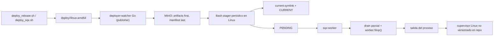
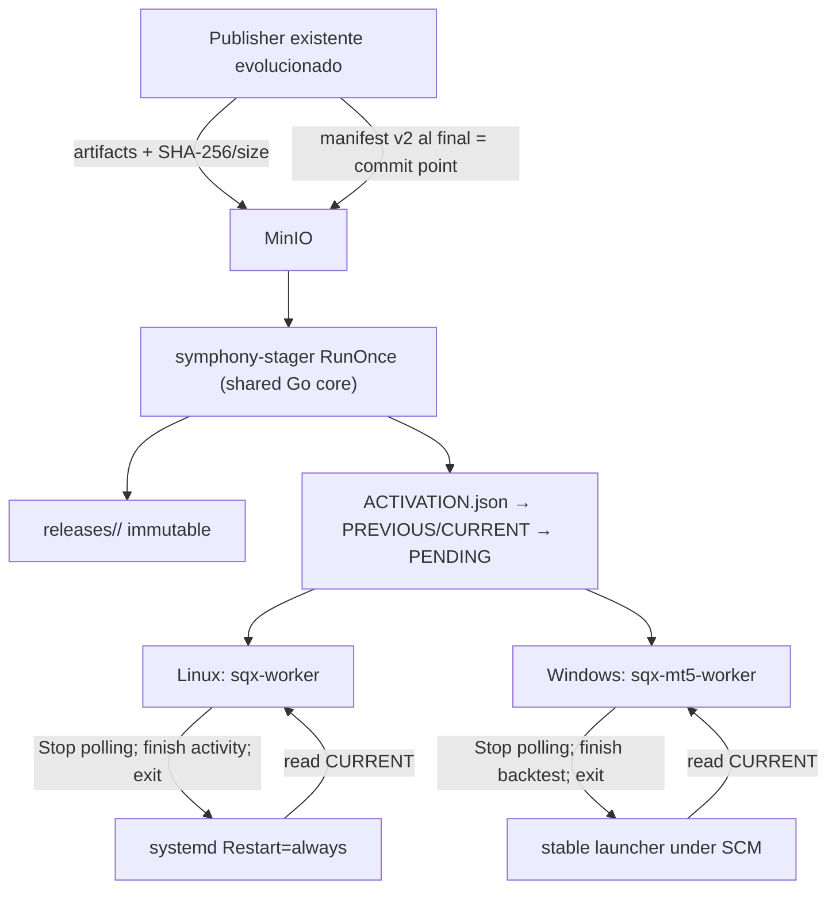

# Echo Forge - Cross-Platform Stager

> [!info]+ Echo Forge - Cross-Platform Stager
> **Área:** [[Echo]] · **Estado:** review · **Prioridad:** P1 · **Sprint:** [[A26Q2S7]]
> Diseño de la evolución segura del staging de Symphony para `linux-amd64` y `windows-amd64`, sin implementación de producción en este ciclo.

> [!warning]+ Reemplazo parcial
> El master prompt posterior creó [[Stager]] como repositorio independiente. Ese proyecto reemplaza la ubicación dentro de Symphony y simplifica `ACTIVATION.json` a `PENDING.next`; el discovery y los riesgos confirmados de esta nota siguen vigentes.

## 🎯 Objetivo

- Diseñar, con evidencia del código actual, un mecanismo de publicación, staging, activación, drenaje y supervisión cross-platform que preserve el rollout Linux y habilite workers Windows sin pérdida de trabajo.

## 📊 Estado actual

- Diseño y plan de implementación completados sobre `symphony@9612f83` en la rama de trabajo actual; listos para revisión humana.
- Recomendación: stager Go one-shot compartido, systemd en Linux y launcher mínimo bajo SCM en Windows, con activación filesystem recuperable.
- No se ha modificado código de producción.
- La auditoría solicitada `specs/FEAT-DEPLOYER-CROSS-PLATFORM-STAGER/ASSESSMENT.md` no existe en el checkout ni en los refs Git locales; se registra como gap de evidencia, no como bloqueo del diseño basado en código.

## 🧩 Subproyectos

```base
filters:
  and:
    - 'type == "project"'
    - 'file.hasLink(this.file)'
views:
  - type: cards
    name: Subproyectos
    order:
      - file.name
      - note.status
      - note.priority
```

## ✅ Tareas

> [!example]- Fuente de tareas — editar / mover de estado aquí
> - [x] Confirmar arquitectura actual de publisher, manifest, stager, workers y supervisión #owner/agent #type/research #area/echo
> - [x] Auditar lifecycle Linux/Windows, graceful drain, atomicidad, fallos y seguridad #owner/agent #type/research #area/echo
> - [x] Comparar alternativas y cerrar arquitectura recomendada #owner/agent #type/research #area/echo
> - [x] Documentar state machine, contrato, responsabilidades, rollback, retention, observabilidad y testing #owner/agent #type/research #area/echo
> - [x] Desglosar roadmap ejecutable con dependencias, archivos, tests, DoD, riesgos y rollback #owner/agent #type/research #area/echo
> - [x] Validar schema del proyecto, backlinks y recuperación por Graphify #owner/agent #type/admin #area/echo

```dataviewjs
const meta={" ":["To Do","var(--text-muted)","var(--background-modifier-border)"],"/":["WIP","#ba7517","rgba(234,124,12,.18)"],"r":["Review","#185fa5","rgba(55,138,221,.18)"],"x":["Done","#3b6d11","rgba(99,153,34,.18)"],"X":["Done","#3b6d11","rgba(99,153,34,.18)"],"-":["Canceled","var(--text-faint)","var(--background-modifier-border)"]};
function linkify(s){return String(s).replace(/\[\[([^\]|]+)(?:\|([^\]]+))?\]\]/g,(m,a,b)=>`<a class="internal-link" href="${a}" data-href="${a}">${b||a}</a>`).replace(/#[\w/-]+/g,m=>`<span style="opacity:.55;font-size:12px">${m}</span>`);}
function render(tasks){const el=dv.el('div','');el.innerHTML=tasks.map(t=>{const[label,fg,bg]=meta[t.status]||["?","var(--text-muted)","var(--background-modifier-border)"];return `<div style="display:flex;align-items:center;gap:8px;margin:5px 0;"><span style="font-size:11px;font-weight:600;padding:1px 9px;border-radius:999px;background:${bg};color:${fg};min-width:56px;text-align:center;flex:none;">${label}</span><span>${linkify(t.text)}</span></div>`;}).join("");}
function has(t,tag){return new RegExp(`(^|\\s)#${tag}(\\s|$)`).test(String(t.text));}
const all=dv.current().file.tasks.array().filter(t=>has(t,"owner/agent"));
for(const [st,label] of [[" ","🟦 To Do"],["/","🟡 WIP"],["r","🔵 Review"],["x","✅ Done"]]){const c=all.filter(t=>t.status===st||(st==="x"&&t.status==="X"));if(c.length){dv.el('h4',label);render(c);}}
```

## 📆 Bitácora

- **2026-08-08** — Proyecto creado desde el template vigente. Discovery confirmó que el `deployer` Go es publisher, el stager de host es Bash, Linux usa `PENDING`, y `sqx-mt5-worker` aún no tiene quiesce ni supervisión automática. Detectadas credenciales versionadas: acción inmediata de rotación y saneamiento, sin reproducir valores.
- **2026-08-08** — Diseño cerrado y listo para review: alternativa B elegida, state machine recuperable definida, manifest v2 aditivo, lifecycle Linux/Windows, seguridad, tests, riesgos y roadmap F0-F6 con gates. Builds focales Linux/Windows PASS; no hubo cambios de producción.
- **2026-08-08** — Decisión posterior del owner: el Stager pasa a repo independiente y la recuperación MVP se reduce a `PENDING.next`. Continuidad: [[Stager]].

## Convención de evidencia

- **CONFIRMED:** verificado contra código, tests o artefactos versionados del baseline `symphony@9612f83`.
- **INFERENCE:** conclusión razonable que depende de runtime o configuración no versionada.
- **PROPOSED:** decisión objetivo de este proyecto.
- **UNKNOWN:** no resoluble desde el checkout/vault inspeccionado.
- **OUT OF SCOPE:** deuda real que no se incorpora a esta iniciativa.

Todas las rutas de evidencia son `repo + path relativo`; el código manda sobre README/PRD cuando divergen.

## Contexto y problema

Symphony publica releases locales a MinIO y los workers Linux ejecutan un stager periódico que prepara una versión, cambia la selección local y emite `PENDING`. El worker detecta el marker, intenta drenar y termina para que un supervisor externo lo levante otra vez. El nuevo `sqx-mt5-worker` debe correr en Windows y hoy sólo tiene instalación/arranque manual en foreground.

El problema no es copiar un `.exe`: es converger desde una release remota deseada hacia una release local seleccionada sin activar bytes parciales, sin matar una activity en curso y con recuperación determinista frente a crashes en cualquier instrucción crítica.

### Restricciones

- Sin big bang: Linux legacy sigue operativo durante la transición.
- `linux-amd64` y `windows-amd64` son consumidores iniciales; el stager no conoce MT5.
- Manifest remoto = release deseada; no existe comparación `>` y un downgrade es válido.
- Publisher, stager, worker, supervisor y manifest mantienen responsabilidades distintas.
- MinIO/ETCD/OTel pueden fallar; la release actualmente ejecutándose no se toca ante un fallo de discovery/stage.
- Un upgrade normal nunca llama `Kill()` ni cancela un backtest. El límite duro queda como protección posterior al timeout máximo declarado de la propia activity.
- Filesystem + operaciones atómicas son suficientes; no se agrega DB, cola ni control plane.

## Arquitectura actual



### Hallazgos confirmados

| Hallazgo | Estado | Evidencia |
|---|---|---|
| El `deployer` modular es publisher local→MinIO, no stager de host | CONFIRMED | `deployer/core/capabilities/storage.go:15-22`, `deployer/watcher/watcher.go:17-205`, `deployer/cmd/deployer-watcher/main.go:175-205` |
| Artefactos se publican antes del manifest y un fallo evita confirmar snapshot | CONFIRMED | `deployer/watcher/watcher.go:111-205`; test `TestRunner_SyncOnce_PublishesManifestAfterArtifacts` en `deployer/watcher/watcher_test.go:543-606` |
| El modelo Go del manifest sólo conoce `version` y `metadata`; el wire real agrega `app`, `feature`, `artifacts` y `update` | CONFIRMED | `deployer/core/capabilities/manifest.go:7-13` vs. `deploy/manifest.json:1-19` |
| El publisher está cableado a una sola plataforma configurada | CONFIRMED | `deployer/cmd/deployer-watcher/main.go:43,111,190`; `deployer/adapters/pathing-staticlayout/pathing.go:15-18,47-54` |
| El stager Linux real del repo es Bash y depende de `mc`, `jq`, symlinks y utilidades POSIX | CONFIRMED | `deployer/doc/examples/client/symphony-stager.sh:1-109` |
| Stage actual no verifica SHA-256/size, escribe `CURRENT` antes de `PENDING` y borra la release anterior inmediatamente | CONFIRMED | `deployer/doc/examples/client/symphony-stager.sh:58-107` |
| El worker Linux observa `PENDING`, `SIGHUP`, `SIGTERM` y `SIGINT` | CONFIRMED | `sqx/adapters/quiesce-file/file_quiesce_watcher.go:21-45,86-103` |
| Las claves ETCD del watcher (`sqx/*`) divergen de las cargadas por runtime (`runtime/*`) | CONFIRMED | `sqx/adapters/quiesce-file/file_quiesce_watcher.go:109-139` vs. `sqx/core/runtime/config.go:413-424` |
| El contador de activities usado para drenaje sólo envuelve `ProjectActivity`; no todas las activities | CONFIRMED | `sqx/activities/worker/project_activity.go:117-123`; búsqueda de `IncrementActiveActivities` sin otros call-sites de producción |
| El wrapper Temporal fija concurrencia 1 pero deja `WorkerStopTimeout` en su default `0s` | CONFIRMED | módulo `github.com/xKoRx/sdk/pkg/shared/temporal/client.go:139-162`; Temporal SDK declara default `0s` |
| `sqx-mt5-worker` no instala quiesce watcher ni tracking de actividad | CONFIRMED | `sqx/cmd/sqx-mt5-worker/main.go:77-176` |
| La cancelación del contexto termina procesos Windows con `Kill()` | CONFIRMED | `sqx/adapters/cmd-executor/cmd_executor.go:253-257,414-437`; por ello un stop incorrecto sí puede cortar MT5 |
| Windows hoy es foreground/manual, sin Windows Service | CONFIRMED | `deploy/windows/sqx-mt5-worker/README.md:1-67`, `docs/services/sqx-mt5-worker-windows.md:1-15` |
| El instalador Windows copia sobre un path `current` plano y no es un stager remoto | CONFIRMED | `deploy/windows/sqx-mt5-worker/Install-EchoForgeMT5Worker.ps1:27-50` |
| `sqx-mt5-worker` cruza a `windows-amd64` y `sqx-worker` a `linux-amd64` en el baseline | CONFIRMED | builds focales ejecutados el 2026-08-08 con `CGO_ENABLED=0`, salida en `/tmp`, ambos PASS |
| Suite focal del publisher pasa salvo un example test acoplado a ETCD real | CONFIRMED | `go test ./deployer/...`: packages core/adapters/watcher PASS; `deployer/cmd/deployer-watcher/example_test.go` falla por conexión ETCD externa |
| Las dos implementaciones de quiesce no tienen tests propios | CONFIRMED | paquetes `sqx/adapters/quiesce-file` y `sqx/adapters/quiesce-etcd`: `[no test files]` |
| Hay credenciales con apariencia real versionadas | CONFIRMED | `AGENTS.md`, `.env-example`, `deployer/doc/examples/client/symphony-stager.env`; valores omitidos deliberadamente |
| El assessment requerido no está disponible | UNKNOWN | No existe `specs/FEAT-DEPLOYER-CROSS-PLATFORM-STAGER/ASSESSMENT.md` en checkout, refs Git locales ni vault |
| Unidad systemd exacta del worker desplegada hoy | UNKNOWN | El repo sólo contiene ejemplos/PRD; la configuración efectiva de Zeus/Hera/Kronos no fue consultada en vivo |

## Alternativas consideradas

Escala: `++` favorable, `+` aceptable, `-` débil, `--` riesgosa.

| Alternativa | Correctness / recovery | KISS / moving parts | Compatibilidad | Testabilidad / mantención | Veredicto |
|---|---:|---:|---:|---:|---|
| A. Port Bash→PowerShell | - | + al inicio, -- a largo plazo | Linux queda separado | --: dos state machines | Rechazada |
| B. Stager Go one-shot compartido + adapters OS + supervisores nativos | ++ | ++ | ++ | ++ | **Elegida** |
| C. Bash/PowerShell separados con protocolo común | + | - | + | - | Rechazada: duplica la parte más delicada |
| D. Staging/self-update dentro del worker | -- | - | - | - | Rechazada: mezcla responsabilidades y binario vivo |
| E. Worker directo como Windows Service, cambiando `ImagePath` por release | + | + | n/a | - | Rechazada: acopla worker a SCM y muta service config en cada release |
| F. Wrapper externo WinSW/NSSM | ++ | + si ya es estándar | n/a | + | Fallback; no hay estándar/dependencia existente confirmada |

## Arquitectura recomendada

**PROPOSED:** agregar `symphony-stager` como binario Go one-shot dentro del módulo `deployer`. El mismo core ejecuta descarga, validación, stage, reconciliación, activación, rollback y retention. Sólo locking, reemplazo atómico, permisos y paths son adapters por OS.

Linux conserva `systemd`: timer para el stager y service con `Restart=always` para el worker. Windows usa Task Scheduler para ejecutar el stager one-shot y un `symphony-launcher.exe` mínimo/estable registrado una vez en SCM. El launcher no descarga ni decide releases; sólo lee `CURRENT`, ejecuta el entrypoint versionado, espera, relee y aplica backoff.



### Qué se comparte y qué no

- **Compartido (~85-90% del stager, meta de diseño):** manifest v2, validación de paths, `RunOnce`, state machine, streaming SHA-256/size, stage idempotente, activation recovery, rollback, retention, status y telemetría semántica.
- **Específico Linux:** root FHS, mode bits, `rename/fsync`, lock de proceso, unidades systemd y adapter temporal de symlink legacy.
- **Específico Windows:** root bajo `%ProgramData%`, replace atómico compatible con Windows, lock de archivo/handle, ACL, Scheduled Task y launcher SCM.
- **Específico del worker:** actividades y dependencias de dominio. El stager jamás conoce MetaEditor, terminal, símbolos, strategies ni MT5.

### Layout local

```text
<root>/
  releases/<release-id>/<manifest file names>
  state/
    CURRENT              # autoridad local: release seleccionada
    PREVIOUS             # última release seleccionada antes de CURRENT
    ACTIVATION.json      # intent transaccional recuperable
    PENDING              # solicitud de drain/upgrade
    RUNNING              # observabilidad/ack best-effort; no autoridad
    stager.lock
  tmp/<release-id>-<nonce>/
```

- Linux propuesto: root de releases bajo `/opt/symphony`, state bajo `/var/lib/symphony`; un adapter mantiene `current` sólo durante compatibilidad legacy.
- Windows propuesto: `C:\ProgramData\Symphony`; MT5 permanece en su instalación separada.
- Ningún path absoluto vive en el manifest remoto.

## Responsabilidades

| Pieza | Responsabilidad | No hace |
|---|---|---|
| Publisher | Construir layout, calcular SHA-256/size, subir todos los archivos y publicar manifest al final | No toca hosts ni workers |
| Manifest | Declarar schema, desired release, plataforma, entrypoint y archivos inmutables | No contiene secretos, comandos ni paths locales |
| Stager | Reconciliar desired remoto con selección local; stage/verify/activate/rollback/cleanup | No mata/reinicia procesos ni conoce MT5 |
| Worker | Dejar de tomar tareas, terminar la activity actual, publicar evidencia y salir | No descarga ni se autoactualiza |
| Supervisor Linux | Mantener proceso vivo y arrancar lo indicado por `CURRENT` | No selecciona releases |
| Launcher Windows | Traducir SCM↔proceso foreground y releer `CURRENT` tras cada salida | No hace staging, health orchestration distribuida ni self-update |

## Manifest v2

Contrato aditivo propuesto; los nombres exactos se congelan en SPEC/JSON Schema antes de código:

```json
{
  "schema_version": 2,
  "version": "0.2.40",
  "artifacts": {
    "linux-amd64": {
      "entrypoint": "symphony",
      "files": [
        {"name": "symphony", "object_key": "worker/sqx/0.2.40/linux-amd64/symphony", "size": 123, "sha256": "...", "executable": true}
      ]
    },
    "windows-amd64": {
      "entrypoint": "sqx-mt5-worker.exe",
      "files": [
        {"name": "sqx-mt5-worker.exe", "object_key": "worker/sqx/0.2.40/windows-amd64/sqx-mt5-worker.exe", "size": 456, "sha256": "..."}
      ]
    }
  }
}
```

Reglas:

1. `version` es un identificador opaco y desired state; nunca se ordena para decidir upgrade/rollback.
2. `schema_version: 2`, plataforma seleccionada, entrypoint y al menos un file son obligatorios.
3. `name` es basename seguro y único; se rechazan separadores, `..`, rutas absolutas, nombres reservados y colisiones case-insensitive.
4. `object_key`, `size > 0` y SHA-256 hexadecimal de 64 caracteres son obligatorios por archivo.
5. Publisher valida localmente todos los archivos, sube artefactos inmutables, confirma metadata remota y sólo entonces publica el manifest.
6. Durante migración se preservan `version` y campos legacy Linux (`mode`, `binary`, `runner`, `watcher`, `promtail_yaml`) como aliases aditivos. El stager nuevo activa sólo v2 verificable; puede leer v1 únicamente para `status`/diagnóstico.
7. Secrets, endpoints privados, argumentos y paths físicos de host están prohibidos.

## State machine de deployment

```mermaid
stateDiagram-v2
    [*] --> Reconcile
    Reconcile --> Idle: no activation intent
    Reconcile --> Activating: ACTIVATION existe
    Idle --> ManifestValidated: desired != CURRENT
    ManifestValidated --> Staging
    Staging --> Staged: todos los hashes/sizes OK
    Staging --> Idle: fallo; CURRENT intacto
    Staged --> Activating: escribir ACTIVATION atómico
    Activating --> PendingDrain: PREVIOUS + CURRENT + PENDING durables
    PendingDrain --> Running: supervisor arranca CURRENT y ack coincide
    Running --> Idle: limpiar ACTIVATION/PENDING y aplicar retention
    PendingDrain --> PendingDrain: worker ocupado; sin kill
```



### Protocolo de activación recuperable

1. Adquirir `stager.lock`; otro proceso sale `busy` sin mutar estado.
2. Antes de leer MinIO, reconciliar cualquier `ACTIVATION.json` existente.
3. Stage completo en `tmp/`; verificar size/hash mientras se escribe; fsync y rename al directorio inmutable final.
4. Escribir atómicamente `ACTIVATION.json {id, from, to, manifest_sha256, created_at}`.
5. Escribir `PREVIOUS=from` si existe y difiere.
6. Reemplazar atómicamente `CURRENT=to`.
7. Escribir/reemplazar atómicamente `PENDING` con el mismo activation id y target.
8. Recién cuando los tres punteros son durables, retirar `ACTIVATION.json`.
9. El worker/supervisor limpia `PENDING` sólo al arrancar realmente la release target; no compara ciegamente con un `CURRENT` que el proceso viejo no representa.

Crash recovery:

- Sin `ACTIVATION`: `CURRENT` es la selección local completa.
- Con `ACTIVATION`: `RunOnce` completa idempotentemente PREVIOUS→CURRENT→PENDING, sin consultar si `manifest == CURRENT` y sin descargar otra vez si el release dir verifica.
- Si `CURRENT` ya cambió pero `PENDING` falta, recovery lo recrea; se elimina la ventana de noop peligroso del Bash actual.
- Si el host reinicia, el supervisor ejecuta la versión apuntada por el último `CURRENT` durable; el siguiente stager reconcilia markers restantes.

### Fallos y recuperación

| Fallo | Estado residual | Detección | Recuperación |
|---|---|---|---|
| Manifest/MinIO no disponible | Ningún cambio local | run result/log | Timer reintenta; worker actual sigue |
| Manifest inválido/plataforma ausente | Ningún cambio | error tipado | Corregir publicación; sin fallback inseguro |
| Download parcial/disk full | Sólo `tmp/` no referenciado | error + bytes esperados | Reintento limpia/reusa sólo tras verificar |
| Hash/size incorrecto | Release no promovida | mismatch por archivo | Fail closed; alertar publisher |
| Crash durante stage | `tmp/` huérfano | scan al inicio | Limpiar por TTL y re-stage |
| Crash escribiendo PREVIOUS/CURRENT/PENDING | `ACTIVATION.json` persiste | reconcile al inicio | Completar idempotentemente |
| ETCD caído | Stager no obtiene config; worker actual continúa | error de bootstrap | Reintento. Un PENDING ya local no depende de ETCD para ser leído |
| Worker ocupado | `PENDING` envejece; proceso viejo sigue | pending age + logs | Esperar. Sin kill automático |
| Worker crash | Activity queda retryable por Temporal; supervisor lee CURRENT | exit code/event | Supervisor relanza selected release |
| Supervisor falla | No hay worker | systemd/SCM status | Restart/backoff + alerta; no cambia release |
| Dos staggers | Uno posee lock | resultado `busy` | Siguiente timer reintenta |
| Desired cambia durante drain | Nuevo target reemplaza intent de forma serial bajo lock | activation id/target | El único restart converge al último desired verificado |
| Rollback N→N-1 | Igual que upgrade | manifest desired distinto | Stage si falta y activar sin comparación semver |
| Cleanup | Nunca toca CURRENT/PREVIOUS/PENDING | refs locales | Sólo tras ack; default conserva current+previous |

## Lifecycle Linux

1. `symphony-stager.timer` ejecuta el binario one-shot; systemd evita solape de la misma unidad y el lock cubre invocaciones manuales.
2. El stager prepara/verifica/activa y crea `PENDING`; no llama `systemctl restart`.
3. El worker ve el marker, entra en drain y llama a un host lifecycle común que **detiene polling primero** mediante Temporal Worker Stop con timeout superior al máximo de activity + publicación de evidencia.
4. Activities ya iniciadas terminan; no se aceptan nuevas. El contador custom deja de ser gate de seguridad y pasa a ser métrica cubierta por interceptor para todas las activities.
5. El proceso sale limpio. `sqx-worker.service` usa `Restart=always`, relee `CURRENT` mediante runner estable/adapter compatible y arranca la release target.
6. El nuevo proceso confirma su release id tras `worker.Start()` exitoso y limpia sólo el `PENDING` que le corresponde.

La unidad efectiva actual debe capturarse en Phase 0; el ejemplo repo usa `Restart=on-failure`, que no relanzaría una salida graceful `0` y por eso no es aceptable como target.

## Lifecycle Windows

1. Task Scheduler ejecuta `symphony-stager.exe` periódicamente bajo una cuenta de servicio dedicada.
2. El stager escribe sólo bajo `%ProgramData%\Symphony`; no toca `C:\MT5`.
3. `sqx-mt5-worker` observa el mismo `PENDING` cross-platform; señales POSIX se separan por build tags y no son requisito Windows.
4. El worker detiene polling de `sqx-mt5-queue`, deja finalizar MetaEditor/terminal64 y publicar evidencia, y sólo después sale. El `CommandExecutor` no recibe cancelación durante un upgrade normal.
5. `symphony-launcher.exe`, estable bajo SCM, espera el child. Al salir, relee `CURRENT`, aplica restart backoff y ejecuta el entrypoint versionado.
6. Una orden SCM Stop se distingue de upgrade: solicita drain local, espera el mismo límite seguro y luego termina el launcher sin relanzar.

### Por qué sí necesitamos launcher Windows

- SCM requiere protocolo de Windows Service; el worker actual es foreground.
- Un `.exe` ejecutándose no se reemplaza de forma segura y el installer actual copia sobre un path plano.
- Cambiar `ImagePath` por release acopla privilegios/rollback al stager y al worker.
- No hay WinSW/NSSM ya adoptado. Un launcher propio mínimo agrega una pieza estable, pero elimina mutación de servicio y symlinks NTFS.
- **YAGNI:** el launcher no se autoactualiza, no descarga, no hace health checks distribuidos, no consulta MinIO/ETCD y no decide rollback.

## Rollback y retention

- Rollback de deployment: publicar la release anterior como `version` deseada; el stager la trata igual que cualquier cambio, incluso si es menor.
- Rollback local de emergencia: comando administrativo explícito `activate --release <id>` sólo si la release verifica y queda auditado; el próximo manifest remoto puede volver a imponer desired.
- `PREVIOUS` significa “última release seleccionada”, no “known-good” sin evidencia.
- Default: conservar `CURRENT` + `PREVIOUS`; retention configurable por cantidad es barato, pero nunca borra refs actuales, pending, partial activa ni launcher.
- Cleanup corre después de ack del nuevo proceso. Si no hay ack, no elimina la anterior.
- Rollback de migración: deshabilitar timer nuevo y rehabilitar Bash sólo mientras el manifest conserva campos legacy; en Windows deshabilitar Task/Service y volver al foreground manual documentado.

## Seguridad

### Acción inmediata P0

Tratar como comprometidas y rotar las credenciales con apariencia real presentes en `AGENTS.md`, `.env-example` y `deployer/doc/examples/client/symphony-stager.env`; después reemplazarlas por placeholders y evaluar saneamiento de historia según política. No esperar a este proyecto para rotarlas.

### Diseño objetivo

- MinIO/ETCD credentials desde bootstrap autorizado/ETCD; nunca manifest, CLI args, repo ni logs.
- Eliminar `mc alias set ... <secret>` del host path: hoy expone credenciales en argumentos de proceso.
- Cuenta dedicada: mínimo acceso read al bucket/prefix de releases, Modify sólo al root Symphony, Read/Execute al runtime. El worker Windows recibe además permisos mínimos sobre roots MT5/jobs necesarios.
- Files nuevos con ACL/modes restrictivos; state y logs sin secretos.
- Validación contra path traversal, symlinks/reparse points inesperados, nombres Windows reservados y case collisions.
- SHA-256 + size obligatorios; ETag/MD5 no es la garantía de integridad del host.
- Logs del `CommandExecutor` no deben incorporar credenciales futuras en `args/full_command`; redacción central antes de instrumentar.
- El launcher no corre como administrador salvo instalación inicial; SCM/Task config y ACL se fijan fuera del manifest.

## Observabilidad

KISS: logs estructurados + pocas métricas de operación; no hay tracing distribuido obligatorio entre publisher y host.

- Logs por transición con `run_id`, `activation_id`, `platform`, `from`, `to`, `result`, `duration`, archivo y error tipado. Nunca secret/path sensible completo.
- `symphony-stager status --json`: desired remoto opcional, CURRENT, PREVIOUS, PENDING age, RUNNING best-effort, release dirs y último error.
- Métricas de baja cardinalidad: `stager_runs_total{result}`, `stager_transition_total{state,result}`, `stager_pending_age_seconds`, `worker_drain_duration_seconds`, `launcher_restarts_total{reason}`.
- Release id va en logs/resource info, no en labels de alta cardinalidad.
- Linux: journald; Windows: Event Log para launcher y salida capturable por Task Scheduler para stager.
- OTel remoto es best-effort: su caída no impide stage seguro ni logging local, consistente con evidencia operativa previa del deployer.

## Testing strategy

| Nivel | Cobertura obligatoria |
|---|---|
| Unit | Validación manifest/path; state reducer; desired downgrade; retention; lock busy; idempotencia `RunOnce()` repetida |
| Contract | JSON schema v1/v2, additive compatibility, golden manifests Linux/Windows, unknown fields, hashes y malicious paths |
| Filesystem | Partial stage, fsync/rename, activation crash en cada write, reboot/reconcile, concurrent stagers, disk full/permission denied |
| Publisher | Multi-platform artifacts first/manifest last; un upload fallido impide commit; hashes/sizes coinciden con bytes remotos |
| Worker lifecycle | Fake Temporal worker prueba stop-intake-before-wait, activity activa no cancelada, timeout administrativo, ack exacto de release |
| Launcher | Fake child: clean exit, crash/backoff, CURRENT cambia, SCM stop no relanza, quoting/path seguro |
| Cross-build | `linux-amd64`: stager+sqx-worker; `windows-amd64`: stager+launcher+sqx-mt5-worker |
| Integration | MinIO real/local y ETCD sólo donde aporte; los unit tests no contactan infraestructura externa |
| Linux smoke | N ocupado→N+1; cero cancelación; PENDING ack; systemd relanza N+1; rollback a N |
| Windows smoke | backtest real activo→N+1; no kill/cancel; evidencia completa; launcher arranca N+1; reboot y rollback |

El smoke Windows es gate bloqueante, no waiver documental.

## Riesgos

| Severidad | Riesgo | Mitigación/gate |
|---|---|---|
| CRITICAL | Drain actual cancela MT5 o acepta nueva activity durante upgrade | Lifecycle común + WorkerStopTimeout > activity max + smoke ocupado obligatorio |
| CRITICAL | Credenciales versionadas ya expuestas | Rotación inmediata antes de rollout; saneamiento y placeholders |
| HIGH | Divergencia entre unidad systemd real y ejemplos del repo | Captura de runtime en F0; canary reversible; `Restart=always` verificado |
| HIGH | Semántica de replace/ACL Windows incorrecta | Adapter Windows con crash matrix y VM smoke/reboot |
| HIGH | Publisher publica manifest con una plataforma incompleta | Manifest-driven validation y commit point probado con fallos inyectados |
| MEDIUM | Launcher entra en crash loop | Backoff acotado + Event Log + SCM recovery; no rollback automático mágico |
| MEDIUM | Ack prematuro elimina previous | Ack sólo tras `worker.Start()`; cleanup posterior; conservar dos releases |

## Respuestas inequívocas

1. **Nuevo stager:** binario Go one-shot `symphony-stager` dentro de `deployer`, ejecutado por timer/Task Scheduler.
2. **Código compartido:** objetivo 85-90% del stager; toda la state machine/core.
3. **Específico por plataforma:** paths, lock, atomic replace/fsync, permisos/ACL e instalación nativa.
4. **Supervisor Linux:** systemd con `Restart=always`.
5. **Supervisor Windows:** SCM mediante `symphony-launcher.exe` estable.
6. **Launcher Windows:** sí, mínimo; evita reemplazar exe vivo y mutar `ImagePath`.
7. **Graceful drain:** el worker al detectar `PENDING`; detiene polling y espera activities mediante lifecycle Temporal correctamente configurado.
8. **Versión siguiente:** supervisor lee `CURRENT` y ejecuta el entrypoint dentro de `releases/<id>`.
9. **Source of truth local:** `state/CURRENT`; `ACTIVATION` sólo transacción, `RUNNING` sólo observabilidad.
10. **Source of truth remota:** manifest v2 publicado al final en MinIO.
11. **Activation crash:** `ACTIVATION.json` se reconcilia antes de cualquier noop/fetch.
12. **Dos staggers:** lock OS por host; el perdedor sale `busy`.
13. **Integridad:** SHA-256 y size por archivo, verificados streaming antes de promover.
14. **Rollback:** desired remoto puede apuntar a cualquier release; sin comparación semver.
15. **Eliminar previous:** sólo después de ack de CURRENT y según retention; nunca mientras esté referenciado.
16. **Migración Linux:** manifest v2 aditivo, shadow/dry-run, canary, rollout host a host, retiro legacy al final.
17. **Cambios en `sqx-mt5-worker`:** composición lifecycle/quiesce común, release ack, timeout seguro y tests; nada de lógica de staging.
18. **Cambios en publisher:** manifest v2 canónico, hashes/sizes, todos los artefactos/plataformas antes del manifest y test de commit point.
19. **Borrable después:** Bash stager, env con secretos, installer current-copy, aliases legacy manifest, publisher legacy `internal/tasks/sqx_deploy_watcher.go` si uso cero confirmado.
20. **YAGNI deliberado:** sin daemon stager, DB, cola, control plane, firma PKI, auto-rollback, launcher Linux, self-update del launcher, health orchestration ni historial ilimitado.

## Implementation roadmap

Cada fase deja el sistema operativo y posee rollback propio. La nota es el único planificador; los futuros SPEC/PLAN/TASKS del repo son artefactos SDD ejecutivos, no una segunda fuente de estado del proyecto.

### Fase 0 — Baseline, seguridad y contrato congelado

**Dependencias:** ninguna. **Gate G0:** evidencia runtime + secretos rotados + SPEC aprobada.

| Task | Objetivo / cambio | Archivos probables | Tests/evidencia | Done | Riesgo / rollback |
|---|---|---|---|---|---|
| F0.1 | Rotar credenciales expuestas y sustituir valores por placeholders | `AGENTS.md`, `.env-example`, `deployer/doc/examples/client/symphony-stager.env` | secret scan sin valores; confirmación de rotación fuera del repo | Ninguna credencial activa queda válida/versionada | Rotar primero; revertir docs no revierte credenciales |
| F0.2 | Capturar units/timers/layout efectivos de un Linux worker sin mutar runtime | evidencia en `specs/FEAT-DEPLOYER-CROSS-PLATFORM-STAGER/` | `systemctl cat/status`, permisos y paths redacted | Supervisor y stager reales quedan confirmados | Read-only; sin rollback |
| F0.3 | Crear SDD canónico y JSON Schema v2 con compatibilidad legacy explícita | `specs/.../SPEC.md`, `PLAN.md`, `TASKS.md`, schema/fixtures | schema golden v1/v2 y malicious fixtures | Contrato/DoD aprobados | Revertir docs antes de código consumidor |
| F0.4 | Aislar tests que hoy contactan ETCD real | `deployer/cmd/deployer-watcher/example_test.go` | `go test ./deployer/...` offline | Suite no requiere red | Restaurar test como integration tagged, nunca default |

### Fase 1 — Publisher multi-platform y manifest commit point

**Dependencias:** G0. **Gate G1:** manifest v2 real con Linux legacy intacto; ningún host nuevo aún.

| Task | Objetivo / cambio | Archivos probables | Tests/evidencia | Done | Riesgo / rollback |
|---|---|---|---|---|---|
| F1.1 | Reemplazar modelo parcial por contrato v2 canónico y validación estricta | `deployer/core/capabilities/manifest.go`, `deployer/adapters/manifest-json/*` | contract/golden/table tests | Go y wire describen lo mismo | Mantener parser v1 aditivo |
| F1.2 | Empaquetar Linux+Windows y calcular size/SHA-256 determinista | `deploy_sqx.sh` o scripts separados, `deploy_release.sh` | cross-build, hash reproducible, release immutable | Ambos platform dirs completos antes del manifest | Feature flag sólo Linux; no borrar release existente |
| F1.3 | Hacer publisher manifest-driven para todas las files/plataformas | `deployer/core/planner`, `pathing-staticlayout`, `watcher`, MinIO adapter | artifact fail→manifest no PUT; ordering; retry | Manifest sólo se publica tras todas las files verificadas | Seguir ejecutando publisher legacy mientras flag v2 off |
| F1.4 | Emitir manifest v2 con aliases legacy Linux | `deploy/manifest.json`, `deploy_release.sh` | stager Bash actual parsea; nuevo schema pasa | Workers Linux legacy no cambian | Re-publicar último manifest v1-compatible |

### Fase 2 — Core Go one-shot y recovery local

**Dependencias:** G1. **Gate G2:** `RunOnce` y crash matrix PASS en temp filesystem Linux/Windows.

| Task | Objetivo / cambio | Archivos probables | Tests/evidencia | Done | Riesgo / rollback |
|---|---|---|---|---|---|
| F2.1 | Definir ports de release source, filesystem, lock, clock y reporter | `deployer/core/staging/`, `deployer/core/capabilities/` | compile-time fakes; table tests | Core no importa OS/MinIO concreto | Eliminar paquete sin consumidores |
| F2.2 | Implementar fetch/stage/verify inmutable y path safety | `deployer/core/staging`, `adapters/storage-minio` read API | hash/size/disk/path/case/reparse fixtures | Partial jamás es CURRENT | Stager aún no instalado |
| F2.3 | Implementar ACTIVATION→PREVIOUS/CURRENT→PENDING y reconcile | `deployer/core/staging/state*`, shared local contract si aplica | fault injection tras cada write; triple RunOnce | Todas las ventanas convergen | Feature flag `activate=false` |
| F2.4 | Implementar adapters Linux/Windows de lock/replace/permisos | `deployer/adapters/fs-*`, archivos con build tags | cross-compile + filesystem contract por OS | Misma suite pasa en ambos OS | Limitar a dry-run hasta smoke |
| F2.5 | Agregar CLI `run/status/activate` con config inmutable al boot | `deployer/cmd/symphony-stager` | CLI golden, exit codes, redaction | One-shot observable sin daemon | No instalar binario |
| F2.6 | Retention current+previous después de ack | core cleanup | refs/pending/partial protected | Nunca borra release referenciada | `retention.disabled=true` |

### Fase 3 — Lifecycle común y canary Linux

**Dependencias:** G2. **Gate G3:** Linux ocupado N→N+1 y rollback PASS sin cancelación.

| Task | Objetivo / cambio | Archivos probables | Tests/evidencia | Done | Riesgo / rollback |
|---|---|---|---|---|---|
| F3.1 | Unificar claves/runtime marker y separar signals por OS | `sqx/core/runtime`, `sqx/adapters/quiesce-*` | unit tests sin ETCD real; Windows compile | Un solo path de config; file marker cross-platform | Mantener adapter legacy keys durante transición |
| F3.2 | Detener polling antes de esperar y configurar stop timeout seguro | lifecycle común nuevo, composición worker/Temporal | fake active activity no cancelada; queued task no inicia | Stop normal no llama kill; hard cap > activity max | Flag conserva host viejo hasta canary |
| F3.3 | Ack release real tras worker start y limpiar PENDING exacto | worker host/local marker | wrong version no limpia; start fail no limpia | PENDING sólo desaparece con target vivo | Cleanup manual del marker documentado |
| F3.4 | Instalar stager timer + service Linux compatible | `deploy/linux/` units/scripts/docs | `systemd-analyze verify`, dry-run, permissions | `Restart=always`, stable resolver CURRENT | Rehabilitar Bash timer y manifest legacy |
| F3.5 | Canary único Linux con activity larga + crash/reboot/rollback | evidencia SDD | runtime timestamps/Temporal history | Cero cancelaciones, N+1/rollback correctos | Volver al stager Bash/previous |
| F3.6 | Rollout Linux host a host con soak | deployment docs/evidence | status/metrics en cada host | Todos convergen; no watcher local duplicado | Revertir un host a la vez |

### Fase 4 — Windows launcher y lifecycle MT5

**Dependencias:** F3.1-F3.3; G2. **Gate G4:** servicio/Task instalables y tests con fake child PASS.

| Task | Objetivo / cambio | Archivos probables | Tests/evidencia | Done | Riesgo / rollback |
|---|---|---|---|---|---|
| F4.1 | Componer quiesce/lifecycle común en MT5 worker | `sqx/cmd/sqx-mt5-worker/main.go`, lifecycle común | fake backtest activo, stop/release ack | MT5 deja de ser lifecycle huérfano | Foreground script anterior disponible |
| F4.2 | Crear launcher Windows SCM mínimo | nuevo `deployer/cmd/symphony-launcher` o módulo root acordado | fake child/current/backoff/SCM stop | No staging ni MinIO/MT5 imports | Desregistrar servicio; volver foreground |
| F4.3 | Crear instalador idempotente de ACL, Service y Scheduled Task | `deploy/windows/` | `-WhatIf`, reinstall, least privilege | Install no pisa exe vivo ni acepta secrets | Uninstall exacto y foreground manual |
| F4.4 | Probar replace/lock/reboot en VM Windows sin MT5 | tests/evidence | fault injection + reboot | CURRENT/PENDING recuperan siempre | Disable task/service, restore previous |

### Fase 5 — Publisher Windows y E2E MT5

**Dependencias:** G4 y publisher G1. **Gate G5:** smoke real ocupado PASS; recién entonces rollout automático Windows.

| Task | Objetivo / cambio | Archivos probables | Tests/evidencia | Done | Riesgo / rollback |
|---|---|---|---|---|---|
| F5.1 | Publicar artifact Windows dentro del mismo commit point | release scripts/manifest | remote size/hash vs local | Manifest visible sólo con Windows completo | Omitir `windows-amd64` y re-publicar |
| F5.2 | Smoke N idle→N+1 y rollback | VM Windows/evidence | queue poll, CURRENT/RUNNING/Event Log | Automático sin MT5 activo | Previous + foreground |
| F5.3 | Smoke bloqueante con backtest activo | VM MT5/evidence Temporal | no cancel event; artefactos/evidencia completos; N+1 inicia | Requisito global Windows cumplido | Publicar N como desired; investigar antes de reintentar |
| F5.4 | Crash/MinIO/ETCD/disk/supervisor failure drills | VM/evidence | matriz de fallos | Ningún parcial se marca bueno | Disable task; previous intacta |

### Fase 6 — Convergencia y retiro legacy

**Dependencias:** soak G3+G5. **Gate G6:** dos ciclos release+rollback estables por plataforma.

| Task | Objetivo / cambio | Archivos probables | Tests/evidencia | Done | Riesgo / rollback |
|---|---|---|---|---|---|
| F6.1 | Retirar Bash/env/installer copy-current | `deployer/doc/examples/client`, `deploy/windows` legacy | search sin referencias runtime | Un stager core en producción | Mantener artefactos en release anterior hasta fin de soak |
| F6.2 | Retirar publisher legacy duplicado si inventario confirma uso cero | `internal/tasks/sqx_deploy_watcher.go` y tests | command/runtime inventory | Una ruta publisher | No borrar si algún host/proceso lo usa |
| F6.3 | Deprecar campos manifest v1 tras ventana acordada | schema/scripts/docs | consumers inventory + contract tests | Sólo v2 activo | Re-publicar manifest aditivo desde tag anterior |
| F6.4 | Cerrar runbooks, SDD verification y ownership operacional | docs/spec verification | verifier independiente | Operación y rollback repetibles | Reabrir gate; no ocultar waivers |

## Acceptance criteria globales

- Publisher no hace visible un manifest hasta que **cada** file declarada existe con size/SHA-256 correcto.
- Tres `RunOnce()` consecutivos dejan exactamente el mismo state y no reinician al worker adicionalmente.
- Crash después de cualquiera de PREVIOUS/CURRENT/PENDING converge automáticamente desde `ACTIVATION.json`.
- Upgrade y rollback usan el mismo flujo; `N-1` es válido desired.
- Dos staggers nunca escriben state simultáneamente.
- Linux y Windows completan N ocupado→N+1 sin cancelación de la activity.
- Un worker que no drena mantiene trabajo actual y genera alerta; no recibe kill automático por upgrade.
- CURRENT, PREVIOUS y release in-flight nunca son limpiados.
- Secrets no aparecen en manifest, args, logs ni repo.
- Linux migra host a host y puede volver a Bash mientras dure compatibilidad.
- Windows SCM relanza mediante launcher estable sin reemplazar un `.exe` vivo.
- Todas las suites unit/contract/filesystem/cross-build pasan offline; integración externa queda taggeada.

## Open questions

1. **UNKNOWN no bloqueante:** ¿dónde está la auditoría `ASSESSMENT.md` mencionada en el encargo? No existe en el checkout/refs/vault inspeccionados; si aparece, debe reconciliarse como input antes de aceptar G0, sin desplazar la evidencia de código.
2. **UNKNOWN operacional:** ¿cuáles son las units/timers y permisos exactos desplegados hoy en Zeus/Hera/Kronos? F0.2 los captura read-only antes de tocar un host.

## Ready for implementation

**YES** para comenzar Fase 0 y desarrollo detrás de flags. **NO para rollout** hasta rotar credenciales expuestas, capturar runtime Linux real y aceptar G0.

## 🧭 Decisiones

- **D1 — PROPOSED:** stager Go one-shot compartido; no daemon.
- **D2 — PROPOSED:** filesystem transaccional con `ACTIVATION.json`; no DB.
- **D3 — PROPOSED:** systemd supervisa Linux y launcher mínimo bajo SCM supervisa Windows.
- **D4 — PROPOSED:** `CURRENT` es autoridad local; manifest v2 es desired remoto; `RUNNING` no decide.
- **D5 — PROPOSED:** Temporal worker stop con timeout superior al máximo de activity reemplaza el contador parcial como gate de seguridad.
- **D6 — PROPOSED:** manifest v2 aditivo primero; legacy se retira sólo tras soak.
- **D7 — PROPOSED:** previous es última release seleccionada, no se etiqueta “known-good” sin señal real.
- **D8 — OUT OF SCOPE:** auto-rollback, firma PKI, self-update del launcher, Kubernetes/control plane y refactor general de Temporal/DI.

## 🔗 Docs / Links

- [[Echo Forge]]
- [[echo-forge]]
- Repositorio `symphony`, baseline de discovery `9612f83`.
- `deployer/`, `deploy_release.sh`, `deploy_sqx.sh`, `sqx/cmd/sqx-worker/`, `sqx/cmd/sqx-mt5-worker/`.

## 💡 Ideas

### Backlog de ideas

- Ninguno: los follow-ups no necesarios para el rollout quedan fuera de scope.

### Motivos / principios

- KISS, YAGNI, separación publisher/stager/worker/supervisor, fail-safe, idempotencia y activación recuperable.
