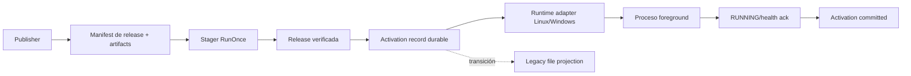

# Stager - Cross-Platform Deployment Lifecycle

> [!info]+ Stager - Cross-Platform Deployment Lifecycle
> **Área:** [[Echo]] · **Estado:** completed · **Prioridad:** P1 · **Parent:** [[Echo Forge]]
> Continuación directa de [[Stager]]: convierte el MVP de staging en un producto de deployment y activación recuperable para Linux y Windows, sin introducir dependencias de Symphony en el core.

## 🎯 Objetivo

- Hacer que [[stager-app|Stager]] posea el deployment completo del host: staging verificado, selección, activación durable, integración con supervisor, ejecución de la release, acknowledgement y compatibilidad legacy transitoria.
- Entregar el mismo contrato y garantías en `linux-amd64` y `windows-amd64`, usando adapters OS donde las primitivas difieren.
- Eliminar el bridge productivo no versionado `symphony-stager-go` después de migrar Symphony a shutdown/health estándar.
- Mantener la aplicación libre de lógica de descarga, MinIO, layouts y señales Stager-specific; la aplicación sólo debe responder correctamente al lifecycle estándar del sistema operativo.

## 📊 Estado actual

- **Cerrado (2026-08-14) por instrucción del owner.** G3 ACCEPTED. **Hotfix post-cierre 2026-08-15:** Stager staged `9.9.11` sin adoptar runtime (`Request` no cableado, release `0700`, `state/CURRENT` vs raíz). Código y binarios desplegados en Zeus/Hera/Kronos Linux/Windows; oneshot `noop`. Known-error: [[stager-staged-without-runtime-request]].
- **F1 DONE · G1 ACCEPTED.** La matriz F1.8-R ejecutada en Windows real pasó completa: crash después de projection/runtime-start/health, fallos tras cada write durable y triple `RunOnce` para targets Linux y Windows. El adapter `activation` quedó alineado a `staging`/`compat` con `MoveFileEx` y `WRITE_THROUGH`, más `syncDirectory` no-op bajo Windows; Unix conserva directory sync.
- **F0.7 DONE — REVIEW FAIL / CANARY NO AUTORIZADO:** el diff `a11ce78..0490816` está limpio y limitado a los 14 Allowed Files de F0.4-F0.6; `go test ./internal/compat`, `go test ./...`, `go vet ./...`, los cuatro cross-builds Linux/Windows y `git diff --check` pasan. El residual W7/W8 se acepta sólo bajo su límite explícito at-least-once: cada recovery de un receipt `prepared` puede volver a proyectar y, si el commit sigue fallando, el consumidor puede observar duplicados repetidos; F0 no promete exactly-once. El canary permanece bloqueado porque la evidencia sobredeclara la fault matrix: sólo existen cinco tests compat y dos hooks (`AfterPrepared`, `AfterProjection`), sin inyección completa W0-W9 ni W8 de commit/sync, faltan failure tests y rollback drill, no existen logs contractuales de projection/sequence/from-to/phase/error class, `sequence+1` no falla cerrado ante overflow/regresión, F0.2 sigue en reconciliación, no hay remote aprobado/publicado y PLAN no declara Allowed Files para F0.7/F0.8. `progress` permanece en 20 y F0.8 no puede mutar hosts.
- **F0.4-F0.6 DONE:** se registró `STAGER-DEPLOYMENT-LIFECYCLE`, se congeló `PLAN.md`/`TASKS.md`/`VERIFICATION.md` con Allowed Files y se creó el baseline local `a11ce78` + tag `stager-f0-baseline-20260810` antes de implementar. El commit `0490816` agrega `stager-compat`, adapter configurable sin imports de aplicación, lock propio, receipt `prepared|committed`, bootstrap coherente sin replay y proyección at-least-once; las pruebas focales, `go test ./...` y cross-builds Linux/Windows para ambos comandos pasan (`progress: 20`). No hay remote configurado/publicado, por lo que el baseline remoto aprobado y G0 siguen bloqueados.
- **F0.3 DONE:** `specs/STAGER-DEPLOYMENT-LIFECYCLE/SPEC.md` queda congelada para F0/G0. Define proyección durable at-least-once con receipt `prepared|committed`, W0-W9, matriz de fallos, bootstrap sin replay de `0.2.40`, rollback y doce criterios G0. Exactly-once del consumidor queda explícitamente fuera: W7/W8 puede duplicar antes del commit del receipt y exige aceptación expresa en G0 (`progress: 11`).
- **F0.1 DONE:** captura read-only efectiva de Zeus/Hera/Kronos consolidada en [[2026-08-10-stager-f01-readonly-capture-blocked]]: binarios y hashes iguales, bridge Go efectivo, units/timer, env redacted, permisos y layout; `CURRENT=0.2.40` en los tres (`progress: 8`).
- **F0.2 en reconciliación:** el inventario/diff [[2026-08-10-stager-f02-offline-inventory-diff]] fue correcto para el estado previo `ABSENT`, pero debe normalizar la captura real antes de G0. La SPEC F0.3 no toma la matriz `ABSENT` como verdad de flota; C2/C3/C5/C6 permanecen abiertas y C1/C4 ya no son bloqueos de evidencia.
- El MVP [[Stager]] ya descarga, verifica y promueve releases multi-plataforma; `RunOnce` retorna `staged|noop` y usa `PENDING.next → CURRENT → PENDING`.
- El cutover Symphony `0.2.40` documentó un wrapper fuera de repositorio que proyecta `current`, permisos y `/var/lib/symphony/PENDING`; F0.2 confirma que ese wrapper no está en Stager ni en `deployer/doc/examples/client`.
- Evidencia previa: un `PENDING` canónico sticky puede ser republicado por el wrapper en cada tick `noop`. Condicionar sólo por `result=staged` evita el loop normal, pero puede perder la señal si el wrapper cae después de activar y antes de proyectar legacy.
- Esta evidencia invalida la suficiencia productiva del modelo MVP, no su frontera: el core sigue sin conocer Symphony; el producto Stager incorpora coordinación de activación, runtime adapters y compatibilidad configurable.

## Cómo retomar — lectura mínima

1. Esta nota completa: estado, primera tarea abierta, decisiones y último hito de bitácora.
2. Repo Stager: `AGENTS.md`, `docs/ARCHITECTURE.md`, `internal/staging/{runner.go,state.go}` y el paquete SDD de este proyecto cuando exista.
3. [[2026-08-10-stager-product-boundary-and-durable-activation]] para el cambio de frontera respecto del MVP.
4. Sólo para la fase activa: adapter/packaging correspondiente y su SPEC. No escanear Symphony antes de F3.
5. Para runtime productivo, capturar primero el wrapper/unidades efectivos desde hosts; los ejemplos del repo no sustituyen el estado desplegado.

## Alcance y fronteras

| Dentro de Stager producto | Fuera del core / contrato de la app |
|---|---|
| Release manifest, descarga, integridad, layout versionado y lock | Construir/publicar artifacts sigue siendo del publisher |
| Activación durable con identidad, fases, recovery y ack | Stager no conoce Temporal, MT5, strategies ni task queues |
| Target config local, projections, Linux systemd y Windows SCM/launcher | La app implementa shutdown/health estándar y su drain de negocio |
| Instaladores, ACL/permisos, status y rollback operacional | Sin control plane, DB, fleet rollout, auto-rollback ni daemon de staging |
| Compatibilidad legacy como adapter temporal versionado | Paths Symphony no entran al manifest remoto ni al staging core |

### Autorización operativa F0.1

- **Owner, 2026-08-10:** todos los agentes pueden usar `sqx/tools/ssh_pty.py` para esta captura F0.1 únicamente en modo read-only sobre Zeus/Hera/Kronos.
- La autorización no permite cambios de runtime, `sudo` interactivo, despliegues, reinicios, cambios de permisos ni exposición/persistencia de credenciales. Los valores de entorno se redactan en origen.

Definición operativa de “sin intervención de la app”:

- **Sí:** cero lógica de deployment Stager-specific dentro de la aplicación.
- **No:** Stager no puede garantizar drain seguro si el proceso ignora `SIGTERM`/SCM Stop o no expone startup/health. Ése es un contrato estándar de operabilidad, no una dependencia de Stager.

## Contrato objetivo



### Estado local

El diseño exacto se congela en G0, pero debe representar como mínimo:

```text
<root>/
  releases/<release>/...
  state/CURRENT
  state/RUNNING
  state/ACTIVATION.json
  state/stager.lock
```

`ACTIVATION.json` identifica una transición, no sólo una versión:

```json
{
  "id": "opaque-activation-id",
  "from": "0.2.40",
  "to": "0.2.41",
  "phase": "prepared|selected|signaled|started|committed",
  "created_at": "RFC3339"
}
```

Invariantes:

- Recovery local ocurre antes de MinIO y antes de decidir `noop`.
- Un `noop` puede completar una activación incompleta, pero nunca reemitir una activación ya committed.
- `CURRENT` significa release seleccionada; `RUNNING` es acknowledgement observable, no desired remoto.
- Upgrade y rollback recorren la misma state machine; Stager no ordena versiones por semver.
- Los projections legacy se deduplican por `activation.id`, no por ausencia del archivo destino.
- La retención nunca borra `CURRENT`, `RUNNING`, `from/to` de una activación abierta ni una release parcial en recovery.

### Separación manifest / target config

- **Manifest remoto:** identidad de release, plataformas, entrypoint, files, size y SHA-256. No contiene paths locales ni service names.
- **Target config local:** root, runtime driver, service/launcher, shutdown timeout, health/ack y projections legacy.
- `update.pending_file` se conserva sólo para compatibilidad de lectura durante la migración; no es autoridad cross-platform.

Ejemplo conceptual local — no congela todavía el formato final:

```yaml
runtime:
  driver: systemd          # windows-scm en Windows
  service: symphony-worker
  stop_timeout: 4h
compat:
  file_signal:
    path: /var/lib/symphony/PENDING
```

## Gobierno SDD y economía de contexto

- Paquete SDD único en Stager: `specs/STAGER-DEPLOYMENT-LIFECYCLE/{SPEC.md,PLAN.md,TASKS.md,VERIFICATION.md}`.
- Esta nota es el planificador único de estado; los archivos SDD son contrato/evidencia ejecutiva, no un segundo roadmap.
- Cada fase usa ciclo `Specify → Plan → Tasks → Implement → Verify` y no cruza su gate con hallazgos BLOQ/MAY abiertos.
- Los cambios mínimos de graceful shutdown en Symphony usan un paquete SDD compañero propio durante F3; no se mezclan en el repo Stager.
- Un implementor sólo toca `Allowed Files` aprobados en el PLAN de la fase; un verifier independiente escribe/actualiza `VERIFICATION.md`.
- La lectura de una sesión comienza por esta nota y sólo abre la fase activa: no se cargan los cuatro paquetes/OS completos a la vez.

## Estrategia de modelos — optimización de tokens

La asignación `Sol=alta`, `Terra=media`, `Grok 4.5=baja` es la calibración operativa del owner, no un benchmark oficial cross-vendor. Las fuentes oficiales sólo establecen que Sol es el tier frontier de GPT-5.6, Terra balancea inteligencia/costo y Grok 4.5 está orientado a coding/agentic workflows. La selección se gobierna por **costo total hasta PASS**: una corrida barata que exige rework no optimiza tokens.

| Modelo | Rol por defecto | Úsalo para | No usar como owner de |
|---|---|---|---|
| **GPT-5.6 Terra / medium** | Implementor principal | Código acotado, adapters, tests, packaging, migraciones y operación reversible | Congelar invariantes nuevas o aprobar gates críticos sin revisión |
| **GPT-5.6 Sol / high** | Arquitecto/verifier selectivo | State machine, crash consistency, concurrencia, security/lifecycle, SDD y gates de producción | Trabajo mecánico voluminoso, docs repetitivas o fixtures simples |
| **Grok 4.5 / low** | Ejecutor mecánico acotado | Inventarios offline, golden fixtures, tablas, docs/runbooks, normalizar evidencia y búsquedas determinísticas | Hosts productivos, diseño de estado, Windows SCM, secretos, rollback o aceptación final |

### Reglas de routing y escalamiento

1. **Default Terra:** si una tarea tiene Allowed Files claros, tests determinísticos y rollback local, comienza en Terra/medium.
2. **Sol antes y después, no durante todo:** Sol congela el contrato o revisa el diff/evidencia; Terra realiza el grueso de implementación.
3. **Grok sólo con oráculo:** debe existir un comando/golden/schema que determine PASS/FAIL sin juicio ambiguo. Si no existe, usar Terra.
4. Escalar **Grok → Terra** ante ambigüedad de contrato, más de dos módulos, test no determinístico o cualquier mutación externa.
5. Escalar **Terra → Sol** ante crash windows, concurrencia, permisos/ACL, supervisor lifecycle, seguridad, cambio de rollback o hallazgo BLOQ/MAY.
6. Implementor y verifier no comparten modelo en gates críticos cuando sea viable: Terra implementa y Sol verifica.
7. Un task ID por sesión. Prompt mínimo: objetivo del task, sección de esta nota, Allowed Files, evidencia requerida y rollback. No cargar fases futuras ni el transcript histórico.
8. `high/xhigh` en Sol sólo cuando el gate lo justifique; Terra parte en `medium` y sube a `high` únicamente si una evaluación representativa mejora el resultado.

### Distribución objetivo

- **Terra:** ~50–60% de las sesiones y la mayor parte de los cambios de código.
- **Sol:** ~30–35%, concentrado en contratos y verificación de riesgo alto.
- **Grok:** ~10–15%, sólo trabajo mecánico/offline.

Fuentes verificadas el 2026-08-10: [OpenAI Model Guidance](https://developers.openai.com/api/docs/guides/latest-model) y [xAI Grok 4.5](https://docs.x.ai/developers/models/grok-4.5). Precios/capacidades pueden cambiar; el routing se reevalúa por PASS, tokens totales y rework observado, no por nombre del modelo.

## Roadmap — cuatro fases

| Fase | Resultado coherente | Gate |
|---|---|---|
| **F0 — Baseline, SDD y contención** | Todo lo desplegado queda capturado/versionado; el bridge deja de redisparar `noop` y tiene rollback | **G0:** contrato aprobado, repo recuperable, tests sticky/crash y canary Linux PASS |
| **F1 — Activación durable genérica** | State machine con `activation_id`, recovery, target config y projections deduplicados | **G1:** fault injection en cada fase y triple `RunOnce` convergen en Linux/Windows |
| **F2 — Runtime cross-platform** | Stager distribuye launcher/adapters, packaging e installers equivalentes para systemd y SCM | **G2:** fake child + restart/reboot/ACL/timeout PASS en Linux y VM Windows |
| **F3 — Migración Symphony y retiro legacy** | Symphony usa shutdown estándar; E2E ocupado, rollback y soak permiten retirar bridge/PENDING legacy | **G3:** Zeus/Hera/Kronos y Windows MT5 PASS; dos ciclos upgrade/rollback sin redisparo ni pérdida |

## ✅ Tareas

> [!example]- Fuente de tareas — planificador único
> Estados: `[ ]` To Do · `[/]` WIP · `[r]` Review · `[x]` Done · `[-]` Canceled. El agente actualiza esta lista, `progress` y bitácora en cada gate.

### F0 — Baseline, SDD y contención

- [x] **F0.1 [Terra/medium]** Capturar read-only binario, wrapper, env redacted, units/timers, permisos y layouts efectivos de Zeus/Hera/Kronos; no mutar hosts — PASS 3×6; evidencia en [[2026-08-10-stager-f01-readonly-capture-blocked]] #owner/agent #type/research #area/echo
- [x] **F0.2 [Grok/low]** Normalizar la captura offline, comparar contra runbook/repo y producir inventario/diff redacted; escalar cualquier contradicción — PASS reconciliado: C1/C4 resueltos por captura efectiva; C2/C5/C6 clasificados y C3 sólo espera publicación remota #owner/agent #type/research #area/echo
- [x] **F0.3 [Sol/high]** Congelar SPEC: semántica de entrega, ventana de crash, límites del hotfix, matriz de fallos, migración, rollback y criterios G0 — PASS; contrato congelado en `specs/STAGER-DEPLOYMENT-LIFECYCLE/SPEC.md` #owner/agent #type/dev #area/echo
- [x] **F0.4 [Terra/medium]** Crear PLAN/TASKS con Allowed Files, registrar la feature y convertir el checkout Stager en baseline Git recuperable antes de nuevas mutaciones — PASS local: feature registrada, baseline `a11ce78` y tag `stager-f0-baseline-20260810`; remote aprobado/publicado permanece como bloqueo G0 #owner/agent #type/admin #area/echo
- [x] **F0.5 [Terra/high]** Incorporar el bridge como adapter versionado y aplicar contención por activation/receipt; `noop` no recrea un evento consumido — PASS local en `0490816`: `stager-compat`, receipt durable, recovery-first, lock y proyección configurable sin imports de aplicación #owner/agent #type/dev #area/echo
- [x] **F0.6 [Terra/medium]** Implementar tests de `staged→noop`, sticky source, destino consumido y crash antes/después de projection/receipt — PASS: suite compat, suite total y cross-builds Linux/Windows; W7/W8 queda explícitamente at-least-once #owner/agent #type/dev #area/echo
- [x] **F0.7 [Sol/high]** Revisar diff y fault matrix; autorizar canary Linux reversible sólo si el límite residual está explícito — PASS local: W1/W5/W8 y fallos relevantes cubiertos, overflow fail-closed, eventos contractuales, boundary F0.7/F0.8 y residual W7/W8 aceptado sólo at-least-once #owner/agent #type/pr-review #area/echo
- [x] **F0.8 [Terra/high]** Ejecutar canary en un host, capturar evidencia/rollback y dejar G0 en Review; Sol conserva la aceptación final — PASS Zeus `192.168.31.101` vía `ssh_pty`: install, proyección `0.2.40`, 3×`noop` sin recrear destino, rollback drill; G0 Review #owner/agent #type/dev #area/echo

### F1 — Activación durable genérica

- [x] **F1.1 [Sol/xhigh]** Congelar schema/reducer de `ACTIVATION`, `CURRENT`, `RUNNING`, fases, ids, invariantes, recovery y rollback — PASS contractual en SDD #owner/agent #type/dev #area/echo
- [x] **F1.2 [Sol/high]** Definir migración desde `PENDING.next`, compatibilidad wire y separación autoritativa manifest remoto/target config local — PASS contractual en SDD #owner/agent #type/dev #area/echo
- [x] **F1.3 [Terra/high]** Implementar tipos, persistencia atómica, reducer y migration reader con tests table-driven — PASS en `internal/activation` #owner/agent #type/dev #area/echo
- [x] **F1.4 [Terra/high]** Implementar coordinator y puertos projection/runtime sin imports Symphony; recovery precede fetch/noop — PASS por hook bajo lock Stager #owner/agent #type/dev #area/echo
- [x] **F1.5 [Grok/low]** Implementar fixtures/goldens de config y `status --json` sobre interfaces ya congeladas; Terra revisa redacción y errores — PASS YAML estricto/JSON read-only #owner/agent #type/dev #area/echo
- [x] **F1.6 [Terra/high]** Ejecutar fault injection tras cada escritura, concurrencia, disk/permission failure, downgrade y triple `RunOnce` Unix/Windows — PASS mediante hooks determinísticos, lock y cross-builds #owner/agent #type/dev #area/echo
- [x] **F1.7 [Terra/medium]** Migrar un root fixture legacy y demostrar rollback sin mutar runtime productivo — PASS aislado en `t.TempDir` #owner/agent #type/dev #area/echo
- [x] **F1.8 [Sol/xhigh]** Revisión adversarial completada — **G1 REJECTED/BLOCKED** por seis incumplimientos contractuales reproducidos y gaps de fault matrix/RunOnce/Windows/wiring; no se avanzó F2 #owner/agent #type/pr-review #area/echo
- [x] **F1.R [Terra/high]** Remediar BLOQ-F1.8-01..08: recovery `failed+RUNNING`, errores retryables, adopción `started`, config cerrada, rollback vinculado, contención anti-symlink, fault matrix/`RunOnce` y wiring productivo — PASS local y Windows real #owner/agent #type/dev #area/echo
- [x] **F1.8-R [Sol/xhigh]** Ejecutar la matriz F1.R en Windows real y aceptar G1 sólo con evidencia PASS — PASS completo en Windows; G1 ACCEPTED y F2 autorizada #owner/agent #type/pr-review #area/echo

### F2 — Runtime cross-platform y packaging

- [x] **F2.1 [Sol/high]** Congelar lifecycle común del child: start, stop, bounded wait, reread CURRENT, restart/backoff, RUNNING ack y parent shutdown — PASS contractual en SDD; ACK F2 es lifecycle del supervisor, health de aplicación queda para F3 #owner/agent #type/dev #area/echo
- [x] **F2.2 [Terra/high]** Implementar resolver de entrypoint/config y runtime core con fake child, sin symlink requerido ni imports del consumer — PASS rutas contenidas, child fake, backoff, timeout y fallo de start #owner/agent #type/dev #area/echo
- [x] **F2.3 [Terra/medium]** Implementar adapter Linux/systemd, signals, permisos y unit/timer contract tests — PASS contract tests y sintaxis de units/installer #owner/agent #type/dev #area/echo
- [x] **F2.4 [Sol/high]** Diseñar frontera Windows SCM, service stop, replace/ACL, quoting y recovery/reboot antes de código — PASS congelado en SPEC; servicio detenido antes de reemplazo, argv quoted y ACL explícita #owner/agent #type/dev #area/echo
- [x] **F2.5 [Terra/high]** Implementar launcher/adapters Windows según F2.4 y mantener la misma state machine contractual — PASS build cruzado y tests contractuales; ejecución VM queda F2.8 #owner/agent #type/dev #area/echo
- [x] **F2.6 [Grok/low]** Generar packaging/docs idempotentes desde contratos congelados: units, PowerShell install/uninstall, env placeholders y matrices — PASS artefactos Linux/Windows y docs, sin secretos #owner/agent #type/dev #area/echo
- [x] **F2.7 [Terra/high]** Probar clean exit, crash/backoff, timeout, start failure, CURRENT cambia, systemd/SCM stop, paths y reboot — PASS fake-child/adapter/packaging; reboot real permanece F2.8 #owner/agent #type/dev #area/echo
- [x] **F2.8 [Sol/xhigh]** Auditar canary Linux y VM Windows/ACL/reboot; aceptar G2 sólo sin divergencia semántica entre OS — PASS Windows VM + Zeus Linux; G2 ACCEPTED #owner/agent #type/pr-review #area/echo

### F3 — Migración Symphony, E2E y retiro legacy

- [x] **F3.1 [Sol/high]** Crear/aprobar SDD compañero Symphony sólo para shutdown/health estándar, stop-intake-before-wait y política de timeout/kill — SPEC aprobada y PLAN preparado; F3.2 espera aprobación del owner #owner/agent #type/dev #area/echo
- [x] **F3.2 [Terra/high]** Implementar lifecycle común Symphony y tests con activity/backtest fake activo; preflight Temporal `v1.31.2` + `enableCancelWorkerPollsOnShutdown=true` PASS; wiring Linux/MT5 y tests ocupados PASS; cero staging logic dentro del worker #owner/agent #type/dev #area/echo
- [x] **F3.3 [Terra/high]** Migrar un canary Linux desde bridge a runtime Stager y probar activity ocupada, crash, reboot y rollback — Zeus PASS 2026-08-13; no publicar MinIO a la flota #owner/agent #type/dev #area/echo
- [x] **F3.4 [Sol/high]** Revisar evidencia del canary y autorizar rollout host por host — PASS Linux Zeus/Kronos/Hera `f33-lifecycle`; soak operativo; no publicar MinIO #owner/agent #type/pr-review #area/echo
- [x] **F3.5 [Terra/high]** Migrar `sqx-mt5-worker` al runtime Windows y ejecutar smoke idle — PASS `MT4-TEST` child real poller `5712@mt4-test@`; CURRENT LF; no fake `f28-canary` #owner/agent #type/dev #area/echo
- [x] **F3.6 [Sol/xhigh]** OccupiedDrain Windows PASS: `Stop-Service NOW` sobre MetaEditor `pid=5612`; `f36-occ-4d05494c` `ActivityTaskStarted` 02:53:28Z y Completed; cero Canceled #owner/agent #type/pr-review #area/echo
- [x] **F3.7 [Terra/high]** PASS Linux 2×3 y Windows 2 ciclos `f33-lifecycle`↔`f33-rollback`; CURRENT LF (`0A`); child real bajo runtime; `/opt/symphony` intacto #owner/agent #type/dev #area/echo
- [x] **F3.8 [Grok/low]** Inventario hecho. Linux ≠ 0 (bridge Go, units disabled, `/opt/symphony` 0.2.40). Windows: legacy SQX ABSENT, `f28-canary` retenido, `RUNNING`/`ACTIVATION.json` ABSENT. Runbooks: Linux `systemctl restart stager-runtime`; Windows `Restart-Service StagerRuntime`; rollback CURRENT LF + restart; no uninstall #owner/agent #type/admin #area/echo
- [x] **F3.9 [Terra/high]** Decisión registrada: no retirar. Inventario legacy ≠ 0 y soak F3.4 del mismo día #owner/agent #type/admin #area/echo
- [x] **F3.10 [Sol/xhigh]** VERIFICATION F3.10. G3 ACCEPTED con F3.9 diferido y `RUNNING` residual. Puente Echo Forge queda `[r]` para Done humano #owner/agent #type/pr-review #area/echo

### Post-G3 — E2E funcional (siguiente agente)

- [x] **E2E [Sol/xhigh]** PASS bajo Stager: Linux smoke `f33-occ-94a0808d`; compile 8/8 EX5 `f36-occ-a2861961`; backtest Started `e2e-bt-3ee4dff8` identity `9512@mt4-test@`; cero Canceled. `report_not_found` queda en Symphony. No MinIO `0.2.41`. No F3.9 uninstall. #owner/agent #type/test #area/echo

## Criterios de aceptación globales

- `noop` normal no escribe activación, no reinicia y no recrea señales consumidas.
- Crash después de cualquier transición converge sin perder ni redisparar una activación committed.
- Release, manifest y target config no contienen paths o lifecycle Symphony-specific en el core.
- Misma suite contractual pasa para `linux-amd64` y `windows-amd64`; las diferencias OS viven en adapters.
- Una aplicación foreground bien comportada se despliega sin importar paquetes Stager ni implementar descarga/señales propias.
- Shutdown que excede timeout deja estado diagnosticable y requiere política explícita; no hace kill silencioso.
- `RUNNING` sólo se confirma después de startup/health; fallo de start conserva rollback.
- Upgrade y rollback son el mismo flujo; dos procesos Stager nunca mutan estado simultáneamente.
- Secrets no aparecen en manifest, argumentos, logs, repo ni evidencia.
- Bridge legacy es temporal, versionado, testeado y eliminable sin cambiar el core.

## Riesgos y mitigaciones

| Severidad | Riesgo | Mitigación / gate |
|---|---|---|
| CRITICAL | Hotfix `result=staged` pierde señal tras crash del wrapper | Receipt/activation durable + fault injection antes del canary |
| CRITICAL | Worker cancela trabajo al recibir stop | Shutdown estándar probado con activity/backtest activo; no kill normal |
| HIGH | Baseline productivo no reproducible | Captura redacted + commit/tag/remote antes de nuevas releases |
| HIGH | Dos fuentes de estado (`PENDING` y `ACTIVATION`) divergen | `ACTIVATION` autoritativo; PENDING sólo projection con fecha de retiro |
| HIGH | Windows replace/ACL/SCM difiere del cross-build | VM real, reboot matrix e installer/uninstall idempotente |
| MEDIUM | Launcher duplica responsabilidades de systemd | Systemd supervisa launcher; launcher sólo lifecycle child/state común |
| MEDIUM | Scope deriva a plataforma de flota | Sin API/DB/groups/policies; una config sigue siendo un target |

## 📆 Bitácora

- **2026-08-14** — Owner pidió cerrar esta parte. Proyecto `status: completed`. E2E `[x]`. Puente [[Echo Forge]] `[x]`. Residual Symphony: [[symphony-mt5-backtest-report-htm-absent]]. L1 [[2026-08-14-stager-e2e-close-summary]].
- **2026-08-14** — Cutover Windows del exe UTF-16 `49d68d1c…f37e` hecho por el owner. Poller vivo `9512@mt4-test@`. Compile PASS `f36-occupied-f36-occ-a2861961` run `01a0004f-b676-7d83-bb81-4caa16f540e5` 8/8 children success; primary EX5 `08_mt5_ex5/...Strategy_1_1_22_z0.ex5` size 150588. Backtest Started `e2e-backtest-e2e-bt-3ee4dff8` run `01a00052-3fc7-7e5a-9a56-d7f906d8f984` identity `9512@mt4-test@`. Tester log: `Test passed in 0:00:07.484`; worker `error_code=report_not_found` (busca `.htm`, hay `.csv`). Cero `ActivityTaskCanceled`. No MinIO 0.2.41. No F3.9.
- **2026-08-13** — E2E WIP. Linux smoke PASS `f33-occupied-f33-occ-94a0808d` Kronos `113339@sqx-ulab-kron-0@`: `project` Started 03:17:07Z Completed 03:17:50Z, `activity.ok` success, parent COMPLETED, 20 outputs, cero Canceled. Causa EX5: argv `/compile:"path"` vs contrato `/compile:path`, y exit 1 de MetaEditor tratado como infra. Fix en `artifact_compiler.go`; exe `stager/tmp/stager-e2e-windows/sqx-mt5-worker-e2e.exe` sha256 `41e7e7ad396a0240a459d7a3e16497df93552ccad033786af5129929e0c3e64a`. Cutover Windows pendiente. No MinIO 0.2.41. No F3.9.
- **2026-08-13** — Cierre de sesión. G3 ACCEPTED documentado. Tarea E2E post-G3 abierta. Human Review del puente `[r]`. L1 [[2026-08-13-2300-stager-g3-occupieddrain-close-summary]]. `progress: 100`.
- **2026-08-13** — F3.6 PASS / G3 ACCEPTED. Cutover worker `fc9895b6…e7a0e` (heartbeat al start). DrainWait sin delay: `FOUND MetaEditor64 pid=5612` + `Stop-Service NOW` + `Stopped`. History `mt5-compile-f36-occ-4d05494c-80bb9f821a32373c` Started 02:53:28Z Completed 02:53:29Z; gemelo `ddd61612` Started+Completed 02:53:29Z; cero `ActivityTaskCanceled`. F3.9 no retiro. `RUNNING` residual. Puente padre `[r]`. `progress: 100`.
- **2026-08-13** — Owner: cerrar Linux funcional como antes de la migración (Stager por debajo). Windows: F3.7 PASS 2 ciclos LF; F3.8 Capture (legacy SQX ABSENT); F3.6 OccupiedDrain operativo sí, Temporal Started no durable. Linux: `run-symphony` no teaba logs (ciego desde F3.7); se restauró `tee` en `f33-lifecycle` y `f33-rollback` Zeus/Hera/Kronos y se reinició idle. Smoke `project` builder `f33-occupied-f33-occ-b83a69a3` COMPLETED en Hera (`112528@sqx-ulab-hera-0@`, `activity.ok`). Pollers vivos `6608`/`112528`/`113339`. `sqx-watcher` Zeus sigue en `/var/lib/symphony/input`. No se reactivó `symphony-worker`. No MinIO 0.2.41. Puente Echo Forge sigue `[/]`. `progress: 99`.
- **2026-08-13** — Owner cortó F3.6 Windows: el `while` MetaEditor no es el flujo Linux. F3.7 Linux PASS: 2 ciclos por host Zeus/Hera/Kronos, CURRENT LF, child bajo runtime, legacy `0.2.40` no reescrito, timer/worker disabled. F3.8 Linux inventario ≠ 0 → F3.9 queda `[ ]`. Windows F3.6/F3.7 se retoman después. `progress: 99`.
- **2026-08-13** — Close: F3.4/F3.5 PASS. F3.6 OccupiedDrain pendiente (compile Failed ≠ ocupado). Owner exige cerrar F3.6–F3.10/G3 en la sesión siguiente sin BLOQ inventados; puente Echo Forge sigue `[/]`. Known error CURRENT CRLF / `target.yaml` 640. Pack Windows en repo `stager/tmp/stager-f33-windows/`. `progress: 99`.
- **2026-08-13** — F3.5 idle PASS en VM `MT4-TEST`: `StagerRuntime` Running/Auto/`LocalSystem`, child `sqx-mt5-worker.exe` PID 5712 PPID runtime, poller `5712@mt4-test@` `sqx-mt5-queue`, `CURRENT=f33-lifecycle` LF (no CRLF). OccupiedDrain no PASS: compile `f36-occupied-*` Started luego Failed (`MetaEditor64.exe` exit 1); no hubo `ActivityTaskCanceled` porque no se hizo `Stop-Service` con activity Started. Pack: `stager/tmp/stager-f33-windows/` (`Invoke-F35F36Evidence.ps1`, `sqx-mt5-worker-f33.exe` sha256 `f7bbfe65e75f94579d1a0493453fd71f8d7b7cfbad39d1f0e0296db80d17210e`).
- **2026-08-13** — F3.4 Linux: Kronos y Hera cutover a `f33-lifecycle` con el mismo drop-in que Zeus. Crash PASS en ambos (runtime vivo, child nuevo). Flota Linux pollers `2694`/`111070`/`110290`. Legacy `CURRENT=0.2.40` no reescrito. `sqx-mt5-queue` vacía: F3.5 no puede fingir PASS. Script Windows `deploy/windows/Invoke-F35F36Evidence.ps1` + binario `/tmp/sqx-mt5-worker-f33.exe` sha256 `f7bbfe65…17210e` SDK `v1.44.1`. `progress: 99`.
- **2026-08-13** — F3.3 Zeus PASS. Cutover a `f33-lifecycle` con drop-in `symphony-canary.conf`. Crash: `kill -9` al child `122819` → runtime `122809` relanzó `123397` ~6s. Ocupado: se aisló pollers Hera/Kronos (idle, stop/start, no cutover); `project` builder en Zeus (`f33-occupied-f33-occ-f5469e6a`) Started 17:34:39Z identity `123397@sqx-ulab-zeus-0@`; SIGTERM al child; activity Completed 17:34:59Z sin cancel; workflow task timeout 5s porque el supervisor trata `Wait()==nil` (exit 0 post-drain) como fin y systemd Restart lo recupera. Reboot: `stager-runtime` enabled/active, `symphony-worker` disabled/inactive, poller `1058@sqx-ulab-zeus-0@`, CURRENT legacy `0.2.40` intacto. Rollback drill: fake `f28-canary` + `symphony-worker` `1971` `/opt/symphony/current/bin/symphony`. Re-cutover: `target.yaml` 640 root:stager rompe `User=kor` (permission denied); KEEP era 644 y se restauró. Zeus queda en Stager poller `2694`. Backup `/root/stager-f33-backup-20260813T172339Z`, keep `/root/stager-f33-canary-keep`. No secretos en vault. Siguiente: soak F3.4. `progress: 99`.
- **2026-08-13** — Sesión F3.2 cerrada. Owner autoriza a un agente siguiente a ejecutar F3.3-F3.10 / G3: canary Zeus con drop-in y sudo interactivo, romper/reparar, luego Kronos y Hera, actualizar el planificador y cerrar sesión. No publicar manifest de flota. `progress: 99`.
- **2026-08-13** — F3.2 PASS. Preflight Temporal verificado en `192.168.31.46`: `temporal-server` `v1.31.2` activo y `frontend.enableCancelWorkerPollsOnShutdown=true` en dynamic config. Se cerraron tests de wiring Linux/MT5 (idle/ocupado/idempotente), race, vet y cross-builds. `VERIFICATION.md` PASS sin BLOQ. F3.3 pasa a WIP: el unit aislado de `stager-runtime` no puede supervisar Symphony sin drop-in (usuario, `PrivateTmp`, Java/ETCD) y el corte exige sudo interactivo en un solo host; no se publica `0.2.41` a MinIO para no empujar Hera/Kronos. `progress: 98→99`.
- **2026-08-13** — F3.R Linux PASS final: el owner repitió la lectura privilegiada en Zeus/Hera/Kronos y los tres `target.yaml` declaran `shutdown_timeout: infinite`. Con la unidad `active` ya verificada y la instalación Windows equivalente, el runtime cooperativo queda desplegado/confirmado cross-platform. F3.3 no inicia automáticamente: aún falta el gate Temporal y un target Symphony real para canary. `progress: 98`.
- **2026-08-13** — F3.R Windows PASS: el owner ejecutó el instalador con bypass de política limitado al proceso, verificó `StagerRuntime` `Running`, Automatic y `LocalSystem`, con binario `C:\ProgramData\Stager\bin\stager-runtime.exe`, y leyó `shutdown_timeout: infinite` desde `C:\ProgramData\Stager\target.yaml`. La protección contra corte automático queda efectiva también en el runtime Windows. Sigue pendiente el `sudo grep` equivalente de Linux y los gates de F3.3; no se ha migrado ni desplegado un worker Symphony real. `progress: 98`.
- **2026-08-13** — F3.R se desplegó interactivamente en Zeus (`192.168.31.101`), Hera (`192.168.31.111`) y Kronos (`192.168.31.121`). Los tres `stager-runtime.service` quedaron `active` con `TimeoutStopUSec=infinity`, `KillMode=process` y `SendSIGKILL=no`. El `grep` final corrió como `kor` contra un archivo protegido y falló sólo por permisos después de aplicar el cambio; queda pendiente repetirlo con `sudo` como evidencia textual del valor. No autoriza aún canary Symphony ni flujo: el target actual sigue siendo `f28-canary` y falta el gate dinámico del servidor Temporal. `progress: 97→98`.
- **2026-08-13** — F3.R implementó en Stager `shutdown_timeout: infinite`: el runtime envía una única parada estándar y espera sin deadline; systemd usa `TimeoutStopSec=infinity`, `SendSIGKILL=no`, `KillMode=process`, y Windows SCM emite checkpoints `STOP_PENDING`. PASS local: suite completa, vet, diff check y builds Linux/Windows. Se empaquetó el runtime Linux (`sha256 89a9ce…af1d43`) para Zeus/Hera/Kronos. El deploy remoto queda pendiente de sudo interactivo: el usuario SSH disponible no tiene `sudo -n` y no se automatizan credenciales. `progress: 97`.
- **2026-08-12** — El owner confirmó Temporal Server actualizado a `v1.31.2`. No se autoriza aún publicar worker ni disparar el último flujo: la versión no prueba que `frontend.enableCancelWorkerPollsOnShutdown=true` esté efectiva, y Stager mantiene un límite productivo `shutdown_timeout: 4h`, incompatible con el contrato de no perder trabajo que pueda durar días. Próximo slice: especificar/implementar runtime Stager sin deadline destructivo y ejecutar preflight server; sólo entonces F3.3 canary Linux con flujo real. `progress: 97`.
- **2026-08-12** — F3.2 implementó el lifecycle cooperativo local: controller de admisión/conteo atómico, interceptor Temporal para toda activity, `NewWorker` no bloqueante en SDK compartido y upgrade coordinado de ambos módulos a Go SDK `v1.44.1`. SQX Linux arranca explícitamente, los watchers file/ETCD/signal ahora sólo solicitan drain y `Worker.Stop()` corre tras `active=0`; MT5 adopta el mismo gate y espera Ctrl-Break/`os.Interrupt`. PASS: `go test`/`go vet` focales, `git diff --check` y builds `linux-amd64`/`windows-amd64`. No se mutaron hosts ni servidor. Bloqueo honesto: falta preflight/migración real de Temporal Server `v1.31.2` + dynamic config y ejecución MT5 real antes de F3.3. `progress: 96→97`.
- **2026-08-12** — El owner aprobó el cambio de seguridad de F3.2: no aceptar pérdida automática de trabajo largo; sí tolerar una ventana breve de indisponibilidad. Se revisó el último SDK Go (`v1.44.1`) y servidor (`v1.31.2`): el diseño cambia de timeout destructivo a gate atómico de admisión/conteo, espera cooperativa sin deadline y `Worker.Stop()` sólo al llegar a cero activas. El upgrade del SDK y el preflight/migración oficial del servidor, incluida `frontend.enableCancelWorkerPollsOnShutdown=true`, quedan como gates obligatorios antes de canary; alertas de drain prolongado no cancelan trabajo. `progress: 96`.
- **2026-08-12** — F3.2 TASK-02 bloqueada antes de mutar entrypoints: la implementación SDK de Temporal confirma que `Worker.Stop()` es bloqueante y mezcla stop de pollers con wait interno; no existe API pública para detener intake y luego esperar con el timeout/diagnóstico que exige la SPEC. No se introduce una cancelación o kill implícito. Se requiere decisión owner: ampliar el SDK con lifecycle de dos fases o aceptar explícitamente una semántica distinta y revisar SPEC/PLAN/TASKS.
- **2026-08-12** — F3.2 TASK-01 PASS: `sqx/core/lifecycle` entrega controller portable con stop idempotente, stop-intake-before-wait y timeout `draining-timeout` sin kill implícito. Pruebas nuevas cubren idle, actividad ocupada, timeout y doble stop; `go test ./sqx/core/lifecycle` y `go vet ./sqx/core/lifecycle` PASS. TASK-01 pasa a Done, F3.2 sigue WIP con TASK-02 Linux. `progress: 95→96`.
- **2026-08-12** — Owner aprobó F3.1. La SPEC `FEAT-SQX-WORKER-LIFECYCLE` conserva `verify-spec` READY sin BLOQ/MAY; se creó su PLAN con `sqx/core/lifecycle`, los dos entrypoints y tests nuevos como único alcance de F3.2, prohibiendo Stager, deployer, activities, workflows y tests de regresión existentes. F3.1 pasa a Done. TASKS, código, canaries y retiro legacy esperan aprobación explícita del PLAN.
- **2026-08-12** — F3.1 inició como SPECIFY. Se creó `specs/FEAT-SQX-WORKER-LIFECYCLE/SPEC.md` en Symphony: contrato portable `starting/accepting/draining/stopped`, stop-intake-before-wait, health de startup y timeout de drain diagnosticable sin kill implícito. `bash tools/sdd/verify-spec.sh specs/FEAT-SQX-WORKER-LIFECYCLE/SPEC.md` devolvió READY sin BLOQ/MAY. PLAN, TASKS, código, canaries y retiro legacy no están autorizados hasta aprobación explícita del owner.
- **2026-08-12** — Rollout canary runtime en Hera y Kronos (mismo layout `/opt/stager`, sin `stager.timer`); ambos `active` con `CURRENT=f28-canary` y `symphony-worker` intacto.
- **2026-08-12** — F2.8 Linux Zeus PASS y G2 ACCEPTED. Canary aislado `/opt/stager` + solo `stager-runtime.service` (sin timer): stop limpio, `0640 root:stager`, reboot 13:03 con PIDs nuevos (`1049`/`1062`) y `CURRENT=f28-canary`; `symphony-worker` recuperó. Completa la matriz Windows del mismo día. `progress: 92→95`. Próximo: F3.1.
- **2026-08-12** — F2.8 Windows VM PASS. Canary con fake child bajo `%ProgramData%\Stager`: install SCM, stop sin orphan (tras parche Ctrl-Break/AttachConsole y installer CIM repetition), ACL least-privilege confirmada (non-admin denied), reboot recovery Automatic con `CURRENT=f28-canary`. G2 sigue bloqueado hasta canary Linux. `progress: 84→92`.
- **2026-08-10** — F2.1-F2.7 completadas localmente. Se congeló el lifecycle común y la frontera SCM; `stager-runtime` resuelve un executable bajo la release seleccionada, no invoca shell y relee `CURRENT` tras cada exit. `systemd` y SCM reportan readiness al coordinator sin escribir estado canónico; Linux recibe unit/timer/installer y Windows recibe servicio, task, ACL e install/uninstall idempotentes. PASS: `go test ./...`, `go vet ./...`, `sh -n` y builds Linux/Windows. F2.8/G2 permanece bloqueado de forma explícita hasta canary Linux y VM Windows con stop, ACL y reboot reales; no se mutaron hosts. `progress: 56→84`.
- **2026-08-10** — El owner ejecutó la matriz F1.8-R en Windows real y todas las pruebas PASS: crash tras projection/runtime-start/health, fallos después de cada write durable y triple `RunOnce` para `linux-amd64` y `windows-amd64`. La evidencia valida el adapter Windows de `internal/activation`; G1 queda ACCEPTED, F1 cerrada y F2 autorizada. F2.1 pasa a WIP para congelar el lifecycle común del child. `progress: 52→56`.
- **2026-08-10** — F1.8-R se ejecutó realmente en Windows y falló de forma reproducible antes de evaluar la matriz: `internal/activation/store.go` intenta sincronizar el directorio de estado y recibe `Access is denied` en cada write de `CURRENT`/`ACTIVATION.json`. Se recuperó el checkout F1 local no publicado y `activation` adoptó el patrón de `staging`/`compat`: `MoveFileEx(..., MOVEFILE_REPLACE_EXISTING|MOVEFILE_WRITE_THROUGH)` y `syncDirectory` no-op bajo Windows, con `rename` y directory sync preservados bajo Unix. PASS local: suite completa, `vet`, `diff --check`, builds Linux/Windows y compilación del test binario Windows. G1 sigue BLOCKED sólo hasta repetir la matriz Windows con el binario corregido.
- **2026-08-10** — F1.R corrigió y verificó localmente los ocho BLOQ: el snapshot `failed+RUNNING` converge a committed; errores de infraestructura conservan fase/ID; `started` reasegura `Start`; config permite sólo `deferred`/opciones vacías y `file`; rollback valida vínculo; todos los releases se resuelven dentro de `releases/`; hay inyección tras projection/start/health y tres `RunOnce`; y `cmd/stager` conecta recovery antes del fetch. Pasan overlay adversarial fresco, `go test -count=1 -race ./...`, `go vet`, `diff --check` y builds Linux/Windows. G1 sigue bloqueado con un único pendiente honesto: no existe executor Windows disponible en este host Darwin, por lo que el cross-build no se registra como ejecución. `progress: 48→52`.
- **2026-08-10** — El owner autorizó el slice F1.R para corregir los ocho hallazgos BLOQ de F1.8 y volver a revisar G1. Alcance: estado/reducer/coordinator/config/tests, wiring one-shot y SDD; quedan fuera hosts, adapters runtime concretos, packaging, publisher, compat y F2. `progress: 47→48`.
- **2026-08-10** — F1.8 completada exclusivamente como revisión adversarial; no se corrigió implementación ni se avanzó F2. La suite existente, race, vet, diff check y cross-builds siguen PASS, pero un overlay efímero reprodujo seis fallas: `failed+RUNNING` es rechazado antes de converger, projection/start transitorio se vuelve `failed`, recovery `started` observa salud sin asegurar adopción, config no cierra drivers/options, rollback desde `failed` no valida `rollback_of` y un symlink puede sacar un release de `releases/`. La matriz existente tampoco cubre crash después de projection/start/health, tres `RunOnce` reales ni ejecución Windows; el CLI no conecta el recovery hook. F1.8 queda `[x]` por revisión terminada, G1 `REJECTED/BLOCKED`, `progress: 44→47` y F2 no autorizada. Evidencia normativa en `specs/STAGER-DEPLOYMENT-LIFECYCLE/VERIFICATION.md`; próximo paso fuera de esta sesión: autorizar un slice F1 de remediación con Allowed Files exactos y repetir F1.8 independientemente.
- **2026-08-10** — F1.3-F1.7 completadas exclusivamente en el repo Stager y el paquete SDD. Se aprobó y respetó el allow-list F1; `internal/activation` implementa JSON/YAML estricto, atomic replace+sync, reducer, import legacy, coordinator por puertos y status JSON sin dependencias Symphony. Evidencia PASS: tests focales, `go test -count=1 -race ./...`, `go vet ./...`, `git diff --check` y builds cruzados Linux/Windows. Fault injection cubre cada write durable, lock concurrente, same-ID recovery, downgrade, triple recovery e import/rollback en fixture aislado. No se mutaron hosts, runtime productivo, manifest publisher, adapter compat ni F1.8/F2/F3. `progress: 31→44`; próximo paso exclusivo: F1.8 revisión adversarial independiente para decidir G1.
- **2026-08-10** — F1.1-F1.2 completadas sin avanzar F1.3 ni mutar hosts. El SDD congela layout v2 `state/{ACTIVATION.json,CURRENT,RUNNING}`, JSON estricto, ids aleatorios durables, reducer y recovery por fase, failure terminal, rollback explícito con `rollback_of`, matriz determinística de import legacy y target config local como única autoridad de runtime/ack/projections; el manifest remoto conserva compatibilidad aditiva pero `update.pending_file` pierde toda autoridad v2. Evidencia PASS: checks estructurales, diff limitado a los cuatro Allowed Files, `git diff --check`, suite Go, vet y cross-builds Linux/Windows. `progress: 25→31`; próximo paso retenido: definir Allowed Files/fixtures de F1.3 en una sesión posterior.
- **2026-08-10** — F1.1 congelada en el SDD: `ACTIVATION.json`/`CURRENT`/`RUNNING`, ids aleatorios persistidos antes de efectos, reducer puro, fases y recovery exhaustivo, failure terminal y rollback compensatorio con `rollback_of`. F1.2 pasa a WIP; F1.3 sigue bloqueada sin Allowed Files.
- **2026-08-10** — F1.1 iniciada con alcance contractual exclusivo: se congelarán schema, reducer, recovery y rollback en el paquete SDD antes de abrir F1.2. No se autorizan cambios de implementación F1.3, hosts ni runtime productivo.
- **2026-08-10** — G0 accepted por el owner. Residual W7/W8 at-least-once queda explícitamente aceptado. F1 habilitada sin iniciar; próximo paso F1.1. Tarea puente Review→WIP.
- **2026-08-10** — F0.8 canary PASS en Zeus (`192.168.31.101`) con `ssh_pty.py`. Primer install falló por falta de mapeo `MINIO_ACCESS`/`MANIFEST_KEY`→nombres Go; se generó env mapeado y se endureció `install-compat.sh`. Evidencia: bootstrap receipt, proyección real `sequence=1`, worker consumió PENDING, 3×`noop` sin recrear destino, rollback a `symphony-stager-go` sin mutar marcadores/releases, worker/timer active en `0.2.40`. F0.8 `[x]`, progress `20→25`, G0 → Review. F1 no inicia sin aceptación Sol.
- **2026-08-10** — F0.8 preflight: `origin` contiene `1f8989c` y el tag `stager-f0-baseline-20260810`, por lo que el baseline recuperable remoto queda PASS. El canary se detiene sin mutaciones: `Zeus` y el hostname operativo derivado de la evidencia no resuelven DNS desde esta sesión, así que no es posible verificar unit/wrapper, instalar el adapter, observar tres `noop` ni hacer rollback real. G0 permanece BLOCKED y F1 no inicia.
- **2026-08-10** — Preflight de publicación F0.8: SSH de consola autentica como `xKoRx`, pero `git@github.com:xKoRx/stager.git` no existe y no hay token ni sesión `gh` para crearlo. No se fuerza un remote alternativo ni se muta el host: G0 conserva como precondición la creación/publicación del remoto privado canónico antes del canary.
- **2026-08-15** — Hotfix cutover: `Coordinator.Request` tras stage, `chmod 0755`, adopt en caliente de `state/CURRENT`, `systemctl --no-block`, polkit, Load tolera CURRENT adelantado. Desplegado en flota; oneshot `noop`. [[stager-staged-without-runtime-request]].
- **2026-08-10** — F0.2 reconciliada mediante [[2026-08-10-stager-f02-reconciled-host-capture]]: C1/C4 se resuelven por la captura F0.1 efectiva; C2/C5/C6 se clasifican como boundary/divergencia histórica y C3 queda reducido a publicación remota. F0.7 PASS local: la extensión permitida cubre W1/W5/W8, lock/bootstrap/overflow fail-closed, eventos de proyección y artefactos Linux versionados de instalación/rollback; el residual W7/W8 se acepta sólo at-least-once. F0.8 inicia con autorización explícita del owner y un único host canary reversible; F1-F3 siguen fuera de alcance.
- **2026-08-10** — El owner autorizó cerrar F0 completo: corrección de controles locales, publicación del baseline remoto y canary Linux reversible con rollback. F0.7 vuelve a WIP; F0.8 se mantiene bloqueada hasta que la revisión local PASS autorice su ejecución. F1-F3 no entran en alcance.
- **2026-08-10** — F0.7 completada como revisión independiente con veredicto FAIL; no se autorizó canary ni se mutaron hosts o el repo. El diff `a11ce78..0490816` contiene sólo los 14 Allowed Files declarados y pasa `git diff --check`; verificación fresca PASS: `go test -count=1 ./internal/compat`, `go test -count=1 ./...`, `go vet ./...` y builds `linux-amd64`/`windows-amd64` de `stager` y `stager-compat`, con checkout limpio. El límite W7/W8 queda aceptado sólo como proyección at-least-once con posible duplicado por cada recovery mientras el receipt siga `prepared`, nunca exactly-once. Bloqueos: cinco tests compat/67.3% sin fault injection completa W0-W9 ni W8 commit/sync, failure matrix y rollback drill incompletos, logging contractual ausente, overflow/regresión de `sequence+1` sin fail-closed, F0.2 no reconciliada, remote baseline no aprobado/publicado y Allowed Files de F0.7/F0.8 no declarados. `progress` permanece en 20; F0.8 queda bloqueada y G0 no avanza.
- **2026-08-10** — F0.4-F0.6 completadas sin mutar hosts ni ampliar F1-F3. Se registró el paquete SDD y se congeló su boundary; el checkout sin commits se convirtió en baseline local `a11ce78` con tag `stager-f0-baseline-20260810`, seguido por `0490816` para el adapter `stager-compat`. El adapter configurable serializa bajo lock propio, bootstrappea sólo `CURRENT=PENDING` coherente sin recrear destino ausente, recupera receipt `prepared` antes de MinIO y suprime `noop` tras receipt committed incluso si el consumidor removió el destino. Evidencia local PASS: pruebas compat (`staged→noop→noop`, sticky `PENDING`, destino consumido, bootstrap, W6/W7-W8 y conflicto `CURRENT`), `go test ./...`, builds Linux/Windows de `stager` y `stager-compat`, `git diff --check` y revisión de Allowed Files. G0 sigue bloqueado por reconciliación F0.2, remote aprobado/publicado, matriz de fallos/rollback, revisión independiente y canary autorizado; el residual W7/W8 no se oculta.
- **2026-08-10** — F0.3 completada sin avanzar otras tareas ni mutar hosts. Se creó sólo el Allowed File de esta tarea, `specs/STAGER-DEPLOYMENT-LIFECYCLE/SPEC.md`; PLAN/TASKS/VERIFICATION y registro de feature permanecen para F0.4. La SPEC congela entrega por proyección durable at-least-once, receipt `prepared|committed`, algoritmo recovery-first, ventanas W0-W9, matriz de fallos, límites del hotfix Linux, migración coherente de `0.2.40`, rollback y criterios G0. W7/W8 reconoce duplicado posible entre replace legacy y commit del receipt; exactly-once no se promete. Verificación: chequeo estructural contractual PASS y `go test ./...` PASS. F0.2 sigue en reconciliación y el baseline Git sigue pendiente; ambos son precondiciones explícitas de G0, no se resolvieron dentro de F0.3.
- **2026-08-10** — F0.1 completada mediante `sqx/tools/ssh_pty.py`, con autorización explícita del owner y sólo lecturas. Zeus/Hera/Kronos son equivalentes: `stager` Go, bridge `/usr/local/sbin/symphony-stager-go`, backup Bash, `CURRENT=0.2.40`, `current → releases/0.2.40`, `symphony-stager.timer` habilitado (`OnUnitActiveSec=30s`) y worker activo. El wrapper replica `/opt/symphony/PENDING` a `/var/lib/symphony/PENDING`; este último está ausente al capturar. `stager.env` es `0600 symphony:symphony`; sólo se capturaron claves de unit y valores redactados. F0.2 se reabre para reconciliar su diff `ABSENT`; no se inicia F0.3 hasta ese update.
- **2026-08-10** — F0.2 completada (offline): captura F0.1 normalizada como matriz ABSENT 3×6; comparado runbook cutover `0.2.40` vs checkout Stager vs ejemplos Bash Symphony; emitido [[2026-08-10-stager-f02-offline-inventory-diff]] con C1–C6. Materialize de change_log falló por gate schema rojo en `70-templates/application.md` (ajeno); se escribió el log a mano alineado al template. No se avanzó F0.3. Próximo: desbloquear F0.1 (SSH read-only o snapshots redacted fechados) antes de congelar SPEC.
- **2026-08-10** — F0.1 iniciada: se valida que aún no existe paquete SDD/PLAN ni Allowed Files para esta fase; la captura queda estrictamente read-only sobre Zeus/Hera/Kronos y su evidencia redacted se incorporará al planificador antes de pasarla a F0.2. La evidencia no se pudo recoger: SSH directo a los tres workers rechazó autenticación y el bastión `develop` agotó conexión. No hubo comandos mutantes ni se usaron credenciales del vault. Próximo intento: restituir acceso SSH read-only y repetir la matriz completa antes de F0.2.
- **2026-08-10** — Proyecto creado desde el template vigente por decisión del owner. La falla del bridge productivo demuestra que el MVP staging no cubre una activación end-to-end: se planifican cuatro fases SDD, con Stager dueño del lifecycle host y Symphony limitado a shutdown/health estándar. El owner calibra Sol/Terra/Grok como inteligencia alta/media/baja; tasks subdivididas por sesión con Terra default, Sol en contratos/gates y Grok sólo en trabajo mecánico verificable. Implementación queda To Do en F0.1.

## 🧭 Decisiones

- **D1 — ACCEPTED:** ampliar el producto Stager, no contaminar el staging core con Symphony.
- **D2 — ACCEPTED:** paridad Linux/Windows significa mismo contrato y garantías; las primitivas systemd/SCM permanecen en adapters.
- **D3 — ACCEPTED:** cero deployment logic en la app; shutdown y health estándar siguen siendo responsabilidad de toda app operable.
- **D4 — ACCEPTED:** conservar Stager one-shot; un launcher/runtime estable separado gobierna el child y el acknowledgement.
- **D5 — ACCEPTED:** manifest remoto describe releases; target config local describe host, supervisor y compatibilidad.
- **D6 — ACCEPTED:** toda activación tiene identidad y fases durables; una versión sola no es un event id suficiente.
- **D7 — ACCEPTED:** bridge/PENDING/current son compatibilidad temporal con retiro gateado, no contrato final.
- **D8 — OUT:** control plane, fleet orchestration, DB, auto-rollback, nuevas artifact sources y refactor general de Symphony.
- **D9 — ACCEPTED:** Terra/medium es implementor por defecto; Sol/high/xhigh diseña y verifica riesgo alto; Grok/low sólo ejecuta tareas offline con oráculo determinístico y nunca muta producción.

## 🔗 Docs / Links

- [[Echo Forge]] — proyecto humano padre y tarea puente única.
- [[Stager]] — MVP precursor completado; este proyecto aparece como continuación directa.
- [[stager-app]] — aplicación canónica del repo/módulo.
- [[Stager - Symphony Publisher Integration]] — publisher/cutover precedente.
- [[2026-08-08-stager-mvp-boundary-and-activation]] — decisión MVP histórica.
- [[2026-08-10-stager-product-boundary-and-durable-activation]] — ADR vigente para esta evolución.
- [[Symphony]] — primer consumer y migración F3, nunca dependencia del core.

## 💡 Ideas

### Backlog de ideas

- Promover scopes/control plane sólo bajo las señales ya definidas en [[2026-08-08-stager-deployment-system]]; este proyecto no es esa promoción.

### Motivos / principios

- KISS, una state machine, adapters por OS, crash recovery, idempotencia, least privilege y rollback probado.

### Memoria pública / interna

- **Memoria pública:** esta nota, el SDD versionado y [[2026-08-10-stager-product-boundary-and-durable-activation]].
- **Memoria interna:** ninguna adicional; el planificador único contiene toda la continuidad operativa.
- **Motivo:** cualquier agente debe retomar leyendo una nota y la fase activa, sin cargar la historia completa.
