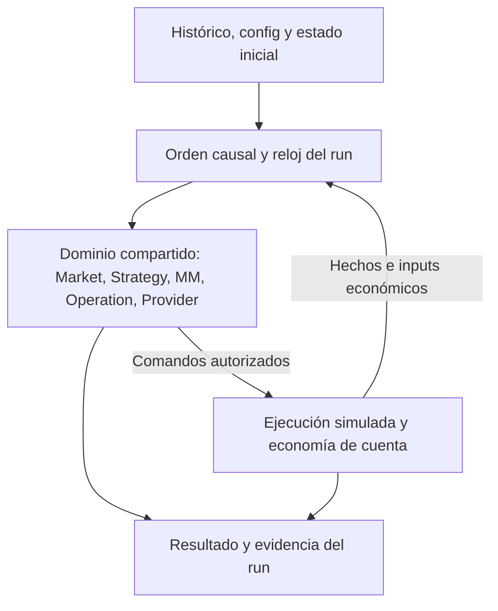

# Echo Futures — BT-S00 Backtester Source Forensics and Architecture Direction

## Propósito

Determinar si Echo Futures puede ejecutar un único backtester determinista, atómico por corrida e in-process, con distintos contextos de cuenta y Provider, reutilizando su dominio real. Este documento es un **candidato de pre-diseño para revisión del Primary Technical Manager**. No congela arquitectura, no inicia BT-S01 y no certifica D6.

**Fecha local:** 2026-10-03, America/Santiago. **Source examinado:** `xKoRx/echo@d361008bfe4aa54fe3d8b6380d290bf92e1f1c08`, tip observada de `feature/d6-shot1-execution-vertical`. **Autoridades Agents-OS:** snapshot `0d0a4572fbc8b941f4c338fe1a6e59f87eb45085`; Technical Project Manager vigente, actualizado el 2026-10-03. Las conclusiones de implementación se refieren a ese source, no a un proceso desplegado.

## Contenido

Las secciones 1–11 responden al mandato. Los anexos conservan la cobertura de las veinte preguntas, los hallazgos estáticos, las fuentes y el cierre de los especialistas. Se usa `SOURCE FACT` para código inspeccionado, `FROZEN OWNER DIRECTION` para restricciones autoritativas, `ARCHITECTURAL INFERENCE` para consecuencias razonadas y `OPEN QUESTION` para decisiones que aún faltan.

## 1. EXECUTIVE VERDICT

**La dirección es técnicamente sólida con correcciones materiales de alcance y reutilización.** No apareció una razón de dominio que obligue a separar GenericBacktester, PropBacktester o motores por firma. El mismo conjunto Strategy → Operation/GerardMM → Provider puede operar sobre estados y reglas diferentes. Sí hay evidencia que invalida una interpretación demasiado optimista: el backtester no se obtiene quitando Kafka del harness actual, y configurar un saldo de USD 100.000 no constituye todavía una corrida económica completa.

`SOURCE FACT`: existen paquetes de dominio separados para Strategy, S1/S2, GerardMM, Operation, Provider, market, bars, calendar y MarketContext. El barrido estático de imports directos de los **89 archivos Go no-test de `v3/sdk/futures`** no encontró imports de Kafka, Flink/StateFun, Core ni Futures Bridge. Esto prueba separación de dependencias en ese conjunto; no prueba por sí solo determinismo, equivalencia operacional ni performance. [S01], [S06], [S08], [S10], [S14], [S17]

`FROZEN OWNER DIRECTION`: el proyecto exige las mismas reglas de Strategy/MM y permite infraestructura distinta para backtest. D2-06C §19 admite explícitamente BACKTEST in-process/offline; D4 conserva esa separación y los owners de dominio. Por lo tanto, eliminar Kafka/Flink/StateFun del hot path histórico es compatible con la dirección vigente. [A01], [A02], [A05], [A11]

Las correcciones que deben acompañar el pase a diseño son:

1. **Reutilizar los engines puros y extraer sólo coordinación indispensable.** `futuresruntime.Compose` y `futuresvertical.NewVertical` siguen componiendo owners StateFun; no son un runner histórico independiente. Parte del cierre de barras, distribución de config y timers todavía vive en esos owners. [S02], [S03], [S19]
2. **Incluir economía y estado de cuenta dentro de la corrida.** Provider consume snapshots de riesgo ya calculados y GerardMM consume PnL/headroom autoritativos. Falta demostrar o construir el productor histórico coherente de ambos. Alimentarlos con valores constantes entregaría una simulación diferente aunque las funciones reutilizadas fueran idénticas. [S12], [S15], [S21]
3. **Definir Generic100K sin inventar un stage o un plan.** `gerardmm.resolvePlan` reconoce EVALUATION con ordinal de día o FUNDED con modo INITIAL/STEADY. No existe una rama GENERIC. El baseline debe elegir explícitamente una configuración económica compatible o elevar el requisito que no quepa; no agregar un fallback oculto. [S08], [S22]
4. **Distinguir BACKTEST, EXACT_REPLAY y simulador del bridge.** El primero sintetiza una nueva trayectoria histórica; el segundo reproduce observaciones registradas; el tercero ejercita comandos, journal y recovery mediante escenarios guionados. Ninguno reemplaza automáticamente a los otros. [S04], [S05], [S18], [A05]
5. **Preservar orden causal, observaciones y errores.** El harness no implementa como regla general la precedencia histórica congelada. Además hay rutas concretas de mapas, identidad y nil-state que requieren verificación local antes de afirmar paridad completa. Se documentan en §8; no se reparan en este shot. [S11], [S16], [S20], [S23]

**Decisión habilitada:** el Manager puede aceptar la dirección y despachar BT-S01 con estas correcciones. **Decisiones no habilitadas por este informe:** declarar el motor ya implementado, certificar reglas completas de una prop, certificar la ejecución física de D6 o afirmar igualdad de PnL frente a LIVE.

## 2. CURRENT IMPLEMENTATION MAP

### 2.1 Baseline correcto y evidencia observada

El producto actual vive en **`xKoRx/echo`, bajo `v3/`**. `xKoRx/echo-futures@cdef2b6b29502285b904fbe067d4e6aadd7d2419` contiene `cmd/sim`, `internal/sim` e `internal/p150`: es el experimento económico anterior. La nota canónica lo conserva como evidencia, sin convertir sus contratos en arquitectura del trading runtime. No se utilizó como implementación del backtester solicitado. [A01]

Se inspeccionaron directamente el árbol inmutable y las implementaciones/tests relevantes. La verificación final contrastó **230/230 archivos adquiridos contra su Git blob SHA**, sin diferencias, todos fijados al mismo commit. No se ejecutaron suites Go, backtests, E2E ni probes del homelab; los tests citados son evidencia de lo que cubre el source, no resultados nuevos de esta sesión. Las verificaciones propias de este shot son integridad de archivos, búsqueda estática, contraste de contratos y QA documental.

La cadena de autoridad registra D4 cerrado por el Owner el 2026-09-29 y D5 cerrado el 2026-09-30. Los encabezados históricos de candidato no invalidan esa aceptación. D4-A1 corrige Market Identity/Exact Replay; D4-A3 corrige Provider/pending admission; D5 conserva sus evidencias de implementación. Se contrastaron además el freeze D6 y su remediation posterior. [A01], [A03], [A04], [A06], [A07], [A08], [A09], [A10]

La nota canónica registra D6 todavía sin certificación final; el cambio `d361008b` corresponde a una reparación de config del AddOn y no demuestra instalación efectiva. BT-S00 usa esa rama como fuente de lectura y no altera su código, config, despliegue ni gates. [A01] (bitácora D6 del 2026-10-03)

### 2.2 Mapa de componentes

| Superficie actual | Paths / símbolos principales | Clasificación y consecuencia |
|---|---|---|
| Run y reloj | `sdk/futures/domain/clock.go`: `RunProvenance`, `DomainClock`, `VirtualClock` | Dominio reusable. El reloj expone `Now`; no entrega un driver histórico completo. [S01] |
| Canonicalización y orden de stream | `sdk/futures/market/{canonicalize,guard,state,control,recording}.go` | Primitivas reusables: identidad, guardas, epochs, controles, manifests. El dueño que las invoca y distribuye resultados aún tiene shell StateFun. [S17], [S19] |
| Bars y sesiones | `sdk/futures/bars/{builder,grid,ring}.go`, `calendar/{dataset,resolver,window}.go` | Dominio reusable. El caller sigue siendo responsable de instalar grids y entregar cierres/timers/transiciones correctos. [S24] |
| MarketContext de Strategy | `sdk/futures/marketctx/{live,replay,snapshot}.go` | Contexto por decisión, reads versionadas y replay estricto. Reutilizable sin Kafka; los ref-only reads necesitan resolución explícita. [S25] |
| Strategy | `sdk/futures/strategy/{engine,strategy,fanout}.go`; `strategies/s1`, `strategies/s2` | Engine y estrategias reusables. Configuración, estado, triggers y MarketContext se inyectan. [S06], [S07] |
| GerardMM | `sdk/futures/gerardmm/{config,gerardmm,state,math}.go` | Implementa `operation.MoneyManager`; mantiene su estado en el blob de la Operation. Reusable sin rehacer fórmulas. [S08], [S09], [S12] |
| Operation | `sdk/futures/operation/{engine,engine_inputs,claims,wire}.go` | Engine con estado explícito, inputs y effects; ID allocator, clock, MM y Views inyectados. Reusable sujeto a los hallazgos estáticos de §8. [S10], [S11], [S12] |
| Provider | `sdk/futures/provider/{engine,admission,capacity,reservation,state,consistency}.go` | `Apply(state,input,now)` puro respecto del I/O. Admisión/capacidad/revalidación/safety reales; parte del riesgo económico llega calculado desde fuera. [S14], [S15], [S16] |
| Config de cuenta/programa | `sdk/futures/domain/provider.go`; `core/config/futures/gau50-eval-v1.json`; `futuresruntime/snapshot.go` | Ya existen RuleSet, binding, AccountDef y config snapshot. Son datos aprovechables; no demuestran un framework de perfiles ni cobertura completa de programas. [S13], [S36], [S26], [S37] |
| Composición LIVE | `core/internal/futuresruntime/runtime.go`; `core/cmd/echo-core/main.go` | Registra owners StateFun y toma configuración del plano ETCD. No debe ser el hot path del backtester pedido. [S02], [S27] |
| Owners distribuidos | `core/internal/functions/futures_*.go` | Traducción, persistencia, envíos, timers y coordinación. Algunos contienen decisiones de scheduling/readiness que no pueden perderse al sustituir el shell. [S19], [S28] |
| BACKTEST actual | `core/internal/futuresvertical/s12_backtest_test.go`, `harness.go`, `bus.go` | Harness de tests in-process sobre owners StateFun y mocks SDK, con comparadores de evidencia. No hay producto standalone demostrado. [S03], [S04], [S20] |
| EXACT_REPLAY actual | `futuresvertical/replay_driver.go`, `s12_exact_replay_test.go`, `s12_live_recording_test.go` | Helpers de prueba sobre el engine real y reads capturadas. El driver de Strategy recibe estado anterior y trigger; no reconstruye una cuenta entera desde un artifact único. [S05], [S29] |
| Simulador existente | `futures-bridge/adapters/sim/{scenario,sim_adapter,venue}.go` | SimExecutionAdapter guionado para el seam de transporte/journal. No consume un mercado histórico como autoridad de fills. [S18] |
| Proyección / colección | `futures-projector/core/projector/projector.go`, `futuresvertical/collector.go` | Proyecciones y patrones de colección aprovechables; no son un `BacktestResult` completo ni obligan a usar PostgreSQL/MongoDB. [S30], [S31] |

### 2.3 Qué significa BACKTEST hoy

`RunModeBacktest` es un modo de dominio real. `Compose` elige IDs deterministas para modos no-LIVE; inyecta el reloj y mantiene la dimensión D6 de freshness sólo en LIVE. El test `TestS12_Backtest_DoubleRun_Deterministic` repite un escenario S1 con los mismos inputs/config/run-id y exige igualdad byte a byte de Signals, comandos, OperationFacts y ProviderFacts. Eso es evidencia útil de reutilización y determinismo de ese escenario. [S01], [S02], [S04]

La limitación está en la composición: `NewVertical` recibe `*testing.T`, registra `statefun.StatefulFunction`, conecta un bus de pruebas y un bridge simulado con journal temporal. Los helpers suministran seeds, orden y hechos. No se encontró un ejecutable de backtest ni un ensamblador de resultados históricos listo en el árbol examinado. **Soporte físico existente no equivale a módulo de producto terminado.** [S03], [S20]

## 3. RUNTIME REUSE VERDICT

### 3.1 Reutilización directa

**Strategy: sí.** `strategy.Engine.HandleWithScope` acepta estado, tiempo, trigger y scope; S1/S2 viven en SDK y conservan la autoridad técnica de sus señales. El runner puede llamarlos sin pasar por `FuturesStrategyEngineFn`, siempre que reproduzca la admisión de triggers, configuración, readiness, orden y contexto que ese owner hoy garantiza. No corresponde implementar indicadores, señales o reacciones «para backtest». [S06], [S07], [S28]

**GerardMM: sí, con los mismos inputs.** `operation.MoneyManager.Evaluate(MMInput)` es el seam existente. `MMInput` incluye Operation, MMState, fills, ContractSnapshot, MarketContext, AccountEconomics, RuleSet completo, claims y trigger. El cálculo del tamaño, adds, protección y salida monetaria ya está en `gerardmm.Manager`; el backtester debe alimentarlo, no copiarlo. [S09], [S12]

**Operation: sí, como engine con effects.** `operation.NewEngine` recibe IDs, reloj, MM y Views; `Apply` devuelve nuevo estado y efectos. El caller debe conservar el flujo completo: SignalDelivery → pending admission → AdmissionResult → materialización → decisiones MM → reserva/revalidación → OrderCommand → observaciones/fills → nuevas decisiones. Reducirlo a «señal crea trade» perdería precisamente el laboratorio de lifecycle que busca el Owner. [S10], [S11]

**Provider: sí, como autoridad durante la corrida.** `provider.Engine.Apply` no necesita brokers ni una cola distribuida. Requiere estado por cuenta y todos sus inputs, incluida la exposición ejecutable pendiente. El `now` debe venir del mismo reloj lógico de la corrida. [S14], [S15]

**Market/bars/calendar/context: sí, a nivel de bibliotecas.** No basta llamar al builder por tick: hay cierres de sesión/timer, invalidación por epoch, warm-up, publicación de read model y triggers de Strategy que ahora coordina `FuturesMarketAnalyticsFn`. Ese es uno de los seams mínimos a separar o reutilizar en lógica compartida. [S19], [S24], [S25]

### 3.2 Reutilizar lógica no elimina los adapters

Un proceso local necesita un caller que conserve el estado y consuma los effects. Esa coordinación es trabajo nuevo legítimo; no requiere reproducir el SDK StateFun ni construir un bus genérico. `futuresruntime` también contiene piezas útiles, como snapshots y read models, pero está bajo `core/internal` y el módulo tiene una policy de independencia. Un nuevo módulo no puede importar esos internals como atajo; BT-S01 debe resolver ubicación o extracción mínima hacia un dueño compartido. [S02], [S21], [S27], [S32]

Hay dos ports distintos llamados MarketContext: Strategy usa el contexto tipado y registrable de `marketctx`; Operation/MM usa `Mark`/`Ready` y una extensión opcional de quote ejecutable. Compartir el nombre no demuestra que el replay de Strategy capture automáticamente todo lo observado por MM. [S12], [S25]

### 3.3 Qué significa paridad

La promesa defendible es: **mismos engines, mismos parámetros efectivos y misma secuencia de inputs observados producen las mismas decisiones de dominio**. No implica que un histórico de vendor contenga los delays, outages, source switches, órdenes y fills de un run LIVE. Tampoco certifica goroutines, rebalances Kafka, checkpoints de Flink, M2, latencia de red o conectividad NinjaTrader. Los harnesses de integración existentes siguen teniendo ese propósito. [A05], [S03], [S05]

Las diferencias deliberadas deben quedar visibles: IDs LIVE UUIDv7 frente a IDs deterministas; freshness de liveness LIVE-only; y `Scaling=nil` permitido en BACKTEST pero rechazado al construir GerardMM LIVE. Un ensayo que deshabilita scaling puede ser legítimo como investigación, pero no es un ensayo de la misma configuración LIVE. [S02], [S08], [S23], [S44]

## 4. GENERIC 100K VERDICT

**Una cuenta genérica de USD 100.000 es viable dentro del mismo engine; todavía falta definir su contrato económico concreto.** El monto es capital inicial, no una política de Money Management ni un programa de prop implícito.

| Necesidad | Estado comprobado / consecuencia |
|---|---|
| Identidad y estado inicial | Reutilizar cuenta, AccountStrategy, moneda y estado operativo existentes. Seed inicial debe ser explícito y pertenecer al run. [S36] |
| Provider sin restricciones comerciales de una prop | Admission no acepta simplemente ausencia de RuleSet/binding. Un contexto genérico necesita autoridad válida y explícita; `nil` significa autoridad no disponible, no permiso irrestricto. [S14] |
| Plan de GerardMM | Requiere `EconomicPlanRowSet`, stage/ordinal o funded-mode y parámetros de scaling. `GENERIC` no es una clave que `resolvePlan` resuelva hoy. [S08], [S22] |
| Horizonte de varios años | Filas configuradas sólo para días 1 y 2 no autorizan repetirlas indefinidamente ni inventar una regla para día 3. Se debe definir continuidad del plan antes de ejecutar ese horizonte. [S08], [S22] |
| PnL y presupuesto después de cada cambio | Deben actualizarse desde fills, valoración y reglas del día; AccountEconomics ausente niega riesgo nuevo. Mantener PnL inicial constante no representa una cuenta genérica coherente. [S12], [S21] |
| Precios, costes y contrato | Tick size/value, moneda, contrato, quote/mark y modelo de fills/costes son inputs materiales aun sin reglas de prop. [S09], [S12] |

`ARCHITECTURAL INFERENCE`: no hace falta un GenericBacktester ni modificar Strategy para este caso. El trabajo nuevo real está en la composición histórica, SimExecution y la producción de estado económico; la variante genérica debería ser un conjunto de datos/config inicial sobre ese mismo trabajo. No hay fundamento para estimar «sólo N líneas» o un porcentaje de reutilización sin diseñar esos seams.

`OPEN QUESTION` para BT-S01: ¿qué plan económico soportado representa el baseline genérico y cómo evoluciona sus días? Si la respuesta exige cambiar `resolvePlan` o el significado de stage, el arquitecto debe señalar el conflicto con «no cambiar MM» y devolver esa decisión al Manager; no camuflarla en un adaptador ni elegir valores por su cuenta.

## 5. PROP BACKTEST VERDICT

### 5.1 Un único engine es coherente

Ya existen Provider/Program/RuleSet/binding, admisión, reservas, familias de capacidad, revalidación inmediatamente antes de M1, exposición por cuenta y safety intents. Una prop modifica datos y estados que esas autoridades consumen. La autoridad documental de Provider/Program/Rules sigue siendo el contrato D2-05C con las correcciones posteriores. [A12], [A07] No exige, por sí sola, otra implementación de Strategy, MM u Operation. El contexto debe entregarse **como input del run**; no como una etapa aplicada después del motor a una lista de trades inmutable. [S10], [S13], [S14], [S15]

### 5.2 La cobertura existente tiene niveles distintos

| Capacidad / regla | Qué hace hoy el source | Qué falta para un backtest fiel |
|---|---|---|
| Binding, entitlement, RuleSet activo, estado operativo | Admission permite/deniega con autoridades explícitas y fail-closed. | Inicialización y transiciones deterministas del contexto. [S14] |
| Capacidad / exposición | Familias GROSS / NET_ABS / GROUP_WEIGHTED; reserva por orden, exposición firme más ejecutable, revalidación y releases por evidencia. Puede cambiar qué ADD/OPEN continúa. | Consumir todos los efectos y hechos; no deducir capacidad sólo de posiciones terminadas. [S15], [S16] |
| PER_ORDER / headroom monetario | GerardMM consume el cap por orden y headrooms monetarios; no es la misma autoridad que una reserva compartida de Provider. | Valores/currency/freshness coherentes. No recortar después una cantidad exacta denegada. [S09], [S12], [S13] |
| DLL y trailing drawdown | Hay reglas tipadas; Provider usa `DailyLossBreached` y `TrailingBreached` de `AccountSnapshot` para negar y/o emitir ForceClose. | Productor histórico de balance/equity, day-boundary, watermark/headroom y breach con la semántica del programa. [S13], [S15], [S34] |
| PnL diario de MM | GerardMM consume economía account-wide y deriva presupuesto/objetivo restante. | Actualizar coherentemente `AccountEconomics` y disparar `AccountEconomicsUpdate`; fills de una sola Operation no bastan para el estado de toda la cuenta. [S09], [S12], [S21] |
| Consistency | Monitor tipado `MAX_DAY_SHARE_OF_TOTAL_PNL`; outcome por telemetría, no gate de órdenes. | Inputs total/best-day correctos y captura del outcome. No convertir un estado intermedio del monitor en liquidación permanente. [S16] |
| Ventanas / forced-flat | Son conceptos separados. `AllowedNewRiskWindow` restringe riesgo nuevo; ForceClose por cutoff requiere la familia correspondiente y un input que provoque evaluación. | Conservar transiciones incluso sin ticks y explicitar quién produce la obligación de cierre del programa. [S14], [S15], [S26] |
| Profit target / paso de stage | En GAU50 el target aparece como nota; no se demuestra un evaluador completo de aprobación y transición de cuenta. | Definir pass/fail/stop/transición sólo para el alcance V1 aprobado. [S26], [S37] |
| Familias descriptivas | Un campo tipado, p. ej. `OvernightWeekend`, no prueba por sí solo un lector/enforcement completo. | Trazar reglas requeridas hasta su efecto antes de declarar un programa soportado. [S13] |

El source materializa GAU50-EVAL con GROSS 6, DLL USD 1.100 sobre PREV_DAY_CLOSE, EOD trailing USD 2.000 y consistency 30%. Estos son **hechos del archivo/guard examinado**, no una investigación nueva ni certificación de las condiciones comerciales vigentes de Earn2Trade. No se extrapolan a Earn2Trade 100K, otros stages ni Topstep. [S26], [S37]

Hay una discrepancia específica que el diseño no debe esconder: el guard GAU50 exige `ForcedFlatCutoff=nil` y comenta «flat at window close», mientras `sweepSafety` no convierte el cierre de `AllowedNewRiskWindow` en ForceClose. El comentario/config no demuestra el cierre ejecutable. BT-S01 debe identificar su autoridad real o mantener la capacidad como no demostrada; BT-S00 no cambia el RuleSet ni toca D6. [S15], [S26]

### 5.3 Por qué un trade-list fijo no equivale a este run

Considérese una operación cuyo fill cambia PnL o headroom. GerardMM puede ajustar el presupuesto, bloquear un ADD o iniciar salida monetaria; Provider puede denegar una reserva, revocar su validez antes de M1 o emitir ForceClose. Cada respuesta modifica fills y decisiones posteriores. Aplicar esas restricciones después de cerrar todos los trades conserva una trayectoria que bajo esas reglas quizá nunca habría ocurrido. No es una cuestión de precisión estadística: es una dependencia causal presente en el código. [S09], [S10], [S11], [S14], [S15]

La separación económica mínima es **producir estado de cuenta coherente y entregarlo a las autoridades existentes**. No colocar cálculo global de cuenta dentro de Strategy o GerardMM, ni duplicar la política de Provider en SimExecution. El legacy `account_sync.go` calcula/enriquece otros snapshots y envía a AutomationEvaluator; eso no acredita un productor compatible con los tipos Futures ni un cálculo histórico determinista reutilizable sin análisis adicional. [S33]

## 6. POST-HOC EVALUATION VERDICT

**Hay utilidad legítima y una distinción causal suficiente; no hace falta diseñar una taxonomía de reglas.** La pregunta es concreta: si el resultado del cálculo hubiera estado disponible durante el run, ¿habría podido cambiar una decisión posterior bajo el experimento declarado? Si la respuesta es sí, esa consecuencia pertenece a la ejecución. Si es no, el cálculo puede ocurrir sobre evidencia ya producida.

| Pregunta sobre una trayectoria | Tratamiento correcto |
|---|---|
| PnL, distribución de retornos, duración, frecuencia, causas de denegación | Análisis posterior, siempre que el resultado conserve las observaciones necesarias. |
| Drawdown observado | Puede calcularse después sobre la serie de valoración adecuada. Drawdown intradía no se recupera de una lista de trades cerrados si se omitió la equity intratrade. |
| Consistency de una trayectoria ya fijada | Puede resumirse después o conservar el monitor emitido durante el run. En el source actual es telemetría, no veto de admission. [S16] |
| DLL/trailing que niega riesgo o fuerza cierre | Debe afectar la corrida antes de sus siguientes decisiones. Sus métricas descriptivas pueden calcularse también al final. [S14], [S15] |
| «Habría aprobado el programa» sin modificar esa trayectoria | Evaluación condicional legítima, claramente etiquetada con ese alcance. No acredita los trades que habrían seguido bajo otro stage. |
| Aprobación que detiene la cuenta, cambia el plan MM o pasa a FUNDED | Es una transición del experimento; necesita participar dentro del run si ese comportamiento está incluido. |
| Cambio de límite de posiciones, sizing, fills o costes que afecta presupuesto | Requiere volver a ejecutar los inputs con ese contexto. No basta recortar o reetiquetar trades existentes. |

`SOURCE FACT`: `evaluateConsistency` compara `bestDay × 100 >= percent × total`; total no positivo produce `UNDETERMINED`, y la falta de inputs impide emitir un outcome. Las pruebas fuente incluyen el borde del 30% y que el resultado del monitor no bloquea admission. No se ejecutaron aquí. Esto demuestra una separación concreta entre observación y gate; no autoriza generalizar que todo criterio denominado «consistency» de cualquier programa sea siempre post-hoc. [S16]

`ARCHITECTURAL INFERENCE`: el primer producto sólo necesita resultados suficientes y cálculos explícitos para las preguntas aprobadas. No necesita un lenguaje de reglas, un registro extensible de evaluadores ni reutilizar una corrida genérica como verdad universal de todas las props.

## 7. SIMULATED EXECUTION GAP

### 7.1 El seam ya tiene contratos

**SimExecution debe sustituir la ejecución física después del camino de autorización de la orden y devolver hechos al mismo dominio.** Operation y Provider conservan admission, cantidad exacta, reservas, revalidation, exposición lógica y lifecycle. La simulación decide qué ocurrió con la orden frente al mercado y tiempo históricos. No decide la señal ni vuelve a calcular MM. [S10], [S11], [S16], [S35]

Los tipos normalizados ya existen: `OrderObservation`, `OrderActionObservation`, `ExecutionFill`, `PositionObservation` y `ExecutionSessionObservation`. El fill conserva cuenta, identidad de ejecución del proveedor, correlación Operation/Order, contrato, side, quantity, price y execution time. Una observación de net position no reemplaza la atribución de fills a cada Operation. [S38]

Por tanto, **sí puede usarse el mismo vocabulario de hechos que consume runtime**. La decisión de adaptar exactamente el port amplio `ExecutionAdapter` o sólo un seam menor corresponde a BT-S01. Reutilizar el dominio no obliga a instanciar sesiones de transporte, journal con fsync, barreras de recovery y todo M2 en cada run histórico. [S18], [A09]

### 7.2 El simulador existente cubre otro problema

`SOURCE FACT`: `futures-bridge/adapters/sim/scenario.go` declara un transporte determinista para probar el bridge, no un exchange simulator de backtesting. Sus pasos prescriben outcomes y precios. `Venue.applySubmit` usa el precio del paso para `FILL_FULL` y un default de 100 si falta; los parciales también se guionan. Su soporte de la forma `STOP_MARKET` no implica un modelo de marketability. Es útil para escenarios controlados de ejecución/recovery, pero no constituye fills gobernados por el histórico. [S18]

`SOURCE FACT`: Operation conserva diferencias materiales entre cancel ACK, accepted decrease y evidencia de finality; Provider no libera capacidad pendiente porque una orden parezca cancelada sin la evidencia exigida. El harness tiene un seam explícito para surfacing de finality. Convertir cada comando en un fill o un cierre final instantáneo escondería bugs del lifecycle y alteraría admisiones posteriores. [S11], [S16], [S41]

### 7.3 Trabajo nuevo mínimo demostrado

BT-S01 debe resolver un modelo de ejecución histórico explícito y acotado: elegibilidad temporal de una orden recién creada, market/limit/stop usados por el alcance V1, precios ejecutables disponibles, cancel/replace, parciales cuando sean parte de ese alcance, identidad/dedup y finality. Spread, slippage y costes requieren parámetros y provenance cuando se simulen; no deben aparecer como constantes ocultas. No se exige una réplica completa del matching engine de una bolsa.

La causalidad merece una decisión explícita: una orden creada como reacción a un tick no puede beneficiarse inadvertidamente de información posterior, ni de una oportunidad de ejecución anterior a su propia elegibilidad. La regla concreta depende del corpus y del modelo; aquí no se congela una política de «mismo tick» o «siguiente tick».

Los fills y marks deben actualizar la economía de cuenta y retornar a MM/Provider en el orden declarado. Ese productor de economía es distinto del cálculo de MM y distinto de la ejecución de órdenes. Su ausencia no se resuelve colocando balance inicial, PnL fijo y flags de breach manuales en un archivo de perfil.

## 8. DETERMINISM / DEBUGGING GAP

### 8.1 Orden lógico: determinista no basta si es el orden incorrecto

`FROZEN OWNER DIRECTION`: D2-06C §9 fija para BACKTEST a tiempo lógico T la precedencia siguiente: (1) recovery/epoch barriers; (2) cambios de config; (3) transiciones de sesión/ventana; (4) market events con `event_ts <= T`, ordenados por `(event_ts, stream_id, stream_seq)`; (5) timers vencidos por `(deadline, timer_id)`. LIVE/EXACT_REPLAY conservan el orden observado de admisión del owner; ordenar un LIVE por event time no lo reproduce. D4-A1 además exige las versiones realmente leídas por cada decisión. [A05], [A06]

`SOURCE FACT`: `Bus.DrainWithPolicy` busca el primer timer due en la cola y lo despacha antes que business messages. `FeedTrades` avanza el clock por todo el batch, encola y drena una sola vez; no comprueba los errores de `Clock.Set`. El fixture puede repetirse exactamente con esa política y aun así no ser el driver histórico definido por el contrato. [S20] (líneas 242–281), [S03] (líneas 528–545)

`ARCHITECTURAL INFERENCE`: se necesita una coordinación causal pequeña que conserve esa precedencia y concrete su interleaving con órdenes, fills, accounting y safety. No un scheduler genérico. El fin de datos también requiere semántica: pendientes futuros, última barra parcial, órdenes abiertas, posiciones y resultado incompleto no pueden desaparecer por llegar a EOF. Avanzar `VirtualClock` por sí solo no ejecuta timers ni llama al sweep de Provider. [S01], [S15], [S20], [S24]

### 8.2 Qué datos y observaciones permiten la promesa

Los builders consumen TRADE; QUOTE entrega BBO y activa el management de Operation. Un corpus sólo de last trades puede construir barras, pero no contiene por sí mismo el BBO que ese camino utiliza. `readModelMarket.Mark/Ready` usa el stream configurado e ignora el argumento `contractID`; además no implementa `ExecutableQuoteSource`. GerardMM documenta un fallback a mark. No es prueba de un bug en el escenario de un stream, pero sí impide asumir equivalencia silenciosa al cambiar el adapter o atravesar rollover. [S09], [S12], [S19], [S21], [S24]

La distinción relevante es entre precio de trade, mark de valoración, bid/ask ejecutable y precio de fill. El runner debe dejar claro qué información utiliza en cada decisión. Si fabrica BBO desde trades, es una hipótesis de simulación que necesita identidad y parámetros; no es una observación histórica recuperada.

El corpus también necesita identidad estable de instrumento/contrato/source, timestamps y desempates, calendario y zona/versión aplicable, warm-up y cambios de config/control. Rollover conserva operaciones pinneadas al contrato anterior; el test MKT07 demuestra pinning, pero no un histórico multicontrato completo que suministre correctamente mercado A y B a la vez. [S17], [S21], [S24], [S42], [A05]

`SOURCE FACT`: warm-up sintetiza O→H→L→C con cuatro trades por bucket 5m y offsets fijos. Sirve para reconstruir estado técnico en su alcance; no recupera camino intrabar, volumen ni BBO y no debe usarse como evidencia real de prioridad de fills. [S40]

### 8.3 EXACT_REPLAY aporta observación, no completa todo el laboratorio

`ReplayScope` valida orden de reads, digest inline, shape, coincidencia y consumo completo; falla ante refs sin resolver o lecturas faltantes/extra. `ReplayStrategyDecision` vuelve a llamar al engine real con before-state, trigger y reads de esa decisión. Es una base útil para comparar el primer punto de divergencia. BACKTEST, en cambio, debe consultar su propio estado histórico sintético, no el read-set de otro run como sustituto del mercado. [S05], [S25], [A06]

La evidencia actual es más estrecha que un replay autosuficiente de todo el run. `s12_live_recording_test.go` obtiene before-state del storage de prueba y trigger desde `Bus.Sent`. `FuturesMarketAnalyticsFn` declara un `JournalBuilder` pero no lo inicializa ni emite ese journal en el archivo examinado; el handler de config de Strategy persiste cambios sin emitir allí un input journal. Estas brechas impiden afirmar que un artifact LIVE existente reconstruye todas las transiciones materiales de cuenta/MM/Operation. No obligan a completar todo el recording LIVE para entregar un primer backtest histórico. [S19], [S28], [S29]

Los snapshots de Operation excluyen `MMState` y la terminalización limpia fills/dedup del runtime. Por eso, guardar únicamente el último snapshot o los trades terminados perdería causas de sizing, inputs económicos, denegaciones y fills tardíos. Además el MarketContext de MM no es el port registrable de Strategy. El alcance de captura y reproducción de MM/Provider es una decisión nueva, no una capacidad automáticamente heredada de EXACT_REPLAY. [S10], [S11], [S12], [S25]

### 8.4 Hallazgos estáticos materiales para reproducción local

Estos son **hallazgos de lectura de source, no fallas observadas en una ejecución de esta sesión**. Se presentan con condición concreta para que el Manager pueda ordenar triage en el carril autorizado, sin modificar D6 desde BT-S00.

| ID | Ruta y condición inspeccionada | Impacto y verificación pendiente |
|---|---|---|
| BT-F01 | `provider.handleAccountSnapshot` llama siempre a `monitorConsistency`; éste invoca `RuleSet.GetConsistency()` sin nil guard, y el método tiene receiver de valor. RuleSet puede faltar al inicio o después de tombstone. | AccountSnapshot antes de RuleSet puede producir nil-pointer panic en lugar de fail-closed. Reproducir ese orden y el estado sin autoridad. [S15] (líneas 77–111), [S16], [S13] (líneas 252) |
| BT-F02 | `provider.sweepSafety` recorre `LiveStrategies` como map sin ordenar antes de emitir ForceClose. | Con varias estrategias vivas, el orden de effects no está canónicamente definido; puede cambiar asignación de IDs y orden de órdenes si el caller lo preserva. Un solo thread no corrige esto. Reproducir fan-out de safety multiestrategia. [S15] (líneas 179–193) |
| BT-F03 | El mismo safety intent fija `RunModeLive` y `RunID=provider-safety:<episode>`. | Provenance inconsistente con un run BACKTEST. **No demuestra egress LIVE:** el consumidor no usa esos campos como guard y sus comandos toman provenance de la Operation. Verificar trazabilidad y aislamiento de ese payload, sin exagerar la consecuencia. [S15], [S35], [S11] (líneas 808–888) |
| BT-F04 | `handleFill` dirige owner sin Operation o fill de otro OperationID a `emitPostTerminalFill`; `fillFact(..., unmatched=false)` toma incondicionalmente `ws.st.Operation.OperationID`. | Owner vacío puede dereferenciar nil; con Operation B actual y fill tardío de A puede atribuir el fact a B. Reproducir ambos casos. El test de fill sobre la misma Operation terminal no cubre esos casos. [S11] (líneas 302–427), [S43] |
| BT-F05 | `operation.Apply` clona OwnerState, pero `materialize` consume IDs antes de posibles errores posteriores de validación/MM; los contadores viven fuera de ese estado. | Reintentar el mismo input desde el estado retornado puede consumir otra identidad. Esto no demuestra divergencia entre dos runs limpios idénticos. Definir abortar el run al error o una semántica de retry correcta; no suponer rollback total del allocator. [S10] (líneas 683–743), [S23] |

Hay otros dos límites de composición que deben permanecer visibles. `EntryExpiryTimer` tiene consumidor, pero no se identificó en el shell Operation examinado el productor de su deadline/scheduling; la ausencia se acota a ese camino, no a todo productor posible del repositorio. Y `operation.invokeMM` emite diagnóstico por `obs`, cuyo sink/reloj son globales y arrancan con `time.Now`: no se observó que altere el sizing, pero igualdad byte a byte del trace o runs concurrentes en un proceso requieren tratar ese estado explícitamente. [S10], [S11], [S28b], [S39]

Estos hallazgos refuerzan el valor del laboratorio compartido. Corregirlos mediante un fork de Operation/Provider para backtest escondería el problema del dominio común. Su confirmación local y cualquier reparación posterior deben tener mandato propio; aquí se conserva la evidencia y su alcance.

### 8.5 Piso mínimo del resultado y persistencia

`ARCHITECTURAL INFERENCE`: **un artifact durable por run, incluido `runs/<run-id>/result.json.gz`, no presenta un defecto conceptual para este V1**. Lo decisivo es el contenido y la resolubilidad de sus inputs, no MongoDB. Los manifests y DecisionEvidence existentes ofrecen conceptos aprovechables, aunque no cubren todavía toda la corrida económica. [S17], [S31]

| Información mínima | Para qué se necesita |
|---|---|
| Identidad del run, estado de finalización y versión del formato | Diferenciar completado, fallido o incompleto; no presentar un resultado parcial como final. |
| Source/build exactos y configuración efectiva | Identificar Strategy/MM, binding/RuleSet, instrumentos/contratos, calendario, parámetros y estado inicial que produjeron las decisiones. |
| Corpus inmutable o referencias resolubles con digests | Reejecutar el mismo rango, orden, tipos trade/quote, warm-up y controles. Un hash sin acceso a los datos no reproduce nada. |
| Modelo de ejecución, valoración y costes con versión/parámetros | Explicar de dónde salen fills, marks y economía; registrar seed si algún modelo autorizado lo exige. No se introduce aleatoriedad por defecto. |
| Outputs ordenados relevantes | Signals, denegaciones/grants, reservas/revalidations/releases, comandos, observaciones/fills/finality, hechos de Operation/cuenta y razones terminales. |
| Economía y valoración suficientes para las métricas prometidas | PnL realizado/no realizado, costes, estado por account-day, headroom/breaches y equity con la resolución necesaria. No prometer drawdown que no pueda derivarse del dato guardado. |
| Coordenada e inputs de la primera divergencia/error | Input index/identidad, tiempo lógico, trigger, parámetros/lecturas observados y estado necesario para reproducir el caso ofrecido. |
| Estado final y contadores de calidad | Órdenes/posiciones pendientes, datos descartados/corregidos, límites de cobertura y motivo de detener el run. |

No se exige copiar todos los ticks dentro de cada resultado ni persistir un snapshot global por tick. Referencias inmutables más evidencia acotada pueden bastar. «Atómico» debe concretarse como un run aislado y un resultado que se publica como completo sólo cuando terminó correctamente; la disponibilidad de un objeto comprimido no prueba por sí misma rollback de cada decisión. Tampoco hace falta introducir event sourcing o una base de datos para reconocer esa distinción.

## 9. KISS ARCHITECTURE DIRECTION

**Llevar a BT-S01 un proceso de corrida que componga las autoridades existentes, con contexto de cuenta/config explícito, ejecución histórica y economía dentro del mismo ciclo causal.** Ésta es una dirección conceptual; nombres, APIs, layout de módulos y formato definitivo quedan sin congelar.

La figura agrupa ejecución y economía para mostrar feedback; **no prescribe que compartan un componente ni autoridad**. Market/Strategy/MM/Operation/Provider conservan sus responsabilidades aunque se llamen dentro del mismo proceso. Config/snapshots y estado en memoria sustituyen el transporte distribuido en esa corrida. La coordinación sólo debe resolver los inputs y efectos reales, con orden explícito y errores visibles.

«Profile» puede ser simplemente el conjunto de valores y snapshots ya existentes: cuenta, balance inicial, plan MM, binding, RuleSet, calendario y parámetros declarados de ejecución. **No hay evidencia que obligue a crear ahora una interfaz BacktestProfile**, un provider ficticio, una jerarquía por prop ni una factory de engines. Si un programa no cabe en la autoridad vigente, el diseño debe identificar el dato/semántica faltante sin duplicar las autoridades.

Un run debe empezar con estado aislado y terminar con resultado acotado; los futuros runs independientes pueden paralelizarse sin distribuir internamente el V1. El estado global de diagnóstico observado requiere atención si esa paralelización comparte proceso. No se propone capacidad masiva, scheduler de plataforma, optimizer, UI ni infraestructura nueva.

## 10. MATERIAL OPEN QUESTIONS

| Pregunta que debe cerrar BT-S01 | Por qué cambia el diseño / responsable apropiado |
|---|---|
| ¿Qué combinación económica soportada define Generic100K y cómo avanza sus días? | Stage, SL/TP y continuidad no salen del saldo. El arquitecto presenta una opción mínima; Manager/Owner resuelve la decisión de producto si falta autoridad. No inventar fallback de día. |
| ¿Qué autoridad produce economía y account state, con qué marks/costes y límites diarios? | Debe sincronizar AccountEconomics, AccountSnapshot, headroom y breaches antes de las decisiones dependientes. El arquitecto delimita reuse y código nuevo. |
| ¿Qué programa/stage concreto entra en V1 y qué significa detener, aprobar o transicionar? | No diseñar todas las props. Debe trazar cada regla requerida hasta su efecto y declarar lo no soportado, incluido forced-flat y progresión. |
| ¿Cuál es el seam mínimo compartido y dónde puede vivir respetando `core/internal` e independencia de módulos? | Evita importar shells o copiar coordinación de negocio. Decisión técnica del arquitecto, no detalle para escalar al Owner. |
| ¿Qué corpus y observaciones mínimas soporta V1: TRADE/BBO, contrato, rollover, calendario y warm-up? | Define la fidelidad posible de MM/fills y evita atribuir al dato información inexistente. No requiere seleccionar toda la plataforma de data engineering. |
| ¿Cómo se intercalan órdenes/fills/accounting con la precedencia histórica y los hitos sin ticks? | Define causalidad, expiración, safety y fin de datos. La precedencia market/timer ya congelada no se reabre. |
| ¿Qué modelo mínimo de ejecución/costes/finality y qué política al error se declaran? | Afecta resultados y la interpretación de atomicidad, incluidos IDs consumidos. El alcance debe permitir validar casos concretos. |
| ¿Qué claim de laboratorio y evidencia de reproducción ofrece V1? | Distingue repetición de un BACKTEST, replay de una decisión registrada y comportamiento de infraestructura LIVE. Define lo mínimo para MM/Provider y el tratamiento de BT-F01–05. |

Estas preguntas no suspenden la conclusión de dirección: son los huecos concretos que justifican el shot de diseño. No se requiere pedir al Owner que elija herramientas internas ni que apruebe una plataforma abstracta.

## 11. RECOMMENDED BT-S01 MANDATE

**Mandato candidato para que el Primary Technical Manager lo revise y emita, si acepta BT-S00. No está despachado por este informe.**

**/goal** — Diseñar el Backtester V1 más pequeño que ejecute un run determinista, atómico en el sentido declarado e in-process, con el mismo dominio de Echo Futures y distintos contextos de cuenta/provider. Entregar un candidato de arquitectura concreto y revisable; no implementar.

**/authorities** — Bootstrap fresco de Agents-OS y skill Technical Project Manager vigente; proyecto canónico, decisiones aceptadas D4/D5/D6 y este BT-S00. Refrescar HEADs al comenzar y revisar sólo el delta material desde `echo@d361008b` y Agents-OS `0d0a4572`; no reutilizar por nombre el repositorio del experimento económico.

**/baseline** — Reuse demostrado en SDK, harness actual StateFun, SimExecutionAdapter guionado, economía upstream y EXACT_REPLAY acotado. Tratar BT-F01–05 como hallazgos estáticos pendientes de reproducción, no como certificación de falla o fixes realizados.

**/frozen** — Un engine; sin Kafka/Flink/StateFun ni colas distribuidas en el hot path; mismos Strategy/GerardMM/Operation/Provider; USD 100.000 es saldo; ticks como input principal; KISS/YAGNI; no cambios a D6 ni recursos físicos; no ampliar reglas frozen por conveniencia del runner.

**/scope** — Cerrar las ocho preguntas de §10. Determinar composición mínima, autoridad económica, seam de ejecución, orden/reloj, estado inicial/final, resultado/reproducibilidad y ubicación del reuse compartido. Precisar un baseline genérico y un programa/stage representativo sólo cuando sus parámetros estén autorizados. Separar incógnita de producto de elección técnica rutinaria.

**/execute** — Trazar un ciclo completo desde dato histórico hasta una decisión posterior afectada por fill/economía/Provider. Mostrar qué se importa sin cambios, qué coordinación debe compartirse y qué lógica nueva resulta inevitable. Justificar cualquier nuevo concepto mediante una carencia comprobada. Documentar supuestos de dato/ejecución y descartar inferencias post-hoc que alteren trayectoria.

**/verify** — Definir evidencia de aceptación posterior: dos runs equivalentes con mismos inputs/config; primera divergencia localizable; precedencia de tick/cierre/timer; feedback real de cuenta; mismo engine bajo contexto genérico y restrictivo; cancel/late fill/finality; aislamiento de estado/IDs; alcance de rollover y LIVE-only freshness. Reproducción adversarial y validación E2E pertenecen a ejecución LOCAL bajo mandato separado; un diseño CLOUD no declara esos gates pasados.

**/reuse** — Conservar los contratos tipados y las funciones del SDK; aprovechar manifests/observaciones y fixtures existentes donde correspondan. No copiar MM, Provider o lifecycle; no convertir el bus de tests en autoridad histórica por accidente. Mantener el artifact por run como hipótesis suficiente hasta que una necesidad material lo refute.

**/improve** — No crear DSL, rule framework, servicios, event sourcing, UI, optimizador ni scheduling distribuido. No ampliar el encargo a todas las props, al corpus definitivo o a reparar D6. Cualquier conflicto con autoridad frozen se eleva con evidencia al Manager.

**/close** — Persistir candidato y handoff, registrar el trabajo atribuible y cerrar Agents-OS por delta. Feedback sólo ante fricción reusable real. Manager/Owner conserva aceptación y freeze; no iniciar implementación desde el shot de diseño.

## Anexo A — Cobertura de las veinte preguntas

| # | Pregunta del mandato | Respuesta y evidencia |
|---|---|---|
| 1 | Significado de BACKTEST hoy | Modo de dominio y harness determinista de escenarios; no runner histórico de producto terminado. §2.3. |
| 2 | Soporte físico en source | Engines SDK, reloj/IDs, composición/harness, fixtures y comparadores. §2.2–2.3. |
| 3 | Reuse de EXACT_REPLAY | Reads capturadas, integridad y comparación de decisiones; no replay completo de cuenta. §8.3. |
| 4 | Independencia de infraestructura | 89 archivos no-test de SDK Futures sin imports directos Kafka/StateFun/Core/Bridge; interfaces inyectadas. §1–3. |
| 5 | Acoplamiento restante | Composición, owners, coordinación de barras/timers/config y harness StateFun. §2.2, §3.2, §8.1. |
| 6 | Strategy in-process | Sí: engine y S1/S2 reales con estado, trigger y scope. §3.1. |
| 7 | GerardMM exacto | Sí: mismo MoneyManager, con iguales config y observaciones; economía/quotes no implícitos. §3–4, §8.2. |
| 8 | Bars/MarketContext deterministas | Sí: bibliotecas reusables; caller debe respetar cierre, epochs, warm-up y orden. §2–3, §8.1–8.3. |
| 9 | Operation directa | Sí, mediante inputs/effects y feedback completo; hallazgos estáticos pendientes. §3.1, §7, §8.4. |
| 10 | Provider/account/admission | RuleSet/binding, account snapshots, admission, capacity/reservation, safety. §5. |
| 11 | Prop Backtest naturalmente soportado | La autoridad de políticas ya existe; falta productor económico y cobertura de programa concreta. §5. |
| 12 | Generic100K faltante | Plan/stage/días y contexto válido, contabilidad y ejecución; saldo no basta. §4. |
| 13 | Programa real faltante | Trazabilidad de cada regla, breach/headroom, forced-flat y pass/stage cuando corresponda. §5.2, §10. |
| 14 | Reglas alteran trayectoria | Sí: admisión, cantidad/capacidad, revalidación, salida MM y ForceClose. §5.3–6. |
| 15 | Lugar conceptual de SimExecution | Tras autorización/OrderCommand, devolviendo feedback al dominio. §7.1. |
| 16 | Mismos hechos/observaciones | Sí: tipos execution existentes; el modelo histórico falta. §7.1–7.3. |
| 17 | Salida mínima | Manifest/inputs resolubles, trayectoria, economía, estado final y diagnóstico. §8.5. |
| 18 | Defecto conceptual de un engine | No se encontró impedimento material inevitable; cinco correcciones de dirección. §1, §9. |
| 19 | Necesidad de profile/context | Puede ser datos/snapshots existentes; nueva interfaz no justificada todavía. §9. |
| 20 | Huecos reales BT-S01 | Ocho decisiones materiales y mandato acotado. §10–11. |

## Anexo B — Método, integridad y cierre de especialistas

El análisis fue dividido en cuatro frentes independientes, sobre el mismo source y autoridades inmutables. El especialista que entrega este documento consolidó y contrastó las rutas materiales; **no asumió el rol del Primary Technical Manager**. Los informes de trabajo se integraron en este candidato; no constituyen freezes ni gates de producto separados.

| Frente | Resultado integrado | Verificación / cierre |
|---|---|---|
| Authority challenge | Compatibilidad de in-process, precedencias D4/D5/D6 y límites de scope. | Lectura documental/source; ONE-SHOT completado. |
| Domain reuse | Strategy/MM/Operation, inputs, IDs, late fills y límites de diagnóstico. | Lectura de implementaciones/tests; ONE-SHOT completado. |
| Market/replay | Bars/context, ordering, corpus, replay y recording. | Lectura de source/contratos; ONE-SHOT completado. |
| Provider/execution | Reglas efectivas, economía upstream, causalidad post-hoc y SimExecution. | Lectura de source/tests y extensión al legacy account sync; ONE-SHOT completado. |

**Evidencia negativa acotada:** «no demostrado/no encontrado» se refiere a las superficies inspeccionadas y búsquedas registradas, no a una prueba de inexistencia universal. Las pruebas mencionadas no se ejecutaron. No se emplearon SSH, homelab, ETCD, AddOns ni cuentas; no hubo órdenes o cambios de producto. La verificación documental controla estructura, referencias, cobertura y exactitud del snapshot.

**Cierre por delta:** artifact candidato, change log y un agent-run atribuible a ChatGPT / GPT-6 Astra Pro para el trabajo de revisión, con verificación parcial estática. Se registra un feedback breve por la fricción real de localizar el repositorio del runtime frente al homónimo del experimento; no se cambia ninguna skill ni autoridad de proyecto a partir de ese episodio. La validación de recuperación usa el título/path exacto del artifact; no se afirma refresh de Graphify.

**Revalidación al cierre:** se comparó Agents-OS `d3323a80ba925cad2a346f26029145037b75d4d7` con el snapshot inicial. Los tres commits concurrentes sólo añaden seguimiento de cuota y actualizan la metodología; no cambian las autoridades de Echo citadas. Se leyó el [Technical Project Manager vigente al cierre](https://github.com/xKoRx/agents-os/blob/d3323a80ba925cad2a346f26029145037b75d4d7/main/30-resources/agents/skills/technical-project-manager/SKILL.md) y su [contrato de cuota](https://github.com/xKoRx/agents-os/blob/d3323a80ba925cad2a346f26029145037b75d4d7/main/80-agents/memory/public/openai-pro-chat-quota.md). El modelo del host está identificado, pero la superficie no expone un recibo del pool Chat/Work. Se informa `PRO_CHAT_POOL_DELTA: 0` como **cero consumos confirmados del pool Chat**, no como afirmación de consumo real nulo; la aplicabilidad del pool queda UNKNOWN para reconciliación del Manager. No se multiplican consumos por subagentes ni se modifica un contador a partir del nombre del modelo.

**Delta concurrente durante el guardado:** se revisó también el [proyecto en `c4f29bda`](https://github.com/xKoRx/agents-os/blob/c4f29bdab06c36eab456a5434d3878cd9008887e/main/10-projects/Echo%20Futures/Echo%20Futures.md). Añade la preparación del owner bundle D6 sobre el mismo `d361008b`; mantiene la instalación y certificación posterior como acciones pendientes. No cambia la dirección de este informe ni demuestra ejecución física certificada. Es evidencia de otro carril; BT-S00 no ejecutó esas pruebas ni modificó esos artifacts.

## Fuentes

Las referencias fijan commits inmutables; las líneas se refieren a esos commits. Los directorios agrupados enlazan también los archivos concretos usados. Son fuentes privadas del proyecto, no documentación comercial actual de prop firms.

### Autoridades documentales

| Ref. | Autoridad examinada | Documento |
|---|---|---|
| [A01] | Proyecto canónico; aceptación D4/D5 y estado D6 | [Echo Futures.md](https://github.com/xKoRx/agents-os/blob/0d0a4572fbc8b941f4c338fe1a6e59f87eb45085/main/10-projects/Echo%20Futures/Echo%20Futures.md) |
| [A02] | Arquitectura V2 y precedencia de contratos | [Echo Futures Architecture Candidate V2.md](https://github.com/xKoRx/agents-os/blob/0d0a4572fbc8b941f4c338fe1a6e59f87eb45085/main/10-projects/Echo%20Futures/Echo%20Futures%20Architecture%20Candidate%20V2.md) |
| [A03] | Functional SPEC V1 | [Echo Futures — Functional SPEC V1.md](https://github.com/xKoRx/agents-os/blob/0d0a4572fbc8b941f4c338fe1a6e59f87eb45085/main/10-projects/Echo%20Futures/Echo%20Futures%20%E2%80%94%20Functional%20SPEC%20V1.md) |
| [A04] | Technical SPEC V1 | [Echo Futures — Technical SPEC V1.md](https://github.com/xKoRx/agents-os/blob/0d0a4572fbc8b941f4c338fe1a6e59f87eb45085/main/10-projects/Echo%20Futures/Echo%20Futures%20%E2%80%94%20Technical%20SPEC%20V1.md) |
| [A05] | D2-06C; §9 ordering, §19 BACKTEST, límites de replay | [Echo Futures — D2-06C Live Replay Market Boundary.md](https://github.com/xKoRx/agents-os/blob/0d0a4572fbc8b941f4c338fe1a6e59f87eb45085/main/10-projects/Echo%20Futures/Echo%20Futures%20%E2%80%94%20D2-06C%20Live%20Replay%20Market%20Boundary.md) |
| [A06] | D4-A1; context_reads y exact replay | [Echo Futures — D4-A1 Market Identity + Exact Replay Remediation.md](https://github.com/xKoRx/agents-os/blob/0d0a4572fbc8b941f4c338fe1a6e59f87eb45085/main/10-projects/Echo%20Futures/Echo%20Futures%20%E2%80%94%20D4-A1%20Market%20Identity%20%2B%20Exact%20Replay%20Remediation.md) |
| [A07] | D4-A3; Provider y pending admission | [Echo Futures — D4-A3 Provider Authority + Pending Admission Remediation.md](https://github.com/xKoRx/agents-os/blob/0d0a4572fbc8b941f4c338fe1a6e59f87eb45085/main/10-projects/Echo%20Futures/Echo%20Futures%20%E2%80%94%20D4-A3%20Provider%20Authority%20%2B%20Pending%20Admission%20Remediation.md) |
| [A08] | D5; final gate amendment de implementación | [FINAL-GATE-AMENDMENT.md](https://github.com/xKoRx/agents-os/blob/0d0a4572fbc8b941f4c338fe1a6e59f87eb45085/main/10-projects/Echo%20Futures/artifacts/d5-shot3-remediation-20260929/FINAL-GATE-AMENDMENT.md) |
| [A09] | D6; design freeze de ejecución | [ECHO-FUTURES-D6-FINAL-DESIGN-FREEZE.md](https://github.com/xKoRx/agents-os/blob/0d0a4572fbc8b941f4c338fe1a6e59f87eb45085/main/10-projects/Echo%20Futures/artifacts/d6-design-freeze-20261001/ECHO-FUTURES-D6-FINAL-DESIGN-FREEZE.md) |
| [A10] | D6 shot 3; pre-egress remediation | [D6-SHOT3-PRE-EGRESS-REMEDIATION.md](https://github.com/xKoRx/agents-os/blob/0d0a4572fbc8b941f4c338fe1a6e59f87eb45085/main/10-projects/Echo%20Futures/artifacts/d6-shot3-20261002/D6-SHOT3-PRE-EGRESS-REMEDIATION.md) |
| [A11] | D2-04; Operation/Order/Fill/Position | [Echo Futures — D2-04 Operation Order Fill Position.md](https://github.com/xKoRx/agents-os/blob/0d0a4572fbc8b941f4c338fe1a6e59f87eb45085/main/10-projects/Echo%20Futures/Echo%20Futures%20%E2%80%94%20D2-04%20Operation%20Order%20Fill%20Position.md) |
| [A12] | D2-05C; Provider/Program/Rules | [Echo Futures — D2-05C Provider Program Rules.md](https://github.com/xKoRx/agents-os/blob/0d0a4572fbc8b941f4c338fe1a6e59f87eb45085/main/10-projects/Echo%20Futures/Echo%20Futures%20%E2%80%94%20D2-05C%20Provider%20Program%20Rules.md) |

### Source del runtime

| Ref. | Símbolos / evidencia | Paths en `xKoRx/echo` |
|---|---|---|
| [S01] | RunMode, RunProvenance, DomainClock, VirtualClock | [sdk/futures/domain/clock.go](https://github.com/xKoRx/echo/blob/d361008bfe4aa54fe3d8b6380d290bf92e1f1c08/v3/sdk/futures/domain/clock.go) |
| [S02] | Compose, modos y registro de owners | [core/internal/futuresruntime/runtime.go](https://github.com/xKoRx/echo/blob/d361008bfe4aa54fe3d8b6380d290bf92e1f1c08/v3/core/internal/futuresruntime/runtime.go) |
| [S03] | NewVertical, seeds y FeedTrades | [core/internal/futuresvertical/harness.go](https://github.com/xKoRx/echo/blob/d361008bfe4aa54fe3d8b6380d290bf92e1f1c08/v3/core/internal/futuresvertical/harness.go) |
| [S04] | Double-run BACKTEST y evidencia S12 | [core/internal/futuresvertical/s12_backtest_test.go](https://github.com/xKoRx/echo/blob/d361008bfe4aa54fe3d8b6380d290bf92e1f1c08/v3/core/internal/futuresvertical/s12_backtest_test.go) |
| [S05] | RecordStrategyDecision / ReplayStrategyDecision | [core/internal/futuresvertical/replay_driver.go](https://github.com/xKoRx/echo/blob/d361008bfe4aa54fe3d8b6380d290bf92e1f1c08/v3/core/internal/futuresvertical/replay_driver.go) |
| [S06] | Strategy Engine, contrato y FanoutState | [sdk/futures/strategy/engine.go](https://github.com/xKoRx/echo/blob/d361008bfe4aa54fe3d8b6380d290bf92e1f1c08/v3/sdk/futures/strategy/engine.go); [sdk/futures/strategy/strategy.go](https://github.com/xKoRx/echo/blob/d361008bfe4aa54fe3d8b6380d290bf92e1f1c08/v3/sdk/futures/strategy/strategy.go); [sdk/futures/strategy/fanout.go](https://github.com/xKoRx/echo/blob/d361008bfe4aa54fe3d8b6380d290bf92e1f1c08/v3/sdk/futures/strategy/fanout.go) |
| [S07] | S1 y S2 reales | [sdk/futures/strategies](https://github.com/xKoRx/echo/tree/d361008bfe4aa54fe3d8b6380d290bf92e1f1c08/v3/sdk/futures/strategies); [sdk/futures/strategies/s1/s1.go](https://github.com/xKoRx/echo/blob/d361008bfe4aa54fe3d8b6380d290bf92e1f1c08/v3/sdk/futures/strategies/s1/s1.go); [sdk/futures/strategies/s2/s2.go](https://github.com/xKoRx/echo/blob/d361008bfe4aa54fe3d8b6380d290bf92e1f1c08/v3/sdk/futures/strategies/s2/s2.go) |
| [S08] | GerardMM Config, New, resolvePlan | [sdk/futures/gerardmm/config.go](https://github.com/xKoRx/echo/blob/d361008bfe4aa54fe3d8b6380d290bf92e1f1c08/v3/sdk/futures/gerardmm/config.go) |
| [S09] | GerardMM Evaluate, entry, economics, adds y exits | [sdk/futures/gerardmm/gerardmm.go](https://github.com/xKoRx/echo/blob/d361008bfe4aa54fe3d8b6380d290bf92e1f1c08/v3/sdk/futures/gerardmm/gerardmm.go) |
| [S10] | Operation Apply, materialize, invokeMM, effects | [sdk/futures/operation/engine.go](https://github.com/xKoRx/echo/blob/d361008bfe4aa54fe3d8b6380d290bf92e1f1c08/v3/sdk/futures/operation/engine.go) |
| [S11] | Observaciones, fills, ForceClose y terminality | [sdk/futures/operation/engine_inputs.go](https://github.com/xKoRx/echo/blob/d361008bfe4aa54fe3d8b6380d290bf92e1f1c08/v3/sdk/futures/operation/engine_inputs.go) |
| [S12] | MoneyManager, MMInput, Views, quotes y AccountEconomics | [sdk/futures/operation/mm.go](https://github.com/xKoRx/echo/blob/d361008bfe4aa54fe3d8b6380d290bf92e1f1c08/v3/sdk/futures/operation/mm.go) |
| [S13] | ProviderRuleSet y familias tipadas | [sdk/futures/domain/provider.go](https://github.com/xKoRx/echo/blob/d361008bfe4aa54fe3d8b6380d290bf92e1f1c08/v3/sdk/futures/domain/provider.go) |
| [S14] | admissionReasons y authorities requeridas | [sdk/futures/provider/admission.go](https://github.com/xKoRx/echo/blob/d361008bfe4aa54fe3d8b6380d290bf92e1f1c08/v3/sdk/futures/provider/admission.go) |
| [S15] | Provider Apply, AccountSnapshot y sweepSafety | [sdk/futures/provider/engine.go](https://github.com/xKoRx/echo/blob/d361008bfe4aa54fe3d8b6380d290bf92e1f1c08/v3/sdk/futures/provider/engine.go) |
| [S16] | Capacidad, reserva/revalidation, consistency y ventanas | [sdk/futures/provider](https://github.com/xKoRx/echo/tree/d361008bfe4aa54fe3d8b6380d290bf92e1f1c08/v3/sdk/futures/provider); [sdk/futures/provider/capacity.go](https://github.com/xKoRx/echo/blob/d361008bfe4aa54fe3d8b6380d290bf92e1f1c08/v3/sdk/futures/provider/capacity.go); [sdk/futures/provider/reservation.go](https://github.com/xKoRx/echo/blob/d361008bfe4aa54fe3d8b6380d290bf92e1f1c08/v3/sdk/futures/provider/reservation.go); [sdk/futures/provider/consistency.go](https://github.com/xKoRx/echo/blob/d361008bfe4aa54fe3d8b6380d290bf92e1f1c08/v3/sdk/futures/provider/consistency.go); [sdk/futures/provider/consistency_test.go](https://github.com/xKoRx/echo/blob/d361008bfe4aa54fe3d8b6380d290bf92e1f1c08/v3/sdk/futures/provider/consistency_test.go); [sdk/futures/provider/window.go](https://github.com/xKoRx/echo/blob/d361008bfe4aa54fe3d8b6380d290bf92e1f1c08/v3/sdk/futures/provider/window.go); [sdk/futures/provider/input.go](https://github.com/xKoRx/echo/blob/d361008bfe4aa54fe3d8b6380d290bf92e1f1c08/v3/sdk/futures/provider/input.go) |
| [S17] | Market identity, orden, controls y manifests | [sdk/futures/market](https://github.com/xKoRx/echo/tree/d361008bfe4aa54fe3d8b6380d290bf92e1f1c08/v3/sdk/futures/market); [sdk/futures/market/canonicalize.go](https://github.com/xKoRx/echo/blob/d361008bfe4aa54fe3d8b6380d290bf92e1f1c08/v3/sdk/futures/market/canonicalize.go); [sdk/futures/market/state.go](https://github.com/xKoRx/echo/blob/d361008bfe4aa54fe3d8b6380d290bf92e1f1c08/v3/sdk/futures/market/state.go); [sdk/futures/market/control.go](https://github.com/xKoRx/echo/blob/d361008bfe4aa54fe3d8b6380d290bf92e1f1c08/v3/sdk/futures/market/control.go); [sdk/futures/market/recording.go](https://github.com/xKoRx/echo/blob/d361008bfe4aa54fe3d8b6380d290bf92e1f1c08/v3/sdk/futures/market/recording.go) |
| [S18] | SimExecutionAdapter scripted y venue | [futures-bridge/adapters/sim](https://github.com/xKoRx/echo/tree/d361008bfe4aa54fe3d8b6380d290bf92e1f1c08/v3/futures-bridge/adapters/sim); [futures-bridge/adapters/sim/scenario.go](https://github.com/xKoRx/echo/blob/d361008bfe4aa54fe3d8b6380d290bf92e1f1c08/v3/futures-bridge/adapters/sim/scenario.go); [futures-bridge/adapters/sim/sim_adapter.go](https://github.com/xKoRx/echo/blob/d361008bfe4aa54fe3d8b6380d290bf92e1f1c08/v3/futures-bridge/adapters/sim/sim_adapter.go); [futures-bridge/adapters/sim/venue.go](https://github.com/xKoRx/echo/blob/d361008bfe4aa54fe3d8b6380d290bf92e1f1c08/v3/futures-bridge/adapters/sim/venue.go) |
| [S19] | Coordinación analytics, bars/timers, quote routing | [core/internal/functions/futures_market_analytics.go](https://github.com/xKoRx/echo/blob/d361008bfe4aa54fe3d8b6380d290bf92e1f1c08/v3/core/internal/functions/futures_market_analytics.go) |
| [S20] | Bus de fixtures y política de timers | [core/internal/futuresvertical/bus.go](https://github.com/xKoRx/echo/blob/d361008bfe4aa54fe3d8b6380d290bf92e1f1c08/v3/core/internal/futuresvertical/bus.go) |
| [S21] | Views, readModelMarket y UpdateAccountEconomics | [core/internal/futuresruntime/views.go](https://github.com/xKoRx/echo/blob/d361008bfe4aa54fe3d8b6380d290bf92e1f1c08/v3/core/internal/futuresruntime/views.go) |
| [S22] | EconomicPlanKey / Row / RowSet | [sdk/futures/domain/economics.go](https://github.com/xKoRx/echo/blob/d361008bfe4aa54fe3d8b6380d290bf92e1f1c08/v3/sdk/futures/domain/economics.go) |
| [S23] | DeterministicIDAllocator y contadores | [core/internal/futuresruntime/ids.go](https://github.com/xKoRx/echo/blob/d361008bfe4aa54fe3d8b6380d290bf92e1f1c08/v3/core/internal/futuresruntime/ids.go) |
| [S24] | Bars y calendario; cierres por tick/timer | [sdk/futures/bars/builder.go](https://github.com/xKoRx/echo/blob/d361008bfe4aa54fe3d8b6380d290bf92e1f1c08/v3/sdk/futures/bars/builder.go); [sdk/futures/bars/grid.go](https://github.com/xKoRx/echo/blob/d361008bfe4aa54fe3d8b6380d290bf92e1f1c08/v3/sdk/futures/bars/grid.go); [sdk/futures/bars/ring.go](https://github.com/xKoRx/echo/blob/d361008bfe4aa54fe3d8b6380d290bf92e1f1c08/v3/sdk/futures/bars/ring.go); [sdk/futures/bars/payload.go](https://github.com/xKoRx/echo/blob/d361008bfe4aa54fe3d8b6380d290bf92e1f1c08/v3/sdk/futures/bars/payload.go); [sdk/futures/calendar/dataset.go](https://github.com/xKoRx/echo/blob/d361008bfe4aa54fe3d8b6380d290bf92e1f1c08/v3/sdk/futures/calendar/dataset.go); [sdk/futures/calendar/resolver.go](https://github.com/xKoRx/echo/blob/d361008bfe4aa54fe3d8b6380d290bf92e1f1c08/v3/sdk/futures/calendar/resolver.go); [sdk/futures/calendar/window.go](https://github.com/xKoRx/echo/blob/d361008bfe4aa54fe3d8b6380d290bf92e1f1c08/v3/sdk/futures/calendar/window.go) |
| [S25] | ReplayScope / LiveScope / readiness y context reads | [sdk/futures/marketctx/replay.go](https://github.com/xKoRx/echo/blob/d361008bfe4aa54fe3d8b6380d290bf92e1f1c08/v3/sdk/futures/marketctx/replay.go); [sdk/futures/marketctx/live.go](https://github.com/xKoRx/echo/blob/d361008bfe4aa54fe3d8b6380d290bf92e1f1c08/v3/sdk/futures/marketctx/live.go); [sdk/futures/marketctx/context.go](https://github.com/xKoRx/echo/blob/d361008bfe4aa54fe3d8b6380d290bf92e1f1c08/v3/sdk/futures/marketctx/context.go); [sdk/futures/marketctx/snapshot.go](https://github.com/xKoRx/echo/blob/d361008bfe4aa54fe3d8b6380d290bf92e1f1c08/v3/sdk/futures/marketctx/snapshot.go) |
| [S26] | Guards de configuración GAU50 | [core/config/futures/rulesets.go](https://github.com/xKoRx/echo/blob/d361008bfe4aa54fe3d8b6380d290bf92e1f1c08/v3/core/config/futures/rulesets.go) |
| [S27] | Composición Core desde configuración ETCD | [core/cmd/echo-core/main.go](https://github.com/xKoRx/echo/blob/d361008bfe4aa54fe3d8b6380d290bf92e1f1c08/v3/core/cmd/echo-core/main.go) |
| [S28] | Shell Strategy: config y DecisionEvidence | [core/internal/functions/futures_strategy_engine.go](https://github.com/xKoRx/echo/blob/d361008bfe4aa54fe3d8b6380d290bf92e1f1c08/v3/core/internal/functions/futures_strategy_engine.go) |
| [S28b] | Shell Operation: decoding, Apply y effects | [core/internal/functions/futures_operation.go](https://github.com/xKoRx/echo/blob/d361008bfe4aa54fe3d8b6380d290bf92e1f1c08/v3/core/internal/functions/futures_operation.go) |
| [S29] | Evidencia LIVE usada por el test de replay | [core/internal/futuresvertical/s12_live_recording_test.go](https://github.com/xKoRx/echo/blob/d361008bfe4aa54fe3d8b6380d290bf92e1f1c08/v3/core/internal/futuresvertical/s12_live_recording_test.go) |
| [S30] | Proyecciones Futures | [futures-projector/core/projector/projector.go](https://github.com/xKoRx/echo/blob/d361008bfe4aa54fe3d8b6380d290bf92e1f1c08/v3/futures-projector/core/projector/projector.go) |
| [S31] | Collector del harness | [core/internal/futuresvertical/collector.go](https://github.com/xKoRx/echo/blob/d361008bfe4aa54fe3d8b6380d290bf92e1f1c08/v3/core/internal/futuresvertical/collector.go) |
| [S32] | Independencia de módulos e imports permitidos | [02-architecture-independencia-modulos.md](https://github.com/xKoRx/echo/blob/d361008bfe4aa54fe3d8b6380d290bf92e1f1c08/.agents/rules/02-architecture-independencia-modulos.md) |
| [S33] | Account sync legacy y consumers examinados | [core/internal/functions/account_sync.go](https://github.com/xKoRx/echo/blob/d361008bfe4aa54fe3d8b6380d290bf92e1f1c08/v3/core/internal/functions/account_sync.go); [core/internal/functions/acc_snapshot.go](https://github.com/xKoRx/echo/blob/d361008bfe4aa54fe3d8b6380d290bf92e1f1c08/v3/core/internal/functions/acc_snapshot.go); [core/internal/functions/automation_evaluator.go](https://github.com/xKoRx/echo/blob/d361008bfe4aa54fe3d8b6380d290bf92e1f1c08/v3/core/internal/functions/automation_evaluator.go); [sdk/domain/snapshots.go](https://github.com/xKoRx/echo/blob/d361008bfe4aa54fe3d8b6380d290bf92e1f1c08/v3/sdk/domain/snapshots.go); [sdk/domain/automation.go](https://github.com/xKoRx/echo/blob/d361008bfe4aa54fe3d8b6380d290bf92e1f1c08/v3/sdk/domain/automation.go) |
| [S34] | Provider AccountSnapshot y OwnerState | [sdk/futures/provider/state.go](https://github.com/xKoRx/echo/blob/d361008bfe4aa54fe3d8b6380d290bf92e1f1c08/v3/sdk/futures/provider/state.go) |
| [S35] | OrderCommand, ForceCloseIntent y facts | [sdk/futures/operation/wire.go](https://github.com/xKoRx/echo/blob/d361008bfe4aa54fe3d8b6380d290bf92e1f1c08/v3/sdk/futures/operation/wire.go) |
| [S36] | ConfigSnapshot, AccountDef y alcance de stream | [core/internal/futuresruntime/snapshot.go](https://github.com/xKoRx/echo/blob/d361008bfe4aa54fe3d8b6380d290bf92e1f1c08/v3/core/internal/futuresruntime/snapshot.go) |
| [S37] | GAU50-EVAL: archivo de reglas y notas | [core/config/futures/gau50-eval-v1.json](https://github.com/xKoRx/echo/blob/d361008bfe4aa54fe3d8b6380d290bf92e1f1c08/v3/core/config/futures/gau50-eval-v1.json) |
| [S38] | Observaciones y ExecutionEvent/ExecutionAdapter | [sdk/futures/domain/execution.go](https://github.com/xKoRx/echo/blob/d361008bfe4aa54fe3d8b6380d290bf92e1f1c08/v3/sdk/futures/domain/execution.go); [futures-bridge/core/capabilities/adapter.go](https://github.com/xKoRx/echo/blob/d361008bfe4aa54fe3d8b6380d290bf92e1f1c08/v3/futures-bridge/core/capabilities/adapter.go) |
| [S39] | Observabilidad: sink/clock globales | [sdk/futures/obs/obs.go](https://github.com/xKoRx/echo/blob/d361008bfe4aa54fe3d8b6380d290bf92e1f1c08/v3/sdk/futures/obs/obs.go) |
| [S40] | Warm-up sintético OHLC | [sdk/futures/warmup/synthesize.go](https://github.com/xKoRx/echo/blob/d361008bfe4aa54fe3d8b6380d290bf92e1f1c08/v3/sdk/futures/warmup/synthesize.go); [sdk/futures/warmup/warmup.go](https://github.com/xKoRx/echo/blob/d361008bfe4aa54fe3d8b6380d290bf92e1f1c08/v3/sdk/futures/warmup/warmup.go) |
| [S41] | Bridge de prueba y surfacing de finality | [core/internal/futuresvertical/bridge.go](https://github.com/xKoRx/echo/blob/d361008bfe4aa54fe3d8b6380d290bf92e1f1c08/v3/core/internal/futuresvertical/bridge.go) |
| [S42] | Test MKT07 de rollover/pinning | [core/internal/futuresvertical/mkt07_rollover_test.go](https://github.com/xKoRx/echo/blob/d361008bfe4aa54fe3d8b6380d290bf92e1f1c08/v3/core/internal/futuresvertical/mkt07_rollover_test.go) |
| [S43] | Escenarios Operation; TestTERM05_TerminalNotRevived | [sdk/futures/operation/scenarios_test.go](https://github.com/xKoRx/echo/blob/d361008bfe4aa54fe3d8b6380d290bf92e1f1c08/v3/sdk/futures/operation/scenarios_test.go) |
| [S44] | MarketStream: selección de freshness LIVE-only | [core/internal/functions/futures_market_stream.go](https://github.com/xKoRx/echo/blob/d361008bfe4aa54fe3d8b6380d290bf92e1f1c08/v3/core/internal/functions/futures_market_stream.go) |

[A01]: https://github.com/xKoRx/agents-os/blob/0d0a4572fbc8b941f4c338fe1a6e59f87eb45085/main/10-projects/Echo%20Futures/Echo%20Futures.md
[A02]: https://github.com/xKoRx/agents-os/blob/0d0a4572fbc8b941f4c338fe1a6e59f87eb45085/main/10-projects/Echo%20Futures/Echo%20Futures%20Architecture%20Candidate%20V2.md
[A03]: https://github.com/xKoRx/agents-os/blob/0d0a4572fbc8b941f4c338fe1a6e59f87eb45085/main/10-projects/Echo%20Futures/Echo%20Futures%20%E2%80%94%20Functional%20SPEC%20V1.md
[A04]: https://github.com/xKoRx/agents-os/blob/0d0a4572fbc8b941f4c338fe1a6e59f87eb45085/main/10-projects/Echo%20Futures/Echo%20Futures%20%E2%80%94%20Technical%20SPEC%20V1.md
[A05]: https://github.com/xKoRx/agents-os/blob/0d0a4572fbc8b941f4c338fe1a6e59f87eb45085/main/10-projects/Echo%20Futures/Echo%20Futures%20%E2%80%94%20D2-06C%20Live%20Replay%20Market%20Boundary.md
[A06]: https://github.com/xKoRx/agents-os/blob/0d0a4572fbc8b941f4c338fe1a6e59f87eb45085/main/10-projects/Echo%20Futures/Echo%20Futures%20%E2%80%94%20D4-A1%20Market%20Identity%20%2B%20Exact%20Replay%20Remediation.md
[A07]: https://github.com/xKoRx/agents-os/blob/0d0a4572fbc8b941f4c338fe1a6e59f87eb45085/main/10-projects/Echo%20Futures/Echo%20Futures%20%E2%80%94%20D4-A3%20Provider%20Authority%20%2B%20Pending%20Admission%20Remediation.md
[A08]: https://github.com/xKoRx/agents-os/blob/0d0a4572fbc8b941f4c338fe1a6e59f87eb45085/main/10-projects/Echo%20Futures/artifacts/d5-shot3-remediation-20260929/FINAL-GATE-AMENDMENT.md
[A09]: https://github.com/xKoRx/agents-os/blob/0d0a4572fbc8b941f4c338fe1a6e59f87eb45085/main/10-projects/Echo%20Futures/artifacts/d6-design-freeze-20261001/ECHO-FUTURES-D6-FINAL-DESIGN-FREEZE.md
[A10]: https://github.com/xKoRx/agents-os/blob/0d0a4572fbc8b941f4c338fe1a6e59f87eb45085/main/10-projects/Echo%20Futures/artifacts/d6-shot3-20261002/D6-SHOT3-PRE-EGRESS-REMEDIATION.md
[A11]: https://github.com/xKoRx/agents-os/blob/0d0a4572fbc8b941f4c338fe1a6e59f87eb45085/main/10-projects/Echo%20Futures/Echo%20Futures%20%E2%80%94%20D2-04%20Operation%20Order%20Fill%20Position.md
[A12]: https://github.com/xKoRx/agents-os/blob/0d0a4572fbc8b941f4c338fe1a6e59f87eb45085/main/10-projects/Echo%20Futures/Echo%20Futures%20%E2%80%94%20D2-05C%20Provider%20Program%20Rules.md
[S01]: https://github.com/xKoRx/echo/blob/d361008bfe4aa54fe3d8b6380d290bf92e1f1c08/v3/sdk/futures/domain/clock.go
[S02]: https://github.com/xKoRx/echo/blob/d361008bfe4aa54fe3d8b6380d290bf92e1f1c08/v3/core/internal/futuresruntime/runtime.go
[S03]: https://github.com/xKoRx/echo/blob/d361008bfe4aa54fe3d8b6380d290bf92e1f1c08/v3/core/internal/futuresvertical/harness.go
[S04]: https://github.com/xKoRx/echo/blob/d361008bfe4aa54fe3d8b6380d290bf92e1f1c08/v3/core/internal/futuresvertical/s12_backtest_test.go
[S05]: https://github.com/xKoRx/echo/blob/d361008bfe4aa54fe3d8b6380d290bf92e1f1c08/v3/core/internal/futuresvertical/replay_driver.go
[S06]: https://github.com/xKoRx/echo/blob/d361008bfe4aa54fe3d8b6380d290bf92e1f1c08/v3/sdk/futures/strategy/engine.go
[S07]: https://github.com/xKoRx/echo/tree/d361008bfe4aa54fe3d8b6380d290bf92e1f1c08/v3/sdk/futures/strategies
[S08]: https://github.com/xKoRx/echo/blob/d361008bfe4aa54fe3d8b6380d290bf92e1f1c08/v3/sdk/futures/gerardmm/config.go
[S09]: https://github.com/xKoRx/echo/blob/d361008bfe4aa54fe3d8b6380d290bf92e1f1c08/v3/sdk/futures/gerardmm/gerardmm.go
[S10]: https://github.com/xKoRx/echo/blob/d361008bfe4aa54fe3d8b6380d290bf92e1f1c08/v3/sdk/futures/operation/engine.go
[S11]: https://github.com/xKoRx/echo/blob/d361008bfe4aa54fe3d8b6380d290bf92e1f1c08/v3/sdk/futures/operation/engine_inputs.go
[S12]: https://github.com/xKoRx/echo/blob/d361008bfe4aa54fe3d8b6380d290bf92e1f1c08/v3/sdk/futures/operation/mm.go
[S13]: https://github.com/xKoRx/echo/blob/d361008bfe4aa54fe3d8b6380d290bf92e1f1c08/v3/sdk/futures/domain/provider.go
[S14]: https://github.com/xKoRx/echo/blob/d361008bfe4aa54fe3d8b6380d290bf92e1f1c08/v3/sdk/futures/provider/admission.go
[S15]: https://github.com/xKoRx/echo/blob/d361008bfe4aa54fe3d8b6380d290bf92e1f1c08/v3/sdk/futures/provider/engine.go
[S16]: https://github.com/xKoRx/echo/tree/d361008bfe4aa54fe3d8b6380d290bf92e1f1c08/v3/sdk/futures/provider
[S17]: https://github.com/xKoRx/echo/tree/d361008bfe4aa54fe3d8b6380d290bf92e1f1c08/v3/sdk/futures/market
[S18]: https://github.com/xKoRx/echo/tree/d361008bfe4aa54fe3d8b6380d290bf92e1f1c08/v3/futures-bridge/adapters/sim
[S19]: https://github.com/xKoRx/echo/blob/d361008bfe4aa54fe3d8b6380d290bf92e1f1c08/v3/core/internal/functions/futures_market_analytics.go
[S20]: https://github.com/xKoRx/echo/blob/d361008bfe4aa54fe3d8b6380d290bf92e1f1c08/v3/core/internal/futuresvertical/bus.go
[S21]: https://github.com/xKoRx/echo/blob/d361008bfe4aa54fe3d8b6380d290bf92e1f1c08/v3/core/internal/futuresruntime/views.go
[S22]: https://github.com/xKoRx/echo/blob/d361008bfe4aa54fe3d8b6380d290bf92e1f1c08/v3/sdk/futures/domain/economics.go
[S23]: https://github.com/xKoRx/echo/blob/d361008bfe4aa54fe3d8b6380d290bf92e1f1c08/v3/core/internal/futuresruntime/ids.go
[S24]: https://github.com/xKoRx/echo/blob/d361008bfe4aa54fe3d8b6380d290bf92e1f1c08/v3/sdk/futures/bars/builder.go
[S25]: https://github.com/xKoRx/echo/blob/d361008bfe4aa54fe3d8b6380d290bf92e1f1c08/v3/sdk/futures/marketctx/replay.go
[S26]: https://github.com/xKoRx/echo/blob/d361008bfe4aa54fe3d8b6380d290bf92e1f1c08/v3/core/config/futures/rulesets.go
[S27]: https://github.com/xKoRx/echo/blob/d361008bfe4aa54fe3d8b6380d290bf92e1f1c08/v3/core/cmd/echo-core/main.go
[S28]: https://github.com/xKoRx/echo/blob/d361008bfe4aa54fe3d8b6380d290bf92e1f1c08/v3/core/internal/functions/futures_strategy_engine.go
[S28b]: https://github.com/xKoRx/echo/blob/d361008bfe4aa54fe3d8b6380d290bf92e1f1c08/v3/core/internal/functions/futures_operation.go
[S29]: https://github.com/xKoRx/echo/blob/d361008bfe4aa54fe3d8b6380d290bf92e1f1c08/v3/core/internal/futuresvertical/s12_live_recording_test.go
[S30]: https://github.com/xKoRx/echo/blob/d361008bfe4aa54fe3d8b6380d290bf92e1f1c08/v3/futures-projector/core/projector/projector.go
[S31]: https://github.com/xKoRx/echo/blob/d361008bfe4aa54fe3d8b6380d290bf92e1f1c08/v3/core/internal/futuresvertical/collector.go
[S32]: https://github.com/xKoRx/echo/blob/d361008bfe4aa54fe3d8b6380d290bf92e1f1c08/.agents/rules/02-architecture-independencia-modulos.md
[S33]: https://github.com/xKoRx/echo/blob/d361008bfe4aa54fe3d8b6380d290bf92e1f1c08/v3/core/internal/functions/account_sync.go
[S34]: https://github.com/xKoRx/echo/blob/d361008bfe4aa54fe3d8b6380d290bf92e1f1c08/v3/sdk/futures/provider/state.go
[S35]: https://github.com/xKoRx/echo/blob/d361008bfe4aa54fe3d8b6380d290bf92e1f1c08/v3/sdk/futures/operation/wire.go
[S36]: https://github.com/xKoRx/echo/blob/d361008bfe4aa54fe3d8b6380d290bf92e1f1c08/v3/core/internal/futuresruntime/snapshot.go
[S37]: https://github.com/xKoRx/echo/blob/d361008bfe4aa54fe3d8b6380d290bf92e1f1c08/v3/core/config/futures/gau50-eval-v1.json
[S38]: https://github.com/xKoRx/echo/blob/d361008bfe4aa54fe3d8b6380d290bf92e1f1c08/v3/sdk/futures/domain/execution.go
[S39]: https://github.com/xKoRx/echo/blob/d361008bfe4aa54fe3d8b6380d290bf92e1f1c08/v3/sdk/futures/obs/obs.go
[S40]: https://github.com/xKoRx/echo/blob/d361008bfe4aa54fe3d8b6380d290bf92e1f1c08/v3/sdk/futures/warmup/synthesize.go
[S41]: https://github.com/xKoRx/echo/blob/d361008bfe4aa54fe3d8b6380d290bf92e1f1c08/v3/core/internal/futuresvertical/bridge.go
[S42]: https://github.com/xKoRx/echo/blob/d361008bfe4aa54fe3d8b6380d290bf92e1f1c08/v3/core/internal/futuresvertical/mkt07_rollover_test.go
[S43]: https://github.com/xKoRx/echo/blob/d361008bfe4aa54fe3d8b6380d290bf92e1f1c08/v3/sdk/futures/operation/scenarios_test.go
[S44]: https://github.com/xKoRx/echo/blob/d361008bfe4aa54fe3d8b6380d290bf92e1f1c08/v3/core/internal/functions/futures_market_stream.go

## Gate y handoff

`BT_S00_DIRECTION_VALID_WITH_CORRECTIONS`

**Primary Technical Manager:** revisar el candidato y aceptar o rechazar las cinco correcciones de §1; si se acepta la dirección, emitir BT-S01 con el mandato propuesto. Mantener los hallazgos estáticos para triage LOCAL autorizado, sin reinterpretarlos como cierre de D6. BT-S00 termina aquí: pre-diseño y sesión cerrados, sin implementación ni inicio de BT-S01.
