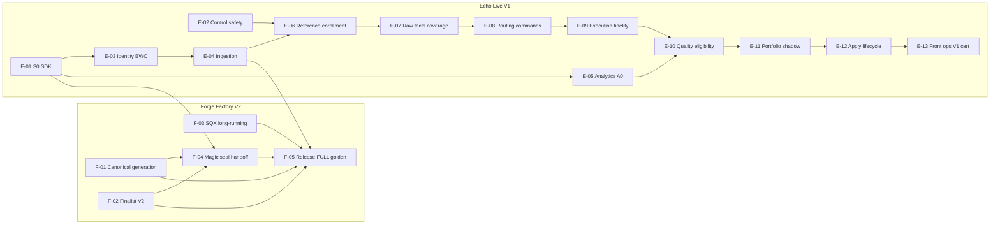

# Echo — Producto Integrado

%% Naming: Echo — Producto Integrado es el link canónico del proyecto; aliases guarda variantes humanas; tags/slugs son solo automatización. %%

> [!info]+ Echo — Producto Integrado
> **Área:** [[Echo]] · **Estado:** active · **Prioridad:** P1 · **Inicio:** 2026-09-07
> Proyecto padre de producto. Exactamente dos subproyectos de agente: [[Echo Forge — Factory V2 Completion]] y [[Echo — Live Platform V1]]. El contrato compartido es Resource + Echo SDK, no un tercer proyecto.

> [!abstract]- Ownership del proyecto (`owner`) — humano vs agente
> `owner: me` → **proyecto humano**: la iniciativa/esfuerzo que conduces tú.
> `owner: agent` → **proyecto de agente**: un curro delegado, con detalle pesado que escribe y sigue un agente. Casi siempre es subproyecto de uno humano y vive en la subcarpeta `agentes/` de su iniciativa.
> `root: true` solo en **iniciativas raíz** (sin `parent`). Todo subproyecto debe setear `parent`; si no, aparece como huérfano en [[Panel de Proyectos]].
>
> **Tarea puente:** cada subproyecto de agente se representa aquí con UNA sola tarea humana `#type/supervision`. El detalle de fases vive en el hijo.

## 🎯 Objetivo

Echo es la plataforma integrada de trading algorítmico personal del owner: volver a trabajar **en trading** con un sistema usable, no pasar el resto del año perfeccionando infraestructura.

Echo Forge fabrica y reduce estrategias con evidencia reproducible. Echo recibe estrategias promovidas, observa una Reference, copia/ejecuta bajo políticas, mide comportamiento real, construye portfolios y administra capital de forma durable, explicable y segura.

La función de optimización es **TIME_TO_USABLE_TRADING_SYSTEM**, sujeta a correctness, execution safety, identity integrity, data integrity, recoverability, auditability y reasonable scalability. Valores técnicos: SCALABILITY / ROBUSTNESS / CLEAN / SOLID, simultáneamente KISS / YAGNI / BOUNDED TECHNICAL DEBT.

## 📊 Estado actual

- **Roadmaps operativos congelados 2026-09-07.** Este padre es la visión de producto. La ejecución vive en los dos subproyectos de agente. No hay implementación, SPEC de fase ni mutación de source en esta sesión.
- **Decisión de continuidad 2026-09-13:** desarrollo continúa; certificación física/de infraestructura se difiere, no se waiva, mientras termina [[AGENT-PLATFORM - MCP Access Plane]]. `IMPLEMENTED != CERTIFIED`. Backlog único: [[Echo + Echo Forge — Deferred Certification Backlog]].
- **Taxonomía de estado:** `PLANNED → IMPLEMENTED → SOURCE VERIFIED → RELEASED → DEPLOYED → PHYSICALLY CERTIFIED → CROSS-LANE CERTIFIED → CLOSED`; no se marca un estado de certificación sin evidencia de su propia capa.
- **Contrato compartido:** [[Echo SDK — Canonical Forge Integration and Analytics Contract V1]] con freeze review [[Echo SDK — Canonical Contract Final Freeze Review — Fable 5.1]] en disposición **B — FREEZE AFTER BOUNDED CORRECTIONS**. FR-1…FR-5 entran en E-01/S0. **GOD REQUIRED NOW: NONE.** No queda TOP de arquitectura para este contrato.
- **Forge checkpoint:** B1A `185825c`, B1B `ef65dd1`, B2 `db8a022` son **PASS / CLOSED**. No reabrir ownership global, wall-clock MT5 ni lifetime Temporal. Siguiente Forge: F-01/F-02 en paralelo con Echo S0. Control histórico: [[Echo Forge - Arquitectura de Datos y Migración de Persistencia]] y [[Echo Forge]].
- **Echo checkpoint:** core productivo reportado `e25165ba`; ingestión canónica ausente; Lab/journal/copia existen con deuda P0 de auth/journal. Discovery histórico: [[Echo - Discovery y Estado]].
- **Usable V1 ≠ cartera financiada.** Software puede completar con CASH/INSUFFICIENT_EVIDENCE. Dinero real es gate owner aparte (O-01).
- **F-04 resultante:** implementación y source/contract verification DONE en `b57bfb2c3d2c4e0a96d2b3fa654cea41e1a64f43`, release `0.2.98` publicada, Linux rollout PASS; Windows physical certification, authentic golden y Echo join quedan deferred. Overall `IMPLEMENTED / NOT CERTIFIED`; T2.11/T2.12/T2.13 y E-04 T21 no se cierran.
- **Join DEV 2026-09-21T04:18Z:** `CERT_E04_01_PASS` + `CERT_F04_03_PASS` sobre golden F04-02 y Gateway `3d260e81` (HTTPIngress `a2321cc`). Contrato: [[Echo + Echo Forge — Environment Contract]] §5.5.
- **Git recovery 2026-09-21T13:0xZ:** commits E-04 recuperados y **publicados** en `origin/feature/e04-dev-ingest-recovery` @ `4aad647b` (FF; master intacto `5dd998f1`; Gateway DEV sigue `3d260e81`). Incluye cierre del bypass ETCD v1 (dump development→production desde `go test`) y renumeración migración 064→068 por colisión con E-06. Golden con alcance `PERSISTED_JSONB_CANONICAL_REENCODE_VERIFIED`. Siguiente carril técnico registrado: **E-08 C3** (recover durable antes de re-evaluar binding; `DecisionAt` congelado en recovery), tras el review manager del delta C2; E-10 planificable en paralelo. Cero activación de trading. Detalle: [[Echo + Echo Forge — Deferred Certification Backlog]] delta 2026-09-21T13:0xZ.
- **Join DEV 2026-09-21:** Gateway Echo DEV `2360369c` ingiere de verdad (`ECHO_DEV_INGEST_FUNCTIONAL_PASS`); CERT-E04-01/CERT-F04-03 siguen BLOCKED por bodies golden en `trading_systems_test`. Contrato: [[Echo + Echo Forge — Environment Contract]] §5.4. *(Estado del día superseded por §5.5: CERT PASS.)*

## 🧱 Entrega de desarrollo

_No aplica — este proyecto es visión/gobernanza de producto; no entrega código. Las tablas repo/branch/SPEC viven en los subproyectos de agente y se fijan al crear cada SPEC de fase._

## Visión, capacidades y fronteras

### Tesis

Forge termina en `FINALIST_PROMOTION V2`, `StrategyVersion` sellada, evidencia/artefactos verificables y `HandoffManifestV1`. Echo empieza en **validated ingestion** (`PromotionRecord` INGESTED). Provisionar, observar, habilitar elegibilidad, asignar capital y activar son transiciones posteriores independientes.

### Capacidades actuales (cualitativas)

- Forge V1 factory durable: Builder/replenishment, classify, retest/optimize/WFM/robust/Apply, export/compile/backtest físico, SQX↔MT5 fidelity analítica, Campaign/Result V1, Slot Pool V2, ownership/long-running/cancel lifetime MT5 **source closed**.
- Echo: runtime de copiado, journal y Lab Clean; catálogo descriptivo; no ingestión canónica, no enrollment versionado, no portfolio de estrategias productivo.

### Capacidades target V1

Ver DoD acotado en [[Echo + Echo Forge — Arquitectura de producto, gaps y roadmap de cierre 2026#16. Definition of Done 2026: bounded Product Complete V1]] y mínimo usable en [[Echo + Echo Forge — Independent Reality Check and Time-to-Value Plan#5. Minimum Usable Trading System V1]]. En corto: generar→reducir→validar físicamente→inspeccionar→ingestar→observar→comparar→seleccionar→asignar riesgo acotado→aplicar→pausar/reemplazar→explicar, Forex/MT5-first, un owner.

### Fronteras Forge vs Echo

| Posee Forge | Posee Echo | No es de ninguno ahora |
|---|---|---|
| GeneratedStrategy, StrategyRef/canonical, magic allocation, StrategyVersion seal, Evaluation/evidence Forge, FINALIST_PROMOTION, Handoff | Validated ingestion, RuntimeBinding/Reference, facts/DEAL, Coverage, EconomicCommand, Execution Fidelity, Strategy Quality, eligibility, PortfolioVersion, risk/apply | Eligibility recalculada en Forge; escritura Forge sobre DB Echo; SDK gobernando autoridades de dominio |

Echo SDK gobierna el **lenguaje contractual compartido**. No gobierna autoridades de dominio. Dirección owner: Forge convergerá/migrará hacia Echo en el futuro; eso no autoriza un tercer proyecto Integration.

Preservar: INGESTION ≠ PROVISIONING ≠ OBSERVING ≠ ELIGIBILITY ≠ CAPITAL ≠ ACTIVATION.

### Lenguaje canónico

Única autoridad de wire/tipos/fixtures: Echo SDK nested `v3/sdk/contracts`. S0 pertenece al subproyecto Echo. Forge consume el pin. Fixtures/gates se referencian por ambos. Cambio contractual: PR en Echo SDK → review cruzado → pins secuenciales.

### Invariantes globales (no reabrir)

IDENTITY ≠ EXECUTION ≠ EVALUATION ≠ METRICS ≠ TRADES ≠ ARTIFACTS ≠ SCORE ≠ RANKING ≠ DECISION. Strategy Quality ≠ Execution Fidelity ≠ Forge SQX↔MT5 Fidelity. Finalist ≠ Top N. Ranking ≠ membership. Warning ≠ invalid strategy. Reference = operación observada en broker Reference, no señal ideal pre-broker. DEAL = hecho económico irreducible. StrategyVersion ≠ Strategy ≠ RuntimeBinding.

## Ciclo de producto

Reference path integrado. **Forge sigue siendo un pipeline secuencial, pero su topología es dinámica y no está congelada**: cada run compone stages desacoplados por contratos; puede omitir/repetir stages y usar outputs previos como input de nuevas generaciones. Cada generación produce estrategias/artefactos nuevos con identidad y lineage propios; nunca muta la estrategia/template origen. Lo frozen son contratos, invariantes, semántica de artefactos y boundary Forge→Echo. `FINALIST` sólo se emite cuando satisface su contrato canónico, independientemente del camino recorrido.

GENERATION → CLASSIFICATION / EARLY REDUCTION → RETESTER → OPTIMIZER → WFM → ROBUST SELECTION → FINAL RETEST → MT5 CONVERSION → PHYSICAL MT5 VALIDATION → FORGE FIDELITY → FINALIST → HANDOFF → ECHO INGESTION → REFERENCE ENROLLMENT → REFERENCE OBSERVATION → EXECUTION → STRATEGY QUALITY + EXECUTION FIDELITY → ELIGIBILITY → PORTFOLIO → RISK → CAPITAL ALLOCATION → APPLY → MONITORING → REBALANCE / REPLACEMENT / RETIREMENT.

### Estado de éxito usable

Escalera [[Echo + Echo Forge — Independent Reality Check and Time-to-Value Plan#8. Product Usability Ladder]]: V1 apunta a nivel 4 DEMO automático con CASH válido y nivel 5 REAL sólo con aprobación owner. Nivel 6 autonomía amplia está **fuera** del compromiso V1.

### Fuera de scope ahora

Netting implementation; MT4 nuevo al estándar 64-bit; Futures; multi-tenant; generic provisioning framework; batch ingestion; ML; advanced optimizer; generic event sourcing; complete UI rewrite; historical perfect backfill; editor de estrategias en front; reejecución GUI completa; auto-takeover MT5 no-TTL.

Front V1: **READ / OBSERVE**. Viewer SQX en VM dedicada es SHOULD, no edición. Reexecution from UI es later.

## 🧩 Subproyectos

Exactamente dos, ambos `owner: agent` bajo `10-projects/Echo/agentes/`:

1. [[Echo Forge — Factory V2 Completion]] — 5 Agent Tasks (F-01…F-05).
2. [[Echo — Live Platform V1]] — 13 Agent Tasks (E-01…E-13). S0 vive aquí.

[[Echo Forge]] permanece como programa histórico operativo; su roadmap restante de factory se ejecuta en el subproyecto Factory V2, no como tercer hijo de producto. [[Echo - Discovery y Estado]] permanece como proyecto de comprensión, no de delivery.

```base
filters:
  and:
    - 'type == "project"'
    - 'file.hasLink(this.file)'
views:
  - type: cards
    name: Subproyectos
    order:
      - file.name
      - note.status
      - note.priority
```

## Mapa de dependencias cruzadas



| Fase Forge | Dependencia Echo | Puede correr en paralelo con | Join gate |
|---|---|---|---|
| F-01 Canonical generation | ninguna | E-01, E-02, F-02, F-03 | ninguna |
| F-02 Finalist V2 | ninguna | E-01, E-02, F-01, F-03 | ninguna |
| F-03 SQX long-running | ninguna | F-01, F-02, E-01 | entra a F-05 |
| F-04 Magic/seal/handoff | **pin S0 (E-01)**; catálogo CC owner antes allocation real | E-03, E-04, E-05 | Integration: mismo corpus/pin; manifest fixture aceptado por E-04 |
| F-05-I Release/read-surface preparation | F-04 implementación disponible; no requiere evidencia física | E-05/E-06… con contratos/fixtures | puede avanzar sin certification PASS |
| F-05-C Release + FULL golden certification | pin S0, F-04 golden y E-04 T21 | cadena live Echo posterior a E-04 | Physical integration / PRODUCT CAPABILITY cuando ambos tracks certifican handoff→receipt |

| Fase Echo | Dependencia Forge | Puede correr en paralelo con | Join gate |
|---|---|---|---|
| E-01 S0 SDK | ninguna | F-01, F-02, F-03, E-02 | pin publicado; Forge F-04 lo consume |
| E-02 Control safety | ninguna | E-01 y todo Forge interno | antes de confiar captura live |
| E-03 Identity/BWC | E-01 | F-04, E-05 | implementation closed habilita **development** E-04; CONTRACT_PASS habilita **integration** E-04 |
| E-04 Ingestion | E-01 + E-03 implementation (dev); E-03 CONTRACT_PASS (integrate); producer fake basta | F-04 tras pin | INTEGRATION PASS handoff↔receipt gated; development paralelo permitido |
| E-05 Analytics A0 | E-01 | E-03/E-04 | planning v1.0.1 @ `dd1f2da9`; alimenta E-10; no espera E-02 PHYSICAL para development/implementation/verification; merge/deploy 063 espera 062 E-02 en master |
| E-06…E-13 live | E-04 integrado; supply físico Forge ayuda, fixtures permiten implementación/shadow | según DAG interno | implementación puede avanzar; PHYSICAL/PRODUCT CAPABILITY no se certifica con mocks |

**Continuidad recomendada:** ejecutar sólo el F-05-I definido en [[Echo Forge — Factory V2 Completion]]; no lanzar implementación desde esta sesión. E-04 T21 y T2.11–T2.13 permanecen en el backlog de certificación.

## Gobernanza

Metodología: **TOP planea → crea SPEC(s) → NORMAL implementa.** NORMAL no rediseña contratos/decisiones frozen; si aparece contradicción material, STOP / escalate.

Clases de modelo: NORMAL (Luna / GLM 5.3 Flash) implementa SPECs congeladas. TOP (Grok 4.5 / GLM 5.3) planifica fases, SPECs y RCA acotada. GOD (Fable 5.1 / Astra) sólo decisiones estructurales caras de revertir. RESERVE: DeepSeek V4. Escalation por riesgo de decisión, no por tamaño de codebase ni incertidumbre del agente previo.

Una Agent Task **no es** la SPEC de implementación. Cuando una fase se activa, TOP lee este padre + el subproyecto + la Agent Task + contratos frozen, revalida baseline, y escribe SPECs con baseline, scope, allowed files, autoridades, identity/data, error/retry/terminal, tests, release/deploy permissions, gates, certificación y stop conditions. Sin contratos de coding ambiguos.

Certificación no es “code merged”. Distinguir SOURCE PASS / CONTRACT PASS / INTEGRATION PASS / PHYSICAL PASS / PRODUCT CAPABILITY PASS. No certificar capacidad física con mocks.

Release: burn-down amplio → matriz determinística → un release cohesivo → certificación física. No churn de release-por-fix. No empaquetar sistemas de alto riesgo no relacionados.

Roadmaps **secuencian trabajo**; no redefinen verdad de dominio. No promover sequencing a Decisions.

## Deuda aceptada

Deuda acotada es herramienta. No convertirla en blocker sin impacto material. Cleanup sólo cuando desbloquea capacidad o corrige una regresión material.

## ✅ Tareas

> [!example]- Fuente de tareas — editar / mover de estado aquí
> %% Estados: [ ] To Do · [/] WIP · [r] Review · [x] Done · [-] Canceled. Owners: #owner/me, #owner/agent. Tipos: #type/dev #type/admin #type/research #type/pr-review #type/supervision. Flags: #blocked #waiting #urgent. Ver [[convenciones]]. %%
> - [ ] [[Echo Forge — Factory V2 Completion]] arrancar + seguimiento #owner/me #type/supervision #area/echo
> - [ ] [[Echo — Live Platform V1]] arrancar + seguimiento #owner/me #type/supervision #area/echo
> - [x] [[Echo — Knowledge Base Consolidation]] campaña documental: cartografía Echo/Forge, wiki canónica, AGENTS.md routers, higiene context budget #owner/me #type/supervision #area/echo
> - [ ] Ratificar catálogo magic CC antes de allocation física F-04 #owner/me #type/admin #area/echo
> - [ ] Confirmar O-01/O-02/O-03 de mandato 2026 cuando el track live lo necesite #owner/me #type/admin #area/echo

## 📆 Bitácora

- **2026-09-21 (git recovery R1)** — TOP manager publica `feature/e04-dev-ingest-recovery` @ `4aad647b` (commits certificados E-04 + fix seguridad ETCD + renumeración 064→068); runtime DEV intacto; golden con alcance reencode JSONB; owner actions ETCD registradas; siguiente carril E-08 C3. Detalle en Backlog y [[Echo — E-04 Forge Ingestion E1]].
- **2026-09-21** — Gate de ambiente `ECHO_CORE_GATEWAY_DEV_SYSTEMD_PASS` **completo** en Daedalus (mandato owner 2026-09-20): Core y Gateway DEV `RUNNING/PHYSICALLY_VERIFIED` (systemd --user + linger, release `5dd998f1`, health 200, restart/kill-recovery PASS, PG DEV conectada y grupo Kafka `echo-core-v3` STABLE como único miembro). Bloqueo inicial (credencial PG) resuelto por owner; causa raíz: seed tests de `echo_seed_test.go` (v1/v2/v3) sobrescriben la password en ETCD real de **ambos namespaces** sin guardas — corrección del repo pendiente al manager. Detalle completo y ownership en [[Echo + Echo Forge — Environment Contract]] §5.1. No certifica producto ni join Forge→Echo.
- **2026-09-13** — Owner acepta [[Echo — Knowledge Base Consolidation]] tras revisión final: bridge `[r]→[x]`. Campaña documental cerrada; remediación P0 de secretos queda como trabajo operacional separado y no reabre KBC.
- **2026-09-13** — Campaña [[Echo — Knowledge Base Consolidation]] COMPLETE (fases A–K): subdominio `30-resources/applications/echo/` publicado y verificado adversarialmente (frontera Forge→Echo rota en producción documentada con gaps G1–G7); AGENTS.md de repos como patches propuestos; 2 hallazgos de seguridad escalados al owner (credenciales `30-resources/APIs.md` y contraseña SSH en symphony tracked). Puente → Review.
- **2026-09-11** — E-04 TOP: hijo [[Echo — E-04 Forge Ingestion E1]]. Development E-04 puede partir en paralelo con verification E-03; integration/merge gated por E-03 CONTRACT_PASS. `origin/master` no se mueve. Join Forge no closed.
- **2026-09-07** — Roadmaps operativos congelados. Dos subproyectos de agente. Sin implementación en esta nota.
