# B — Architecture Decision Report

> **PROPUESTA, NO RATIFICADA.** Arquitectura de producto y transición, sin cambios de código, infraestructura ni datos. Las decisiones frozen se conservan salvo reapertura acotada justificada en [[F — Decision Register]]. Contrato de producto: [[A — Product Contract — The Lab]].

Informe de decisiones arquitectónicas, 22-09-2026, **PROPUESTA PENDIENTE DE RATIFICACIÓN**. La base Echo/Forge es reutilizable; se necesita completar y corregir la cadena analítica, no una reescritura global. No cambia el estado de contratos o certificaciones existentes. Producto: [[A — Product Contract — The Lab]]. Estado verificable: [[C — Reality and Gap Matrix]].

La arquitectura presente sirve como foundation, pero NO entrega The Lab como producto: S0 define tipos y sellos, E-05 produce TradeSet/MetricSet con calculator de métricas y persistencia write-once, E-04 acepta promociones y copia artefactos operativos; ninguno prueba el ensamblado de dos históricos de operaciones, una única historia publicada, N curvas por algoritmo y front usable. E-10 M7 desarrolla Strategy Quality Reference-forward y eligibility, no sustituye ese producto. Evitar tanto el rewrite de Echo como seguir agregando subsistemas de elegibilidad antes del primer vertical slice. Fuente: `xKoRx/echo@5dd998f1`, `specs/FEAT-FORGE-INGESTION-E1/SPEC.md`, `specs/FEAT-ANALYTICS-CONVERGENCE-A0/SPEC.md`, `v3/sdk/contracts/analytics.go`, `v3/sdk/analytics/calculator/calculator.go`; proyecto [[Echo — E-10 Strategy Quality and Eligibility]] actualizado 2026-09-22.

### Diagnóstico y diseño objetivo

Hoy conviven: journal operacional; Lab legacy/SQL; Lab Clean con canonical/outcomes/segments/curvas/snapshots; y S0/E-05 con TradeSets/MetricSets sellados. El último proporciona buena identidad y persistencia, pero su writer calcula métricas directamente del set, carece de curvas extensibles y no tiene proyección de operaciones consultable. E-04 acepta el handoff operativo sin materializar los dos históricos. La UI Lab Clean consume otra semántica. Tener estas piezas implementadas no entrega la cadena del producto.

```mermaid
flowchart LR
  SQX[SQX y reportes] --> F[Forge: extracción y evidencia]
  MT5[MT5 y deals] --> F
  F --> H[Handoff existente extendido]
  H --> I[Echo Gateway: recepción validada]
  J[Journal y hechos broker E07] --> N[Adaptadores Echo a operaciones S0]
  I --> N
  N --> TS[PostgreSQL: TradeSets sellados]
  TS --> P[Proyección relacional reconstruible]
  P --> HR[HistoryRevision: selección única]
  HR --> CC[SDK CurveCalculator versionado]
  CC --> MC[SDK MetricCalculator E05 evolucionado]
  CC --> PG[Runs y puntos en PostgreSQL]
  MC --> PG
  PG --> UI[Hasura y Front Lab]
  UI --> PR[Portfolio research futuro]
  PR --> AS[Assignment autorizado mediante Echo]
```



Forge conserva originales en MinIO y evidencia de evaluación/trade lists en su Mongo existente. Echo conserva manifiestos de origen y digests, operaciones S0 y selección. Forge no escribe tablas de Echo ni calcula curvas oficiales de Lab. No se añade microservicio, DSL, plugin dinámico, Mongo analítico o motor genérico.

### Ownership y contratos

| Responsable | Es dueño de | No debe hacer |
|---|---|---|
| Forge Factory | Generación, evaluación, finalistas, sellado de versión, dos historias y evidencia | Crear política analítica final, activar cuentas |
| Echo SDK/S0 | Identidad, DTO/versionado, validación, canonicalización, algoritmos puros, repositorios | Depender de Gateway/Core/Worker o de otra aplicación |
| Echo Gateway/E-04 | Única entrada, auth, validación del bundle, recepción y jobs durables | Llamar a Forge para fabricar datos dentro de una transacción PG |
| Lab Worker existente | Orquestar jobs idempotentes, selección, cálculo, publicación | Duplicar fórmulas o ser autoridad sobre facts |
| Core/E-06/E-07 | Bindings, hechos y observación operacional | Mutar historia de entrenamiento ni pedir elegibilidad para leerla |
| Hasura/Front | Lectura autorizada de proyecciones; controles de consulta | Recalcular métricas o usar admin-secret en cliente |
| E-08/E-09/E-12 | Autorización, reservas, comandos y reconciliación por cuenta | Contaminar Strategy Quality con sizing Execution |

Cambios contractuales mínimos: extensión versionada del bundle de investigación; requisitos de operación/riesgo/precio/especificación; HistoryRevision; CurveRun; selectores métricos completos y catálogo ampliado; read model de disponibilidad. Mantener HandoffManifestV1, NormalizedOperationV1 y contratos de referencia en compatibilidad: si el decoder/hash actual no tolera la adición, usar versión nueva explícita. No agregar campos silenciosamente a un frozen ni falsificar Scope.

### Operaciones y autoridad única

`NormalizedOperationV1` ya separa identidad, procedencia, instrumento, tiempo, economía, riesgo, referencias y missing_fields. `TradeSetV1` fija contenido ordenado; 063 almacena envelope más payload NDJSON en PostgreSQL con write-once. **KEEP.** El NDJSON es suficiente para reconstruir un batch, insuficiente como único acceso para paginar operaciones, filtrar períodos, calendarizar, resolver correcciones y combinar referencias a escala.

Añadir proyecciones reconstruibles, no una segunda autoridad editable. Nombres siguientes son lógicos propuestos, no tablas existentes:

| Objeto | Clave y contenido mínimo | Invariante |
|---|---|---|
| operation_revision | operation_ref, record_digest; tiempos UTC; versión; specs; economía decimal; calidad; payload canónico | Una revisión exacta; INSERT sólo desde proyector verificable |
| trade_set_member | trade_set_ref, operation_ref, record_digest, ordinal | Coincide uno a uno con NDJSON; indexar set y operación |
| history_revision | subject/version, A/B/status, source refs/digests, selection policy, as_of, coverage, membership digest | Identidad de pregunta separada del digest de output |
| history_member | history_ref, operation_ref, record_digest, period y source_set | Una revisión seleccionada por evento; exclusiones auditables |
| history_publication | StrategyVersion → history_ref + revisión de CAS | Una publicada por versión; promoción explícita con compare-and-swap |
| curve_run/curve_point | input refs, algoritmo/config/schema/basis, estado; puntos tiempo/seq, valor, contribution refs | Inmutable al completar, digest validado; punto inicial |
| MetricSet + proyección | Identidad métrica completa, curva/ventana, cobertura | Se reutiliza S0; sin segundo catálogo de métricas Lab |

OperationRef mantiene el hash S0 de source_namespace + source_origin inmutable + source_operation_key. record_digest identifica una corrección; supersedes la encadena. Distintos simuladores no comparten identidad económica por parecido numérico. La historia selecciona miembros de TradeSets homogéneos; no inventa un TradeSet con engine `OTHER` para mezclar SQX, MT5 y Reference. Una historia compuesta necesita manifiesto nuevo. La representación MetricSet de ese input debe pasar los validadores S0; si no puede expresar su lineage, extensión versionada antes de implementarla.

Las proyecciones se reconstruyen desde los sets sellados y su especificación de parseo; se prueba count, order y digest. Se prohíbe UPDATE manual para «arreglar» una fila derivada. Las correcciones ingresan por la misma normalización auditada. Originales, conjuntos sellados y manifiestos son durables; cache, puntos y vistas son reconstruibles. No borrar un set porque ya existe un gráfico.

### Ingestión sin circularidad

Mantener una sola entrada E-04. Bundle completo incorpora por cada fuente: engine/formato/parser-version, evaluation/result/sample refs, StrategyVersion sellada, scope/rangos/timezone con evidencia, URI permitida MinIO, tamaño/digest de bytes y digest de contenido canónico, cantidad de operaciones, especificaciones e información de entrenamiento A. Incluir fuente original y trade list; un reporte agregado no sustituye operaciones. El hash de bytes comprimidos no equivale al payload_digest.

Flujo propuesto: validar auth/identidad/manifest → verificar/descargar artefactos con límites y streaming fuera de la transacción → normalizar y validar → transacción corta guarda receipt, sets, provenance y job durable → worker construye proyección/historia/curvas → publicación atómica de revisión y read readiness. Si el volumen exige fases, receipt queda recibido/procesando; la integración no declara éxito analítico antes de persistir TRAINING_DATA. Nunca mantener una transacción PG durante un backtest o llamada larga a Forge.

La aceptación operativa existente sigue siendo `INGESTED` conceptualmente. Exponer disponibilidad separada: recibido, validando, datos incompletos/conflicto, historia lista, curvas listas, error retryable. Reutilizar enums existentes si expresan esto; no unificar todo en un status de estrategia. `REFERENCE_OBSERVING` proviene del binding físico, jamás del receipt. Reintento mismo idempotency key + mismo digest = mismo resultado; misma key + digest distinto = conflicto. Fallo MT5 no pierde SQX, pero muestra bundle incompleto y no completa la integración analítica. No se necesita enrollment ni eligibility para importar entrenamiento.

### Motor extensible dentro del SDK

Interfaz conceptual pequeña en Go, ubicación propuesta `v3/sdk/analytics/curves/`:

```go
// Boceto contractual; tipos concretos deben ratificarse, no es código implementado.
type CurveAlgorithm interface {
    Describe() AlgorithmDescriptor
    Validate(CurveInput) []InputIssue
    Calculate(context.Context, CurveInput) (CurveResult, error)
}
// Registry[algorithmID + version] -> implementación compilada.
```

Descriptor declara esquema de parámetros, inputs, basis/unidades, modelo de costos, missing-data policy, reglas de orden y determinismo. CurveInput fija HistoryRevision y miembros, ventana/selector, algoritmo/config digest, specs, as_of y evidencia de cobertura. CurveResult contiene puntos **y contribuciones por operación**, estado, conteos incluidos/excluidos, razones y digest. Puntos solamente no bastan para PF/expectancy/SQN ni auditoría de qué trade produjo el salto.

Identidad del run = hash canónico etiquetado de la pregunta completa, nunca de su propio output. El output tiene digest separado, write-once. Campos numéricos exactos, reglas de redondeo explícitas, UTC parseado para orden, tiebreak estable por identidad. Al mismo instante se agrupan contribuciones de cierre para DD; mantener orden secundario para drilldown. Se incluye punto inicial antes del primer cierre. Versionar cualquier cambio de regla.

Separar `CurveCalculator` puro de `MetricCalculator`: E-05 conserva funciones y catálogo reutilizables y evoluciona sus inputs/selectores; no crear `LabMetricsEngine` paralelo. Su `CanonicalWriter.Write` actual guarda scope/set, calcula y guarda métricas en una transacción. Extraer primitivas para guardar sets y solicitar cálculos; conservar el método antiguo como wrapper compatible. Worker llama las mismas primitivas. Una única autoridad de escritura y de fórmulas.

Algoritmos iniciales compilados: `cumulative-risk@1` con basis R_PIPS o R_MONEY explícita; `cumulative-price-move@1` con pip/tick spec; `fixed-risk-capital@1` con C0 y riesgo monetario fijo por operación; `recorded-net-capital@1` para impacto observado identificado. El catálogo puede admitir N IDs futuros. Fixed-fraction/risk policies no necesitan DSL: otro algoritmo tipado cuando hay datos de aperturas y concurrencia suficientes. El primer slice no depende de ese algoritmo adicional.

### Fórmulas y compatibilidad cuantitativa

Sea x_i contribución coherente de una operación, S_t acumulado, C_t capital realizado y H_t=max(C0,C_s hasta t). Todos los inputs comparten basis/ventana/costos.

| Métrica | Definición propuesta | Disponibilidad/restricción |
|---|---|---|
| Return | Capital: C_end/C0−1; R/pips: suma x_i en esa unidad | No llamar porcentaje a R ni pips; C0>0 |
| MDD absoluto | max_t(H_t−C_t); para R/pips, peak desde 0 | Sólo drawdown realizado, no intratrade |
| MDD relativo | max_t((H_t−C_t)/H_t) | Sólo capital con H_t>0; distinto de DD/C0 |
| Drawdown actual | H_end−C_end y, si aplica, /H_end | Mismo inicial y unidad que MDD |
| Return/DD | Retorno relativo / MDD relativo | DD cero → insuficiente, no infinito |
| Recovery Factor | Beneficio neto / MDD absoluto, misma unidad | DD cero → insuficiente; no confundir con Return/DD |
| Profit Factor | suma max(x_i,0) / abs(suma min(x_i,0)) | Pérdidas cero → insuficiente, incluso si todas ganan |
| Expectancy | mean(x_i) | N>0, unidad explícita, sin imputar faltantes |
| SQN descriptivo | sqrt(N)·mean(R_i)/sample_sd(R_i) | N≥2 y sd>0; no test de independencia ni garantía de edge |
| Win rate | count(x_i>0)/N; ceros incluidos en N | Misma muestra que curva; política de ceros visible |
| Sharpe | mean(r_daily−rf_daily)/sample_sd(r_daily−rf_daily) | Capital regular diario, cobertura, calendario y rf explícitos; no sobre trade-R irregular |
| Frecuencia | operaciones cerradas / tiempo observable en unidad declarada | Excluir gaps de denominador; informar cobertura y exposición |
| Duración | closed_event−opened_event | Clocks válidos; percentiles por operaciones, no diferencias de recorded |
| Calidad/cobertura | incluidos/seleccionados, tiempo observado/requerido, razones | No colapsar en un score económico |

Sharpe anualizado añade sqrt(K) sólo bajo hipótesis de periodicidad/escala declaradas; con autocorrelación no implica automáticamente comparabilidad. Ver [Sharpe, The Sharpe Ratio](https://web.stanford.edu/~wfsharpe/art/sr/sr.htm). No hay Sharpe honesto del saldo cerrado que afirme medir equity intradía. R_MONEY usa net/risk_money compatible; R_PIPS usa movimiento firmado/riesgo inicial en la misma unidad, con etiqueta gross si no hay costos convertibles. No interpolar precios para fabricar MAE/MFE.

Defectos materiales a corregir por nueva versión: `pipsProfitOf` A0 retorna vacío; el catálogo carece de varias métricas solicitadas; selector Requested por key no permite dos bases de la misma key; DD relativo A0 divide por initialCapital mientras el ejemplo frozen alude a peak equity. Mantener resultados antiguos con identidad antigua; añadir fórmula peak-relative nueva. La implementación existente no se «arregla» retroactivamente cambiando el significado de formula_v1.

Capital virtual fijo: C_t=C0+q·sum(R_i), q constante y configurado; no usa lotaje real. Una política de fracción de capital debe calcular tamaño al OPEN con capital disponible, exposiciones simultáneas y regla de reserva; multiplicar secuencialmente resultados por orden de cierre puede usar capital futuro. Sin esas pruebas, algoritmo insuficiente. Escalado lineal de costos es hipótesis explícita, no observación. Insolvencia produce estado terminal/inválido según receta, nunca capital negativo tratado como retorno normal.

### Disposición por componente

| Componente | Disposición | Problema/evidencia; capacidad y compatibilidad; costo/dependencia |
|---|---|---|
| S0 identidad, canonical hashing, refs/versiones | KEEP | Contratos y tests existentes; reemplazo alto y sin beneficio; acotar extensiones |
| E-05 sets/MetricSets/write-once | ADAPT | Buen durable, acoplamiento writer/calculator y NDJSON-only; costo medio, conserva envelopes |
| NormalizedOperation | ADAPT | Riesgo/precio/spec están modelados, adaptadores no los llenan; sólo ampliar contrato si no expresa evidencia real |
| Fórmulas E-05 | ADAPT | Reusar exactitud racional; añadir registry/selectores/curvas, preservar versiones anteriores |
| E-04/F-04 | ADAPT | Handoff no transporta historia requerida; única entrada, extensión compatible, costo medio |
| Forge generación/ranking/F-01…03 | KEEP | Fabrica finalistas, no garantiza equivalencia histórica; delta de extracción/identidad separado |
| Journal y hechos originales | KEEP | Base operativa; no analytics columns ni reescritura/backfill ficticio |
| E-06/E-07 bindings/DEAL/lifecycle/coverage | KEEP | Fuente REAL y corrección; reparar atribución física de magic antes de enrollment |
| E-08/E-09 routing y fidelity | KEEP | Necesarios para ejecución; no prerequisito de curvas históricas |
| E-10 M6/M7 integridad | KEEP | Fixes de identity/provenance/decimales/snapshot útiles; pendiente review final |
| E-10 eligibility/regímenes y política calendario | DEFER | No bloquean consultar historia; continuar sólo luego de slice y ratificación |
| Worker Lab | ADAPT | Reutilizar host/jobs; reemplazar recompute destructivo y fórmulas duplicadas, costo medio |
| Lab Clean segments/capital/snapshots | REPLACE | recorded_time y 10k+PnL no normalizan; nueva selección/curvas con versiones explícitas |
| Old canonical/outcomes/SQL legacy | RETIRE condicionado | Dos autoridades perpetúan deuda; retiro tras paridad de consumidores, respaldo y rollback |
| Front Vue/Apex/UiCard/tabla | ADAPT | Reusar shell; sustituir series por índice/smooth y providers obsoletos, costo bajo/medio |
| Hasura read layer | ADAPT | Proyecciones nuevas con READ auth, queries paginadas; no cálculo cuantitativo en UI |
| Auto-recovery, candles, plugins, Timescale/Mongo nuevo | DEFER | No necesarios para primera capacidad; costo/riesgo sin evidencia que lo justifique |

### Escalabilidad con supuestos explícitos

Datos observados: PROD 152 strategy_definitions, 3.541 trades Lab Clean y 5.848 puntos; no usar estas cuentas de tablas como proyección de carga máxima. Escenarios siguientes son supuestos de capacidad y no mediciones de infraestructura; estrategias aquí significa versiones analíticas activas.

| Escenario | Versiones × historias × trades por historia | Operaciones | Curvas activas por historia | Puntos si un punto/trade/curva | Recomputation y concurrencia |
|---|---|---:|---:|---:|---|
| Piloto | 100×2×1.000 | 200.000 | 4 | 800.000 | Al importar/cambiar; hasta 5 lectores |
| Crecimiento | 1.000×2×10.000 | 20 millones | 6 | 120 millones | Batch diario + dirty subjects; 30 lectores |
| Estrés | 10.000×3×20.000 | 600 millones | 10 | 6.000 millones | Cálculo bajo demanda/cache; 100 lectores |

A 1 KB/operación proyectada y 100 B/punto, piloto≈200 MB+80 MB, crecimiento≈20 GB+12 GB, estrés≈600 GB+600 GB de payload antes de índices, originales, réplicas y backups. Multiplicador orientativo 2–4× debe medirse. Materializar N curvas de toda revisión histórica indefinidamente explota almacenamiento; no es requisito del producto.

Inicial: B-tree por `(strategy_version_ref, closed_event, operation_ref)`, por `(set_ref, ordinal)` y `(history_ref, period, closed_event, operation_ref)`; unique refs/digests; puntos `(curve_run_ref,event_time,seq)`; proyecciones métricas por key+basis+formula+ventana/config para screener. Keyset pagination, batch/COPY para proyección, streaming NDJSON y límites de tamaño/descompresión. Prohibir full scan por trade para cada tarjeta.

Cache por identidad completa de consulta; materializar curvas publicadas/pedidas, reutilizar contenido, no recalcular por cada render o evento duplicado. V1 recalcula sujeto afectado completo para corrección tardía; incremental sólo con checkpoint validado y regla de invalidación desde el primer evento afectado. No parchear sólo el último punto si llegó un costo o cierre antiguo.

Umbrales propuestos para medir antes de optimizar: >10 millones de puntos activos o p95 de consulta habitual >500 ms tras índices → evaluar partición por run/tiempo; importación de 100k ops >60 s o memory>512 MB → revisar streaming/batch; 30 lectores y screener p95>1 s → proyección/cache. No prometen capacidad actual ni justifican instalar Timescale ahora. Reducir puntos para visualización preservando extremos y gaps; métricas usan serie completa y digest original, no downsample.

Retención: operaciones, fuentes elegidas, manifests y decisiones sin TTL por defecto; caches/puntos reconstruibles pueden expirar por política después de verificar reconstrucción. Backups PostgreSQL más MinIO/versionado deben restaurarse en aislamiento con validación de digests y una curva reproducida. No depender de gzip temporal o de branch local como único respaldo.

### Transición y rollback

1. Migración aditiva con ordinal reservado por un solo integrador; 069 pertenece a E-10, no asumir 070 libre sin consultar HEAD. Nuevas tablas/proyecciones no alteran journal ni posiciones.
2. Ingestar primera muestra validada en entorno aislado. Materializar historia por fuentes, no copiar indiscriminadamente `lab_canonical_trades` con timestamps recorded o riesgo sintético.
3. Comparación dual con mapping de semánticas: mismo universo/time/basis debe coincidir; diferencias deliberadas recorded/event, DD/C0 vs DD/peak y costos se documentan, no se fuerzan a cero.
4. DEV por release autorizado con backup y readback; después certificación física del flujo con estrategia real y evidencia. SOURCE_PASS no salta estos gates.
5. Front con read route seleccionable por usuario/rol; publicar revisión atómicamente. Rollback = restaurar lectura/publication anterior, detener nuevos jobs y conservar datos nuevos; no DOWN destructivo.
6. PROD sólo con autorización separada y auth E-02 verificada. Retirar worker viejo, vistas y tablas por inventario de consumidores y ventana de observación aprobada, snapshot/restore demostrado y cero lectores. No convivencia indefinida: su retiro es entregable del roadmap.

En recuperación manual, una transacción de lectura consistente evita mezclar hechos que cambian durante la evaluación. M7 usa REPEATABLE READ; una snapshot SQL por sí sola no reproduce mañana el input: persistir referencias y contenido exacto. Véase [PostgreSQL 17, aislamiento de transacciones](https://www.postgresql.org/docs/17/transaction-iso.html).

```text
FORGE (xKoRx/symphony)
  Generator + SQX evidence + MT5 validation/trade-list evidence
  StrategyVersion seal + finalist promotion + HandoffManifestV1
                   |
                   v existing E-04 ingress, verified artifact copy, receipt
ECHO identity/promotion + immutable source evidence reference
                   |
                   v one analytics-admission extension (same ingestion path)
ECHO analytics: normalize individual operations + provenance + quality
                   |
                   v deterministic period/source selection, corrections audit
ONE published HistoryRevision per selected StrategyVersion/A/B/policy
                   |
                   v ordered operations -> versioned CurveCalculators
CurveRun + exact CurvePoints + quality/coverage
                   |
                   v reusable E-05 MetricCalculator + curve-specific metrics
MetricSet (key+basis+unit+formula/window/inputs exact)
                   |
                   v existing Gateway/Hasura READ + adapted Lab front
Strategy detail / real-time-axis curves / trades calendar / screener
                   |
                   v LATER: portfolio research -> PortfolioVersion -> Echo apply

Source principal `xKoRx/echo@1485baa4574b3a65fa97cf0be842ca8ac581097a`: `v3/sdk/contracts/{analytics,trading}.go`, `v3/sdk/postgres/{canonical_writer.go,migrations/063_analytics_convergence_a0.up.sql}`, `v3/sdk/analytics/{calculator/calculator.go,formulas/closed_ops.go}`, `v3/sdk/lab/{curves,segments}`, `v3/lab-worker/internal/builders/recompute.go`, `v3/front/src/components/lab/StrategyEquityCurveLabCleanChart.vue`. Forge `xKoRx/symphony@745bc8b94e1f6148ddc16c02eb86a755088c2666`: `core/forge/handoff_producer.go`, `adapters/mt5/normalization/types.go` y extractor SQX. Autoridades: [[Echo SDK — Canonical Forge Integration and Analytics Contract V1]], [[Echo SDK — Canonical Contract Final Freeze Review — Fable 5.1]], [[Echo + Echo Forge — Environment Contract]]. Disposición ejecutable: [[D — Revised Roadmap]], [[E — First Usable Vertical Slice]], [[F — Decision Register]].
