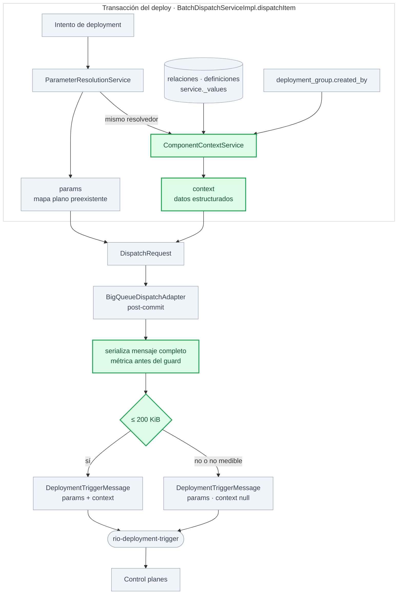

# Descripción PR — rio-playmaker

**PR:** [#1068](https://github.com/melisource/fury_rio-playmaker/pull/1068) · **Repo:** `rio-playmaker` · **Branch:** `feature/new-component-context` @ `e56811006`, pusheada — `origin` en el mismo commit · **Commits:** ocho convencionales más un merge de `develop` · **Base:** `develop` @ `708fec2c1` · **Diff:** 32 archivos, +2691 / −55 · **Working tree:** el código del PR coincide con `HEAD`; sólo `Claude.md` tiene un cambio local ajeno · **Specs:** [SIG-573](https://spellbook.adminml.com/projects/SIG/specs/SIG-573) funcional, [SIG-590](https://spellbook.adminml.com/projects/SIG/specs/SIG-590) técnica · **Dependencia:** `rio-sdk-events:0.0.2-component-version-identity`, versión de prueba · **Suite local:** 3586 tests, 0 fallas, 0 errores, 2 skipped preexistentes, más `jacocoTestCoverageVerification` PASS, rerun completo sobre `e56811006` el 2026-09-05 · **CI remoto:** en ejecución sobre este commit

> [!danger] Bloqueante — **La dependencia del SDK es una versión de prueba**
> `build.gradle` apunta a `rio-sdk-events:0.0.2-component-version-identity`, publicada desde la rama del SDK. El merge requiere publicar `1.5.0` desde `master` y cambiar el pin al semver definitivo.

> [!info] Pendientes que no bloquean el review
> Sincronizar SIG-573 y SIG-590 en Spellbook y validar la branch en preproducción. La versión `0.0.6-component-context-test` se generó desde la rama de test sincronizada; falta verificar un deployment runtime.

## Propósito

Descripción oficial del Pull Request de `rio-playmaker` para [[Crear Context]], revalidada contra el código, la suite y el PR remoto vigentes. La narrativa se limita al comportamiento que existe en `e56811006` y evita detalles transitorios que puedan desviar el review.

## Contenido

El cuerpo listo para GitHub, con las secciones del template `.github/pull_request_template.md` de `rio-playmaker`, y las notas internas que no van al PR.

---

## Descripción

**feat(pipeline): produce the component deployment context**

Este PR agrega `DeploymentTriggerMessage.context` al mensaje que Playmaker publica en `rio-deployment-trigger`. El campo contiene un `ComponentContext` efímero y opcional derivado durante cada dispatch del pipeline.

El objetivo es entregar a los control planes datos que Playmaker ya conoce y usa para resolver `params`, pero con estructura y procedencia explícitas: quién disparó el deployment, qué componente y definición se despliegan, cuál fue la última definición desplegada y qué componentes están conectados como sources o destinations. Los `inputs` de `latest_version` reutilizan el mismo `ParameterResolutionService` de `params`; los componentes relacionados publican sólo `outputs`, según el contrato del SDK.



El campo es nullable y ningún control plane necesita adoptarlo para que este cambio entre.

```
context
├─ username        String             usuario que disparó el deployment, nullable
├─ data_product    DataProduct        { id, name, team_name, environment }
├─ component       Component          { id, name, type, version, latest_version → LatestVersion { version, inputs, outputs } }
├─ sources[]       → RelatedComponent { id, name, type, outputs }
└─ destinations[]  → RelatedComponent { id, name, type, outputs }
```

`Component.version` y `LatestVersion.version` son ids de `component_definition`: el primero identifica la definición que se está desplegando y el segundo la que dejó corriendo el último deployment completado. `username` es `claims.username` del Tiger token del request: se extrae al iniciar el deploy, se persiste en `pipeline_execution.created_by`, se copia a `deployment_group.created_by` y desde ahí entra al Context.

La última versión desplegada lleva `inputs`, la configuración de `component_definition.parameters` ya resuelta, y `outputs`, los valores producidos por el control plane desde `_values`. Cada vecino lleva sólo `outputs`; no se resuelven ni descartan sus parámetros internos. La lectura del envelope reutiliza `ValueEnvelope`, el mismo helper compartido por los caminos preexistentes que resuelven esos valores.

**Cambios:**

* `ComponentContextService` deriva el Context desde la topología activa, la definición actual, el último `deploy_completed` y los service slots del ambiente.
* Los service slots internos e importados se precargan en batch; para un import se resuelven en conjunto los componentes originales, sus ambientes y sus slots, evitando consultas por vecino.
* La resolución descartada de inputs vecinos se eliminó: una referencia inválida en parámetros que no forman parte del contrato ya no suprime outputs válidos.
* Un vecino importado conserva la identidad de la copia en el contrato, pero lee configuración y resultados desde el componente original al que apunta `sourceComponentId`, igual que `params`.
* Un vecino sin slot o con valores no resolubles conserva su posición en la topología con mapas vacíos; si no tiene `component_template_code`, se omite porque el contrato requiere un tipo.
* El Context se deriva dentro de la misma transacción que crea el intento de deployment. Si la derivación completa falla, `DispatchRequestFactory` devuelve `null` y el trigger se publica sin `context`.
* Antes de publicar, el adapter serializa el `DeploymentTriggerMessage` completo y registra su tamaño candidato. Hasta 200 KiB conserva el Context; si lo supera o no puede medirlo, publica el trigger sin el campo. Nunca trunca mapas ni bloquea el deployment por este dato opcional.
* `ValueEnvelope` centraliza el unwrap que ya usaban `ParameterParseServiceImpl`, `DestinationParseServiceImpl` y `ServiceActionsServiceImpl`, y ahora también usa `ContextValueResolver`.
* El dispatch rechaza un service slot cuyo ambiente no coincide con el deployment group, en vez de desplegar silenciosamente contra otro ambiente.
* Se agregan `rio.playmaker.context.derivation` (`status:success|failed`), `rio.playmaker.context.derivation.duration_ms` —histograma del tiempo síncrono total, incluidas lecturas de repositorios—, `rio.playmaker.context.outputs.suppressed` (`reason:no_slot|unresolved`), `rio.playmaker.context.size` —histograma en bytes del mensaje candidato, emitido antes del guard— y `rio.playmaker.context.discarded` (`reason:too_large|measurement_failed`).
* Se actualiza `rio-sdk-events` desde `1.3.1` a la versión de prueba `0.0.2-component-version-identity` y se documenta el cambio en `CHANGELOG.md`.

**Lo que no cambia:**

* `params` sigue viajando sin cambios junto al nuevo campo.
* El contrato vive en `rio-sdk-events`; este PR sólo consume la dependencia y no modifica el SDK.
* `DeploymentSchemaVersion.CURRENT` permanece en `1`, para que los consumidores con una versión anterior del SDK no descarten el mensaje completo.
* No cambian la orquestación de fallos del pipeline, `DeploymentOperation.PROVISION` ni el `version` raíz del trigger.
* Ningún control plane necesita cambios para aceptar estos mensajes.

**Guía de revisión:**

* `latest_version` consulta el último estado exactamente igual a `deploy_completed`; un match por sufijo también capturaría `undeploy_completed`.
* Las consultas siguen batch por los vecinos de cada componente, no transversalmente por todo `dispatchBatch`; antes de agregar un DataLoader se observarán p50, p95 y p99 de `rio.playmaker.context.derivation.duration_ms` en Datadog.
* La selección del último ambiente se conserva para soportar data products en migración.
* La definición activa del service representa estado deseado, por eso la versión desplegada sale del historial de deployments y no del slot actual.
* Los imports siguen `sourceComponentId` sin agregar un gate propio porque es el mismo origen que usa hoy la resolución de `params`.
* La derivación es best effort y ocurre antes del adapter post-commit; una falla del Context no convierte en fallido un deployment que hoy puede ejecutarse sin ese campo.
* El safety limit sigue la recomendación publicada de BigQueue de no superar 200 KB. En las pruebas funcionales actuales el máximo observado fue 4–5 KB; la métrica previa al descarte permite detectar componentes futuros que se acerquen o excedan la cota.

**Fuera de alcance:** la adopción del Context por cada control plane, vaciar `params` y definir allowlists de claves por tipo de componente.

## Checklist de desarrollo (debe completarlo la persona asignada a la iniciativa)

* [ ] Cumplí la definición de terminado — pendiente: publicar el contrato definitivo del SDK, sincronizar SIG-573/SIG-590 y validar en preproducción
* [x] Usé [conventional commits](https://www.conventionalcommits.org/en/v1.0.0/)
* [x] El código sigue las guías de estilo del proyecto
    * [Guía Java de Fury](https://furydocs.io/code-quality/latest/guide/#/languages/java)
    * [Guía Java de DeepSource](https://deepsource.com/blog/java-code-review-guidelines#10-override-hashcode-when-overriding-equals)
* [x] Hice una autorrevisión del código
* [x] Comenté las partes del código que necesitan contexto adicional para entenderse
* [x] Actualicé la documentación correspondiente (`CHANGELOG.md`)
* [x] La aplicación sigue compilando después de aplicar los cambios
* [x] Los cambios no generan nuevas advertencias de linters o herramientas de calidad
* [x] Agregué pruebas que demuestran que la funcionalidad implementada es efectiva
    * Las pruebas unitarias son obligatorias
    * Las pruebas de integración son recomendadas
* [x] Las pruebas unitarias nuevas y existentes pasan localmente
* [ ] Los cambios dependientes fueron mergeados y publicados en los módulos correspondientes — `rio-sdk-events` sigue en `0.0.2-component-version-identity`
* [x] Actualicé la branch con los cambios recientes de `develop` — mergeada con `origin/develop` @ `708fec2c1`
* [ ] Desplegué esta branch en el ambiente de preproducción — `0.0.6-component-context-test` fue generada, falta verificar el runtime

## Checklist de revisión de código (debe completarlo quien revise el PR)

* [ ] ¿Este PR completa la iniciativa?
  * ¿Cumple los criterios de aceptación?
  * ¿La iniciativa está lista según la definición de terminado del proyecto?

* [ ] ¿El código tiene un buen estilo? (Es fácil de leer, sigue buenas prácticas y las guías del proyecto)
  * ¿Se usaron linters?
  * ¿Está claro qué hace cada clase, método o función?
  * ¿Los nombres reflejan lo que hace el código?
  * ¿Las funciones son simples y claras?

* [ ] ¿El código funciona correctamente? (Opcional)
  * ¿Se probó localmente?
  * ¿Las excepciones se manejan correctamente?
  * ¿Se cubrieron los casos borde?
  * Revisar particularidades y errores frecuentes de Java.
  * Revisar casos borde en condiciones, loops y fechas.
  * ¿Hay loops innecesarios?

* [ ] ¿La implementación tiene la calidad suficiente?
  * ¿Cada línea de código tiene un uso?
  * ¿El código tiene [efectos secundarios](https://medium.com/@ryk.kiel/dont-let-your-code-get-out-of-control-avoiding-side-effects-in-python-d68faf26912) inesperados?
  * Revisar el uso de librerías de terceros, su madurez productiva y sus licencias.
  * ¿La solución tiene un rendimiento adecuado sin optimización prematura?
  * ¿La solución podría ser más simple?
  * Revisar vulnerabilidades de seguridad, incluido el [OWASP Top 10](https://owasp.org/www-project-top-ten/).
  * ¿El código está modularizado correctamente y sigue principios [S.O.L.I.D.](https://www.freecodecamp.org/news/solid-principles-explained-in-plain-english/)?
  * ¿El código está probado correctamente?
  * ¿Hay código duplicado?
  * ¿Falta documentación, comentarios, métricas o logs?
  * ¿Existe código previo que ya resuelva este problema?

## ¿Cómo se probó?

* `./gradlew clean test jacocoTestCoverageVerification jacocoTestReport --no-daemon` — 3586 tests, 0 fallas, 0 errores, 2 skipped preexistentes en `TopologicalSortServiceImplTest`; coverage gate PASS.
* Las pruebas unitarias cubren Context vacío, topología source/destination, vecinos importados, matching determinístico de ambiente, filas legacy, documentos malformados, versiones de definición, `username`, degradación best effort, inputs vecinos no resolubles, métricas, precarga batch de slots y el safety limit por debajo, exactamente en y por encima de 200 KiB, incluido el fallo de medición.
* `DeploymentOrchestrationIntegrationTest` captura el `DeploymentTriggerMessage` real después de habilitar el batch y comprueba que el Context atraviesa el boundary completo de dispatch.
* Los checks remotos se volvieron a ejecutar sobre `e56811006`; `workflow` pasó y `continuous-integration` estaba en curso al actualizar esta nota.

## Especificaciones

* [SIG-573](https://spellbook.adminml.com/projects/SIG/specs/SIG-573) — especificación funcional
* [SIG-590](https://spellbook.adminml.com/projects/SIG/specs/SIG-590) — especificación técnica

---

## Notas internas — NO van al PR

- **Idioma.** El cuerpo va en español, confirmado por el owner. El template `.github` y `CODING_GUIDELINES.md` están en inglés; los mensajes de commit sí cumplen esa convención.
- **Dependencia del SDK.** `0.0.2-component-version-identity` sale de una rama del SDK, no de `master`. Cambiar a `1.5.0` cuando exista la publicación definitiva.
- **Evidencia vigente.** Base `708fec2c1`, head `e56811006`, 32 archivos y `+2691/−55`. El rerun completo produjo 3586 tests, 0 fallas, 0 errores y 2 skipped, con `jacocoTestCoverageVerification` PASS. El CI remoto quedó en ejecución.
- **Worktree.** `Claude.md` tenía un cambio local ajeno antes de esta revisión. `docs/specs/swagger.yaml` se regenera al correr la suite y se restauró al contenido de `HEAD`; ninguno entra al PR.
- **Versión de prueba.** `0.0.6-component-context-test` apunta a `9cc84fb06`, un merge de `0a23579e9` sobre la rama de test, y difiere del PR sólo porque agrega logging completo del trigger publicado para validación. Que la versión exista no demuestra deployment ni validación runtime.
- **BigQueue.** La [documentación oficial de buenas y malas prácticas](https://github.com/melisource/fury_bigqueue-docs/blob/75d89f39d248a39e3d7de53c1fd6e78a3e46865c/docs/guide/usage_scenario/bigqueue_good_bad_practices.md) no declara un hard limit para un mensaje individual, pero clasifica como mala práctica superar 200 KB. El límite de 40 KB documentado en [Bulk Delivery](https://github.com/melisource/fury_bigqueue-docs/blob/75d89f39d248a39e3d7de53c1fd6e78a3e46865c/docs/guide/consumers/bigqueue_bulk.md) corresponde al request agregado de consumidores bulk, no al publish individual. El safety limit implementado mide el `DeploymentTriggerMessage` completo antes del descarte y omite el Context entero; truncar mapas produciría un contrato engañoso.
- **SIG-590 está desalineada con la rama.** La versión publicada aún describe piezas eliminadas y reglas superadas; los reemplazos aprobados están en `/Users/rjara/context-pendiente-documentacion.md`.
- **Deuda deliberada.** `ValueEnvelope.unwrapRequired` conserva el fallo estricto preexistente cuando un envelope de parámetros no contiene `value`; cambiar ese contrato no pertenece a este PR.
