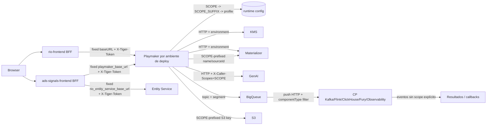

# Scopes RIO - Discovery de Integraciones y Persistencia

%% Naming: Scopes RIO - Discovery de Integraciones y Persistencia es el link canónico del proyecto; aliases guarda variantes humanas; tags/slugs son solo automatización. %%

> [!info]+ Scopes RIO - Discovery de Integraciones y Persistencia
> **Área:** [[Meli]] · **Estado:** active · **Prioridad:** P1 · **Parent:** [[Estandarización de Scopes RIO]] · **Owner:** agent · **Progreso:** 100%
> Este es un proyecto de comprensión: reconstruye cómo el front, Playmaker y las aplicaciones de Signals llaman a otras aplicaciones y cómo el scope entra, se transforma, se persiste y viaja por requests, eventos y configuración. No modifica repositorios.

> [!abstract]- Ownership del proyecto (`owner`) — humano vs agente
> `owner: me` → **proyecto humano**: la iniciativa/esfuerzo que conduces tú.
> `owner: agent` → **proyecto de agente**: un curro delegado, con detalle pesado que escribe y sigue un agente. Casi siempre es subproyecto de uno humano y vive en la subcarpeta `agentes/` de su iniciativa.
> `root: true` solo en **iniciativas raíz** (sin `parent`). Todo subproyecto debe setear `parent`; si no, aparece como huérfano en [[Panel de Proyectos]].
>
> **Tarea puente:** cuando este proyecto es `owner: agent`, en su proyecto **padre** debe existir UNA sola tarea humana que lo representa (arrancar + seguimiento). Así tu cockpit ve una línea por curro delegado, no las tareas internas del agente. Ejemplo, en el padre:
> `- [ ] [[Scopes RIO - Discovery de Integraciones y Persistencia]] arrancar + seguimiento #owner/me #type/supervision #area/meli`

## 🎯 Objetivo

- Documentar de forma reproducible el uso actual de scopes en las aplicaciones de Signals, con foco en `rio-frontend`, `ads-signals-frontend`, `rio-playmaker`, `rio-sdk-events` y los control planes consumidores.
- Para cada integración, identificar origen del scope, autoridad, transformación, transporte, persistencia, consumidor, fallback y evidencia `repo + commit + path relativo + líneas`.
- Separar hechos observados, inferencias y gaps de plataforma para que el proyecto padre pueda proponer un refactor sin redescubrir el sistema.
- Entregar en esta nota la matriz de integraciones y el mapa de flujo end-to-end; las notas del proyecto padre quedan como resumen ejecutivo y decisiones de estándar.

## 📊 Estado actual

- Proyecto agente creado el 2026-08-25 bajo [[Estandarización de Scopes RIO]]; la tarea puente del padre queda en WIP hasta completar la validación final.
- El as-is verificado no implementa selección independiente `frontend`/`backend` en los dos frontends auditados; ambos resuelven Playmaker por `baseURL` de despliegue y envían contexto de request más `X-Tiger-Token`.
- Playmaker usa `SCOPE` como configuración de proceso, deriva `SCOPE_SUFFIX` para perfiles y además usa el scope runtime para identidades de Materializer, keys S3 y un header explícito hacia GenAI; la mayoría de integraciones HTTP y eventos no lo transportan.
- Los eventos de deployment llevan `environmentId`/`environmentName`, `componentType`, `params` y `context`, pero no un scope; los control planes enrutan por tipo de componente y ambiente, mientras su propio `SCOPE` vuelve a resolverse localmente.
- No se han modificado repositorios externos; toda evidencia de código se conserva como referencia segura `repo + branch/commit + path + líneas`, sin copiar dumps ni secretos al vault.

## 🧱 Entrega de desarrollo

%% Esta sección siempre queda disponible. En proyectos que cambian código, configuración ejecutable, schemas o infraestructura, es obligatoria: una fila por repo/branch, con SPEC funcional y técnica enlazadas antes de implementar. En proyectos no técnicos, reemplazar la tabla por `_No aplica — <motivo>._`. %%

| Aplicación / repo | Branch | Base | SPEC funcional | SPEC técnica | Estado |
|---|---|---|---|---|---|
| No aplica | — | — | — | — | Discovery read-only; cualquier implementación será un proyecto separado |

## 🧩 Subproyectos

```base
filters:
  and:
    - 'type == "project"'
    - 'file.hasLink(this.file)'
views:
  - type: cards
    name: Subproyectos
    order:
      - file.name
      - note.status
      - note.priority
```

## ✅ Tareas

> [!note]+ Ownership y tarea puente
> `#owner/me` = tuya · `#owner/agent` = de un agente · sin owner = clasifícala.
> El board es **adaptativo según `owner` del frontmatter**:
> - **Proyecto humano** (`owner: me`): muestra tus tareas y las **tareas puente** (`#type/supervision`) que representan proyectos de agente. Las tareas de agente **no** aparecen acá; viven en su propio proyecto.
> - **Proyecto de agente** (`owner: agent`): muestra las tareas del agente.

> [!example]- Fuente de tareas — editar / mover de estado aquí
> %% Estados: [ ] To Do · [/] WIP · [r] Review · [x] Done · [-] Canceled. Owners: #owner/me, #owner/agent. Tipos: #type/dev #type/admin #type/research #type/pr-review #type/supervision. Flags: #blocked #waiting #urgent. Ver [[convenciones]]. %%
> - [x] **[Plan]** Congelar universo, preguntas, criterio de evidencia y entregables del discovery #owner/agent #type/research #area/meli
> - [x] **[Cortes]** Registrar branch, commit y estado local de cada repositorio incluido #owner/agent #type/research #area/meli
> - [x] **[Front]** Auditar cómo los frontends resuelven, persisten y envían el scope a otras aplicaciones #owner/agent #type/research #area/meli
> - [x] **[Playmaker]** Auditar ingreso, resolución, persistencia, publicación y callbacks hacia control planes #owner/agent #type/research #area/meli
> - [x] **[Contratos]** Auditar `rio-sdk-events`, payloads, headers, tags, topics, filtros y configuración #owner/agent #type/research #area/meli
> - [x] **[Aplicaciones]** Documentar cada integración de Signals con su dirección, transporte, scope y consumidor #owner/agent #type/research #area/meli
> - [x] **[Persistencia]** Reconstruir qué queda en DB/config/eventos y qué sólo vive en memoria o runtime #owner/agent #type/research #area/meli
> - [x] **[Refactor]** Proponer seams, invariantes y orden de migración sin implementar cambios #owner/agent #type/research #area/meli
> - [x] **[Handoff]** Validar evidencia, actualizar bitácora, dejar gaps y mover la tarea puente a Review #owner/agent #type/research #area/meli ✅ 2026-08-25

```dataviewjs
const meta={" ":["To Do","var(--text-muted)","var(--background-modifier-border)"],"/":["WIP","#ba7517","rgba(234,124,12,.18)"],"r":["Review","#185fa5","rgba(55,138,221,.18)"],"x":["Done","#3b6d11","rgba(99,153,34,.18)"],"X":["Done","#3b6d11","rgba(99,153,34,.18)"],"-":["Canceled","var(--text-faint)","var(--background-modifier-border)"]};
function linkify(s){return String(s).replace(/\[\[([^\]|]+)(?:\|([^\]]+))?\]\]/g,(m,a,b)=>`<a class="internal-link" href="${a}" data-href="${a}">${b||a}</a>`).replace(/#[\w/-]+/g,m=>`<span style="opacity:.55;font-size:12px">${m}</span>`).replace(/📅\s*(\d{4}-\d{2}-\d{2})/g,(m,d)=>`<span style="opacity:.7;font-size:12px">📅 ${d}</span>`).replace(/[⏫🔼🔽⏬🔺]/g,"").replace(/✅\s*(\d{4}-\d{2}-\d{2})/g,"");}
function has(t,tag){return new RegExp(`(^|\\s)#${tag}(\\s|$)`).test(String(t.text));}
function render(tasks){const el=dv.el('div','');el.innerHTML=tasks.map(t=>{const[label,fg,bg]=meta[t.status]||["?","var(--text-muted)","var(--background-modifier-border)"];return `<div style="display:flex;align-items:center;gap:8px;margin:5px 0;"><span style="font-size:11px;font-weight:600;padding:1px 9px;border-radius:999px;background:${bg};color:${fg};min-width:56px;text-align:center;flex:none;">${label}</span><span>${linkify(t.text)}</span></div>`;}).join("");}
function board(tasks){const cols=[[" ","🟦 To Do"],["/","🟡 WIP"],["r","🔵 Review"]];let any=false;for(const[st,label]of cols){const c=tasks.filter(t=>t.status===st);if(c.length){any=true;dv.el('h4',label);render(c);}}const done=tasks.filter(t=>t.status==="x"||t.status==="X");if(done.length){any=true;dv.el('h4',"✅ Done");render(done);}if(!any)dv.paragraph("_Sin tareas._");}
const owner=((dv.current().owner)==="agent")?"agent":"me";
const all=dv.current().file.tasks.array();
const primary=all.filter(t=>has(t,`owner/${owner}`));
const loose=all.filter(t=>!has(t,"owner/me")&&!has(t,"owner/agent"));
dv.header(3, owner==="agent"?"🤖 Tareas del agente":"🧍 Mis tareas");
board(primary);
if(loose.length){dv.header(3,"🧺 Sin owner (clasificar)");render(loose);}
```

%% Rollup de iniciativa — descomentar solo en proyectos padre para ver las tareas #owner/me (incluye puentes) de todos los subproyectos, agrupadas por nota. Cambiar la ruta por la carpeta de esta iniciativa. Nunca muestra tareas de agente.
```dataviewjs
const meta={" ":["To Do","var(--text-muted)","var(--background-modifier-border)"],"/":["WIP","#ba7517","rgba(234,124,12,.18)"],"r":["Review","#185fa5","rgba(55,138,221,.18)"],"x":["Done","#3b6d11","rgba(99,153,34,.18)"],"X":["Done","#3b6d11","rgba(99,153,34,.18)"],"-":["Canceled","var(--text-faint)","var(--background-modifier-border)"]};
const ord={" ":0,"/":1,"r":2,"x":3,"X":3,"-":4};
function linkify(s){return String(s).replace(/\[\[([^\]|]+)(?:\|([^\]]+))?\]\]/g,(m,a,b)=>`<a class="internal-link" href="${a}" data-href="${a}">${b||a}</a>`).replace(/#[\w/-]+/g,m=>`<span style="opacity:.55;font-size:12px">${m}</span>`).replace(/📅\s*(\d{4}-\d{2}-\d{2})/g,(m,d)=>`<span style="opacity:.7;font-size:12px">📅 ${d}</span>`).replace(/[⏫🔼🔽⏬🔺]/g,"").replace(/✅\s*(\d{4}-\d{2}-\d{2})/g,"");}
function has(t,tag){return new RegExp(`(^|\\s)#${tag}(\\s|$)`).test(String(t.text));}
function render(tasks){const el=dv.el('div','');el.innerHTML=tasks.map(t=>{const[label,fg,bg]=meta[t.status]||["?","var(--text-muted)","var(--background-modifier-border)"];return `<div style="display:flex;align-items:center;gap:8px;margin:5px 0;"><span style="font-size:11px;font-weight:600;padding:1px 9px;border-radius:999px;background:${bg};color:${fg};min-width:56px;text-align:center;flex:none;">${label}</span><span>${linkify(t.text)}</span></div>`;}).join("");}
const pages=dv.pages('"10-projects/CARPETA-DE-LA-INICIATIVA"');
for(const p of pages.sort(x=>x.file.name)){const t=p.file.tasks.array().filter(x=>has(x,"owner/me")&&x.status!=="x"&&x.status!=="X").sort((a,b)=>(ord[a.status]??9)-(ord[b.status]??9));if(t.length){dv.el('h4',p.file.link);render(t);}}
```
%%

## 📆 Bitácora

%% Log diario para las dailies. Una línea por día con lo avanzado / blockers. %%
- **2026-08-25** — Proyecto agente creado, plan durable congelado y tarea puente abierta en el padre.
- **2026-08-25** — Se auditaron cortes HEAD de los dos frontends, Playmaker, SDK, siete control planes, Materializer y catálogo; la evidencia confirma que el scope actual es principalmente runtime/configuración y sólo cruza algunos límites explícitos.
- **2026-08-25** — Se cerró la matriz as-is: front → Playmaker por baseURL fija, Playmaker → APIs por contexto/Tiger, Playmaker → BigQueue por topic/segmento, y CPs → infraestructura usando ambiente/tipo de componente; el envelope no lleva scope.
- **2026-08-25** — Se derivaron seams para un `ScopeContext` canónico, carrier HTTP/evento, persistencia explícita y migración compatible; queda pendiente la validación formal y el handoff a Review.
- **2026-08-25** — Validación completada: lint estricto sin errores en proyecto, padre y change log; Graphify reindexado con extracción directa porque el wrapper quedó bloqueado por deuda de frontmatter preexistente en skills/known-error; tarea puente movida a Review.

## 🧭 Decisiones

- El discovery es read-only y vive separado de cualquier proyecto de cambio; cualquier refactor posterior deberá consumir esta nota como evidencia y abrir su propio proyecto.
- La nota de este proyecto es el planificador único: tareas, estado, bitácora, matriz de integraciones y propuesta de seams se actualizan aquí.
- Una integración sólo se considera verificada con `repo + commit + path + líneas`; la documentación del padre se trata como contexto, no como autoridad de código.

## 🧭 Plan de discovery

1. Congelar el universo de aplicaciones y el corte de cada repositorio sin modificar worktrees.
2. Auditar los puntos de entrada del front: query params, cookie/estado, config de deploy, cliente HTTP, headers y persistencia de navegación.
3. Auditar Playmaker: headers y params de ingreso, `SCOPE`/profiles, resolución de scope, DB/config, payloads, topics, tags, filtros y callbacks HTTP.
4. Auditar SDK y control planes: contratos wire, deserialización, filtros, defaults, side effects y llamadas a infraestructura.
5. Construir el mapa de cada integración con dirección, protocolo, autoridad del scope, transformación, almacenamiento, fallback y consumidor.
6. Clasificar `VERIFIED`, `INFERRED` y `GAP`; no convertir el diseño objetivo en comportamiento actual.
7. Derivar seams de refactor, invariantes y orden de migración; dejar implementación fuera de este proyecto.
8. Validar la nota, reindexar Graphify y preparar el handoff en Review.

## 🔬 Criterio de evidencia

- `VERIFIED`: observado en código o configuración del commit declarado, con path relativo y líneas.
- `INFERRED`: conclusión derivada de varios hechos verificados; se enlazan todas las evidencias y se marca la inferencia.
- `GAP`: no confirmable desde el workspace/repos auditados; se registra la fuente que falta y la pregunta concreta para Signals/Fury.
- No copiar clones, secretos, credenciales, dumps ni archivos pesados al vault; persistir sólo referencias y extractos mínimos necesarios para la decisión.

## 🗺️ Universo y cortes

| Aplicación / repo | Rol a auditar | Branch | Commit | Estado | Evidencia |
|---|---|---|---|---|---|
| `rio-frontend` | Front legacy; BFF hacia Playmaker y APIs legacy | `develop` | `6d644ec6a417` | HEAD auditado; 1 artefacto no trackeado ignorado | `api/lib/playmaker.ts:15-80`; `config/default.js:30-70` |
| `ads-signals-frontend` | Front moderno; BFF hacia Playmaker y Entity Service | `develop` | `32c7fa56fc35` | HEAD auditado; 1 artefacto no trackeado ignorado | `api/lib/playmaker.ts:12-147`; `api/lib/rioEntityService.ts:20-32,188-251` |
| `rio-playmaker` | API, resolución runtime, persistencia y publicación/callbacks | `feature/new-component-context` | `39f616c46ace` | HEAD auditado; worktree modificado, cambios locales excluidos | `util/ScopeUtils.java:10-94`; `application.yml:1-7,41-60,105-123` |
| `rio-sdk-events` | Contratos de eventos, filtros y envelope | `feature/new-component-context` | `72b5a570b464` | HEAD auditado; artefacto generado ignorado | `messages/DeploymentTriggerMessage.java:18-87`; `client/BigQueueClient.java:34-43` |
| `rio-controlplane-kafka` | Consumer de deployment y resolución de cluster | `develop` | `427d090d97e5` | HEAD auditado | `controller/DeploymentTriggerController.java:28-38,78-101` |
| `rio-controlplane-flink` | Consumer de deployment y filtrado por componente | `develop` | `7af7e3f81603` | HEAD auditado | `controller/DeploymentTriggerController.java:26-36,74-117` |
| `rio-controlplane-clickhouse` | Consumer, normalización de profile y métricas | `develop` | `a2ca40e477f1` | HEAD auditado | `ProfileNormalizerEnvironmentPostProcessor.java:16-55`; `shared/util/ScopeUtils.java:48-66,103-125` |
| `rio-controlplane-fury` | Pusher BigQueue y activación de roles por scope | `develop` | `7eb7932e9f3f` | HEAD auditado | `pusher/bigqueue/DeploymentTriggerController.kt:23-34,99-135`; `ScopeProfileActivationEnvironmentPostProcessor.kt:10-66` |
| `rio-controlplane-kms` | Runtime scope y API de cifrado | `develop` | `b7b522564d0c` | HEAD auditado | `util/ScopeUtils.java:8-25`; `controller/EncryptController.java:47-78,99-103` |
| `rio-controlplane-observability` | Consumer de deployment y filtros de logs | `develop` | `43ca94b7495d` | HEAD auditado | `DeploymentTriggerConsumerController.java:15-56` |
| `rio-controlplane-signals` | Scaffold y runtime scope; sin consumer observado | `develop` | `cd127524b241` | HEAD auditado | `ScopeUtils.java:10-27` |
| `rio-materializer` | Runtime scope, materialización y callback a Playmaker | `develop` | `56ebada25040` | HEAD auditado | `utils/ScopeUtils.java:8-26`; `PlaymakerNotificationClientImpl.java:24-71` |
| `ads-signals-catalog` | Catálogo y referencias de componentes | `develop` | `67f11cc83c18` | HEAD auditado | Revisión estructural; sin carrier de scope observado |
| Plataforma Fury / MeliLab / nginx | Routing y persistencia fuera del código local | N/A | N/A | GAP | Falta evidencia de manifests, proxy, storage y contratos de plataforma |

## 🔗 Matriz de integraciones

Esta tabla es el registro canónico del discovery; `VERIFIED` significa observado en el corte declarado, `INFERRED` una conclusión derivada y `GAP` algo que requiere evidencia de plataforma.

| ID | Origen → destino | Operación / endpoint / evento | Transporte | Scope: origen → transformación → destino | Persistencia | Evidencia | Estado |
|---|---|---|---|---|---|---|---|
| INT-001 | `rio-frontend` → `rio-playmaker` | BFF `GET/POST/PUT/PATCH/DELETE/QUERY/COMMAND` | HTTP; baseURL de config | No entra scope RIO; `buildContext(req)` + `X-Tiger-Token`; ambiente implícito en host de deploy | Sólo runtime/config; no persistencia de scope observada | `rio-frontend/api/lib/playmaker.ts:15-80`; `config/default.js:30-42` | VERIFIED |
| INT-002 | `ads-signals-frontend` → `rio-playmaker` | Mismos métodos de cliente Playmaker | HTTP; baseURL de config | No entra scope RIO; `buildContext(req)` + `X-Tiger-Token`; selección por `playmaker_base_url` | Sólo runtime/config; no persistencia de scope observada | `ads-signals-frontend/api/lib/playmaker.ts:12-105`; `config/default.js:36-57` | VERIFIED |
| INT-003 | `ads-signals-frontend` → `rio-entity-service` | GET de entidades/revisiones | HTTP; cliente local/remoto | No carrier RIO; `buildContext(req)` + `X-Tiger-Token` | No scope observado; identidad/ambiente va en params del recurso | `api/lib/rioEntityService.ts:20-32,188-251` | VERIFIED |
| INT-004 | Playmaker → KMS | `/kms/api/v1/secrets/encrypt` | HTTP | `SCOPE` sólo configura Playmaker; request lleva `environment` y metadata, no scope | KMS resuelve su propio `SCOPE`/profile; no recibe scope de Playmaker | `rio-playmaker/restclient/impl/ControlPlaneClientImpl.java:30-64`; `rio-controlplane-kms/controller/EncryptController.java:47-78` | VERIFIED |
| INT-005 | Playmaker → Flink CP | `/flink/sql-code` y `/flink/sql-code/{id}` | HTTP | Contexto/Tiger; ambiente y archivo en path/body; sin scope explícito | SQL se persiste con scope runtime en key S3 antes/después del llamado | `FlinkControlPlaneClientImpl.java:24-37,53-134`; `SqlCodeStorageServiceImpl.java:79-99,152-160` | VERIFIED |
| INT-006 | Playmaker → Kafka CP | `/kafka/topic/{name}/peek` | HTTP | Contexto/Tiger; topic y `num_msgs`; sin scope explícito | Kafka CP usa su runtime scope y `environmentId` para resolver cluster | `KafkaControlPlaneClientImpl.java:26-87`; `rio-controlplane-kafka/controller/DeploymentTriggerController.java:122-136` | VERIFIED |
| INT-007 | Playmaker → Materializer | Provision/delete/template y callbacks | HTTP | Contexto/Tiger; ambiente en request; sin header RIO | Materializer recibe nombres/source IDs ya prefijados con runtime `SCOPE` | `MaterializerClientImpl.java:37-114`; `MaterializerMapper.java:65-120` | VERIFIED |
| INT-008 | Playmaker → GenAI | Generación de código/metadata | HTTP | Excepción: `X-Caller-Scopes: ScopeUtils.getScopeValue()` | Scope viaja sólo como header de esa integración; no es envelope RIO | `GenAILLMClientImpl.java:55-58,91-105,133-139` | VERIFIED |
| INT-009 | Playmaker → BigQueue | Deployment trigger | BigQueue topic + segmento configurado | `bigqueue.deployment-trigger-topic` y `bigqueue.segment` son runtime/config; mensaje no lleva scope | Persistencia operacional de dispatch/deployment; mensaje lleva ambiente, params y context, no scope | `BigQueueDeploymentTriggerProducerImpl.java:28-57`; `BigQueueDispatchAdapter.java:56-103` | VERIFIED |
| INT-010 | BigQueue → Kafka/Flink/ClickHouse/Fury/Observability | `/triggers/deployments` | Push HTTP; filtros por consumer | CP filtra por `componentType`; el scope del CP viene de su propio runtime, no del evento | El evento no persiste scope; cada CP aplica profile/segment local | `rio-sdk-events/messages/DeploymentTriggerMessage.java:50-87`; CP controllers citados en universo | VERIFIED |
| INT-011 | CPs → infraestructura | Procesamiento de deployment, métricas y roles | HTTP/SDK/DB según CP | `environmentId/name` y `componentType` gobiernan negocio; `SCOPE` gobierna profile/rol/segmento local | ClickHouse deriva ambiente KMS desde scope; Fury deriva rol desde scope; no carrier común | `rio-controlplane-clickhouse/shared/util/ScopeUtils.java:103-125`; `rio-controlplane-fury/ScopeProfileActivationEnvironmentPostProcessor.kt:20-66` | VERIFIED |
| INT-012 | Playmaker → S3 | Storage de SQL generado | Key de objeto | `ScopeUtils.getScopeValue()` se inserta en el prefijo de la key | Scope queda persistido en path S3 `<scope>/dp-.../component-.../definition-...` | `SqlCodeStorageServiceImpl.java:79-99,152-160` | VERIFIED |
| INT-013 | Playmaker → Signals API | `/signals/context` con `scope` | HTTP request/response | Controller acepta y devuelve `scope`, pero el repository consulta sólo `app, environment` | Scope es transitorio en request/response; HEAD no lo usa para seleccionar DB | `SignalsController.java:82-99`; `SignalsServiceImpl.java:42-52,111-120` | VERIFIED |
| INT-014 | Playmaker → Playmaker callback desde Materializer | Notification route configurada | HTTP | Routing context + payload de notificación; no scope header | Materializer usa su runtime profile; callback no añade scope explícito | `rio-materializer/clients/impl/PlaymakerNotificationClientImpl.java:24-71` | VERIFIED |
| INT-015 | Front/Playmaker → `frontend`/`backend` + MeliLab | Selección independiente propuesta por el padre | N/A en cortes auditados | No implementado en los dos frontends ni en Playmaker HEAD; requiere plataforma y contrato nuevo | No hay persistencia/lectura verificable de esa selección | Grep focalizado en `api/**`, `app/**`, `config/**`; GAP de nginx/MeliLab | GAP |

## 🧱 Seams para el futuro refactor

Cada seam parte del contrato actual observado y queda como propuesta; no se implementa en este proyecto.

| Seam | Contrato actual | Autoridad propuesta | Compatibilidad / riesgo | Rollout y rollback |
|---|---|---|---|---|
| S1. `ScopeContext` canónico | Cada app replica `ScopeUtils`; algunas derivan sólo el último token, Fury deriva además roles y ClickHouse normaliza segmentos | Resolver una estructura tipada con `deployment_scope`, `logical_environment`, `segment`, `frontend_scope` y `backend_scope`, con provenance | Evita colisiones semánticas; riesgo alto si se reemplaza `SCOPE` sin dual-read | Introducir parser común en SDK, emitir métricas de divergencia y conservar `SCOPE` como fallback hasta convergencia |
| S2. Entrada en front | Fronts eligen host Playmaker por config de despliegue y no persisten scope RIO | Resolver el scope en el borde autorizado y persistir sólo la selección lógica necesaria, con contrato de lectura/escritura | Requiere nginx/MeliLab y puede afectar URLs cacheadas; no inferir desde cookie de auth | Dual-write del selector nuevo y host actual; rollback por feature flag al baseURL conocido |
| S3. Carrier HTTP | Requests llevan `buildContext(req)` y Tiger; casi ningún cliente lleva scope | Añadir un header canónico de scope lógico firmado/validado por el borde, separado de auth y de `SCOPE` runtime | No confiar en headers enviados por browser; riesgo de spoofing y propagación accidental | Proxy fija/limpia el header, Playmaker acepta dual-read y audita mismatch; rollback ignora header nuevo |
| S4. Carrier de eventos | `DeploymentTriggerMessage` lleva ambiente, componente, params y context, pero no scope | Agregar envelope versionado con `scope_context` o al menos `logical_scope` y provenance; no copiar `SCOPE` crudo como contrato de negocio | Cambia SDK, productores y consumidores; riesgo de replay y compatibilidad de schemas | Campo opcional + default derivado del ambiente; consumers dual-read, luego campo obligatorio por versión |
| S5. Routing BigQueue | Topic y `segment` son configuración del productor; CPs filtran por `componentType` | Definir una sola regla de routing: broker/filter tag para `logical_scope`, con allowlist en consumer | Requiere validar si BigQueue filtra server-side y cómo se configura el proxy; riesgo de pérdida silenciosa | Shadow filters y métricas de entregas; rollback conserva topic actual y filtro por componente |
| S6. Identidad/persistencia | Materializer y S3 prefijan IDs/keys con `SCOPE` runtime; DB/requests usan ambiente por separado | Persistir `logical_scope` como campo explícito y usar `deployment_scope` sólo para aislamiento técnico | Migración de nombres y paths puede romper referencias; alto riesgo de orphan data | Resolver alias viejo→nuevo, backfill controlado, lectura dual y rollback por alias |
| S7. Resultados y callbacks | Result messages no llevan scope; callback usa contexto/Tiger | Propagar el mismo `scope_context` en resultados y callbacks, con correlation ID | Permite trazabilidad end-to-end; aumenta tamaño de payload y superficie de datos | Campo opcional, validación de origen y dashboards de missing scope |
| S8. Observabilidad y seguridad | Fury mantiene logs temporales de raw payload/params en el consumer; scopes pueden confundirse con auth | Redactar payloads, etiquetar cada dimensión de scope y prohibir secretos/headers en logs | Riesgo actual de exposición y diagnóstico ambiguo | Primero remover logging sensible y agregar tests de redacción; rollback no reintroduce raw payload |

### Invariantes propuestas

- `deployment_scope` no es equivalente a `logical_scope`, `environment`, `segment`, `auth_scope` ni al `Scope` de tracing.
- El browser no es autoridad final para un scope de routing; el borde y Playmaker deben validar, normalizar y registrar provenance.
- Un mensaje de deployment debe poder ser procesado de forma determinista con su envelope, sin depender de que producer y consumer compartan el mismo `SCOPE` de proceso.
- Las persistencias que necesiten aislamiento deben guardar la dimensión explícita que consultan; un prefijo derivado no reemplaza un campo auditable.
- Todo fallback de compatibilidad debe ser observable y tener fecha/criterio de retiro.

## 🧭 Semántica de scope observada

| Dimensión | Qué significa hoy | Dónde nace | Cómo viaja / persiste | Riesgo de confusión |
|---|---|---|---|---|
| Runtime `SCOPE` | Identidad/configuración de la instalación o fleet | Env/JVM de cada aplicación | Perfil Spring, role, topic/segment y algunas keys/IDs | Se usa como si fuera scope de negocio, pero cambia por proceso |
| `SCOPE_SUFFIX` | Perfil derivado desde tokens de `SCOPE` | `ScopeUtils` y post-processors | Activación de configuración | El último token pierde información de rol/segmento |
| Ambiente lógico | Contexto de data product/deployment | Request, `environmentId/name` y DB | Payloads, paths y resolución de infraestructura | Puede confundirse con scope RIO |
| Segmento BigQueue | Segmentación técnica del transporte | Config `bigqueue.segment` / `withSegmentID` | Producer/consumer de BigQueue | No es carrier de scope de negocio |
| Auth scope | Permisos de Kraken/Platsec y Tiger | Config de auth/cookie/header | Auth middleware y `X-Tiger-Token` | No debe reutilizarse para routing RIO |
| Request `scope` de Signals | Parámetro de `/signals/context` | Controller request | Se loguea y se devuelve; no filtra DB en HEAD | Parece persistido, pero es transitorio |
| Trace `Scope` | Contexto de OpenTelemetry | Runtime de tracing | Span/context propagation | Nombre idéntico, semántica ajena a RIO |

## 🔄 Flujo AS-IS



## 📦 Persistencia y transporte

- En los frontends, el scope RIO no se persiste ni se transporta como header en los cortes auditados; la separación de ambientes ocurre por `baseURL` de configuración de deploy.
- En Playmaker, `SCOPE` vive en el runtime y se convierte en `SCOPE_SUFFIX`; los topics y el segmento de BigQueue son configuración de arranque, no atributos del mensaje.
- En Materializer, el scope runtime se materializa indirectamente en nombres y source IDs generados por `MaterializerMapper`; es un acoplamiento de identidad, no un campo de dominio.
- En S3, `SqlCodeStorageServiceImpl` persiste el scope runtime como primer segmento de la key; esto debe migrarse con alias si cambia la autoridad.
- En el envelope de deployment de `rio-sdk-events`, el scope no existe; sí existen `environmentId`, `environmentName`, `componentType`, `params`, `context`, schema y timestamp.
- En los control planes, el scope no viene del evento: cada proceso activa sus perfiles/roles desde su propio `SCOPE`, mientras el ambiente lógico llega por el deployment message.
- En `/signals/context`, el `scope` de request se devuelve en la respuesta, pero la selección de señales en HEAD sólo usa `app` y `environment`; no hay persistencia de esa dimensión en el query observado.
- En la integración GenAI, `X-Caller-Scopes` es la excepción de propagación HTTP explícita; debe documentarse como contrato específico y no confundirse con el carrier RIO propuesto.

## ⚠️ Gaps y preguntas de plataforma

- Confirmar en nginx/MeliLab cuál es la autoridad actual o futura para seleccionar `frontend` y `backend`, dónde se persiste, cómo se lee en cada request y qué TTL/rollback tiene.
- Obtener manifests de deploy y configuración efectiva para validar el mapeo entre hostname, `SCOPE`, `SCOPE_SUFFIX`, topic y segmento; los repos sólo muestran defaults y perfiles.
- Confirmar si BigQueue aplica filtros server-side por tags, si los filtros llegan al push HTTP y si existe un contrato estable para `scope:<value>`; el SDK observado sólo modela `modified_fields` y filtros opcionales.
- Confirmar el contrato del proxy que entrega triggers a Fury: el código declara que no recibe Tiger desde el proxy; falta definir cómo autenticación y scope llegarían sin confiar en headers del cliente.
- Confirmar si la base de datos de Signals tiene una dimensión scope que no aparece en el repository/query auditado o si el parámetro `scope` es sólo compatibilidad de API.
- Confirmar el catálogo de scopes vigente y la nomenclatura autorizada para separar `deployment_scope`, `logical_scope`, `environment` y `segment`.
- Revisar y retirar el logging temporal de payload crudo y `params` en `rio-controlplane-fury/pusher/bigqueue/DeploymentTriggerController.kt:104-127` antes de propagar nuevos carriers.

## 🔎 Resumen ejecutivo para el proyecto padre

- El sistema actual no tiene un carrier transversal de scope: tiene scopes locales de proceso y algunos usos puntuales en identidad, storage y GenAI.
- Front y Playmaker no intercambian un scope RIO explícito; el ambiente se selecciona principalmente por host/config de despliegue y los requests preservan contexto de routing/Tiger.
- BigQueue distribuye deployment triggers sin scope; los consumers seleccionan por `componentType` y resuelven su propio runtime scope, por lo que no existe garantía de aislamiento end-to-end basada sólo en el mensaje.
- El refactor debería comenzar por nombrar dimensiones distintas y crear un `ScopeContext` versionado con provenance, antes de cambiar nombres de S3/Materializer o filtros de BigQueue.
- La primera migración segura es observabilidad + dual-read/dual-write: medir mismatches entre `SCOPE`, ambiente y selector lógico, luego introducir carriers opcionales y sólo después endurecer routing/persistencia.

## 🔗 Docs / Links

- [[Estandarización de Scopes RIO]]
- [[scope-inventory]]
- [[scope-compatibility-matrix]]
- [[scope-naming-standard]]
- [[RIO]]
- [[integration-map]]
- [[deploy-request-path]]

## 💡 Ideas

%% Captura ideas sueltas del proyecto al final. Si maduran, promover a tarea o a nota de idea (70-templates/idea.md). %%

### Backlog de ideas

- Crear un contrato `ScopeContext` en `rio-sdk-events` con versión, provenance, ambiente lógico y scope de despliegue separados.
- Generar un diagrama automático de propagación a partir de headers, payloads, topics, keys y perfiles de cada repo.

### Motivos / principios

- 

### Memoria pública / interna

%% Opcional para proyectos de agentes o conocimiento: definir qué memoria gobierna el sistema y cuál gobierna el agente, y por qué existe cada una. %%
- **Memoria pública:** Esta nota y el resumen en [[Estandarización de Scopes RIO]] gobiernan el discovery y sus decisiones de refactor.
- **Memoria interna:** Commits y paths auditados en `/Users/rjara/fuentes`; no se copian clones, secretos ni dumps al vault.
- **Motivo:** Mantener trazabilidad reproducible sin convertir evidencia local pesada o sensible en conocimiento persistente.
