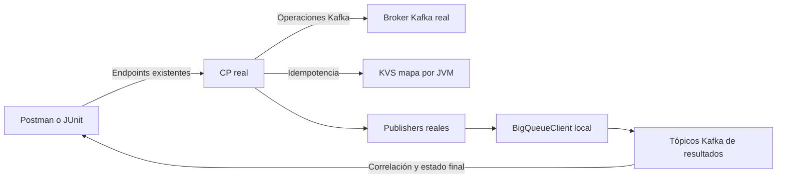

# Descripción PR — rio-controlplane-kafka

Repo `melisource/fury_rio-controlplane-kafka` · rama `feature/kafka-local-small@aa198836c9a8c21b66e9ef5ac56afb965dc795ea` · base `develop@931893e00d26363c13bee35ca19ed0980b959b51` · 1 commit · 16 archivos (10 A/6 M), +1946/-66 · sin ticket/spec externos asociados · sin dependencia de otro repo · 2026-10-08: check697 PASS y funcional25×2 PASS; reproducción independiente25 PASS.

## Propósito

Conservar la descripción técnica de esta entrega en el proyecto del vault, separada del código del repositorio.

## Contenido

Cuerpo del PR listo para GitHub, sustentado por el diff y las verificaciones del commit aa19883. No existe template de PR en el repo; se utilizan secciones mínimas de cambio, operación, verificación y límites.

---

## Qué cambia y por qué

Permite arrancar el CP real y Kafka local con Docker Compose y enviar solicitudes desde Postman, sin Fury Sandbox. El stack crea un broker Kafka 3.9.1 con imagen fijada, inicializa los dos tópicos de resultados y arranca el CP en Java 21 después de readiness.

El perfil `compose` conecta un KVS efímero por proceso y transporta por Kafka los resultados que construyen los publishers reales. Controllers, DTOs, validaciones, processors, provisioners, idempotencia y defaults productivos conservan su lógica. En `src/main` sólo se añaden dos `@Profile("!compose")` para seleccionar los adapters; `bootJar` excluye código y recursos locales.



Los source sets locales mantienen separado el artefacto productivo. `check` compila los adapters y escenarios y ejecuta los contratos del mapa sin requerir Docker. La suite funcional usa endpoints reales, verifica estado y payload correlacionados, particiones, replicación, configuración, eliminación y mensajes con keys. IDs y tópicos únicos permiten repetirla contra el mismo ambiente; el teardown espera la eliminación física de sus fixtures.

## Cómo se opera

Con Java 21 y Docker Compose, desde la raíz del repo:

```sh
./gradlew localBootJar && docker compose up -d --build --wait
./gradlew localFunctionalTest
docker compose down --volumes
```

HTTP: `http://127.0.0.1:39081`; Kafka host: `127.0.0.1:39092`. Puertos parametrizables, aliases `rio-kafka`/`rio-cp-kafka` y red `rio-local` con dueño explícito. El Dockerfile copia el jar, por lo que funciona fuera de los mounts de la VM y con espacios en la ruta.

La [guía local](https://github.com/melisource/fury_rio-controlplane-kafka/blob/feature/kafka-local-small/local/README.md) incluye Colima `rio`, requests de Postman y matriz caso→test. Para validación manual: comprobar `GET /ping` (`pong`), enviar el envelope documentado a `POST /triggers/deployments` con RF1 explícito y observar el resultado terminal correlacionado y el tópico físico. HTTP 200 sólo confirma recepción. `up` conserva el estado existente; `down --volumes` elimina exclusivamente los recursos de este proyecto y permite arrancar vacío.

## Cómo se probó

Validado el 2026-10-08 con Java 21 en `colima-rio`:

| Verificación | Resultado |
|---|---|
| `./gradlew --offline check bootJar` | 691 pruebas existentes + 6 KVS, 0 fallos/errors/skips; jar productivo con 0 componentes locales. |
| `./gradlew --offline localFunctionalTest`, dos veces sin `down` ni restart | 25/25 cada vez; 55.751 s y 55.766 s de pared, con compilación previa. Mismo CP y broker; fixtures eliminados. |
| Reproducción independiente desde clon Git limpio fuera de HOME y con espacios | Startup 16.468 s; 25/25 en 56.884 s con precompilación separada; check 691+6 PASS; clon limpio. |
| Cleanup | Contenedores, red y volúmenes propios eliminados; VM y recursos compartidos conservados. |

## Límites e issue/spec

PEEK por action `gcp-kafka-topic` conserva el comportamiento productivo actual: `FAILED/INVALID_PARAMS`, `reason=unmapped`, sin `STARTED`. La suite reproduce ese gap; no registra providers GCP de actions exclusivos de local. Los deployments GCP sí recorren sus componentes productivos con configuración y transporte AdminClient locales.

Un broker PLAINTEXT con RF1 explícito no certifica OAuth/BigQueue administrados, coordinación KVS entre JVMs, `KAFKA_AUTH_FAILED` ni `REPLICATION_FACTOR_CONFLICT` que requiere un estado multi-broker. La matriz documenta estas exclusiones. El transporte de resultados es Kafka; Playmaker y el bridge HTTP quedan fuera del PR. Requisitos y contratos de esta extracción en README/matriz; sin ticket externo asociado.

---

## Notas internas — NO van al PR

El owner autorizó push y PR nuevo en este turno; la skill produce el texto y la publicación se realiza por esa instrucción explícita. No se abre ticket del gap GCP ni se modifica negocio. El patch lz4/Jackson es parte de la base develop, no del diff. `GenerateDocTest` puede regenerar `docs/specs/swagger.yaml`; no incorporar ese delta preexistente. Evidencia local fuera del diff: `/private/tmp/kafka-local-extraction-20261007/compose-revision/final-review-20261008/`. La suite compilada tarda <60 s; tiempos de compilación separados explícitamente. PR creado: https://github.com/melisource/fury_rio-controlplane-kafka/pull/85. Checks remotos finales: 8 PASS, 2 SKIPPED, 0 pendientes; CI Fury549, CodeQL, code-coverage, static-analyzer, dependencies y workflow aprobados. Reviewer automático y upload emptySARIF omitidos por sus workflows. PR no draft y MERGEABLE, pero REVIEW_REQUIRED; no merge ni cambios de código.

## Fuentes

- Diff Git `develop...aa19883`, README local, Compose, build.gradle y source sets del CP.
- Reportes JUnit y reproducción independiente del commit final del 2026-10-08.
