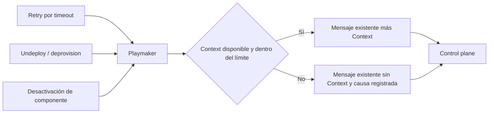

# Spec Funcional: Context transversal en RIO — retry, deprovision y desactivación

**Estado:** borrador · **Fecha:** 2026-09-30 · **Dueño:** rjara (Signals) · **Aplicación:** rio-playmaker

**Spellbook:** [SIG-645 — Context transversal en RIO](https://spellbook.adminml.com/projects/SIG/specs/SIG-645) · **ID:** `b3b0fb05-d64f-4119-b98e-6aac9b36ca3c`

## Propósito

Estandarizar Context como capacidad transversal de RIO para aportar información adicional a los flujos que la necesitan. Esta entrega incorpora su publicación en retry por timeout, undeploy/deprovision y desactivación de componente.

## Contenido

El contrato funcional fija disponibilidad, coherencia de la información y degradación común para los tres flujos incluidos.

## Problema

Los control planes necesitan identidad, versión conocida, relaciones y resultados publicados para interpretar una operación. Playmaker dispone de esa información y la entrega mediante Context en el deployment por batches, pero retry, deprovision y desactivación envían operaciones sin ella.

**Causa raíz:** el uso de Context quedó conectado a un camino de deployment, sin un criterio común para aportar contexto a los otros flujos operativos. Su disponibilidad depende del camino que emite el mensaje, lo que limita la reutilización y genera diferencias de información entre operaciones.

## Objetivo y alcance

Los flujos que necesitan información adicional utilizan Context con un contrato común y una política consistente de disponibilidad y degradación. La operación y sus parámetros mantienen su responsabilidad actual.

| Flujo incluido | Resultado esperado |
|---|---|
| Retry por timeout | Context del componente y la definición que se reintenta. |
| Undeploy/deprovision | Context del componente y su estado desplegado conocido; incluye las variantes genérica, Fury→Kafka y Kafka→Fury. |
| Desactivación de componente | Context del componente que se retira, conservando la identidad y el ciclo de su ejecución. |

## Historias de Usuario

- **US-1** — **Como** responsable de un control plane, **quiero** recibir Context en retry, deprovision y desactivación, **para** interpretar cada operación con información del componente y su entorno.
- **US-2** — **Como** equipo de RIO, **quiero** un criterio común para aportar Context y manejar su ausencia, **para** reutilizar esta capacidad de forma consistente entre flujos.
- **US-3** — **Como** operador, **quiero** reconocer cuándo una operación se envió sin Context y por qué, **para** diagnosticar la degradación sin exponer valores sensibles.

## Requisitos Funcionales

| # | Requisito | Prioridad |
|---|---|---|
| RF-1 | Los tres flujos incluidos incorporan `context` cuando puede construirse y el mensaje cumple el límite de tamaño. Aplica a los tipos de componente ya admitidos por cada flujo. | Debe |
| RF-2 | Context corresponde al componente, data product, definición y ambiente de la operación. Conserva al usuario de origen cuando está disponible; un retry no se atribuye al scheduler. | Debe |
| RF-3 | La información temporal respeta la semántica por flujo indicada abajo. La versión solicitada y la última versión completada tienen significados separados. | Debe |
| RF-4 | Se conserva el contrato vigente de Context. La falta de versión histórica, relaciones o outputs mantiene su degradación parcial: se informa la identidad disponible, sin inventar valores ni omitir todo el Context por esa sola ausencia. | Debe |
| RF-5 | Agregar Context preserva `params`, operación, routing, correlación, elegibilidad, permisos y ciclo de vida del flujo, incluidos los parámetros de deprovision de Fury. | Debe |
| RF-6 | Si falla la construcción de Context, se envía el mensaje sin ese campo y la operación continúa con su comportamiento vigente. Los fallos de publicación mantienen su tratamiento propio. | Debe |
| RF-7 | El límite es 200 KiB sobre el mensaje completo con Context. Si lo supera o no puede medirse, se omite Context completo y se conserva el envío con los otros campos. | Debe |
| RF-8 | Son observables el resultado y duración de construcción, el tamaño medido y la causa de descarte. La evidencia permite correlacionar el envío sin registrar valores crudos de Context o `params`, credenciales ni datos sensibles. | Debe |
| RF-9 | Los consumidores que ignoran Context o admiten su ausencia conservan compatibilidad; esta entrega no exige cambiar los control planes ni reemplazar su lectura de `params`. | Debe |

### Semántica por flujo

| Flujo | Interpretación |
|---|---|
| Retry | `component.version` identifica la definición del intento original aunque exista una configuración posterior. El estado y las relaciones se consultan para el nuevo envío; no se garantiza un snapshot idéntico al primero. `latestVersion`, si existe, es la última versión completada del mismo servicio y ambiente, y no sustituye los parámetros solicitados. |
| Deprovision | La identidad y definición corresponden a la operación de retiro. La última versión completada y sus outputs representan el estado conocido del mismo servicio y ambiente antes del retiro; no se pierden sólo por transicionar el estado de la operación. |
| Desactivación | Context describe el componente y la definición asociados al servicio del ambiente objetivo, con información desplegada disponible antes del retiro. Puede tener relaciones vacías. La correlación y el resultado pertenecen a la ejecución de desactivación. |

## Criterios de Aceptación

- **CA-1** — **Dado** un envío válido con Context resoluble y tamaño permitido, **cuando** se publica por cada flujo incluido, **entonces** el consumidor recibe Context coherente con la operación. Se cubren las tres variantes de deprovision.
- **CA-2** — **Dado** un intento original y una configuración posterior del componente, **cuando** ocurre su retry elegible, **entonces** `component.version` identifica la definición original y el usuario conserva su origen conocido.
- **CA-3** — **Dado** un recurso con última versión completada y outputs conocidos, **cuando** se envía deprovision o desactivación, **entonces** Context conserva esa información del mismo servicio y ambiente antes del retiro.
- **CA-4** — **Dado** un componente sin versión completada, sin relaciones o con un vecino sin outputs, **cuando** se construye Context, **entonces** la información faltante se representa según el contrato vigente, conservando la identidad y las relaciones resolubles.
- **CA-5** — **Dado** un fallo de construcción de Context en cada flujo, **cuando** se realiza el envío, **entonces** se publica sin Context, se registra la causa y los demás campos conservan su comportamiento.
- **CA-6** — **Dado** un candidato de exactamente 200 KiB, otro superior al límite y una medición fallida, **cuando** se aplica la protección, **entonces** el primero conserva Context y los otros dos lo omiten completo con causas distinguibles.
- **CA-7** — **Dado** un mismo escenario con y sin enriquecimiento, **cuando** se comparan sus campos y efectos, **entonces** se preservan las reglas de RF-5. Desactivación mantiene el envío posterior a la confirmación de su ejecución y la liberación de su bloqueo según el resultado.
- **CA-8** — **Dado** un consumidor que ignora Context o admite su ausencia, **cuando** recibe ambos mensajes, **entonces** continúa procesándolos sin migración obligatoria.
- **CA-9** — **Dado** un envío completo, uno degradado y un deploy por batches de referencia, **cuando** se revisa la evidencia, **entonces** se distinguen construcción y descarte sin valores sensibles, y el flujo por batches conserva su comportamiento.

## Escenarios E2E

- **E2E-1 — Retry:** **Dado** un deployment elegible y Context resoluble, **cuando** se dispara el retry por timeout, **entonces** el consumidor recibe Context de la definición reintentada y el seguimiento conserva la correlación vigente.
- **E2E-2 — Deprovision:** **Dado** un recurso desplegado, **cuando** se solicita su retiro por cada variante admitida, **entonces** llega Context con su estado conocido y los parámetros de retiro originales, y el resultado se asocia a la operación correcta.
- **E2E-3 — Desactivación:** **Dado** un componente elegible sin conexiones activas, **cuando** se solicita desactivación, **entonces** llega Context con relaciones vacías, el envío ocurre con la ejecución confirmada y su resultado conserva el ciclo de desactivación.
- **E2E-4 — Degradación:** **Dado** un fallo de construcción, un candidato excesivo o una medición fallida en cada flujo, **cuando** se envía la operación, **entonces** llega sin Context, se observa la causa y el seguimiento mantiene su comportamiento.

## Decisiones cerradas

- Context es una capacidad transversal, efímera y opcional. Esta entrega estandariza su uso en los tres flujos incluidos.
- `params` y el contrato del SDK 1.5.0 se mantienen. Context no cambia quién puede iniciar operaciones ni cómo se decide su elegibilidad o se confirma su resultado.

## Fuera de Alcance

- Agregar Context al deploy individual, actions, materializer u otros flujos adicionales.
- Corregir los `params` vacíos del retry, cambiar su equivalencia con el envío original o modificar la política de reintentos.
- Cambiar el contrato de Context, agregar campos, retirar `params` o migrar la lógica de los consumidores.
- Persistir un snapshot inmutable del primer envío, agregar APIs/UI de Context o resolver otros hallazgos preexistentes.

## Dependencias e impacto cross-app

`rio-playmaker` es la aplicación modificada y `rio-sdk-events:1.5.0` aporta el contrato existente. Los control planes reciben información adicional con compatibilidad aditiva; su adopción funcional tiene alcance propio. ClickHouse participa en la validación de retry y deprovision. Desactivación se verifica con un consumidor o entorno de prueba que soporte ese flujo, independientemente de su uso habitual en ClickHouse.

## Fuentes

- [SIG-573 — Context de componente](https://spellbook.adminml.com/projects/SIG/specs/SIG-573) y [SIG-590 — Spec Técnica de Context](https://spellbook.adminml.com/projects/SIG/specs/SIG-590): iniciativa de origen. El [contrato SDK 1.5.0](https://github.com/melisource/fury_rio-sdk-events/blob/1.5.0/src/main/java/com/mercadolibre/rio/sdk/events/deployment/DeploymentTriggerMessage.java) establece el formato utilizado por esta entrega.
- Rutas incluidas en Playmaker: [retry](https://github.com/melisource/fury_rio-playmaker/blob/c4ac43da4a1c7222e4cdbceaff666978c96e0811/src/main/java/com/mercadolibre/rio/playmaker/service/pipeline/DeploymentTimeoutJob.java#L333-L351), [deprovision](https://github.com/melisource/fury_rio-playmaker/blob/c4ac43da4a1c7222e4cdbceaff666978c96e0811/src/main/java/com/mercadolibre/rio/playmaker/service/impl/UndeployServiceImpl.java#L562-L673) y [desactivación](https://github.com/melisource/fury_rio-playmaker/blob/c4ac43da4a1c7222e4cdbceaff666978c96e0811/src/main/java/com/mercadolibre/rio/playmaker/service/impl/ComponentInactivationServiceImpl.java#L451-L471).
