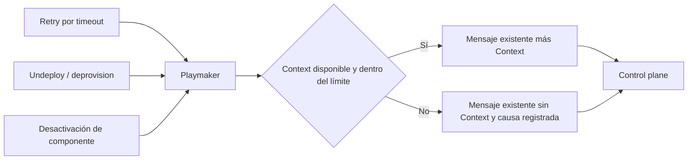

# Spec Funcional: Context transversal en RIO — retry, deprovision y desactivación

**Estado:** borrador · **Fecha:** 2026-09-30 · **Dueño:** rjara (Signals) · **Aplicación:** rio-playmaker

## Propósito

Estandarizar el uso de Context como capacidad transversal de RIO para aportar información adicional a los flujos que la necesitan. Esta entrega incorpora su publicación en retry por timeout, undeploy/deprovision y desactivación de componente.

## Contenido

## Problema

Los control planes necesitan información del componente y su entorno para interpretar una operación: identidad, versión conocida, relaciones y resultados publicados. Playmaker ya dispone de esa información y la expone mediante Context en el deployment por batches.

La disponibilidad de Context depende del camino que construye el mensaje. Retry por timeout, undeploy/deprovision y desactivación envían operaciones sin esa información, aunque actúan sobre los mismos componentes y sus recursos.

**Causa raíz:** el uso de Context quedó conectado a un flujo de deployment, sin un criterio común de provisión de contexto para los otros flujos operativos. Esto limita su reutilización y genera diferencias de información según el origen de la operación.

## Objetivo y alcance

Context aporta información adicional con un contrato común, una interpretación coherente y una política compartida de disponibilidad y degradación. Cada flujo que necesite esa información puede utilizar esta capacidad. La operación y sus parámetros mantienen su responsabilidad actual.

| Flujo incluido | Resultado esperado |
|---|---|
| Retry por timeout | El reintento incorpora Context del componente y de la definición que se está reintentando. |
| Undeploy/deprovision | La operación de retiro incorpora Context del componente y su estado desplegado conocido. Incluye las variantes genérica, Fury→Kafka y Kafka→Fury. |
| Desactivación de componente | La operación de retiro asociada a la desactivación incorpora Context, conservando su identidad y ciclo de ejecución. |

## Historias de Usuario

- **US-1** — **Como** responsable de un control plane, **quiero** recibir información adicional del componente en retry, deprovision y desactivación, **para** interpretar cada operación sin depender de que haya sido disparada por un deployment por batches.
- **US-2** — **Como** equipo de RIO, **quiero** un criterio común para aportar Context y manejar su ausencia, **para** reutilizar esta capacidad de forma consistente entre flujos.
- **US-3** — **Como** operador de RIO, **quiero** identificar cuándo una operación se envió sin Context y por qué, **para** diagnosticar la degradación sin exponer valores sensibles.

## Requisitos Funcionales

| # | Requisito | Prioridad |
|---|---|---|
| RF-1 | Los mensajes emitidos por los tres flujos incluidos incorporan el campo opcional `context` cuando su información puede construirse y el mensaje cumple el límite de tamaño. El criterio aplica a los tipos de componente ya admitidos por cada flujo. | Debe |
| RF-2 | Context corresponde al componente, data product, definición y ambiente de la operación. El usuario es el que originó la operación, cuando está disponible; un retry conserva ese origen y no atribuye la operación al scheduler. | Debe |
| RF-3 | La información temporal respeta la semántica por flujo indicada abajo. La versión solicitada y la última versión completada mantienen significados separados. | Debe |
| RF-4 | Se conserva el contrato vigente de Context: identidad propia, última versión conocida y relaciones con sus outputs. La falta de versión histórica o de valores de un vecino mantiene la degradación parcial prevista por ese contrato; un componente sin relaciones puede llevar Context con listas vacías. | Debe |
| RF-5 | Agregar Context conserva `params`, operación, routing, correlación, elegibilidad, permisos y ciclo de vida propios de cada flujo. En deprovision se preservan también los parámetros específicos de Fury. | Debe |
| RF-6 | Un fallo al construir Context permite enviar el mensaje sin ese campo y no convierte por sí solo la operación en fallida. Los fallos de publicación conservan el tratamiento propio del flujo. | Debe |
| RF-7 | El límite vigente es 200 KiB sobre el mensaje completo con Context. Si el candidato supera el límite o no puede medirse, se omite Context completo y se conserva el envío del mensaje con sus otros campos. | Debe |
| RF-8 | La operación de Context es observable: resultado y duración de construcción, tamaño medido y causa de descarte. La evidencia permite correlacionar el envío sin registrar valores crudos de Context o `params`, credenciales ni datos sensibles. | Debe |
| RF-9 | Los consumidores que ignoran Context y los que aceptan su ausencia mantienen compatibilidad. Esta entrega no exige modificar los control planes ni sustituir su lectura de `params`. | Debe |

### Semántica por flujo

| Flujo | Interpretación del Context |
|---|---|
| Retry | `component.version` identifica la definición del intento original, aunque exista una configuración más reciente. Las relaciones y el estado conocido se consultan para el nuevo envío; no se garantiza un snapshot idéntico al del primer intento. `latestVersion`, si existe, es la última versión completada del mismo servicio y ambiente, y no reemplaza los parámetros de la solicitud. |
| Deprovision | La identidad y definición corresponden a la operación de retiro. La última versión completada y sus outputs representan el estado desplegado conocido en ese servicio y ambiente antes del retiro; no deben perderse sólo por transicionar el estado de esa operación. |
| Desactivación | La identidad y definición corresponden al componente y servicio que se desactivan en el ambiente objetivo. Context puede tener relaciones vacías y conserva la información desplegada disponible antes del retiro. La correlación y el resultado siguen perteneciendo a la ejecución de desactivación. |

## Criterios de Aceptación

- **CA-1** — **Dado** un envío válido de cada uno de los tres flujos con información resoluble y tamaño permitido, **cuando** Playmaker publica el mensaje, **entonces** el control plane recibe Context con identidad y versión coherentes con la operación. Se verifican las tres variantes de deprovision.
- **CA-2** — **Dado** un intento de una definición y una configuración posterior del mismo componente, **cuando** ocurre un retry elegible, **entonces** `component.version` identifica la definición del intento original y el usuario conserva su origen conocido; el Context no se atribuye a la configuración posterior ni al scheduler.
- **CA-3** — **Dado** un recurso con una última versión completada y outputs conocidos, **cuando** se envía deprovision o desactivación, **entonces** Context conserva esa información del mismo servicio y ambiente sin sustituirla por el estado de otra instancia.
- **CA-4** — **Dado** un componente sin versión completada, sin relaciones o con un vecino sin outputs, **cuando** se construye Context, **entonces** se conserva la identidad y se representa la información faltante según el contrato vigente, sin inventar valores ni descartar el Context entero por esa sola ausencia.
- **CA-5** — **Dado** un fallo de construcción de Context en cualquiera de los tres flujos, **cuando** se realiza el envío, **entonces** se publica el mensaje sin Context, se registra la causa y los demás campos conservan su comportamiento.
- **CA-6** — **Dado** un mensaje candidato de exactamente 200 KiB, uno superior al límite o una medición fallida, **cuando** se aplica la protección de tamaño, **entonces** el primero conserva Context y los otros dos lo omiten completo, registrando causas distinguibles.
- **CA-7** — **Dado** el mismo escenario de operación con y sin enriquecimiento de Context, **cuando** se compara el envío y su resultado, **entonces** los parámetros, operación, routing, reglas de elegibilidad, permisos y correlación mantienen su semántica vigente. En desactivación se preservan la publicación posterior a la confirmación de la ejecución y la liberación de su bloqueo según el resultado.
- **CA-8** — **Dado** un consumidor compatible que ignora Context o admite su ausencia, **cuando** recibe ambos tipos de mensaje, **entonces** continúa procesándolos sin una migración obligatoria.
- **CA-9** — **Dado** un envío con Context, uno degradado y un deployment por batches de referencia, **cuando** se revisan sus evidencias, **entonces** se distinguen los resultados de construcción y descarte, no aparecen valores sensibles y el flujo por batches conserva su comportamiento.

## Escenarios E2E

- **E2E-1 — Retry:** **Dado** un deployment elegible para reintento y Context resoluble, **cuando** ocurre el timeout y se publica el nuevo envío, **entonces** el consumidor recibe Context de la definición reintentada y el seguimiento del retry mantiene su correlación vigente.
- **E2E-2 — Deprovision:** **Dado** un recurso desplegado, **cuando** se solicita su retiro por cada variante admitida de deprovision, **entonces** el consumidor recibe Context con su estado desplegado conocido y los parámetros de retiro originales, y el resultado se asocia a la operación correcta.
- **E2E-3 — Desactivación:** **Dado** un componente elegible sin conexiones activas, **cuando** se solicita desactivación, **entonces** el consumidor recibe Context aunque sus listas de relaciones estén vacías, el envío ocurre con la ejecución ya confirmada y el resultado conserva el ciclo de desactivación.
- **E2E-4 — Degradación:** **Dado** un fallo de construcción, un candidato excesivo o una medición fallida en cada flujo, **cuando** se envía la operación, **entonces** el mensaje llega sin Context y la causa es observable, conservando el tratamiento de publicación y seguimiento vigente.

## Decisiones cerradas

- Context es una capacidad transversal. La entrega estandariza su uso en los tres flujos incluidos y conserva su carácter opcional.
- Context es efímero y complementa la configuración de la operación. `params` y el contrato del SDK 1.5.0 se mantienen.
- La disponibilidad de Context no cambia quién puede iniciar una operación, qué intentos pueden reintentarse ni cómo se confirma su resultado.

## Fuera de Alcance

- Agregar Context al deploy individual, a actions, al materializer o a cualquier otro flujo adicional.
- Corregir los `params` vacíos del retry, cambiar su equivalencia con el envío original o modificar su política de reintentos.
- Cambiar el contrato de Context, agregar campos, retirar `params` o migrar la lógica de los consumidores.
- Persistir o reconstruir un snapshot inmutable del primer envío, agregar APIs o UI para Context.
- Resolver otros hallazgos preexistentes o ampliar la cobertura funcional de deprovision/desactivación.

## Dependencias e impacto cross-app

`rio-playmaker` produce Context y es la aplicación modificada. `rio-sdk-events:1.5.0` aporta el contrato existente. Los control planes reciben información adicional con compatibilidad aditiva; su adopción funcional tiene alcance propio. `rio-controlplane-clickhouse` participa en la validación de retry y deprovision. Desactivación se verifica con un consumidor o entorno de prueba que soporte ese flujo, sin depender de su uso habitual en ClickHouse.

## Fuentes

- [SIG-573 — Context de componente](https://spellbook.adminml.com/projects/SIG/specs/SIG-573) y [SIG-590 — Context de componente: Spec Técnica](https://spellbook.adminml.com/projects/SIG/specs/SIG-590): iniciativa y contrato existentes.
- [Retry por timeout](https://github.com/melisource/fury_rio-playmaker/blob/c4ac43da4a1c7222e4cdbceaff666978c96e0811/src/main/java/com/mercadolibre/rio/playmaker/service/pipeline/DeploymentTimeoutJob.java#L333-L351), [deprovision](https://github.com/melisource/fury_rio-playmaker/blob/c4ac43da4a1c7222e4cdbceaff666978c96e0811/src/main/java/com/mercadolibre/rio/playmaker/service/impl/UndeployServiceImpl.java#L562-L673) y [desactivación](https://github.com/melisource/fury_rio-playmaker/blob/c4ac43da4a1c7222e4cdbceaff666978c96e0811/src/main/java/com/mercadolibre/rio/playmaker/service/impl/ComponentInactivationServiceImpl.java#L451-L471): rutas de publicación incluidas.
