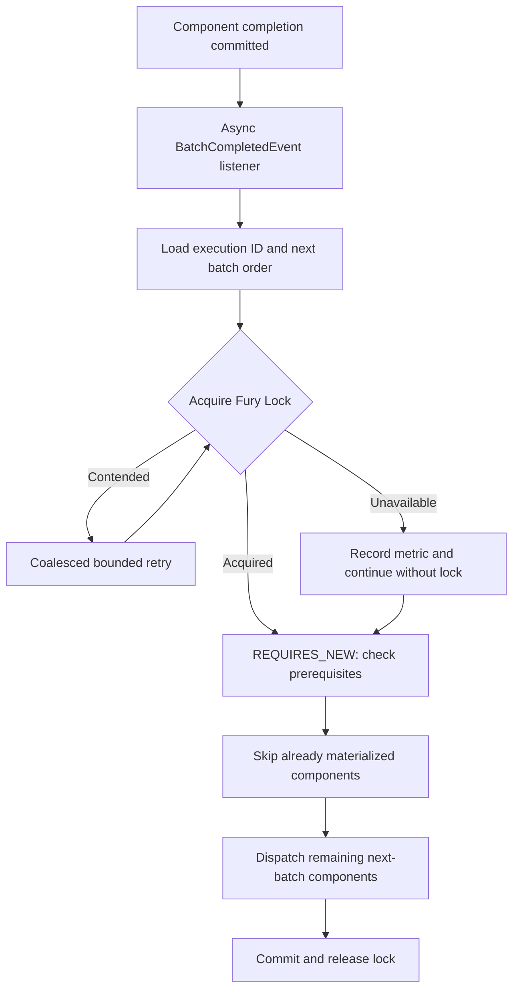

# Descripción PR — rio-playmaker — Serialización Fury Lock

## Propósito

Descripción reconstruida desde cero mediante `zord author pr-description`, el diff de `origin/develop...feature/serialize-batch-completed-listener`, las correcciones locales de esta sesión y la validación focal ejecutada. No reutiliza el body remoto ni la descripción anterior.

## Contenido

Draft listo para copiar al PR #1079, con el cambio de serialización del avance de batches, el fallback de disponibilidad y la actualización obligatoria de dependencias.

## Fuentes

- PR #1079, rama `feature/serialize-batch-completed-listener` @ `b34b94a935e1e20ac4027f7b82ff99b5eaf05bc3` sobre `origin/develop`.
- Diff local adicional: fallback sin lock ante indisponibilidad y release reintentable.
- `./gradlew test --tests com.mercadolibre.rio.playmaker.unit.service.BatchCompletedEventListenerTest --tests com.mercadolibre.rio.playmaker.unit.service.BatchAdvanceFuryLockTest --no-daemon`: PASS, 21 tests.

---

## Description

**fix: serialize batch advancement with Fury Lock**

Este PR serializa el avance de un pipeline hacia su próximo batch cuando callbacks `AFTER_COMMIT` concurrentes observan la misma transición. El listener toma un Fury Lock compartido por `pipelineExecutionId + nextBatchOrder` antes de abrir la transacción fresca que evalúa prerrequisitos y materializa deployments; así, dos completions del mismo batch no despachan dos veces el batch siguiente.

Cuando el lock está ocupado, el listener reintenta con backoff acotado y jitter, coalescido por transición. El presupuesto máximo de los diez retries es 7,5 s, superior al TTL máximo configurable de 7 s. Cuando Fury Lock no está disponible, registra la métrica y continúa sin serialización, preservando el comportamiento actual de producción en vez de perder el avance.

Una vez adquirido el lock, la orquestación relee los deployments ya materializados del group y despacha sólo los componentes pendientes del próximo batch. Esto vuelve idempotente el callback repetido después de que el primer callback ya materializó la transición.

### Changes

* Agrega el mutex distribuido Fury Lock, configuración de namespace, métricas de adquisición, contención, indisponibilidad, agotamiento, fallo de release y duración de hold.
* Agrega reintentos coalescidos para contención y fallback sin lock ante indisponibilidad del servicio de locks.
* Conserva el handle local si `unlock` falla, permitiendo reintentar la liberación mientras el proceso siga vivo.
* Evita redispatch de componentes del próximo batch que ya tienen deployment materializado en el mismo group.
* Incorpora `lockclient:5.0.0`: no es posible importar la API de Lockclient requerida con versiones anteriores a 5, y esta actualización arrastra la actualización de `java-melitk-workqueues` a `4.0.0` y sus dependencias compatibles.
* Configura `APPLICATION` desde el `application_name` canónico de `.fury` para los tests; `.fury` ya declara `rio-playmaker`.

### What does not change

* Los callbacks siguen siendo asíncronos y posteriores al commit original.
* La evaluación de prerrequisitos continúa en una transacción `REQUIRES_NEW` fresca.
* Un Fury Lock indisponible no bloquea el avance: se ejecuta el comportamiento previo, sin serialización.
* No se agregan migraciones de schema, cambios de API ni cambios en los control planes.

### Review focus

* Validar la clave de lock por execution y próximo batch, el TTL de hasta 7 s y el presupuesto máximo de retry de 7,5 s.
* Confirmar el fallback de disponibilidad: ante falla de Fury Lock se privilegia continuidad del avance sobre exclusión mutua.
* Validar el upgrade conjunto de Lockclient 5 y WorkQueues 4 en los ambientes Fury del servicio.

## Dev checklist (should be completed by the developer assigned to the issue)

* [ ] I have met the definition of done
* [x] I have used [conventional commits](https://www.conventionalcommits.org/en/v1.0.0/)
* [x] I have performed a self-review of my own code
* [x] I have added tests that prove my fix is effective or that my feature works
* [x] New and existing unit tests pass locally with my changes — 21 focal tests passed in this session.
* [ ] Any dependent changes have been merged and published in downstream modules — validar el upgrade de dependencias en Fury.
* [ ] I already deployed this branch in the pre-production environment

## Code Review checklist (must be completed by the code reviewer)

* [ ] Is it the issue being completed?
* [ ] Is the code good in style? (Easy to read, follows good practices and our style guide)
* [ ] The code runs correctly? (Optional)
* [ ] Is this a good enough implementation?

## How Has This Been Tested?

* `./gradlew test --tests com.mercadolibre.rio.playmaker.unit.service.BatchCompletedEventListenerTest --tests com.mercadolibre.rio.playmaker.unit.service.BatchAdvanceFuryLockTest --no-daemon`: PASS, 21 tests.
* Tests unitarios de adquisición, contención, retries, fallback por indisponibilidad, release reintentable y ejecución transaccional fresca.
* Pendiente validar en preproducción la conectividad y configuración Fury para Lockclient 5 y WorkQueues 4.

## Issue

`SIG-186` — deployments duplicados al avanzar batches en Playmaker.

---

## Notas internas — NO van al PR

Zord Author generó el primer borrador con provider Codex `gpt-5.6-terra`. El texto final reemplaza su afirmación obsoleta de fail-closed por el fallback explícitamente solicitado y agrega la evidencia de tests de esta sesión. La descripción anterior se preservó como entrega descartada porque la iniciativa no es un hotfix.
