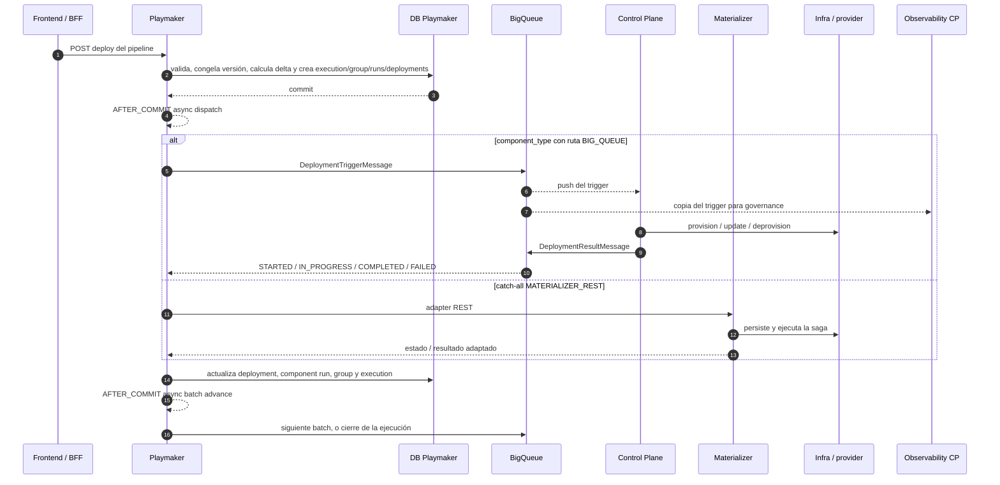

# Deployments en RIO — flujo completo

## Propósito

Explicar el deployment de RIO de punta a punta a una audiencia técnica que conoce servicios y eventos, pero no necesariamente las decisiones internas de RIO. El objetivo es que pueda responder tres preguntas: quién posee cada estado, qué mensaje cruza cada frontera y dónde puede perderse el progreso.

## Resumen ejecutivo

Un deployment en RIO es una **reconciliación declarativa**: la UI expresa el estado deseado de un data product; Playmaker calcula el delta y orquesta; cada control plane ejecuta una unidad tecnológica; BigQueue lleva triggers y resultados; Playmaker consolida esos resultados hasta cerrar la ejecución. La regla mental más importante es: **ACK de transporte no equivale a éxito de negocio**.

Hoy el flujo nuevo usa BigQueue para 11 `component_type` únicos explícitos y cae a Materializer REST para todo lo demás. Playmaker persiste la intención antes de despachar, pero tanto el despacho inicial como el avance al siguiente batch dependen de eventos asíncronos en memoria después del commit. Kafka, Flink y ClickHouse además confirman el mensaje antes de terminar el trabajo en background. Esas fronteras crean ventanas reales donde un reinicio puede dejar un deployment varado.

## Contenido

### 1. Modelo mental y flujo completo



1. La UI/BFF llama `POST /data-products/{name}/environments/{envName}/pipeline/deploy` en Playmaker.
2. Playmaker valida la topología, registra una nueva `PipelineVersion` append-only, evita ejecuciones concurrentes, calcula el delta contra el estado vigente y genera `desired_state_hash`.
3. En una transacción crea la `PipelineExecution`, sus `ComponentRun`, el `DeploymentGroup` y un `Deployment` por intento materializable.
4. El orden actual no es topológico: `FORCE_CONFIG_ORDER = true` fuerza batch 0 para no-engines y batch 1 para engines. Es un hotfix explícito; las relaciones del grafo están temporalmente ignoradas.
5. Después del commit, un listener `@Async` publica el primer batch. El adapter se elige únicamente por `component_type`: BigQueue para rutas explícitas y Materializer REST para el catch-all.
6. El control plane acusa recibo al transporte, aplica idempotencia local, ejecuta la operación contra su proveedor y publica progreso o resultado en `rio-deployment-result`.
7. Playmaker correlaciona el resultado por `deployment_id`, actualiza la jerarquía de estados y, después de otro commit, un segundo listener asíncrono decide si despacha el siguiente batch o cierra la ejecución.
8. Si un componente falla, los batches posteriores se cancelan y el fallo se propaga a group/execution. Los resultados tardíos de un run ya terminal se descartan.

### 2. Modelo de datos

```text
DataProduct
     ├── Environment
     ├── Component ── ComponentDefinition (type, params, SLOs)
     │                    └── Service (instancia por environment)
     └── Pipeline
           ├── PipelineVersion (historial inmutable)
           └── PipelineExecution (pipeline + environment; una reconciliación)
                    ├── DeploymentGroup (fan-out y política de orden)
                    └── ComponentRun (estado agregado de un componente)
                             └── Deployment (un intento materializable)
                                      └── DeploymentLog (historial)
```

| Entidad | Identidad y responsabilidad |
|---|---|
| `DataProduct` + `Environment` | Alcance lógico del despliegue; la misma topología puede tener estado distinto por ambiente. |
| `Component` + `ComponentDefinition` | Identidad lógica y definición materializable: `type`, estado, `parameters` y `slos`. `source_component_id` permite representar una copia importada. |
| `Service` | Instancia del componente en un environment; conserva status y values observados y es la referencia estable a la que se asocian los intentos. |
| `Pipeline` + `PipelineVersion` | Pipeline vigente más historial append-only de número de versión, autor y fecha. La execution referencia al Pipeline, no a una `PipelineVersion` concreta. |
| `PipelineExecution` | UUID de la reconciliación completa; referencia Pipeline + Environment y guarda tipo, estado y `desired_state_hash`. Estados: `PENDING`, `RUNNING`, `COMPLETED`, `FAILED`, `PARTIAL_FAILURE`. |
| `DeploymentGroup` | UUID que agrupa el fan-out y su estrategia de orden. Estados: `PENDING`, `RUNNING`, `COMPLETED`, `FAILED`, `CANCELLED`. |
| `ComponentRun` | Una fila por `(execution, component)` con `run_order`; agrega todos los intentos del componente. Usa los mismos terminales del group. |
| `Deployment` | Intento individual. Tiene id DB `Long`, valores, retry, timeout y un UUID wire (`deployment_correlation_id`; `materialization_id` como fallback). Estados: `PENDING`, `REQUESTED`, `STARTED`, `COMPLETED`, `FAILED`, `UNKNOWN`. |
| `DeploymentLog` | Historial de transiciones y payload de respuesta asociado al intento. |

La cadena de trazabilidad es `execution_id → deployment_group_id → component_run → deployment_id`. Para diagnosticar hay que conservarla completa: `execution_id` responde por la orquestación; `deployment_id` correlaciona trigger y resultado de un intento.

### 3. Contratos de mensajes

| Mensaje | Viaja | Campos que gobiernan el flujo | Semántica |
|---|---|---|---|
| `DeploymentTriggerMessage` | Playmaker → CP por `rio-deployment-trigger` | `deployment_id`, `deployment_group_id`, `component_type`, `operation`, ids/nombres de component, data product y environment, `criticality`, `params`, `context`, `schema_version`, `published_at` | El discriminador efectivo actual es `component_type`; todas las rutas base usan versión `*`. `operation` es `PROVISION`, `UPDATE` o `DEPROVISION`. `params`, `context` y outputs pueden contener datos sensibles: no deben loguearse. |
| `DeploymentResultMessage` | CP → Playmaker por `rio-deployment-result` | `deployment_id`, `component_type`, `status`, `output`, `error`, `schema_version`, `published_at` | `STARTED` e `IN_PROGRESS` son no terminales; `COMPLETED` y `FAILED` son terminales. El ACK del push sólo confirma recepción/procesamiento HTTP, no que este resultado exista. |
| `ActionTriggerMessage` / `ActionResultMessage` | Playmaker ↔ CP | acción imperativa y su resultado | Protocolo vecino para start/stop u operaciones puntuales; no forma parte de la máquina de estados de deployment. |
| `ComponentRuntimeStatusMessage` | CP → Playmaker | estado observado de runtime | Telemetría operacional posterior; no reemplaza el resultado terminal del deployment. |

### 4. Routing efectivo por control plane

| Control plane | `component_type` que implementa | Ruta base desde Playmaker | Qué hace y cómo responde |
|---|---|---|---|
| Kafka | `aws-msk-topic`, `kafka-topic`, `gcp-kafka-topic` | BigQueue para los dos primeros; `gcp-kafka-topic` cae a Materializer REST | Crea/actualiza/elimina topics; procesa en background después del ACK y publica resultado best effort. |
| Flink | `flink-sql`, `aws-flink-job`, `gcp-flink-sql` | BigQueue para los dos primeros; `gcp-flink-sql` cae a Materializer REST | Despliega/pollee jobs; procesa en background después del ACK. Puede degradar idempotencia si KVS no está disponible. |
| ClickHouse | `clickhouse-mergetree`, `clickhouse-mat-view` | BigQueue | Ejecuta DDL/materializaciones; `mat-view` sólo soporta `PROVISION`. Procesa en background y el claim KVS no es atómico entre pods. |
| Fury | `kafka-fury-streams`, `fury-streams-kafka`, `kafka-fury-bigqueue`, `kafka-fury-kvs` | BigQueue para Streams↔Kafka; BigQueue/KVS caen a Materializer REST | Persiste desired/observed state y reconcilia. Mantiene marcadores `reportedDeploymentId`/`publishedDeploymentId`, por lo que puede reintentar resultados terminales no publicados. Es el diseño más durable de los CP actuales. |
| Signals | `catalog-signal`, `bigqueue-signal`, `stream-signal` | BigQueue | Llama Catalog o Collector; procesa sin desprender trabajo y propaga el fallo de publicación terminal para provocar redelivery. Usa KVS con CAS para idempotencia. |
| Observability | copia de triggers; incluye `aws-flink-job` | Suscriptor lateral de BigQueue | Upsert de criticality/tags en BigQuery y OTel. No es dueño del resultado terminal y no debe bloquear el deployment. Algunas fallas laterales se tragan después del ACK. |
| Materializer | cualquier tipo no ruteado explícitamente | REST catch-all; también existe un adapter stream no seleccionado por la base | Persiste una saga y llama a los servicios legacy. Su workqueue y parte de sus continuaciones también desprenden trabajo en memoria. |

La tabla describe la configuración base en `origin/master`. Una suscripción, filtro o override de runtime fuera de los repos podría cambiar la ruta física; eso debe verificarse en Fury/BigQueue antes de afirmar el mapa de producción.

### 5. Semántica de entrega: dónde está el riesgo

| Severidad | Ventana | Consecuencia concreta |
|---|---|---|
| Crítica | Playmaker hace commit y luego despacha con `@TransactionalEventListener(AFTER_COMMIT)` + `@Async` sin outbox | Si el proceso cae entre ambos pasos, el trigger nunca sale. El `Deployment` queda `REQUESTED` con `timeout_at = null`, por lo que el scanner de timeout no lo recupera: queda varado. |
| Crítica | El resultado se persiste y el avance de batch ocurre en otro evento `AFTER_COMMIT` asíncrono | Una caída puede dejar el batch siguiente sin despachar aunque el anterior esté terminal. El lock anti doble-dispatch y sus reintentos viven en memoria; no son un replayer durable. |
| Crítica | Kafka, Flink y ClickHouse devuelven HTTP 200 y recién después ejecutan en un executor | BigQueue considera entregado el mensaje; una caída antes o durante el background puede matar el trabajo sin redelivery. |
| Crítica | Kafka y ClickHouse guardan terminal en KVS antes de publicar un resultado best effort | Si falla la publicación, la infraestructura puede estar lista y KVS terminal, pero Playmaker no se entera; un redelivery puede descartarse por idempotencia. |
| Alta | Flink puede finalizar KVS aunque la publicación del resultado falle y el caller ignore el booleano | Mismo estado partido: efecto real sin cierre de la ejecución en Playmaker. |
| Alta | Materializer acepta workqueues y sagas antes de completar futures; su índice de timeouts es por pod y no se reconstruye | Reinicios pierden continuaciones o vigilancia de sagas pendientes. Su adapter stream, si se habilitara, transforma hoy un evento `FAILED` en `COMPLETED`: riesgo de falso éxito. |
| Alta | Capacidades del CP y rutas de Playmaker no coinciden | `gcp-*`, `kafka-fury-bigqueue` y `kafka-fury-kvs` pueden caer al legacy REST aunque el CP moderno los implemente. El timeout aún configura `collector-signal`, nombre que no coincide con los tres tipos Signals actuales. |
| Media | `FORCE_CONFIG_ORDER` ignora el grafo real | Dos batches engine/no-engine evitan parte del problema de dependencias, pero no garantizan orden causal entre componentes dentro de cada grupo. |

### 6. Diseño recomendado

1. Implementar una **transactional outbox** en Playmaker para `dispatch requested` y `batch advance`, con dispatcher idempotente y replayer; el estado durable debe ser la fuente del trabajo pendiente.
2. En cada CP, no ACKear hasta que el trabajo esté duramente aceptado. Para operaciones largas, persistir desired state/job antes del ACK y reconciliar como Fury; no depender de un `CompletableFuture` local.
3. Publicar resultados mediante outbox o marcador `terminal persisted / terminal published`, reintentable hasta confirmación. El patrón actual de Fury es la mejor base interna.
4. Alinear capability matrix y routing en un contrato ejecutable único; validar que todo `component_type` implementado tenga ruta y timeout coherentes.
5. Reemplazar el hotfix de orden por el grafo topológico cuando la causa de los batches incorrectos esté resuelta, con replay seguro y pruebas end-to-end.
6. Endurecer provenance del resultado: validar `deployment_id + component_type + owner CP`, versionar schema y auditar duplicados/tardíos sin registrar `params`, `context` ni `outputs` sensibles.

### 7. Cinco ideas para decir mañana

- “Playmaker posee la orquestación; cada CP posee el efecto tecnológico; BigQueue sólo transporta.”
- “El contrato de correlación es `execution_id` para el todo y `deployment_id` para cada intento.”
- “El status terminal de negocio llega en `DeploymentResultMessage`; un HTTP 200 de BigQueue no lo reemplaza.”
- “El happy path está desacoplado, pero varias continuaciones no son durables: commit, ACK o KVS terminal pueden quedar separados de la siguiente acción.”
- “Fury muestra el norte de diseño: desired/observed state durable, reconciler idempotente y publicación terminal reintentable.”

## Fuentes

- [[ads-signals-knowledge-library]] revisada en `c2e83fdbd`; útil como mapa, con contradicciones documentadas en [[Revisión de ads-signals-knowledge-library]].
- Código vigente contrastado contra `origin/master` al 2026-09-01: `rio-playmaker@6cb4c5668`, `rio-sdk-events@8732ee47e`, `rio-materializer@8f2d966d9`, `rio-controlplane-kafka@11ee912b7`, `rio-controlplane-flink@21fdcfcaf`, `rio-controlplane-clickhouse@a316f445a`, `rio-controlplane-fury@27786b9cc`, `rio-controlplane-signals@26ec78392`, `rio-controlplane-observability@486e063dd`.
- Puntos primarios: Playmaker `application.yml`, modelos/enums y `service/pipeline`; SDK `DeploymentTriggerMessage`/`DeploymentResultMessage`; controllers, processors, KVS/idempotency y result publishers de cada CP; lifecycle/reconciler de Fury; sagas/workqueues de Materializer.

## Límites

- Esto describe el flujo de **deployment de pipeline**. Actions y runtime status aparecen sólo para delimitar contratos adyacentes.
- No se inspeccionó configuración viva de scopes, suscripciones BigQueue ni overrides de producción; donde importa, se declara la ruta que resulta de los repos.
- Hechos vienen del código; conclusiones sobre pérdida son inferencias causales de los boundaries observados. Para demostrar frecuencia o impacto histórico faltan métricas e incidentes de producción.
