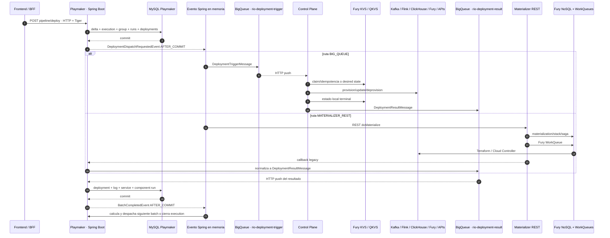
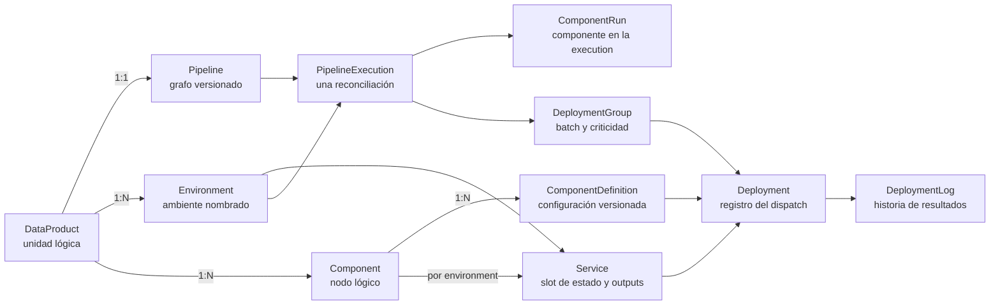

# Deployments en RIO — flujo completo

## Propósito

Explicar el deployment de pipeline en RIO en dos pasadas. La primera construye el modelo completo tal como funciona hoy, nombrando en cada etapa el servicio, transporte y almacenamiento involucrado. La segunda vuelve sobre las fronteras críticas para explicar por qué pueden perder progreso, qué recuperación existe, qué falta y cómo convertir el gap en deuda técnica accionable.

La audiencia asumida es técnica y conoce servicios, APIs y eventos, pero no necesita conocer previamente las clases internas de RIO.

## Contenido

La primera parte describe el flujo vigente, sus tecnologías y su modelo de datos. La segunda analiza las fronteras en que puede perderse la siguiente acción y documenta mecanismos de recuperación y deuda técnica posible.

## Idea central para abrir la presentación

Un deployment en RIO no es una transacción distribuida ni un único proceso de principio a fin. Es una cadena de estados persistidos en MySQL, eventos Spring en memoria, mensajes BigQueue, estados de idempotencia en KVS y operaciones contra infraestructura. El flujo es recuperable sólo cuando cada frontera deja duramente registrada la siguiente acción antes de confirmar la anterior.

La frase que organiza toda la presentación es:

> **ACK de transporte no equivale a aceptación durable ni a éxito de negocio.**

---

# Parte I — Cómo funciona hoy

## 1. Vista completa



El diagrama tiene dos caminos de ejecución, pero un único modelo de cierre: todos los resultados terminan normalizados como `DeploymentResultMessage` y procesados por la misma máquina de estados de Playmaker.

## 2. Tecnologías y responsabilidad de cada actor

| Actor | Tecnología relevante | Estado que posee |
|---|---|---|
| Frontend / BFF | HTTP REST, Tiger Token | Intención del usuario; no posee el progreso del deployment |
| Playmaker | Java, Spring Boot, Spring Transaction, JPA/Hibernate | Orquestación y estado agregado del pipeline |
| Base de Playmaker | MySQL | `PipelineExecution`, `DeploymentGroup`, `ComponentRun`, `Deployment`, `DeploymentLog`, `Service` y configuración del pipeline |
| Continuaciones internas de Playmaker | `ApplicationEventPublisher`, `@TransactionalEventListener(AFTER_COMMIT)`, `@Async`, executor local | Disparo posterior al commit; no es almacenamiento durable |
| Transporte de deployment | Fury BigQueue | Entrega de triggers y resultados mediante push HTTP |
| Contratos | `rio-sdk-events`, JSON | `DeploymentTriggerMessage` y `DeploymentResultMessage` |
| Exclusión de avance de batch | Fury Lock con TTL y retries en memoria | Evita avance concurrente duplicado; no registra trabajo pendiente ni hace replay |
| Kafka CP | Java/Spring, Fury KVS, Kafka `AdminClient`, AWS MSK y GCP Managed Kafka | Idempotencia local y efecto sobre topics Kafka |
| Flink CP | Java/Spring, Fury KVS, executors y jobs de polling, AWS Kinesis Data Analytics y GCP Dataproc | Idempotencia local y lifecycle de aplicaciones Flink |
| ClickHouse CP | Java/Spring, Fury KVS, APIs/DDL de ClickHouse | Idempotencia local, ownership y efecto sobre tablas/materialized views |
| Fury CP | Kotlin, QKVS con optimistic locking, reconciler, leases, Template Processing y Reactor Kafka | Desired/observed state durable de los pushers y publicación terminal recuperable |
| Signals CP | Java/Spring, Fury KVS con claim, Catalog API, Collector API y BigQueue | Idempotencia local y provisioning de signals |
| Observability CP | Suscripción BigQueue, BigQuery, OpenTelemetry; KVS para capacidades laterales | Governance y telemetría; no posee el resultado terminal del deployment |
| Materializer | Java/Spring, REST, Fury NoSQL, Fury WorkQueues, Terraform, Cloud Controller y buckets de estado | Materializaciones, stacks y sagas del camino legacy/storage |

## 3. Entrada y delta: qué decide Playmaker

El frontend o BFF invoca `POST /data-products/{name}/environments/{envName}/pipeline/deploy`. Playmaker autentica con Tiger, valida data product, environment, pipeline y freezes, calcula el delta contra el estado vigente y obtiene un `desired_state_hash`.

El hash cumple dos funciones: devolver una execution ya `COMPLETED` cuando el estado deseado es idéntico y bloquear otra execution `PENDING` o `RUNNING` con el mismo estado. `force=true` omite la reutilización de una execution completada, pero no permite dos ejecuciones equivalentes en vuelo.

La clase que implementa esta decisión es `DeltaComputationServiceImpl`. Recorre los componentes activos y compara la definición deseada con el estado desplegado en el `Service` del environment:

- Si todavía no existe `Service`, devuelve `DEPLOY`.
- Si cambió la `ComponentDefinition`, devuelve `DEPLOY`.
- Si el `Service` está `PENDING_REMOVAL`, devuelve `UNDEPLOY`.
- Si el último `ComponentRun` falló o terminó, puede devolver `DEPLOY` para reconciliar.
- Si el estado activo ya coincide con lo deseado, devuelve `SKIP`.

Para cada entrada cuyo action no es `SKIP` se crea después un `ComponentRun`. El `desired_state_hash` se calcula a partir de las parejas `componentId:configId` de estas entradas. El servicio de delta también consulta el `Service` por component y environment: ese slot conserva la definición pendiente o activa que corresponde a ese ambiente, no sólo la última definición global del componente.

## 4. Modelo de datos de Playmaker

El modelo combina configuración, estado por environment y ejecución:



| Entidad | Qué representa |
|---|---|
| `DataProduct` | Unidad lógica propietaria del pipeline y los componentes. Conserva además un campo `environment` legacy. |
| `Environment` | Ambiente nombrado relacionado con el DP. La unicidad es `(name, data_product)`, por lo que un DP puede tener varias filas Environment. |
| `Pipeline` | Grafo versionado; el modelo impone una relación efectiva 1:1 con el DataProduct. |
| `Component` | Nodo lógico o tipo de recurso dentro del DP. |
| `ComponentDefinition` | Versión concreta de la configuración del componente: estado, parámetros, SLOs y versión. |
| `Service` | Slot `component × environment`. Conserva la definición activa o pendiente, el estado y un JSON `values` con los outputs técnicos observados. |
| `PipelineExecution` | Una reconciliación completa del pipeline para un environment; conserva tipo, status y `desiredStateHash`. |
| `ComponentRun` | Estado de un componente lógico dentro de una `PipelineExecution`. Se crea uno por entrada de delta distinta de `SKIP`. |
| `DeploymentGroup` | Batch, orden y política de criticidad asociados a la execution. |
| `Deployment` | Registro del dispatch de un `Service` y una `ComponentDefinition` dentro de un group. Conserva action, status, values, IDs de correlación, timeout y retry count. |
| `DeploymentLog` | Historial de resultados de ese deployment: status, outputs y mensaje técnico. No corresponde a los logs generales de la aplicación. |

### ComponentRun versus Deployment

`ComponentRun` representa **el componente dentro de una execution**. `Deployment` representa **el dispatch de ese componente hacia un Service y una definición concreta dentro de un group**. En el primer envío normal existe un `ComponentRun` por componente cambiado y se crea un `Deployment` cuando el batch de ese componente se despacha.

No hay una foreign key directa entre ambos. Cuando vuelve un resultado, Playmaker resuelve el `ComponentRun` a través de `DeploymentGroup.pipelineExecution` y `Deployment.service.componentId`.

Tampoco conviene definir `Deployment` como “un intento de transporte” de manera estricta: el retry automático de un `REQUESTED` reutiliza la fila, incrementa `retryCount` y puede publicar un nuevo trigger UUID. Una nueva `PipelineExecution`, en cambio, crea un nuevo `ComponentRun` y otro `Deployment`.

### Identidades y datos de resultado

| Identidad o campo | Responde qué pregunta |
|---|---|
| `execution_id` | ¿Cómo terminó la reconciliación completa del pipeline? |
| `deployment_group_id` | ¿Qué batch y política de orden se están ejecutando? |
| `component_run` | ¿Cómo terminó este componente dentro de la execution? |
| `deployment_correlation_id` | ¿Qué trigger o resultado asíncrono corresponde a este Deployment? |
| `DeploymentLog` | ¿Qué estados, outputs y mensajes fueron recibidos para el Deployment? |
| `Service.values` | ¿Cuáles son los últimos outputs técnicos acumulados del componente en ese environment? |

Cuando llega `result.output`, Playmaker agrega una entrada a `DeploymentLog` si es nueva y mezcla el mapa tanto en `Deployment.values` como en `Service.values`. Esos values pueden contener identificadores de recursos, endpoints u otros datos que el CP devuelve y que luego se usan para observabilidad o resolución de parámetros posteriores.

### Deuda de abstracción visible

- `DataProduct` conserva un `environment` escalar legacy al mismo tiempo que existe la relación 1:N con `Environment`. La posibilidad histórica de asociar un DP a más de un environment sigue visible en el modelo aunque la regla operativa haya cambiado.
- `ComponentRun` y `Deployment` viven en niveles distintos, pero su relación se reconstruye indirectamente.
- `Service.values` concentra outputs técnicos heterogéneos en JSON y no los tipa como entidades de recurso.

En MySQL queda persistida la intención. Lo que todavía no queda persistido es la obligación de publicar el trigger: esa continuación se representa después mediante un evento Spring en memoria.

## 5. Batches y orden actual

Playmaker calcula batches antes de despachar. El algoritmo topológico existe, pero `FORCE_CONFIG_ORDER = true` lo evita temporalmente y fuerza dos grupos configurados:

1. Componentes no-engine.
2. Componentes engine: Flink, ClickHouse materialized view, Signals y los pushers Fury configurados.

Este hotfix reduce algunos problemas de precedencia, pero no garantiza el orden causal del grafo dentro de cada grupo. Dos componentes del mismo batch pueden ejecutarse en paralelo aunque uno dependa realmente del output del otro.

## 6. Creación del Deployment y handoff posterior al commit

Por cada componente del batch, `BatchDispatchServiceImpl` resuelve parámetros, construye el `DispatchRequest`, crea un `Deployment` con estado `REQUESTED`, genera y persiste la correlation UUID, deja `retry_count = 0` y `timeout_at = null`, y publica `DeploymentDispatchRequestedEvent` en el `ApplicationEventPublisher` de Spring.

El listener corre con `AFTER_COMMIT` y `@Async`. `AFTER_COMMIT` significa que la transacción que creó el Deployment ya se confirmó; el listener no continúa dentro de esa misma transacción. Si el adapter o el manejo del listener escribe en MySQL, lo hace mediante otra transacción. La razón del orden es válida: el resultado podría volver muy rápido y debe encontrar el deployment ya visible. La consecuencia es que aparece una frontera no durable entre el primer commit y la ejecución del listener.

Cuando el listener efectivamente comienza, resuelve el transporte por `component_type` y versión.

## 7. Routing: BigQueue versus Materializer

### Ruta BigQueue

`BigQueueDispatchAdapter` toma el request interno, completa la forma final de `DeploymentTriggerMessage` definida por `rio-sdk-events`, persiste el correlation/materialization ID de fallback y `timeout_at` en MySQL y luego publica el mensaje en `rio-deployment-trigger`. BigQueue transporta el envelope; no estructura el contenido de negocio.

El mensaje contiene `deployment_id`, `deployment_group_id`, `component_type`, `operation`, identidades del componente, data product y environment, `criticality`, `params`, `context`, `schema_version` y `published_at`. `params`, `context` y outputs pueden contener información sensible y no deben loguearse completos.

### Ruta Materializer REST

`MaterializerRestAdapter` invoca `doMaterialize` por REST e incluye la callback URL de Playmaker. Materializer persiste materialization, stack y sagas como `PENDING` en Fury NoSQL, encola una Fury WorkQueue y responde HTTP 201 con el `materializationId`; no espera a que termine la infraestructura dentro del request original.

La WorkQueue llama después a `/workqueues/materialization-request`. El worker ejecuta Terraform o Cloud Controller y Materializer envía otro request HTTP a Playmaker, mediante el callback `POST /deployments/{id}/logs`. `LegacyCallbackResultAdapter` normaliza el callback como `DeploymentResultMessage` y lo publica en `rio-deployment-result` para reutilizar la máquina de estados nueva.

Hay una precisión importante para analizar recuperación: el endpoint actual de WorkQueue desprende `CompletableFuture.runAsync(...)` y devuelve 200. La cola hace durable la entrega hasta ese ACK, pero el trabajo vuelve a quedar en memoria local después de la aceptación. Por lo tanto, “usar WorkQueue” sólo cierra el gap si el job queda durable antes del 2xx y un worker puede retomarlo tras perder la instancia.

### Precisión sobre “Materializer sólo maneja storages”

La afirmación es **casi la intención vigente, pero no es completamente cierta en el routing actual**:

- En el catálogo de 11 tipos documentado por Playmaker, Materializer figura como owner de `s3-bucket` y `gcs-bucket`.
- Playmaker declara 11 rutas BigQueue únicas y después un catch-all `* → MATERIALIZER_REST`.
- Dentro de esos 11 tipos de catálogo, `gcp-kafka-topic` no aparece en la allowlist BigQueue de Playmaker y por lo tanto cae al catch-all de Materializer.
- El Kafka CP sí implementa `gcp-kafka-topic` y lo acepta por BigQueue, pero su propio código lo describe como “legacy-only routing today”.
- Cualquier tipo legacy que siga activo y no esté en la lista explícita también cae a Materializer.

Por eso, la forma precisa de decirlo es: **Materializer es hoy el owner explícito de storages, pero el catch-all también absorbe tipos no migrados; `gcp-kafka-topic` es la contradicción concreta verificada en código.** La configuración viva de scopes y overrides de producción no fue consultada, por lo que no corresponde afirmar que el tráfico real sea exclusivamente storage.

## 8. BigQueue entrega el trigger a los control planes

BigQueue hace push HTTP del mismo tópico a suscriptores filtrados por tipo. Cada CP ignora los tipos que no reconoce. Observability recibe una copia lateral del trigger para governance y telemetría, pero no participa en el resultado terminal.

La semántica crítica está en el momento del HTTP 200:

- Kafka, Flink y ClickHouse aceptan el request, desprenden trabajo a un executor o cadena asíncrona local y responden 200 antes de completar el efecto tecnológico.
- BigQueue considera entregado el mensaje cuando recibe el 2xx.
- Si el pod cae después del ACK y antes de que el trabajo quede recuperablemente aceptado, el transporte ya no tiene por qué redeliver.

## 9. Ejecución según el control plane

| Control plane | Tipos principales | Tecnología del efecto | Idempotencia / estado local | Relación entre ACK y trabajo |
|---|---|---|---|---|
| Kafka | `aws-msk-topic`, `gcp-kafka-topic`, `kafka-topic` legacy | Kafka `AdminClient`, AWS MSK, GCP Managed Kafka | Fury KVS con claim y CAS terminal | HTTP 200 antes de ejecutar en `CompletableFuture` |
| Flink | `flink-sql`, `aws-flink-job`, `gcp-flink-sql` | AWS Kinesis Data Analytics, GCP Dataproc/Cloud Controller, polling programado | Fury KVS; además hay registries/jobs en memoria para continuaciones | HTTP 200 antes de la cadena asíncrona |
| ClickHouse | `clickhouse-mergetree`, `clickhouse-mat-view` | DDL y APIs de ClickHouse | Fury KVS; el claim usa sincronización local y no CAS distribuido completo | HTTP 200 antes del executor local |
| Fury | `fury-streams-kafka`, `kafka-fury-streams` y capacidades de pusher asociadas | QKVS, Template Processing, Reactor Kafka | Desired/observed durable, optimistic locking, leases y marcador de publicación | El reconciler reconstruye trabajo desde estado durable |
| Signals | `catalog-signal`, `bigqueue-signal`, `stream-signal` | Catalog API y Collector API | Fury KVS; el terminal se guarda después de publicar | El error terminal se propaga para provocar redelivery |
| Materializer | `s3-bucket`, `gcs-bucket` y catch-all legacy | Fury NoSQL, WorkQueues, Terraform, Cloud Controller, AWS/GCP | Materialization, stack y saga durables; parte de la continuación sigue en memoria | REST y WorkQueue aceptan antes de completar la infraestructura |

## 10. Publicación del resultado terminal

Los CP publican `DeploymentResultMessage` en `rio-deployment-result` con estados `STARTED`, `IN_PROGRESS`, `COMPLETED` o `FAILED`.

Los CP difieren precisamente en la frontera más delicada:

- **Kafka:** guarda `COMPLETED` o `FAILED` en KVS antes de publicar. Si la publicación falla, el error se registra y se traga; una reentrega posterior encuentra KVS terminal y descarta el mensaje.
- **ClickHouse:** guarda terminal en KVS y luego publica best effort. El publisher captura el error y no lo propaga.
- **Flink AWS:** publica el terminal y después finaliza KVS, pero el publisher devuelve `false` ante error y el caller no usa ese resultado para impedir el cierre del estado de idempotencia. El efecto práctico sigue permitiendo terminal local sin resultado entregado.
- **Signals:** publica el terminal antes de guardar `COMPLETED` en KVS. Si publicar falla, lanza una excepción retryable, deja el estado reprocesable y hace que BigQueue pueda redeliver.
- **Fury:** persiste por separado `reportedDeploymentId` y `publishedDeploymentId`; si la publicación no quedó confirmada, el reconciler vuelve a intentarla en otro tick.

Fury es el patrón interno más completo porque distingue duramente “el efecto terminó” de “Playmaker ya fue informado”.

## 11. Playmaker consume y consolida el resultado

BigQueue entrega el resultado por HTTP a Playmaker. `DeploymentResultConsumerServiceImpl` valida el identificador y delega en `DeploymentResultHandlerImpl`, que busca primero `deployment_correlation_id` y conserva `materialization_id` como fallback legacy.

Playmaker actualiza en una transacción:

- `Deployment` y su `DeploymentLog`.
- `Service` y sus values observados.
- Estado agregado del `ComponentRun`.
- Cuando corresponde, estado del componente.

Un resultado terminal tardío se descarta cuando el `ComponentRun` ya es terminal. Esto evita resucitar ejecuciones cerradas, pero también significa que un timeout puede ganar la carrera contra un `COMPLETED` legítimo que llegue tarde.

## 12. Avance al siguiente batch

Al persistir un `COMPLETED`, Playmaker publica `BatchCompletedEvent`. El listener vuelve a usar `AFTER_COMMIT` y `@Async`; después adquiere un Fury Lock con TTL para serializar completions concurrentes y, en una nueva transacción, decide si todos los componentes del batch terminaron.

Si el batch está completo, despacha el siguiente. Si no hay más batches, cierra group y execution. Si llega un `FAILED`, Playmaker propaga el fallo y cancela el trabajo posterior.

El Fury Lock evita que dos callbacks avancen el mismo batch simultáneamente. No funciona como cola, outbox ni replayer: si el evento que debía intentar adquirir el lock desaparece antes de ejecutarse, el lock no puede reconstruirlo.

## 13. Timeout y retries de Playmaker

`timeout_at` es el deadline absoluto con que Playmaker decide que un Deployment lleva demasiado tiempo sin resultado. El adapter lo calcula y persiste antes de publicar. Un job de Playmaker revisa cada tres minutos deployments `REQUESTED` o `STARTED` cuyo `timeout_at` ya venció.

- Un `REQUESTED` con intentos disponibles se vuelve a publicar por BigQueue, se incrementa `retry_count` y se renueva el deadline.
- Un `REQUESTED` sin intentos disponibles queda `FAILED` y el fallo se propaga al `ComponentRun`.
- Un `STARTED` no se reintenta porque el CP ya anunció que empezó; Playmaker lo marca `FAILED` para evitar un posible doble efecto.
- Consultar el historial de una execution también resuelve timeouts vencidos de esa execution sin esperar el siguiente tick programado.

Este mecanismo recupera mensajes perdidos **sólo después de que `timeout_at` fue persistido**. No recupera el evento `AFTER_COMMIT` perdido antes de que `BigQueueDispatchAdapter` configure ese deadline y tampoco sabe reconciliar si un `STARTED` terminó realmente en infraestructura.

---

# Parte II — Dónde se puede romper y por qué

## 14. Mapa de puntos críticos

| ID | Frontera | Qué puede quedar separado | Efecto | Recuperación actual | Severidad propuesta |
|---|---|---|---|---|---|
| PC-1 | Commit MySQL → listener de dispatch | Intención durable / trigger inexistente | `Deployment REQUESTED` con `timeout_at = null` | Sin replay automático | Crítica |
| PC-2 | Error del dispatch async → estado agregado | `Deployment FAILED` / `ComponentRun` aún pendiente | Execution o group pueden no recibir propagación del fallo | Marcado local parcial | Alta |
| PC-3 | BigQueue ACK → executor del CP | Mensaje entregado / trabajo sólo en memoria | Trabajo perdido después del HTTP 200 | Sin redelivery garantizada | Crítica |
| PC-4 | Efecto o KVS terminal → publicación de resultado | Infra lista / Playmaker esperando | Estado partido y posible timeout falso | Débil en Kafka, Flink y ClickHouse; fuerte en Fury | Crítica |
| PC-5 | Commit del resultado → listener de batch advance | Batch anterior terminal / siguiente batch no iniciado | Execution `RUNNING` varada | Lock y retries sólo en memoria | Crítica |
| PC-6 | Timeout de un `STARTED` | Trabajo desconocido / Playmaker `FAILED` | Infra puede completar después y el resultado ser descartado | Falla cerrada, sin reconciliación | Alta |
| PC-7 | Capability real → routing configurado | CP capaz / transporte equivocado | Camino legacy o comportamiento no esperado | No hay validación cruzada única | Alta |
| PC-8 | Grafo real → `FORCE_CONFIG_ORDER` | Dependencia causal / ejecución paralela | Falla por output aún inexistente | Retry repite el orden incorrecto | Alta |
| PC-9 | Saga durable de Materializer → índice/worker | Saga persistida / continuación no reconstruible | Saga pendiente sin timeout o task aceptada perdida | Parcial | Alta |

## 15. PC-1 — El dispatch inicial puede desaparecer

### Por qué es crítico

La base confirma la creación del deployment antes de que el trigger exista en BigQueue. El evento que une ambos estados vive sólo en memoria. Un reinicio en esa ventana deja una intención válida que nadie vuelve a ejecutar.

### Escenario de falla

```text
MySQL commit OK
    → Deployment REQUESTED
    → proceso cae antes de ejecutar DeploymentDispatchEventListener
    → no existe trigger
    → timeout_at sigue null
    → timeout job no selecciona la fila
```

### Solución propuesta

Crear una transactional outbox en la misma transacción que crea el `Deployment`. Un dispatcher lee filas pendientes, publica con correlation ID estable y marca `published` sólo después del envío exitoso. Un replayer retoma filas pendientes después de cualquier reinicio.

### Criterio de aceptación de la deuda

Después de matar Playmaker en cualquier instrucción entre el commit y la publicación, la misma intención termina publicada sin intervención manual y sin crear otro intento tecnológico.

## 16. PC-2 — Un error de dispatch no siempre cierra la jerarquía

### Por qué es crítico

Si el listener async logra ejecutarse pero el adapter lanza una excepción, Playmaker intenta marcar el `Deployment` como `FAILED` en otra transacción. Ese camino no actualiza explícitamente `ComponentRun`, group ni execution, y el propio write de compensación puede fallar.

### Solución propuesta

Tratar el fallo de despacho como un resultado terminal normalizado y pasarlo por la misma máquina de estados que procesa `DeploymentResultMessage`, o persistirlo en la outbox de estados para que la propagación sea idempotente y reintentable.

### Criterio de aceptación de la deuda

Todo error permanente de publicación deja `Deployment`, `ComponentRun`, group y execution en estados coherentes y terminales, con un log consultable por el usuario.

## 17. PC-3 — Los CP ACKean antes de una aceptación durable

### Por qué es crítico

BigQueue controla la reentrega mediante la respuesta HTTP. Kafka, Flink y ClickHouse responden 200 y luego continúan en executors o cadenas asíncronas locales. El ACK elimina la protección del transporte antes de que el trabajo esté a salvo de un reinicio.

### Solución propuesta

Antes de responder 2xx, persistir un inbox/job durable con el `deployment_id`, payload mínimo, estado `ACCEPTED` y lease. Un worker independiente procesa el inbox, renueva el lease y permite takeover cuando el owner muere. La operación contra infraestructura debe seguir siendo idempotente.

### Criterio de aceptación de la deuda

Después del ACK, reiniciar cualquier réplica no pierde el trabajo: otra réplica encuentra el job durable y continúa o reconcilia el efecto.

## 18. PC-4 — El efecto puede terminar sin que Playmaker lo sepa

### Por qué es crítico

Crear el recurso y publicar `COMPLETED` son dos efectos distintos. KVS ayuda a no repetir la creación, pero una marca terminal usada para descartar duplicados puede impedir precisamente la recuperación de una publicación perdida.

### Solución propuesta

Separar `effect_status` de `publication_status`, siguiendo el patrón de Fury. El estado local debe conservar `terminal_result_payload` y una marca `published_at`; un publisher reintentable envía hasta confirmar éxito. El handler de Playmaker debe seguir siendo idempotente ante duplicados.

### Criterio de aceptación de la deuda

Si BigQueue no está disponible cuando termina la infraestructura, el CP conserva el resultado y lo publica automáticamente cuando vuelve la conectividad, incluso después de reiniciar.

## 19. PC-5 — El siguiente batch depende de otro evento en memoria

### Por qué es crítico

Persistir que el batch anterior terminó no persiste que el próximo deba comenzar. Fury Lock evita dobles avances simultáneos, pero no despierta una execution que quedó detenida.

### Solución propuesta

Persistir `BATCH_ADVANCE_REQUESTED` en una outbox o crear un reconciler periódico de orchestration que busque executions `RUNNING` cuyo batch actual esté terminal y cuyo siguiente batch siga sin attempts. La operación debe ser idempotente usando `(execution_id, next_batch_order)` como clave.

### Criterio de aceptación de la deuda

Matar Playmaker después del commit de la última completion no deja la execution varada: al reiniciar, el siguiente batch se materializa una sola vez.

## 20. PC-6 — Un timeout no sabe qué ocurrió realmente

### Por qué es crítico

Una fila `STARTED` indica que el CP comenzó, no si el proveedor terminó. Reenviar podría duplicar un efecto; fallar inmediatamente puede declarar fracaso mientras la infraestructura sigue corriendo y después descartar un `COMPLETED` tardío.

### Solución propuesta

Agregar reconciliación por recurso y owner: consultar el CP o su estado desired/observed antes de cerrar el timeout. El resultado debería admitir un estado explícito como `UNKNOWN` o `RECONCILING`, con operación manual segura cuando no exista evidencia suficiente.

### Criterio de aceptación de la deuda

Un timeout de una operación aceptada nunca decide solamente por reloj: primero obtiene evidencia durable del CP o del proveedor y deja trazabilidad de esa decisión.

## 21. PC-7 — Routing y capabilities pueden divergir

### Por qué es crítico

Hoy la capacidad se publica por los CP, pero el transporte se configura por separado en Playmaker. `gcp-kafka-topic` demuestra el drift: el Kafka CP lo implementa, pero el routing base lo envía al catch-all Materializer.

### Solución propuesta

Convertir owner, transporte, operaciones, schema y timeout en un contrato ejecutable único. Playmaker debe fallar al iniciar o bloquear el tipo cuando una capability activa no tenga una ruta coherente. El catch-all no debería ocultar migraciones incompletas.

### Criterio de aceptación de la deuda

Una validación automática demuestra para cada `component_type` activo: un owner, un transporte, operaciones compatibles, timeout y estrategia de idempotencia.

## 22. PC-8 — El orden configurado reemplaza al grafo causal

### Por qué es crítico

Separar engines y no-engines no modela todas las dependencias. Si un componente necesita el output de otro dentro del mismo batch, puede intentar resolver parámetros cuando el valor todavía no existe.

### Solución propuesta

Eliminar `FORCE_CONFIG_ORDER` después de corregir la causa original del hotfix, validar ciclos antes del deploy y generar batches desde el DAG real. Agregar pruebas end-to-end con dependencias multi-hop y fallas parciales.

### Criterio de aceptación de la deuda

Ningún componente se despacha antes de que todos sus predecessors requeridos estén `COMPLETED`, y los ciclos se rechazan antes de crear la execution.

## 23. PC-9 — Materializer persiste sagas, pero no toda su recuperación

### Por qué es crítico

Materializer guarda sagas en Fury NoSQL, pero el índice que usa `findPendingBefore` para detectar timeouts es un `ConcurrentHashMap` por instancia. Las sagas que ya estaban pendientes antes de reiniciar un pod no se incorporan nuevamente al índice. Además, el endpoint de WorkQueue acepta la task y la ejecuta en un `CompletableFuture` sin executor durable propio.

### Solución propuesta

Consultar las sagas pendientes directamente desde una clave o índice durable de NoSQL, usar CAS real para las transiciones y no aceptar la WorkQueue hasta persistir ownership/lease del job. Otra opción estratégica es completar la migración de storages a un CP reconciliador y retirar el catch-all.

### Criterio de aceptación de la deuda

Reiniciar todas las réplicas no impide que una saga previa venza, continúe o termine; el nuevo owner se determina desde estado durable, no desde un mapa reconstruido sólo por escrituras locales.

---

# Parte III — Propuesta de deuda técnica

## 24. Backlog recomendado

| Deuda | Resultado esperado | Prioridad | Dependencia |
|---|---|---|---|
| DT-1 — Outbox durable de dispatch en Playmaker | Ningún deployment persistido pierde su trigger | P0 | Schema MySQL, publisher y replayer |
| DT-2 — Outbox/reconciler durable de batch advance | Ninguna execution queda varada entre batches | P0 | Idempotencia por execution + batch |
| DT-3 — Durable inbox en Kafka, Flink y ClickHouse CP | Un ACK significa trabajo recuperable | P0 | KVS/QKVS con lease o storage equivalente |
| DT-4 — Outbox terminal en cada CP | Efecto terminal y notificación convergen | P0 | Adoptar patrón `reported/published` de Fury |
| DT-5 — Reconciliación de timeouts `STARTED` | Evitar falso fracaso y recursos huérfanos | P1 | API de estado por CP y owner verificable |
| DT-6 — Capability/routing contract único | Eliminar catch-all accidental y drift | P1 | Registry, validación de startup y CI |
| DT-7 — Restaurar orden topológico | Dependencias ejecutadas causalmente | P1 | Resolver causa del hotfix y pruebas E2E |
| DT-8 — Recuperación durable de sagas Materializer | Reinicios no pierden vigilancia ni continuación | P1 | Índice NoSQL consultable y CAS real |
| DT-9 — Observabilidad de stuck states | Detectar gaps mientras se implementan las correcciones | P1 | Métricas por edad/estado y alertas |

## 25. Orden de implementación sugerido

1. Instrumentar executions y deployments varados para conocer incidencia real: `REQUESTED` sin `timeout_at`, batches listos sin siguiente attempt, terminal local sin resultado y sagas pendientes más antiguas que su SLA.
2. Cerrar primero las dos ventanas de Playmaker con outbox/replayer: dispatch inicial y batch advance.
3. Adoptar durable inbox y outbox terminal en los CP, comenzando por Kafka, Flink y ClickHouse; reutilizar el diseño de Fury como referencia interna.
4. Introducir reconciliación para timeouts `STARTED` y discrepancias entre Playmaker, CP e infraestructura.
5. Unificar capabilities y routing; decidir explícitamente si Materializer queda sólo para storage o se retira por completo.
6. Restaurar el orden topológico cuando el delivery sea recuperable e idempotente.

## 26. Cómo contarlo sin perder a la audiencia

La primera pasada debe mostrar el camino feliz completo sin detenerse demasiado en cada riesgo. En cada frontera se puede dejar un marcador visual rojo con su ID `PC-n`, pero la explicación se reserva para la segunda pasada.

El relato sugerido es:

1. “El usuario expresa estado deseado; Playmaker calcula una reconciliación y la persiste en MySQL.”
2. “Después del commit, Playmaker transforma esa intención en triggers; aquí aparece el primer handoff no durable.”
3. “BigQueue transporta, pero el owner del efecto es el control plane.”
4. “Cada CP usa tecnologías y garantías distintas: KVS no significa necesariamente replay.”
5. “El negocio termina sólo cuando `DeploymentResultMessage` vuelve y Playmaker actualiza su jerarquía.”
6. “Después de cada batch existe un segundo handoff no durable para comenzar el siguiente.”
7. “Ahora volvamos a cada marcador rojo y evaluemos qué queda persistido, quién reintenta y qué ocurre después de un reinicio.”

## 27. Preguntas para evaluar cualquier frontera

1. ¿Qué quedó persistido antes de responder ACK o devolver éxito?
2. ¿Quién descubre el trabajo pendiente después de un reinicio?
3. ¿El retry conserva el mismo identificador y es idempotente?
4. ¿El efecto tecnológico y la publicación del resultado son estados separados?
5. ¿Cómo se reconcilian Playmaker, el CP y la infraestructura cuando discrepan?

Si una frontera no tiene respuestas concretas para esas cinco preguntas, existe una ventana de pérdida o de estado partido.

## 28. Cierre sugerido

> RIO ya tiene persistencia, timeouts, locks e idempotencia, pero esas piezas no forman todavía una cadena completa de recuperación. Las deudas principales no son “agregar más retries”: son persistir cada handoff, separar efecto de publicación y tener un reconciler que pueda reconstruir el trabajo desde estado durable. Fury demuestra que ese patrón es viable dentro de la propia plataforma.

## 29. Separación de certeza

- **Hechos verificados:** clases, configuración base, orden de persistencia/publicación, uso de MySQL, BigQueue, KVS/QKVS, Fury Lock, NoSQL, WorkQueues y executors observados en los repos.
- **Inferencias técnicas:** una caída en las ventanas descritas puede perder una continuación o separar el estado tecnológico del estado de Playmaker.
- **Pendiente operacional:** scopes, filtros y overrides vivos de BigQueue/Fury; incidencia y frecuencia histórica; inventario exacto de componentes legacy aún activos en producción.

## Fuentes verificadas

- `rio-playmaker@0a004121d556a0587043ee3cfaaa065872c2a650`, `origin/master` local al 2026-09-07.
- `rio-sdk-events@3e3acd1b06e964244ad31324167f6238c643c824`, `origin/master` local al 2026-09-07.
- `rio-materializer@8f2d966d9413ef1b6f2434299ac4ad9ef954a4b3`.
- `rio-controlplane-kafka@11ee912b736e721e3d9eaad36cf39eadf8528001`.
- `rio-controlplane-flink@21fdcfcaf293796c00ab248e98c8d64c56bd757a`.
- `rio-controlplane-clickhouse@c84c26a37692963026aad83b812f017c4dec6431`.
- `rio-controlplane-fury@a04ecc229e81becd477e0176a65514f577e7171f`.
- `rio-controlplane-signals@3709b82695edbede2d4344cc3b095047b381e583`.
- `rio-controlplane-observability@486e063ddc7f49aee75386b6ba5143015d143a58`.

No fue posible consultar los remotes corporativos desde esta sesión; la verificación usa los `origin/master` locales con las fechas y hashes indicados. La configuración viva de producción debe contrastarse antes de presentar una afirmación absoluta sobre tráfico real.
