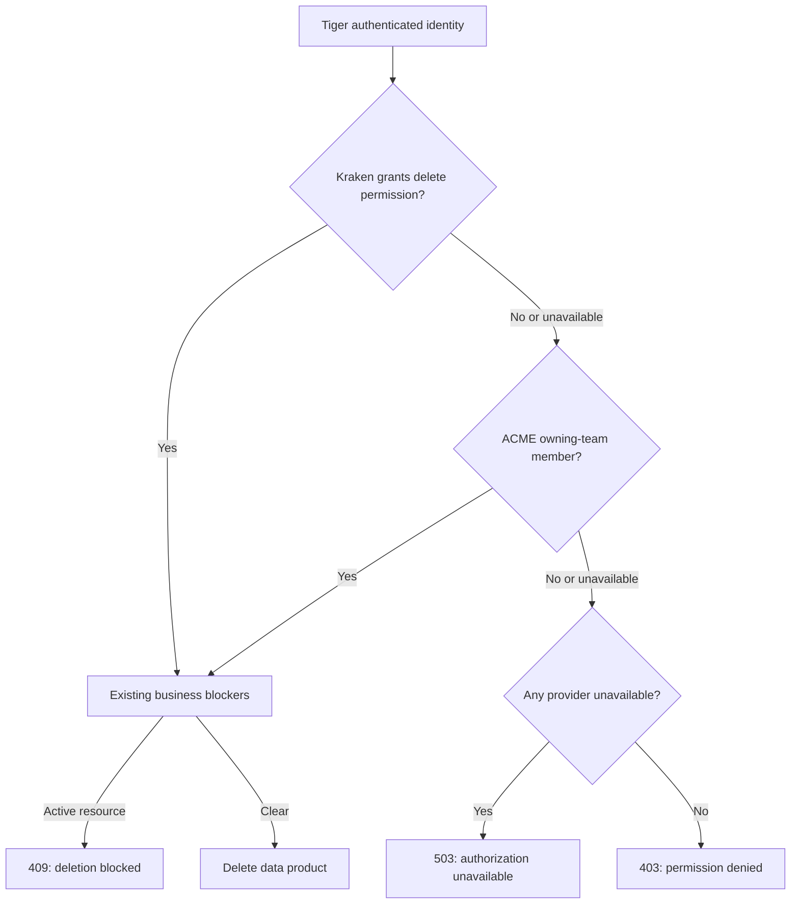

# Descripción PR — rio-playmaker

Repo `melisource/fury_rio-playmaker` · branch `feature/sig-600-delete-auth@37dc1f2d3` · base `develop@0c9e9e3ee` · 2 commits sobre la base · 17 archivos, +458/−29 · SPECs [SIG-600](https://spellbook.adminml.com/projects/SIG/specs/SIG-600) y [SIG-643](https://spellbook.adminml.com/projects/SIG/specs/SIG-643) · suite 2026-09-30: 4.093 tests, 0 fallas, 0 errores, 2 skips; 11 selectores focalizados exitosos.

> [!warning] Brecha de validación LOCAL_STACK
> **La cadena histórica de migraciones de develop falla en MySQL** al intentar borrar component_type mientras chk_deployment_freeze_reach todavía lo referencia. Recursos del run local eliminados y teardown verificado. El runner no llegó al check posterior de deployment-loopback.

> [!info] Dependencias para desplegar con providers reales
> Habilitar tráfico Fury a Kraken y validar application/permission en el scope objetivo. BFF/UI siguen pendientes para el acceso Kraken-only a través del front. Las tres versiones mock de test3 ejercitan la regla OR y el blocker existente con respuestas sintéticas.

## Propósito

Conservar en el proyecto el texto publicable del PR #1228 y su evidencia, aplicando el template del repo y la skill human-first-technical-writing.

## Contenido

Descripción del alcance, regla de autorización, evidencia del HEAD actualizado y tabla con las tres versiones mock y capturas aportadas por el usuario. Los checkboxes del reviewer se preservan pendientes.

---

## Description

feat(data-products): authorize deletion with Kraken or ACME

Playmaker now enforces the Data Product delete permission model described in SIG-600: an authenticated user can delete when **Kraken grants `delete-data-products` on `signals-rio` OR ACME reports membership in the owning team**. The identity comes from Tiger.

Previously, the Playmaker DELETE used the existing ACME privileged-role gate and did not consult Kraken. This change makes team membership sufficient for DELETE, including Data Products with a project, and applies the new authorization check in test scopes and to platform-team users as well.

Authorization runs **before the existing business blockers and mutations**. A user with neither permission receives `403 DP_DELETE_FORBIDDEN`, even if the Data Product has active deployments. An authorized user proceeds to the existing checks and can receive `409` for an active resource. If one provider is unavailable, the other can still allow the operation; otherwise the endpoint returns `503 DP_DELETE_AUTH_UNAVAILABLE`. Missing authentication returns `401`.

This is the Playmaker authorization delivery of [SIG-643](https://spellbook.adminml.com/projects/SIG/specs/SIG-643). SIG-600 already declares the Kraken-or-ACME permission model. Its remaining business-rule validations and the frontend/BFF handling for Kraken-only users are separate work.

Changes:

* Add the official Kraken Java SDK `5.0.0`, excluding its conflicting `slf4j-simple` binding. Production uses `signals-rio`; test profiles use `test-rio-kraken` in the sandbox scope.
* Apply the OR policy in `DataProductServiceImpl.delete` through `DataProductDeleteAuthorizer`, before blockers and persistence.
* Cover provider denials, failures, team membership without a privileged project role, and authorization before deletion; update the testing impact/scenario catalog.
* Synchronize with `develop` and make the existing deletion timestamp test assert that `deletedAt` falls within the actual execution interval, avoiding failures when the clock crosses a second.

**Deployment setup:** the real Kraken lookup requires Fury traffic authorization for `rio-playmaker` through `kraken_for_applications_external-kraken-all` and the correct Kraken application/permission in the target scope. The mock versions below let reviewers validate the OR rule independently of real grants and connectivity.

## Dev checklist (should be completed by the developer assigned to the issue)

* [ ] I have met the definition of done — This PR delivers authorization; the broader SIG-600 blockers and frontend/BFF changes remain outside its scope.
* [x] I have used [conventional commits](https://www.conventionalcommits.org/en/v1.0.0/)
* [x] My code follows the style guidelines of this project
    * [Java Fury Guideline](https://furydocs.io/code-quality/latest/guide/#/languages/java)
    * [Deep Source Java Guideline](https://deepsource.com/blog/java-code-review-guidelines#10-override-hashcode-when-overriding-equals)
* [x] I have performed a self-review of my own code
* [x] I have commented portions of my code, particularly in hard-to-understand areas
* [x] I updated the applicable canonical documentation (`testing-scenarios.md`); the API route did not change.
* [x] After my changes were applied the app is still buildable
* [ ] My changes generate no new warnings (linters, code quality) — GitHub quality checks passed; Gradle/JDK deprecation warnings remain.
* [x] I have added tests that prove my fix is effective or that my feature works
    * Unit testing is a must
    * Integration testing is recommended
* [x] New and existing unit tests pass locally with my changes
* [ ] Any dependent changes have been merged and published in downstream modules — frontend/BFF pending.
* [x] I have updated my current branch with changes made in develop previously
* [ ] I already deployed this branch in the pre-production environment — manual UI evidence below uses the mock TEST3 snapshots; the synchronized PR HEAD has not been deployed by the agent.

## Code Review checklist (must be completed by the code reviewer)

* [ ] Is it the issue being completed?
  * Is the Acceptance criteria met?
  * Is the issue ready, according to the project’s Definition Of Done?
* [ ] Is the code good in style? (Easy to read, follows good practices and our style guide)
  * Are linters used?
  * Is it clear what a given class/method/function does?
  * Do names reflect what code does?
  * Are functions elegant?
* [ ] The code runs correctly? (Optional)
  * Have you tried the code locally?
  * Are exceptions handled correctly?
  * Are all corner cases handled correctly?
  * Check Java gotchas.
  * Edge cases for ifs, fors, whiles, dates
  * Are there unnecessary while loops?
* [ ] Is this a good enough implementation?
  * Is every line of code used?
  * Does code have unexpected side effects?
  * Check usage of third party libraries (production-ready, copyright, etc.)
  * Is the solution performant?
  * Could the solution be simpler?
  * Look for vulnerabilities ([OWASP](https://owasp.org/www-project-top-ten/) top 10)
  * Is the code properly modularized and [S.O.L.I.D.](https://www.freecodecamp.org/news/solid-principles-explained-in-plain-english/)?
  * Is the code properly tested?
  * Do we have some duplicated code?
  * What is missing (docs, comments, metrics, logs, etc.)?
  * Is there a pre-existing code that already solves our problem?

## How Has This Been Tested?

### Automated evidence for the current PR

HEAD: `37dc1f2d3aaa17e612271126013dbac14fd41bfa`. Base: `develop@0c9e9e3ee0415b97f20d74c327c306a2018b6437`. Validation date: 2026-09-30.

| Environment / layer | Command | Result |
|---|---|---|
| L0 / FULL_REGRESSION + COVERAGE | `./gradlew test jacocoTestReport` | **4,093 tests, 0 failures, 0 errors, 2 pre-existing skips** |
| L0 / UNIT + H2_INTEGRATION + CONTRACT | `./scripts/run-agentic-testing-contract.sh` | All **11 focused selectors passed**; LOCAL_STACK result described below |
| L0 / repository contract | `./scripts/validate-repository-contract.sh --staged` | Passed |
| L0 / testing contract | `./scripts/validate-testing-contract.sh --staged` | Passed |
| Diff checks | `git diff --cached --check` and `git diff --check` | Passed |
| GitHub / CI + quality gates | `workflow`, `continuous-integration`, `code-coverage`, `dependencies`, `static-analyzer` | **All five passed for the current HEAD** |

Authorization tests cover Kraken-only access, ACME team membership without an Admin/Maintainer project role, both sources denying, a provider failure while the other allows, and `503` when no independent allow can be resolved. Service tests exercise the existing delete blockers and successful deletion.

**LOCAL_STACK gap:** the isolated MySQL health check failed before application startup in the existing `20260922153217845_drop_deployment_freeze_component_type.sql` migration: MySQL error `3959` because `chk_deployment_freeze_reach` still references `component_type`. The runner removed its owned container, network and volume and verified teardown. The subsequent deployment-loopback stack check was not reached. This is an upstream migration-chain issue; the unit/H2 tests and GitHub CI are separate evidence.

### Three TEST3 versions and manual UI evidence

Three temporary versions were created to test **neither source allowing, ACME only, and Kraken only**. All three Fury builds are **FINISHED**, with tests enabled. Each variant passed **4,056 local tests, 0 failures and 2 pre-existing skips**.

These snapshots derive from authorization baseline `73fabcfb9`; the authorization implementation is unchanged in the current PR after syncing `develop`. Only the test variants use deterministic provider responses in `test3`. They execute the real OR rule, retain Tiger authentication and the existing business blockers, and simulate ACME membership in the Data Product's current team without changing its DB record. The fixtures remain in their own test branches.

The following screenshots were supplied by the author after manual validation. The HTTP column states the expected backend result; the screenshots show the user-visible messages.

| Scenario / expected HTTP with an active deployment | Version to deploy in `test3` | Message shown in the UI |
|---|---|---|
| **Neither ACME nor Kraken** `403 DP_DELETE_FORBIDDEN`, before checking active resources | [0.0.5-test-sig600-denied](https://web.furycloud.io/engineering/applications/rio-playmaker/versions/detail/0.0.5-test-sig600-denied) [Test branch](https://github.com/melisource/fury_rio-playmaker/tree/feature/sig-600-delete-auth-mock-denied-test3) |  |
| **ACME only; Kraken denies** `409`, existing active-resource blocker | [0.0.3-test-sig600-acme](https://web.furycloud.io/engineering/applications/rio-playmaker/versions/detail/0.0.3-test-sig600-acme) [Test branch](https://github.com/melisource/fury_rio-playmaker/tree/feature/sig-600-delete-auth-mock-acme-test3) |  |
| **Kraken only; ACME does not grant membership** `409`, existing active-resource blocker | [0.0.4-test-sig600-kraken](https://web.furycloud.io/engineering/applications/rio-playmaker/versions/detail/0.0.4-test-sig600-kraken) [Test branch](https://github.com/melisource/fury_rio-playmaker/tree/feature/sig-600-delete-auth-mock-kraken-test3) |  |

### Reproduce each case

1. Deploy the selected version to **`test3`** using the normal authorized deployment flow.
2. Use a disposable Data Product owned by the test run, with a non-imported deployment in `deploy_requested` or `deploy_completed`, and a valid Tiger identity.
3. Call Playmaker `DELETE /data-products/{id}`. The denied version must return `403`; ACME-only and Kraken-only must reach the existing blocker and return `409`. Check that the Data Product, components and deployment remain present after each rejection.
4. Repeat on a separate disposable Data Product without blockers: the denied version must still return `403`; both allowed variants perform the real delete. Record resource IDs and clean up the test run's resources.

To isolate Playmaker's authorization, use its endpoint directly: the current BFF still has its own ACME guard and can reject before the request reaches Playmaker. The screenshots document the current UI error mapping. Real Kraken connectivity/grants and the `503` outage path need a separate deployed check with the real providers; the three fixed mocks validate the permission matrix and blocker precedence.

## Testing contract

* [x] I updated `.testing/impact.json`.
* [x] The impacted/new AT scenarios and focused tests are declared in the manifest.
* [ ] If behavior is unchanged, the manifest includes the reviewed scenarios and a concrete justification. (Not applicable: behavior changes.)
* [x] Evidence distinguishes L0 from F1 and UNIT/H2_INTEGRATION/CONTRACT/LOCAL_STACK layers.
* [x] L0 stack resources created by the failed health check were removed and teardown was verified.
* [ ] A complete F1 resource ledger and cleanup certificate are attached — manual UI screenshots were supplied by the author; these additional artifacts were not provided.

## Issue

[SIG-643](https://spellbook.adminml.com/projects/SIG/specs/SIG-643) · [SIG-600](https://spellbook.adminml.com/projects/SIG/specs/SIG-600)

---

## Notas internas — NO van al PR

- El usuario autorizó actualizar la descripción en GitHub, resolver lo necesario para dejar CI verde y pasar el PR a Ready for review. Esa instrucción explícita prevalece sobre la restricción genérica de publicación de la skill pr-description.
- Conflicto con develop resuelto únicamente en .testing/impact.json, uniendo escenarios y selectores de ambos lados. Se portó el arreglo del test de fecha ya usado en las variantes mock; no se agregó código de mocks al PR funcional.
- GenerateDocTest modifica metadata Swagger ajena a la autorización (environment/source_environment_id); se restauró el espejo canónico de develop para no incluir ese ruido.
- Las capturas son evidencia manual de UI aportada por el usuario. No prueban por sí solas el HTTP ni el acceso a Kraken real. El ledger y cleanup F1 no fueron proporcionados. El agente no ejecutó deploy ni DELETE remoto.
- SIG-600 y SIG-643 no se editaron. Siguen fuera de este PR los tres blockers nuevos, el frontend/BFF y la discrepancia de CA-1. La skill pr-description conserva el idioma inglés del template, aunque el chat y las notas internas están en español.

## Fuentes

- [PR #1228](https://github.com/melisource/fury_rio-playmaker/pull/1228)
- Template .github/pull_request_template.md, diff contra develop y tests locales del HEAD 37dc1f2d3.
- BuildApi oficial de Fury: las tres versiones mock verificadas FINISHED, con tests habilitados y commits iguales a sus refs publicadas.
