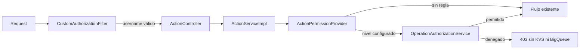

# Descripción PR — rio-playmaker — Slice 2

**PR:** [#1172](https://github.com/melisource/fury_rio-playmaker/pull/1172) · `feature/operation-authorization-by-team-f2` @ `2e1d1c8955e40766eb9e0fbb07041de607e8f14b` · base `develop@625f491d218e5aaf743404e8f15ff832bc61f850` · SPEC [[SPEC técnica — Slice 2 — Actions mutantes de Signals]].

## Description

`fix(auth): isolate additive Signals action authorization`

Este PR implementa el Slice 2 de SIG-616 sobre Slice 1. La identidad Tiger se valida una vez en la frontera HTTP y las Actions component-bound configuradas reciben una validación ACME adicional antes de cualquier side effect. No se agregan Actions, endpoints, restricciones de importación, reglas de precreation ni default-deny.

La única política nueva de este slice es `catalog-signal + start|stop -> DEV_AND_UP`. Todo par no configurado conserva el comportamiento previo.

Changes:

- Renombra el principal a `TigerUsernameAuthentication`: contiene únicamente el username validado y nunca el Bearer token.
- `ActionController` y `ActionResultController` pasan `Authentication.getName()` a `ActionService`; `ActionServiceImpl` no depende de `TigerTokenService` ni revalida Tiger.
- Elimina los overloads anteriores de `ActionService`. La interfaz es interna al módulo y todos sus consumidores productivos fueron migrados.
- Agrega `ActionAuthorizationService`, que aplica ACME antes de deployment context, KVS y BigQueue únicamente cuando existe una regla configurada.
- Introduce el puerto `ActionPermissionProvider` y el adapter `ConfiguredActionPermissionProvider`. La fuente actual es `app.action-authorization.permissions`, reemplazable por scope; Discovery puede implementar el mismo puerto sin cambiar consumidores.
- Configura exactamente `catalog-signal/start` y `catalog-signal/stop` con `DEV_AND_UP`, usando team/project persistidos.
- Imports, precreation, pares desconocidos, lecturas, polling y otras tecnologías conservan su comportamiento.

## How Has This Been Tested?

HEAD validado: `2e1d1c8955e`.

- Tests focalizados de provider, autorización, service y controllers: `BUILD SUCCESSFUL`.
- `./gradlew check`: `BUILD SUCCESSFUL`; 2 tests preexistentes skipped.
- Verificación estática: un solo método por operación en `ActionService`; todos los controllers productivos pasan username; `ActionServiceImpl` no contiene `TigerTokenService`, parsing Tiger ni reglas Signals.
- Smoke no productivo con Tiger/ACME reales: ejecutado exitosamente; la captura adjunta en el PR conserva la evidencia.

## Review

- Ale: se descartó conservar overloads de headers porque todos los consumidores internos ya migraron a username; no queda API pública que proteger.
- Feli: se renombró el principal, se sacó la matriz de `ActionServiceImpl`, se encapsuló la autorización en un servicio y se desacopló la fuente mediante `ActionPermissionProvider`.
- Los siete hilos del PR fueron respondidos y resueltos el 2026-09-21.

## Issue

- [SIG-616 — Autorización de operaciones por equipo](https://spellbook.adminml.com/projects/SIG/specs/SIG-616)
- [SIG-621 — Autorización de operaciones por equipo](https://spellbook.adminml.com/projects/SIG/specs/SIG-621)
- [SIG-623 — Slice 2: Actions mutantes de Signals](https://spellbook.adminml.com/projects/SIG/specs/SIG-623)
