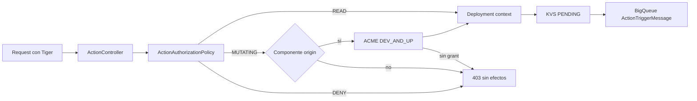

# Descripción PR — rio-playmaker — Slice 5

**Identidad:** `rio-playmaker` · `feature/operation-authorization-by-team-f5` @ `d721b908e2632c035c5a46bce99806f727d28601` · base `feature/operation-authorization-by-team-f4` @ `0f37f7b299fdfcca538d35d5a181ce8e65c652e3` · 1 commit · 10 archivos, +557/−50 · SPEC [[SPEC técnica — Slice 5 — Actions restantes]].

## Description

feat(auth): complete action authorization allow-list

Este PR completa el Slice 5 de SIG-616. Playmaker aplica una allow-list server-side, cerrada y exacta, para Actions de componentes: las mutaciones declaradas requieren Tiger, componente origin y `DEV_AND_UP`; las lecturas declaradas permanecen Tiger-only. Los pares desconocidos se rechazan antes de resolver deployment context, escribir KVS o publicar a BigQueue.

El cambio es autocontenido en Playmaker. No modifica contratos de eventos, DTOs, KVS, productores ni Control Planes.

Changes:

* Agrega `ActionAuthorizationPolicy` con los 21 pares `componentType + actionName` de la SPEC; la comparación es case-sensitive y no normaliza entradas.
* Extiende el guard de Actions component-bound: las mutaciones verifican importación y luego autorizan el grant owner-project ACME `DEV_AND_UP`; las lecturas no consultan ACME ni import authorization.
* Cierra precreation: permite sólo reads allow-listed y rechaza mutaciones o pares desconocidos antes de KVS y BigQueue.
* Mantiene `POST /services/{serviceId}/actions/peek` como read Tiger-only bajo Spring Security.
* Agrega cobertura parametrizada de la matriz, flujos mutantes/read, importados, precreation, side effects y contratos HTTP; documenta inventario nominal, smoke y límites de rollout en `docs/sig-616-slice-5-verification.md`.

## Dev checklist (should be completed by the developer assigned to the issue)

* [ ] I have met the definition of done — faltan inventario vivo y smoke no productivo con Tiger/ACME.
* [x] I have used [conventional commits](https://www.conventionalcommits.org/en/v1.0.0/)
* [x] My code follows the style guidelines of this project
    * [Java Fury Guideline](https://furydocs.io/code-quality/latest/guide/#/languages/java)
    * [Deep Source Java Guideline](https://deepsource.com/blog/java-code-review-guidelines#10-override-hashcode-when-overriding-equals)
* [x] I have performed a self-review of my own code
* [x] I have commented portions of my code, particularly in hard-to-understand areas
* [x] I have made corresponding changes to the documentation (`README.md`, `DEV.md`, `CHANGELOG.md`) — la evidencia operacional vive en `docs/sig-616-slice-5-verification.md`; no cambia documentación de usuario.
* [x] After my changes were applied the app is still buildable
* [x] My changes generate no new warnings (linters, code quality)
* [x] I have added tests that prove my fix is effective or that my feature works
    * [x] Unit testing is a must
    * [x] Integration testing is recommended
* [x] New and existing unit tests pass locally with my changes
* [ ] Any dependent changes have been merged and published in downstream modules — no hay cambio downstream requerido; la matriz se conserva como está definida por la SPEC y la compatibilidad operativa se valida en el inventario/smoke pendiente.
* [x] I have updated my current branch with changes made in develop/master previously — la base es F4 aprobada (`0f37f7b299fdfcca538d35d5a181ce8e65c652e3`).
* [ ] I already deployed this branch in the pre-production environment

## Code Review checklist (must be completed by the code reviewer)

* [ ] Is it the issue being completed?
  * Is the Acceptance criteria met?
  * Is the issue ready, according to the project’s Definition Of Done?
* [ ] Is the code good in style? (Easy to read, follows good practices and our style guide)
* [ ] The code runs correctly? (Optional)
* [ ] Is this a good enough implementation?

## How Has This Been Tested?

* `./gradlew test --tests 'com.mercadolibre.rio.playmaker.service.ActionAuthorizationPolicyTest' --tests 'com.mercadolibre.rio.playmaker.service.impl.ActionServiceImplTest' --tests 'com.mercadolibre.rio.playmaker.controller.ServiceActionsControllerTest' --tests 'com.mercadolibre.rio.playmaker.integration.ActionPreCreationIntegrationTest' --tests 'com.mercadolibre.rio.playmaker.integration.ServiceActionsControllerIntegrationTest'` — pasó localmente.
* Suite completa reportada para el commit: 4.018 tests, 0 fallos, 2 skips preexistentes; `./gradlew check`, `./gradlew build`, `./gradlew jacocoTestCoverageVerification` y `./gradlew test jacocoTestReport` exitosos.
* Coverage de código modificado: `ActionAuthorizationPolicy` 100% líneas/branches, `ActionServiceImpl` 96,53% líneas y 100% branches, `ServiceActionsController` 100% líneas/branches.
* El smoke no productivo no fue ejecutado por falta de credenciales/acceso. Debe verificar una mutación autorizada y denegada, un importado, una read ClickHouse y Kafka peek antes de rollout.

## Issue

* [SIG-616 — Autorización de operaciones por equipo](https://spellbook.adminml.com/projects/SIG/specs/SIG-616)
* [SIG-621 — Autorización de operaciones por equipo](https://spellbook.adminml.com/projects/SIG/specs/SIG-621)
