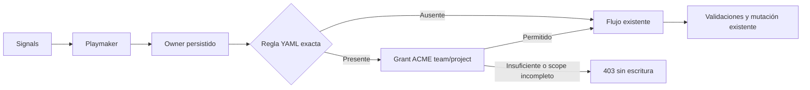

# Descripción PR — rio-playmaker — Slice 5

**Identidad:** `melisource/fury_rio-playmaker` · branch `feature/operation-authorization-by-team-f5@85a0c3bfc` · base `feature/operation-authorization-by-team-f4@40d5f9b22` · [PR #1182](https://github.com/melisource/fury_rio-playmaker/pull/1182) · SPEC [[SPEC técnica — Slice 5 — Actions restantes]].

## Propósito

Mantener la descripción publicada del PR de F5 y su evidencia local junto al proyecto SIG-616. El cierre de mutaciones solicitado por el owner está descrito en el addendum de la SPEC técnica.

---

## Description

fix(auth): guard remaining Signals mutations by configured owner permissions

Fase 5 cierra las mutaciones de Data Products, componentes y pipelines usadas por el frontend de Signals (`origin/develop@9bf76ffc`). El viewer podía editar metadata y configuración porque esos flujos dependían de checks legacy que no evaluaban el nivel del `OwnerProjectGrant` o se omitían en test scopes. Ahora una operación declarada en YAML valida el rol ACME del owner antes de persistir o despachar. Se mantienen los casos de uso y endpoints existentes.

Changes:

* Agrega reglas exactas en `app.action-authorization` para crear/editar/cambiar estado de Data Product, PATCH de config/rename de pipeline, CRUD/activación de definiciones y request/resolve de import authorizations. Los permisos de componentes, relaciones, topología, deploy y Actions existentes siguen configurados en el mismo YAML.
* Las familias abstractas `flink-job` y `flink-sql` conservan miembros AWS/GCP explícitos en YAML. Retirar una regla familiar desactiva su guard para todos los miembros.
* Exige team/project del owner persistido para toda regla configurada. Un owner incompleto o un viewer recibe 403; la pertenencia a platform team no sustituye el grant del owner en el cascade delete. Una operación sin regla exacta conserva su flujo previo. Los checks legacy siguen vigentes, por lo que algunas operaciones de Data Product pueden exigir un rol más alto en producción.
* Añade pruebas de denegación antes de efectos y una integración HTTP con provider YAML y ACME reales (grants simulados), más la matriz de rutas auditadas en `docs/sig-616-slice-5-verification.md` y escenarios AT.

La auditoría distingue las rutas de Entities (Rio Entity Service), favoritos personales, freezes con checks propios y POST de lookup/peek que no mutan el agregado. `POST /v2/services/:id/actions/code` no se invoca desde la UI actual; precreation con `serviceId=0` no tiene owner persistido y sigue fuera del guard de Actions de la SPEC.

## Dev checklist (should be completed by the developer assigned to the issue)

* [ ] I have met the definition of done — falta smoke F1 y aprobación humana.
* [x] I have used [conventional commits](https://www.conventionalcommits.org/en/v1.0.0/)
* [x] My code follows the style guidelines of this project
    * [Java Fury Guideline](https://furydocs.io/code-quality/latest/guide/#/languages/java)
    * [Deep Source Java Guideline](https://deepsource.com/blog/java-code-review-guidelines#10-override-hashcode-when-overriding-equals)
* [x] I have performed a self-review of my own code
* [x] I have commented portions of my code, particularly in hard-to-understand areas
* [x] I updated the applicable canonical documentation (`docs/architecture.md`, `testing-scenarios.md` y documento de verificación). El Swagger generado no cambió; el 403 usa el handler existente.
* [x] After my changes were applied the app is still buildable
* [x] My changes generate no new warnings — formatter y Checkstyle pasan; PMD reporta 30 advertencias existentes frente a 34 en el HEAD anterior.
* [x] I have added tests that prove my fix is effective or that my feature works
    * Unit testing is a must
    * Integration testing is recommended
* [x] New and existing unit tests pass locally with my changes
* [ ] Any dependent changes have been merged and published in downstream modules — F4 sigue abierto como base de este PR.
* [x] I have updated my current branch with changes made in develop/master previously — incorpora F4 `40d5f9b22` mediante merge commit.
* [ ] I already deployed this branch in the pre-production environment

## Code Review checklist (must be completed by the code reviewer)

* [ ] Is it the issue being completed?
  * Is the Acceptance criteria met?
  * Is the issue ready, according to the project’s Definition Of Done?

* [ ] Is the code good in style? (Easy to read, follows good practices and our style guide)
  * Are linters used?
  * Is it clear what a given class/method/function does?
  * Do names reflect what code does?
  * Are functions elegant?

* [ ] The code runs correctly? (Optional)
  * Have you tried the code locally?
  * Are exceptions handled correctly?
  * Are all corner cases handled correctly?
  * Check Java gotchas.
  * Edge cases for ifs, fors, whiles, dates
  * Are there unnecessary while loops?

* [ ] Is this a good enough implementation?
  * Is every line of code used?
  * Does code have unexpected [side effects](https://medium.com/@ryk.kiel/dont-let-your-code-get-out-of-control-avoiding-side-effects-in-python-d68faf26912)?
  * Check usage of third party libraries (production-ready, copyright, etc.)
  * Is the solution performant? (and avoid early optimization since it is the root of all evil)
  * Could the solution be simpler?
  * Look for vulnerabilities ([OWASP](https://owasp.org/www-project-top-ten/) top 10)
  * Is the code properly modularized and [S.O.L.I.D.](https://www.freecodecamp.org/news/solid-principles-explained-in-plain-english/)?
  * Is the code properly tested?
  * Do we have some duplicated code?
  * What is missing (docs, comments, metrics, logs, etc.)?
  * Is there a pre-existing code that already solves our problem?

## How Has This Been Tested?

HEAD: `85a0c3bfc` · merge de F4: `40d5f9b22`.

* El merge publicado integra los comentarios aplicados a F4 sobre relaciones same-DP y cascade sin equipo; se conservaron las reglas F5 existentes y se combinaron las matrices YAML de permisos.
* La verificación local del merge fue estructural (`git merge-tree`, diffs y checks de whitespace/conflictos); no se ejecutaron pruebas localmente. La CI #5498 de PR #1182 terminó con sus cinco checks en `SUCCESS`.

Evidencia local heredada del HEAD anterior `141eacbc5` (previa al merge F4→F5):

* L0/UNIT + H2_INTEGRATION + CONTRACT: `./scripts/run-agentic-testing-contract.sh` pasó 31 selectores focalizados. `./scripts/validate-testing-contract.sh --staged`, `./scripts/validate-repository-contract.sh --staged` y `git diff --cached --check` pasaron.
* L0/LOCAL_STACK: `AT-000-S01` y `AT-180-S18` pasaron con MySQL aislado; el runner eliminó contenedores, redes y volúmenes propios.
* L0/FULL_REGRESSION: `./gradlew test --rerun-tasks --no-daemon` pasó con 4.107 tests, 0 fallas, 0 errores y 2 skips preexistentes.
* Formato/estático: `pretty-format-java` y `checkstyle` pasaron. PMD mantiene 30 advertencias previas (34 en baseline), sin reglas nuevas detectadas.
* CI del HEAD anterior: `continuous-integration`, `code-coverage`, `dependencies`, `static-analyzer` y `workflow` terminaron en `pass` ([build #5492](https://rp-ci-java.furycloud.io/blue/organizations/jenkins/rio-playmaker/detail/rio-playmaker/5492/pipeline/)).
* CI del merge F4→F5 publicado: los cinco checks de PR #1182 terminaron `SUCCESS` en el build #5498.
* F1/SMOKE: pendiente. Prueba sugerida en `test3` con un Data Product propio de `ml-ads-signals/authorization-smoke-test`: con la versión viewer, editar descripción/visibilidad, config y componente debe retornar 403 sin cambios persistidos; con committer, las operaciones `DEV_AND_UP` deben continuar. Validar delete por separado con rol `DEPLOYER_AND_UP`. Requiere aprobación del scope y dataset antes de desplegar.

### Versiones de prueba

* [`0.1.21-p5-committer-allowed`](https://web.furycloud.io/rio-playmaker/versions/detail/0.1.21-p5-committer-allowed), rama `feature/sig-616-auth-p5-committer-test3-v25@edff29c26`; build #1740.
* [`0.1.22-p5-viewer-denied`](https://web.furycloud.io/rio-playmaker/versions/detail/0.1.22-p5-viewer-denied), rama `feature/sig-616-auth-p5-viewer-test3-v26@4f1e29e6`; build #1741.
* [`0.1.23-p5-deployer-allowed`](https://web.furycloud.io/rio-playmaker/versions/detail/0.1.23-p5-deployer-allowed), rama `feature/sig-616-auth-p5-deployer-test3-v27@d5ef6d48c`; build #1743 (`FINISHED`). Mock pensado para verificar inactivación/undeploy con `DEPLOYER_AND_UP`.

Las ramas incorporan F5 `85a0c3bfc` y activan el mock ACME sólo con profile `test3`; committer/viewer preservan sus escenarios y deployer permite además probar inactivación. Los builds #1740/#1741/#1743 terminaron `FINISHED`. Son artefactos de prueba; no se desplegaron.

## Testing contract

* [x] I added or updated `.testing/impact.json`, or this PR does not change an observable-behavior surface.
* [x] The impacted/new AT scenarios and focused tests are declared in the manifest.
* [ ] If behavior is unchanged, the manifest includes the reviewed scenarios and a concrete justification — no aplica: hay guards nuevos configurados.
* [x] Evidence distinguishes environment (`L0`, `L1`, `F1`) from layer (`UNIT`, `H2_INTEGRATION`, `CONTRACT`, `LOCAL_STACK`, `ECOSYSTEM_STACK`, `SMOKE`).
* [x] Any mutable run published cleanup evidence; blocked L1/F1 capabilities are declared rather than replaced with L0 evidence — checks L0 limpiaron recursos propios; F1 sigue pendiente.

## Issue

* [SIG-616 — Autorización de operaciones por equipo](https://spellbook.adminml.com/projects/SIG/specs/SIG-616)
* [SIG-621 — Autorización de operaciones por equipo](https://spellbook.adminml.com/projects/SIG/specs/SIG-621)
