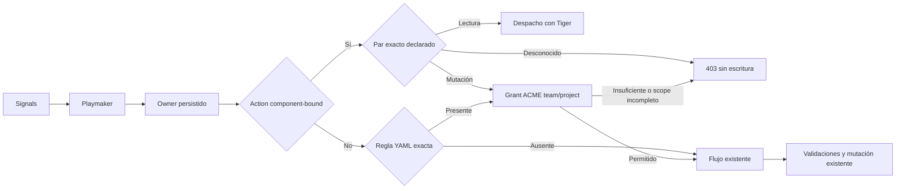

# Descripción PR — rio-playmaker — Slice 5

**Identidad:** `melisource/fury_rio-playmaker` · branch `feature/operation-authorization-by-team-f5@8be97883` · base `feature/operation-authorization-by-team-f4@40d5f9b22` · [PR #1182](https://github.com/melisource/fury_rio-playmaker/pull/1182) · SPEC [[SPEC técnica — Slice 5 — Actions restantes]].

## Propósito

Mantener la descripción publicada del PR de F5 y su evidencia local junto al proyecto SIG-616. El cierre de mutaciones solicitado por el owner está descrito en el addendum de la SPEC técnica.

---

## Description

fix(auth): cerrar autorización de mutaciones y Actions de Signals

Fase 5 cierra las mutaciones de Data Products, componentes y pipelines usadas por el frontend de Signals (`origin/develop@9bf76ffc`). Las operaciones configuradas validan el rol ACME del owner persistido antes de persistir o despachar. Las Actions component-bound se clasifican por par exacto `component_type + actionName`: mutaciones declaradas exigen ACME, lecturas declaradas conservan Tiger y pares desconocidos reciben 403 antes de KVS o BigQueue. Se mantienen los casos de uso y endpoints existentes.

Changes:

* Agrega reglas exactas en `app.action-authorization` para crear/editar/cambiar estado de Data Product, PATCH de config/rename de pipeline, CRUD/activación de definiciones y request/resolve de import authorizations. Los permisos de componentes, relaciones, topología, deploy y Actions existentes siguen configurados en el mismo YAML.
* Las familias abstractas `flink-job` y `flink-sql` conservan miembros AWS/GCP explícitos en YAML. Si se retira una regla mutante, esa Action pasa a ser desconocida y se deniega.
* Exige team/project del owner persistido para toda regla configurada. Un owner incompleto o un viewer recibe 403; la pertenencia a platform team no sustituye el grant del owner en el cascade delete. Las operaciones que no son Actions conservan su flujo previo cuando no tienen regla. Los checks legacy siguen vigentes.
* Declara las lecturas permitidas por par exacto, incluido `clickhouse-mergetree + get-schemas` para precreation. Precreation sólo permite lecturas declaradas; `ping` y otros pares desconocidos se deniegan.
* Serializa la autorización de Actions con transferencias de owner mediante el lock del Data Product; el dispatch autoriza contra el owner leído con lock antes de escribir en KVS o publicar.
* Añade pruebas de denegación antes de efectos, una integración HTTP con provider YAML y ACME reales (grants simulados), una prueba concurrente H2 del lock, la matriz de rutas auditadas en `docs/sig-616-slice-5-verification.md` y escenarios AT.

```mermaid
flowchart LR
  UI[Signals] --> API[Playmaker]
  API --> Owner[Owner persistido]
  Owner --> Kind{Action component-bound}
  Kind -->|Sí| Pair{Par exacto declarado}
  Pair -->|Lectura| Tiger[Despacho con Tiger]
  Pair -->|Desconocido| Deny[403 sin escritura]
  Pair -->|Mutación| ACME[Grant ACME team/project]
  Kind -->|No| Rule{Regla YAML exacta}
  Rule -->|Ausente| Legacy[Flujo existente]
  Rule -->|Presente| ACME
  ACME -->|Insuficiente o scope incompleto| Deny[403 sin escritura]
  ACME -->|Permitido| Legacy
  Legacy --> Write[Validaciones y mutación existente]
```

La auditoría distingue las rutas de Entities (Rio Entity Service), favoritos personales y freezes con checks propios. Las lecturas `peek` y `execute-query` sólo se permiten en los pares declarados por la SPEC. `POST /v2/services/:id/actions/code` no se invoca desde la UI actual; precreation con `serviceId=0` carece de componente de origen persistido y sólo admite lecturas declaradas.

## Dev checklist (should be completed by the developer assigned to the issue)

* [ ] I have met the definition of done — falta smoke F1 y aprobación humana.
* [x] I have used [conventional commits](https://www.conventionalcommits.org/en/v1.0.0/)
* [x] My code follows the style guidelines of this project
    * [Java Fury Guideline](https://furydocs.io/code-quality/latest/guide/#/languages/java)
    * [Deep Source Java Guideline](https://deepsource.com/blog/java-code-review-guidelines#10-override-hashcode-when-overriding-equals)
* [x] I have performed a self-review of my own code
* [x] I have commented portions of my code, particularly in hard-to-understand areas
* [x] I updated the applicable canonical documentation (`docs/architecture.md`, `testing-scenarios.md` y documento de verificación). El Swagger generado no cambió; el 403 usa el handler existente.
* [x] After my changes were applied the app is still buildable
* [ ] My changes generate no new warnings — `static-analyzer` pasó; no se comparó el conteo de advertencias con la base.
* [x] I have added tests that prove my fix is effective or that my feature works
    * Unit testing is a must
    * Integration testing is recommended
* [x] New and existing unit tests pass locally with my changes
* [ ] Any dependent changes have been merged and published in downstream modules — F4 sigue abierto como base de este PR.
* [x] I have updated my current branch with changes made in develop/master previously — incorpora F4 `e75ca90d9`, que incluye el merge de develop.
* [ ] I already deployed this branch in the pre-production environment

## Code Review checklist (must be completed by the code reviewer)

* [ ] Is it the issue being completed?
  * Is the Acceptance criteria met?
  * Is the issue ready, according to the project’s Definition Of Done?

* [ ] Is the code good in style? (Easy to read, follows good practices and our style guide)
  * Are linters used?
  * Is it clear what a given class/method/function does?
  * Do names reflect what code does?
  * Are functions elegant?

* [ ] The code runs correctly? (Optional)
  * Have you tried the code locally?
  * Are exceptions handled correctly?
  * Are all corner cases handled correctly?
  * Check Java gotchas.
  * Edge cases for ifs, fors, whiles, dates
  * Are there unnecessary while loops?

* [ ] Is this a good enough implementation?
  * Is every line of code used?
  * Does code have unexpected [side effects](https://medium.com/@ryk.kiel/dont-let-your-code-get-out-of-control-avoiding-side-effects-in-python-d68faf26912)?
  * Check usage of third party libraries (production-ready, copyright, etc.)
  * Is the solution performant? (and avoid early optimization since it is the root of all evil)
  * Could the solution be simpler?
  * Look for vulnerabilities ([OWASP](https://owasp.org/www-project-top-ten/) top 10)
  * Is the code properly modularized and [S.O.L.I.D.](https://www.freecodecamp.org/news/solid-principles-explained-in-plain-english/)?
  * Is the code properly tested?
  * Do we have some duplicated code?
  * What is missing (docs, comments, metrics, logs, etc.)?
  * Is there a pre-existing code that already solves our problem?

## How Has This Been Tested?

HEAD: `8be97883` · base F4: `40d5f9b22`.

* L0/UNIT + H2_INTEGRATION + CONTRACT: `./scripts/run-agentic-testing-contract.sh` pasó 38 selectores focalizados, incluida la contención real entre dos transacciones H2. `./scripts/validate-testing-contract.sh --staged`, `./scripts/validate-repository-contract.sh --staged` y `git diff --cached --check` pasaron.
* L0/LOCAL_STACK: `AT-000-S01` y `AT-180-S18` pasaron con MySQL aislado; el runner eliminó contenedores, redes y volúmenes propios.
* L0/FULL_REGRESSION + COVERAGE: `./gradlew test jacocoTestReport` pasó con 0 fallas y 2 skips preexistentes; JaCoCo cubrió 335/337 líneas ejecutables cambiadas frente a `develop` (99,41%).
* Formato/estático local: `git diff --cached --check` y contrato del repositorio pasaron; revisión estática de CI pendiente.
* CI del HEAD: build [#5565](https://rp-ci-java.furycloud.io/blue/organizations/jenkins/rio-playmaker/detail/rio-playmaker/5565/pipeline/) terminó con `continuous-integration`, `dependencies`, `static-analyzer`, `code-coverage` y `workflow` en `SUCCESS`. Fury reportó **98,00% de cobertura del PR** ([detalle](https://web.furycloud.io/rio-playmaker/code-coverage/pr-coverage/1235a2f5-dfac-4171-9350-113a995bf5cb)).
* F1/SMOKE: pendiente. Prueba sugerida en `test3` con un Data Product propio de `ml-ads-signals/authorization-smoke-test`: con la versión viewer, editar descripción/visibilidad, config y componente debe retornar 403 sin cambios persistidos; con committer, las operaciones `DEV_AND_UP` deben continuar. Validar delete por separado con rol `DEPLOYER_AND_UP`. Requiere aprobación del scope y dataset antes de desplegar.

### Versiones de prueba

* [`0.1.21-p5-committer-allowed`](https://web.furycloud.io/rio-playmaker/versions/detail/0.1.21-p5-committer-allowed), rama `feature/sig-616-auth-p5-committer-test3-v25@edff29c26`.
* [`0.1.22-p5-viewer-denied`](https://web.furycloud.io/rio-playmaker/versions/detail/0.1.22-p5-viewer-denied), rama `feature/sig-616-auth-p5-viewer-test3-v26@4f1e29e6`.
* [`0.1.23-p5-deployer-allowed`](https://web.furycloud.io/rio-playmaker/versions/detail/0.1.23-p5-deployer-allowed), rama `feature/sig-616-auth-p5-deployer-test3-v27@d5ef6d48c`.

Estas ramas de prueba son snapshots anteriores al HEAD `8be97883`; activan el mock ACME sólo con profile `test3` y sus builds Fury terminaron `FINISHED`. No se desplegaron. El smoke F1 de este HEAD requiere una nueva versión de prueba y aprobación del scope.

## Testing contract

* [x] I added or updated `.testing/impact.json`, or this PR does not change an observable-behavior surface.
* [x] The impacted/new AT scenarios and focused tests are declared in the manifest.
* [ ] If behavior is unchanged, the manifest includes the reviewed scenarios and a concrete justification — no aplica: hay guards nuevos configurados.
* [x] Evidence distinguishes environment (`L0`, `L1`, `F1`) from layer (`UNIT`, `H2_INTEGRATION`, `CONTRACT`, `LOCAL_STACK`, `ECOSYSTEM_STACK`, `SMOKE`).
* [x] Any mutable run published cleanup evidence; blocked L1/F1 capabilities are declared rather than replaced with L0 evidence — checks L0 limpiaron recursos propios; F1 sigue pendiente.

## Issue

* [SIG-616 — Autorización de operaciones por equipo](https://spellbook.adminml.com/projects/SIG/specs/SIG-616)
* [SIG-621 — Autorización de operaciones por equipo](https://spellbook.adminml.com/projects/SIG/specs/SIG-621)
