# Diagrama visual — Entidades y persistencia de Echo Forge

## Propósito

- Representación visual de referencia de las entidades de Echo Forge, sus relaciones y cómo se persisten a medida que el pipeline madura (control plane / result plane / artifacts).

## Contenido

Te dejo una versión **bien visual** de cómo yo veo las entidades, cómo se relacionan y cómo se van guardando a medida que el pipeline madura.

La idea base hoy es esta:

- **PostgreSQL** = control plane: identidad, lifecycle, decisiones, estado operacional.
    
- **MongoDB** = result plane: métricas, evidencia, comparaciones y resultados versionados.
    
- **MinIO** = artifacts raw/binarios, **sin cambiar la estructura actual**.
    
- **MT5** es el **primer vertical slice** que valida esta arquitectura, pero sigue siendo un proyecto funcional separado.
    

---

## 1) Vista general: quién guarda qué

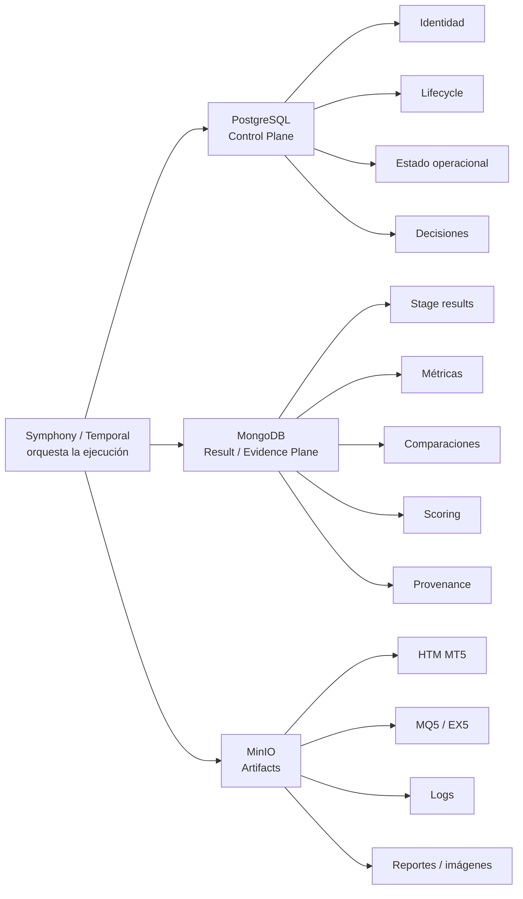

---

## 2) Entidades conceptuales: cómo se separa el dominio

El principio clave del proyecto es separar:

```text
IDENTIDAD ≠ EJECUCIÓN ≠ RESULTADO ≠ ARTEFACTO ≠ DECISIÓN
```

Eso está explicitado en el documento de arquitectura.

Visualmente:

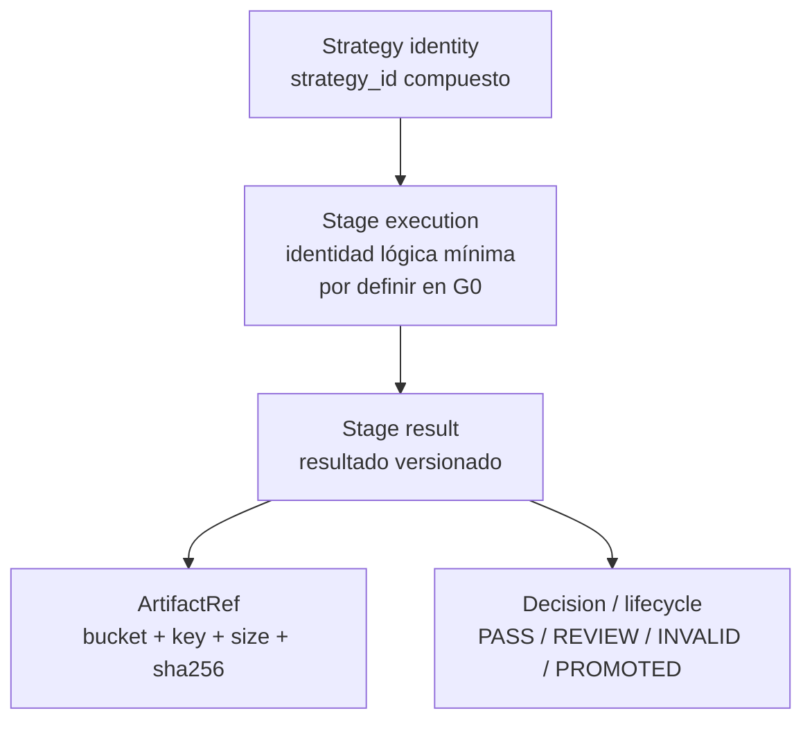

---

## 3) Lo que existe seguro hoy vs lo que sigue siendo hipótesis

### Confirmado hoy

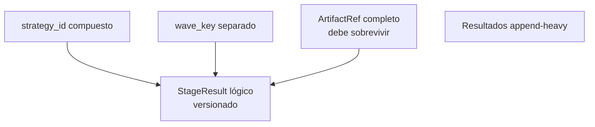

- `strategy_id` es compuesto y **no hay que redefinirlo como `wave_key + strategy_id`**.
    
- Los resultados deben ser **append-heavy**, no overwrite silencioso.
    
- El `ArtifactRef` debe conservar bucket/key/size/sha256.
    

### Todavía en hipótesis / gate G0

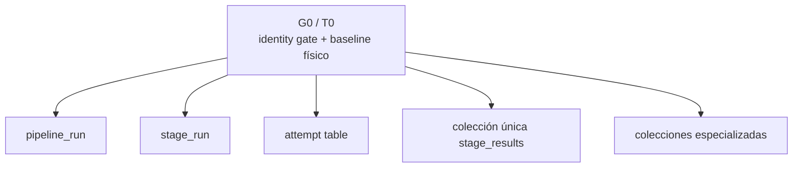

## Eso está declarado tal cual: **no ejecutar literalmente antes de G0** y no inventar IDs nuevos sin demostrar qué identidad representan.

## 4) Entidad mínima recomendada para pensar el pipeline

Aunque algunos nombres sigan abiertos, la película conceptual hoy es esta:

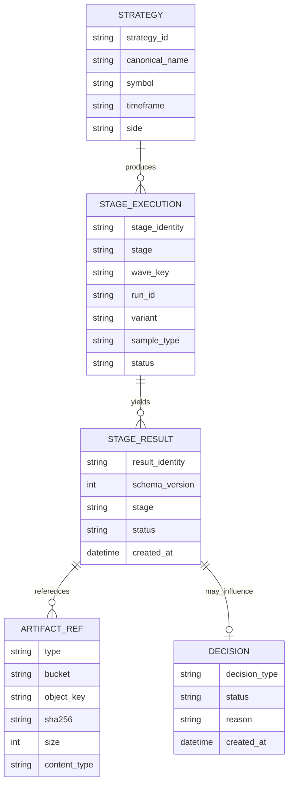

---

## 5) Cómo se guarda hoy y cómo debería evolucionar

### Etapa inicial / legacy incómodo

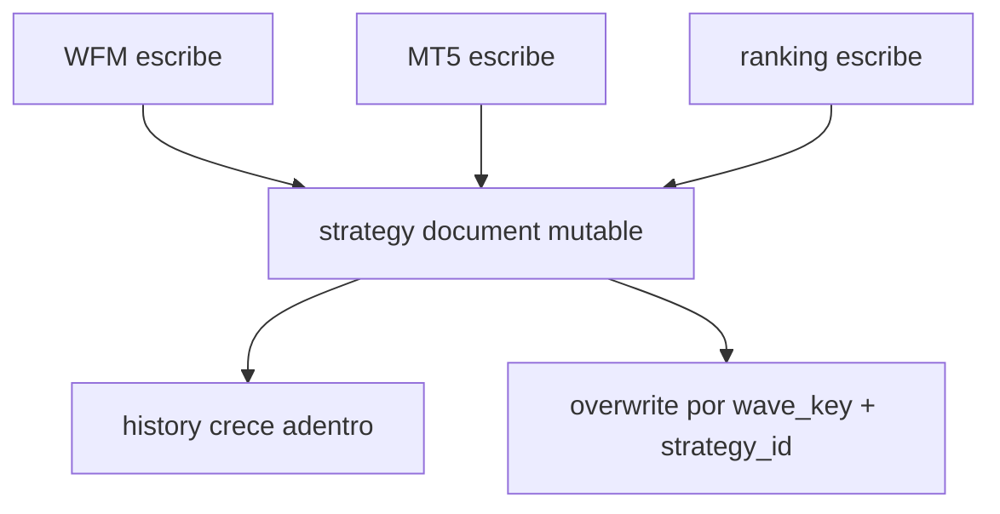

Problemas detectados:

- overwrite de historia;
    
- múltiples writers sobre el mismo documento;
    
- arrays que crecen;
    
- confusión entre identidad y ejecución.
    

---

### Modelo objetivo incremental

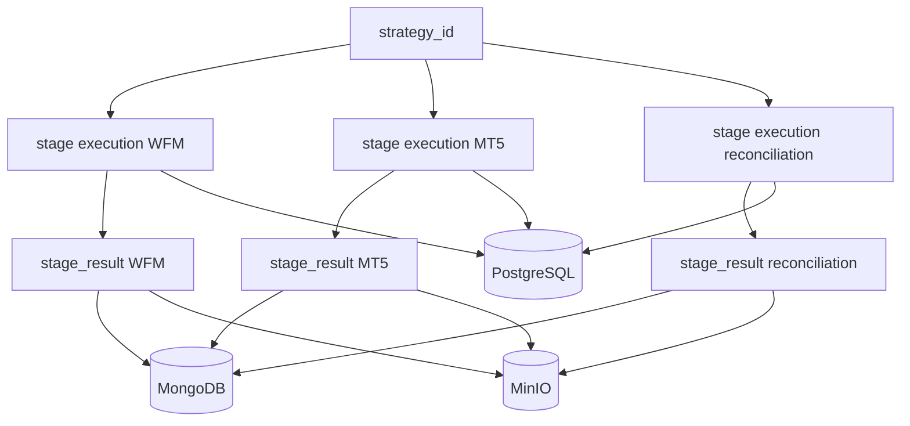

---

## 6) Evolución temporal: cómo crece la historia

Esta es probablemente la parte más importante.

### A. Una strategy entra por primera vez

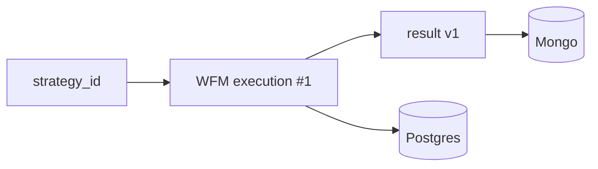

---

### B. Retry técnico: NO debe crear una nueva evaluación lógica

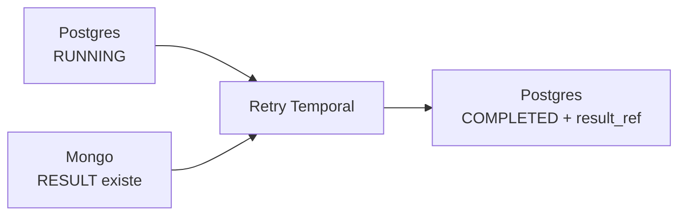

Ese recovery dual-store está declarado como requisito de T1A.

---

### C. Nueva evaluación deliberada: SÍ crea nueva historia

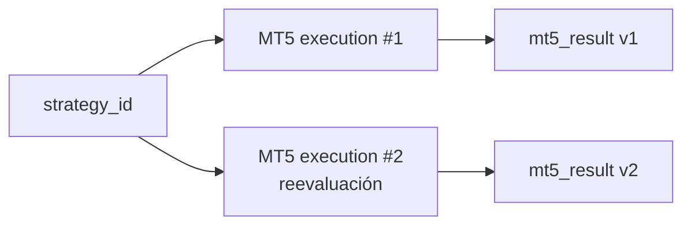

No se pisa `R1`. Ambos resultados coexisten. Esa es la gracia del modelo append-heavy.

---

## 7) Qué se persiste por store, de forma súper concreta

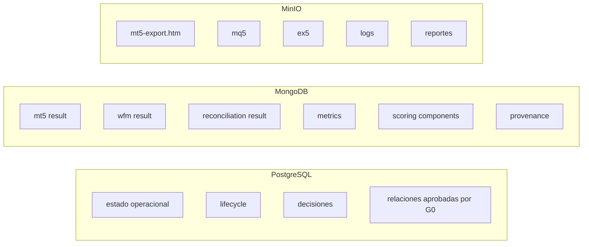

---

## 8) Primer vertical slice real: MT5

Lo que se quiere lograr primero es esto:

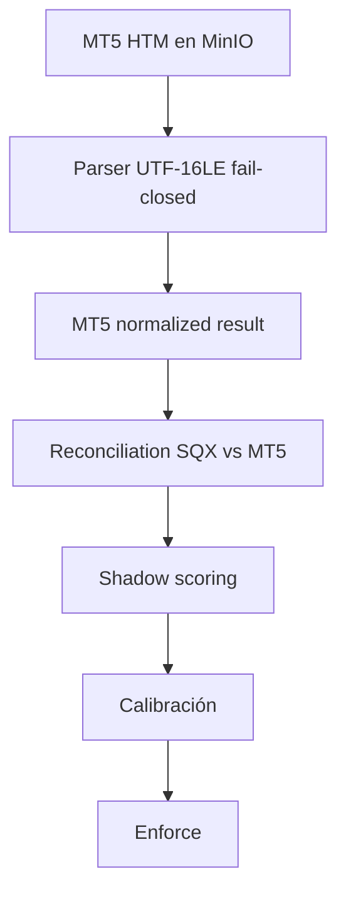

Con gates:

- parser correcto;
    
- fixture con trades reales;
    
- scoring solo en `shadow`;
    
- `enforce` solo tras aprobación humana.
    

---

## 9) Roadmap visual: en qué orden aparecen las entidades “durables”

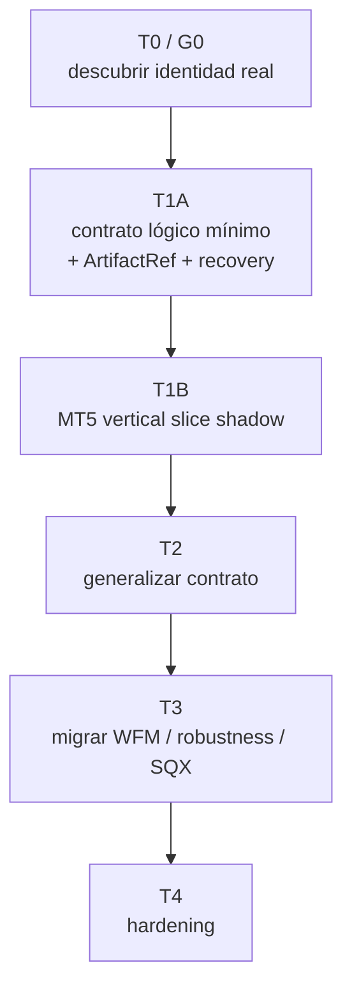

Ese orden está explicitado en el proyecto de arquitectura.

---

## 10) Mi lectura práctica: qué entidades “vas a terminar teniendo”

Si lo bajo a lo más probable, sin dogmatismo arquitectónico, yo apostaría a terminar con algo así:

### En PostgreSQL

- `strategies` **o equivalente aprobado por G0**
    
- entidad operacional mínima para stage execution
    
- estado/lifecycle
    
- decisiones (`PASS`, `REVIEW`, `INVALID`, `PROMOTED`)
    
- referencias hacia evidencia
    

### En MongoDB

- `stage_results` **o varias colecciones especializadas**
    
- payloads versionados:
    
    - `wfm`
        
    - `mt5_backtest`
        
    - `mt5_reconciliation`
        
    - `ranking`
        
- `strategy_summary` o proyección de lectura, pero **solo después** y nunca como fuente histórica única.
    

### En MinIO

- exactamente tu estructura actual
    
- con indexación por DB vía `ArtifactRef`.
    

---

## 11) Resumen ultra corto

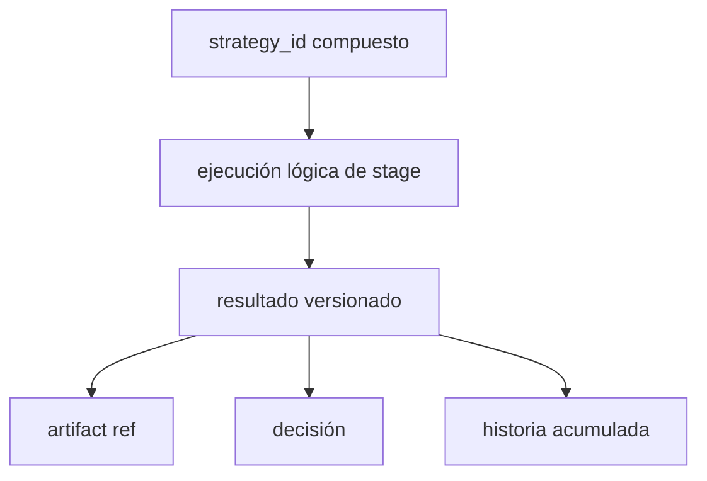

### En español simple:

- **`strategy_id`** identifica la strategy.
    
- Cada **stage** genera una o más **ejecuciones lógicas**.
    
- Cada ejecución lógica produce un **resultado versionado**.
    
- Cada resultado puede apuntar a uno o más **artefactos**.
    
- Las **decisiones** se apoyan en esos resultados.
    
- La **historia no se pisa**: se acumula.
    

---

Si quieres, en la siguiente te hago una **segunda versión más pro**, tipo:

1. **diagrama C4-ish**,
    
2. **ERD más serio**, y
    
3. **timeline visual “antes / durante / después de MT5”**.
    

Esa ya quedaría pa pegarla directo en tu vault, bien ricarda y sin olor a PowerPoint corporativo.
