# Echo + Echo Forge — Independent Reality Check and Time-to-Value Plan

> [!info] Boundary implementable — 2026-09-07
> [[Echo SDK — Canonical Forge Integration and Analytics Contract V1]] concreta Scope/TradeSet/MetricSet/handoff, SDK mínimo, fixtures y gates de los dos proyectos. Disposición B sin nueva auditoría ni estimación temporal. SDK externo queda adapter histórico, no autoridad futura.

## Síntesis vigente

**Delta de contratos/source 2026-09-06 (posterior a este corte):** [[Echo — Forge Ingestion, Runtime Identity and Live Authority Contract V1]] cierra el seam identity/version→ingestion→runtime→Reference→routing como propuesta I, con O1–O3 explícitas. Symphony HEAD/master reconfirmado `db8a022`: B1A `185825c`, B1B `ef65dd1` y B2 `db8a022` presentes; NEXT EXACT factory **C1**, sin nuevo deploy/cert físico. Temporal SQX declara v1.35.0, pero el workspace resuelve v1.44.1; no confundir pin declarado, build y binario desplegado. Las secciones de estado anteriores conservan su corte a10c26c. **Revisión de durabilidad 2026-09-07:** [[Echo + Echo Forge — Architecture Durability and Contract Review — Fable 5.1]] ratifica el grafo y decide **B — FREEZE AFTER BOUNDED CORRECTIONS** (siete correcciones acotadas, ningún TOP; O1/O3 pasan a default técnico, O2 sólo catálogo CC).

1. El master es sólido en fronteras y riesgos; sobredimensiona el mínimo de entidades, analytics y dependencias para empezar a usarlo.
2. TOP ownership V2 cerró como diseño; V3 lo supersede parcialmente. Implementación global B1/B2 y cert física siguen pendientes.
3. Peligros actuales comprobados: secret administrativo válido servido al navegador, errores absorbidos en journal desplegado y discrepancias operativas sin reconciliación demostrada.
4. No se probó truncamiento actual de magic, duplicado físico cross-host ni corrupción actual de PortfolioVersion; esos gates siguen siendo obligatorios al habilitar su scope.
5. Hay 2647 Reference actuales desde junio y 4388 Reference en un archivo anterior. Su recuperación puede ahorrar meses; ninguna cohorte está certificada canónicamente aún.
6. V1 = factory utilizable + ingestión individual + observación atribuible + fidelidad/calidad transparentes + cartera DEMO automática y REAL aprobada por owner, con CASH válido.
7. Ruta corta: B1/B2 y finalistas V2 en Forge; journal/auth, identidad/captura y recuperación histórica en Echo en paralelo; después portfolio determinista y aplicación segura.
8. Construir lo que desbloquea uso; aplazar optimizer avanzado, framework de Decisions, provisioning general y limpieza sin efecto vivo.

**Función de optimización:** TIME_TO_USABLE_TRADING_SYSTEM sujeto a integridad, identidad, seguridad y recuperación. Este companion contiene deltas y priorización; el [[Echo + Echo Forge — Arquitectura de producto, gaps y roadmap de cierre 2026|master]] conserva el mapa amplio. Las soluciones y ventanas de trabajo aquí son **I**, no nuevos contratos frozen ni autorización para actuar sobre producción. Revisión independiente del autor anterior, sin delegación ni implementación.

## 1. Errata y confianza — red team material

S = source verificado; P = evidencia física actual o preservada, fechada; D = decisión owner/frozen; I = propuesta; U = falta evidencia. Un SPEC no aprobado no se convierte en D. R01–R13 resuelven en la fuente de esta revisión; Exx/Fxx en el master. Las correcciones no invalidan retroactivamente una certificación anterior de alcance menor.

| Afirmación original | Evidencia | Veredicto | Afirmación corregida | Efecto roadmap |
|---|---|---|---|---|
| TOP global V2 PASS/CLOSED; B siguiente; takeover manual fenced | D R10, checkpoint exacto 6803 del control; V3 posterior; S R09 | CONFIRMED cierre TOP; WRONG contrato de takeover vigente | TOP V2 realmente cerrado como diseño. V3 prohíbe todo takeover cross-host dentro de Symphony; B1 y B2 pendientes, no garantía física desplegada | Sustituir B por B1→B2; no repetir TOP cerrada ni diseñar admin takeover |
| P0 journal | S Invoke/handlers, P core exacto y logs R02/R06 | CONFIRMED capacidad de pérdida; pérdida neta U | Fallos de persistencia no gobiernan ack; hay conflictos actuales. Los conflictos no prueban por sí solos pérdida o corrupción | Reparar persistencia/ack y conservar eventos antes de confiar nuevos meses de captura; no rehacer journal |
| Security P0 con exposición productiva U | P R03 | CONFIRMED, ahora más fuerte | Bundle servido sin auth contiene secret aceptado por Hasura. Alcance red interna probado, Internet U | FIX NOW de control; no esperar portfolio o UI nueva |
| Magic >int32 y formato binario son P0 actuales | S casts/layout; D nuevo rango; P magics actuales pequeños R04 | CORRECT BUT NOT CURRENT INCIDENT | Truncamiento es FUTURE_MIGRATION_RISK en nuevo estándar; crash de archivo actual sigue UNKNOWN_REACHABILITY/safety audit | Widen+migración antes de nueva ingestión MT5; no reescribir historia ni atribuir corrupción actual sin prueba |
| StrategyVersion requiere nueva entidad amplia | D versiones; P 0 snapshots version-bound | CORRECT BUT OVERDESIGNED si se vuelve subsistema | Identidad de versión exacta es MUST; versión puede vivir en PromotionRecord + binding inmutable y referencias Forge | Thin slice ahora; no version-service |
| Expectation completa antes de forward | S TradeSets existentes; I contrato amplio | CORRECT BUT OVERDESIGNED | Baseline preselección portable, versiones/refs/unidades/períodos y métricas compatibles bastan para captura; catálogo completo no | Iniciar reloj sin seasonality, régimen, MAE/MFE ni bandas exhaustivas |
| Fidelity requiere ledger institucional de fills y todas las métricas | S INNER JOIN; P expected universe ausente | CORRECT BUT OVERDESIGNED en amplitud | Expected recipients+commands+ACK/outcomes y reconciliación son MUST; vector pequeño por operación primero; fills múltiples sólo en scope certificado | Observabilidad desde primer trade; percentiles institucionales después |
| Portfolio mutable bloquea el trading actual | P 0 strategy_portfolios/versiones, S permisos R05 | CORRECT BUT NOT CRITICAL hoy | Mutación peligrosa cuando una versión publicada gobierne efectos; grupos de cuentas no son portfolios de estrategias | Gate antes de primera cartera aplicada; no antes de factory/captura |
| Risk Reservation requiere plataforma global | S sizing por trade; U uso concurrente económico | CONFIRMED necesidad; implementación excesiva I | Headroom agregado atómico y estado in-flight son necesarios incluso con equal-risk; una autoridad por cuenta puede bastar | Antes de automatizar opens; no nuevo servicio distribuido de riesgo |
| Calidad actual deja diciembre sin forward probado | P R04/R07/R08 | UNDER-EVIDENCED pesimismo sobre disponibilidad | Hay dos tramos recuperables, 125 IDs comunes; faltan versión, selección, coverage y puente mayo→junio | Auditar recuperación histórica ahora; no reiniciar todo el reloj |
| Colisión canonicalizer requiere intervención amplia | S strings arbitrarios; P 0 colisiones actuales R09 | CORRECT BUT NOT CRITICAL en scope actual | CURRENT_REACHABLE no probado para entradas legales actuales; extensión/imports sí requieren encoding seguro | Diferir cambio de keys actuales; guard/encoding nuevo antes de ampliar alfabeto |
| Factory sólo podrá integrar tras FULL V2 completo | P C3 0.2.92 tuvo una finalista, 0.2.96 tuvo cero | UNDER-EVIDENCED dependencia global | Recuperar finalista C3 y comprobar refs/semántica: potencial smoke de ingestión V1 sin esperar FULL; no garantía de supervivencia del artefacto | Desarrollo y captura pueden avanzar con fixtures y una finalista certificable |
| December YES WITH SCOPE | I sin throughput y sin inventario histórico anterior | CONDITIONAL como compromiso | Plataforma acotada plausible; evidencia y REAL dependen de cohortes y mandato. FULLY AUTONOMOUS REAL no defendible | Seis resultados separados en §9; no promesa de calendario |

## 2. Realidad actual y forward recuperable

**Nivel integrado actual: 1 parcial, con componentes Echo que ya operan por separado.** Forge V1 posee cierre contractual; el patrón FULL posterior es todavía bloqueado por tiempo de MT5 y semántica de finalista. Echo copia y publica Lab, pero no hay integración canónica, enrollment versionado ni portfolio de estrategias productivo. Un pipeline activo no certifica calidad ni ausencia de pérdidas.

La evidencia actual más útil está preservada en R02–R08: core exacto `e25165ba`, Gateway `0abdf720`, Lab dirty build; 48 cuentas, 152 definiciones, 351 policies; 2647 Reference/426 Execution ECHO/104 Native; 0 raw_trade_events, 0 versiones portfolio, 0 equity snapshots; 4 jobs RUNNING históricos y dos OPEN de junio requieren conciliación. Último trade Reference del viernes 4 sep no basta para declarar outage un domingo: falta coverage de sesiones. No se inspeccionaron EAs exactos ni broker accounts desde sus terminales.

| Cohorte / origen | Clasificación al corte | Fecha mínima defendible hoy / candidata | Qué permite y qué falta |
|---|---|---|---|
| 136 estrategias Reference actuales, siete DEMO catalogadas MT4 | FORWARD_POTENTIALLY_RECOVERABLE | Hechos capturados desde la fecha recorded individual de R08 (2 jun–7 ago). **Fecha de forward canónico: U** | 2592 R disponibles; no tirar esos facts por falta de policy Reference. Faltan EX4/params/versiones, selección previa, capturador/broker y períodos desconectados |
| 130 estrategias del archivo Reference ECHO, 4388 filas | FORWARD_POTENTIALLY_RECOVERABLE | Preservación demostrada 4 may; created_at legacy candidato desde 4 dic 2025, evento desde 2 dic insuficiente solo. **Fecha canónica: U** | Una extracción íntegra identificable permite investigar. 125 IDs reaparecen en junio; no concatenar sin probar misma versión ni inventar mayo→junio |
| 55 Reference actuales sin riesgo inicial verificable | UNUSABLE_FOR_CANONICAL_QUALITY para métricas R de esas filas; recuperabilidad de otras métricas abierta | Fecha recorded conservada | Net outcome puede conservar valor descriptivo; no reconstruir R con SL final. No excluir toda estrategia por una fila incompleta |
| Native/síntesis actual y archivo Native | UNUSABLE_FOR_CANONICAL_QUALITY en contrato Forge seleccionado | No fecha de forward Forge defendible | Mantener para operaciones/account impact; no fabricarle lineage Forge |
| Cohortes Forge V1/V2 nuevas sin enrollment/version binding probado | NO_FORWARD_DATA canónico demostrado | U hasta enrollment real | Ingestión/manifest por sí solos no comienzan observación. Candidata C3 se inspecciona antes de usar |
| CANONICAL_FORWARD_READY | **Ninguna certificada por esta revisión** | — | No significa «no hay historia útil» |

**Recuperación mínima:** fijar las cohortes completas antes de mirar ganadores; recuperar artefactos/sets/config y fechas de selección desde sus fuentes; demostrar mapping cuenta+magic+intervalo→versión; probar productor/timestamps y coverage con logs/estados existentes; comparar tickets, costes y cierres; clasificar por métrica; registrar evidencia y exclusiones en un manifiesto de aceptación histórico. Las fechas R08 son candidatas de cada cohorte y la query de la fuente permite resolver cada estrategia. No se requiere que existiera en 2025 un schema llamado StrategyVersion, sí evidencia equivalente. Hash calculado hoy identifica los bytes de hoy, no prueba que corrían en diciembre.

**Ahorro calendario condicionado:** si un tramo desde diciembre o junio se certifica, puede aportar meses reales. No se transfieren automáticamente meses de MT4 a una nueva implementación MT5: se demuestra equivalencia relevante y se segmenta el cambio de execution engine. 6–56 trades por estrategia actual (mediana 18) advierten que edad calendario y potencia estadística son problemas distintos. No convertir 30 trades en gate nuevo.

## 3. Gap Register V2 — todos los gaps materiales

Se conservan IDs D-01…D-32 para no crear un backlog competidor. **CP** = CURRENT_PRODUCTION_REACHABLE; **CR** = CURRENT_REACHABLE en source/contrato, deploy del path específico no probado; **FM** = FUTURE_MIGRATION_RISK; **TH** = THEORETICAL_ONLY para scope actual; **UR** = UNKNOWN_REACHABILITY. «V1» indica el nivel que bloquea, no que todo deba construirse antes de usar Forge. Si un impacto puede corromper estado económico y no se puede excluir, UR significa **UNKNOWN / SAFETY AUDIT REQUIRED**, nunca PASS.

Coste a seis meses: **PRODUCT**=BLOCKS PRODUCT; **MONEY/DATA**=RISKS MONEY/DATA; **OPS**=CAUSES OPERATIONAL PAIN; **SCALE**=LIMITS SCALE ONLY; **CLEAN**=COSMETIC/CLEANUP. Alternativas Axx se comparan en §6.

| ID / evidencia y alcance | Impacto actual y en trading | ¿Bloquea V1? | Solución segura mínima / alternativas | Diferir hasta / coste 6m | Certificación requerida |
|---|---|---|---|---|---|
| D-01 S/P R02/R06/R09, CP | Ack puede perder hechos; conflictos actuales no conciliados sesgan forward y operaciones | L3 sí; no fábrica | Propagar transientes hasta ack; conflictos a cuarentena durable; replay de facts separado de órdenes. A01 | NOW; MONEY/DATA | Outage DB, retry, CLOSE antes OPEN y poison input: cero fact perdido/doble efecto |
| D-02 S/D/P R04/R12, CR | magic_* no enlaza Forge; magic Execution compartido impide alias global ingenuo | L2/L3 | Registry Forge + mapa canonical; alias legacy por scope/intervalo. A02 | Antes de nuevas estrategias; PRODUCT/DATA | Reverse lineage manifest→EA→journal→Forge y rechazo de ambiguos |
| D-03 S/D/P R04/R09, FM | Ningún magic actual >int32; nuevo estándar sí cruza rango y casts | L2 nuevo MT5 | 64-bit completo más D-31, sin cambiar magic congelado. A02 | Antes del primer nuevo magic; DATA | Ida/vuelta >2^31 por config/EA/file/restart/close; JS exacto |
| D-04 S/P R03, CP, P0 actual | Secret admin válido servido; control fuera de scopes alcanzable en red actual | Uso seguro del control sí | Retirar admin del cliente, auth proxy+dominio, separar roles y rotar coordinadamente. A03 | NOW; MONEY/DATA | GET bundle sin secreto; lectura limitada; negativo auth/roles; webhooks legítimos siguen funcionando |
| D-05 S/D R09/R10, CR; cross-host prod U | Retry compartido sin propiedad global puede duplicar cálculo. No duplicado actual probado ni orden broker directa | L1 unattended fiable | B1/B2 frozen, CAS non-TTL + local lease + singleton + no takeover. A04 | Antes de retries/flota V2; PRODUCT/OPS | Partición, crash/retry, no spawn mientras owner vivo; release scope explícito |
| D-06 S R09/E09, CR; P skips R06 | Guards existen; defaults/freshness y carreras pueden invalidar permiso | L4/L5 | Estado/policy/revisión vigente fail-closed en nuevo scope; kill prioritario pre-send. A05 | Antes de nuevas aperturas autónomas/REAL; MONEY | Config ausente/stale, delayed command y pause/ACK viejo no abren |
| D-07 S R09, CR; EA desplegado U | Buy/Sell precede journal local; crash en ese intervalo puede repetir efecto | L4/L5 sí | Intent durable antes de send; outcome UNKNOWN bloquea resend hasta broker reconciliation. A05 | Antes de autonomía y REAL; MONEY | Fill→crash antes de persistir/ACK; restart encuentra exposición sin resend |
| D-08 S R09, CR; P OPEN viejo no causal | Age-out elimina mappings/cierres >7d; semanas de desconexión rompen recovery | L3 durable; L4/L5 | Retener open/unacked hasta reconciliación; history cursor+dedupe. A05 | Antes de confiar observación larga; DATA/OPS | Posición >7d, outage >7d, queue>500/restart; recuperación sin duplicar |
| D-09 S E09, UR económico | Sizing individual no limita suma abierta+in-flight en cuenta compartida | L4/L5 sí | Serialización/lock por cuenta y reserva durable incluida en headroom. A06 | Antes de aplicar cartera/opens concurrentes; MONEY | Dos opens compiten, reserva persiste tras crash, UNKNOWN no libera presupuesto |
| D-10 D/S/P R05/R12, CR | Ningún snapshot version-bound; reoptimize mezcla historia si se agrupa por magic | L3 canónico | Promotion/version record + binding con intervalo y pin al OPEN. A02 | NOW para nueva captura; DATA | v1 abierta durante cambio a v2 cierra atribuida a v1; solapamiento ambiguo rechazado |
| D-11 S/D R09, CR | Ranking/fidelity puede borrar candidato físico no comparable | L1 target V2 | C1/C2: membership estructural, ranking/warnings aparte; requested symbol/TF gate | Próximo cierre factory; PRODUCT | NOT_COMPARABLE válido sigue finalista; mismatch real bloquea; V1 replay |
| D-12 S/P R09/R11, CP preservada | Seis FULL abortados por 45m; no útil dejarlos correr otra vez igual | L1 fiable | B1/B2 timeout/cancel/drain y D SQX según freeze; budget de admisión separado. A04 | NOW; PRODUCT/OPS | Job largo sobre antiguo límite termina; cancel explícito mata sólo su árbol |
| D-13 S F04/E01, CR ausencia | Factory sin entrega a Echo | L2 | POST individual idempotente y PromotionRecord en transacción. A07 | Este mes; PRODUCT | Reenvío mismo contenido→mismo resultado; conflicto→rechazo; crash/retry |
| D-14 D/I R07/R12 | Falta baseline/enrollment certificado; demora cuesta calendario | L3/calidad | Baseline pequeño y binding observado, audit histórico paralelo. A08 | NOW; PRODUCT | Antes de usar forward, selection cutoff y primera captura demostrables |
| D-15 S/P E19/R05, CP parcial | Recorded y ventana al último close esconden inactividad; LIVE por default no prueba forward | L3 interpretable | Mantener Lab recorded; vista quality con cutoff actual, enrollment y coverage/UNKNOWN | Antes de clasificar calidad; DATA | Sin trades con collector sano vs desconectado; no inferir LIVE desde default |
| D-16 S/P R04/R05, CP | 0 policy Reference matching afecta DQ; fila mutable no prueba policy histórica | L3 evaluación; L4 capital | Sellar policy aplicada en command; R journal sigue válido si riesgo inicial probado. A08 | Antes de nuevas decisiones; DATA | Cambio de policy no altera hechos/decisión histórica; no exige policy de copiado al Reference |
| D-17 S E03, CR UI exacta U | Coverage llamado edge induce lectura errónea, no alpha probado | L3 interpretabilidad | Etiqueta/hint de coverage, excluir score legacy del selector; calidad separada | Próxima superficie; OPS | Strategy perdedora con alta DQ no recibe elegibilidad por ese score |
| D-18 S/P E12/E15/R05, CP schema | Health/portfolio legacy sin tablas origen; cero output actual | L3 health/L4 portfolio | Job pequeño sobre Lab Clean; retirar sólo reader activo roto. A09 | Cuando se use esa función; PRODUCT | Job lee dataset actual y produce output verificable; no tabla stub como prueba |
| D-19 S/P R05, CP visible | Cohort derivado parcial durante recompute, afecta selección automática | L4 gate; L3 señalizar | Transacción scope + lock/generation completa en job existente. A09 | Antes del selector; DATA | Crash intermedio no publica parcial; lector sólo versión completa |
| D-20 S/P R05, FM | Allocations modificables; hoy 0 portfolio versiones | L4/L5 | Draft editable/published inmutable; nueva versión por cambio. A10 | Antes de primer apply; MONEY/DATA | UPDATE/DELETE publicado rechazado también por API/admin operacional limitada |
| D-21 S/P E11/R04, CP | INNER JOIN no ve missing/extra; 2505 sin pares no equivalen a pérdidas | L3 Fidelity | Persistir recipients/reasons + command/outcome; reconcile FULL universo. A11 | Con próxima captura; DATA/OPS | Not requested, missing, rejected, duplicate, delayed reference distintos |
| D-22 S E15, TH para portfolios vacíos | Promedio de DD individuales no es DD de cartera | L4 métricas confiables | Curva temporal agregada; si no hay datos, no publicar DD estimado. A10 | Antes de usar esa métrica para riesgo; DATA | Ejemplo 2 series con DD no simultáneo; calendario/gaps explícitos |
| D-23 S F06, UR caso exacto | RUNNING residual potencial bloquea consulta, no prueba corrupción | L1 recovery | Resolver terminal/seals por IDs; comando/runbook de reparación acotado. A12 | Cuando bloquee resultado; OPS | Artefacto existente se verifica y no recorre cálculo de nuevo |
| D-24 S/U E17/R02 | Restore económico conjunto no probado | L5; L4 unattended | Backup y restore aislado del scope habilitado + bloquea opens hasta reconcile. A12 | Antes de REAL/autonomía; MONEY/DATA | Reconstruye exposición, bindings y pending; no replay de órdenes por replay de facts |
| D-25 S/P R04/R05, UR cumplimiento | Metadatos PROP no certifican reset/límites; cero equity snapshots | L4/L5 cuentas scope | Ruleset concreto+equity actual/continuidad/reset+expiry alerts; no catálogo universal | Antes de operar cuenta seleccionada; MONEY/OPS | Reset/DST/fees/open risk y desconexión ensayados para ese mandato |
| D-26 S/U F06/F09 | Repetir con vendor history mutable no reproduce entrenamiento | L2 provenance, no bit-perfect archive global | Registrar dataset/settings/build/ref, hash cuando existe; calidad por comparabilidad. A08 | Antes de sellar nueva baseline; DATA | Missing provenance visible; replay exacto vs nueva evaluación distinguibles |
| D-27 S/P R09, TH/ FM | Canonicalizer colisiona para strings arbitrarios; 0 casos actuales | No actual; sí ampliar imports | Validar alfabeto/tupla en intake nuevo; encoding/hash inyectivo para expansión | 6–12m en IDs actuales; SCALE | Adversarial legal-alphabet y prueba colisión antes de migrar; no backfill masivo |
| D-28 S/I F08 | Saturación posible sin medición de necesidad | Sólo si afecta trabajo actual | max_waves/budget existentes + medir queue/costo; separar Reference de factory | 6–12m salvo dolor medido; SCALE/OPS | Una campaña acotada termina; captura no queda sin recursos |
| D-29 S E16 | Reader roto/stale confunde operador | L1/L3 uso, no UI completa | Vistas read-only pequeñas con reasons, watermark y unknown. A13 | Con cada capacidad; OPS | Owner encuentra causa/fact del resultado sin SQL manual |
| D-30 S documentación | Nombres/legacy muerto inducen confusión | No | Corregir entrypoints tocados, marcar deprecated; no reescritura de repos | 6–12m; CLEAN | Links vigentes; no delete con lectores desconocidos |
| D-31 S R09, FM layout; UR crash actual | Widen in-place cambia registro; WriteAll no prueba atomicidad | L2 migración; L5 recovery | Envelope versionado, reader/migración y replace atómico validado; backup scoped. A02/A05 | Junto a D-03; DATA/MONEY | Leer archivo viejo con posiciones abiertas, power-loss y restart sin reasociar |
| D-32 S R09, CR posible; cuentas U | Hedging no garantiza single fill; netting/reversal altera identidad y volumen | L4/L5 scope | Admitir sólo modos certificados; registrar deals y reconciliar partial/UNKNOWN. A11 | Antes de habilitar broker/mode; MONEY/DATA | Multi-deal hedging, partial fill y close; netting excluido hasta prueba |
| R-33 P R07/R08, nuevo | Historia anterior ignorada puede costar meses | No bloquea nueva captura; sí evaluación calendario | Auditar equivalencia y aceptar tramos por métrica; no backfill operativo. A08 | NOW timebox; PRODUCT | Manifest por cohorte con evidencia aceptada/rechazada y earliest defensible |
| R-34 P R05/R06, nuevo | Dos OPEN viejos, cuatro jobs antiguos RUNNING y fallos account/position sync | Operación confiable del scope afectado | Comparar journal/estado con fuente broker read-only en misión siguiente; no cerrar DB por edad | NOW diagnóstico; OPS/MONEY | Clasificar stale-state vs exposición física; recuperación exacta sin órdenes nuevas |

## 4. Debt triage que manda el orden

- **FIX NOW / MUST FIX BEFORE USE del scope afectado:** D-04 exposición efectiva; D-01 persistencia/ack; R-34 diagnóstico operativo; D-12 factory que aborta trabajo. D-02/D-10/D-14 y R-33 arrancan ahora para no perder calendario. No significa apagar o modificar producción durante esta auditoría.
- **FIX BEFORE REAL CAPITAL:** D-06/07/08/09/24/25/31/32; cualquier gap de identidad/versión del destino; D-04 resuelto y revocación probada. Estos gates también aplican a dinero ya habilitado si se descubre que cae en ese scope; no se presume que todas las cuentas PROP estén financiadas.
- **FIX BEFORE AUTOMATION:** D-05/11/12 para factory fiable; D-19/20/21/22 para portfolio; guards y broker UNKNOWN/recovery/reservas para auto DEMO y REAL. DEMO reduce daño monetario, no autoriza certificar una semántica incorrecta.
- **MUST BUILD TO COMPLETE V1:** ingestión D-13; mapping/version/baseline/enrollment; expected routing y quality mínimo; portfolio determinista/versionado/ACK; pantallas y alertas operativas pequeñas.
- **CAN LIVE WITH IT FOR 6–12 MONTHS:** IDs legacy aislados D-27 con guard de entradas nuevas; historical aliases sin backfill; múltiples capas analytics dormantes sin consumidores; single currency/single mode; operador ante host perdido; attach manual verificable; batch ingestion ausente; cuotas generales si no hay dolor; sin correlación donde no hay overlap, con concentración conservadora explícita.
- **CLEANUP ONLY:** reordenar módulos, renombrar conceptos sin consumidor afectado, borrar tests/docs antiguos por estética, uniformar todos los modelos de persistencia. D-17 deja de ser cosmético cuando la etiqueta conduce una decisión: corregir ese uso es un cambio pequeño.

## 5. Minimum Usable Trading System V1

V1 permite generar→reducir→validar físicamente→inspeccionar→ingestar→observar→comparar→seleccionar→asignar riesgo acotado→aplicar→pausar/reemplazar→explicar. Alcance propuesto: un owner, Forex/MT5-first, moneda y cuentas certificadas concretas, sin netting hasta prueba, estrategia sin editor. Las References legacy MT4 pueden seguir aportando observación en pista separada.

| Área | MUST para uso V1 | SHOULD / DEFER |
|---|---|---|
| Forge | Run por config/intent; reducción robusta existente; compile/backtest/reconcile; Finalist V2 no dependiente de score; ranking y warnings legibles; campaign target/max_waves/replenishment; resultado exacto y recovery; una candidata real consumible | SHOULD medir time-to-finalist/causas y resupply; DEFER taxonomía económica exhaustiva, scheduler universal y mejorar yield por conveniencia del Golden |
| Ingestion | Endpoint individual autenticado; contrato versionado; IDs Forge; PromotionRecord inmutable con digest/refs; precrear descriptor real; ACK idempotente | Batch y async sólo cuando la latencia/volumen lo exija; no servicio Receipt |
| Live observation | Versión/binario/params exactos, Reference cuenta+broker+magic mapping observado, start UTC, raw durable, trades/costs/riesgo inicial y heartbeat/coverage/no-trade | Attach manual por runbook y read-back basta; provisioning automático general después |
| Execution Fidelity | Expected recipients y exclusiones, command identity/policy, ACK/reject/fills/close, missing/extra/duplicate y dirección/symbol/volumen/precio/tiempo | p50/p95, análisis por sesión y score broker SHOULD; benchmark institucional POST |
| Strategy Quality | Baseline previa, Reference-only, mismo scope/version, coverage primero, frecuencia/net/R/DD/win-loss/holding cuando calculables, comparación y warnings con incertidumbre | Eligibility automática sólo con policy validada; régimen, MAE/MFE, meta-score y optimización continua POST |
| Portfolio | Candidatos elegibles versionados, límites familia/estrategia/símbolo/exposición, overlap/correlación donde soportada, equal-risk determinista, límites de cuenta/prop, CASH, PortfolioVersion y apply/ACK | Advanced optimizer/ML/regime allocation POST; no dependencia para propuesta útil |
| Automation | Factory produces; capture/recompute; proposal/allocation automático; auto DEMO tras gates; owner aprueba REAL; blocks unsafe opens, alerta y pause; replacement dentro de mandato o CASH | Autorretiro económico y reoptimize→redeploy sin owner diferidos; safety pause sí requerido |
| Front | Factory/funnel/candidato/finalista/warnings; forward coverage/calidad/fidelity; cuentas/riesgo; propuesta/version/applied; alertas accionables y drilldown | Read-only primero y control pequeño autenticado; UI polish/SQX viewer SHOULD, editor excluido |
| Operations | Freshness/lag/gaps y resultado de jobs; permisos; artefactos retenidos; replay de facts; recuperación/cancel scoped; reconciliación broker y runbook de excepción | Plataforma SRE general/SLO universales/DR multi-región POST |

### Contrato mínimo Forge→Echo

**I compatible con D:** usar StrategyRef y canonical_strategy_id asignados Forge, versión de estrategia explícita, magic registrado Forge, PromotionDecisionRef+versión, wave/FlowRun, contrato y payload digest, artefacto ejecutable+params hashes, evidencia de selección/reconcile y TradeSet/MetricSet refs. El registry asigna magic en Forge antes del stamping final; Echo verifica, nunca crea una identidad o magic competidor. **Erratum de secuencia (TOP boundary):** magic se asigna antes del stamping; StrategyVersion ligada a bytes/config se sella después del compile/verificación y antes de ingestion/attach, según [[Echo — Forge Ingestion, Runtime Identity and Live Authority Contract V1#3. StrategyVersion V1]]; puede ser un ref con digest de binario/params y su lineage, sin tabla nueva obligatoria en ambos lados. `current_version` es sólo puntero.

Una transacción Echo crea/asegura descriptor real, acepta versión/mapping y PromotionRecord inmutable. Conservar la key owner `(wave_key,canonical_strategy_id,version)` con namespace productor y digest; refs Promotion exactas dentro del registro. Reenvío idéntico devuelve mismo registro; key igual/digest distinto rechaza; misma StrategyVersion promovida en otra wave agrega provenance sin duplicar Strategy ni magic. El consumidor verifica que una segunda promoción no cambie los bytes de la misma versión.

`IngestionReceipt` es la respuesta del PromotionRecord, no otro agregado. Verificación síncrona acotada de manifest/refs/digests: si falta evidencia, rechazo retryable o error técnico visible y reenvío seguro. No descargar todos los ticks en el request. Para EX5/params imprescindibles, verificar bytes por streaming/tamaño/hash; timeout sin commit se reintenta, timeout después de commit se resuelve consultando la misma key. Si esto excede la ventana operacional repetidamente, introducir ACCEPTED/VERIFYING/READY/REJECTED en el mismo registro, no antes. Batch V1 = cliente itera por elemento con keys independientes; atomicidad cross-batch no requerida.

Artefactos permanecen en Forge por refs con contrato de acceso y retención; Echo puede conservar copia verificada sólo del ejecutable/config que opera y necesita recuperar. Ingestión no despliega, no adjunta EA, no activa copias, no asigna riesgo, no convierte finalista en elegible y no inicia el reloj por sí sola.

### Enrollment durable mínimo

Fact de binding: strategy/version, EX5/params digests, Reference account/broker/platform, magic mapping version, artifact refs, observed ACK y effective interval; primera observación atribuible + coverage watermark. Reusar accounts/policies para intención operativa y añadir facts de binding/enrollment, respetando decisión de no tabla deployments por anticipación. Un ACK escrito por operador debe adjuntar read-back comprobable; marcar manual, no inventar handshake automático.

Pin de versión al OPEN/posición; el CLOSE usa esa versión aunque cambie current_version. Si el mismo magic ejecuta dos versiones indistinguibles en una cuenta, impedir ese solapamiento o usar vínculo por instancia/posición que lo distinga. Periodos sin trades sólo significan cero actividad con collector/broker/sesión observados; sin heartbeat son UNKNOWN. Un cambio de versión segmenta evaluación y mantiene posiciones existentes. Timestamp recorded preserva «cuándo supimos»; event validado permite comparación de mercado, sin reescribir el contrato recorded del Lab anterior.

### Fidelity mínimo que responde al owner

Fact por destinatario esperado: trade_id canónico existente + recipient_account + command_id/kind + policy/version + requested symbol/side/volume/risk/SLTP; sent/received/ACK; outcome con order/deal/position y filled volume/prices/costs/close. No crear otro reference_trade_id normativo: es el mismo trade_id compartido ya frozen. Estados derivados: NOT_REQUESTED, PENDING, FILLED, PARTIAL, REJECTED, MISSING, EXTRA, DUPLICATE, UNKNOWN. Timeout nunca significa «broker no ejecutó».

Métricas MUST: conteos esperados/ejecutados/rechazados/missing/extra/duplicados; mismatch dirección/symbol; filled/requested volume y riesgo solicitado/observado; demora con clock quality; precio adverso de entrada y salida normalizado por side y tick; cierre correcto y posición residual. Comparar contra comando aplicado además de Reference, pues el lote y offsets pueden diferir deliberadamente. Tolerancias se configuran por mandato/broker y se aprueban; esta auditoría no inventa límites. Multi-fill físico puede ocurrir en hedging: conservar hechos y no resumir como un único ticket sin resolverlos.

### Quality defendible sin modelo enorme

**Baseline MUST:** versión/config, selección anterior al forward, períodos IS/OOS y condiciones relevantes, TradeSet/MetricSet refs, unidades/método/cost basis, frequency por tiempo observado, net/R, drawdown de curva cerrada, win/loss y holding descriptivos; métricas ausentes quedan UNKNOWN. R canónico Echo continúa `profit_pips/risk_pips`; no reemplazarlo por `profit_net/risk_money`. Si la baseline Forge no puede expresar esa R, comparar net/price-risk compatibles y declarar R no comparable.

**Policy V1 MUST:** coverage/identity antes que economía; sample/exposure time visibles; parámetros fijados antes de evaluar; outcomes OBSERVE/INSUFFICIENT/WARN/REVIEW con reasons, cutoff y versión. Comparación compatible no es prueba de rentabilidad ni permiso de capital. PF con cero pérdidas es indefinido; DD de trades cerrados no es equity intradía. No usar bandas normales automáticas con sample pequeño: [NIST](https://www.itl.nist.gov/div898/handbook/prc/section2/prc241.htm) documenta límites de esa aproximación en proporciones; el método debe declarar sus supuestos. No se asume independencia de trades. Bootstrap/bandas predictivas sólo donde muestra/dependencia/modelo permitan defenderlas; de lo contrario incertidumbre explícita y review.

**SHOULD:** comparación de distribución/R y DD con incertidumbre/calibración por familia cuando los datos lo permitan; análisis de dependencia y selección múltiple. El proceso de elegir el mejor backtest puede sobreajustar, por lo que baseline y universo probado deben conservarse ([Bailey et al.](https://www.davidhbailey.com/dhbpapers/backtest-prob.pdf)). **POST:** régimen aprendido, optimización continua, auto-retirement basado en scores complejos. Esto permite observe/classify/warn ahora sin fingir significancia ni imponer un motor estadístico entero.

### Portfolio y loop mínimo

Un job determinista toma candidatas elegibles a cutoff, evidencia/versión, mandato y cuentas. Aplica exclusiones, límites de familia/symbol/exposure, correlación sólo con series sincronizadas y overlap confiable; unknown crítico produce restricción explícita o CASH. Asigna igual riesgo entre seleccionadas dentro del presupuesto aprobado; si min lot viola presupuesto, no abre. No convertir pesos en garantía de pérdida máxima: posiciones, costes y ejecución pueden separarse del riesgo calculado.

Guardar en PortfolioVersion el input snapshot acotado, constraints/policy, elegibles/excluidos con reasons, selección+asignación, presupuesto y actor. Antes de aplicar, revalidar cuentas/riesgo/freshness y reservar por cuenta sobre abierto+in-flight. Un apply command durable versionado ejecuta pasos idempotentes y conserva ACK/reject/UNKNOWN; el estado observado puede ser PARTIALLY_APPLIED. Pause tiene prioridad y bloquea opens, conserva cierres/reconcile. Reemplazo = versión N+1 bajo mandato y eligibility; sin candidata segura, CASH para nueva asignación, sin liquidar posiciones existentes por implicación.

## 6. Alternativas de solución y coste

L/M/H = LOW/MEDIUM/HIGH; F/M/S = FAST/MEDIUM/SLOW. Costes relativos de implementación y tiempo hasta utilidad, **no estimaciones de días**. Las alternativas indicadas como no equivalentes preservan el gate antes de ampliar scope. No se reabre un D frozen por preferencia estética.

| Familia / gaps | Opción A | Opción B (C si aporta) | Recomendación / límite futuro / migración |
|---|---|---|---|
| A01 Journal D-01 | Propagar transientes y cuarentena de errores deterministas en infraestructura durable existente; coste M, TTV F, ops L | Inbox durable+consumer dedicado con replay por cursor; coste M/H, TTV M, ops M | A si ack/retry real StateFun se certifica y backlog no mata runtime; B si no puede. Correctness equivalente sólo con prueba de no pérdida. Migración M por identidad/offset conservados; no broker replay |
| A02 Identidad D-02/03/10/31 | PromotionRecord/version/binding en stores existentes + migrador EA; coste M, TTV F/M, ops L | Registry/version service general por dominio; H,S,H. C: restringir magic a int32 es incompatible con D | A. Límite: una versión distinguible por binding; se amplía luego por instance ID. Migración L/M con refs estables; no cambiar contratos para evitar migrador |
| A03 Seguridad D-04 | Reverse proxy auth/ACL como contención + roles Hasura/client sin admin + domain auth; M,F,L | Gateway auth integrada completa + BFF nuevo; M/H,M,M | A por etapas conservando auth extremo a extremo. Proxy solo no basta si backend queda alcanzable; migración L. Token rotation coordinada con productores |
| A04 Forge D-05/12 | Ejecutar B1/B2 frozen con primitivas existentes; M,M,M | Supervisor/host fencing service; H,S,H. C: single-attempt/single-host reduce retry pero no cumple recovery D | A. Límite deliberado: host perdido exige operador y fence fuera de banda. Migración M si futura autoridad real de fencing existe; no framework hoy |
| A05 Efectos/recovery D-06/07/08/31 | Intent+pending/outcome durable EA/core, reconciliador pequeño y bloqueo de UNKNOWN; M,M,M | Effect ledger general multi-broker/saga engine; H,S,H | A. Correctness exige no reenviar uncertain, no alcanza sólo UUID. Migración M conservando command IDs; un broker/mode certificado primero |
| A06 Riesgo D-09/25 | Autoridad serial por cuenta con estado durable/row lock, reserva y headroom; M,F/M,L/M | Risk service distribuido multi-cuenta; H,S,H | A. Escala limitada por cuenta, suficiente sin carga contraria. Migración M. Un mutex volátil o equal-risk sin reserva no es alternativa correcta |
| A07 Ingestión D-13 | POST individual sync, registro promoción como receipt; M,F,L | Async verify en mismo registro; M,M,M. C: batch coordinado+entidad Receipt aparte; H,S,H | A; B sólo por latency real. Migración L si contract/status versionados; batch client loop ahorra desarrollo |
| A08 Baseline/forward D-14/16/26/R-33 | Manifest pequeño + enrollment, recuperación histórica por scope/métrica; M,F,L | StrategyExpectation general versionada con catálogo/múltiples datasets; H,S,H | A. Límite: comparaciones sólo soportadas; migración L al extender schema. Reiniciar todo sin auditar archivo desperdicia tiempo; si provenance no se recupera, nueva captura igual avanza |
| A09 Lab D-18/19 | Transacción scope/advisory lock+run completado para publicar, job compatible Lab Clean; M,F,L | Staging generation+pointer swap para todos los derivados; M/H,M,M | A si tamaño/transacción aceptables y lectores de decisiones usan la publicación completa; B si readers necesitan varias tablas consistentes sin lock largo. Migración M. Lector live sin generation nunca autoriza riesgo |
| A10 Portfolio D-20/22 | Extender tablas existentes; PortfolioVersion immutable con selección/allocation/inputs; algoritmo determinista; M,F/M,L | Nuevas Decisions separadas por selección/asignación/rebalance; H,S,H | A. Separar después si cambian cadence/authorization independently; migración L/M por refs. Optimizer avanzado no mejora seguridad de apply |
| A11 Fidelity D-21/32 | Expected command facts + reconciliación por cuenta/deals y vector pequeño; M,F/M,M | Ledger universal multi-asset/order book/benchmark; H,S,H | A. Hedging/scope explícito, partial siempre visible. Migración M; diseño debe aceptar 1:N deals desde ahora sin construir analytics universales |
| A12 Recovery D-23/24 | Runbook/reconciliador por IDs+backup/restore del scope activo; M,F/M,M | Automatización de repair/DR cross-store completa; H,S,H | A. Operador en excepciones, no babysitting diario; migración M. No posponer restore de estado económico por esperar DR general |
| A13 Front D-29 | Extender pantallas/CLI legible con read models estables y reasons; L/M,F,L | Front nuevo completo+viewer orchestration; H,S,M | A. Migración L al reutilizar API. Viewer dedicado SHOULD posterior; editor no pertenece a V1 |

## 7. Arquitectura simplificada y entidades

Conservar Forge PG/Mongo/MinIO/Temporal y Echo PG/Kafka/StateFun/Bridge/EA. El hecho de que un concepto sea importante no le da una tabla o un microservicio propios.

```mermaid
flowchart LR
 F[Forge Campaign y Promotion] --> I[API y PromotionRecord]
 I --> B[Version y binding observado]
 B --> R[Reference facts y coverage]
 R --> Q[Quality y eligibility report]
 R --> E[Expected commands y outcomes]
 E --> EF[Fidelity y reconciliación]
 Q --> P[PortfolioVersion: selección y riesgo]
 P --> A[Apply autorizado y ACK]
 A --> G[Guard cuenta: abierto más reservado]
 G --> X[Bridge y EA]
 X --> E
```

| Concepto del master | Disposición V1 | Justificación |
|---|---|---|
| StrategyExpectation | REPRESENT AS FACT/STATE: baseline versionada en PromotionRecord/manifest | Fija comparación y evidencia; no necesita agregado propio ni catálogo gigante |
| IngestionReceipt | MERGE WITH EXISTING DOMAIN ENTITY: PromotionRecord | Misma aceptación/idempotencia, otra entidad duplicaría autoridad |
| ValidationDecision | MERGE con informe de quality/eligibility | Una evaluación con policy/cutoff/input/version; observar no autoriza capital |
| EligibilityDecision | IMPLEMENT ONLY WHEN AUTOMATION REQUIRES IT, como resultado durable del informe | Al alimentar selector debe ser evidence-bound, vigente y reproducible; no tipo separado por capricho |
| PortfolioSelectionDecision | MERGE en PortfolioVersion | Inputs/reasons preservados con la selección, misma unidad de versión |
| RiskAllocationDecision | MERGE en PortfolioVersion para intención; reserva separada para efectos | Asignación de presupuesto es estable; consumo por orden cambia y necesita otra lifecycle |
| ActivationDecision | REPRESENT AS FACT/STATE/TRANSITION en apply command durable | Sí necesita autorización actor/mandato, preconditions y ACK; no un framework de decisiones |
| PauseDecision | REPRESENT AS TRANSITION auditada | Scope/actor/reason/revision y efecto verificado; prioridad sobre activation |
| RetirementDecision | REPRESENT AS TRANSITION del registry + deny opens | Retener historia; no borrar ni reciclar magic |
| ReplacementDecision | MERGE en PortfolioVersion N+1 + motivo | Es cambio de miembros/riesgo, no otra jerarquía de agregados |
| RebalanceDecision | MERGE en PortfolioVersion N+1 + diff | Conserva replay/audit; no duplicar selección+asignación |
| Effect Ledger | IMPLEMENT ONLY WHEN AUTOMATION REQUIRES IT: tabla pequeña de commands/effects | MUST para apply y broker uncertainty; no event-sourcing universal. Hechos no reejecutan efectos |
| CandidateSnapshot | REPRESENT AS FACT embebido/ref immutable del PortfolioVersion | Congela universo y exclusiones; separado sólo si tamaño/reuso lo exige |
| Risk Reservation | KEEP AS DISTINCT DOMAIN ENTITY (registro de estado durable, no servicio) | Se adquiere/libera por efecto y afecta capital disponible; versión portfolio no la sustituye |

**Costuras de un año que sí deben existir ahora:** IDs estables y contratos versionados; facts de versión/routing/command independientes de pantalla; artefactos por ref/hash; actor+scope/revisión; atomicidad por cuenta; adaptador broker que devuelve 1:N outcomes y UNKNOWN; fórmula/inputs publicados; draft/published con CAS. Permiten más estrategias, workers, cuentas y brokers sin reescribir el core. Más carga por cuenta o netting puede requerir ampliar adaptadores, no anticipar otra plataforma. Una vez presentes estas costuras, parar la generalización.

**Front mínimo sobre esos contratos:** factory run/funnel muestra stage, conteo de entrada/salida y reason de desaparición; candidato/finalista muestra artifact refs, membership, ranking opcional y warnings; estrategia muestra versión/enrollment, coverage, última captura y comparación con baseline; Fidelity muestra expected vs observed por cuenta y comando; cuentas/portfolio muestran riesgo abierto+reservado, versión propuesta/aplicada y ACK; alertas muestran scope, causa, antigüedad y acción operativa. Cada pantalla distingue UNKNOWN, stale y ausencia válida. Reutilizar componentes actuales; auth antes de habilitar control. Se preserva como SHOULD futuro el flujo seleccionar estrategias → preparar SQX Pool → worker/VM viewer dedicado → SQX `-gui`; sin strategy editor ni ejecución del viewer en cuentas activas.

## 8. Product Usability Ladder

| Nivel | Capacidad y qué hace realmente el owner | Trabajo manual restante | Seguridad / evidencia |
|---|---|---|---|
| 0 infraestructura | Ejecutar componentes y diagnosticar conexiones | Casi todo el flujo de trading | No producto ni autorización de riesgo |
| 1 Forge usable manualmente | Lanzar campaign, dejar cálculo, inspeccionar funnel/warnings y obtener finalistas | Elegir run/config y candidatas; excepción de worker | Artefactos/identidad/physical retry certificados; cierre V1 actual parcial para FULL target |
| 2 Forge→Echo integrado | Seleccionar finalista e ingresarla una vez con reintentos seguros | Attach Reference con runbook/ACK | Ingestion≠activation; versión/mapping correctos |
| 3 observación+analytics automática | Ver qué sigue funcionando y qué copia fielmente; investigar alerta concreta | Review de calidad, evidencia histórica y aprobación de candidatos | Coverage, facts recuperables y UNKNOWN visibles; sin elegibilidad fingida |
| 4 portfolio DEMO automático | Recibir/aplicar propuestas y reemplazos dentro de mandato sin babysitting de cuentas | Excepciones, calibración de policy, cambios de mandato | Riesgo agregado, intent/effects/ACK, pause/reconcile, CASH; correcto aunque DEMO |
| 5 REAL con aprobación owner | Aprobar una versión con evidencia/riesgo y operar con límites automáticos | Aprobación inicial/cambios fuera del mandato y excepciones | Todos gates económicos/cuenta/EA/restore; Reference y mirrors continúan |
| 6 mayor autonomía | Renovación/reoptimización/replacement más amplio sin aprobación por versión | Mandato, auditoría y eventos excepcionales | Evidence de política autónoma y límites certificados; fuera del compromiso V1 |

## 9. Roadmap verdadero — siete hitos con valor

Los hitos sustituyen **como propuesta de priorización** la ejecución del roadmap amplio; no cambian estados frozen sin evidencia. Forge physical (B1→B2→C1/C2/D según contratos→release/cert) y Echo capture/control son tracks independientes. Fixtures permiten implementar boundary/analytics/portfolio temprano; certificar efectos exige hechos físicos. No delegación ni nuevas misiones ejecutadas aquí.

| Hito | Goal / qué puede hacer el owner después | Gaps MUST y dependencias | Paralelo | Certificación / deuda diferida |
|---|---|---|---|---|
| H1 Preservar evidencia y cerrar exposición | Confiar que una falla se ve y se recupera; saber qué historia puede usarse | D-01/04, R-33/34; ninguna dependencia Forge | H2/H3 | Secret revocado/roles; fact replay; matriz histórica. Diferir inventario infinito y cleanup |
| H2 Factory fiable y finalistas inspeccionables | Lanzar campaign sin matar cálculo sano; obtener/ver por qué hay o no finalistas | D-05/11/12/23; B1/B2, C1/C2, D scope frozen, release exacta | H1/H3 y front funnel | No duplicación/muerte indebida; V2 warning no excluye; supply físico consumible. Diferir nueva taxonomía/optimizer |
| H3 Ingestión + enrollment + reloj forward | Ingresar una candidata y verla acumulando observación atribuible | D-02/03/10/13/14/26/31; journal seguro, auth; smoke V1 si artefacto previo pasa | H2, Fidelity/Quality con fixtures | Duplicate/conflict API y EA read-back, >int32/restart, coverage. Diferir batch/provisioning general |
| H4 Fidelity y Quality útiles | Ver missing/reject/duplicate, estado de calidad y evidencia insuficiente | D-08/15/16/17/18/19/21/29; captura H3 y contratos raw | Diseño portfolio y guards, front por read model | Reference mala/copia fiel y Reference buena/copia mala; no-trade vs outage; generación completa. Diferir meta-score/regime |
| H5 Portfolio propuesto automáticamente | Comparar composición/riesgo/CASH sin calcularlo a mano | D-20/22; eligibility+baseline H4; mandate pequeño | H4 y H6 guards en shadow | Determinismo, familias, unknown overlap, no eligible→CASH, published immutable. Diferir optimizer |
| H6 Aplicar y operar DEMO con límites | Ejecutar cartera y cambios dentro de mandato con pause/reconcile automático | D-06/07/09/24/25/32; H5; auth/identidad/effects | Restore/front/ops desde H1 | Partial apply/crash/ACK perdido/pause race/two opens; cero unknown exposure habilitando nuevas opens. Diferir autonomía económica amplia |
| H7 REAL aprobada y aceptación V1 | Aprobar cartera elegible y operarla con auditoría/alertas | Todos gates del destino; evidencia y mandato owner; H6 | Recovery histórico y calendario no esperaron a H7 | Restore aislado, broker read-back, cohort eligibility, transición N→N+1. Si no hay elegibles, software puede cerrar y capital queda NO_GO/CASH |

**Critical path mínimo:** H3 tiene un puente manual certificado; no espera front final ni optimizador. H2 limita nuevas candidatas si no se recupera finalista anterior, pero no limita recuperación/captura legacy. H5 puede desarrollarse con fixtures; su output con dinero requiere H4 real. H6 no espera seis meses para ensayar DEMO, pero tampoco etiqueta candidatas no validadas como elegibles reales. El reloj comienza al observar versión identificada, no al terminar H4.

| Resultado al 31-12-2026 | Veredicto | Condición y límite |
|---|---|---|
| A Forge factory usable | YES WITH SCOPE | B1/B2+V2/release/cert y runs que terminen dentro de capacidad; no garantiza yield rentable |
| B Forge→Echo integrado | YES WITH SCOPE | Endpoint individual+identidad/version/migración; attach manual aceptable |
| C Trustworthy live observation | YES WITH SCOPE | Captura durable+binding+coverage temprano; recuperar history separado de nueva captura |
| D Automatic DEMO portfolio | CONDITIONAL | H4–H6; mandato/risk/effects; demo experimental distingue cohortes todavía no elegibles reales |
| E Owner-approved REAL portfolio | CONDITIONAL | Candidatas defendibles, broker/cuenta/restore y mandato; histórico recuperado puede ayudar, no se presume |
| F Fully autonomous REAL portfolio | NO como compromiso 2026 | Falta certificación de política autónoma/evidencia; no necesario para V1 |

Quedan 116 días entre 6 sep y 31 dic. Tres meses calendario nuevos caben si el reloj comienza pronto; seis meses nuevos terminan en marzo 2027. Historia desde junio podría cubrir más, pero contar días no prueba versión/cobertura/trades ni política aprobada. No hay throughput/equipo comprometido: estas son evaluaciones de alcance y dependencias, no promesas de entrega.

## 10. Próximos 30 días — 6 sep a 6 oct

- **Días 1–7:** abrir fix acotado auth/secret y journal ack/recovery; clasificar dos OPEN antiguos/fallos sync con fuentes read-only; iniciar recuperación del backfill, cohortes completas y referencias de finalista C3. En Forge ejecutar B1 frozen y preparar B2, sin nuevo FULL sobre runtime viejo. Resultado útil: seguridad concreta y evidencia que deja de desaparecer.
- **Días 1–10 en paralelo:** cerrar contrato individual de ingestión, mapping/magic/version y migración EA; baseline mínima y enrollment. Contratos/fixtures primero; no esperar Golden completo ni decidir todas las métricas.
- **Días 7–20:** implementar thin slice de capture Reference con read-back; cerrar B2/C1/C2/D en su orden contractual y certificar release. Usar candidata previa sólo si pasa refs/identity; si falla, no inventar finalista. Resultado útil: reloj forward funcionando y factory consultable.
- **Días 15–30:** expected routes/command outcomes y primera vista Fidelity; Quality observe/insufficient/warn y coverage; publication gate; cartera determinista shadow sobre fixtures/datos clasificados. No activar REAL ni rebajar evidencia para cumplir fecha.
- **Corte día 30:** aceptar cohortes/tramos históricos o documentar U específico; reportar earliest defensible por cohorte, yield/time-to-finalist y próximos gates. Si H2 tarda por cálculo, continuar Echo y reducir scope del selector; no refactorizar infraestructura para llenar la espera.

## 11. Stop doing

- Dejar de construir una entidad Decision por cada verbo del lifecycle: no aporta nueva autorización ni replay en V1 si ya queda en PortfolioVersion/apply facts.
- Dejar de expandir StrategyExpectation antes de guardar baseline/coverage; esa expansión no recupera un día de forward perdido.
- Dejar de serializar ingestion, front y quality detrás de FULL Golden; sólo la cert final de supply necesita artefacto físico.
- Dejar de medir progreso con porcentajes de arquitectura; medir finalistas consultables, ingreso correcto, días observados y carteras aplicadas/conciliadas.
- Dejar de tratar filas legacy/deprecated/0 resultados como P0 por nombre; demostrar reader/writer, input legal y efecto.
- Dejar de borrar/recrear historia para cumplir schema nuevo; alias/adapters y manifiestos de aceptación conservan lo que sí se puede probar.
- Dejar de optimizar portfolio matemáticamente antes de tener versiones, riesgo agregado y apply/ACK; ninguna mejora de Sharpe evita una orden duplicada.
- Dejar de construir provisioning general, tenancy, multi-asset, editor, régimen ML, DR multi-región y auto-takeover. Su ausencia no impide usar una V1 delimitada.
- Dejar de repetir FULL con timeout conocido o de llamar «cero finalistas» a fallo de infraestructura; corregir causa y certificar pequeño antes del ensayo caro.

## 12. NEXT EXACT y TOP/NORMAL abiertos

**CRITICAL PATH NEXT EXACT:** `ECHO-FORGE-MT5-LONG-RUNNING-GLOBAL-OWNERSHIP-RETRY-DRAIN-V2-NORMAL-B1`, ya frozen por V3; luego B2 y los slices Finalist C1/C2/SQX D según sus contratos y cert física. NORMAL A cerrado sólo local; TOP V2 cerrado; V3 autoridad vigente; ninguna implementación de B declarada hecha.

**PARALLEL NEXT EXACT (I para nueva misión):** `ECHO-JOURNAL-ACK-RECOVERY-AND-CONTROL-EXPOSURE-V1`: dos fixes independientes con límites de source y cert claros, priorizando secreto servido y ack perdido. `ECHO-FORGE-TO-ECHO-THIN-BOUNDARY-V1`: schema/fixtures/endpoint individual, PromotionRecord como receipt y mapping/version; no otro discovery genérico.

**DATA-CAPTURE NEXT EXACT (I):** `ECHO-REFERENCE-HISTORY-RECOVERY-AND-ENROLLMENT-V1`: auditar las dos fuentes Reference R04/R07, prueba por cohorte de versión/selección/coverage y earliest defensible; simultáneamente nueva captura raw recuperable con binding. No esperar que termine la recuperación para guardar nuevos hechos.

**WHAT NOT TO START YET:** optimizer avanzado, nuevos agregados Decision, batch/asynchronous ingestion por anticipación, nueva tabla deployment obligatoria, reescritura Lab/journal, MT4 migration global, trading real autónomo o otro FULL sin gates físicos. Los únicos TOP nuevos necesarios cierran contrato boundary/versión y política/mandato; no vuelven a decidir Foundation o takeover.

## Evidencia y provenance

Fuente independiente: [[Echo + Echo Forge — Evidencia de revisión independiente 2026-09-06]]. Inputs contrastados: master; roadmaps [[Echo Forge]], [[Echo Forge - Arquitectura de Datos y Migración de Persistencia]], [[Echo - Discovery y Estado]], [[Echo - Auditoria POC e Identidad Forge-Echo 2026-08-23]]; decisiones MT5 V2/V3 y Finalist V2; certificaciones C3/0.2.96 y FULL; feedback [[2026-09-06-echo-forge-product-audit-session-feedback]]. No se hereda la confianza del autor. Estado de lectura/fuente manda sobre síntesis previa; discrepancia de contrato se registra, no se convierte en permiso para cambiarlo.

## Límites y contradicciones

Revisión completada en su alcance de evidencia, con U explícitos. No certifica producto, broker, nuevas estrategias ni un estado global exactly-once. EA/config/version en cuentas Reference no se pudo probar; forward READY sigue vacío. Metadata MT4 actual no demuestra plataforma histórica idéntica; el archivo de mayo demuestra preservación, no por sí solo selección ex ante. Lab binario modified=true limita equivalencia con source limpio. No inventar número exacto de migración ni exposición pública de Internet.

Las queries actuales observaron mutabilidad de publicación; no se ejecutó fail-injection. Seguridad actual se probó leyendo bundle y usando credencial para SELECT, sin probar mutación destructiva. Source/producción permanecieron read-only; sólo este vault recibió documentación. Se completó feedback y agent run por cierre explícito. El resultado PASS/CLOSED corresponde a esta revisión y persistencia, no a H1–H7 ni a autorización de capital.
