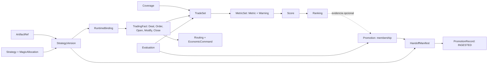

# Echo SDK — Canonical Forge Integration and Analytics Contract V1

> [!important] Freeze review — 2026-09-07
> [[Echo SDK — Canonical Contract Final Freeze Review — Fable 5.1]] revisa este contrato como objeto único: **B — FREEZE AFTER BOUNDED CORRECTIONS**, cinco correcciones FR-1…FR-5 incorporables en S0 y ningún TOP. FR-1: refs de TradeSet/MetricSet/Evaluation no incluyen digest de resultado (identidad por inputs; contenido sellado write-once, conflicto explícito). FR-2: regla key/basis/unit/formula + `MetricSelector`; `return.r_pips/r_money` → `return.total`+basis, `pnl.net` → `pnl.total`+`NET`. FR-3: ScopeV1 sin bloque `valuation`. FR-4: `C()` agnóstico de schema (validador rechaza decimales no canónicos) y dos funciones hash nombradas (legacy Forge newline vs `H()` JSON array). FR-5: `record_digest!` en NormalizedOperation. El resto de §§2–22 queda ratificado; la disposición vigente vive en esa Resource y S0 la incorpora antes del pin.

## Síntesis vigente

### 1. Veredicto ejecutivo

1. **Sí: Echo SDK debe ser la autoridad canónica**, mediante un módulo puro pequeño bajo `v3/sdk/contracts`.
2. Echo Analytics aporta operaciones, outcomes, R y dimensiones útiles; **requiere correcciones acotadas** antes de gobernar el wire nuevo.
3. Mayor discrepancia: Forge conserva conjuntos/evidencia exactos; Lab expone proyecciones reconstruibles y fórmulas/bases parcialmente implícitas.
4. Mayor riesgo de estabilidad: mismo nombre con distinta unidad, base, ventana o generación de inputs.
5. Mayor riesgo de sobreingeniería: framework universal de schemas, comparación o eventos y limpieza previa de todo SDK.
6. Mayor riesgo de big bang: obligar a todos los journals, productores y lectores UI a migrar simultáneamente.
7. El diseño permite freeze para evolución aditiva **después de certificar las correcciones delimitadas**, sin reabrir identidad/live.
8. **Disposición única: B — FREEZE AFTER BOUNDED CORRECTIONS.** Otro TOP global: **NO**.

**Estado de autoridad:** contrato técnico propuesto y listo para implementación NORMAL; no representa código publicado, certificación física ni aprobación de un catálogo CC por el owner. Lo ratificado por las Decisions previas conserva precedencia. Esta Resource sustituye dos propuestas previas: autoridad wire en `xKoRx/sdk` y rechazo indiscriminado de campos desconocidos. Su freeze de bytes ocurre con S0 (§20), no por escribir esta nota.

### 2. Tesis de producto y frontera

Echo es el destino del producto personal de trading y del lenguaje compartido. Forge termina en `FINALIST_PROMOTION V2`, versión sellada, evidencia y artefactos verificables, empaquetados en `HandoffManifestV1`. Echo empieza validando ese objeto, copiando bytes operativos y persistiendo una recepción **INGESTED**. Provisionar, observar, habilitar elegibilidad, asignar capital y activar son transiciones posteriores independientes.

Echo SDK posee tipos, semántica, codecs, validadores y fixtures del contrato. No posee infraestructura de transporte/almacenamiento, ejecución de estrategias, asignación de magic, estado del registry, política de selección ni fórmulas de cada productor. Esas implementaciones consumen tipos comunes. Una métrica de la misma semántica deja de tener tres autoridades por repositorio; los adaptadores restantes son de formato histórico o de borde vendor.

El objetivo de escala es cientos a ~1.000 Strategies, versiones por años, decenas de cuentas y varios workers. Payloads grandes viajan por ArtifactRef con streaming; manifests y receipts son pequeños. PostgreSQL, object storage y los procesos actuales bastan: no se agrega motor, bus o servicio de integración.

### 3. Modelo mínimo y autoridades



| Concepto | Identidad / autoridad / mutabilidad |
|---|---|
| Strategy | `StrategyRef` UUID asignado por registry; relación exacta e inmutable con `(registry_namespace, canonical_strategy_id)`. GeneratedStrategy es origen dentro de batch, no equivalencia por código. |
| StrategyVersion | Ref de contenido ratificado; pertenece a Strategy, depende de ejecutable/inputs/contexto/dependencias exactos. Nueva métrica, promotion, cuenta, locator o broker no crea versión por sí solo. |
| MagicAllocation | Registro de asignación dentro de Strategy, no nueva entidad de negocio autónoma. Forge asigna antes de Apply/stamp/compile; único positivo int64, estable y no reciclado. Versión se sella después de conocer bytes. |
| ArtifactRef | Valor de integridad + locator durable + tipado; no tabla universal obligatoria. Identidad de bytes separada de sus ubicaciones y de evidencia que los interpreta. |
| Evaluation | Evidencia inmutable de una invocación y sus inputs/resultados. Puede referir Strategy antes de existir Version; FlowRun/StageExecution no son obligatorios para live. |
| TradeSet | Conjunto sellado de operaciones normalizadas; conserva el nombre existente. No sustituye el ledger de Deals ni incluye órdenes como si fueran trades. |
| MetricSet / Metric | Conjunto sellado de mediciones de inputs exactos; Metric es valor contenido, no entidad global por fila. |
| Score | Transformación algorítmica de evidencia exacta, propósito explícito y status. Nunca equivale a autorización. |
| Ranking | Orden de un cohort sellado, algoritmo y scores exactos; candidatos sin score comparable no reciben rank cero. |
| Promotion | Decision especializada con membresía y policy version; evidencia exacta, no “top actual”. `PromotionRecord` es receipt Echo separado. |
| RuntimeBinding | Enrollment/binding versionado de StrategyVersion en cuenta, broker y runtime; referencias fijadas al OPEN y conservadas al CLOSE. |
| TradingFact | Unión discriminada: OPEN, ORDER, DEAL, MODIFY, CLOSE_ASSERTION; hechos de origen, no instrucciones. DEAL conserva economía irreducible. |
| EconomicCommand | Intención económica durable con UUID, operation key, policy/risk snapshot, reservation y relación 1:N con deals. Reserva integrada aquí, no entidad nueva. |
| Routing | Un resultado por source_event + operación con universo y exclusiones congelados. EXPECTED se deriva de commands; no tabla universal por destinatario. |
| Coverage | Evidencia de observación por collector/cuenta/intervalo; relación hermana, no booleano calculado a partir de “no hubo trades”. |

No se crea entidad `Comparison`: un productor consume inputs nombrados `baseline`/`observed` y emite MetricSet, Score y warnings. No se unifican los propósitos `STRATEGY_QUALITY`, `EXECUTION_FIDELITY` y `SQX_MT5_FIDELITY`. Reference es operación observada post-broker; no representa una señal ideal previa al broker.

**Identidades ratificadas.** `canonical_strategy_id` no se deriva del nombre de ejecutable ni se acorta a 64 caracteres. `StrategyRef` no se calcula del código. Los IDs adoptados no se renombran. Un mismo Version puede tener promociones en waves distintas. Magic de Execution puede tener override local al command; no muta la asignación de Strategy.

**Autoridad live conservada.** Raw recibido se conserva antes de routing; bridge confirma después de su frontera durable y core persiste raw antes de fanout. Origen de operación `(broker_server, account_registration, platform, position_identifier)` mapea a `trade_id`; cada deal se deduplica por cuenta física + deal ID. Una correlación ambigua es UNKNOWN, sin reenvío ciego. El journal es proyección, no autoridad sobre fills que no contiene. Reference canónica única por Version y prohibición de versiones solapadas con igual cuenta/magic mientras existan posiciones/órdenes son defaults V1; no nuevas preguntas bloqueantes al owner.

### 4. Matriz de convergencia analítica

Acciones son sobre escrituras nuevas; “adapter legacy” no atribuye autoridad al DTO viejo.

| Concepto | Echo actual | Forge actual | Diferencia semántica | Contrato canónico | Acción |
|---|---|---|---|---|---|
| Operación | Lab `CanonicalTrade`, journal trade/account | `sqx.Trade`, MT5 `NormalizedTrade` | Cuenta/role forzados en Lab import; Forge carece de Version y campos tienen distinta disponibilidad | `NormalizedOperation` con Scope y facts/evidence refs | EXTEND ECHO + EXTEND FORGE; ADAPTER LEGACY |
| Journal / colección | Filas mutables y recompute | TradeSet durable + payload/hash | Proyección vs conjunto sellado | Journal proyecta; TradeSet referencia inputs exactos | KEEP DISTINCT + EXTEND ECHO |
| Reference outcome | Reference-only, R y riesgo | Trades/fidelity de tester | Outcome no es trade universal ni score | Outcome sigue proyección; MetricSet con propósito explícito | KEEP DISTINCT |
| Medición | `MetricSnapshot` columnas fijas | `MetricSetEvidence`, catálogo/formula/calculator | Echo pierde semántica por métrica; Forge tiene scope/input refs más ricos | MetricSet canónico, snapshots son read model | EXTEND ECHO; REUSE semántica Forge |
| Unidad win rate | Lab ratio 0..1 | SQX/MT5 porcentaje 0..100 | Igual etiqueta no implica misma escala | `win_rate`, unit RATIO 0..1 con conversión explícita versionada | ADAPTER LEGACY en ambos |
| R | Journal pips; lab AUTO dinero→pips→journal | Riesgo no presente en todos los trades | Base potencialmente distinta por fila | `return.r_pips` / `return.r_money`, sin fallback silencioso | EXTEND ECHO; UNSUPPORTED cuando falta riesgo |
| Profit factor | Lab no losses no valor; productores diferentes | MT5 derivado 0 OBSERVED si no pérdidas | Cero falso altera comparabilidad | INSUFFICIENT / NO_LOSSES, valor ausente | EXTEND FORGE |
| Raw / ReferenceEvent | Raw JSON durable + DTO operational con narrowing | Reports/artifacts y Evaluation | Transporte, hecho y derivación no son equivalentes | TradingFact + raw artifact/event ref | KEEP DISTINCT; ampliar borde nuevo |
| Riesgo/policy | lookup temporal sobre políticas mutables | tester settings y configuración de scoring | Configuración actual no demuestra política aplicada | Snapshot aplicado al command/OPEN e input exacto | EXTEND ECHO; KEEP DISTINCT tester config |
| Scope | strategy/account/segment/window/policy | JSON scope por stage/sample/WFM + IdentityScope MT5 | Scope más rico en Forge pero poco tipado; runtime/evidencia mezclados | Scope común con bloques opcionales tipados | EXTEND ambos |
| Tiempo/window | recorded timestamps; filtro [from,to] | (start,end] y fechas de fuente | Muestras distintas bajo mismo label | TimeWindow explícito; nuevo estándar [start,end) | ADAPTER LEGACY; no recorte retroactivo |
| Score | `EdgeScore`/`RiskScore` derivados de coverage | algoritmo/version, statuses, params | Coverage no demuestra calidad ni riesgo de inversión | Score con propósito y evidencia; coverage queda coverage | EXTEND ECHO; DEPRECATE LATER labels ambiguos |
| Ranking | rankings/read models de Portfolio/Lab | RankingSnapshot con cohort exacto | Orden no es membresía ni capital | Ranking común; PortfolioVersion decide selección+allocation | REUSE semántica; KEEP DISTINCT autoridad |
| Portfolio | job pondera métricas, allocations editables vía Hasura | Sin equivalente de capital live | DD ponderado no es DD de portfolio; publicación no blindada | Métricas de curva sincronizada + PortfolioVersion inmutable publicado | EXTEND ECHO |
| Artifact | Referencias operativas/origin import | `DurableArtifactRef` store/bucket/key/size/sha | Store implementation no identifica instancia ni tipo de contenido | ArtifactRef + location + producer refs | EXTEND ambos; ADAPTER LEGACY |
| Comparación | execution delta INNER JOIN | SQX↔MT5 fidelity y warnings | Join omite faltantes; fidelity tester != execution | Input roles exactos + coverage/routing universo | KEEP DISTINCT propósitos, lenguaje común |
| Schema compartido | SDK domain infra + lab DTO sin wire canónico | External SDK trade + domain local rico | Duplicación y dependencia injustificada | Echo SDK contracts | DEPRECATE LATER external domain nuevo |

### 5. Scope exacto y tiempo

Notación de schemas de esta nota: `!` obligatorio; `?` opcional; `[]` lista; `Ref` referencia tipada e inmutable. Un campo opcional ausente no recibe defaults económicos. Tipos compuestos se reutilizan, no exigen una tabla cada uno.

```text
ScopeV1 {
  schema_version!: "1.0";
  subject!: StrategySubject | AccountSubject | PortfolioSubject;
  series?: {environment: BACKTEST|LIVE|PAPER, engine: SQX|MT5|MT4|OTHER,
            sample_type: IS|OOS|FULL|FORWARD|CUSTOM, role?: REFERENCE|EXECUTION};
  market?: {instrument_id, timeframe?: {kind: TIME|TICK|VOLUME, value, unit}};
  research?: {stage_key?, variant_key?, sample_ref?, cell_ref?, wfm_scope_ref?};
  execution?: {account_ref, broker_server_ref, platform, account_registration_ref,
               runtime_binding_ref?, reference_binding_ref?};
  portfolio?: {portfolio_ref, portfolio_version_ref};
  valuation?: {currency?, pnl_basis?, risk_basis?, equity_basis?};
  window?: TimeWindowV1;
  required_capabilities!: string[];
}
StrategySubject = {kind:"STRATEGY", registry_namespace, strategy_ref,
                   canonical_strategy_id, strategy_version_ref?}
AccountSubject = {kind:"ACCOUNT", account_ref, account_registration_ref}
PortfolioSubject = {kind:"PORTFOLIO", portfolio_ref, portfolio_version_ref}
TimeWindowV1 = {axis: EVENT_TIME|RECORDED_TIME, start?, end?,
               start_inclusive, end_inclusive, timezone_basis, sample_policy_ref}
```

Los bloques se requieren **según el mensaje**: TradeSet exige series; operación live exige execution y role; portfolio metrics exigen PortfolioVersion; una Evaluation precompile puede carecer de Version. Un MetricSet agregado de cuenta no inventa Strategy; sus inputs preservan sus Strategies. Handoff exige Strategy+Version y requested instrument/timeframe, aunque aún no haya runtime/account. `series.role` sólo clasifica semántica live; no usar REFERENCE para SQX. `CUSTOM` exige sample_ref explicativo. El catálogo de instrumento resuelve aliases explícitos con versión y conserva raw symbol en provenance; no lowercasing universal de IDs. Símbolo desconocido es UNRESOLVED y bloquea handoff, no cadena vacía aceptada. Timeframe se normaliza por catálogo/tupla, sin confundir M1 con M15; chart timeframe de enrollment es dato de runtime distinto del scope de prueba.

Scope digest incluye **todas las dimensiones semánticas presentes**, discriminadores, capability set ordenado y ventana. No incluye nombre de repo/host, created_at, trace ID, URI temporal ni etiquetas de presentación. Stage/variant/cell sí participan cuando definen muestra; FlowRun/StageExecution son provenance, y los exact input refs distinguen generaciones. Configuración MT5 que cambia mediciones (tick model, deposit/leverage, dataset/build/settings) queda como inputs/contexto sellados de Evaluation, no se pierde por omitirla del Scope compartido. Broker incluido en un scope de ejecución identifica esa serie; no implica que broker cambie identidad de StrategyVersion.

**EvaluationV1 mínimo:** `{schema_version, ref, subject, scope, scope_digest, producer, inputs:NamedRef[], artifacts:ArtifactRef[], result_schema, result_payload_ref, required_capabilities, unavailable_dimensions, created_at, sealed_at}`; `producer.invocation_ref` lleva FlowRun/StageExecution cuando existen, no se exige a live. Result payload es evidencia tipada de la invocación, no `map any` ni canonical Metric rival. Ref nuevo de Evaluation usa receta versionada que sella subject/scope/producer semántico/inputs/schema/digest de resultado. Ref legacy Forge permanece y mapping del adapter es explícito. `unavailable_dimensions` también es campo de MetricSet cuando aplique, igual que TradeSet: todos preservan conocimiento incompleto.

**Tiempo:** TimeEvidence conserva `event_time_raw`, `event_time_basis` (UTC|OFFSET|BROKER_LOCAL|UNKNOWN), offset/evidence_ref si probado, `event_time_utc?`, `observed_at?`, `first_received_at?`, `first_recorded_at?`; instantes probados RFC3339 UTC. Processing timestamp es operacional mutable separado. No transformar hora broker en UTC inventando offset. `as_of` limita conocimiento por first_recorded_at, no reemplaza ventana de eventos. La ventana nueva estándar es `[start,end)`, explicitada siempre; FULL puede no tener límites. Ventanas históricas [from,to] de Echo y (start,end] de Forge conservan flags mediante adapter: nunca se cambia membresía histórica sin nuevo set. Comparación exige misma selección o declara NOT_COMPARABLE. Valores de apertura/cierre observados y registrados no se intercambian para “alinear” resultados.

**Scope incompleto:** bloques no aplicables se omiten; dimensión aplicable desconocida se registra en `unavailable_dimensions` del envelope con UNKNOWN/MISSING/UNSUPPORTED y motivo, sin inventar valor. Un desconocimiento que afecta membresía impide declarar scope comparable. Dimensiones semánticas futuras exigen capability: un lector viejo puede conservar la evidencia, pero no calcular/rutear usando una proyección incompleta del scope.

### 6. Operación normalizada y hechos económicos

```text
NormalizedOperationV1 {
  operation_ref!, source_operation_key!, source_evidence_refs!: Ref[1..];
  strategy_ref!; strategy_version_ref?; runtime_binding_ref?; trade_id?;
  instrument_id!; side!: LONG|SHORT; state!: OPEN|PARTIALLY_CLOSED|CLOSED|
                                      CLOSED_INCOMPLETE_ECONOMICS|UNKNOWN;
  opened!: TimeEvidence; closed?: TimeEvidence;
  quantity?: {value: Decimal, unit: LOT|BASE_UNIT|CONTRACT, specification_ref};
  entry_price?: Price; exit_price?: Price;
  economics?: {gross?, commission?, swap?, fees?, net?, currency,
                pnl_basis, cost_sign_convention:"SIGNED_CONTRIBUTION", input_refs};
  initial_risk?: {risk_pips?, risk_money?, initial_stop_price?, basis, snapshot_ref};
  broker?: {order_ids?: ID[], position_id?: ID, deal_refs?: Ref[]};
  reference_operation_ref?; economic_command_refs?: Ref[];
  missing_fields!: [{path,status: UNKNOWN|MISSING|UNSUPPORTED,reason}];
  derivation?: {algorithm_id,version,input_refs};
}
Price = {value:Decimal, unit:"PRICE", instrument_id, specification_ref?}
```

El envelope TradeSet suministra Scope, productor y defaults; cada operación pertenece a ese scope, sin overrides contradictorios. Conjuntos multiestrategia requieren un Scope de cuenta/portfolio y cada operación lleva su Strategy; new live StrategyVersion y binding son obligatorios para declarar atribución completa. Legacy no atribuido permanece UNKNOWN, nunca se vincula por “current”. `source_operation_key` es estable dentro de origen; `operation_ref` nuevo deriva de la tupla estructurada `(source namespace, immutable source dataset/fact origin, source key)` con hash etiquetado, no de concatenación con `_`. La corrección conserva origen y genera nueva revisión/evidencia; los sets anteriores quedan intactos.

| Campo | SQX histórico actual | MT5 backtest | Reference live | Execution live |
|---|---|---|---|---|
| Origen + evidence + Strategy + side + símbolo | REQUIRED; dataset/ref + TradeIndex/key | REQUIRED; report + normalized record | REQUIRED; raw/source fact | REQUIRED; raw fact + command si correlacionado |
| Version / runtime binding | OPTIONAL antes de compile / UNSUPPORTED runtime | OPTIONAL Version según evaluación / UNSUPPORTED runtime live | REQUIRED para atribución nueva completa | REQUIRED para atribución nueva completa |
| Open/close timestamps | REQUIRED por decoder actual, basis probada | REQUIRED al normalizar report; timezone evidence | REQUIRED apertura; cierre OPTIONAL hasta assertion | Igual Reference |
| Precio | REQUIRED por decoder SQX existente | REQUIRED agregado válido | OPTIONAL hasta recuperación de fills | OPTIONAL hasta recuperación de fills |
| Volumen | UNSUPPORTED en DTO externo actual; no cero inventado | REQUIRED con unidad/spec | REQUIRED cuando facts económicos completos | Igual Reference |
| Costes/net/currency | Net disponible; costes OPTIONAL, currency sólo si demostrada | Agregado DERIVED de report/deals, currency según scope | DERIVED desde deals/cost facts; unknown si incompleto | Igual Reference |
| Initial risk | UNSUPPORTED si fuente no lo reporta | OPTIONAL, nunca deducido de SL final | OPTIONAL histórico; snapshot requerido para calcular R | Igual Reference |
| Broker deal/order/position IDs | UNSUPPORTED | IDs de tester si fuente los entrega; namespace tester | REQUIRED para ledger de deals; broker namespace | Igual Reference |
| trade_id Reference / command | UNSUPPORTED | UNSUPPORTED | trade_id REQUIRED cuando reconocido | OPTIONAL hasta correlación única; UNKNOWN no match inventado |
| Duration / R / MAE-MFE | DERIVED o vendor evidence, sólo con unidades probadas | DERIVED / OPTIONAL | DERIVED con base exacta | DERIVED con base exacta |

`UNSUPPORTED` significa que el concepto no existe en esa fuente o esa versión del extractor no lo expone; razón distingue ambos. `MISSING` es campo esperado no entregado; `UNKNOWN` existe pero no se puede establecer de forma fiable. Ausencia no significa cero ni permiso para completar. Quantity de futuros incorpora specification_ref de contrato; no se redefine LOT.

**TradingFactV1** comparte `{fact_ref, kind, schema_version, required_capabilities, source_key, account/broker/platform, time, raw_ref, producer, optional binding/command correlation}` y payload tipado. DEAL incluye deal ID, order/position IDs disponibles, entry/exit classification, cantidad/unidad, precio, signed cash contributions por moneda, execution time y exact raw evidence. ORDER registra intención observada del broker/status; MODIFY conserva antes/después observados; OPEN es aggregate/inicio de posición; CLOSE_ASSERTION declara volumen restante cero con evidencia. Parciales, múltiples fills, comisiones tardías y swap no desaparecen al construir OPEN/CLOSE. CLOSED sólo es económicamente completo cuando ledger y coverage demuestran reconciliación; de otro modo CLOSED_INCOMPLETE_ECONOMICS. Un coste separado sin atribución positiva se conserva sin imputarlo arbitrariamente a una Strategy.

Net = gross + commission + swap + fees bajo signed contributions **sólo si esos componentes están completos en la misma moneda**. Una fuente que reporta net sin breakdown puede preservar net reportado y basis/provenance, no fabricar breakdown. La actual corrección journal 057/058 ya suma costes firmados y no debe deshacerse. `initial_risk` fija intención inicial y política aplicada, no el SL que quedó después de MODIFY. No se usa dinero/pips como fallback encubierto.

**Coverage y comandos:** Coverage contiene collector/version, account_registration, intervalos, cursores, terminal permission/session y evidencia de inventario/chart+attach controlado cuando corresponde; KNOWN_COMPLETE/PARTIAL/UNKNOWN con reason/input refs. No exige hook de exportación al EA. Cero eventos con coverage completo demuestra cero operaciones observadas, no cero señales rechazadas anteriores al broker. EconomicCommand congela routing universe, applied policy/risk, sampled delay, expiry/reservation y UUID antes del envío; routing exclusions son evidencia. Fills no confirmados dejan UNKNOWN/pendiente; no se reenvía una intención ambigua. Execution delta incorpora operaciones esperadas, faltantes y coverage; el INNER JOIN histórico queda proyección incompleta identificada.

### 7. TradeSet sellado

```text
TradeSetV1 {
  schema_version!, ref!, subject!, scope!, scope_digest!, producer!;
  normalized_schema_version!: "1.0"; input_refs!: NamedRef[1..];
  payload!: ArtifactRef; rejected_payload?: ArtifactRef; content_digest!; ordering!: "OPERATION_REF_ASC";
  counts!: {records,closed,open,partially_closed,incomplete,invalid};
  time_bounds!: {axis,min?,max?};
  completeness!: {status: COMPLETE|PARTIAL|EMPTY|INVALID|UNKNOWN,
                  reasons: Reason[], coverage_refs: Ref[]};
  created_at!, sealed_at!, as_of?;
  unavailable_dimensions!: Unavailable[];
}
```

Se conserva TradeSet, no se introduce OperationSet sin necesidad. Payload es NDJSON UTF-8 de operaciones canónicas ordenadas por operation_ref (y revisión única seleccionada), una línea por registro y LF final; duplicados de operación son inválidos. Counts son enteros decimales en string, no estimaciones: closed/open/partially_closed/incomplete particionan las líneas válidas de payload; `records = closed + open + partially_closed + incomplete`. `invalid` cuenta filas de origen rechazadas, excluidas del payload normalizado y preservadas en `rejected_payload` diagnóstico cuando invalid>0; no son operaciones fabricadas. V1 sellado para métricas elegibles exige invalid=0 salvo que una fórmula declare explícitamente política de exclusión y publique coverage PARTIAL; conjunto INVALID no es input calculable. EMPTY es muestra válida de cero filas, hash SHA256 de bytes vacíos y sin min/max; no demuestra coverage live completo por sí solo. `time_bounds` son min/max observados, distintos de ventana solicitada; el axis debe coincidir con criterio de muestra.

`content_digest` identifica NDJSON lógico **sin comprimir**. `payload.sha256` y size verifican bytes almacenados, incluso gzip; ambas integridades se verifican, y límites de expansión se aplican al streaming. Recompresión puede cambiar ArtifactRef de transporte sin cambiar contenido. Un TradeSet ya sellado no se edita para agregar locator: nuevo registro de ubicación para los mismos bytes o sidecar de evidencia. Nueva membresía, corrección, as_of, parser o scope genera nuevo set/ref. Un MetricSet no consulta “latest trades”.

Identidad nueva: `ref = H("echo-tradeset.v1", scope_digest, producer_semantic_digest, normalized_schema_version, exact_input_refs_digest, content_digest, completeness_digest, as_of_or_empty)`. Producer semantic digest incluye parser/algorithm/settings/version que afecten datos, no host/created_at/build metadata no semántica. Todos los argumentos son strings. Created/sealed son sellos de publicación, no identidad; retry devuelve mismos sellos del registro existente. Artefactos/provenance suplementarios se vinculan por una nueva evidencia inmutable sin reescribir el set. Los refs legacy Forge permanecen y adapter registra `{legacy_ref, canonical_ref, adapter_version}`; nunca se recalcula su ref con la receta nueva.

### 8. Metric y MetricSet: semántica ejecutable

```text
MetricSetV1 {
  schema_version!, ref!, subject!, scope!, scope_digest!, producer!;
  calculator!: {id,version,settings_digest}; catalog_version!, formula_set_digest!;
  inputs!: [{role,ref,content_digest?}]; requested_metric_keys!: string[];
  defaults?: {pnl_basis?, risk_basis?, currency?, equity_basis?};
  metrics!: MetricV1[]; status!: COMPLETE|PARTIAL|INVALID|EMPTY;
  coverage!: {input_count,eligible_count,excluded_count,unknown_count,refs};
  warnings!: Warning[]; created_at!,sealed_at!,as_of?;
}
MetricV1 {
  key!; status!: COMPUTED|NOT_COMPARABLE|INVALID_INPUT|UNKNOWN|INSUFFICIENT;
  unit!; basis!; formula!: {id,version,definition_digest};
  value?: DecimalValue|BoolValue|SeriesRefValue;
  comparability!: {status: COMPARABLE|NOT_COMPARABLE|UNKNOWN,reason_codes};
  sample_count?; coverage_override?; uncertainty?: {method,version,lower?,upper?,unit};
  input_roles?: string[]; warnings?: Warning[];
}
```

MetricSet ref nuevo sella schema/scope, calculator/settings/formulas/catalog, sorted requested keys, **todos los exact input refs y sus roles**, as_of y digest de resultados/status/coverage. No incluye Ranking o Promotion; cambiar algoritmo de ranking no recalcula hechos ni cambia métrica. Inputs diferentes siempre producen otra generación, aun cuando den el mismo número. No se modifica el algoritmo de refs de `MetricSetEvidence` histórico. `producer={id,version,build_ref?,invocation_ref?,provenance_refs[]}`: identity de productor estable al migrar de repo; versión de productor no equivale a versión de contrato ni sustituye fórmula.

Los campos `unit!` y `basis!` son obligatorios en la representación resuelta: un basis/currency compartido puede heredarse explícitamente de defaults del set, sin repetirlo por fila; un override tipado debe ser compatible y entra al digest. Ausencia tanto local como en defaults es inválida, nunca inferencia por nombre.

Metric.key es semantic ID estable; catálogo describe unidad/base/formula permitidas. Se prohíben duplicates de `(key,basis,formula)` en set; variantes explícitas usan keys/formulas distintos o scopes distintos. COMPUTED requiere value finito tipado y todos los inputs necesarios; otros statuses **prohíben value numérico de resultado**. Valores vendor no comparables, si existen, se conservan como evidencia vendor, no sentinel. Comparability separada permite medición COMPUTED válida que no es comparable con la otra muestra. UNKNOWN: no se puede establecer; INSUFFICIENT: datos conocidos insuficientes; INVALID_INPUT: viola contrato; NOT_COMPARABLE: comparación sin base compatible. Set PARTIAL conserva métricas válidas junto a indisponibles; no se rechaza una promoción sólo porque una métrica de calidad no sea comparable.

Warning = `{code,severity: INFO|WARNING|ERROR,subject_ref?,input_refs[],parameters?: typed detail}`. Code nuevo se conserva y muestra; sólo reglas estructurales/capabilities declaradas pueden convertirlo en gate. No inferir autorización de severity o color UI. No se agrega `map[string]any`; detalle desconocido queda RawMessage opaco por discriminador, sin participar en decisiones.

| Unidad/basis | Regla de representación y comparabilidad |
|---|---|
| PRICE | Decimal + instrument/specification; tick size y precisión como evidencia, nunca moneda implícita. |
| PIP / POINT | Unidad distinta con instrument_spec_ref y pip/point size. No equivalen sin conversión versionada. |
| MONEY | Currency obligatoria; no sumar USD/EUR ni default USD; conversión exige FX input ref, fecha y fórmula. |
| R | Key `return.r_pips` = profit_pips/initial_risk_pips; `return.r_money` = net/initial_risk_money. Denominador >0; base en key+basis, no fallback AUTO. |
| PERCENT | 0..100 para porcentaje cuando catálogo lo declara; conversión a RATIO divide 100 con fórmula explícita. Retornos pueden ser negativos o >100, no aplicar rango de probabilidad. |
| RATIO / PROBABILITY | Win rate canónico RATIO 0..1. Probability futura 0..1 y método/calibración propio; no renombrar ratio como probabilidad. |
| DURATION / COUNT | Duration usa unidad SECOND; count entero no negativo. Frecuencia tiene denominador explícito (mes calendario vs 30 días). |
| BOOL / SERIES_REF | Boolean tipado; serie con schema/unit/timeaxis/hash. No codificar booleano como 0/1 ni serie como número. |
| PnL | GROSS o NET con cost_components y sign convention; base monetaria y equity basis explícitas. |
| Drawdown | CLOSED_TRADE_EQUITY vs INTRADAY_EQUITY; absoluta MONEY o relativa PERCENT con denominator/equity input. No equiparar series distintas. |

**Ejemplos sintéticos, no análisis de performance:**

| Serie / Scope | Input exacto | Metric / value / unidad | Fórmula, status y límites |
|---|---|---|---|
| SQX BACKTEST OOS, sin role/account | `tradeset:sqx-fixture-A`, parser+report exactos | `win_rate="0.60"`, RATIO, CLOSED_OPERATIONS | `closed_wins_over_closed_count@1`, 6/10, COMPUTED; source percent 60 se convierte mediante adapter versionado. R INSUFFICIENT/UNSUPPORTED si falta initial risk. |
| MT5 BACKTEST FULL, sin role live | `tradeset:mt5-fixture-A`, report/build/settings | `pnl.net="12.50"`, MONEY USD, NET signed costs | `sum_complete_net@1`, COMPUTED si currency/cost basis probadas; native report Sharpe conserva su vendor formula y no se equipara al SQX. |
| MT5 LIVE REFERENCE, binding V1/cuenta R | `tradeset:ref-fixture-A` + risk snapshot | `return.r_pips="1.5"`, R, PIPS_INITIAL | `profit_pips_over_initial_risk_pips@1`, COMPUTED 15/10; `return.r_money` otra key y sólo con riesgo monetario probado. |
| MT5 LIVE EXECUTION, cuenta E / command refs | `tradeset:exec-fixture-A`, routing snapshot + baseline REF exacto | `execution.missing_ratio`, RATIO, EXPECTED_COMMANDS | INSUFFICIENT sin coverage; con coverage y 1 missing/4 expected da "0.25" COMPUTED. No usar INNER JOIN como universo. |

Cada ejemplo hereda producer/catalog/formula/input refs del set; estas etiquetas de fixture no son hashes reales de producción. Corpus S0 materializará bytes/digests esperados. PF sin pérdidas no produce 0 ni Infinity: INSUFFICIENT/NO_LOSSES. R con riesgo 0, null, infinito o base no demostrada es no calculable. Aggregate de R pips y R money no se publica bajo una sola key sin transformación explícita; no existe equivalencia general entre ambos.

### 9. Autoridad de módulo y paquetes

**Fuente:** `echo/v3/sdk/go.mod` declara `github.com/xKoRx/echo/v3/sdk` y Go 1.25.5, con Kafka/Statefun/PostgreSQL/etcd/OTel/pipe entre sus dependencias. `sdk/domain/reference_event.go` importa sdk/utils; `domain/telemetry_context.go` importa OTel. `sdk/lab/domain/types.go` es mucho más pequeño (JSON/time/UUID) pero representa storage/proyecciones, no el wire común; sus DTOs no proporcionan por sí solos el contrato propuesto. El workspace incluye SDK, core, gateway, bridge y otros módulos.

Importar un paquete puro dentro del módulo actual **no inicializa automáticamente toda su infraestructura**; el problema concreto es el grafo de módulo/toolchain y el riesgo de arrastrar imports de domain, no un supuesto arranque de Kafka por importar structs. Tampoco hace falta limpiar todo SDK antes de publicar el contrato. La solución elegida es **un módulo Go anidado, dentro de Echo SDK**, con dos paquetes y sin dependencias externas:

```text
xKoRx/echo/
  v3/sdk/                         # SDK existente; conserva infraestructura y lab
    contracts/
      go.mod                     # module github.com/xKoRx/echo/v3/sdk/contracts
      identity.go                # package contracts
      evidence.go                # ArtifactRef, Producer, Evaluation
      scope.go                   # Scope + TimeEvidence
      trading.go                 # Operation, Fact, Coverage, Command/Binding DTO
      analytics.go               # TradeSet, MetricSet, Metric, Score, Ranking
      promotion.go               # Promotion proof, HandoffManifest, Receipt
      wire/
        encode.go                # package wire; perfil canónico
        validate.go              # estructura, capabilities, bounds, consistencia pura
      schema/                    # JSON Schema generado y versionado
      testdata/v1/               # corpus golden + manifest de expectativas
```

Estos archivos son presupuesto orientativo de fundación, **no creados en esta sesión**. No submódulo por entidad, contrato service, registro dinámico, framework event-sourcing ni ORM compartido.

| Paquete / superficie | Responsabilidad | Dependencias permitidas | Prohibidas | Consumidores |
|---|---|---|---|---|
| `contracts` | Tipos Go tipados, enums/capabilities y valores semánticos; UUID/Decimal como strings con validación | Sólo stdlib; ninguna E/S | Parent sdk/domain, SDK externo, repos Symphony/Echo core, drivers, logs/env | Forge handoff/normalizers; Echo gateway/core/lab adapters |
| `contracts/wire` | Encode/decode lossless, hash, validación pura, unknown-field retention | `contracts` + stdlib (JSON, crypto, big integer cuando corresponda) | HTTP/DB/MinIO/Temporal/etcd/Kafka y lectura de env | Ambos bordes, test runners y herramientas offline |
| JSON Schema generado | Superficie de interoperabilidad JS/MQL y validación básica | Generador sólo como tooling de desarrollo | Edición manual como segunda autoridad; schemas con semántica divergente | Consumidores sin Go; fixtures prueban invariantes no expresables en schema |
| `sdk/lab` existente | Fórmulas y adaptadores a MetricSet nuevo; proyección Lab | Contracts; dependencias actuales locales | Contracts importando de vuelta lab | lab-worker y lectores nuevos |
| Adapters Forge/Echo | Traducir formatos legacy/vendor; servicios verifican stores/DB/auth | SDK contracts pinneado y sus infra actuales | Otro modelo “ForgeMetric/EchoMetric” canónico editable | Producer y consumer propios |

Go types + validadores + fixtures revisados gobiernan; schema generado debe regenerar sin diff y las pruebas semánticas prevalecen sobre lo que JSON Schema no puede expresar. MQL/JS usan bindings de borde mínimos con strings decimales y el mismo corpus; no se exige generador universal. Contrato y adapters no trasladan funciones de scoring/calculadora al paquete wire.

**Consumo y publicación:** agregar módulo al workspace Echo; Symphony requiere **sólo** `github.com/xKoRx/echo/v3/sdk/contracts` pinneado, manteniendo el resto de su SDK externo actual. CI prueba ambos con `GOWORK=off`, dependencias del contrato limitadas a stdlib, sin replace local en release. Tag del módulo anidado `v3/sdk/contracts/v1.0.0` después del gate S0; prerelease/pseudo-version fijo durante desarrollo. Baseline Go se acuerda al comprobar compilación de ambos módulos, sin imponer el 1.25.5 del parent a ciegas ni prometer un mínimo no certificado. Módulos anidados y prefijos de tags están soportados por [Go Modules Reference](https://go.dev/ref/mod) y [Managing module source](https://go.dev/doc/modules/managing-source).

**Retiro del SDK externo:** dejar de agregar dominio compartido a `xKoRx/sdk`. Su `pkg/sqx/trade.go` sigue decoder V1 histórico/vendor con adapter a NormalizedOperation; infraestructura externa sigue donde se usa. Sustituir imports de contratos por Echo SDK por borde migrado, no fork de los mismos tipos. Eliminar ese adapter/import sólo cuando no queden payloads o consumidores del formato V1 en ese borde; no exigir retirar todo el repo externo. Migrar Forge a Echo después cambia implementaciones/provenance, no semantic IDs ni refs históricos.

### 10. Wire y compatibilidad

| Eje | Regla V1 |
|---|---|
| Envelope | `contract_version:"forge-echo-ingestion.v1"`; `schema_version:"1.0"` para manifest. Versiones de objetos anidados independientes y explícitas. |
| Producer | `{id,version,build_ref?,invocation_ref?,provenance_refs[]}`. Productor futuro con schema/capabilities soportados se acepta; no whitelist por build. |
| Inmutable | IDs/ref relations, scope/content/hash, accepted manifest, sets, formula meanings, units/bases, commands/policy snapshots, published PortfolioVersion. Metadata humana de Strategy separada. |
| Ausente/null | Optional ausente es representación única; null rechazado en campos tipados. Valor desconocido usa status+reason y ausencia de value. Cero es dato presente válido cuando el dominio lo permite. |
| Unknown fields | Aceptar campos opcionales no críticos; conservar raw JSON lossless y su digest. No proyectarlos a decisiones ni descartarlos al validar replay. Prohibir duplicados de key. |
| Extensiones | Structs/optional blocks tipados y uniones discriminadas. Unknown union payload se conserva opaco como RawMessage. Metadata libre sólo string→string de provenance no semántica; sin `map[string]any` general. |
| Enum nuevo | Warning/metric desconocido puede conservarse y saltarse localmente. Enum de side/status de ejecución/auth/authority desconocido no se interpreta como default: rechazar operación dependiente con UNSUPPORTED_CAPABILITY. |
| Fact desconocido | Raw/evidencia se conserva; proyección lo marca no soportado. Si puede alterar economía/coverage, bloquear completeness/elegibilidad de la partición afectada hasta soportarlo. |
| Métrica desconocida | Preservar payload+schema+unit; no calcular Score con ella ni renderizar valor como métrica conocida. No rechazar todo handoff válido por evidencia analítica opcional desconocida. |
| Capability | `required_capabilities` enum abierto de strings; consumidor rechaza semántica requerida que no soporta. Agregar información que cambia membresía/economía no es opcional sólo por usar omitempty. |
| Minor | Campo/bloque opcional ignorado de forma segura, kind nuevo con fallback definido. Negociación por envelope/capabilities, no auto-downgrade. |
| Major | Cambiar meaning/unit/requiredness/null/identity algorithm/canonical ordering/authority owner, reutilizar enum o cambiar semántica existente. Nuevo major conserva decoder viejo; nunca rehash masivo. |

**Números y límites propuestos para certificar S0/E0:** magic wire string entero decimal positivo signed int64; broker IDs string entero unsigned64 cuando plataforma lo permita; UUID string canónico lowercase; hash `sha256:` + 64 hex lowercase. JS nunca Number para estos valores; MQL5 long para magic y ulong/string para broker ID según campo; PG bigint magic y numeric(20,0)/text para broker ID completo. MT4 rechaza sólo el binding de valor fuera de su rango, sin truncar/modulo. Un ticket numérico legado que ya perdió precisión es UNKNOWN, no reparable por stringify.

`canonical_strategy_id` exacto UTF-8, **máximo de contrato propuesto 1.024 bytes**, sin NUL/controles; namespaces 128 bytes, semantic keys 128, labels 256, opaque non-hash refs 256, bucket 256, object key 4.096. 1.024 no es capacidad demostrada actual: S0/E0 escanean cada columna/FK/view/DTO/EA y prueban borde 64/65/1.024/1.025 antes de freeze. Si corpus real exige mayor límite, ajustar propuesta y fixtures **antes** de publicar V1, no truncar. Manifest máximo 1 MiB UTF-8 y 256 refs por lista; payload grande usa ArtifactRef. Límites de artefactos/copias son por kind y configuración de despliegue anunciada, no identidad; rechazar por tamaño explícitamente. Counts/sizes/ordinales strings no negativos; medidas Decimal strings de precisión decimal, sin NaN/Infinity. JSON numeric tokens sólo enteros seguros |n|≤2^53−1 para campos de schema que lo especifican; misma restricción en extensiones, por lo que una futura medida debe ser decimal string.

**Canonicalización:** preservar la función de Astra `H(tag, fields)` = SHA256 UTF-8 del array JSON compacto `[tag,...fields]`. Strings exactos sin NFC, UTF-8 sin BOM; escapar sólo comilla/backslash/controles U+0000–001F (b/t/n/f/r cuando aplica; resto u00xx lowercase); sin HTML escaping, slash ni escape del resto de Unicode. Arrays ordenados por contrato; sets de refs/capabilities ordenados por bytes UTF-8 y sin duplicados. Map keys ordenadas por bytes UTF-8. Objetos tipados de identidades ratificadas mantienen **orden de campos contractual existente**, no se recanonizan con una librería genérica. Inputs son lista ordenada por nombre `[name,type,value]`, con defaults efectivos materializados. Dependencias ordenadas por rol/nombre lógico, con SHA/size/platform; manifest vacío explícito. Enteros sin +/leading zeros; decimales expandidos sin exponente/ceros fraccionarios finales; -0→0. Validar duplicados antes de unmarshalling a struct.

Para el **body extensible nuevo** se fija perfil `echo-wire-json.v1`: ordenar TODAS las claves de objeto por bytes UTF-8, arrays mantienen orden declarado, aplicar escape anterior y normalización de decimals sólo en campos tipados; strings desconocidos permanecen exactos. Body desconocido entra íntegro al digest. `payload_digest = H("forge-echo-payload.v1", [canonical_body])`, donde canonical_body es una string. Esta precisión **reemplaza la propuesta aún no implementada de body fijo que rechazaba unknown keys**; no cambia StrategyVersionRef ni keys ratificadas. No se anuncia compatibilidad con un hipotético cliente ya publicado sin inspeccionarlo: S0 incluye vector de versión para dispatch.

**Recetas auxiliares nuevas, publicadas con fixtures:** `D(tag,x) = H(tag,[C(x)])`, donde `C` es `echo-wire-json.v1` y `x` no contiene su propio ref ni timestamps de publicación. `scope_digest = D("echo-scope.v1",ScopeV1)`; `producer_semantic_digest = D("echo-producer-semantic.v1",{id,version,algorithm_id,algorithm_version,settings_digest})` con campos no aplicables ausentes; `exact_input_refs_digest = D("echo-inputs.v1",named_refs_sorted_by_role_then_ref)`; `completeness_digest = D("echo-completeness.v1",completeness)`. NamedRef = `{role,ref,schema_version?,content_digest?}`; roles repetidos pueden referir varios inputs distintos, misma pareja role/ref duplicada se rechaza. Build que cambie resultados debe cambiar producer/algorithm version o settings_digest; build_ref puramente informativo no reemplaza esos campos.

`MetricSet.ref = H("echo-metricset.v1",[scope_digest,producer_semantic_digest,calculator_digest,catalog_version,formula_set_digest,exact_input_refs_digest,requested_keys_digest,results_digest,as_of_or_empty])`; calculator/keys/results usan respectivamente `D("echo-calculator.v1",calculator)`, `D("echo-metric-keys.v1",sorted_keys)` y `D("echo-metric-results.v1",{defaults,metrics_sorted_by_key_basis_formula,status,coverage,warnings,unavailable_dimensions})`. Las dimensiones indisponibles y reasons son listas canónicas ordenadas por path/code; warnings por code/subject/ref, parámetros incluidos. `Evaluation.ref = H("echo-evaluation.v1",[subject_digest,scope_digest,producer_semantic_digest,exact_input_refs_digest,result_schema,result_payload_sha256])` con `subject_digest=D("echo-subject.v1",subject)`. Estas recetas gobiernan sólo refs canónicos nuevos; adapter nunca reescribe refs legacy. El schema generado concreta presencia/orden de arrays y fixtures sella bytes antes de implementar consumers.

No llamar a este perfil JCS: [RFC 8785](https://www.rfc-editor.org/rfc/rfc8785.html) tiene reglas propias (incluye orden UTF-16 y tratamiento numérico) y sustituir el algoritmo ratificado alteraría IDs. Hay que publicar bytes/digests golden, no confiar en defaults `encoding/json` o `JSON.stringify`. Headers/auth no entran al digest; timestamps de productor/assigned_at si están en body sí, por lo que el mismo handoff se construye y conserva una vez para retries. Nuevas evidencias se vinculan mediante sidecar inmutable o nueva promoción permitida, no editando un body aceptado bajo su key.

### 11. Forge Handoff V1

```text
HandoffManifestV1 {
  contract_version!: "forge-echo-ingestion.v1"; schema_version!: "1.0";
  required_capabilities!: string[]; producer!: Producer;
  strategy!: {identity_model_version:2, canonical_strategy_id, strategy_ref,
              instrument_id, direction, timeframe, magic_allocation};
  version!: {version_ref, execution_manifest, executable_artifact:ArtifactRef,
             effective_inputs_artifact:ArtifactRef, dependency_artifacts:ArtifactRef[],
             build_lineage:{apply_evaluation_ref,compile_evaluation_ref,
                            selected_decision_ref,source_artifact:ArtifactRef}};
  promotion!: {decision_ref,decision_content_digest,policy_id,policy_version,
               output_schema,flow_run_ref,wave_key,campaign_ref?,
               member_proof:{strategy_ref,structural_evidence_refs,
                 tested_executable_sha256,tested_inputs_sha256,
                 requested_instrument,observed_instrument,
                 requested_timeframe,observed_timeframe}};
  evidence?: {baseline_manifest_ref?,expectation_ref?,
              trade_set_refs?: NamedRef[],metric_set_refs?: NamedRef[]};
  historical_adapter?: {id,version,source_authority_ref,source_flow_schema};
}
ArtifactRef = {store_id,bucket,key,kind,schema_version?,size,sha256,
               platform?,producer_ref?}
MagicAllocation = {magic_decimal,allocation_ref,assigned_at}
```

Store_id resuelve instancia autorizada; valor actual Forge `Store="minio"` requiere mapping configurado namespace→instancia, no se inventa que ya sea identidad global. Kind distingue EX5/inputs/dependency/report/NDJSON y schema sólo para contenido tipado. SHA/size describen bytes exactos; URI firmado y credenciales jamás identidad ni body. Locator de copia Echo se registra separado conservando origen. Dependencias/includes operativos deben estar cerrados; desconocidos impiden seal. No añadir tabla Artifact universal ni replicar todos los research payloads.

Execution manifest reutiliza definición ratificada: target_platform, effective_inputs completos, logical runtime_context y dependency manifest con digests. Su ref permanece:

```text
StrategyVersionRef = H("echo-strategy-version.v1", [
  canonical_strategy_id, target_platform, executable_sha256,
  effective_inputs_sha256, runtime_context_sha256, dependencies_sha256])
Idempotency-Key = H("forge-echo-ingest.v1", [
  registry_namespace, wave_key, canonical_strategy_id, strategy_version_ref])
```

Magic materializado entre inputs debe igualar allocation. Evidence adicional, métricas, rank, broker/account o locator no entran a esa identidad. Allocation ref usa la receta prevista en Astra, no un asignador en Echo. Auth determina namespace; el exporter certifica leyendo sus propios registros por refs exactos. Echo valida digests/igualdades y confianza en productor autenticado: un hash no prueba por sí solo membresía veraz de un productor malicioso.

New V2 exige `FINALIST_PROMOTION`, `finalist_promotion@2.0.0`, `sqx-finalist-promotion-output.v2` y result schema correspondiente persistido; StrategyRef aparece una vez en membership estructural. Proof incluye backtest físico exitoso, parsed/normalized/reconcile Evaluation y NativeMetricSetRef exactos; requested instrument/timeframe coinciden con observed y con Strategy; tested bytes/inputs coinciden con Version. Score/rank/period comparability no redefinen membership. NOT_COMPARABLE, PERIOD_MISMATCH o PNL_SIGN_FLIP analítico no expulsan un finalista estructural válido. No enviar rank, score ni status Echo como autoridad paralela.

V1 histórico usa adapter explícito leyendo policy/output/flow persistidos originales; conserva Decision/ref/membership V1, no la vuelve V2. Debe satisfacer identidad y artefactos del handoff; si no se pueden probar queda pendiente/rechazado, sin reconstruir desde latest. No se permite etiquetar un flow nuevo como histórico para downgrade. Campaign_ref requerido sólo para flow propiedad de Campaign. Cero finalistas produce cero handoffs/POSTs, no Strategy dummy. Exporter application service crea/sella objeto después de Decision; un adapter/outbox durable lo transporta fuera de deep workflow code. Temporal retries no reconstruyen body con timestamps nuevos.

### 12. Ingestion Echo V1

`POST /api/v1/forge/promotions`, un miembro por request; `GET /api/v1/forge/promotions/by-key/{key}` con mismo namespace autenticado. Servicio Forge con permiso `forge:ingest`, TLS y credencial rotatable; no Hasura admin secret ni namespace inventado por body. Stores/buckets configurados allowlist, sin fetch URL arbitraria. El contrato no da a Echo acceso SQL/Mongo de Forge.

1. Autenticar y limitar body; decode lossless, schema/capabilities/bounds/duplicates y canonical payload digest. Recalcular key desde namespace confiable y tuple. Validar estructura y relaciones inline.
2. Consultar receipt existente por namespace/key: mismo digest devuelve 200 con el mismo receipt/accepted_at sin tocar fuentes externas; distinto devuelve 409. Carrera posterior se resuelve por unique transaction, no sólo preflight.
3. Para key nueva, verificar autoridad V1/V2 y proof estructural; identidad/canonical/ref/magic consistentes. Descargar por streaming desde stores autorizados, verificar tamaño/SHA de EX5/inputs/deps y manifests, copiar write-once al storage operativo Echo, verificar copia. Leer y validar bytes necesarios para recomputar execution digest; ETag o filename no bastan. Evidence research opcional queda ref, no se impone copiar el corpus histórico.
4. Abrir transacción PG corta: bloquear/crear identity mapping, comprobar magic único/estable y relaciones, insertar/reusar Version inmutable, insertar PromotionRecord único `(namespace,key)` y secundario `(namespace,decision_ref,version_ref)`. Guardar body raw aceptado, canonical body/digest, refs verificados, actor namespace y accepted_at. Proteger columnas/filas inmutables frente a Hasura UPDATE/DELETE. Concurrencia convergente; conflicto revierte toda la transacción.
5. Commit y devolver 201 primera aceptación. Receipt `{promotion_record_id,canonical_strategy_id,strategy_ref,strategy_version_ref,decision_ref,idempotency_key,payload_digest,status:"INGESTED",accepted_at}`. No tabla IngestionReceipt separada: projection del PromotionRecord. Desconexión posterior a commit se recupera por GET/replay.

Copias antes de transacción pueden quedar huérfanas si falla DB: GC por referencias con período de seguridad y sin borrar evidencia aceptada; nunca receipt parcial. No mantener transacción abierta durante red/MinIO. Dependencia no disponible devuelve error retryable sin aceptación; raw de rechazo puede auditarse como rechazo, no PromotionRecord accepted. La DB registra locator de copia disponible para restore; durability y restore se certifican físicamente en E1.

| Caso | Resultado contractual |
|---|---|
| Primera recepción válida | 201, un receipt/version/identity consistente |
| Misma key + body semántico igual (distinto whitespace/key order) | 200 mismo receipt/digest/accepted_at; no recopia dependiente del origen |
| Misma key + body distinto, incluido unknown field | 409 IDEMPOTENCY_CONFLICT |
| Misma Version + otra wave/Decision válida | Nuevo receipt 201; misma versión/magic, sin duplicar identidad |
| Misma wave/canonical/Version + distinta Decision | 409; no random suffix ni cambio de namespace |
| Misma Decision/Version + key/wave alterada | 409 SOURCE_BINDING_CONFLICT por proof/unique secundaria |
| Canonical↔Ref/magic contra registro existente | 409 IDENTITY_CONFLICT; si inconsistencia interna inline, 422 IDENTITY_MISMATCH |
| Digest Version/proof/symbol/TF/hash equivocado | 422 VERSION_DIGEST_MISMATCH / STRUCTURAL_MISMATCH / ARTIFACT_INTEGRITY |
| JSON inválido, duplicate key, null tipado, integer no seguro | 400 INVALID_WIRE |
| Major/schema/required capability no soportado | 422 UNSUPPORTED_CONTRACT_VERSION / UNSUPPORTED_CAPABILITY; sin downgrade |
| Auth/permiso incorrecto | 401/403; no revelar registro de otro namespace |
| Body/artefacto excede límite | 413 PAYLOAD_TOO_LARGE; no truncar |
| Fuente temporalmente inaccesible o persistencia indisponible | 503 DEPENDENCY_UNAVAILABLE / STORAGE_UNAVAILABLE, retryable; GET ante outcome de commit desconocido |

Error body fijo `{code,message,retryable,field_path?,correlation_id?}` sin secretos. Éxito no altera current_version, RuntimeBinding, provision, chart attach, observación, eligibility, policy, PortfolioVersion, allocation, activación ni capital. Una promotion elegible en Forge no significa elegibilidad de ejecución en Echo.

### 13. Manifest de fixtures obligatorios

Corpus futuro **compartido**, propiedad del módulo `contracts/testdata/v1/manifest.json`; esta sesión define casos y resultados, no afirma haber generado ni ejecutado tests. Cada entrada contiene `{id,input_files,seed_state,expected_encode_file,expected_digest_file,expected_validation,expected_receipt,http_status,non_effects}`. SDK usa seed-state stub puro; Forge compara bytes emitidos; Echo corre mismo validator y consumer harness con stores/clock fake. Los archivos expected son revisados y no generados en el test desde la misma implementación que se prueba.

| ID / archivo base | Escenario | Resultado esperado |
|---|---|---|
| G01 `promotion-v2-valid` | V2, proof y artefactos exactos | SDK PASS; producer bytes golden; consumer 201 INGESTED |
| G02 `finalist-not-comparable` | Finalista estructural, score/fidelity no comparable | PASS/201; no rank inventado ni exclusión de membership |
| G03 `historical-v1-adapter` | V1 real probado + adapter | PASS/201 conservando refs V1; nuevo flow disfrazado V1 422 |
| G04 `same-version-second-promotion` | Otra wave y Decision válidas | 201 otro receipt; mismo Version/magic |
| G05 `same-strategy-new-version` | Cambio real de bytes/inputs | Nuevo VersionRef/receipt; Strategy/magic iguales, sin rollover |
| G06 `replay-same-key-same-body` | Reordenar keys/whitespace; origen desconectado después | Mismos bytes canónicos/digest, 200 receipt original, cero lectura artefactos |
| G07 `replay-same-key-conflict` | Cambio de evidencia o timestamp bajo misma key | 409, cero mutation accepted |
| G08 `canonical-strategyref-mismatch` | Ref no coincide con miembro o asociación persistida | 422 inline / 409 mapping persistido |
| G09 `version-digest-mismatch` | Inputs efectivos no producen Ref declarado | 422, sin receipt |
| G10 `artifact-hash-mismatch` | Igual key/size, bytes corruptos | 422 ARTIFACT_INTEGRITY, no aceptación |
| G11 `requested-instrument-mismatch` | Observed otro símbolo canónico | 422 STRUCTURAL_MISMATCH, aunque score bueno |
| G12 `requested-timeframe-mismatch` | Requested M1 / observed M15 | 422 STRUCTURAL_MISMATCH |
| G13 `unknown-optional-field` | Metadata no crítica desconocida | PASS/201 y raw conservado; retry con valor distinto 409 |
| G14 `future-producer-supported-schema` | producer 99.0, schema/capability soportados | PASS/201; no bloqueo por build |
| G15 `unsupported-major` | Contract v2 sin decoder | 422, sin fallback |
| G16 `unknown-metric-kind` | Métrica opcional no conocida | Handoff PASS/201; preservar, saltar sólo interpretación/score dependiente |
| G17 `metric-not-comparable` | Status sin value + reason | PASS; no cero; status con value numérico resulta inválido |
| G18 `metric-missing-required-unit` | MONEY sin currency o Metric sin unit | Validator INVALID_INPUT; 422 si objeto inline obligatorio; evidencia opcional remota queda inválida sin inventar unidad |
| G19 `canonical-id-over-64` | 65 y 1.024 bytes exactos | PASS roundtrip, sin truncar; 1.025 rechaza límite propuesto |
| G20 `magic-over-int32` | "2147483648" | PASS nuevo MT5/Go/PG wire; MT4 binding rechaza rango, no ingestion global |
| G21 `identifier-over-js-safe` | "9007199254740993", uint64 max y magic signed max | Strings roundtrip exacto; overflow respectivo rechaza; Number/double conversion detectada |
| G22 `zero-finalists` | Membership vacío | Producer genera cero manifests y hace cero POST; consumer no recibe dummy |
| G23 `same-wave-new-decision` | Mismo tuple key con distinta Decision | 409, sin sufijo aleatorio |
| G24 `secondary-key-bypass` | Misma Decision/Version con wave nueva falsa | 409 SOURCE_BINDING_CONFLICT |
| G25 `canonical-json` | Unicode, slash/HTML chars, escapes, -0, exponente, duplicate keys, null | Bytes/hash exactos; normalizar decimal tipado; rechazar duplicados/null/unsafe numeric token |
| G26 `window-boundaries` | Operaciones exactamente start/end en [a,b), [a,b], (a,b] | Membresía específica distinta conservada; comparación sin alineación NOT_COMPARABLE |
| G27 `r-basis-and-zero` | Mismo trade con money/pips distintos; riesgo0/null | Keys/bases distintas; no AUTO ni NaN/Infinity ni cero sentinel |
| G28 `partial-close-late-fee` | 2 cierres parciales y comisión tardía | Deals intactos, CLOSED_INCOMPLETE_ECONOMICS hasta reconcile; nuevo set tras corrección |
| G29 `missing-routing-and-coverage` | REF esperado sin EXEC; coverage faltante/completo | UNKNOWN/INSUFFICIENT primero; missing calculable después; no INNER JOIN sesgado |
| G30 `rollover-old-close` | Nuevo binding V2, CLOSE de V1 | Pin original V1/B1; ningún lookup current |
| G31 `unknown-critical-scope-or-fact` | Capability requerida desconocida / deal-kind económico futuro | Rechazo semántica dependiente; conservar raw, completeness no total |
| G32 `set-generation-and-compression` | Igual resultado distintos inputs; mismo NDJSON recompreso | Distinto set por inputs; content digest estable al recomprimir, byte digest cambia |
| G33 `empty-profit-factor-and-unit` | Cero pérdidas / percent60 vs ratio0.6 | PF INSUFFICIENT; conversión explícita, no igualdad por etiqueta |
| G34 `concurrent-builder-identity` | Workers diferentes, misma campaign/wave/grupo/ordinal local; retry/crash/recover | Producciones distintas no colisionan, replay mismo token; salida idéntica al variar HOST_KEY |
| G35 `concurrent-ingestion-crash` | Dos mismos POST; crash pre/post commit y post copia | Una aceptación; retries mismo receipt; ningún binding/command/capital creado |
| G36 `portfolio-published-and-currency` | Mutación de allocation publicada / DD multimoneda | Update rechazado; nueva versión; métrica no mezcla moneda ni promedia max DD |

**Niveles de certificación:** SDK unit+golden sin Temporal/Kafka/MT5/DB/MinIO; producer/consumer harness también offline. Cross-repo CI pinnea mismo módulo y digest de corpus, pruebas old reader/new optional writer y new reader/legacy adapter. Migraciones, concurrencia real registry/PG, artefactos/restore, MQL wire y captura física son gates separados en §20; un stub no los certifica. No enviar fixtures con credenciales ni muestras de rentabilidad real.

### 14. Stress test de evolución aditiva

| Adición futura | Clasificación | Efecto y protección del lector viejo |
|---|---|---|
| Nueva Metric key / warning | ADDITIVE FIELD/TYPE | Catálogo/version nuevo, mismo MetricSet; unknown se conserva sin reinterpretar ni cambiar StrategyVersion. |
| Nueva fórmula de métrica | NO CHANGE de schema | Nueva formula/version/digest y MetricSet; jamás redefinir resultados históricos de la misma fórmula. |
| Nuevo Score algorithm | NO CHANGE | Score nuevo con propósito/params/inputs propios, métricas intactas. |
| Nuevo Ranking algorithm | NO CHANGE | Ranking nuevo/cohort exacto; Decision anterior no se recalcula. |
| Nueva StrategyVersion | NO CHANGE | Nueva instancia del seal ratificado; no cambio de Strategy/magic. |
| Nuevo broker/cuenta | NO CHANGE | Nuevos IDs y binding; broker IDs scoped y alias explícitos. |
| Nuevo producer o traslado Forge→Echo | NO CHANGE | Producer version/provenance cambia, concepto y semantic IDs no dependen del repo. |
| Nuevo artifact kind de evidencia | ADDITIVE FIELD/TYPE | Kind desconocido retenido si opcional; nuevo ejecutable obligatorio exige capability soportada. |
| Nuevo bloque Scope descriptivo | NEW OPTIONAL BLOCK / MINOR | Si afecta comparabilidad, declararlo required capability; no ignorarlo silenciosamente en scope digest. |
| Nueva dimensión que cambia membresía | NEW CONTRACT MINOR + capability | Lector viejo puede almacenar opaque pero no derivar/elegibilizar; si reemplaza meaning anterior, MAJOR. |
| Nuevo broker fact informativo | ADDITIVE FIELD/TYPE | Unión abierta, raw íntegro y proyección opcional. |
| Nuevo broker fact económico | NEW CONTRACT MINOR + capability | Nuevo kind sin cambiar DEAL anterior; coverage/completeness bloqueadas donde lector no entienda contribución. |
| Nuevo execution mode | NEW OPTIONAL BLOCK + capability | Policy/command snapshot describe modo; fail closed al ejecutar si desconocido. Knob real de EA que cambie semántica también crea Version. |
| Nuevo Reference enrollment | NO CHANGE | Binding nuevo, prueba/coverage nueva, unicidad canónica por Version preservada. |
| Nuevo PortfolioVersion/algoritmo | NO CHANGE | Nueva instancia publicada inmutable; selection+allocation siguen una autoridad. |
| Metadata nueva de Portfolio | NEW OPTIONAL BLOCK / MINOR | No altera allocaciones congeladas; inputs exactos para métrica nueva. |
| Netting posterior | NEW OPTIONAL BLOCK + capability | Deals ya soportan parcial/reversal; bloque explícito de attribution/reversal y reglas de posición por cuenta. V1 live hedging no asume 1 posición=1 Strategy en netting; bloquear enrollment netting hasta certificar. |
| Futures posterior | NEW OPTIONAL BLOCK + capability | instrument_spec_ref, quantity CONTRACT, tick/multiplier/settlement/currency; cash adjustment fact nuevo. No reinterpretar LOT ni pips Forex. |
| Cambiar PRICE a money o ratio a percent bajo misma key | NEW CONTRACT MAJOR | Cambio prohibido bajo V1; preferir key/unit nueva y conversión explícita. |
| Cambiar hash/owner/null/magic identity | NEW CONTRACT MAJOR + revisión de autoridad | No es extensión. Conservar decoder/refs viejos; no migrar hechos por rutina. |

Ningún caso exige **CORE MODEL FAILURE** bajo estas seams. Eso no certifica implementación netting/futuros ahora: sólo evita imponer hoy un tipo universal de posición hedging o unidad Forex sobre todas las fuentes. No se agrega motor multiasset ni planner de netting en estos slices.

### 15. Correcciones materiales Echo

S=source actual leído, D=decisión ratificada, I=propuesta de esta misión. Los defectos siguientes son de semántica observable en source; no se afirma que todos estén activos en producción. Cada corrección se aplica al path nuevo primero.

| ID / evidencia S | Semántica actual → defecto/impacto | Corrección mínima I | BWC / gate |
|---|---|---|---|
| E01 `sdk/lab/formulas/formulas.go::ResolveResultRWithBasis`; `lab-worker/internal/builders/recompute.go::canonicalToOutcome`; CLI defaults auto | AUTO prioriza money, luego pips/journal; job registra elección AUTO sin base resuelta por outcome. Mezcla potencial bajo un nombre R; docs previas simplificaban como pips. | Keys/bases explícitas, resolved basis por nueva derivación, sin fallback silencioso; adaptar old R sólo si job+inputs demuestran base. | Journal pips no cambia; datos viejos ambiguos BASIS_UNPROVEN. G27; no afirmar configuración runtime sin leerla. |
| E02 `sdk/lab/domain/types.go::MetricSnapshot`; `lab/metrics/metrics.go::ComputeSubScores` | Columnas amplias sin unidad/formula por métrica; edge=coverage y risk=1-edge. Labels podrían tomarse por calidad/riesgo económico. | MetricSet sellado; coverage con su nombre; Score real sólo con algorithm/purpose/inputs. | Snapshot/UI actuales permanecen proyección legacy identificada; no cambiar algoritmo histórico. G17/G33. |
| E03 `lab-worker/internal/builders/materialize_snapshots.go::filterOutcomesForWindow`; `recompute.go` | Lab [from,to], ventanas ancladas al maxClosedAt y tiempos recorded. No equivalen a ventana de eventos live ni Forge (start,end]. | TimeWindow con axis/endpoints y as_of; conservar selector legacy exacto en adapter. | Sin reescribir timestamps ni reclasificar trades antiguos. G26. |
| E04 `sdk/lab/riskpolicy/riskpolicy.go`; `lab/segments/segments.go` | Lookup sobre policy mutable; missing segment→LIVE con flag. No prueba política aplicada ni environment histórico. | Applied snapshot al command/OPEN; source role/environment explícitos; UNKNOWN en imports sin evidencia. | No backfill desde policy actual; projections legacy siguen marcadas. |
| E05 `sdk/postgres/migrations/046_lab_clean_core_tables.up.sql`; `lab/domain/types.go` | Canonical storage exige account/role, currency default USD y lista cerrada; DTO no incluye Version/Role como DB. Import SQX no tiene cuenta broker Reference. | Canonical wire con bloques opcionales; path nuevo TradeSet/MetricSet sidecar sin fake account/role/currency; adaptar storage sólo donde necesario. | Tablas legacy siguen válidas para su cohort; no migración total Lab ni fabricate USD. |
| E06 `lab-worker/internal/builders/recompute.go` delete/outcome/canonical upserts; `lab-worker/internal/repo/snapshots_segments.go::ReplaceByScope` | Recompute por etapas; snapshot replace tiene transacción local pero no sella generación de inputs de toda la corrida. | Nuevos sets inmutables y puntero de publicación atómico a generación completa; métricas leen refs exactos. | No usar borrado/recompute legacy como autoridad canónica; no necesidad reescribir job entero en S0. G32. |
| E07 `sdk/postgres/migrations/043_trade_journal_canonical_minimal.up.sql::v_trade_execution_delta` | INNER JOIN sólo presenta pares existentes; faltantes no cuentan. Journal no ledger de deals. | Routing/commands+coverage definen universo; facts DEAL y reconciliación alimentan proyección y delta nueva. | Vista histórica conserva forma/label legacy; no inferir fidelidad por sólo pares. G28/G29. |
| E08 `sdk/domain/reference_event.go`; `trade_journal.go`; migrations043 y consumers MQL | ReferenceTicket int32 en DTO; IDs/magic JSON numbers/int64 y canonical varchar64. Riesgo de truncación/precisión. | Nuevo protocolo/capability string IDs, widen magic/IDs/canonical de extremo a extremo y campos version/binding; no cast silencioso. | Decoder/layout legado separado; old MT4 permanece. G19–21/G30 + físico. |
| E09 `sdk/postgres/jobs/portfolio_lab_v1.sql` agregaciones; `hasura/metadata/tables/strategy_portfolio_lab.yaml` update/delete permissions | SUM ponderada de max_dd/recovery no es DD/recovery de portfolio; allocations editables no representan snapshot publicado inmutable. | Nuevo cálculo sobre curva sincronizada, FX/equity bases exactas; impedir editar/delete de PortfolioVersion publicado y sus allocations. | Old job/vistas no se anuncian como métrica canónica; migrar lector por producto, no todo front a la vez. G36. |
| E10 `v3/sdk/go.mod`, domain imports; no shared ingestion actual certificado | Forzar domain actual arrastra coupling; gateway necesita autoridad protegida para identidad/versión/receipt. | Módulo puro §9 + gateway/storage bounded §12; contracts no importa core ni infra. | SDK actual no se limpia masivamente; legacy journal autoprovision sólo viejo protocolo. |

No corregir 057/058 como si net siguiera restando comisión/swap: source ya corrige signed sum. Tampoco asumir que cualquier float64 implica dato incorrecto: cálculos locales pueden conservar float64 finito, pero conversión a Decimal con fórmula/rounding declarado ocurre en el borde; disponibilidad/units no pueden depender de cero sentinel.

### 16. Correcciones materiales Forge

| ID / evidencia S | Semántica actual → defecto/impacto | Corrección mínima I | BWC / gate |
|---|---|---|---|
| F01 `sqx/core/domain/canonical_strategy_id.go::CanonicalStrategyID` | Lee HOST_KEY pese a describirse pure; sufijo alfanumérico 3–16 puede clasificarse host. Misma entrada puede depender de entorno; retirar sufijo puede colisionar. | Canonicalizer puro para wrappers conocidos; IDs adoptados exactos intocables; preservar discriminador de generación hasta prueba concurrente detallada abajo. | No recanonicalización de registry/artefactos; fixtures z0/z10/hosts distintos; G34 físico antes de retiro. |
| F02 `domain/persistence_contracts.go::MetricSetEvidence,TradeSetEvidence`; `evaluation/catalog.go` vs `mt5/normalization/types.go::Metric` | Evidencia rica pero scope/values JSON broad; native MT5 Metric carece Unit; mismo code no garantiza semántica. | Adapter al Metric/Scope común, unidades/bases/formula/capability explícitas; exact TradeSet inputs en nuevos refs. | Preservar refs/catálogos/payloads viejos; mapping versionado sólo con prueba. G18/G32/G33. |
| F03 `mt5/normalization/metrics.go` | Derived PF sin pérdidas queda 0 OBSERVED con flag; win_rate porcentaje; vendor formulas no igualan cálculo propio. | PF INSUFFICIENT/NO_LOSSES, win_rate canónico ratio, conservar vendor measurement por key/provenance y comparabilidad propia. | No mutar report HTM ni MetricSet existente; nueva derivación o adapter. |
| F04 `evaluation/metrics.go::FilterByWindow`; `mt5/binding/scope.go` | (start,end] difiere de Lab; IdentityScope excluye observed inputs/expert. Riesgo de tratar scopes como equivalentes. | Ventana explícita y exact input refs/contexto a Evaluation; igualdad sólo con mapping probado. | Legacy scope digest no cambia; flags de selección conservados. G26. |
| F05 External `sdk/pkg/sqx/trade.go`; MT5 normalization aggregate/payload | SQX no trae volumen/risk/deals; MT5 reduce open/close deals a agregado; hash gzip es bytes. | Map availability sin inventar; conservar report/facts como evidencia; content digest lógico independiente de byte hash. | DTO externo permanece decoder V1; no bloquear source que genuinamente carece de broker IDs. |
| F06 `rank_snapshot_activity.go` build FINALIST_PROMOTION policy1/output1 | V1 usa TopProjection; no implementa todavía membership estructural V2 ratificado. | C1/C2 aplican V2 post reconcile/NativeMetricSet y requested symbol/TF; handoff exporta esa authority, no top/rank actual. | V1 historical adapter conserva Decision; NOT_COMPARABLE puede ser finalista. G01–03/G11–12/G22. |
| F07 `apply-selected-run/binding`, durable Apply, MT5 compile/reconcile; migrations registry sin asignador magic demostrado | Falta allocation global y seal del paquete efectivo exportable. Config de Apply no equivale a todos los inputs runtime. | Registry allocate unique stable magic antes Apply; stamp/readback; version seal exacto después bytes; exporter posterior Decision. | No magic hash/modulo ni cambio del mismo Strategy. Catálogo CC owner antes del primer allocate, no otro TOP. |
| F08 `mt5/binding/reretester_baseline.go`; final reconciliation | Ya hay exact TradeSetRef/source refs y metadata baseline; handoff podría duplicar acceso latest o score como autoridad. | Reusar exact baseline/reconcile refs en proof, transport application adapter y body write-once. | No reauditar B1/B2 ni repetir MT5 research; nuevo exporter sólo traduce boundary. |

**Prueba específica de concurrencia actual (F01).** En `registry-postgres/forge_campaign.go`, wave resolution bloquea Campaign `FOR UPDATE`, preserva/reusa binding de wave y persiste flow token con la wave en transacción. `NewBuilderSupplyBatchRef` combina Campaign UUID + generation (`g000001`); la PK de campaign/wave y constraints protegen replay/inter-campaign. Existe test `TestForgeCampaignConcurrentRecoveryConvergesOneCampaign` en source; **no ejecutado en esta sesión**. Esto prueba diseño de namespace durable entre campañas/generaciones, no separación de dos outputs distintos con mismo ordinal dentro de una wave.

En `registry-postgres/adopt_strategy.go::upsertStrategyV2`, unique parcial canonical+identity_model_version evita dos filas; `ON CONFLICT DO NOTHING` recupera/compara attributes. Dos estrategias distintas con canonical y atributos iguales pueden converger incorrectamente: unique no demuestra unicidad de generación. En `storage-minio/minio_storage.go`, `publishedSQXFileName` delega `legacySQXFileName` y luego agrega batch namespace; legacy path todavía agrega `.hostKey` cuando corresponde. ExactOutputName toma otro path. **No hay prueba suficiente para quitar hoy todo sufijo host y considerar resuelta la colisión intra-wave.**

Corrección acotada: distinguir identidad durable de intento/output antes de publicar. Reusar StageExecution/producer invocation estable sólo si representa una producción única; ordinal local y results group forman parte de esa tupla. Si un StageExecution contiene varios Builders paralelos, asignar producer-output token durable **antes** de lanzamiento dentro de la wave, con unique `(batch_ref, producer_output_token, result_group, local_ordinal)` y CAS/replay del mismo intento lógico. Dos producciones deliberadas reciben tokens distintos, retries conservan token. No crear otro modelo Strategy ni random suffix en reintento. Sufijo histórico adoptado queda opaco; nuevas generaciones sólo pasan a discriminador sin host cuando fixture real multiworker prueba: misma wave+ordinals iguales no colisionan; retries/crash/recovery no duplican; distintos HOST_KEY dan identidad igual para mismo token; distintas producciones no se deduplican por bytes/atributos iguales. Esta es una certificación NORMAL F0, no incertidumbre de producto ni TOP nuevo. **Retirar dependencia de entorno y retirar discriminador histórico son operaciones distintas.**

### 17. Deuda técnica aceptada y acotada

| Deuda / owner | Scope | Por qué es segura | Trigger de retiro/corrección |
|---|---|---|---|
| Lab Clean legacy — Echo Analytics | Jobs/vistas/DTO actuales | Cohort y semántica legacy visibles; new writes canónicos separados | Migrar el lector/productor que necesite exact MetricSet, sin freeze de todos los readers |
| Journal histórico — Echo Core | Filas/times/R pips ya existentes | No se inventa lineage; raw/legacy conservados | Evidencia exacta permite sidecar de atribución; no rewrite masivo |
| `sqx.Trade` externo — Forge adapters | Decode histórico V1 | Única salida canónica nueva es Echo SDK | Sin consumidores/payloads V1 del borde, eliminar adapter/import específico |
| SDK externo infra — Forge | Clients/utilidades ajenos al contrato | No compite como autoridad de dominio | Migración de capacidad concreta a Echo; no gate S0 |
| Native MetricSet legacy — Forge MT5 | Reports/catálogos/ref originales | Adapter guarda unidad/basis sólo probadas | Nueva producción canónica reemplaza adapter de ese producer |
| R legacy AUTO ambiguo — Echo Analytics | Outcomes sin resolved basis | Se marca BASIS_UNPROVEN, no se usa como R homogéneo | Recompute nuevo con exact inputs/formula; histórico sigue disponible |
| MT4 protocolo viejo — Echo Runtime | Cohort actual | Separado del certificado MT5, sin int64 truncado | Migración voluntaria de ese cohort con proof; no requisito V1 |
| Canonical IDs/sufijos adoptados — Forge Registry | Identidad histórica | No renombrar evita ruptura de refs | No “cleanup” de IDs; sólo nuevas generaciones con F0 certificado |
| Scope JSON legacy — Ambos adapters | Evidence históricas | Digest original intacto; adapter explícito y unknown dimensions | Borde nuevo soporta typed Scope sin formato legacy activo |
| Handoff V1 histórico — Forge/Echo | Decisions V1 reales | Prueba origen, no downgrade ni recalcular membership | Final retención/consumo de V1; no borrar historia por simplificar |
| UI snapshots/columns — Echo UI | Lectores Hasura existentes | Proyección no gobierna contratos nuevos | Feature UI requiere canonical status/unit/generation y se migra ese lector |
| Research artifact remoto — Forge artifact plane | Trades/report grandes | Ref/hash/retención; operativos ya copiados Echo | Necesidad de autonomía offline de una evidencia concreta; copiar por demanda |
| Fórmulas locales float64 — Productor específico | Cálculo interno finito | Wire Decimal explícito, formula/rounding versionados, fixtures | Error de precisión material o nueva métrica exige decimal interno |
| No binding generador universal — SDK owner | JS/MQL bordes pocos | Corpus cross-language común evita doble autoridad | Crece duplicación demostrada y generador pequeño reduce errores |
| Copias huérfanas precommit — Echo storage | Blobs content-addressed no referenciados | Nunca receipt parcial; GC sólo no referenciados tras grace | Volumen observable justifica job GC, no borrar accepted bytes |

Owners son componentes de ejecución, no personas adicionales por contratar. Deuda no autoriza nuevas escrituras ambiguas ni dos catálogos canónicos editables para la misma métrica. La limpieza se activa por necesidad concreta, no fecha inventada.

### 18. Freeze matrix

| Área | Clasificación | Condición/borde |
|---|---|---|
| Strategy/ref/version identity | READY TO FREEZE | Cadena ratificada y receta hash conservadas; no reabrir TOP |
| Magic semántico CC | OWNER PRODUCT DECISION | Aprobar catálogo CC antes allocation productivo; no inventar el ejemplo como aprobado |
| Canonicalizer/generación | FREEZE WITH BOUNDED CORRECTION | F0 pureza + concurrencia probada antes retiro de sufijo |
| Scope/time | FREEZE WITH BOUNDED CORRECTION | S0 typed schema/endpoints/capabilities y G26/G31 |
| ArtifactRef | FREEZE WITH BOUNDED CORRECTION | Store instance mapping + bytes/content distinction fixtures |
| Trade/Operation | FREEZE WITH BOUNDED CORRECTION | Availability y deals/completeness, sin fake SQX account |
| TradeSet | FREEZE WITH BOUNDED CORRECTION | Exact membership/input/hash y status fixtures |
| Metric/MetricSet | FREEZE WITH BOUNDED CORRECTION | Unidades/R/formula/input generation y adapter probado |
| Score | READY TO FREEZE | Purpose+algorithm+inputs/status; no calidad desde coverage |
| Ranking | READY TO FREEZE | Cohort/algorithm exactos, no membership authority |
| Promotion/Handoff | FREEZE WITH BOUNDED CORRECTION | C1/C2 V2, seal/proof y corpus wire |
| Ingestion | FREEZE WITH BOUNDED CORRECTION | Transaction/replay/BWC/verified-copy gates |
| RuntimeBinding | READY TO FREEZE | Pin al OPEN, defaults enrollment/overlap de Fable; físico pendiente de implementación |
| Raw facts/DEAL | FREEZE WITH BOUNDED CORRECTION | Economics ledger y close assertion conservados; protocol widening |
| EconomicCommand/Routing | READY TO FREEZE | Durable intention/reservation integrada, correlación positiva, no blind resend |
| Coverage | FREEZE WITH BOUNDED CORRECTION | Evidencia de observación Fable, no export hook obligatorio |
| SDK package authority | READY TO FREEZE | Echo SDK nested contracts, no autoridad nueva externa |
| Compatibility rules | FREEZE WITH BOUNDED CORRECTION | Golden bytes/unknown retention/limits y cross-version gates S0 |
| Netting/Futures implementation | DEFER | Seams disponibles, enrollment/capabilities no habilitados ahora |

**TARGETED TOP REQUIRED: ninguno.** “READY” es estabilidad de semántica ya revisada, no statement de runtime implementado/certificado. Owner CC no bloquea tipos/fixtures/ingestion fake ni C1/C2; sí allocation y posterior circuito físico real.

### 19. Dos proyectos, un contrato de ejecución

| Frontera | [[Echo Forge — Factory V2 Completion]] | [[Echo — Live Platform V1]] |
|---|---|---|
| Input authority | Decisions ratificadas Factory V2, registry/generation, exact Apply/compile/backtest/reconcile, SDK release+golden | SDK release+golden y HandoffManifest autenticado; ratificación live de Astra/Fable |
| Output authority | Membership FINALIST_PROMOTION V2, sealed Version, artefactos/evidencia, manifest write-once y delivery status | Identity/version/PromotionRecord INGESTED; luego bindings/facts/commands/coverage y proyecciones según slices propios |
| Debe NO poseer | Eligibility Echo, accounts/enrollment, execution policy/capital/activation ni DB Echo | Generación/selección Forge, recálculo de membership, magic allocation, latest Forge lookup ni SDK alternativo |
| Fixtures obligatorios | G01–28, G31–35 según producer; G22 cero POST y G34 concurrencia indelegables | G01–33/G35–36 consumer y analytics; G19–21/G28–30 protocol/físico según slice |
| Merge gate local | Contract version/corpus pin iguales; producer conformance, BWC V1 y structural V2, pruebas físicas sólo donde cambia fuente/runtime | Consumer conformance, migraciones identity/receipt, replay/crash/copy/restore; zero non-effects; runtime físico separado |
| Integration gate | Manifest fixture idéntico aceptado por consumer de mismo release; roundtrip real sólo con infraestructura autorizada en otra sesión | Receipt exacto ante replay, sin runtime side effects, mismos schema/content hashes en ambos |

S0 es un slice compartido **dentro del proyecto Echo**, con revisión del consumidor Forge. No se crea un tercer proyecto de integración. Forge y Echo pueden implementar adapters/consumers en paralelo después de pin de corpus S0; nadie modifica significado de fixture unilateralmente. Cambio contractual pasa por PR en Echo SDK, fixture/review cruzado, luego pins en consumidores. No se exige merge simultáneo de todos los repos: release compatible primero, adopción secuencial con legacy adapters.

### 20. Slices futuros acotados — sin implementación en esta sesión

Presupuesto de archivos por clase: **S**=1 borde/paquete o adapter; **M**=1 vertical con migrations+servicio+tests; **L**=varios protocolos/runtime, dividir antes de editar. No son cotas para esconder pruebas necesarias; cada sesión fija listado exacto en SPEC y branch/base antes de código. Todos son **NORMAL**; no estimación temporal.

| Slice / repo / clase | Contrato / alcance | Dependencias | Certificación de salida |
|---|---|---|---|
| S0 Echo SDK foundation — `echo`, M | Nested módulo §9, tipos/codec/schema derivado, corpus §13, hash/limits freeze; consumidores fake | Esta Resource + Astra/Fable ratificados | Tests puros sin infra, golden bytes/digests independientes, GOWORK=off y stdlib-only imports; old/new compat; límites y schema generated drift |
| F0 Pure canonicalizer y generación — `symphony`, M | F01, wrappers conocidos, durable intra-wave output discriminator si requerido | Source baseline y Decisions identity; independiente de S0 wire | G34 unit + concurrencia real registry multiworker/crash; adoptados intactos; no remove suffix antes proof |
| F1 Factory C1/C2 V2 — `symphony`, M | Membresía estructural postreconcile, requested symbol/TF, V2 Results/Decision; reuse B1/B2 | Checkpoint B2 PASS, Decision finalist model V2 | G01–03/G11–12/G22; fixtures V1 BWC; recertificación física acotada a cambio, no nueva auditoría |
| F2 Allocation/seal/export — `symphony`, M por subpaso | Magic durable→stamp→compile→seal y handoff application adapter; typed units en export | S0 + F1; owner CC antes allocation real; F0 antes retirar host discriminator | Unique/CAS + magic replay, effective inputs/byte readback, G04–10/G19–25; exporter no deep workflow POST |
| E0 Identity/BWC foundation — `echo`, M por borde | Widen canonical/IDs, protected StrategyVersion/PromotionRecord persistence, legacy dispatch | S0; no dependencia de exporter real para fake | Migrations/FKs/permissions, G19–21; layout old/new fixtures y sin truncar UI/MQL |
| E1 Ingestion — `echo`, M | Gateway §12, verified copy, tx/replay, receipt | S0+E0; producer fake suficiente inicialmente | G01–25/G31/G35; DB race/crash/restore y read outage retry; assert cero provision/activation/capital |
| A0 Analytics adapters — `echo` + `symphony` cada uno S/M | Scope/units/R/availability/sets; projections legacy identificadas | S0; no exige E1 ni migración total Lab | G16–18/G26–29/G32–33/G36 según borde; synthetic datasets, sin analizar profit histórico |
| E2 Live facts/bindings — `echo`, L→separar protocol/binding/deals/coverage | Pin Version al OPEN, immutable commands/reservation, coverage y economic reconciliation ya ratificados | E0/E1; protocol negotiated, owner runtime config cuando corresponda | G20–21/G28–30 + MT5 hedging físico/rollover/partial+late costs; no declarar físico desde mocks |
| B0 Adoption y retiro focal de adapters — ambos, S por consumidor | Pin release, move new writes, retired duplicated types sólo del borde migrado | Slice correspondiente certificado | Cross-repo conformance y BWC legacy; UI/producers restantes siguen vía adapter |

No modificar fuentes/DB/runtime para “preparar” estos slices en este TOP. Las migraciones listadas son trabajo futuro autorizado en sesiones de implementación; no se ejecutaron aquí. B1/B2 y la arquitectura ratificada son inputs, no tareas para repetir. E2 no es permiso para fusionar todo live en un único PR.

### 21. Decisión final

**B — FREEZE AFTER BOUNDED CORRECTIONS.** Echo SDK aceptado como autoridad canónica objetivo, bajo `v3/sdk/contracts`. El modelo es suficientemente sólido; lo pendiente son correcciones y certificaciones concretas §15–20. No queda otro TOP global ni dirigido. La aprobación owner del catálogo CC es una decisión de producto acotada antes de allocation real, no rediseño técnico.

### 22. Next exact

- **SHARED CONTRACT:** abrir S0 NORMAL en el proyecto Echo; materializar tipos/codec y G01–36 como corpus, revisar bytes/hash/unknown semantics/limits, compilar consumidores mínimos sin infra y publicar pin sólo tras gate. Esta Resource es la SPEC funcional+técnica inicial; fijar branch/base actuales antes de editar.
- **FORGE:** continuar C1/C2 Factory V2 desde checkpoint B2; ejecutar F0 como corrección de identidad acotada con prueba intra-wave, preservando sufijos adoptados. Luego F2 usa S0 y V2; catálogo CC se resuelve antes allocation real. No repetir B1/B2.
- **ECHO:** construir S0 y E0; después E1 con producer fake y corpus compartido. A0 adopta MetricSet sólo para nuevos inputs/bordes; E2 consume las autoridades live ya ratificadas.
- **PARALELO:** F0/F1 y S0; después del pin S0, F2/E0–E1/A0 por borde pueden avanzar en paralelo con fakes. Integración real espera ambos outputs certificados y autorización de sesión de implementación/físico.
- **NO REDISEÑAR:** GeneratedStrategy/StrategyRef/Version/magic ratificados, identity≠execution≠evidence, DEAL irreducible, pin al OPEN, Reference post-broker, three fidelity/quality purposes, membership≠rank, ingestion≠activation/capital, exact-input provenance, una PortfolioVersion selection+allocation, y los dos únicos proyectos.

## Evidencia y provenance

### Autoridades documentales recuperadas

- [[Echo + Echo Forge — Arquitectura de producto, gaps y roadmap de cierre 2026]] — requisitos owner y cadena de identidad/producto, sin nueva auditoría.
- [[Echo + Echo Forge — Independent Reality Check and Time-to-Value Plan]] — delimitación de valor y deuda aceptable; no se estimaron tiempos aquí.
- [[Echo — Fuentes de arquitectura y producto 2026-09-06]] y [[Echo Forge — Fuentes de arquitectura y producto 2026-09-06]] — mapa para retrieval dirigido.
- [[Echo + Echo Forge — Evidencia de revisión independiente 2026-09-06]] — evidencia previa fechada; no se reutilizaron números para análisis de performance.
- [[Echo — Forge Ingestion, Runtime Identity and Live Authority Contract V1]] — identity/seal/ingestion/bindings; proposals external SDK y unknown-field rejection sustituidas aquí.
- [[Echo + Echo Forge — Architecture Durability and Contract Review — Fable 5.1]] — B, correcciones C1–C7, ningún TOP global; intactas.
- Decisions públicas: `80-agents/memory/public/decision/echo/2026-09-06-forge-ingestion-runtime-live-authority-v1.md` y `80-agents/memory/public/decision/symphony/2026-09-06-echo-forge-finalist-model-v2.md`; distinguir proposal Live de finalist model ratificado. Paths verificados en disco; no se eleva proposal a owner freeze.
- Checkpoints de [[Echo - Discovery y Estado]], [[Echo Forge]] y [[Echo Forge - Arquitectura de Datos y Migración de Persistencia]]; B2 completado, siguiente C1.

### Baselines de source leídos, sólo lectura

| Repo | HEAD local inspeccionado | Límite de evidencia |
|---|---|---|
| `xKoRx/echo` | `e25165ba2e57a86b7cdcbd78d44406f66fc9ba23` | Local limpio al inicio; no se afirma deployment/runtime ni remote HEAD actual. |
| `xKoRx/symphony` | `db8a022703082fd7ee9d1e15243c5d1b2feaf578` | Working tree tenía cambios ajenos en config/specs/warnings/runtime workspace y RCAs; se preservaron. Source leído incluye working tree, no certificarlo como release limpio. |
| `xKoRx/sdk` | `c85594440f6755443ceb97ec4e333cd0ddb5b0ed` | `pkg/sqx/trade.go` y módulo como evidencia de formato externo vigente local. |

Rutas relativas a esos repos son evidencia de código, no promesa de implementación. Fuentes precisas adicionales: Echo `v3/sdk/postgres/migrations/029_analytics_foundation.up.sql`, `043_trade_journal_canonical_minimal.up.sql`, `045_trade_journal_event_vs_recorded.up.sql`, `046_lab_clean_core_tables.up.sql`, `052_drop_strategy_analytics_v3_legacy.up.sql`, `057_fix_trade_journal_profit_net.up.sql`, `058_align_lab_history_profit_net.up.sql`; `sdk/lab/ids/ids.go`, `hasura/metadata/tables/lab_clean.yaml`, `front/src/services/graphql/strategyLabClean.js`. Hasura/Front leen columnas de snapshot; no son autoridad wire ni evidencia de deployment. Forge `sqx/core/domain/ranking_snapshot.go`, `evaluation/canonical_scope.go`, `evaluation/catalog.go`, `adapters/mt5/scoring/score.go`, `normalization/payload.go`, `binding/reretester_baseline.go`, `activities/worker/mt5_reconcile_activity.go`, registry/storage citados en §16.

### Método y límites verificables

Inspección estática dirigida de structs, fórmulas, selectors, migrations, readers, registry y tests existentes. No se ejecutó test/build de repos externos, no se escribió código productivo, no se consultó/mutó DB ni actuó en MT5/broker. Los Gxx son **manifest de pruebas por implementar**, no resultados PASS de implementación. Ejemplos analíticos son sintéticos para probar unidades/status, no rentabilidad histórica. Documentación oficial Go/RFC respalda mecánica de módulos y diferencias de canonicalización, no reemplaza evidencia local de dominio.

## Límites y contradicciones

- Esta Resource consolida una propuesta implementable, no un nuevo master architecture ni una release. Su freeze final requiere S0 y correcciones con gate relevante; B no equivale a “todo implementado”.
- External SDK y rechazo total de unknown fields eran propuestas revisables; se sustituyen por owner direction Echo SDK y perfil extensible. La función VersionRef/key y Decisions históricas no cambian. Antes de un primer release, validar que no apareció un consumidor publicado entre este baseline y S0.
- La autoridad de R pips del journal no demuestra que Lab siempre compute esa base: source AUTO admite money primero. Se conserva ambas evidencias y se corrige el path nuevo, sin juzgar performance ni asumir runtime flags.
- HOST_KEY resuelve un problema histórico real; Campaign/registry actuales no prueban por sí solos separación intra-wave. No retirar discriminador antes F0 certificado; tampoco perpetuar `os.Getenv` dentro de canonicalización de negocio.
- Defaults O1/O3 de Fable resuelven enrollment/solapamiento V1 sin otra ronda de producto. Catálogo CC sigue decisión owner; catálogo de ejemplo no está aprobado. Netting/futuros quedan fuera de implementación V1, con seams y capabilities explícitas.
- Reindex Graphify derivado se difiere por la restricción explícita **fuera del vault sólo lectura**: wrapper publica cache externo. Índice Markdown curado y links se actualizan/verifican dentro del vault; no se afirma refresh del grafo. Esta excepción no impide ejecutar feedback/close por delta y se registra en sus artefactos.
