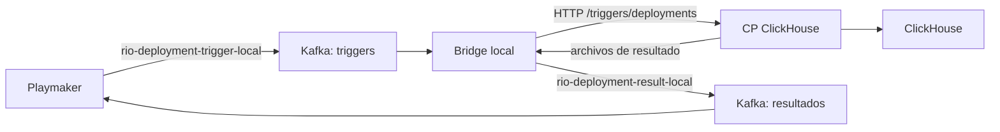

# rio-controlplane-clickhouse

> [!info]+ rio-controlplane-clickhouse
> **Rol:** Control plane RIO que gestiona el ciclo de vida de recursos ClickHouse (clusters, schemas, tablas, vistas materializadas, usuarios) vía REST y deployments dirigidos por eventos · **Área:** [[Meli]] · **Plataforma:** [[RIO]]
> **Repo:** [remote](https://github.com/melisource/fury_rio-controlplane-clickhouse) · **Local:** `~/fuentes/rio-controlplane-clickhouse` · **Lang:** Java

## 🎯 Responsabilidad (estable)
- Control plane de la plataforma de datos RIO para ClickHouse: crea/administra clusters, schemas, tablas, materialized views, usuarios/grants y warehouses.
- Orquesta deployments de forma síncrona (REST CRUD) y asíncrona (evento `DeploymentRequestedEvent` recibido vía Fury Streams), con idempotencia sobre KVS.
- Ejecuta acciones puntuales sobre ClickHouse (ej. `describe table`) y expone métricas/jobs periódicos.

## 🔌 Contratos e interacciones (semi-estable)
- **Expone:** REST para recursos y acciones; entrada de deployments en `POST /triggers/deployments` con envelope BigQueue y `DeploymentTriggerMessage`. Las tablas se provisionan mediante deployments; `GET /ping` verifica el arranque HTTP.
- **Consume / produce:** para PROVISION/UPDATE valida Context mediante el resolver del SDK; conserva `params` como configuración efectiva y un snapshot separado de Context. DEPROVISION mantiene metadata del trigger legacy. Publica `DeploymentResultMessage` en `rio-deployment-result`; en scopes desplegados usa KVS y clientes corporativos, mientras `SCOPE=local` activa estado/ownership/locks en memoria, KMS simulado y publisher de archivos.
- **Llama a / lo llaman:** recibe los triggers del deployment path de [[rio-playmaker]]; conserva contratos legacy asociados a [[rio-materializer]]. Usa ClickHouse y, fuera del scope local, servicios corporativos de discovery, estado, transporte y cifrado.

## 🧩 Implementación (volátil · last_verified: 2026-10-07)

- **Baseline inspeccionado:** `develop @ c8b20b65`, actualizado desde GitHub el 2026-10-07. La validación descrita abajo corresponde a ese commit.
- **Stack:** Java 25 · Spring Boot 4.1.1 · Gradle 9.3.1 · Jetty · SpringDoc 3.1.1.
- **Librerías verificadas:** `rio-sdk-events:1.6.1`, `com.clickhouse:client-v2:0.9.6`, `restclient-core:3.0.2`; integración Cloud Controller mediante `rio-core-java-cloud-controller-spring3:202606.29.1`.
- **Configuración local:** `application-local.yml` importa `.env` opcional y usa `CLICKHOUSE_ONPREM_USER` (default `controlplane`) y `CLICKHOUSE_ONPREM_PASSWORD`; endpoint por defecto `http://localhost:8123`. `SCOPE=local` selecciona también los adapters locales, no basta con activar únicamente el perfil Spring.

## 📍 Estado local e integración con Playmaker · 2026-10-07

| Frente | Estado observado | Alcance |
|---|---|---|
| Repositorio | Listo en develop | `develop @ c8b20b65`, alineado con origin; merge abortado y rama descartada eliminada; sin cambios trackeados |
| Tests de develop | PASS | 2335 tests, 357 clases, sin fallos, errores ni omitidos; `test bootJar` exitoso |
| Arranque del CP | PASS | `application.jar`, Java 25 y `SCOPE=local`; `/ping` devolvió `pong`, HTTP 200; proceso de prueba detenido |
| Contrato de rechazo | PASS | Trigger sin Context produjo `FAILED` en archivo de resultados; HTTP 200 fue sólo ACK |
| DDL sobre ClickHouse | No ejecutado | Imagen 25.8 disponible; no se inició el servidor ni se creó una tabla |
| Ciclo Playmaker → CP → Playmaker | No ejecutado | Ambos repos tienen transportes locales distintos y requieren conexión explícita |

### Estado del repositorio

El owner descartó `feature/new-component-context`. Se abortó el merge, se volvió a develop y se eliminó la rama local; la consulta remota confirmó que tampoco existe esa referencia en origin. Sólo permanece `graphify-out/` sin tracking, preservado. No hay decisión de merge pendiente y no se continuó la implementación antigua de adopción de inputs. [[Plan de implementación — Context en ClickHouse]] conserva su valor histórico y no define el alcance de este setup.

### Para levantarlo localmente

1. Desde el checkout `rio-controlplane-clickhouse`, usar Java 25 y configurar `.env` local, ignorado por Git: `CLICKHOUSE_LOCAL_ADMIN_PASSWORD` para el administrador Docker y `CLICKHOUSE_ONPREM_PASSWORD` para el usuario SQL `controlplane`. El README, sección On-Premise, contiene los comandos de generación de contraseñas y creación/grants del usuario; el usuario del CP debe existir antes del primer deployment.
2. Iniciar el ClickHouse del repo y luego el CP:

```bash
export JAVA_HOME="$(/usr/libexec/java_home -v 25)"
docker compose up -d clickhouse
SCOPE=local APPLICATION=rio-controlplane-clickhouse ./gradlew bootRun
```

3. Comprobar `http://localhost:8123/ping` (servidor ClickHouse) y `http://localhost:8080/ping` (CP). El profile local lee `.env` desde el root del proyecto. El CP puede arrancar sin completar el setup SQL; ping por sí solo no certifica DDL.
4. Enviar a `POST /triggers/deployments` un envelope con `msg` que contenga un trigger MergeTree, `schema_version: 1`, Context válido y params apuntando a recursos exclusivamente locales. Comprobar tabla física y archivo `bigqueue-messages/rio-deployment-result_*.json` con `message.status=COMPLETED`, correlacionado por `deployment_id`.

El CP standalone usa ClickHouse real y adapters locales para estado, locks, cifrado y transporte; no necesita Kafka para arrancar en esta modalidad.

**Gap de fixtures:** el ejemplo de provision del README y el request Bruno MergeTree consultados no traen Context. El schema 1 sí coincide con `DeploymentSchemaVersion.CURRENT` en SDK 1.5.0 y 1.6.1; el dato faltante es Context, cuya ausencia se comprobó como FAILED. Completar esa parte del fixture antes de certificar provision. Un HTTP 200 no demuestra creación de tabla.

Docker está disponible con aproximadamente 1,91 GiB asignados y un MySQL existente en 3306. No se validaron su base, usuario ni migraciones; esa instancia no puede asumirse como el MySQL de Playmaker. Dimensionar la memoria antes de iniciar el stack conjunto y mantener datos/puertos de prueba aislados.

### Integración posterior con Playmaker

Playmaker inspeccionado: `release/202610.7.0 @ 3433fc12b`, SDK `1.5.0`; no fue sincronizado ni ejecutado. Su perfil `local` usa MySQL y puerto 9090, y el loopback produce resultados simulados. Para usar Kafka real desde el checkout de Playmaker:

```bash
export JAVA_HOME="$(/usr/libexec/java_home -v 25)"
./local/00-integration-pipeline.sh
```

Ese launcher prepara MySQL, levanta Kafka 3.9.1 en `127.0.0.1:39092`, crea los topics y arranca Playmaker con `local,local-integration`, que desactiva el loopback simulado. Usa su propio `.env`; el script soporta `PLAYMAKER_ENV_FILE`, `PLAYMAKER_MYSQL_PORT` y `PLAYMAKER_KAFKA_PORT`. No inicia el CP de ClickHouse.

| Puerto host | Proceso |
|---|---|
| 8080 | CP ClickHouse |
| 8123 | ClickHouse HTTP |
| 9000 | ClickHouse protocolo nativo |
| 9090 | Playmaker HTTP |
| 3306 (configurable) | MySQL de Playmaker |
| 39092 (configurable) | Kafka de Playmaker para procesos host |

**Pieza faltante:** el CP local recibe HTTP y publica archivos en `bigqueue-messages/`; no trae consumidor/productor Kafka. Playmaker sí publica triggers en Kafka y consume resultados Kafka. Por eso levantar ambos procesos todavía no forma un ciclo conectado.

Para una primera prueba, conectar mediante un bridge local, manteniendo la lógica de deployment del CP:



El bridge debe hacer dos conversiones de transporte: envolver el payload trigger plano de Kafka en un envelope con `msg` para el endpoint HTTP, y publicar en el topic de resultados únicamente el contenido `message` del archivo cuyo `topic` es `rio-deployment-result`. Usar `deployment_id` como key Kafka, conservar orden por deployment, confirmar entrega antes de avanzar offsets/checkpoints y tolerar reentrega. Los archivos se escriben directamente: un watcher debe reintentar un JSON parcial y no publicar hasta leer un documento completo. HTTP 200 sólo confirma ACK; el resultado terminal es COMPLETED o FAILED.

Para mantener este ambiente como integración permanente, preferir un perfil `local,local-integration` en el CP con adapters Kafka propios: listener de triggers que reutilice validación/procesamiento existente y publisher de `DeploymentResultMessage` al topic de Playmaker. Así se elimina el polling de archivos y el contrato HTTP del bridge. Es trabajo futuro: no se implementó ninguno de los adapters ni se agregó Spring Kafka al CP en esta revisión.

Las signatures públicas de los DTOs principales en SDK 1.5.0/1.6.1 coinciden y ambos declaran schema 1. Falta un fixture producer-consumer para comprobar serialización/validación real. Context es requerido por el CP para PROVISION/UPDATE; el Playmaker inspeccionado deriva `latestVersion` del último deployment, por lo que los inputs históricos deben seguir separados de los `params` efectivos de la nueva solicitud.

Orden de validación: CP standalone con MergeTree físico → Playmaker/MySQL/Kafka en profile de integración → bridge o adapters → primer deployment originado en Playmaker → efecto físico, outputs y estado final persistido → update/deprovision, rechazo de Context, idempotencia, fallo DDL y timeout → cleanup de los recursos propios. Ese Kafka transporta eventos de orquestación; probar ingestión de datos mediante `kafka-to-clickhouse` agrega otro flujo y sus recursos correspondientes.

## 🔗 Relaciones
- [[rio-playmaker]]
- [[rio-materializer]]
- [[rio-controlplane-kms]]

## 📌 Provenance
- Repo: `melisource/fury_rio-controlplane-clickhouse` · Local: `~/fuentes/rio-controlplane-clickhouse`
- Fuentes leídas: `README.md`, `build.gradle`, estructura `src/main` (paquetes `cluster`, `schema`, `table`, `materializedview`, `deployment`, `users`, `warehouse`, `action`, `shared`), controllers REST (`SchemaController`, `ClusterController`, `JobController`, `ActionTriggerController`, `DeploymentEventController`, `UserProvisioningController`, `PingController`), `meli/extracted/functional-spec.md` y `meli/extracted/raw/code-analysis/{architecture,fury-services}/*.md` (specs internas generadas por reverse-eng, marcadas 🔸 CODE_ONLY). No existe `ARCHITECTURE.md` ni `graphify-out/GRAPH_REPORT.md` con contenido de arquitectura útil (solo índice de comunidades).
- Nota: el README raíz conserva el texto scaffold genérico ("basic model for JDK 25 / Spring") sin descripción de rol propia; el rol se infirió de código + specs internas `meli/extracted/*`, de ahí que igual se documenten aquí volátiles con `last_verified`.
- Baseline y preflight actuales: [[Source — ClickHouse — Preflight local 2026-10-07]]; estado Git/setup vigente: [[Source — ClickHouse — Develop y setup local 2026-10-07]]; transporte local productor/consumidor: [[Source — Playmaker — Kafka local 2026-10-07]].
- La provenance de agosto anterior conserva valor histórico; el contrato y stack vigentes son los bloques verificados el 2026-10-07.

## ✅ Tareas relacionadas

```tasks
sort by priority
not done
description includes rio-controlplane-clickhouse
short mode
hide task count
```
