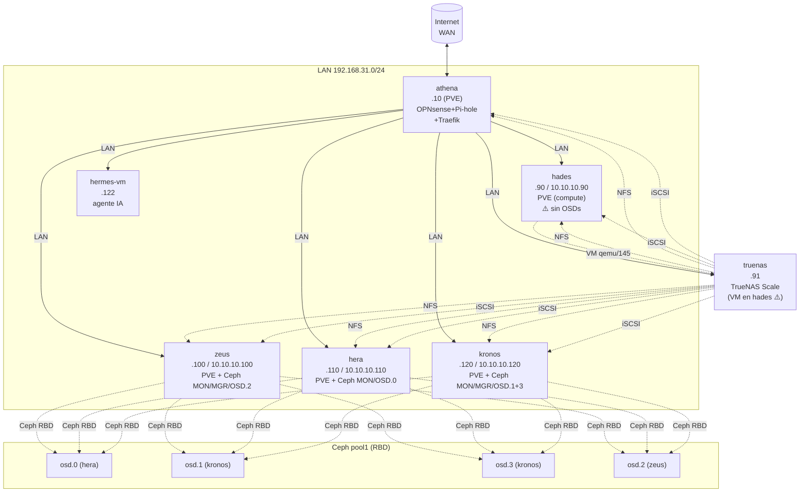

# 01 — Topología

## Propósito

Documentación canónica legacy de [[Aranea]]; se conserva el contenido histórico y su estado requiere verificación antes de uso operativo.

## Contenido


> **Cluster name**: Aranea
> **Documentado por**: Hermes (sub-agente 1, ticket `2026-06-30-010`)
> **Recolectado**: 2026-06-28 vía `agent-read all` en los 6 nodos
> **Generado**: 2026-06-30 (drift = 2 días)

## 📑 Contenido de esta carpeta

| Doc | Descripción |
|---|---|
| [[diagrama-red]] | Diagrama mermaid completo: routers, switches, VLANs, subnets |
| [[nodo-athena]] | Gateway (OPNsense + Pi-hole + Traefik) |
| [[nodo-zeus]] | Compute + Ceph MON/MGR/OSD.2 |
| [[nodo-hera]] | Compute + Ceph MON/OSD.0 |
| [[nodo-kronos]] | Storage powerhouse + Ceph MON/MGR/OSD.1+3 |
| [[nodo-hades]] | Compute-heavy (22 VMs running) ⚠️ |
| [[nodo-truenas]] | TrueNAS Scale (VM en hades) ⚠️ |
| [[red]] | DNS, OPNsense firewall, WireGuard, switch/VLAN table |
| [[fechas-captura]] | Tabla de fechas de captura por fuente |

## 🗺️ Diagrama lógico (top-level)



> [!danger] Riesgo crítico
> `hades` (qemu/145) → `truenas` → NFS + iSCSI → **prácticamente TODAS** las VMs del cluster.
> Si hades cae → truenas cae → todas las VMs quedan sin disco.

## 🏗️ Diagrama físico (inferido)

```
┌─────────────────────────────────────────────────────────────────────┐
│           Switch 10GbE (LAN + Ceph backplane)                       │
└──┬──────────┬──────────┬──────────┬──────────┬──────────┬──────────┘
   │          │          │          │          │          │
┌──┴──┐    ┌──┴──┐    ┌──┴──┐    ┌──┴──┐    ┌──┴──┐    ┌──┴──┐
│athena│   │ zeus│    │ hera│    │kronos│   │hades │   │truenas│
│ .10  │   │.100 │    │.110 │    │.120 │    │ .90  │   │ .91   │
│i7    │   │R9   │    │2xE5 │    │2xE5 │    │2xE5  │   │2xE5   │
│16t   │   │5950X│    │2699v3│   │2698v4│   │2697v4│   │2697v4 │
│16GB  │   │32t  │    │72t  │    │80t   │    │72t   │   │30t    │
│      │   │94GB │    │125GB│    │251GB │    │251GB │   │31GB   │
└──────┘   └─────┘    └─────┘    └─────┘    └──────┘   └───────┘
   │ (corosync, sin ceph)
                                                └─ truenas VM adentro
```

## 📦 Inventario global

| Nodo | IP LAN | IP Ceph | CPU | Cores | RAM | OS | Rol |
|---|---|---|---|---|---|---|---|
| **athena** | .10 | — | i7-13620H | 16t | 16 GB | Debian 12 + PVE | Network gateway |
| **zeus** | .100 | 10.10.10.100 | Ryzen 9 5950X | 32t | 94 GB | Debian 12 + PVE | Compute + Ceph MON/OSD |
| **hera** | .110 | 10.10.10.110 | 2× Xeon E5-2699 v3 | 72t | 125 GB | Debian 12 + PVE | Compute + Ceph MON/OSD |
| **kronos** | .120 | 10.10.10.120 | 2× Xeon E5-2698 v4 | 80t | 251 GB | Debian 12 + PVE | Storage powerhouse + Ceph MON/MGR/OSD×2 |
| **hades** | .90 | 10.10.10.90 | 2× Xeon E5-2697 v4 | 72t | 251 GB | Debian 12 + PVE | **Compute-heavy (22 VMs running)** ⚠️ |
| **truenas** | .91 | — | 2× Xeon E5-2697 v4 (virt) | 30t | 32 GB | TrueNAS Scale 25.04.1 | **Almacenamiento compartido (VM en hades)** ⚠️ |
| **hermes-vm** | .122 | — | (asignado) | (asignado) | (asignado) | Linux | Agente IA |

**Totales**: 302 threads / 767 GB RAM / 12 OSDs-Ceph-capacidad / 4 OSDs-Ceph-activos.

## 🔢 Versiones de software

| Componente | Versión |
|---|---|
| Proxmox VE | 8.4.19 (algunos nodos en 8.4.16 — drift menor) |
| Corosync | knet, quorum 3/5 |
| Ceph | Reef (pool1, 4 OSDs NVMe, sin versión exacta capturada) |
| Debian (PVE nodes) | 12 (bookworm) |
| Kernel PVE | 6.8.12-18-pve (athena: -17-pve, drift menor) |
| TrueNAS Scale | 25.04.1 |
| Kernel TrueNAS | 6.12.15-production+truenas |
| PVE Manager | 8.4.19/a68fb383814bb1e6 (algunos 8.4.16/368e3c45c15b895c) |

## 🏷️ Leyenda de status

- ✅ OK / funcional
- ⚠️ Warning — degraded o atención requerida
- 🟠 High — riesgo alto
- 🔴 Critical — requiere acción inmediata
- 🟡 Medium — monitoreo

## ⚡ Comandos rápidos

```bash
# Inventario rápido de un nodo
ssh agent_ro@<ip> 'sudo -n /usr/local/sbin/agent-read all'  # PVE
ssh agent_ro@192.168.31.91 'sudo -n /mnt/pool0/.agent_ro/bin/agent-read all'  # truenas

# Ver solo Ceph health
ssh agent_ro@kronos 'sudo -n /usr/local/sbin/agent-read ceph_health'

# Listar VMs de un nodo
ssh agent_ro@<nodo> 'sudo -n /usr/local/sbin/agent-read pve_resources'
```

> [!note] Bloqueador conocido
> El wrapper `agent-read` con NOPASSWD solo está aplicado donde `sudo -n` no pide password. En 2026-06-30 el `ssh agent_ro@<ip>` con `sudo -n` **falla** en athena/zeus/hera/kronos/truenas. Ver [[fechas-captura]] y [[00-index]] § roadmap para desbloquear.

---

## Source files

- `/home/hermes/aranea/topology/README.md`
- `/home/hermes/aranea/topology/services.md`
- `/home/hermes/aranea/topology/health.md`
- `/home/hermes/aranea/topology/nodes/truenas.md`
- `/home/hermes/aranea/topology/nodes/README.md`
- `/home/hermes/aranea/topology/discovery/{athena,zeus,hera,kronos,hades,truenas}_20260628_211812.txt`

## Captured

**2026-06-28 21:18 UTC** (data cruda) — **2026-06-30** (generación del doc, drift = 2 días)
