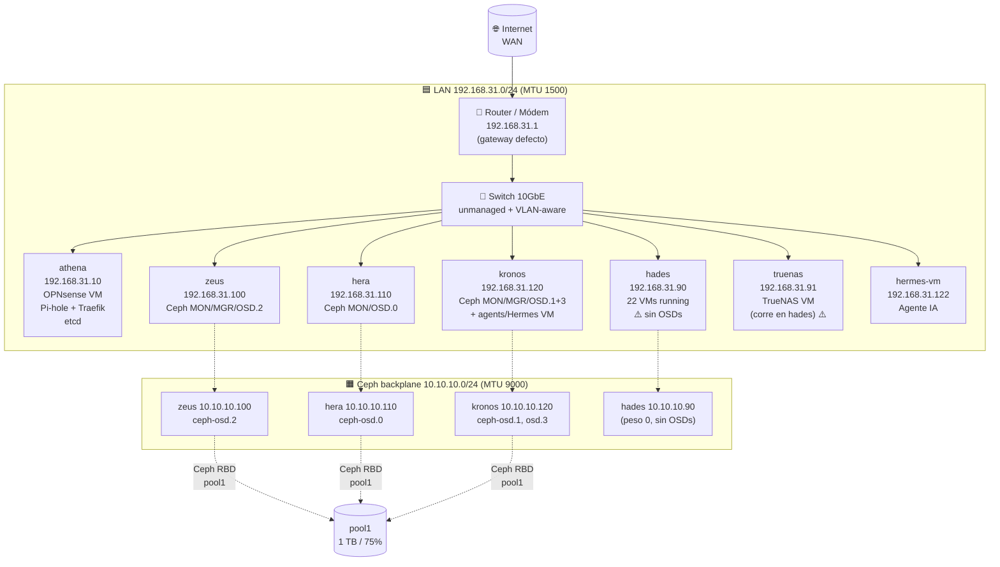

# Diagrama de red — Aranea

## Propósito

Documentación canónica legacy de [[Aranea]]; se conserva el contenido histórico y su estado requiere verificación antes de uso operativo.

## Contenido


> **Capturado**: 2026-06-28 vía `agent-read all` (puertos, IPs, listeners)
> **Generado**: 2026-06-30

## 🌐 Topología física (inferida)

```
                    ┌─────────────────────────┐
                    │  Internet (WAN)         │
                    └───────────┬─────────────┘
                                │ WAN
                                ▼
        ┌───────────────────────────────────────────────┐
        │   Router / Módem (.1) — gateway por defecto   │
        └─────────────────┬─────────────────────────────┘
                          │ LAN 192.168.31.0/24
                          │ + VLAN Ceph 10.10.10.0/24 (separada)
                          ▼
        ┌───────────────────────────────────────────────┐
        │   Switch 10GbE  (atena + Ceph backplane)      │
        │   - VLAN 1: 192.168.31.0/24                   │
        │   - VLAN 2: 10.10.10.0/24 (Ceph, MTU 9000)    │
        └──┬─────┬─────┬─────┬─────┬─────┬─────┬───────┘
           │     │     │     │     │     │     │
          athena zeus hera kronos hades truenas hermes-vm
           .10  .100 .110  .120  .90  .91    .122
```

## 🗺️ Diagrama lógico (Mermaid)



## 📋 Tabla de VLANs / subnets

| Subnet | VLAN | MTU | Propósito | Nodos miembros |
|---|---|---|---|---|
| 192.168.31.0/24 | 1 | 1500 | LAN del cluster, gestión, VMs | Todos |
| 10.10.10.0/24 | 2 | 9000 | Ceph backplane (cluster network) | zeus, hera, kronos, hades |
| (internas truenas) | — | 1500 | bond0 (LAG failover) en truenas | truenas |

> [!note] MTU 9000 en Ceph
> El backplane Ceph usa jumbo frames (MTU 9000) entre zeus, hera, kronos y hades. Esto es **correcto** para throughput Ceph — reduce overhead de headers en ~5× y mejora latencia de replicación.

## 🔗 Switch físico (no inventariado en detalle)

| Item | Estado |
|---|---|
| Marca/modelo | ❓ Necesita refresh el 2026-06-30+ |
| VLANs configuradas | Inferido por enrutamiento IP: VLAN 1 (LAN), VLAN 2 (Ceph) |
| Velocidad uplink | 10 GbE (inferido por velocidad observada en ceph-osd) |
| Managed vs unmanaged | ❓ No capturado |

> [!warning] Cableado y trunking
> El inventario **NO captura** explícitamente la configuración del switch. Se **infiere** por la coexistencia de las dos subnets con MTUs distintos (1500 y 9000).

## 🌐 Salida a Internet (OPNsense)

| Componente | Detalle |
|---|---|
| Router del ISP | `192.168.31.1` (gateway por defecto de todos los nodos) |
| Firewall | OPNsense como VM qemu/130 en athena (8 vCPU / 8 GB RAM) |
| DNS interno | Pi-hole como LXC 149 en athena |
| NAT | Vía OPNsense |
| VPN (WireGuard) | ❓ No hay WireGuard documentado en truenas/PVE; el wrapper `agent-read` no lo captura |
| Public IP | ❓ Necesita refresh — consultar interfaz WAN de OPNsense |

## 🔄 Bridges por nodo

| Nodo | Bridge | Subnet | MTU | Notas |
|---|---|---|---|---|
| athena | `vmbr1` | 192.168.31.10/24 | 1500 | Bridge LAN principal |
| athena | `vmbr0` | IPv6 link-local | 1500 | Bridge secundario (sin IPv4) |
| athena | `vmbr2` | IPv6 link-local | 1500 | Bridge tercero (sin IPv4) |
| athena | `bond0` | — | 1500 | LAG failover (2× 10GbE) |
| zeus | `vmbr0` | 192.168.31.100/24 | 1500 | LAN principal |
| zeus | `ceph` | 10.10.10.100/24 | 9000 | Ceph backplane |
| hera | `vmbr0` | 192.168.31.110/24 | 1500 | LAN principal |
| hera | `ceph` | 10.10.10.110/24 | 9000 | Ceph backplane |
| hera | `bond0` | — | 1500 | LAG failover (enp6s0 + ens14) |
| kronos | `vmbr0` | 192.168.31.120/24 | 1500 | LAN principal |
| kronos | `ceph` | 10.10.10.120/24 | 9000 | Ceph backplane |
| kronos | `bond0` | — | 1500 | LAG failover |
| hades | `vmbr0` | 192.168.31.90/24 | 1500 | LAN principal |
| hades | `ceph` | 10.10.10.90/24 | 9000 | Ceph backplane (peso 0, sin OSDs) |
| hades | `bond0` | — | 1500 | LAG failover (enp7s0 + enp8s0) |
| truenas | `bond0` | 192.168.31.91/24 | 1500 | LAG failover (enp1s0 + enp4s0f0) |
| truenas | `br0` | — | 1500 | Bridge interno sin IPv4 |

---

## Source files

- `/home/hermes/aranea/topology/README.md` (mermaid original)
- `/home/hermes/aranea/topology/00-access.md`
- `/home/hermes/aranea/topology/discovery/{athena,zeus,hera,kronos,hades,truenas}_20260628_211812.txt`
  - Secciones `ip_addr`, `ip_route`, `bridges`, `vlans`, `listeners`

## Captured

2026-06-28 21:18 UTC (datos crudos). Documento generado el 2026-06-30.
