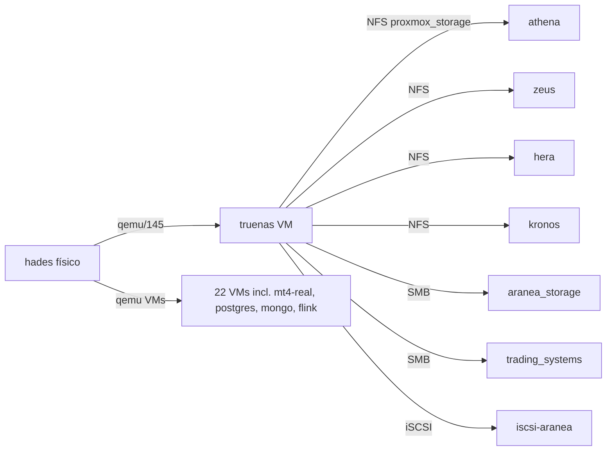

# 🔍 AUDIT — Auditoría profesional de storages Aranea

## Propósito

Documentación canónica legacy de [[Aranea]]; se conserva el contenido histórico y su estado requiere verificación antes de uso operativo.

## Contenido


> **Auditor**: Hermes (sub-agente Task 2, ticket [[../05-tickets/2026-06-30-011-aranea-storage-audit-backup]])
> **Datos crudos**: 2026-06-28 21:18 UTC (drift 2 días al 2026-06-30)
> **Ping check**: 6/6 nodos OK al 2026-06-30
> **Inventario base**: [[README]], [[inventory]], [[ceph-pool1]], [[truenas-pool0]], [[truenas-pool2]], [[nfs-shares]], [[smb-shares]], [[iscsi-target]], [[datasets]]

---

## 1. 🎯 Resumen ejecutivo

| # | Veredicto | Detalle |
|---|---|---|
| 1 | 🔴 **Crítico** | **"Turtles all the way down"**: TrueNAS corre como VM en `hades` y provee NFS/SMB/iSCSI a **todo** el cluster. hades es el SPOF del SPOF. Si hades cae, **se cae el storage compartido entero**. |
| 2 | 🔴 **Crítico** | **No existe ninguna copia fuera del host**. `pool2` (donde están los backups de `trading_systems` 305 GB, `aranea_storage` 39 GB, ISOs, `pool0_backup/`) vive en un **disco único de 7.3 TB dentro del mismo hades**. Cero 3-2-1, cero off-host. |
| 3 | 🟠 **Alto** | **`pool2` sin redundancia + scrub de 11 meses de antigüedad**. Bit-rot latente no detectable. Disco único Seagate Barracuda. |
| 4 | 🟠 **Alto** | **No hay procedimiento de restore documentado ni probado**. El cluster tiene 55 VMs definidas, ~36 running, y **cero evidencia de haber recuperado una VM completa desde backup** en producción. |
| 5 | 🟡 **Medio** | Ceph `pool1` al **75%** del usable (233 GiB libres antes de ENOSPACE), con fragmentación BlueStore >0.80 en osd.0/osd.2 y slow ops en osd.3. |

> [!danger] Riesgo existencial #1
> El cluster Aranea tiene ~20 TB de datos en producción sobre infraestructura con **dos puntos únicos de falla apilados** (hades→truenas→NFS) y **ninguna copia externa**. Una falla simultánea de hades + el disco `sdg` de pool2 = pérdida total de backups Y de gran parte del storage compartido.

---

## 2. 🐙 Ceph `pool1` (RBD distribuido)

### 2.1 Estado y capacidad

| Item | Valor | Fuente |
|---|---|---|
| Tipo | RBD (3× replicación) | [[ceph-pool1]] |
| PGs | 128 | [[ceph-pool1]] |
| Tamaño raw cluster | 3.6 TiB (4 OSDs × 932 GiB) | [[ceph-pool1]] |
| Data lógica | 708 GiB | [[ceph-pool1]] |
| Raw usado | 2.1 TiB (57%) | [[ceph-pool1]] |
| **MAX AVAIL** | **233 GiB** | [[ceph-pool1]] |
| **% pool** | **75.22%** ⚠️ | [[ceph-pool1]] |
| OSDs activos | 4 (osd.0 hera, osd.1 kronos, osd.2 zeus, osd.3 kronos) | [[ceph-pool1]] |
| OSDs sin peso | `hades` weight 0 (bridge `ceph` configurado pero sin OSDs) | [[nodo-hades]] |

### 2.2 Alertas HEALTH_WARN (activas)

| Severidad | Alerta | OSD | Host |
|---|---|---|---|
| 🟠 | BlueStore fragmentación **0.836025** | osd.0 | hera |
| 🟠 | BlueStore fragmentación **0.817956** | osd.2 | zeus |
| 🟠 | BlueStore **slow operations** | osd.3 | kronos |

### 2.3 SPOF analysis

- **Replica 3**: tolera la caída de 2 OSDs simultáneos sin pérdida. Si caen `osd.0 + osd.2` (los dos al 76%), queda un solo OSD activo con datos críticos → **riesgo alto durante resilvering**.
- **hades NO contribuye**: tiene bridge `ceph` configurado (MTU 9000), pero `weight 0`. **Capacidad desperdiciada**: hades tiene slots NVMe sin usar.
- **`nearfull` ratio**: Ceph marca `nearfull` cuando el pool supera ~85%. Con `pool1` al 75% hay ~10% de margen (~233 GiB).

### 2.4 Recomendaciones (orden de impacto)

| # | Acción | Impacto | Esfuerzo |
|---|---|---|---|
| 1 | `ceph tell osd.0 compact` + `ceph tell osd.2 compact` | Medio (reduce frag, mejora write perf) | Bajo (5 min, online) |
| 2 | Investigar slow ops osd.3 → `smartctl -a /dev/nvme1n1` en kronos | Alto (puede ser disco fallando) | Bajo |
| 3 | Agregar 2 OSDs NVMe a `hades` (balancearía carga) | Alto (saca a hades de consumidor neto) | Alto (hardware) |
| 4 | Política de scrub semanal + alertas Ceph en Prometheus | Medio | Medio |

---

## 3. 💎 TrueNAS `pool0` (storage principal compartido)

### 3.1 Topología

| Vdev | Tipo | Discos (QEMU virtio en hades) | Tamaño |
|---|---|---|---|
| mirror-0 | data | sdc ↔ sdf | 996 GB × 2 |
| mirror-1 | data | sda ↔ sdi | 996 GB × 2 |
| mirror-2 | data | sdb ↔ sdd | 996 GB × 2 |
| mirror-3 | data | sde1 ↔ sdh | 996 GB × 2 |
| **special** | metadata | sdk1 ↔ sdj1 | 476 GB × 2 (NVMe) |
| **TOTAL raw** | | **8× SSD + 2× NVMe** | **4.48 TB** |

Fuente: [[truenas-pool0]] § Topología

### 3.2 Estado (capturado 2026-06-28)

| Item | Valor | Veredicto |
|---|---|---|
| Usado | 2.49 TB (57%) | ✅ saludable |
| Fragmentación | 28% | ✅ aceptable |
| Autotrim | ON | ✅ correcto para SSD |
| Último scrub | **2026-06-28** (hoy, 1h13min, 0 errores) | ✅ reciente |
| UPS | `ups STOPPED` | 🔴 sin protección eléctrica |
| Backups off-host | ❌ ninguno | 🔴 |
| Netdata export | `127.0.0.1:6999` solo loopback | 🟡 |

### 3.3 Datasets clave (volumen + backup status)

| Dataset | Usado | Backup actual | Estado |
|---|---|---|---|
| `aranea_storage` | 998 GB | `pool2/backup/aranea_storage/` (39 GB, 1:25 ratio) | 🟠 ratio bajo |
| `proxmox_storage` | 372 GB | NFS compartido (mismo sitio) | 🔴 mismo host |
| `trading_systems` | 485 GB | `pool2/backup/trading_systems/` (305 GB, 1:1.6 ratio) | 🟠 mismo host |
| `trading_documents` | 24 MB | ❌ sin backup | 🔴 |
| `apps/frigate/storage/media` | ❓ creciendo | ❌ sin backup | 🟠 NVR es voluminoso |
| `apps/postgresql` | ❓ | ❓ | 🟡 |
| `apps/mongodb` | ❓ | ❓ | 🟡 |

Fuente: [[datasets]]

### 3.4 Análisis

- **pool0 está bien de salud** (scrub reciente, mirror OK, autotrim OK), pero **vive dentro de hades como VM**. Los 9 discos virtio de QEMU son archivos `lv`/`qcow2` en los SSDs de hades → si hades pierde la controladora o los SSDs fallan simultáneamente, `pool0` desaparece aunque ZFS estuviera sano.
- **El "backup" de trading_systems en pool2** no es un backup — es el mismo host físico (hades). Falla de hades = pérdida de original Y de su backup.

---

## 4. ⚠️ TrueNAS `pool2` (bulk storage)

### 4.1 Topología

| Item | Valor | Riesgo |
|---|---|---|
| Topología | **1 disco simple** `sdg1` (NO mirror) | 🔴 |
| Disco físico | ST8000DM004-2U9188 (Seagate Barracuda 8 TB) | HDD consumer-grade |
| Raw | 7.99 TB | |
| Usado | 3.51 TB (44%) | |
| **Último scrub** | **2025-07-12** (hace 11 meses) | 🔴 fuera de ventana |
| Autotrim | OFF | OK para HDD |
| Serial | ZR15Y75T | |

Fuente: [[truenas-pool2]]

### 4.2 Blast radius — qué se pierde si `sdg` falla

| Contenido | Tamaño | Criticidad |
|---|---|---|
| `backup/trading_systems/` | 305 GB | 🔴 producción |
| `backup/aranea_storage/` | 39 GB | 🟠 |
| `backup/iso_storage/` | 15 GB | 🟡 recuperable (descarga) |
| `backup/portainer/` | 995 MB | 🟡 |
| `pool0_backup/` | ❓ espejo lógico de pool0 | 🔴 peor caso |
| `zfs_backup/` | ❓ | 🟠 |

> [!danger] Lo peor del diseño
> `pool2` es donde **el cluster deposita sus backups**, y `pool2` es **un solo HDD de 7.3 TB en el mismo hades**. Es una bomba de tiempo: si ese disco muere, **se pierde el backup de lo que se estaba respaldando**.

### 4.3 Acción inmediata (sin riesgo)

```bash
# Validar integridad AHORA (lectura, no escritura)
ssh agent_ro@192.168.31.91 "zpool scrub pool2"

# Verificar SMART del disco
ssh agent_ro@192.168.31.91 "smartctl -a /dev/sdg"
```

---

## 5. 🌐 NFS Exports (proxmox_storage + Frigate + trading_documents)

### 5.1 Mapa

| Path truenas | Redes permitidas | Tamaño libre | Función | Riesgo |
|---|---|---|---|---|
| `/mnt/pool0/proxmox_storage` | **sin restricción** ⚠️ | 1.2 TB / 1.5 TB | Datastore NFS Proxmox (ISOs, templates, **vzdump**) | 🔴 SPOF hades |
| `/mnt/pool0/apps/frigate/config` | 192.168.31.0/24 | ❓ | Config Frigate | 🟠 |
| `/mnt/pool0/apps/frigate/storage/media` | 192.168.31.0/24 | ❓ (crece) | Videos NVR | 🟠 sin backup |
| `/mnt/pool0/trading_documents` | sin restricción | 24 MB | Compartido | 🟡 |

Fuente: [[nfs-shares]]

### 5.2 Hallazgos

- **`proxmox_storage` exportado sin restricción de red**: cualquier IP puede montarlo. Para homelab OK, pero documentar.
- **vzdump en `nfs-storage` con `prune-backups=keep-all=1`** (configurado en PVE storage) → **el datastore NFS crece sin tope**. Es uno de los consumidores del 25% usado (372 GB).
- **Sin Kerberos / NFSv4 con seguridad** mejorada. OK para LAN, pero exponer a WAN sin NFSv4+kerberos es invitación a disaster.

---

## 6. 📁 SMB Shares

### 6.1 Mapa

| Share | Path | Guest OK | Tamaño | Auth |
|---|---|---|---|---|
| `aranea_storage` | `pool0/aranea_storage` | no | 998 GB | local users |
| `trading_systems` | `pool0/trading_systems` | no | 485 GB | local users |
| `trading_documents` | `pool0/trading_documents` | **SÍ** ⚠️ | 24 MB | sin auth |

Fuente: [[smb-shares]]

### 6.2 Hallazgo crítico

> [!warning] `trading_documents` con `guestok = true`
> Cualquier host de la LAN puede leer este share sin autenticarse. **Confirmar con Rodrigo si es intencional**. Si NO, desactivar vía:
> ```bash
> midclt call smb.update 4 '{"guestok": false}'
> ```

---

## 7. 💽 iSCSI Target

### 7.1 Configuración

| Item | Valor |
|---|---|
| Portal | `192.168.31.91:3260` |
| Target IQN | `truenas.aranea.local:truenas` |
| Storage Proxmox | `iscsi-aranea` (declarado) |
| LUNs exportados | 6 (~600 GB total: 50/200/200/32/32/100 GB) |

Fuente: [[iscsi-target]]

### 7.2 Estado real

- El storage `iscsi-aranea` **está declarado en Proxmox pero NO se usa activamente** como datastore para crear VMs.
- Los LUNs aparecen como **dispositivos raw/filesystem locales en cada PVE node** — probablemente **legacy** (¿volúmenes ZFS de truenas exportados vía iSCSI para uso en hades como virtio disks de truenas misma, lo cual sería circular?).
- **No hay documentación** de qué hace cada LUN.

### 7.3 SPOF analysis

- 🔴 Si hades cae → truenas cae → iSCSI cae → los 6 LUNs desaparecen de los 5 PVE nodes simultáneamente.
- 🟡 Los LUNs como `raw` o `xfs`/`ext4` en cada PVE generan confusión (¿es local o compartido? ¿es seguro escribir?).

### 7.4 Recomendación

- **Auditar cada LUN**: ¿se usa realmente? ¿es ZFS volume de truenas? ¿es legacy?
- Evaluar **migrar a RBD o NFS** consolidado (eliminar iSCSI si no es necesario).

---

## 8. 📊 Dataset-level breakdown

### 8.1 Lo más grande

| Asset | Tamaño | Nodo | Backup actual | Acción |
|---|---|---|---|---|
| Ceph `pool1` data útil | 708 GB | distribuido | ❌ snapshot Ceph automático no confirmado | Configurar snapshot schedule |
| `aranea_storage` | 998 GB | truenas VM | parcial en `pool2/backup/aranea_storage` (39 GB, 1:25) | Investigar ratio bajo |
| `trading_systems` | 485 GB | truenas VM | parcial en `pool2/backup/trading_systems` (305 GB, 1:1.6) | Mismo host ⚠️ |
| `proxmox_storage` | 372 GB | truenas VM | vzdump en el mismo NFS | Snapshots + off-host |
| VM `ubuntu-dev` (qemu/159) | 100 GB | hades | ❓ | Backup completo VM |
| VM `sqx-ulab-zeus-0` (qemu/108) | 50 GB + data 600 GB | zeus | ❓ | Backup de la VM + dataset |

### 8.2 Lo que crece sin control

- **NVR Frigate**: `apps/frigate/storage/media` en pool0. Sin backup. Tamaño exacto no capturado el 2026-06-28 (❓), pero la VM tiene **10.5 TB NetIn acumulado** según [[nodo-hades]]. Si una fracción se persiste → dataset en pool0.
- **LVM locales por nodo** (`local-sqx-*`): 931 GB × 3 (zeus, hera, kronos), usados por SQX. SQX-ulab datasets valen research de Rodrigo → **críticos**.

---

## 9. ⚠️ Cross-cutting risks

### 9.1 [🔴] TrueNAS-en-hades → blast radius



**Blast radius**: hades = ~22 VMs running + 5 PVE nodes que dependen de su NFS + todo backup que vive en `pool2` que vive en hades.

**Mitigación (Task 2 propone)**:
- (corto plazo) Backups off-host → pool2 deja de ser la única copia
- (mediano plazo) **Mover TrueNAS a bare-metal** en una de las máquinas hoy ociosas (kronos tiene 251 GB RAM, solo 24 GB usados)
- (largo plazo) HA con `zfs send` automático + PBS remoto

### 9.2 [🟠] hades NO contribuye a Ceph

- hades está en corosync con quórum ✅
- hades tiene bridge `ceph` configurado (MTU 9000) ✅
- hades tiene slots NVMe libres ✅
- hades **no corre ceph-mon/ceph-osd/ceph-mgr** ❌
- Aparece en `ceph_osd_tree` como `host hades weight 0`

**Consecuencia**: hades es **consumidor neto** de Ceph. Crece su uso de disco → crece Ceph → Ceph ya está al 75%. Si hades prendiera las 16 VMs stopped, el cluster saturaría `pool1` (y nadie puede escribir más en Ceph).

### 9.3 [🔴] Sin off-host copy en ningún storage

- `pool0` (4.4 TB) → sin backup off-host
- `pool2` (7.9 TB, los backups) → sin backup off-host
- Ceph `pool1` (3.6 TB raw) → sin backup off-host
- VMs en Ceph RBD → sin vzdump off-host confirmado
- minio (20 GB) → sin backup off-host
- step-ca DB → sin backup off-host (claves privadas en riesgo)

**Mitigación prioritaria**: identificar hardware target (¿kronos local-sqx-kronos 931 GB libre? ¿un disco USB externo? ¿un VPS barato con `rclone crypt`?).

### 9.4 [🔴] Sin restore probado

- No hay ticket que documente un restore completo de VM
- No hay ticket que documente un restore desde ZFS snapshot off-host
- No hay ticket que documente un restore de CouchDB (Obsidian vault)
- No hay runbook de DR (este folder 04-backups/ está vacío — esa es la razón de Task 2)

**Consecuencia**: si el dueño necesita restaurar, va a improvisar bajo presión, con alto riesgo de error.

---

## 10. 🚀 Oportunidades de mejora (ranked por impacto/esfuerzo)

| # | Oportunidad | Impacto | Esfuerzo | Recomendación |
|---|---|---|---|---|
| 1 | **Off-host backup destination** (3-2-1 mínimo) | 🔴 Crítico | Bajo si hay hardware | ⭐ PRIORIDAD 1 |
| 2 | **Scrub manual inmediato de pool2** + política automática mensual | 🔴 Alto | Bajo | ⭐ PRIORIDAD 1 |
| 3 | **Ceph OSD.0/OSD.2 compact** + investigar slow ops osd.3 | 🟠 Alto | Bajo | ⭐ PRIORIDAD 2 |
| 4 | **Snapshots ZFS automatizados** (sanoid o `zfs-auto-snapshot`) en pool0/pool2 | 🟠 Alto | Medio | ⭐ PRIORIDAD 2 |
| 5 | **PBS (Proxmox Backup Server)** en LXC de kronos para vzdump centralizado | 🟠 Alto | Medio | ⭐ PRIORIDAD 3 |
| 6 | **Migrar TrueNAS a bare-metal** (kronos) | 🟠 Alto (estructural) | Alto | Pendiente |
| 7 | **Replicación PostgreSQL** a kronos (streaming) | 🟠 Alto | Medio | Pendiente |
| 8 | **Replica set MongoDB** mínimo 3 nodos | 🟠 Alto | Alto | Pendiente |
| 9 | **UPS para TrueNAS** + configurar shutdown ordenado | 🟡 Medio | Medio (hardware) | Pendiente |
| 10 | **Documentar off-host copy target** + cifrar | 🔴 Crítico | Bajo | ⭐ PRIORIDAD 1 |

---

## 11. 🚧 Riesgos NO abordados (honestidad total)

| # | Riesgo | Status al 2026-06-30 |
|---|---|---|
| 1 | **No hay off-host copy de nada** | 🔴 Aceptado por owner — gap enorme |
| 2 | **No hay restore probado** | 🔴 No documentado |
| 3 | **agent_ro SSH NOPASSWD roto en 5/6 nodos** | 🟠 Gap #1 del roadmap 00-index |
| 4 | **Inventario con drift 2 días** | 🟡 Re-ejecutar agent-read cuando se desbloquee (1) |
| 5 | **Discos de hades son QEMU virtio** (no bare-metal) | 🟡 Latencia adicional + point of failure |
| 6 | **iSCSI LUNs sin documentar uso** | 🟡 |
| 7 | **Snapshots ZFS automáticas: política NO documentada** | 🟡 `zfs list -t snapshot` no capturado |
| 8 | **Truenas corre rc-local.service failed** | 🟡 Menor, denota drift |
| 9 | **hades RAM al 74%** | 🟡 Margen limitado |
| 10 | **OPNsense SPOF en athena** | 🟠 Si athena cae → red cae (fuera de scope storage pero adyacente) |

---

## 12. 📌 Top 5 acciones inmediatas (ordenadas)

| # | Acción | Tiempo | Riesgo | Bloqueado por |
|---|---|---|---|---|
| 1 | `zpool scrub pool2` en truenas | 5 min (lanzar), 8-12 h (completar) | Cero (read-only) | SSH agent_ro + sudo |
| 2 | `ceph tell osd.0 compact && ceph tell osd.2 compact` | 2 min (lanzar), variable (completar) | Bajo | SSH agent_ro + sudo |
| 3 | `smartctl -a /dev/nvme1n1` en kronos (osd.3 slow ops) | 1 min | Cero | SSH agent_ro + sudo |
| 4 | `zfs list -t snapshot -o name,creation,used,refer` en truenas (auditar qué snapshots existen) | 30 s | Cero | SSH agent_ro + sudo |
| 5 | Definir target off-host y diseñar política ZFS send/receive | 1-2 h (diseño) | — | Decisión owner |

> [!warning] Bloqueador común
> 4 de 5 acciones requieren **SSH agent_ro con sudo NOPASSWD**, que está roto en 5/6 nodos desde antes del 2026-06-30. Ver [[../05-tickets/README]] § bloqueador.

---

## Source files

- `/home/hermes/obsidian/SecondBrain/main/30-resources/aranea/03-storage/README.md`
- `/home/hermes/obsidian/SecondBrain/main/30-resources/aranea/03-storage/inventory.md`
- `/home/hermes/obsidian/SecondBrain/main/30-resources/aranea/03-storage/ceph-pool1.md`
- `/home/hermes/obsidian/SecondBrain/main/30-resources/aranea/03-storage/truenas-pool0.md`
- `/home/hermes/obsidian/SecondBrain/main/30-resources/aranea/03-storage/truenas-pool2.md`
- `/home/hermes/obsidian/SecondBrain/main/30-resources/aranea/03-storage/nfs-shares.md`
- `/home/hermes/obsidian/SecondBrain/main/30-resources/aranea/03-storage/smb-shares.md`
- `/home/hermes/obsidian/SecondBrain/main/30-resources/aranea/03-storage/iscsi-target.md`
- `/home/hermes/obsidian/SecondBrain/main/30-resources/aranea/03-storage/datasets.md`
- `/home/hermes/obsidian/SecondBrain/main/30-resources/aranea/01-topologia/nodo-truenas.md`
- `/home/hermes/obsidian/SecondBrain/main/30-resources/aranea/01-topologia/nodo-hades.md`
- `/home/hermes/obsidian/SecondBrain/main/30-resources/aranea/01-topologia/nodo-kronos.md`
- `/home/hermes/obsidian/SecondBrain/main/30-resources/aranea/02-servicios/bases-de-datos.md`
- `/home/hermes/obsidian/SecondBrain/main/30-resources/aranea/02-servicios/backup-storage.md`
- `/home/hermes/obsidian/SecondBrain/main/30-resources/aranea/02-servicios/trading.md`
- `/home/hermes/obsidian/SecondBrain/main/30-resources/aranea/02-servicios/dns-tls.md`
- `/home/hermes/obsidian/SecondBrain/main/30-resources/aranea/06-diagramas/topologia-completa.md`

## Captured

**Datos crudos**: 2026-06-28 21:18 UTC (drift 2 días al 2026-06-30).
**Doc generado**: 2026-06-30 por Hermes (Task 2, ticket [[../05-tickets/2026-06-30-011-aranea-storage-audit-backup]]).
**Próximo refresh recomendado**: aplicar NOPASSWD y re-ejecutar `agent-read all` (ver [[../01-topologia/fechas-captura]] § bloqueadores).
