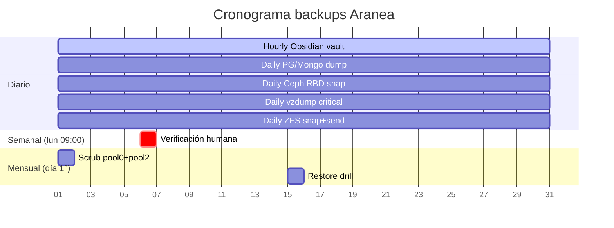

## Propósito

Procedimiento operacional histórico de [[Aranea]]; validar los datos volátiles antes de ejecutarlo.

## Procedimiento

****# 04 — Backups (runbook operativo)

> **Propietario**: Hermes + Rodrigo
> **Diseñado**: 2026-06-30 (Task 2, ticket [[../05-tickets/2026-06-30-011-aranea-storage-audit-backup]])
> **Diseño conceptual**: ver [[../03-storage/BACKUP-SYSTEM]]
> **Auditoría de storages**: ver [[../03-storage/AUDIT]]

## 🎯 Objetivo de esta carpeta

Runbooks **operativos** — paso a paso, idempotentes donde posible, sin instrucciones destructivas (`rm -rf`, `zpool destroy`, `wipefs`) salvo confirmación explícita. Cada runbook asume que [[../03-storage/BACKUP-SYSTEM]] ya fue revisado.

## 📑 Contenido

| Doc | Cuándo se ejecuta | Descripción |
|---|---|---|
| [[runbook-semanal]] | Cada lunes 09:00 hora Chile (cron sugerido) | Verificar estado de backups, scrub ZFS, validar tamaños, alertas Ceph |
| [[runbook-mensual]] | Día 1° de cada mes 02:00 hora Chile | Scrubs programados, prune-backups, restore drill mensual, rotación USB |
| [[runbook-incidentes]] | **Bajo demanda** cuando algo se rompe | Disco falla, OSD muere, VM truenas no bootea, CouchDB corrupta, ransomware suspected |
| [[recovery-procedures]] | **Bajo demanda** en disaster | Restore VM, restore dataset, restore Proxmox scratch, restore Obsidian |

## 📅 Cronograma visual (resumen)



## ⚠️ Bloqueador activo

> [!warning] SSH agent_ro NOPASSWD roto en 5/6 nodos
> La mayoría de comandos asumen que `ssh agent_ro@<ip> "sudo -n ..."` funciona.
> Hasta que se arregle (gap #1 del roadmap, ver [[../00-index]]), los runbooks son **diseño + checklist**, no ejecutables end-to-end.

## 🧭 Quick reference

```bash
# Convenciones usadas en todos los runbooks
export KEY="/home/hermes/.ssh/agent_ro_aranea"
NODES=(athena zeus hera kronos hades)
TRUENAS_IP=192.168.31.91

# SSH helper
ssha() { ssh -i "$KEY" -o IdentitiesOnly=yes -o BatchMode=yes "$@"; }

# Validar un comando sin ejecutarlo (dry-run)
ssha agent_ro@192.168.31.91 'echo $(sudo -n echo "sudo OK") || echo "sudo BROKEN"'
```

## 🔗 Crosslinks

- [[../03-storage/BACKUP-SYSTEM]] — diseño completo (3-2-1, threat model, cadencias)
- [[../03-storage/AUDIT]] — qué está mal y por qué importa
- [[../03-storage/truenas-pool0]] / [[../03-storage/truenas-pool2]] / [[../03-storage/ceph-pool1]] — referencia de cada storage
- [[../05-tickets/README]] — workflow de tickets (todo cambio material va como ticket)

## Captured

2026-06-30. Diseñado por Hermes Task 2 (ticket [[../05-tickets/2026-06-30-011-aranea-storage-audit-backup]]).

## Validación

- Verificar precondiciones y resultados del procedimiento antes de declarar éxito.
