# Topología completa — Aranea

## Propósito

Documentación canónica legacy de [[Aranea]]; se conserva el contenido histórico y su estado requiere verificación antes de uso operativo.

## Contenido


> **Capturado**: 2026-06-28
> **Generado**: 2026-06-30
> **Tipo**: Mermaid (soportado nativamente en Obsidian)

## 🕸️ Vista global del cluster

```mermaid
flowchart TB
    Internet[("🌐 Internet<br/>WAN")]

    subgraph LAN["🟦 LAN 192.168.31.0/24 (MTU 1500)"]
        direction TB
        Router["🛜 Router / Módem<br/>192.168.31.1<br/>(gateway defecto)"]

        subgraph PVE_NODES["5 nodos Proxmox VE"]
            athena["🟢 athena<br/>.10<br/>OPNsense + Pi-hole<br/>+ Traefik + etcd<br/>4 VMs (19.5 GB RAM)"]
            zeus["🟢 zeus<br/>.100<br/>Ceph MON+MGR<br/>+ sqx-ulab-zeus-0<br/>3 VMs (87 GB RAM)"]
            hera["🟢 hera<br/>.110<br/>Ceph MON<br/>+ kafka-hera<br/>3 VMs (28 GB RAM)"]
            kronos["🟢 kronos<br/>.120<br/>Ceph MON+MGR<br/>+ agent (Hermes)<br/>4 VMs (24 GB RAM)"]
            hades["🟡 hades<br/>.90<br/>22 VMs running<br/>⚠️ 74% RAM"]
        end

        subgraph VMS["🔥 VMs críticas corriendo en hades"]
            truenas["🔴 truenas VM<br/>qemu/145<br/>(corre EN hades)"]
            mt4["💹 mt4-real (qemu/124)<br/>💹 mt4-ftmo (qemu/133)<br/>💹 mt4-ttp (qemu/134)"]
            dbs["🗄️ PostgreSQL (qemu/152)<br/>🗄️ MongoDB (qemu/153)"]
            flink["📊 docker-flink (lxc/126)<br/>32 GB RAM"]
        end

        hermes_vm["🤖 hermes-vm<br/>.122 (Agente IA)"]
    end

    subgraph CEPHNET["🟧 Ceph backplane 10.10.10.0/24 (MTU 9000)"]
        direction TB
        osd0["OSD.0<br/>hera<br/>932 GiB<br/>76% usado ⚠️"]
        osd1["OSD.1<br/>kronos<br/>932 GiB<br/>35% usado"]
        osd2["OSD.2<br/>zeus<br/>932 GiB<br/>76% usado ⚠️"]
        osd3["OSD.3<br/>kronos<br/>932 GiB<br/>40% usado ⚠️"]
        RBD[("pool1 (RBD)<br/>708 GiB / 233 GiB avail<br/>75% pool ⚠️")]

        osd0 --> RBD
        osd1 --> RBD
        osd2 --> RBD
        osd3 --> RBD
    end

    subgraph TRUENAS["🟪 TrueNAS VM (qemu/145 en hades) ⚠️"]
        direction TB
        truenas_boot["boot-pool<br/>30 GB / SO"]
        pool0["pool0 (4 mirrors + special)<br/>4.4 TB raw / 2.5 TB usados<br/>57% — OK"]
        pool2["pool2 (single disk ⚠️)<br/>7.9 TB raw / 3.5 TB usados<br/>44% — sin redundancia"]

        truenas_boot --> truenas
        pool0 --> truenas
        pool2 --> truenas

        NFS[("NFS: proxmox_storage<br/>+ frigate config/media<br/>+ trading_documents")]
        SMB[("SMB: aranea_storage<br/>trading_systems<br/>trading_documents (guest-ok ⚠️)")]
        ISCSI[("iSCSI: iscsi-aranea<br/>LUNs para PVE")]

        pool0 --> NFS
        pool0 --> SMB
        pool0 --> ISCSI
    end

    Internet --> Router
    Router --> athena & zeus & hera & kronos & hades & hermes_vm

    hades -.->|"qemu/145<br/>⚠️ SPOF"| truenas
    truenas -.->|"NFS"| NFS
    truenas -.->|"SMB"| SMB
    truenas -.->|"iSCSI"| ISCSI

    athena --> NFS & SMB
    zeus --> NFS & ISCSI
    hera --> NFS & ISCSI
    kronos --> NFS & ISCSI
    hades --> NFS & ISCSI

    zeus --> osd2
    hera --> osd0
    kronos --> osd1
    kronos --> osd3

    RBD -.->|"storage pool1"| zeus & hera & kronos & hades & athena

    hades --> mt4
    hades --> dbs
    hades --> flink

    %% Kafka cluster
    subgraph KAFKA["🟨 Kafka cluster (3 brokers)"]
        k_zeus["kafka-zeus (qemu/139)"]
        k_hera["kafka-hera (qemu/136)"]
        k_kronos["kafka-kronos (qemu/138)"]
        k_zeus --> flink
        k_hera --> flink
        k_kronos --> flink
    end

    %% Estilos
    classDef critical fill:#fee,stroke:#c00,stroke-width:3px
    classDef warning fill:#ffd,stroke:#c80,stroke-width:2px
    classDef ok fill:#dfd,stroke:#0a0,stroke-width:1px

    class truenas,pool2 critical
    class hades,osd0,osd2,osd3,RBD warning
    class athena,zeus,hera,kronos,pool0 ok
```



## 🔑 Puntos críticos del diagrama

1. **SPOF central**: `hades` corre `truenas` (qemu/145) que provee NFS/SMB/iSCSI a TODO el cluster.
2. **Ceph**: 4 OSDs en hera/kronos/zeus. hades NO contribuye (weight 0).
3. **Bases de datos**: PostgreSQL + MongoDB en hades (concentration risk).
4. **MT4 trading**: 5 instancias en hades (incluyendo cuenta real).
5. **Kafka**: 3 brokers distribuidos (resiliencia), consumer Flink en hades.

## 🚨 Cadenas de falla

```
Si hades cae:
├── truenas VM cae
│   ├── NFS (proxmox_storage) cae
│   │   ├── athena pierde acceso a ISOs/templates/backups
│   │   ├── zeus pierde acceso a ISOs/templates/backups
│   │   ├── hera pierde acceso a ISOs/templates/backups
│   │   ├── kronos pierde acceso a ISOs/templates/backups
│   │   └── hades (ya caído)
│   ├── SMB cae (aranea_storage, trading_systems, trading_documents)
│   └── iSCSI cae (iscsi-aranea)
├── MT4 trading cae (5 instancias, incluida cuenta real)
├── PostgreSQL cae
├── MongoDB cae
├── docker-flink cae (32 GB RAM stream processor)
├── docker-frigate cae (NVR)
├── homeassistant cae
├── obsidian-sync cae (CouchDB)
└── minio cae
```

---

## Source files

- `/home/hermes/aranea/topology/discovery/{athena,zeus,hera,kronos,hades,truenas}_20260628_211812.txt`
- `/home/hermes/aranea/topology/README.md`
- `/home/hermes/aranea/topology/services.md`
- `/home/hermes/aranea/topology/health.md`

## Captured

2026-06-28 21:18 UTC. Doc generado 2026-06-30.
