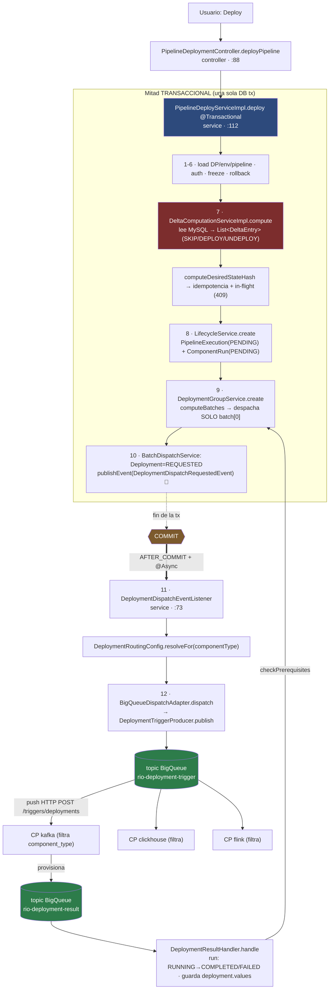

# RIO — Playmaker: flujo de deploy interno (as-is, código verificado)

> [!info] Vista de arquitectura del [[00-index|RIO Atlas]]
> Ruteo **end-to-end** del `POST /pipeline/deploy` dentro de [[rio-playmaker]]: qué pasa antes del delta, cómo se computa el delta, la máquina de estados de la ejecución, el batching por dependencias, el dispatch async, y la topología de colas hasta el CP. Complementa [[signals-context-flow]] (contrato de properties) con la **mecánica de orquestación**. Path de params revalidado contra código el 2026-08-19. Es **comprensión as-is** (insumo del [[Onboarding Signals]]), no el cambio de [[Crear Context]].

## Síntesis vigente

El deploy tiene **dos mitades separadas por el commit de la transacción**:

1. **Mitad transaccional (síncrona, una sola DB tx `@Transactional`):** carga entidades → valida → computa el **delta** (qué cambió) → chequea idempotencia por hash → crea el expediente (`PipelineExecution` + `ComponentRun`) → ordena en batches → crea intentos `Deployment=REQUESTED` → publica un **evento Spring in-JVM** (no envía nada aún).
2. **Mitad de dispatch (asíncrona, `AFTER_COMMIT` + `@Async`):** recién cuando el commit fue exitoso, un listener resuelve el transporte por `component_type` y **publica el `DeploymentTriggerMessage` a la cola BigQueue `rio-deployment-trigger`**.

La clave de diseño: **nunca se manda un trigger a un CP si la transacción hizo rollback.**

---

## Paso a paso (capa · archivo · qué hace)

### Paso 1-6 — Antes del delta (todo dentro de `PipelineDeployServiceImpl.deploy`)

Capa: **Service (orquestador)** · `service/impl/PipelineDeployServiceImpl.java:112`
El método es `@Transactional`: **toda la mitad de abajo corre en una sola transacción**.

| # | Qué hace | Colaborador · línea | Falla → HTTP |
|---|---|---|---|
| 1 | Carga el DataProduct por nombre | `DataProductRepository.findByName` · :119 | 404 `NotFoundException` |
| 2 | Carga el Environment activo (scoped al DP) | `EnvironmentRepository.findActiveByNameAndDataProductId` · :124 | 404 |
| 3 | Carga el Pipeline del DP (1 pipeline por DP) | `PipelineRepository.findByDataProductId` · :129 | 404 |
| 4 | Resuelve identidad del caller (Tiger token → username) | `TigerTokenServiceImpl.getAuthToken` · :134 | 401 |
| 5 | **Freeze global**: ¿hay congelamiento de deploys en este env? | `DeploymentFreezeServiceImpl.enforcePipelineDeploy` · :136 | 423 LOCKED |
| 6 | Resuelve configs de rollback (si el request trae `sourcePipelineExecutionId`) | `resolveRollbackConfigs` · :138 | 400 si no pertenece al pipeline |

> [!note] Cada componente NO hace algo distinto en estos pasos
> Los pasos 1-6 son a nivel **pipeline/DP completo**, no por componente. La diferenciación por componente recién aparece en el delta (paso 7).

### El tema de la VERSIÓN (importante para [[Crear Context]])

> [!warning] En el path de deploy **NO hay optimistic locking `@Version`**
> Busqué en todo `deploy` y en `PipelineExecutionModel`: **no existe** un check de `pipelineVersion` ni columna `@Version` en la ejecución.
>
> - **`pipeline.version`** (optimistic lock real) sólo protege el **`PUT /pipeline`** (editar la topología), vía `PipelineRepository.checkAndIncrementVersion` (`UPDATE pipeline SET version=version+1 WHERE id=:id AND version=:clientVersion`, `repository/PipelineRepository.java:32`). Devuelve `1` si matcheó, `0` si el cliente venía stale. Hay `unconditionalIncrementVersion` para "apply-blindly" cuando el front no manda versión.
> - **Lo que protege deploys concurrentes es OTRA cosa**: un **hash de estado deseado + chequeo de in-flight** (ver abajo). El 409 de "ya hay un deploy corriendo" sale de ahí, **no** de un version mismatch.
>
> **Gap para versioning:** el `computeDesiredStateHash` hashea sólo `componentId:configId` (no el contenido de los params). Si los parámetros de una definición mutan **in-place sin cambiar el `configId`**, el hash no cambia y el deploy se considera idempotente → no se re-despliega. Este es el punto fino a resolver en un esfuerzo de versionado. Ver también `versionDraftDefinitions` (`:217`) que promueve drafts `semver=0.0.0` a una versión real antes de registrar la ejecución (relevante para history/rollback).

### Paso 7 — El DELTA: ¿qué cambió y qué operación aplica?

Capa: **Service (pipeline)** · `service/pipeline/impl/DeltaComputationServiceImpl.java`
Llamado desde `PipelineDeployServiceImpl:142`.

**Sí, consulta MySQL** — lee 5 repositorios (batch-prefetch para evitar N+1):

| Lectura | Repo · línea | Representa |
|---|---|---|
| Componentes activos del DP | `componentRepository.findActiveByDataProductId` · :74 | **topología deseada** |
| Última versión de definición por componente | `componentDefinitionRepository.findLatestVersionsByComponentIds` · :87 | **config deseada (global)** |
| Slot por environment | `serviceRepository.findByComponentIdInAndEnvironmentId` · :95 | **config deseada (por env)** |
| Deployment activo por service | `deploymentRepository.findByServiceIdInAndIsActiveTrue` · :103 | **estado desplegado** |
| Último run por componente | `componentRunRepository.findLastRunsByComponentIds` · :109 | detección de retry de fallidos |

**`DeltaEntry`** (`service/pipeline/DeltaEntry.java`): record `(componentId, action, configId, serviceId, componentType)`.

**`DeltaAction`** tiene **sólo 3 valores** (NO hay CREATE/ALTER/DELETE separados):

- `SKIP` — ya está en el estado deseado, no se despliega.
- `DEPLOY` — provisiona o actualiza (create y update son **el mismo** `DEPLOY`; se distinguen sólo por si `serviceId` es null = primera vez).
- `UNDEPLOY` — se sacó de la topología, hay que desmontarlo.

> [!important] Respuesta directa: NO se traduce a comandos create/alter/delete acá
> Playmaker **no** decide "ejecutá CREATE TABLE" ni "ALTER". Sólo dice `DEPLOY` o `UNDEPLOY` con la config deseada (`configId`). **Es el CP** el que, al recibir el trigger, decide si crea, altera o no hace nada (idempotencia del lado del CP). El "create vs update" real vive en el control plane, no en el playmaker.

**La lógica de decisión por componente** (`evaluateComponent`, :133). Primero resuelve el `configId` deseado con precedencia **rollback > slot por env > última global**, luego 5 reglas:

1. `service == null` → **DEPLOY** (primera vez, sin slot).
2. `pendingConfigId != deployedConfigId` → **DEPLOY** (cambió la config; comparación por **igualdad de `configId`**, no diff de contenido).
3. slot en `PENDING_REMOVAL` → **UNDEPLOY**.
4. último run `FAILED` → **DEPLOY** (retry).
5. si nada de lo anterior → **SKIP** (nada cambió).

**`computeDesiredStateHash`** (:193): SHA-256 sobre las entries no-SKIP ordenadas, formato `componentId:configId` por línea. Es la llave de idempotencia del paso siguiente.

### Concurrencia de deploys (dónde sale el 409)

Todo esto sigue **antes de cualquier dispatch**, en `PipelineDeployServiceImpl`:

- Filtro por `request.getComponents()` si viene (:145).
- `force=true` reescribe `SKIP` con `configId` conocido → `DEPLOY` (re-deploy del estado actual, :155).
- Delta vacío → `NoDeployableComponentsException` → **400** (:163).
- Freeze por **tipo de componente** (segundo check, sólo sobre `DEPLOY`, :173).
- **Idempotencia**: si existe una ejecución `COMPLETED` con el mismo hash+pipeline y no es `force`, **devuelve la ejecución vieja** sin desplegar (:183).
- **In-flight guard** (siempre, incluso con `force`): si hay una ejecución `RUNNING` o `PENDING` con el mismo hash → `ExecutionInProgressException` → **409** (`PipelineDeploymentController:177`).

### Paso 8 — El expediente (entidades + estado)

Capa: **Service (pipeline)** · `service/pipeline/impl/PipelineExecutionLifecycleServiceImpl.java:61`

Crea **1 `PipelineExecution`** (`PENDING`) + **1 `ComponentRun` por cada delta no-SKIP** (`PENDING`, con `runOrder` = orden del batch).

**`PipelineExecutionModel`** (`model/PipelineExecutionModel.java`): `id` (UUID app-assigned), `pipeline`, `environment`, `type`, **`status`**, `desiredStateHash`, `createdBy`, `completedAt`. Estados (`PipelineExecutionStatus`): `PENDING`, `RUNNING`, `COMPLETED`, `FAILED`, `PARTIAL_FAILURE` (los 3 últimos son finales).

**`ComponentRunModel`**: `id`, `pipelineExecution`, `component`, `componentDefinition` (=config), **`status`**, `runOrder`, `startedAt`, `completedAt`, `error`. Unique `(pipeline_execution_id, component_id)` → un run por componente por ejecución. Estados (`ComponentRunStatus`): `PENDING`, `RUNNING`, `COMPLETED`, `FAILED`, `CANCELLED`.

> [!note] Respuesta directa: sí, cada deploy crea filas nuevas
> Cada `deploy` que pasa los guards llama a `lifecycleService.create`, que **siempre** hace `save(...id(UUID.randomUUID())...)` → **nueva `PipelineExecution` + nuevos `ComponentRun`** cada vez. Los guards de idempotencia son justo lo que evita duplicados (devuelven la vieja o tiran 409).

**Sí, el estado se actualiza con las respuestas de los CPs, vía tópico.** Es el **RESULT LOOP**:

- Tópico: **`rio-deployment-result`** (`application-production.yml:68`).
- Entrada: `DeploymentResultConsumerController` — `POST /events/deployment/result`, body `BigQueueMessage<DeploymentResultMessage>` (`controller/DeploymentResultConsumerController.java:45`).
- Handler: `DeploymentResultHandlerImpl.handle` (`service/impl/DeploymentResultHandlerImpl.java:105`, `@Transactional`). Resuelve el `Deployment` por correlation id, resuelve el `ComponentRun`, y transiciona según `DeploymentResultStatus`:
  - `STARTED` → run `RUNNING`.
  - `IN_PROGRESS` → guarda output, sin cambio de estado.
  - `COMPLETED` → run `COMPLETED`; `deployment.isActive=true`; `service.status=RUNNING`; **guarda `deployment.values` (los outputs del CP)**; llama `orchestrationService.checkPrerequisites` (avanza al siguiente batch).
  - `FAILED` → run `FAILED`; guarda `error`; `orchestrationService.propagateFailure`.

Máquinas de estado: run = `PENDING → RUNNING → COMPLETED|FAILED|CANCELLED`; deployment = `REQUESTED → STARTED → COMPLETED|FAILED`.

### Paso 9 — Ordenar en batches (dependencias)

Capa: **Service** · `service/impl/DeploymentGroupServiceImpl.java:67` + `service/pipeline/impl/TopologicalSortServiceImpl.java`

- Filtra no-SKIP → `computeBatches` → guarda `DeploymentGroup` (`PENDING`) → **despacha SÓLO `batches.get(0)`** (`:107`) → group+execution a `RUNNING`.

> [!important] Respuesta directa: NO se despachan todos los batches de una
> Sólo el batch 0. **El batch N+1 se despacha recién cuando TODOS los componentes del batch N reportan `COMPLETED`** (desde el result loop, `OrchestrationServiceImpl.checkPrerequisites:56`). Un fallo corta la cadena: `propagateFailure` pone en `CANCELLED` los runs pendientes de mayor `runOrder`. **Esta es la garantía de orden real** — la da la máquina de estados de Playmaker, no la cola.

> [!warning] Hotfix activo: ordenamiento topológico DESHABILITADO
> `TopologicalSortServiceImpl.java:33` tiene `FORCE_CONFIG_ORDER = true` (marcado `ponytail: TEMPORARY HOTFIX`). Hoy **todo deploy usa `configOrderBatches`** (agrupa por `orderConfig.orderFor(componentType)`: no-engines en batch 0, engines en batch 1), NO el sort por relaciones. El Kahn topological sort real existe pero está dormido bajo el flag (se desactivó porque las relaciones vía `PATCH updateRelations` del front producían batches incorrectos). Revertir = poner el flag en `false`.

### Paso 10-11 — Dispatch async (el "aha" de Spring)

**Paso 10 — publicar el evento** · `service/pipeline/impl/BatchDispatchServiceImpl.java:241`
Por cada item: crea `Deployment=REQUESTED` (`createDeploymentAttempt:252`), CAS de correlation id, y:
```java
eventPublisher.publishEvent(new DeploymentDispatchRequestedEvent(request));
```
`DeploymentDispatchRequestedEvent` es **un record plano** que lleva sólo el `DispatchRequest` (no la entidad, para que el listener re-fetchee fresco). En try/catch: si falla al publicar, marca el `Deployment` `FAILED`.

Antes de construir ese request, `BatchDispatchServiceImpl` obtiene `resolvedParameters + references + paths` de una única ejecución de `ParameterResolutionService.resolveWithMetadata`; `paths` preserva la correspondencia configuración→consumidor cuando `DestinationParseService` filtra/reindexa arrays. Luego deserializa el mapa efectivo y `ComponentContextBuilder` calcula el Context efímero. `DispatchRequest` guarda `params` y `context` por separado. Ninguno se persiste como parte del evento in-JVM.

**Paso 11 — el listener** · `service/pipeline/impl/DeploymentDispatchEventListener.java:73`
```java
@Async(ExecutorConfig.ASYNC_EXECUTOR)
@TransactionalEventListener(phase = TransactionPhase.AFTER_COMMIT)
public void onDispatchRequested(DeploymentDispatchRequestedEvent event) {
  try {
    transportRegistry.resolve(request.componentType(), request.version()).dispatch(request);
  } catch (RuntimeException e) {
    safelyFailDeploymentAttempt(request.deploymentId());
  }
}
```

> [!note] Respuestas directas a "cómo/dónde/qué escucha/si falla"
> - **¿Cómo es async?** Es 100% capacidad de **Spring**, sin infra propia. `@TransactionalEventListener(AFTER_COMMIT)` bufferea el evento y lo entrega **sólo si la tx commiteó** (rollback → nunca se entrega → nunca se manda trigger). `@Async` lo corre en otro hilo.
> - **¿Qué escucha?** NO es una tabla/cola/flag. Es un **`ApplicationEvent` in-JVM** (in-process). Sale de la memoria de Spring, nunca se persiste ni encola.
> - **¿Está en el mismo proyecto?** Sí, mismo servicio `rio-playmaker`. Publisher y listener conviven.
> - **¿Qué thread pool?** `ExecutorConfig` bean `asyncExecutor` (`config/ExecutorConfig.java:57`): `ThreadPoolTaskExecutor` core=max=`${async.executor.pool-size:16}`, envuelto en `MeliExecutors.trace(...)` (telemetría). `@EnableAsync @EnableScheduling`.
> - **¿Si falla el async DESPUÉS del commit?** El `catch (RuntimeException)` llama `safelyFailDeploymentAttempt`, que corre `failDeploymentAttempt` en un **`TransactionTemplate` PROPAGATION_REQUIRES_NEW** (marca el `Deployment` `FAILED`, `isActive=false`). Tiene un try/catch **interno** para que una excepción marcando el fallo no aborte los `afterCommit()` de los otros items del batch.
> - **¿Cómo se "cancela"/reintenta?** Hay un **timeout job**: `DeploymentTimeoutJob` (`@Scheduled` cada 3 min, `service/pipeline/DeploymentTimeoutJob.java:100`). Busca deployments `REQUESTED`/`STARTED` pasados de `timeout_at`: `REQUESTED` bajo max intentos → **re-publica el trigger** + `retryCount++`; `REQUESTED` en max → `failDeployment`; `STARTED` → falla inmediato (no reintenta, riesgo de doble deploy). `timeout_at` lo arma el adapter (`BigQueueDispatchAdapter:55`), default 600s. Config en `DeploymentTimeoutConfig` (maxAttempts=2, backoff=60s).

### Paso 12 — Al buzón

`service/pipeline/impl/BigQueueDispatchAdapter.dispatch:52` → `buildTriggerMessage` (`DeploymentTriggerMessage`) → `DeploymentTriggerProducerImpl.publish:43` → `Producer.send(...)` → topic **`rio-deployment-trigger`**.

---

## Topología de colas (cómo consumen los CPs)

> [!important] Veredicto: UNA cola compartida + filtro por `component_type` (NO cola por CP)
> Playmaker publica **todos** los triggers (de todos los tipos) a un **único topic `rio-deployment-trigger`**. **No hay ruteo por CP en el producer.** Los 3 CPs consumen el mismo topic y **cada uno filtra por `component_type`**, haciendo **ack-and-discard (HTTP 200)** de lo que no es suyo. El contrato lo dice explícito: `DeploymentTriggerMessage` javadoc — *"`component_type` is the sole routing key. CP services filter on this field."*

**Cómo llega:** no es un consumer polling — es **BigQueue → push HTTP** a `POST /triggers/deployments` de cada CP.

**El filtro por CP (ack-and-discard):**

| CP | Allowlist | Filtro · línea |
|---|---|---|
| kafka | `aws-msk-topic, gcp-kafka-topic, kafka-topic` | `DeploymentTriggerController.java:97` (`!configuredComponentTypes.contains(...)` → `200 OK`) |
| clickhouse | `ClickHouseComponentTypes.SUPPORTED` | `DeploymentEventController.java:53` |
| flink | `flink-sql, aws-flink-job` | `DeploymentTriggerController.java:96` (`FlinkComponentType.fromValue == null`) |

> [!warning] Allowlist del CP ≠ routing de Playmaker
> Kafka CP acepta `gcp-kafka-topic`, pero `rio-playmaker/src/main/resources/application.yml:161-197` no lo enumera como `BIG_QUEUE`; el catch-all lo deriva a materializer. De forma análoga, aliases visibles en el front (`flink-job`, `aws-flink-sql`, `clickhouse-matview`, `clickhouse-table`) no coinciden con los tipos exactos aceptados por sus CP. Inventario completo → [[signals-context-flow]].

> [!warning] Veredicto ordenamiento: NO hay orden garantizado por la cola
> - El path de deployment de BigQueue **no tiene partition/ordering key** (el `segmentId` es tenant/routing, no orden).
> - Cada CP procesa cada trigger en `Executors.newVirtualThreadPerTaskExecutor()` (1 virtual thread por mensaje, sin serialización por key) → **puede procesar fuera de orden incluso dentro de un mismo CP y mismo data_product**.
> - El sistema **asume desorden y se protege**: `DeploymentResultMessage` javadoc — una vez que un `deployment_id` llega a estado terminal, resultados posteriores se descartan (out-of-order guard).
> - El orden entre componentes lo impone **Playmaker** (batch N+1 sólo tras batch N `COMPLETED` + `component-order`), NO el transporte.
> - Existe transporte ordenado (Fury Streams `PerKeySequencer`, `rio.streams.ordering.enabled`) pero **NO está cableado** en este flujo — este usa BigQueue.

**Round trip:** Playmaker → `rio-deployment-trigger` → (todos los CPs, filtran) → CP que matchea provisiona → `rio-deployment-result` → Playmaker `/events/deployment/result`.

---

## Diagrama



---

## Puntos calientes para [[Crear Context]] / versioning

1. **Resolución previa + lineage interno** (`BatchDispatchServiceImpl:158-170,315-358`): `ParameterResolutionService` ejecuta `DestinationParseService` + `ParametersParseService` una sola vez y retorna facts del mismo lookup runtime. El builder conserva configuración, output productor y valor efectivo separados, filtra por consumer demostrado y marca gaps sin inventar valores. `BigQueueDispatchAdapter:80-96` continúa copiando sólo `request.params()` al trigger; Context queda interno y no reemplaza ni valida el contrato de deploy.
2. **Hash sin contenido de params** (`computeDesiredStateHash`): sólo `componentId:configId`. Mutar params in-place sin nuevo `configId` = deploy considerado idempotente. Punto fino de versionado.
3. **`FORCE_CONFIG_ORDER=true`**: ordenamiento por relaciones deshabilitado por hotfix — el "dueño de las relaciones" mal definido (deuda del front) rompió el topological sort. Es evidencia para definir la fuente de cálculo de `Context`, no alcance para migrar o retirar la lógica existente.
4. **Sin `@Version` en deploy**: la concurrencia se maneja por hash+in-flight, no por optimistic lock. Si se agrega versionado de contrato, definir dónde vive la versión (¿pipeline?, ¿definición?, ¿params?).

## Evidencia y provenance

- Inspección de primera mano en código local de [[rio-playmaker]] y [[rio-sdk-events]]; flujo general verificado el 2026-08-17 y fork de params pipeline/legacy revalidado el 2026-08-19 después de actualizar Playmaker a `d1741b8`. El cambio de comportamiento entró en `fa73018a`.
- Archivos eje: `PipelineDeploymentController.java`, `PipelineDeployServiceImpl.java`, `BatchDispatchServiceImpl.java`, `DeploymentDispatchEventListener.java`, `BigQueueDispatchAdapter.java`, `DeploymentResultHandlerImpl.java`, `TopologicalSortServiceImpl.java`, `DeploymentTriggerMessage.java` y `DeploymentResultMessage.java`.
- Los detalles field-level de params/outputs y sus gaps se mantienen en [[signals-context-flow]].

## Relacionado

- [[signals-context-flow]] — contrato params → outputs por CP (el "qué" que viaja en `params`).
- [[deploy-component]] — narrativa/dolor del journey.
- [[playmaker-deployment-idempotency-and-cp-kvs]] — idempotencia por comando en los CPs, KVS como claim optimista y límite frente a duplicidades creadas por Playmaker.
- [[Crear Context]] — proyecto de cambio (crear un `Context` efímero en Playmaker, sin reemplazar `parameters`).
- [[Onboarding Signals]] — comprensión del ecosistema.
