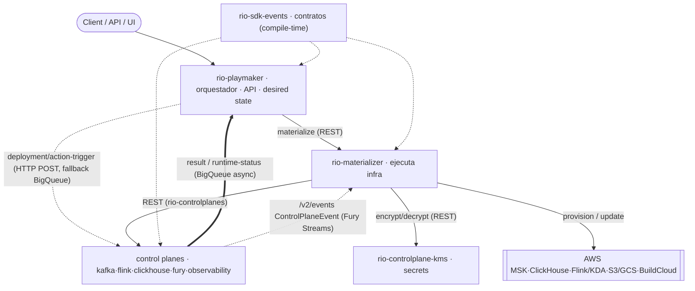

# RIO — System Map

> [!info] Qué es
> La imagen mental única de **RIO como sistema** (vista de 30 s): cómo una intención entra, cruza apps, toca infra y vuelve como estado/resultado. Detalle y evidencia por integración en [[integration-map]]. Parte del [[00-index|RIO Atlas]] · Plataforma [[RIO]].

## Síntesis vigente

- **Quién recibe la intención / orquesta:** [[rio-playmaker]] (API + orquestador, dueño del *desired state* y del catálogo de componentes/data products).
- **Quién decide por runtime:** los **control planes**, expertos por tecnología — [[rio-controlplane-kafka]], [[rio-controlplane-flink]], [[rio-controlplane-clickhouse]], [[rio-controlplane-fury]], [[rio-controlplane-observability]].
- **Quién ejecuta la infra real:** [[rio-materializer]] (K8s/MSK/ClickHouse/Flink-KDA/S3-GCS/BuildCloud), delegando secrets en [[rio-controlplane-kms]].
- **Dónde viven los contratos:** [[rio-sdk-events]] (jar compartido en compile-time: `DeploymentEvent`, `ControlPlaneEvent`, …).
- **Regla sync/async:** comandos hacia adelante = **síncronos** (Playmaker→control planes por HTTP POST; Playmaker→Materializer y Materializer→(KMS, control-planes) por REST). Resultados/estado hacia atrás = **async por BigQueue** (`rio-*-result`, `rio-component-runtime-status`); ciclo de vida hacia Materializer por Fury Streams (`/v2/events`).

## Evidencia y provenance

- Derivado desde `~/fuentes/*/src/main/**` (config `application*.yml` con comentarios `PRODUCER`/`CONSUMER` y "pushed via HTTP POST" + controllers) vía [[rio-inspector]]; grafo generado en `~/fuentes/rio-inspector/rio-integrations.json`.
- Tabla completa producer→consumer→transport→channel en [[integration-map]].
- `last_verified: 2026-08-10` · `confidence: high` para las direcciones de los canales `*-result`/`*-status` (BigQueue) y `*-trigger` (HTTP).

## Límites y contradicciones

- **Transporte del trigger — corregido (2026-08-11, ver [[deploy-request-path]]):** en el path de deploy actual Playmaker **no** hace HTTP POST directo al control plane; **publica a BigQueue `rio-deployment-trigger`** y la cola entrega por **HTTP push** al controller del CP (`POST /triggers/deployments`). "Es HTTP" y "es BigQueue" son ambas ciertas: la cola es el transporte, el POST su mecanismo de entrega. Los HTTP clients de CP del diagrama los usa service-actions (start/stop), no el deploy.
- **Orden real del fan-out — resuelto (2026-08-11):** no hay fan-out simultáneo; es **fork por tipo de componente** (`routingConfig` en `application.yml`): tipos modernos → BigQueue→CP directo (sin materializer); catch-all `*/*` (catalog/signal + no listados) → `MATERIALIZER_REST`. Detalle en [[deploy-request-path]].
- **`OWNS` / `DOES NOT OWN` (abierto):** solape aparente Materializer vs control planes (ambos con clientes ClickHouse).
- `rio-controlplane-clickhouse` consume trigger (HTTP) pero no se detectó su canal de result.
