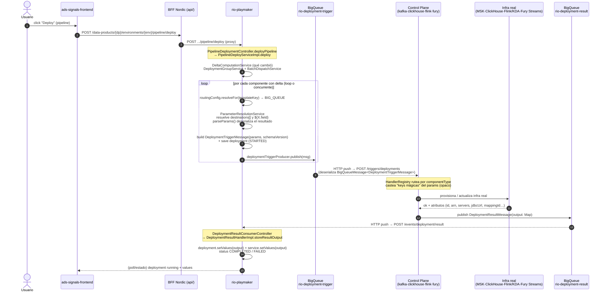
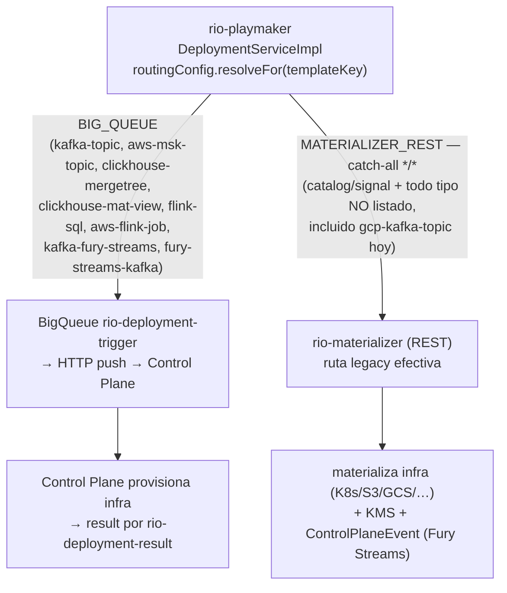

# RIO — Journey: camino de un request de deploy (diagrama end-to-end)

> [!info] Vista de journey del [[00-index|RIO Atlas]]
> Traza **qué pasa cuando el front de signals manda a deployar**: qué servicio llama, qué genera Playmaker, cómo viaja por la cola, quién reacciona y hasta dónde llega (incluido [[rio-materializer]]). Complementa a [[deploy-component]] (el **contrato de I/O** as-is + dolor) y a [[signals-context-flow]] (el **contrato params→outputs por control plane**); esta página es el **mapa del transporte y el ciclo de vida de un deploy**. Insumo directo de [[Crear Context]]. Trazado de primera mano en código local (2026-08-11).

## Síntesis vigente

Un deploy no es una llamada síncrona que "instala" algo: es un **comando asíncrono con result de vuelta**. El front hace `POST .../pipeline/deploy` a [[rio-playmaker]]; Playmaker **calcula el delta**, por cada componente **resuelve sus parámetros** (outputs `destinations[]` + placeholders `${X.field}`), arma un `DeploymentTriggerMessage` y —según una **tabla de ruteo por tipo de componente**— lo **publica a la cola BigQueue `rio-deployment-trigger`** (path moderno) o lo manda por REST a [[rio-materializer]] (catch-all legacy). El control plane recibe el trigger (BigQueue lo entrega por **HTTP push** a su controller), provisiona la infra real, y publica el resultado a `rio-deployment-result`, que BigQueue entrega de vuelta (HTTP push) a Playmaker; Playmaker **guarda el `output` en `deployment.values`**. Ese `values` es lo que después resuelve los `${X.field}` de otros componentes.

**En una frase:** el front hoy **proyecta** gran parte del contrato; Playmaker persiste el mapa y ambos paths resuelven referencias antes de despachar, pero sin validar el mapa contra un contrato vigente por tipo ni demostrar lineage mediante relaciones. El routing decide BigQueue o materializer por `component_type`; el catch-all incluye cualquier tipo no listado, incluso aliases cuyo CP sí existe.

## Diagrama — path moderno (BigQueue → control plane)

## Diagrama — fork de ruteo (dónde entra materializer)

## Respuestas directas (a las preguntas del onboarding)

- **¿Qué servicio usa el front?** [[rio-playmaker]] (vía el BFF Nordic del propio front). No hay otro backend en el medio para disparar el deploy.
- **¿Qué endpoint?** Front nuevo (`ads-signals-frontend`): `POST /data-products/{dp}/environments/{env}/pipeline/deploy` — deploy **a nivel de pipeline** (despliega todos los componentes con delta pendiente). Front legacy (`rio-frontend`): `POST /v2/data-products/{dp}/environments/{env}/components/{comp}/deployments?definitionId={id}` — deploy **por componente**.
- **¿Dónde el front proyecta el I/O?** Antes del deploy, al guardar `ComponentDefinition.parameters`: arma `destinations[]`, `properties_map`, presets y placeholders `${...}`. No “setea los outputs reales”: esos los produce el CP/materializer después de provisionar y vuelven en `DeploymentResultMessage.output`.
- **¿Playmaker resuelve los placeholders en ambos paths?** Sí en HEAD `d1741b8`. El legacy ejecuta sus parsers desde `DeploymentServiceImpl`; el pipeline llama el wrapper `ParameterResolutionService` antes de `parseParams`. Esto resuelve valores, pero no valida un contrato I/O por `component_type` ni prueba lineage estructural.
- **¿Qué genera Playmaker?** Un `DeploymentTriggerMessage` con `params: Map<String,Object>`, un registro `deployment` y, al volver el result, persiste/mezcla los outputs en `deployment.values` y `service.values`. El contenido de `params` depende del path anterior.
- **¿Cómo lo envía a la "cola"?** `deploymentTriggerProducer.publish(msg)` → **BigQueue topic `rio-deployment-trigger`** (mqclient `Producer`). **No** es un HTTP POST directo al CP (ver corrección abajo).
- **¿Cómo lo usan los CP?** BigQueue entrega el mensaje por **HTTP push** al controller del CP (`POST /triggers/deployments`, que deserializa `BigQueueMessage<DeploymentTriggerMessage>`); el `HandlerRegistry` rutea por `componentType` y cada handler **castea sus keys concretas** del `params` (contrato implícito por tipo) para provisionar la infra. El mapa completo params→outputs por CP está en [[signals-context-flow]].
- **¿Llega a materializer?** **Depende del tipo exacto.** Sólo los tipos enumerados en `application.yml` van por BigQueue; el catch-all `*/* → MATERIALIZER_REST` recibe catalog/signal y cualquier tipo no listado. Hallazgo concreto: Kafka CP acepta `gcp-kafka-topic`, pero Playmaker no lo enumera y lo manda al catch-all. El detalle de aliases/routing está en [[signals-context-flow]].

## Anatomía del path (as-is, con provenance)

1. **Front dispara** → `useDeployPipeline` `apiPost` (`ads-signals-frontend/src/features/deploy-pipeline/model/useDeployPipeline.ts:441`) → BFF `api/pipeline/index.ts:91-130` proxya a Playmaker `POST /data-products/{name}/environments/{envName}/pipeline/deploy`. Legacy: `deployComponent` (`rio-frontend/services/v2/deployments.ts:41`).
2. **Playmaker recibe** → `PipelineDeploymentController.deployPipeline` `@PostMapping .../pipeline/deploy` (`rio-playmaker/.../controller/PipelineDeploymentController.java:88`) → `PipelineDeployServiceImpl.deploy` (`:47`) → `DeltaComputationService` + `DeploymentGroupService` + `BatchDispatchServiceImpl` (`service/pipeline/impl/BatchDispatchServiceImpl.java:241`). Legacy: `ComponentDeploymentController.deploy` `@PostMapping /deployments` (`controller/ComponentDeploymentController.java:73`).
3. **Fork de ejecución** → el path pipeline crea un `DispatchRequest` y resuelve transporte mediante `DeploymentDispatchEventListener`/`TransportRegistry`; el legacy usa `DeploymentServiceImpl.routingConfig.resolveFor(templateKey, version)` y mantiene el catch-all de materializer.
4. **Params + Context del pipeline** → `BatchDispatchServiceImpl` llama `ParameterResolutionService.resolveWithMetadata`; `DestinationParseService` y `ParametersParseService` resuelven una sola vez y adjuntan tanto los facts del lookup de `service.values` como `configuredPath → consumerPath` cuando `destinations[]` se filtra/reindexa. `parseParams` deserializa el JSON resuelto; `ComponentContextBuilder` cruza raw + effective + esa metadata y el `DispatchRequest` lleva params/Context separados. `BigQueueDispatchAdapter.buildTriggerMessage` copia sólo `request.params()` al trigger.
5. **Params del legacy** → `DeploymentServiceImpl.resolveComponentParameters:957-987` llama `DestinationParseServiceImpl` y `ParameterParseServiceImpl`, que reemplazan `${...}` leyendo `service.values.get(field)` del componente encontrado por nombre/ambiente; falla si no hay service `running` o property.
6. **Arma y publica trigger** → ambos caminos construyen `DeploymentTriggerMessage(params, DeploymentSchemaVersion.CURRENT)` y publican sobre `rio-deployment-trigger` cuando el transporte es BigQueue.
7. **CP consume (HTTP push de BigQueue)** → controller del CP deserializa el mensaje; el handler/parser lee keys concretas y provisiona (ver [[signals-context-flow]]).
8. **CP publica result** → `DeploymentResultMessage(output: Map)` → BigQueue `rio-deployment-result`.
9. **Playmaker consume/persiste result** → `DeploymentResultHandlerImpl.storeResultOutput:375-426` mezcla el output y serializa el mismo mapa en `deployment.values` y `service.values`.
10. **Reuso del output** → un deploy posterior con `${X.field}` puede resolver esa key desde `service.values` en pipeline y legacy. No existe validación que cruce ese lookup con `component_type_registry.output_schema`.

## Ruta materializer (catch-all, en deprecación)

- `DeploymentServiceImpl.java:710-712` `case MATERIALIZER_STREAM, MATERIALIZER_REST -> createLegacy(...)` → `materializerService.doMaterialize(...)` (`:245`).
- HTTP `MaterializerClient` / `MaterializerClientImpl`, base-url `rio-materializer-prod.melisystems.com` (`application-production.yml:25-27`); `MaterializerServiceImpl` special-case `CATALOG_SIGNAL_TEMPLATE_CODE` (`:181`).
- [[rio-materializer]] materializa infra real (K8s/MSK/ClickHouse/Flink-KDA/S3-GCS/BuildCloud), cifra vía KMS y propaga `ControlPlaneEvent` por Fury Streams (`/v2/events`). Según el equipo (2026-08-11) solo le queda **el flujo de componentes de inicio de Signals/Catalog**; el resto ya migró a la ruta directa.

## Por qué importa para [[Crear Context]]

- El contrato vigente está **distribuido** entre proyección del front, parsers/handlers de CP, output builders y persistencia/lookup de Playmaker.
- Para [[Crear Context]], este journey no define un “punto de reemplazo”: identifica los datos y caminos que el builder efímero debe entender. La iniciativa crea `Context` en paralelo y mantiene `parameters` intacto.
- Los dos paths son un gate de cobertura: comparten parsers, pero no el mismo entry point ni el mismo objeto interno. El builder del pipeline recibe explícitamente parámetros crudos, efectivos y metadata de la única resolución; legacy/componente y materializer directo todavía no tienen ese carrier y no crean Context.

## Evidencia y provenance

- Trazado de primera mano en código local; fork de params pipeline/legacy y persistencia de outputs revalidados el 2026-08-19. Divergencia histórica: `8887122` no tenía resolución en el pipeline; `fa73018a` la añadió y está presente en HEAD `d1741b8`.
- Front: `ads-signals-frontend/src/features/deploy-pipeline/model/useDeployPipeline.ts:441`, `api/pipeline/index.ts:91-130`; legacy `rio-frontend/services/v2/deployments.ts:41`, `app/cqrs/impl/DeploymentCommand.tsx:12`.
- Playmaker: `controller/PipelineDeploymentController.java:88`, `service/impl/PipelineDeployServiceImpl.java:47`, `service/pipeline/impl/BatchDispatchServiceImpl.java:157-164,241,378-391`, `service/ParameterResolutionService.java:28-40`, `service/impl/DeploymentServiceImpl.java:70,691,860,892,919-937,957`, `config/DeploymentRoutingConfig.java:50`, `service/pipeline/impl/DeploymentTriggerProducerImpl.java:32-45`, `controller/DeploymentResultConsumerController.java:45`, `service/impl/DeploymentResultConsumerServiceImpl.java:52`, `service/impl/DeploymentResultHandlerImpl.java:262,387,389`, `restclient/MaterializerClientImpl.java`, `service/impl/MaterializerServiceImpl.java:181`, `service/impl/UndeployServiceImpl.java:280`, `src/main/resources/application.yml:162-197`, `application-production.yml:25-27,67,68`.
- SDK: `DeploymentTriggerMessage.java`, `DeploymentResultMessage.java` ([[rio-sdk-events]]).
- Contrato params→outputs por CP: [[signals-context-flow]]. Narrativa del contrato y dolor: [[deploy-component]].
- `last_verified: 2026-08-19` · `confidence: high` para el fork Playmaker; la cobertura field-level por tipo sigue abierta en [[signals-context-flow]].

## Límites y contradicciones

- **Corrección de transporte (vs [[system-map]]):** el system-map (2026-08-10) modeló el trigger como "**HTTP POST directo** al CP, BigQueue solo fallback V1". El código del path de deploy muestra lo inverso: **el trigger viaja por BigQueue `rio-deployment-trigger`**; no existe ninguna llamada `/triggers/deployments` saliente en `rio-playmaker/src/main`. Los HTTP clients de CP (`ControlPlaneClient`=KMS, Kafka/Flink) los usa **service-actions** (start/stop), no el deploy. Se reconcilia así: **BigQueue entrega por HTTP push** al controller del CP, así que "es HTTP" y "es BigQueue" son ambas ciertas — la cola es el transporte, el POST es su mecanismo de entrega. El comentario del propio YAML tilda BigQueue de "V1 fallback" pero es lo que el producer implementa hoy.
- **Cobertura de handlers:** [[signals-context-flow]] cerró `28/28` tipos de la unión y deja GAP explícito cuando el source no demuestra handler, routing o versión runtime.
- **Punto de cifrado KMS:** el contrato dice que valores sensibles van pre-encriptados, pero el punto exacto de cifrado en front/playmaker no se ubicó.
- **Race condition de `destinations[]`:** el sync del catalog-signal tiene debounce de 2 s en el front; si el deploy arranca antes, la señal se crea sin destinations (bug central que justifica mover la lógica al backend). Ver [[signals-context-flow]].

## 🔗 Relaciones
- complementa [[deploy-component]] · [[signals-context-flow]] · [[system-map]] · [[integration-map]]
- insumo de [[Crear Context]]
- parte de [[Onboarding Signals]]
- documenta [[ads-signals-frontend]] · [[rio-frontend]] · [[rio-playmaker]] · [[rio-materializer]] · [[rio-controlplane-kafka]] · [[rio-controlplane-clickhouse]] · [[rio-controlplane-flink]] · [[rio-controlplane-fury]] · [[rio-sdk-events]]
