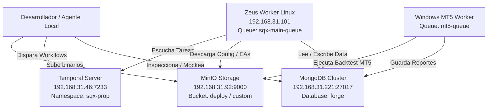

# Symphony & Zeus Remote Worker Troubleshooting Guide

## Propósito

Este runbook sirve como una guía exhaustiva y paso a paso para que cualquier agente de IA o desarrollador pueda diagnosticar, auditar y resolver problemas en la infraestructura remota de **Symphony** y el worker **Zeus**. Está diseñado especialmente para agentes que no poseen conexiones persistentes o necesitan un punto de partida determinista para el diagnóstico.

---

## Procedimiento

## 1. Topografía de la Red y Roles de Componentes

Symphony opera bajo un ecosistema distribuido. Antes de tocar código o ejecutar scripts, debes entender dónde corre cada pieza:



- **Temporal Server**: Coordina el orquestador principal (`GenericSQXWorkflow`).
- **Zeus (Worker Linux)**: Ejecuta las actividades pesadas de filtrado WFM, optimizaciones, análisis de firmas (`classify_and_rank`) y filtros de desviación (`evaluate_deviation`).
- **Windows Worker**: Corre físicamente MetaTrader 5 para compilar los EAs (.mq5 -> .ex5) y ejecutar el Strategy Tester de precisión.
- **MongoDB**: Persiste matrices de optimización, rankings y resultados intermedios/finales de desviación.
- **MinIO**: Almacena binarios, archivos de parámetros `.cfx` y reportes crudos.

---

## 2. Conexión y Acceso Remoto a Zeus

El worker Zeus corre bajo Linux en la red del laboratorio Aranea.

### Direcciones y acceso
- **Host / IP**: `192.168.31.101` (DNS: `worker.zeus.lab.aranea`)
- **Usuario**: `kor`
- **Acceso canónico**: usar [[echo-forge-workers-shared-access]] y el wrapper `echo-forge-worker`; no duplicar la credencial en este runbook.

### Métodos de Conexión
Debido a las restricciones de entorno interactivo, se utilizan dos métodos principales para interactuar:

#### A. Wrapper común de agentes
Para ejecutar un comando no interactivo rápido desde la terminal local:
```bash
echo-forge-worker ssh zeus 'cat /opt/symphony/CURRENT'
```

#### B. Shell interactivo y sudo
Para una pseudo-terminal interactiva o un comando con privilegios, usar el mismo wrapper sin revelar el password:
```bash
echo-forge-worker ssh zeus
echo-forge-worker sudo zeus journalctl -u symphony-worker.service -n 50
```

---

## 3. Estado de Servicios y Procesos en Zeus

Cuando algo falla en el pipeline, el primer paso es verificar la salud de los servicios remotos.

### A. El Proceso del Worker Symphony
El worker corre como un servicio de systemd. Puedes ver su estado o reiniciarlo:
```bash
# Ver estado del servicio
echo-forge-worker ssh zeus 'systemctl status symphony-worker.service'

# Reiniciar el servicio (requiere privilegios sudo)
echo-forge-worker sudo zeus systemctl restart symphony-worker.service
```

### B. El Auto-Updater (Stager)
El stager descarga los nuevos releases empaquetados y actualiza el binario del worker.
Revisa si está activo y observando actualizaciones:
```bash
echo-forge-worker ssh zeus 'systemctl status symphony-stager.service'
```

### C. Procesos Colgados de StrategyQuant CLI (`sqcli`)
A veces el servidor local de SQ X no libera el puerto `5050`, bloqueando futuras ejecuciones de optimización.
```bash
# Diagnóstico: ver qué proceso tiene tomado el puerto 5050
python3 sqx/tools/ssh_pty.py worker.zeus.lab.aranea "sudo netstat -tulnp | grep 5050"

# Matar el proceso huérfano
python3 sqx/tools/ssh_pty.py worker.zeus.lab.aranea "kill -9 <PID>"
```

---

## 4. Inspección de Logs en Zeus

Los logs remotos son la fuente de verdad definitiva ante cualquier fallo inesperado.

- **Log de Ejecución del Worker**: Registra toda actividad de Go y logs del runtime de Temporal.
  ```bash
  echo-forge-worker ssh zeus 'tail -n 100 /var/log/symphony/symphony-worker.log'
  ```
- **Log del Stager (Actualizador)**: Útil para ver si el binario del stager detectó una nueva versión, falló en la descarga o no tiene permisos de escritura.
  ```bash
  echo-forge-worker ssh zeus 'tail -n 100 /var/log/symphony/stager.log'
  ```
- **Comprobar la Versión Física en Ejecución**:
  ```bash
  echo-forge-worker ssh zeus 'cat /opt/symphony/CURRENT'
  ```

---

## 5. Inspecciones en la Base de Datos (MongoDB)

Para validar si el worker escribió bien los resultados, o para inyectar datos de prueba:

- **Endpoint**: `mongodb://192.168.31.221:27017/`
- **Base de Datos**: `forge`

### Colecciones Clave para Troubleshooting:
1. `wfm_matrices`: Almacena la matriz virtual $3\times3$ del optimizador SQX. Útil para verificar si una estrategia existe y tiene sus métricas `wfmMean` calculadas.
2. `mt5_backtest_results`: Almacena el resultado del Strategy Tester de Windows. *Nota: En Go, si el struct de destino no tiene tags de BSON, las claves de MongoDB deben escribirse exactamente en minúsculas (ej. `totaltrades`, `netprofit` en lugar de snake_case o CamelCase).*
3. `deviation_results`: Destino final de la validación del Stage 4. Contiene el veredicto (`pass`: true/false), las desviaciones calculadas (`deviation_pct`) y el motivo del descarte en caso de fallo.

### Herramienta nativa de consulta:
```bash
go run sqx/tools/query_mongo.go
```

---

## 6. Sideloading y Despliegues Locales de Emergencia

Si corriges un bug localmente en el core o actividades de Symphony, debes desplegarlo en Zeus siguiendo estos pasos:

### 1. Compilación cruzada para Linux
Empaqueta y compila el binario apuntando al host destino (Linux AMD64):
```bash
./deploy_sqx.sh <nueva-version>   # Ejemplo: ./deploy_sqx.sh 0.1.45
```
Esto genera los archivos compilados en `./deploy/<version>/linux-amd64/` y actualiza el archivo `./deploy/manifest.json`.

### 2. Iniciar el Watcher local
Para sincronizar automáticamente los cambios al MinIO de Aranea, inicia el watcher local en sesiones de screen independientes para evitar bloquear tu terminal activa:
```bash
# Iniciar deployer (sube binarios y actualiza manifest.json)
screen -dmS deployer ./run_deployer.sh ./deploy deploy

# Iniciar watcher de inputs
screen -dmS watcher ./run_watcher.sh ./input
```
Puedes validar que estén corriendo usando:
```bash
screen -list
```

### 3. Disparo del Stager
Una vez subidos los artefactos al MinIO local, el `symphony-stager` en Zeus detectará el nuevo `manifest.json`, descargará el binario y escribirá el archivo de flag `/var/lib/symphony/PENDING` para forzar un reinicio ordenado del worker.

---

## Validación

## 7. Estrategia de Prueba E2E en Aislamiento (Mock-First)

Para probar una actividad o stage en Zeus sin tener que disparar el costoso flujo completo de optimización de ticks y compilación de EA en Windows, inyecta datos mocks en MongoDB y corre un workflow direccionado.

### Ejemplo de Script de Inyección e Inicio (Runner)
Crea un archivo temporario ejecutable (ej. `scratch/run_zeus_deviation_runner.go`) con el siguiente esqueleto de integración:

```go
package main

import (
	"context"
	"fmt"
	"time"

	"go.mongodb.org/mongo-driver/bson"
	"go.mongodb.org/mongo-driver/mongo"
	"go.mongodb.org/mongo-driver/mongo/options"
	"go.temporal.io/sdk/client"

	"github.com/google/uuid"
	"github.com/xKoRx/symphony/sqx/core/domain"
	"github.com/xKoRx/symphony/sqx/core/runtime"
)

func main() {
	ctx, cancel := context.WithTimeout(context.Background(), 60*time.Second)
	defer cancel()

	// 1. Conexión e Inyección en MongoDB
	mClient, _ := mongo.Connect(ctx, options.Client().ApplyURI("mongodb://192.168.31.221:27017/"))
	defer mClient.Disconnect(ctx)
	db := mClient.Database("forge")

	// Upsertar datos mock del tester de MT5 con claves nativas del mongo-driver (en minúsculas)
	db.Collection("mt5_backtest_results").ReplaceOne(ctx, bson.M{"wave_key": "14", "strategy_id": "WF Matrix - XAUUSD_L_H1_test1_v3_Strategy_6.1.27.z0"}, bson.M{
		"wave_key":    "14",
		"strategy_id": "WF Matrix - XAUUSD_L_H1_test1_v3_Strategy_6.1.27.z0",
		"result": bson.M{
			"strategyid": "WF Matrix - XAUUSD_L_H1_test1_v3_Strategy_6.1.27.z0",
			"metrics": bson.M{
				"totaltrades":        450,
				"netprofit":          1500.0,
				"profitfactor":       2.5,
				"maxdrawdownpercent": 10.0,
				"sharperatio":        1.8,
				"winrate":            40.0,
			},
		},
		"created_at": time.Now().UTC(),
	}, options.Replace().SetUpsert(true))

	// 2. Conectar al Temporal y disparar la cola específica de Zeus
	tClient, _ := client.Dial(client.Options{
		HostPort:  "192.168.31.46:7233",
		Namespace: "sqx-prop",
	})
	defer tClient.Close()

	// Construir Job Request forzando únicamente el stage que deseas evaluar (ej: evaluate_deviation)
	req := runtime.SQXJobRequest{
		SQXEnvelope: runtime.SQXEnvelope{
			APIVersion: "v1",
			RequestID:  "zeus-test-" + uuid.NewString()[:8],
			Spec: runtime.WorkflowSpec{
				Instrument: "XAUUSD",
				Direction:  "L",
				Timeframe:  "H1",
				Strategy:   "test1",
				Version:    "v3",
				Wave:       "14",
				WaveConfig: &domain.WaveConfig{
					WaveKey: "14",
					DeviationTol: domain.DeviationToleranceConfig{
						Metrics: map[string]float64{"trades": 25.0, "net_profit": 25.0},
					},
				},
				Tasks: []runtime.TaskSpec{{Type: "evaluate_deviation"}}, // Ejecutar solo esta tarea en Zeus
			},
			Input: runtime.BatchKeys{
				Keys:   []string{"wave_14/xauusd/l_h1/test1/v3/03_wfm_optimizer/WF Matrix - XAUUSD_L_H1_test1_v3_Strategy_6.1.27.z0.sqx"},
				Origin: "03_wfm_optimizer",
			},
		},
	}

	run, _ := tClient.ExecuteWorkflow(ctx, client.StartWorkflowOptions{
		ID:        "test-zeus-deviation-" + req.RequestID,
		TaskQueue: "sqx-main-queue", // Cola de ejecución de Zeus
	}, "GenericSQXWorkflow", req)

	// Esperar resultado y verificar
	_ = run.Get(ctx, nil)
	fmt.Println("✅ Workflow terminado!")
}
```
Esto forzará a Temporal a enviar la ejecución del Job a la máquina de Zeus, probando la integración en vivo de la base de datos y logs sin depender del pipeline de compilación de Windows.
