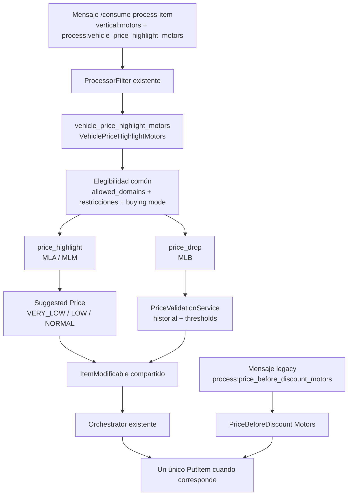

# Fase 1 — Señales de precio Motors — Loader Tagging

%% Naming: link canónico del plan de Fase 1. Proyecto de agente bajo [[Cierre VIS]]. Esta nota describe la implementación real de la rama feature/f1-vehicle-price-highlight. %%

> [!info]+ Fase 1 — Señales de precio Motors
> **Área:** [[Meli]] · **Estado:** active · **Prioridad:** P1 · **Aplicación:** [[vis-items-loader-tagging]]
> **Gate:** G1 — processor estándar, evaluación por site, compatibilidad legacy y tests focalizados.

## 🎯 Objetivo

Extender el procesamiento unitario de pricing de Motors con el processor
estándar `vehicle_price_highlight_motors`. El processor coordina dos reglas
internas con alcance independiente por site:

1. **Bajó de Precio (`price_drop`)**: produce `PREVIOUS_PRICE` y
   `HAS_LOWER_PRICE` para MLB.
2. **Destaque de Precio (`price_highlight`)**: produce
   `VEHICLE_PRICE_HIGHLIGHT_TIER` para MLA y MLM.

La entrada continúa siendo `/consume-process-item`, con el envelope y los
filtros existentes. No se introduce un campo JSON `signals`, un coordinador
genérico de señales, un endpoint adicional ni una capability nueva.

## 📊 Estado implementado

- La rama implementa `VehiclePriceHighlightMotors` como una implementación
  normal de `models.Processor`.
- `ProcessorFilter` selecciona el processor mediante
  `process:vehicle_price_highlight_motors` y `vertical:motors`.
- El processor nuevo tiene dos subprocesadores internos: uno para Destaque de
  Precio y otro para Bajó de Precio. Cada uno decide si debe ejecutarse según
  el site configurado y la elegibilidad común.
- La configuración efectiva de `price_drop` se deriva del bloque anidado
  `vehicle_price_highlight_motors.price_drop`; sus sites y thresholds no se
  mezclan con los del processor legacy.
- `price_before_discount_motors` continúa registrado con su propia
  configuración y servicio de validación para atender mensajes legacy. Este
  PR no elimina esa instancia ni cambia el processor genérico de Real Estate.
- `PriceDropAttributes` concentra la construcción de atributos de Bajó de
  Precio y es reutilizado por el processor nuevo y por el processor legacy.
- La expiración y la limpieza de Bajó de Precio solo administran
  `PREVIOUS_PRICE` y `HAS_LOWER_PRICE`; nunca incluyen
  `VEHICLE_PRICE_HIGHLIGHT_TIER`.
- No se implementan en esta fase el proceso masivo ni el consumer de cambios
  en atributos baneadores. Esos trabajos corresponden a Fases 2 y 3.

## 🧭 Alcance

### Incluye

- Processor `vehicle_price_highlight_motors` integrado al wiring existente.
- Configuración raíz compartida para elegibilidad de Motors.
- Subconfiguración independiente de `price_drop` y `price_highlight`.
- Cálculo de `VERY_LOW`, `LOW` o `NORMAL` para
  `VEHICLE_PRICE_HIGHLIGHT_TIER`.
- Construcción compartida de `PREVIOUS_PRICE` y `HAS_LOWER_PRICE`.
- Compatibilidad con el filtro legacy
  `process:price_before_discount_motors`.
- Tests unitarios de servicios, processor, configuración, scopes y errores.

### Fuera de alcance

- Migración de productores externos que todavía publiquen el filtro legacy.
- Eliminación de `price_before_discount_motors`; queda para un despliegue
  posterior después de drenar sus mensajes.
- Handler HTTP o consumer adicional para Motors.
- BigQuery, `items-batch-search`, paginado, scroll o fan-out masivo.
- Consumer de cambios en atributos baneadores.
- Cambios downstream en Search, Polycard, SDK o prioridad visual.
- Persistencia adicional, outbox o un framework genérico de reglas.

## 🏗️ Arquitectura implementada



### Responsabilidades reales

- `VehiclePriceHighlightMotors`: registra el ID, valida el site raíz y ejecuta
  los subprocesadores habilitados en su `AttributeBuilder`.
- `vehiclePriceHighlightProcessor`: consulta `VehiclePriceHighlightService`
  y agrega `VEHICLE_PRICE_HIGHLIGHT_TIER` si el resultado cambió.
- `priceDropProcessor`: delega en `PriceDropAttributes` para construir los
  atributos de Bajó de Precio y programar su expiración.
- `PriceValidationService.IsEligibleForPricing`: aplica dominio permitido,
  restricciones de atributos y modos de compra denegados antes de que corra
  cualquiera de las señales.
- `VehiclePriceHighlightService`: consulta Suggested Price, clasifica el
  precio y traduce los errores a `ErrRetryable` o `ErrDiscarded` usando la
  semántica existente del repositorio.
- `PriceDropAttributes`: conserva la validación de historial, thresholds,
  mutaciones y publicación del vencimiento de `PREVIOUS_PRICE`.
- `Orchestrator`: mantiene la acumulación de mutaciones y la escritura a
  Items mediante el flujo existente.

## ⚙️ Configuración efectiva

La configuración implementada en `fury_configuration.development.properties`
es la siguiente:

| Processor / bloque | Sites | Dominio | Resultado |
|---|---|---|---|
| `vehicle_price_highlight_motors` raíz | MLB, MLA, MLM | `CARS_AND_VANS` | Alcance externo del processor y elegibilidad común |
| `price_drop` | MLB | `CARS_AND_VANS` | `PREVIOUS_PRICE` y `HAS_LOWER_PRICE` |
| `price_highlight` | MLA, MLM | `CARS_AND_VANS` | `VEHICLE_PRICE_HIGHLIGHT_TIER` |
| `price_before_discount_motors` | MLB | `CARS_AND_VANS` | Compatibilidad de mensajes legacy |

La configuración compartida contiene:

- `stable_price_days: 7` para Bajó de Precio.
- `min_drop_threshold_percent: 2.0`.
- `max_drop_threshold_percent: 30.0`.
- `allowed_domains: ["CARS_AND_VANS"]`.
- Restricción si son positivos `THEFT_REPORTS_NUMBER`,
  `SUFFERED_DAMAGE_NUMBER` o `PRIOR_AUCTIONS_NUMBER`.
- Restricción por valores de `IS_OFFERED_BY_BRAND` y
  `VERIFIED_VEHICLES`.
- `denied_buying_modes: ["auction"]`.

Si una subconfiguración no declara `sites`, hereda los sites del processor
raíz. En la configuración actual ambos bloques declaran sites explícitos.

## 🧮 Reglas implementadas

### Destaque de Precio

`VehiclePriceHighlightService` consulta Suggested Price usando el ID del item y
la moneda del item para seleccionar la predicción correspondiente.

- `VERY_LOW` cuando `lower_limit <= price < lower_band`, siempre que
  `lower_limit > 0` y `lower_band > lower_limit`.
- `LOW` cuando `lower_band <= price <= estimated_price * 0.98`, siempre que
  `lower_band > 0` y `estimated_price > 0`.
- `NORMAL` en cualquier otro caso.
- Si Suggested Price responde `nil` o no existe una predicción para la moneda,
  el resultado es `NORMAL`.
- Si el valor persistido ya coincide con el valor calculado, no se agrega una
  mutación al `ItemModificable`.
- Error reintentable del cliente: `commons.ErrRetryable`.
- Error no reintentable del cliente: `commons.ErrDiscarded`.

Esta es la semántica del código final. La documentación que indique solamente
`VERY_LOW` o `LOW`, o que describa limpieza del atributo cuando no califica, no
representa la implementación de esta fase.

### Bajó de Precio

- Se valida elegibilidad común antes de evaluar el historial de precio.
- Se conserva la estabilidad mínima de 7 días.
- La baja válida está entre 2% y 30% según configuración.
- Baja inválida: elimina `PREVIOUS_PRICE` si existe y establece
  `HAS_LOWER_PRICE=false`.
- Baja válida: establece `PREVIOUS_PRICE` con el precio estable y
  `HAS_LOWER_PRICE=true`.
- Error de validación o resultado nulo: `commons.ErrRetryable`.
- Al establecer una baja válida se publica el vencimiento de
  `PREVIOUS_PRICE` mediante el publisher de calendario vigente.

### Expiración

- `PreviousPriceCleanup` considera el atributo vencido cuando su antigüedad es
  mayor a 30 días.
- `PriceDropCalendarCleanup` verifica estado, precio y ciclo antes de limpiar.
- Ambas limpiezas solo escriben `PREVIOUS_PRICE` y
  `HAS_LOWER_PRICE=false`.
- `VEHICLE_PRICE_HIGHLIGHT_TIER` no se publica en el calendario y no se elimina
  por la expiración de Bajó de Precio.

## 🔌 Contrato de mensajes

El contrato unitario existente no cambia:

- El envelope continúa siendo compatible con `/consume-process-item`.
- El mensaje nuevo usa `vertical:motors` y
  `process:vehicle_price_highlight_motors`.
- El mensaje legacy usa `process:price_before_discount_motors` y selecciona
  solo ese processor por el filtro propio.
- No se agrega `signals`, `scope`, `source`, `run_id`, `page_id` ni campos
  nuevos al payload unitario.
- Un mensaje no debe incluir simultáneamente los dos process filters porque
  `ProcessorFilter` podría seleccionar ambos processors registrados.

## 🔁 Flujo unitario detallado

1. `ProcessorFilter` recibe el item y revisa site, vertical y process filter.
2. Para `process:vehicle_price_highlight_motors`, selecciona únicamente el
   processor nuevo mediante su filtro propio.
3. `VehiclePriceHighlightMotors.Validator` comprueba el site raíz y que al
   menos un subprocesador esté habilitado y sea elegible.
4. El subprocesador de Destaque corre en MLA/MLM; el de Bajó de Precio corre en
   MLB.
5. Las mutaciones se agregan al mismo `ItemModificable` recibido por el
   processor.
6. `Orchestrator` decide si realiza el `PutItem` según el resultado y las
   mutaciones acumuladas.
7. Para mensajes legacy, `ProcessorFilter` selecciona
   `PriceBeforeDiscount` Motors y no el processor nuevo.

Si un subprocesador retorna un error reintentable, el processor retorna ese
error y el flujo conserva la semántica de reintento existente. La publicación
del vencimiento de Bajó de Precio ocurre dentro de `PriceDropAttributes` antes
de que `Orchestrator` ejecute el `PutItem`, por lo que se conserva la semántica
actual y su posibilidad de duplicación bajo reintentos.

## 🧪 Tests y evidencia

Se agregaron tests para:

- Clasificación `VERY_LOW`, `LOW` y `NORMAL`, incluidos los límites.
- Respuesta nula de Suggested Price y moneda sin predicción.
- Errores reintentables y descartables del cliente.
- No-op cuando el tier calculado ya está persistido.
- Selección por site, configuración anidada y herencia de sites raíz.
- Ejecución conjunta de los subprocesadores cuando comparten site en la
  configuración de prueba.
- Elegibilidad por dominio, atributos restringidos y modo `auction`.
- Compatibilidad y regresión del processor legacy.
- Expiración de Bajó de Precio sin tocar el tier de Destaque.

Suite focalizada ejecutada:

```bash
go test ./pkg/process/vehicle_price_highlight_motors ./pkg/services \
  ./pkg/process/previous_price_cleanup \
  ./pkg/process/price_drop_calendar_cleanup ./pkg/middlewares
```

Resultado: todos los paquetes pasan.

## 🚀 Rollout y compatibilidad

- El processor nuevo y `price_before_discount_motors` coexisten en este
  despliegue.
- El processor legacy queda disponible para mensajes que ya fueron publicados
  con su process filter.
- Los productores externos no se modifican en este repositorio; la migración
  de publishers y el retiro de la configuración legacy requieren un cambio
  posterior coordinado.
- El retiro futuro debe eliminar únicamente la instancia/configuración Motors
  legacy, conservando `price_before_discount` de Real Estate, el helper
  compartido y `PriceDropCalendarCleanup`.
- Rollback de esta fase: deshabilitar el uso del process filter nuevo y
  mantener disponible la instancia legacy mientras se revisa el despliegue.

## 🚫 No tocar en esta fase

- No modificar el proceso `highlights` de Real Estate/Verdi.
- No eliminar `price_before_discount` ni su configuración de Real Estate.
- No eliminar todavía `price_before_discount_motors`.
- No incluir `VEHICLE_PRICE_HIGHLIGHT_TIER` en ningún calendario de expiración.
- No crear protocolos nuevos para señales ni handlers adicionales.
- No incorporar la implementación de Fase 2 o Fase 3 en este cambio.

## ✅ Criterios de aceptación / Gate G1

- `vehicle_price_highlight_motors` implementa `models.Processor` y queda
  registrado en el wiring real.
- MLB ejecuta `price_drop` y MLA/MLM ejecutan `price_highlight` según la
  configuración implementada.
- Destaque produce `VERY_LOW`, `LOW` o `NORMAL` con los límites documentados.
- Un tier sin cambios no genera mutación.
- Bajó de Precio conserva `PREVIOUS_PRICE`, `HAS_LOWER_PRICE`, restricciones,
  thresholds y expiración vigentes.
- El processor legacy continúa disponible y separado.
- Los errores reintentables conservan la semántica de reintento existente.
- Los tests focalizados pasan.

## ⚠️ Riesgos y mitigaciones

| Riesgo | Mitigación |
|---|---|
| Mensajes antiguos llegan después del despliegue | Mantener el processor legacy hasta drenar publishers, backlog y DLQ |
| Un mensaje contiene ambos process filters | Validar publishers y monitorear ejecución doble durante coexistencia |
| Error del Suggested Price | Reutilizar `ErrRetryable`/`ErrDiscarded` del repositorio |
| Configuración de elegibilidad divergente | Mantener reglas comunes en la configuración raíz y resolver `price_drop` desde su subbloque |
| Reintento después de publicar vencimiento | Conservar semántica at-least-once vigente y monitorear duplicados del calendario |
| Confusión entre NORMAL y limpieza | Documentar `NORMAL` como salida implementada para respuesta nula, moneda ausente y precio fuera de banda |

## 📚 Fuentes

- Spec funcional [VMDEM-21](https://spellbook.adminml.com/projects/VMDEM/specs/VMDEM-21).
- Spec técnico [VMDEM-27](https://spellbook.adminml.com/projects/VMDEM/specs/VMDEM-27).
- [[Fase 2 — Proceso Masivo por Site vía items_batch_search — Loader Tagging]].
- [[Hito 2 - vis-items-loader-tagging]].
- [Repositorio `vis-items-loader-tagging`](https://github.com/melisource/fury_vis-items-loader-tagging).

## 📆 Bitácora

- **2026-07-27** — Se crea el proyecto para el procesamiento unitario de las
  señales de precio Motors.
- **2026-07-28** — La implementación final se reconcilia contra la rama
  `feature/f1-vehicle-price-highlight`: el processor implementado es
  `VehiclePriceHighlightMotors`, una implementación de `models.Processor`
  con subprocesadores internos.
- **2026-07-28** — Se documentan los valores reales
  `VERY_LOW`/`LOW`/`NORMAL`, la clasificación ante respuesta nula o moneda
  ausente, la configuración por site, la convivencia con
  `price_before_discount_motors` y la expiración independiente.
- **2026-07-28** — Se ejecutan los tests focalizados de processor, services,
  cleanup y middleware; todos pasan.

## 🧭 Decisiones

- El protocolo de entrada reutiliza `process:<id>` y
  `filters.modified_fields`; no existe un campo `signals` en el payload.
- El processor común se llama `vehicle_price_highlight_motors` y usa la
  capability existente `models.Processor`.
- Las reglas se implementan como subprocesadores internos, sin introducir una
  abstracción genérica de evaluadores.
- `price_drop` y `price_highlight` tienen sites independientes definidos por
  subconfiguración.
- El estado no elegible de Destaque se representa como `NORMAL` en el código
  final, no como eliminación del atributo.
- `price_before_discount_motors` se conserva como processor separado durante
  la transición.
- El proceso masivo y el consumer de atributos baneadores pertenecen a fases
  posteriores y no forman parte de este PR.

## 🔗 Navegación

- [[Cierre VIS]].
- [[Fase 2 — Proceso Masivo por Site vía items_batch_search — Loader Tagging]].
- [[vis-items-loader-tagging]].
- [[Destaques de Precio]].
