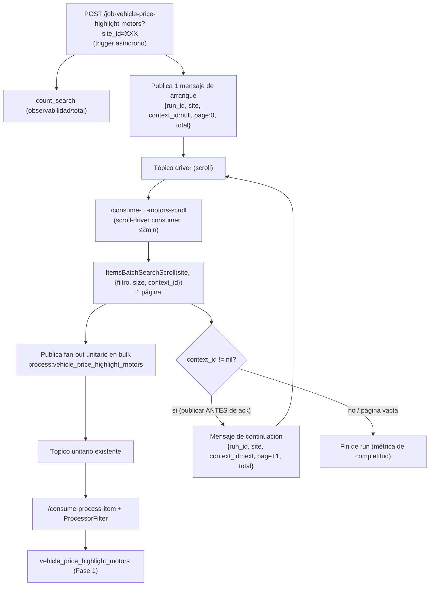

# Fase 2 — Proceso Masivo por Site vía items_batch_search — Loader Tagging

%% Naming: link canónico del plan de Fase 2. Proyecto de agente bajo [[Cierre VIS]]. Reemplaza el diseño BigQuery del masivo por scroll de items-batch-search. La nota es el planificador único de Fase 2. %%

> [!info]+ Fase 2 — Proceso Masivo por Site
> **Área:** [[Meli]] · **Estado:** review · **Prioridad:** P0 · **Aplicación:** [[vis-items-loader-tagging]] · **SDK:** [[vis-sdk-go]]
> **Gate:** G2 — cobertura completa por site, resumabilidad sin reinicio desde 0 y ejecución de consumer ≤ 2 min.

## 🎯 Objetivo

Reemplazar la consulta a **BigQuery** del proceso masivo de Destaque de Precio por el servicio **`items-batch-search`** del SDK [[vis-sdk-go]] (`pkg/items`), para enumerar la góndola Motors por site (buscar, contar, paginar) y disparar el fan-out al flujo unitario existente `process:vehicle_price_highlight_motors`.

El handler recibe un **site** y corre el **site completo** de forma **asíncrona, resumible y escalable**, sin depender de BigQuery ni de acumular la góndola en memoria.

## 📊 Estado actual

- **Baseline: rama `feature/f1-vehicle-price-highlight`** (Fase 1). Fase 2 se desarrolla como branch **apilado** sobre esa rama.
- **Las 3 fases corren en paralelo**: Fase 1 NO necesita estar cerrada/mergeada para arrancar Fase 2 o Fase 3. Se espera tener las tres abiertas simultáneamente; cada una entrega su propio PR y gate.
- Este plan produce el fan-out hacia el flujo unitario de Fase 1 (`/consume-process-item` + `ProcessorFilter` + processor `vehicle_price_highlight_motors`); no toca la evaluación unitaria. Como Fase 1 vive en la misma baseline, el contrato unitario ya está disponible para construir sobre él.
- El repo **ya usa `items-batch-search` con scroll por site** en `SearchBatchHighlights`, `SearchItemsWithPreviousPrice` y `SearchItemsFinanceablesByMC` (middlewares) vía el adaptador `services.ItemService` (`ItemsBatchSearchScroll` / `ItemsBatchSearchCount`). El masivo Motors reutiliza exactamente esa capability.
- El patrón `/job-highlights` (scroll por site → `PublishBulkToTopic` → `/consume-highlights`) es la plantilla revisada de referencia. El masivo Motors es un clon adaptado de ese patrón, con arranque asíncrono y cadena resumible.
- El diseño BigQuery previo (tópico de páginas autocontenidas + page-consumer) queda **derogado**. Se corrige [VMDEM-27](https://spellbook.adminml.com/projects/VMDEM/specs/VMDEM-27) después de aprobar este diseño (discrepancia esperada por el owner).
- No existía entidad para el SDK: se creó [[vis-sdk-go]] con la API de `items-batch-search` documentada.

## 🧭 Alcance

### Incluye

- Trigger asíncrono por site que publica un único **mensaje de arranque** a un tópico driver.
- **Scroll-driver consumer** que barre la góndola del site en páginas acotadas usando `ItemsBatchSearchScroll`, publica el fan-out unitario y **encadena** la página siguiente con el `context_id` en un mensaje durable.
- Filtro de enumeración por site tomado de `ProcessConfig.Configurations` (no se duplican reglas de negocio).
- Observabilidad (`count_search` para total/progreso), métricas, límites de seguridad y runbook.
- Tests unitarios, de integración de la cadena de scroll y de resumabilidad.

### Fuera de alcance

- Cualquier uso de BigQuery (se elimina del masivo).
- La evaluación unitaria (Fase 1) y el cálculo de tiers.
- El consumer de atributos baneadores (Fase 3).
- Reglas de elegibilidad/thresholds por site: viven en el spec funcional [VMDEM-21](https://spellbook.adminml.com/projects/VMDEM/specs/VMDEM-21) y en el processor unitario; el masivo solo enumera y encola.
- El carril **FIPE de MLB** (flujo separado documentado solo en el RFC).

## ✅ Decisiones cerradas (encuesta 2026-07-28)

| ID | Decisión |
|---|---|
| **D1 — Topología** | **Directo a unitario** (clon de `/job-highlights`): el driver publica mensajes unitarios `process:vehicle_price_highlight_motors` directo al tópico que consume `/consume-process-item`. **Sin tópico de páginas ni page-consumer.** Se corrige VMDEM-27 en consecuencia. |
| **D2/D4 — Arranque y ejecución** | **Asíncrono, durable y resumible.** El handler solo publica un mensaje de arranque; un **scroll-driver consumer** ejecuta el barrido en páginas acotadas. **Restricción dura: cada ejecución de consumer ≤ 2 min.** Por eso se procesa **1 página de scroll por ejecución** (config `pages_per_execution`, default 1) y se encadena. Nunca reinicia desde 0. |
| **D3 — Filtro de góndola** | Filtro de enumeración por site desde `ProcessConfig.Configurations` (status, condition, category_id/domain_id, rango de fechas). Sin hardcode ni duplicación de reglas. |
| **D5 — Escala objetivo** | Hasta **~500k ítems por site** (site más grande). El diseño no acumula la góndola en memoria: cada ejecución maneja solo su página. |
| **D6 — Aislamiento del fan-out (2026-07-29)** | El fan-out unitario **NO** se publica al `itemToProcess` global compartido. Va a un **tópico masivo dedicado** con **consumer propio** que **reutiliza el mismo `ProcessorFilter` + processor** `vehicle_price_highlight_motors`. Refina D1 (la topología directo-a-unitario se mantiene; cambia el destino del fan-out). Motivo: aislar el lag del masivo del carril real-time. |

## 🚦 Iteración actual (2026-07-29) — Aislamiento del fan-out masivo (tópico + consumer dedicados)

> [!important] Esta sección refina **D1**. La topología "directo a unitario" se mantiene, pero el fan-out deja de compartir el consumer global de items. Todo el contexto necesario está aquí; **no hace falta reinvestigar el repo**.

### Problema que resuelve

El proceso masivo publicará **cientos de miles** de mensajes unitarios por run. El rate-limit del consumer no da abasto → **lag de horas**. Si esos unitarios caen en el `itemToProcess` **global** (el que consume `/consume-process-item`), ese lag contamina a **todos** los flujos real-time que comparten ese tópico (`price_before_discount_motors`, verification, seller preferences, etc.). Efecto *noisy-neighbor*: un backfill masivo retrasa señales en tiempo real. Inaceptable.

### Estado real en el código (baseline `feature/f2-vehicle-price-highlight-motors`)

- El scroll-driver usa el tópico compartido de segmento non-site `BIGQUEUE_TOPIC_MASSIVE_SCROLL__NONSITE_TOPIC_NAME` y etiqueta sus runs con `massive:price_highlights` → `/consume-vehicle-price-highlight-motors-scroll`. El aislamiento lógico del consumer se realiza mediante ese filtro.
- El **fan-out unitario sí es el problema**: en `cmd/api/initializers/resources.go:486`, el `unitaryPublisher` del scroll-driver es `publicToTopicService`, que apunta a `itemToProcessTopicName` (`BIGQUEUE_TOPIC_TOPIC_ITEM_TO_PROCESS_TOPIC_NAME`, `resources.go:78/211`). O sea, **hoy el fan-out masivo ya cae en el consumer global**.
- El handler masivo vive en `pkg/handlers/vehicle_price_highlight_motors_massive_handler.go` y ya delega en `pkg/process/massive` (`massive.New(...).Start()` / `.Consume()`); firmas `JobVehiclePriceHighlightMotors` y `ConsumeVehiclePriceHighlightMotorsScroll`. El filtro de fan-out es `process:vehicle_price_highlight_motors` (constante `vehiclePriceHighlightMotorsProcessFilter`, `massive_handler.go:16`).
- El consumer global es `ConsumerFilteredItems` (`pkg/handlers/bq_consumer.go`), cableado en `cmd/api/initializers/router.go:7`: `router.Post("/consume-process-item", resources.handlers.consumerFilteredItems, resources.middlewares.processorFilter)`. El `processorFilter` rutea al processor por `filters.modified_fields` (`process:...`).

### Corrección importante (por qué NO sirve `massive:algo` como key)

Una key/atributo en el **mismo** tópico **no aísla lag ni throughput**: un tópico = un backlog = una progresión de offset y un solo pool de entrega. La key sirve para rutear/filtrar dentro del handler, pero los mensajes masivos siguen compitiendo por la misma capacidad de consumer que el real-time. **El aislamiento en BigQueue es por tópico + consumer, no por atributo del mensaje.** Por eso la solución es tópico dedicado, no una key.

### Decisión

Fan-out unitario → **tópico masivo dedicado** → **consumer dedicado** que **reutiliza la misma cadena** `processorFilter` + `ConsumerFilteredItems` + orquestador + processor `vehicle_price_highlight_motors`. Lo único nuevo es el **transporte** (tópico + consumer + su rate-limit propio); **cero duplicación de lógica de negocio**.

### Plan de implementación (esta iteración)

1. **Tópico de fan-out dedicado.** Dar de alta `BIGQUEUE_TOPIC_ITEM_TO_PROCESS_MASSIVE__NONSITE_TOPIC_NAME` (nombre tentativo) en Fury Config (prod + test; segmento `nonsite`). Constante en `resources.go` junto a `itemToProcessTopicName` (`resources.go:78`). El tópico driver es compartido: `BIGQUEUE_TOPIC_MASSIVE_SCROLL__NONSITE_TOPIC_NAME`.
2. **Nuevo publisher.** `itemToProcessMassivePublisher, _ := GetSegmentedPublisher(itemToProcessMassiveTopicName, "nonsite")` y `publicToMassiveTopicService := services.NewPublishToProcess(itemToProcessMassivePublisher)` (espejo de `resources.go:211/231`).
3. **Rewire del scroll-driver.** En `resources.go:486`, pasar `publicToMassiveTopicService` como `unitaryPublisher` de `ConsumeVehiclePriceHighlightMotorsScroll` **en vez de** `publicToTopicService`. El `driverPublisher` (continuación) **no cambia** (sigue en el tópico scroll). Es un cambio de una línea de wiring; el `pkg/process/massive` no se toca.
4. **Nuevo consumer dedicado, misma cadena.** Ruta `router.Post("/consume-process-item-massive", resources.handlers.consumerFilteredItems, resources.middlewares.processorFilter)` en `router.go` (junto a `router.go:7`). **Reusa exactamente** `consumerFilteredItems` + `processorFilter`: mismo handler, mismo processor, distinto endpoint/tópico. Dar de alta en Fury el consumer de `...ITEM_TO_PROCESS_MASSIVE...` apuntando a ese endpoint, con su **rate-limit/concurrencia propios** (acá se absorbe el lag de horas sin tocar el real-time).
5. **Config del consumer masivo.** Definir rate-limit, concurrencia y **política de DLQ / max-retries** propia antes de encender en prod. El real-time conserva la suya.
6. **Tests.** No hay lógica nueva de negocio que testear (se reutiliza el processor). Cubrir: (a) el scroll-driver publica al publisher masivo, no al global (assert sobre el publisher inyectado); (b) el nuevo endpoint resuelve al mismo processor vía `processorFilter`. Reusar los mocks de publisher existentes del `_massive_handler_test.go`.

### Invariantes / no romper

- No agregar campos al mensaje unitario ni un segundo `process:` filter (sigue vigente el bloque "🚫 No tocar"). El contrato unitario es idéntico; **solo cambia el tópico** por el que viaja.
- No meter la key `massive:algo` (no aporta aislamiento; ver corrección arriba).
- No tocar `pkg/process/massive` ni el tópico driver (ya aislado).
- Idempotencia: al reutilizar el mismo processor, el no-op determinístico que ya neutraliza duplicados del real-time cubre también al masivo (mismo camino).

### Follow-ups que esta iteración deja abiertos (no bloqueantes de la decisión)

- **Poison message determinístico (CWE-841, disponibilidad):** si `max_items>0` y una página trae más ítems que `max_items`, el scroll-driver retorna 500 sobre condición determinística → redelivery infinito. Hoy mitigado con `max_items:0`. Con consumer masivo propio conviene resolverlo bien (loggear + métrica + `NoContent`/discard, no 500) para evitar auto-DoS sobre un tópico de cientos de miles. Ya documentado en `PRICE_DROP_MOTORS.md` (sección "Deuda menor").
- **Política DLQ/max-retries** del consumer masivo: definir antes del encendido en prod.
- **Naming Fase 1** (colisión `vehicle_price_highlight_motors` proceso padre vs `vehicle_price_highlight.go` servicio): ver decisión aparte más abajo / en la nota de Fase 1. No bloquea esta iteración.

## 🏗️ Arquitectura propuesta



### Flujo detallado

1. **Trigger (`JobVehiclePriceHighlightMotors`)** — handler HTTP que recibe `site_id` (requerido), valida config del site, opcionalmente llama `ItemsBatchSearchCount` para `total` (observabilidad/progreso), genera `run_id` y **publica un único mensaje de arranque** al tópico driver. Responde `202/200` inmediatamente. **No hace el barrido.**
2. **Scroll-driver consumer (`ConsumeVehiclePriceHighlightMotorsScroll`)** — cada ejecución:
   1. Decodifica `{run_id, site_id, context_id, page_number, total}`.
   2. Construye `SearchJSON` (filtro por site desde config, `Fields:["id"]`, `Size` de config, `ContextID`).
   3. Llama `ItemsBatchSearchScroll` **una vez** (o `pages_per_execution` veces, default 1).
   4. Mapea `documents[].id` → `[]bigq.Message{Body: models.Data{ID:...}, Filters: ["vertical:motors","process:vehicle_price_highlight_motors"]}` y `PublishBulkToTopic` al tópico unitario.
   5. Si `context_id != nil` y la página no vino vacía → **publica el mensaje de continuación** `{..., context_id: next, page_number+1}` al tópico driver **antes de ack**.
   6. Si `context_id == nil` o página vacía → métrica de completitud; termina el run.
   7. `ack` (200). Errores reintentables → `500` (BigQueue reintrega).

### Por qué este diseño satisface las restricciones

- **≤ 2 min por consumer:** cada ejecución hace 1 scroll (~segundos) + 1 bulk publish + 1 publish de continuación. Acotado por diseño; `pages_per_execution` permite ajustar sin acercarse al límite.
- **Resumable sin reinicio desde 0:** el estado del barrido (`context_id` + `page_number`) vive en el **mensaje de continuación durable**, no en memoria. Si una ejecución falla antes de `ack`, BigQueue reintrega el **mismo** mensaje y el barrido continúa desde el **mismo cursor**.
- **Invariante de no-pérdida (no-skip):** la continuación se publica **antes** del `ack`. Así la cadena nunca pierde un eslabón; bajo at-least-once puede haber **duplicados** (idempotentes), nunca saltos.
- **Escalable a 500k/site:** el driver es una cadena secuencial liviana por site; el fan-out unitario se procesa en paralelo por el consumer existente. Distintos sites corren en cadenas independientes en paralelo.
- **Sin BigQuery y sin acumular en memoria:** `items-batch-search` scroll es incremental; cada ejecución solo materializa su página.

## 📨 Contratos de mensaje

**Mensaje driver (arranque y continuación) — mismo shape:**

```json
{
  "schema_version": 1,
  "run_id": "uuid",
  "site_id": "MLA",
  "context_id": null,
  "page_number": 0,
  "total": 500000
}
```

- `context_id: null` + `page_number: 0` ⇒ arranque. `context_id` presente ⇒ continuación.
- `total` es informativo (de `count_search`), para progreso; no gobierna la terminación (la gobierna `context_id == nil`).

**Mensaje unitario (fan-out) — contrato existente, sin cambios:**

- Envelope compatible con `/consume-process-item`.
- `vertical:motors` + `process:vehicle_price_highlight_motors`.
- **No** agrega `run_id`, `page_id`, `signal:*`, scope ni campos nuevos al `models.BqPayload`. `run_id`/`page_number` van en logs/traces del driver, no en el mensaje unitario.
- Ningún mensaje incluye simultáneamente `process:price_before_discount_motors` y `process:vehicle_price_highlight_motors`.

## ⚙️ Configuración por site (`ProcessConfig.Configurations`)

- Filtro de góndola: `status` (active), `condition` (p. ej. used), `category_id`/`domain_id` del árbol Motors del site, rango de fechas opcional.
- `batch_search_page_size` (scroll `Size`, default 1000, ya usado por highlights).
- `batch_search_scroll_throttle_ms` (ya usado por highlights).
- `pages_per_execution` (default 1) — páginas de scroll por ejecución de consumer, acotado para ≤ 2 min.
- `max_pages` / `max_items` — tope de seguridad por run contra barridos desbocados.
- Toggle de habilitación por site (para rollout controlado; MLA/MLM primero).
- Nombres de tópico: driver compartido non-site (`BIGQUEUE_TOPIC_MASSIVE_SCROLL__NONSITE_TOPIC_NAME`), fan-out masivo non-site (`BIGQUEUE_TOPIC_ITEM_TO_PROCESS_MASSIVE__NONSITE_TOPIC_NAME`) y unitario existente.

## 🧪 Plan de implementación

### F2.0 — Precondición y spike

- Ramificar desde `feature/f1-vehicle-price-highlight` (baseline). No requiere que Fase 1 esté mergeada.
- Confirmar el nombre exacto del tópico unitario que alimenta `/consume-process-item` (el processor `vehicle_price_highlight_motors` ya existe en la baseline de Fase 1).
- **Spike (bloqueante):** medir latencia real de 1 `scroll_search` + 1 `PublishBulkToTopic` de una página, y confirmar el **TTL del `context_id`** de items-batch-search vs. la cadencia del driver (round-trip de reintrega). Confirmar que el límite efectivo de ejecución de consumer es 2 min.
- **Salida:** `page_size`/`pages_per_execution` seguros y confirmación de que 1 página cabe holgadamente en 2 min.

### F2.1 — Query builder y adaptador

- Implementar `buildMotorsGondolaQuery(cfg, siteID, contextID)` → `items.SearchJSON` con `Fields:["id"]`, `Size`, filtros desde config.
- Reutilizar `services.ItemService.ItemsBatchSearchScroll` / `ItemsBatchSearchCount` (ya existen). No crear cliente nuevo.
- **Salida:** query determinística por site, testeable.

### F2.2 — Trigger asíncrono

- Handler `JobVehiclePriceHighlightMotors(publisher)`: valida `site_id`+config, `count_search` opcional, genera `run_id`, publica mensaje de arranque al tópico driver, responde `202`.
- Ruta `POST /job-vehicle-price-highlight-motors` en `router.go`; wiring en `resources.go` (publisher driver vía `GetSegmentedPublisher`).
- **Salida:** arranque idempotente por `run_id`.

### F2.3 — Scroll-driver consumer

- Handler `ConsumeVehiclePriceHighlightMotorsScroll(scroll, unitaryPublisher, driverPublisher, cfg)`.
- Ejecuta 1 (config) página, publica fan-out unitario en bulk, **publica continuación antes de ack**, termina en `context_id == nil`.
- Reintentos de scroll con backoff (patrón de `scrollHighlights`, `scrollMaxRetries`).
- Ruta `POST /consume-vehicle-price-highlight-motors-scroll`; wiring en `resources.go`.
- **Salida:** cadena resumible y acotada.

### F2.4 — Resiliencia y observabilidad

- Métricas: runs iniciados, páginas procesadas, ítems publicados, errores/reintentos de scroll, continuaciones publicadas, completitud, DLQ, duplicados. `run_id`/`page_number` en logs/traces (no como label métrico).
- Topes `max_pages`/`max_items`; manejo de `context_id` expirado en reintrega (discard observable — la cadena real ya avanzó; el re-run periódico auto-sana).
- Dashboard + alertas + runbook (iniciar, observar progreso por `run_id`, pausar/drenar, reintentar).
- **Salida:** operación controlable por site.

### F2.5 — Integración y carga

- Integración de la cadena completa con mock de scroll multi-página que termina en `context_id == nil`.
- Test de **resumabilidad**: reintrega de una continuación reanuda desde el cursor, no desde 0.
- Test de **no-skip**: fallo tras publicar la continuación y antes de ack no pierde ítems (a lo sumo duplica).
- Carga con ~500k ítems ilustrativos, cero resultados y páginas no divisibles.
- **Salida:** G2 evaluable.

## 📁 Archivos esperados

- `pkg/handlers/vehicle_price_highlight_motors_job_handler.go` — trigger asíncrono.
- `pkg/handlers/vehicle_price_highlight_motors_scroll_handler.go` — scroll-driver consumer.
- `pkg/middlewares/` o `pkg/services/` — `buildMotorsGondolaQuery` + parseo de `site_id`.
- `pkg/models/` — modelo del mensaje driver (`MotorsMassiveRun`/página).
- `cmd/api/initializers/router.go` — rutas trigger + scroll.
- `cmd/api/initializers/resources.go` — publishers (driver + unitario), wiring, config keys.
- `pkg/config/fury_configuration.*.properties` — tópicos, page size, throttle, `pages_per_execution`, topes, filtros por site.
- Tests unitarios, de integración y de carga asociados.

## 🚫 No tocar / no reinventar

- No usar BigQuery ni reintroducir el tópico de páginas/page-consumer.
- No usar `query_search` con `From`/`Size` para el barrido (tope ~9000). El barrido es **solo scroll**.
- No usar los helpers iterativos del SDK (`...Iterative...`): el de query aborta > 9000 y el de scroll acumula en memoria con deadline de 10s.
- No acumular la góndola completa en memoria (nada de `AppendBqDataToCtx` para el masivo).
- No ejecutar el barrido en el request del trigger ni en goroutine fire-and-forget.
- No agregar campos nuevos al mensaje unitario ni un segundo process filter.
- No duplicar reglas de elegibilidad/thresholds: viven en el processor unitario / VMDEM-21.

## ✅ Criterios de aceptación / Gate G2

- Todos los ítems de un run provienen del scroll de `items-batch-search` del site, sin BigQuery.
- Cada ejecución del scroll-driver consumer termina **≤ 2 min**.
- El barrido es **resumible**: una reintrega reanuda desde el `context_id` durable, nunca desde 0.
- **No-skip garantizado** (continuación publicada antes de ack); duplicados aceptados bajo at-least-once y neutralizados por el no-op determinístico del processor unitario.
- El fan-out selecciona únicamente `process:vehicle_price_highlight_motors`; contrato unitario intacto.
- Cero resultados publica cero fan-out y termina limpio; el run se puede iniciar, observar, pausar y reintentar por site.
- Evidencia de carga (~500k ítems) y de los tests de resumabilidad/no-skip en verde.

## ✅ Tareas

- [x] F2.1 Query builder y adaptador: reutilizar `ItemsBatchSearchScroll`/`ItemsBatchSearchCount` y construir filtros por site desde `ProcessConfig`.
- [x] F2.2 Trigger asíncrono: validar site, contar para observabilidad, generar `run_id` y publicar el mensaje durable de arranque.
- [x] F2.3 Scroll-driver: procesar una página por ejecución, publicar fan-out unitario y encadenar `context_id` antes del ack.
- [x] F2.4 Resiliencia base: topes `max_pages`/`max_items`, reintentos de scroll, métricas de ejecución y validación estricta del cursor durable.
- [x] F2.5 Tests: query por site, arranque, fan-out, continuación, reanudación y no-skip cubiertos con mocks.
- [x] D6 Aislar el fan-out masivo en tópico y consumer dedicados, reutilizando `ProcessorFilter` y `ConsumerFilteredItems`.
- [r] G2 operativo: pendiente medir en entorno real latencia scroll+publish, TTL de `context_id` y carga representativa de 500k ítems.

## 🚀 Rollout y rollback

- **Rollout big-bang** (alineado a la decisión C5 de Fase 1), habilitado por site vía toggle de config: **MLA/MLM primero** (Sugeridor); resto de sites no-MLB después; **MLB queda en su carril FIPE separado**.
- **Rollback:** deshabilitar el trigger y drenar el tópico driver; el flujo unitario (Fase 1) queda intacto. Pausar/drenar el tópico driver y el unitario por separado.
- Para corregir tiers, reejecutar el mismo camino (re-run del masivo o unitario con limpieza); no crear flujo paralelo.

## ⚠️ Riesgos y mitigaciones

| Riesgo | Mitigación |
|---|---|
| Una ejecución excede 2 min | 1 página por ejecución (config), spike de latencia previo, alerta por duración de consumer |
| `context_id` expira antes de la reintrega | Confirmar TTL vs cadencia en el spike; discard observable de la rama muerta; el re-run periódico auto-sana |
| Reintrega duplica ítems/páginas | Continuación antes de ack (no-skip) + no-op determinístico del processor unitario (idempotencia) |
| Barrido desbocado | Topes `max_pages`/`max_items` por run |
| Backpressure en el tópico unitario | Bulk acotado (`PublishBulkToTopic` chunkea de a 20) + escala independiente del consumer unitario |
| Discrepancia con VMDEM-27 (page-topic/BigQuery) | Corregir el spec técnico tras aprobar este diseño (previsto por el owner) |
| Filtro de góndola incorrecto por site | Config por site + validación en el spike; reglas de negocio no se duplican |

## 📚 Lectura técnica obligatoria

- `pkg/middlewares/search_batch_highlights.go` — patrón scroll + throttle + retry + page size desde config (plantilla).
- `pkg/middlewares/search_batch_items_previous_price.go` — scroll por site (referencia pricing).
- `pkg/middlewares/batch_search_types.go` — interfaz `itemBatchSearchScroll`.
- `pkg/services/item.go` — adaptador `ItemsBatchSearchScroll` / `ItemsBatchSearchCount`.
- `pkg/services/item_batch_search.go` — wrapper del cliente del SDK.
- `pkg/handlers/highlights_job_handler.go` — fan-out con `PublishBulkToTopic` + `bigq.Message{Body,Filters}`.
- `pkg/services/item_to_publish.go` — `PublishToProcessClient` (`PublishItemToTopic`, `PublishBulkToTopic`).
- `pkg/handlers/previous_price_cleanup_handler.go` — `processItemsAsync` (patrón async existente).
- `cmd/api/initializers/router.go` y `resources.go` — rutas, publishers segmentados, `ProcessConfig`.
- SDK: `~/fuentes/vis-sdk-go/pkg/items/items_batch_search.go` y `domain.go` (`SearchJSON`, `DocumentScroll`).

## 📝 Encuesta — respuestas aplicadas (2026-07-28)

1. **Topología de fan-out** → *Directo a unitario (clon de highlights)*. Se corrige VMDEM-27.
2. **Publicación/memoria + arranque** → el usuario exigió **robustez y resumabilidad**: hasta 500k ítems/site, "si falla a la mitad no quiero que empiece de 0". Resultado combinado con la pregunta de trigger: arranque **asíncrono** (el handler solo publica un mensaje) + **cadena de scroll resumible** con estado en el mensaje durable. Se abandona el `collect-then-publish` en memoria.
3. **Filtro de góndola** → *Config por site en `ProcessConfig`*.
4. **Trigger** → *Mensaje durable de arranque por site + worker*, **con restricción dura: un consumer no puede tardar > 2 min**; por eso se procesa 1 página de scroll por ejecución y se encadena.

### Pendientes / follow-ups

- **[VMDEM-27](https://spellbook.adminml.com/projects/VMDEM/specs/VMDEM-27) actualizado (2026-07-28):** reescrito completo — sin BigQuery ni tópico de páginas; masivo async con scroll resumible; baseline `feature/f1-vehicle-price-highlight`; fases paralelas; Fase 2 detallada implementation-ready. Reconciliar contra [VMDEM-21](https://spellbook.adminml.com/projects/VMDEM/specs/VMDEM-21) (autoridad de reglas por site) queda como validación fina.
- Spike de latencia scroll+publish y **TTL del `context_id`** (bloqueante para fijar `page_size`/`pages_per_execution`).
- Poblar los filtros de góndola por site en config (árbol de categorías/dominios Motors).
- Confirmar el nombre exacto del tópico unitario que alimenta `/consume-process-item`.

## 📦 Entregables

- Trigger asíncrono + scroll-driver consumer + modelo de mensaje driver.
- Tópico driver y wiring; reutilización del tópico unitario existente.
- Config por site (filtros, page size, throttle, topes, toggle).
- Tests unitarios, de integración de la cadena, de resumabilidad/no-skip y de carga.
- Métricas/alertas/runbook.
- Handoff: query final por site, `page_size`/`pages_per_execution` efectivos, capacidad medida, ejemplo de mensaje driver y correlación `run_id`.

## 📆 Bitácora

- **2026-07-28** — Proyecto creado bajo [[Cierre VIS]]. Se reemplaza el diseño BigQuery del masivo por `items-batch-search` scroll. Encuesta de 4 forks respondida: directo-a-unitario, filtro por config, arranque async resumible con restricción de ≤ 2 min por consumer. Se creó la entidad [[vis-sdk-go]].
- **2026-07-28** — Correcciones del owner: baseline pasa a `feature/f1-vehicle-price-highlight` y las 3 fases corren en paralelo (Fase 1 no bloquea). Se reescribió completo el spec técnico [VMDEM-27](https://spellbook.adminml.com/projects/VMDEM/specs/VMDEM-27) (vía API por el guard de backticks del CLI): sin BigQuery, scroll-driver async resumible, processor estándar (sin signals), fases paralelas y Fase 2 detallada implementation-ready para GPT 5.6.
- **2026-07-28** — Implementación de Fase 2 lista para revisión en `feature/f2-vehicle-price-highlight-motors`: trigger async, scroll-driver resumible, fan-out directo a `process:vehicle_price_highlight_motors`, filtros `domain_id` por site, límites y tests de reanudación/no-skip. Verificado con `go test ./...` y `go vet ./...`; quedan pendientes las mediciones operativas del spike y carga real.
- **2026-07-29** — Iteración de **aislamiento del fan-out masivo** (D6). Análisis del wiring real: el fan-out unitario hoy cae en el `itemToProcess` **global** (`resources.go:486`, `unitaryPublisher = publicToTopicService`) → el lag de horas del backfill contaminaría el carril real-time. Decisión: fan-out a **tópico masivo dedicado + consumer dedicado** que **reutiliza** `processorFilter` + `ConsumerFilteredItems` + processor `vehicle_price_highlight_motors` (cero duplicación; solo cambia el transporte). Se descarta la key `massive:algo` (no aísla lag; el aislamiento en BigQueue es por tópico+consumer). Plan implementation-ready agregado como sección "🚦 Iteración actual". Follow-ups: poison message determinístico y política DLQ del consumer masivo. Naming Fase 1 tratado por separado.
- **2026-07-29** — Implementado el aislamiento D6 en el repositorio: el scroll-driver publica al tópico non-site `BIGQUEUE_TOPIC_ITEM_TO_PROCESS_MASSIVE__NONSITE_TOPIC_NAME` y se agregó `/consume-process-item-massive`, cableado a la misma cadena `ConsumerFilteredItems` + `ProcessorFilter`. La prueba focal confirma que el fan-out usa el publisher dedicado. `go test ./...`, `go vet ./...` y `go build ./...` pasan. G2 sigue en Review hasta crear/configurar el tópico y consumer en Fury y ejecutar el spike operativo.
- **2026-07-29** — Ajuste de topología: el tópico driver compartido non-site pasa a ser `BIGQUEUE_TOPIC_MASSIVE_SCROLL__NONSITE_TOPIC_NAME`; los mensajes de `vehicle_price_highlight_motors` llevan el filtro `massive:price_highlights` para que cada consumer seleccione únicamente sus runs.
- **2026-07-29** — Corrección de configuración: el alcance de sites del masivo se resuelve desde `configurations.price_highlight.sites`, igual que el proceso unitario; `massive` queda reservado para parámetros del scroll y se elimina el override hardcodeado del handler.
- **2026-07-28** — Revisión de código del handler masivo (464 líneas). Veredicto: **no es copia** de otro proceso — es el primer consumidor del patrón durable; los `search_batch_*` legados son modelo síncrono (otro PR). Refactor a `pkg/process/massive` con `Spec` declarativo **diferido** al PR de migración (premature abstraction con 1 consumidor + gate operativo abierto). Se agrega la sección "🧱 Refactor" al planner (antes solo en `PRICE_DROP_MOTORS.md` untracked) con el *cómo* y las 4 deudas baratas aplicables en la rama. Config de iniciativa confirmada correcta.

## 🧭 Decisiones

- El proyecto vive bajo [[Cierre VIS]] (cierre por cambio de equipo a ADS); la implementación apunta a [[vis-items-loader-tagging]] con dependencia en [[vis-sdk-go]].
- El masivo reutiliza el patrón `/job-highlights` (scroll por site) y el flujo unitario de Fase 1; solo agrega trigger async + scroll-driver + tópico driver. No inventa capabilities.
- La resumabilidad se logra con estado en el mensaje durable (`context_id`+`page_number`) y la invariante "continuar antes de ack" (no-skip, duplicados idempotentes), no con un store de estado de runs.
- Las reglas por site son autoridad del spec funcional; el masivo solo enumera y encola.

## 🔗 Docs / Links

- [[Cierre VIS]]
- [[Fase 1 — Modelo de Señales Price Discount — Loader Tagging]]
- [[vis-items-loader-tagging]]
- [[vis-sdk-go]]
- [[Hito 2 - vis-items-loader-tagging]] (diseño BigQuery previo, derogado para el masivo)
- [[Destaques de Precio]]
- [Spec funcional VMDEM-21](https://spellbook.adminml.com/projects/VMDEM/specs/VMDEM-21) · [Spec técnica VMDEM-27](https://spellbook.adminml.com/projects/VMDEM/specs/VMDEM-27)
- [Repositorio `vis-items-loader-tagging`](https://github.com/melisource/fury_vis-items-loader-tagging)

## 💡 Dudas abiertas

- ¿El masivo corre para todos los sites no-MLB o solo MLA/MLM en esta etapa? (afecta qué toggles se habilitan en el rollout inicial).
- ¿`condition=used` aplica a todos los sites o varía? (input para el filtro de góndola por site).
- ¿Se requiere reportar progreso (`page_number/total`) a algún dashboard/topic externo, o basta con métricas internas?
- ¿Cuál es la cadencia obligatoria por site?
- ¿El scheduler evita solapamientos o Fase 2 debe incorporar lock/deduplicación por site?
- ¿Qué valores finitos de `max_pages` y `max_items` corresponden a MLA y MLM?
