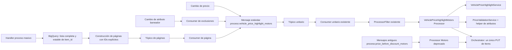

# Hito 2 - vis-items-loader-tagging

## Objetivo

Escalar `vis-items-loader-tagging` para resolver **Bajó de Precio** y **Destaque de Precio** reutilizando las capabilities actuales del repositorio: `models.Processor`, `ProcessorFilter`, `/consume-process-item` y `Orchestrator`. La solución incorpora un processor Motors nuevo y definitivo, con responsabilidades internas aisladas en services/helpers, y tres entradas operativas:

1. evolución del servicio unitario;
2. proceso masivo basado en una lista exacta de `item_id`;
3. reacción a cambios de atributos que excluyen ítems.

El nuevo atributo es `VEHICLE_PRICE_HIGHLIGHT_TIER`, con valores `LOW`, `VERY_LOW` o ausente cuando el ítem no califica.

## 📊 Estado actual

- Baseline funcional inspeccionada: `develop` en `3dce2f29`. El workspace del 2026-07-27 está en `feature/price-drop-motors-backfill` (`fbb1bbf0`) con cambios no versionados del usuario; cada executor debe reconciliar su baseline antes de editar.
- El flujo unitario existente entra por `/consume-process-item`, filtra por `process:<ID>`, obtiene el ítem y delega en `Orchestrator`.
- `Orchestrator` acumula las mutaciones de los processors y realiza un único `PutItem`.
- Bajó de Precio actualmente administra `PREVIOUS_PRICE` y `HAS_LOWER_PRICE`.
- No existe cliente ni repositorio BigQuery en la baseline actual.
- El flujo `highlights` existente corresponde a Real Estate/Verdi y no debe reutilizarse para Motors.
- Esta iniciativa no se modela como **Backfill**. Se implementa como un proceso masivo invocable; su calendario y frecuencia pertenecen a la configuración operativa externa.
- La decisión arquitectónica vigente es crear el processor estándar `vehicle_price_highlight_motors`, que coordina subprocesadores independientes dentro de un único `AttributeBuilder`. La activación se resuelve por site y por filtro: Bajó de Precio queda en MLB y Destaque de Precio en MLA/MLM.
- No se crean capabilities, modelos de signals, filtros secundarios ni coordinadores genéricos.
- El processor `price_before_discount_motors` queda deprecado durante el primer despliegue únicamente para drenar mensajes antiguos. Todo productor nuevo publica `process:vehicle_price_highlight_motors`.
- Un segundo despliegue elimina la instancia/configuración Motors de `price_before_discount_motors` después de comprobar que no quedan productores, backlog ni DLQ. El package genérico `price_before_discount` y su instancia Real Estate permanecen.
- Spec técnica creada en Spellbook: [VMDEM-27](https://spellbook.adminml.com/projects/VMDEM/specs/VMDEM-27), en estado `draft`, basada en VMDEM-21 y asociada al Spec Epic VMDEM-20.
- 2026-07-31: La rama `feature/f1-vehicle-price-highlight` quedó reparada tras la divergencia del pull. Se reaplicó el commit local sobre `origin` (`3fe78603` → `3a329a53`), se conservaron ambos cambios, los tests focalizados pasaron y el remoto quedó sincronizado. Los archivos sin seguimiento del workspace se preservaron.
- VMDEM-27 debe alinearse con la corrección del 2026-07-27 antes de aprobación: eliminar `signals`/scopes y reflejar el processor estándar con rollout en dos despliegues.
- Se preservan los archivos no versionados presentes en el repositorio; no forman parte de esta implementación.

## Arquitectura propuesta



### Responsabilidades

- `VehiclePriceHighlightMotors`: processor nuevo que implementa directamente `models.Processor`; valida el ítem y, en su único `AttributeBuilder`, invoca sólo los subprocesadores habilitados.
- `VehiclePriceHighlightService`: encapsula la integración/reglas del Sugeridor y construye el set/clear de `VEHICLE_PRICE_HIGHLIGHT_TIER`.
- `PriceValidationService` y un helper/service pequeño de atributos: reutilizan la lógica vigente de Bajó de Precio para `PREVIOUS_PRICE`, `HAS_LOWER_PRICE` y expiración. No se introduce la abstracción `Evaluator`.
- `PriceBeforeDiscount` Motors deprecado: conserva `process:price_before_discount_motors` exclusivamente para mensajes ya publicados; no recibe nuevos productores.
- Handler masivo: consulta una vez BigQuery, materializa la lista completa, construye páginas y publica mensajes de página.
- Consumer de página: expande los `item_ids` recibidos a mensajes unitarios. No consulta BigQuery.
- Consumer de atributos baneadores: detecta eventos relevantes y publica el filtro del processor nuevo. No evalúa reglas ni escribe atributos.

### Semántica de atomicidad y reintento

- La unidad de consistencia y reintento es el ítem completo.
- El processor nuevo ejecuta sólo los subprocesadores habilitados para el site y filtro del mensaje; no agrega un handler nuevo.
- El servicio de Destaque se ejecuta antes que la construcción de Bajó de Precio para evitar side effects del calendario cuando falla el Sugeridor.
- Si una regla falla con error reintentable, `AttributeBuilder` retorna error y `Orchestrator` no ejecuta el `PUT`.
- Si ambas terminan correctamente, agregan sus tres atributos al mismo `ItemModificable` y `Orchestrator` ejecuta como máximo un `PUT`.
- `500` y `429` mantienen el reintento nativo de BigQueue.
- Se conserva la semántica at-least-once existente, incluida la posibilidad vigente de repetir la programación de expiración si el `PUT` falla después de publicar el calendario. No se agrega outbox, diff engine ni idempotency store.

### Contrato del mensaje de página

```json
{
  "schema_version": 1,
  "run_id": "uuid-o-idempotency-key",
  "page_id": "run_id:page_number",
  "page_number": 1,
  "total_pages": 500,
  "total_items": 500000,
  "item_ids": ["MLA1", "MLA2"]
}
```

Los valores `500000` y `1000` son ilustrativos. El tamaño real de página debe definirse según el límite de bytes de BigQueue, el throughput esperado y la memoria disponible.

### Contrato del mensaje unitario

- Conserva el envelope compatible con `/consume-process-item`.
- Incluye `vertical:motors` y `process:vehicle_price_highlight_motors`.
- No agrega `signal:*`, scope ni metadatos nuevos al `models.BqPayload`.
- `run_id` y `page_id` viven en el mensaje de página y en logs del fan-out; el mensaje unitario conserva el contrato actual.
- Ningún mensaje debe incluir simultáneamente `process:price_before_discount_motors` y `process:vehicle_price_highlight_motors`, porque `ProcessorFilter` ejecutaría ambos.

## Registro de decisiones

| ID | Estado | Decisión |
|---|---|---|
| D1 | CONFIRMED | El atributo es `VEHICLE_PRICE_HIGHLIGHT_TIER`; sus estados válidos son `LOW`, `VERY_LOW` o limpieza. |
| D2 | CONFIRMED | Se reutiliza la capability `Processor`: `vehicle_price_highlight_motors` ejecuta las tres mutaciones sin introducir signals ni un coordinador nuevo. |
| D3 | TECHNICAL | El reintento es por mensaje unitario completo y conserva la semántica actual de `Orchestrator`. |
| D4 | CONFIRMED | El proceso masivo no se denomina ni implementa como Backfill. |
| D5 | CONFIRMED | El handler obtiene una sola lista de IDs desde BigQuery y embebe los IDs exactos en cada página. |
| D6 | TECHNICAL | `total_items` se calcula como `len(itemIDs)` sobre la misma lista normalizada; no existe un `COUNT` separado. |
| D7 | CONFIRMED | Se persisten los tres atributos; la prioridad visual entre Bajó de Precio y Destaque se resuelve downstream. |
| D8 | CONFIRMED | Los cambios de atributos baneadores tienen un consumer dedicado que publica el processor nuevo. |
| D9 | TECHNICAL | Se aceptan entregas duplicadas de páginas y mensajes unitarios bajo la semántica at-least-once vigente; las reglas deben ser determinísticas. |
| D10 | BLOCKED | Confirmar contrato exacto del Sugeridor y granularidad real de `modified_fields` antes de cerrar implementación. |
| D11 | CONFIRMED | Rollout en dos despliegues: coexistencia para drenaje y luego eliminación exclusiva de la instancia/configuración Motors antigua. |

## ✅ Tareas

- [x] Corregir arquitectura para reutilizar `models.Processor`, `ProcessorFilter` y `Orchestrator` sin signals.
- [x] Definir convivencia y retiro en dos despliegues de `price_before_discount_motors`.
- [x] Separar el proceso masivo de la evaluación unitaria.
- [x] Definir páginas con IDs explícitos obtenidos de una única consulta.
- [x] Definir consumer dedicado para atributos baneadores.
- [r] Confirmar reglas exactas y contrato técnico del Sugeridor.
- [r] Confirmar si el evento informa IDs de atributos modificados o solamente el campo genérico `attributes`.
- [r] Actualizar la spec draft VMDEM-27 con la arquitectura basada en processors y el rollout de compatibilidad.
- [ ] Ejecutar Fase 1 y aprobar G1.
- [ ] Ejecutar Fase 2 y aprobar G2.
- [ ] Ejecutar Fase 3 y aprobar G3.

### Paquete autónomo Fase 1 — Escalado de Bajó de Precio + Destaque de Precio

### Misión exacta

Crear el processor estándar `vehicle_price_highlight_motors`, usando las interfaces y el wiring existentes, para calcular Bajó de Precio y Destaque de Precio de forma independiente en una misma entrada. Mantener temporalmente `price_before_discount_motors` solo para drenar mensajes antiguos.

### Precondiciones verificables

- Baseline del repositorio confirmada.
- Contrato de `VEHICLE_PRICE_HIGHLIGHT_TIER` confirmado.
- Contrato del Sugeridor disponible con entradas, salidas y clasificación `LOW`/`VERY_LOW`.
- Definición de limpieza del atributo confirmada.

### Lectura obligatoria

- [router.go](file:///Users/rjara/fuentes/vis-items-loader-tagging/cmd/api/initializers/router.go)
- [filter.go](file:///Users/rjara/fuentes/vis-items-loader-tagging/pkg/middlewares/filter.go)
- [bq_consumer.go](file:///Users/rjara/fuentes/vis-items-loader-tagging/pkg/handlers/bq_consumer.go)
- [orchestrator.go](file:///Users/rjara/fuentes/vis-items-loader-tagging/pkg/orchestrator/orchestrator.go)
- [price_before_discount.go](file:///Users/rjara/fuentes/vis-items-loader-tagging/pkg/process/price_before_discount/price_before_discount.go)
- [price_validation.go](file:///Users/rjara/fuentes/vis-items-loader-tagging/pkg/services/price_validation.go)
- [const.go](file:///Users/rjara/fuentes/vis-items-loader-tagging/pkg/process/const.go)

### Decisiones

- Crear `vehicle_price_highlight_motors` como una implementación normal de `models.Processor`.
- Reutilizar `ProcessorFilter`, `ProcessConfig`, `ConsumerFilteredItems` y `Orchestrator` sin ampliar sus contratos.
- El processor nuevo interpreta los filtros de proceso para seleccionar el subprocesador y usa el scope de cada configuración para aislar sites.
- Aislar la integración/reglas de destaque en `VehiclePriceHighlightService`.
- Reutilizar `PriceValidationService` y extraer solamente el helper/service mínimo necesario para compartir la construcción de atributos de Bajó de Precio sin duplicar reglas.
- Durante el despliegue 1 se registran ambos IDs. Todos los productores nuevos usan exclusivamente `process:vehicle_price_highlight_motors`.
- Durante el despliegue 2 se elimina solo la instancia/configuración `price_before_discount_motors`; se conserva el processor genérico `PriceBeforeDiscount` porque Real Estate lo utiliza.
- No reutilizar el proceso `highlights` de Real Estate.

### Implementación paso a paso

1. Agregar el ID/config `vehicle_price_highlight_motors` a `Profile`, properties y constantes de wiring existentes.
2. Extraer desde `PriceBeforeDiscount.AttributeBuilder` solo la colaboración reusable necesaria para construir `PREVIOUS_PRICE`/`HAS_LOWER_PRICE` y programar expiración; el processor antiguo debe conservar exactamente su comportamiento.
3. Implementar `VehiclePriceHighlightService` con la interfaz mínima hacia el Sugeridor y retorno determinístico `LOW`, `VERY_LOW` o `NORMAL`; omitir la mutación cuando el valor persistido ya coincide.
4. Implementar `VehiclePriceHighlightMotors` con `GetID`, `Validator` y `AttributeBuilder`. Dentro del builder: ejecutar Destaque; si funciona, ejecutar Bajó de Precio; anexar las mutaciones al `ItemModificable` recibido.
5. Registrar simultáneamente el processor nuevo y la instancia deprecada `price_before_discount_motors` en `processors`.
6. Migrar el productor de cambios de precio para publicar solo `process:vehicle_price_highlight_motors`.
7. Agregar tests que prohíban un mensaje con ambos process filters y comprueben que cada ID selecciona únicamente su processor.
8. Preparar el segundo cambio de despliegue: retirar la instancia Motors antigua, su constante/Profile/property y configuración, sin borrar `price_before_discount`, la instancia Real Estate ni `PriceDropCalendarCleanup`.

### Decisión de implementación — scopes independientes

- `price_before_discount_motors` mantiene su configuración exclusiva para `mlb`, `CARS_AND_VANS` y sus restricciones de Bajó de Precio.
- `vehicle_price_highlight_motors` mantiene su configuración exclusiva para `mla` y `mlm`; el wiring deriva una configuración común con la unión de sites para enrutar el processor estándar.
- El filtro común activa la señal correspondiente al site; el filtro legacy `process:price_before_discount_motors` activa sólo Bajó de Precio para compatibilidad.
- El destaque clasifica `VERY_LOW` cuando `lower_limit <= price < lower_band`, `LOW` cuando `lower_band <= price <= estimated_price * 0.98` y `NORMAL` en cualquier otro caso.

### Archivos esperados

- `pkg/process/vehicle_price_highlight_motors/*`
- `pkg/process/price_before_discount/*` (modificación mínima para delegar lógica reusable)
- `pkg/services/*vehicle_price_highlight*`
- `pkg/services/*price_drop*` solo si la extracción reusable lo requiere
- wiring/configuración y tests asociados

### No tocar

- Flujo `highlights` de Real Estate/Verdi.
- Semántica vigente de `PriceDropCalendarCleanup`.
- Archivos no versionados del usuario.

### Spikes permitidos

- Spike acotado para confirmar el contrato del Sugeridor: timeout, errores, payload y clasificación.
- No agregar persistencia, outbox ni framework genérico de reglas.

### Tests y asserts

- Bajó de Precio conserva todos sus casos actuales en el processor deprecado y en el nuevo.
- El processor nuevo retorna `VERY_LOW`, `LOW` o clear y también administra `PREVIOUS_PRICE`/`HAS_LOWER_PRICE`.
- Un mensaje `process:price_before_discount_motors` selecciona solo el processor antiguo durante la convivencia.
- Un mensaje `process:vehicle_price_highlight_motors` selecciona solo el nuevo.
- Los productores nuevos nunca emiten ambos filtros.
- Un error reintentable del Sugeridor evita ejecutar Bajó de Precio y produce cero `PUT`.
- Un error reintentable de Bajó de Precio produce cero `PUT`.
- Una ejecución correcta realiza como máximo un `PUT`.
- Los tests de Real Estate permanecen verdes después de la extracción.
- El segundo despliegue elimina solamente el registro/config Motors antiguo.

### Entregables/Gate

- Processor nuevo integrado con las capabilities actuales.
- Tests unitarios y de integración verdes.
- Contrato de convivencia y retiro documentado.
- **G1:** aprobar evidencia de ejecución de las tres reglas en el processor nuevo, selección exclusiva por process filter, compatibilidad del processor antiguo y protección de Real Estate.

### Handoff

- Entregar el ejemplo único de mensaje `process:vehicle_price_highlight_motors`.
- Dejar documentado que Fases 2 y 3 no agregan filtros ni payloads unitarios nuevos.
- Entregar checklist y criterio medible para el segundo despliegue de limpieza.

### Paquete autónomo Fase 2 — Handler y proceso masivo robusto

### Misión exacta

Implementar un proceso masivo invocable que consulte una vez la góndola de Motors en BigQuery, materialice la lista exacta de `item_id`, publique páginas autocontenidas y las expanda al mensaje unitario existente con `process:vehicle_price_highlight_motors`. Cada ítem ejecuta las tres reglas del processor nuevo.

### Precondiciones verificables

- G1 aprobado y contrato unitario estable.
- Query BigQuery y credenciales confirmadas.
- Límites de tiempo/memoria del handler confirmados.
- Límite máximo de bytes y cuota de publicación de BigQueue confirmados.
- Tópico de páginas y tópico unitario disponibles.

### Lectura obligatoria

- [item_to_publish.go](file:///Users/rjara/fuentes/vis-items-loader-tagging/pkg/services/item_to_publish.go)
- [bq_consumer.go](file:///Users/rjara/fuentes/vis-items-loader-tagging/pkg/handlers/bq_consumer.go)
- [router.go](file:///Users/rjara/fuentes/vis-items-loader-tagging/cmd/api/initializers/router.go)
- [process.go](file:///Users/rjara/fuentes/vis-items-loader-tagging/pkg/models/process.go)

### Decisiones

- Una única consulta trae solo `item_id`, con deduplicación y orden determinístico.
- Se consume completamente el resultado antes de publicar la primera página.
- `total_items = len(itemIDs)`; se elimina el riesgo de divergencia entre `COUNT` y selección.
- Cada mensaje de página contiene sus `item_ids`; el consumer de página no consulta BigQuery.
- La duplicación por reintentos se controla mediante IDs determinísticos, trazabilidad e idempotencia del proceso unitario.
- No se incorpora una tabla de estado de ejecuciones inicialmente.

### Implementación paso a paso

1. Exponer un handler/job protegido que reciba o genere `run_id` y valide idempotency key, configuración y límites.
2. Implementar un repositorio BigQuery que ejecute una selección equivalente a `SELECT DISTINCT item_id ... ORDER BY item_id`, proyectando solo el ID.
3. Consumir completamente el iterador; normalizar, validar y deduplicar defensivamente los IDs. Si la lectura falla, publicar cero páginas.
4. Aplicar un `max_items` configurable y registrar memoria/latencia. Calcular `total_items` desde la colección materializada.
5. Derivar el `page_size` desde el límite de bytes y carga esperada; dividir la lista mediante slices exactos.
6. Construir `page_id = run_id:page_number` y publicar páginas en lotes acotados, con `schema_version`, totales e IDs.
7. Si una publicación parcial falla, retornar error reintentable. La repetición de páginas ya publicadas debe ser segura.
8. Crear el consumer de páginas: validar schema/totales/IDs y publicar un `models.BqPayload` estándar por cada ID, en bulk limitado, con `vertical:motors` y `process:vehicle_price_highlight_motors`.
9. El consumer de página confirma éxito solo después de publicar todos los mensajes unitarios. Ante fallo parcial retorna `500` para reintentar la página.
10. Agregar métricas de ejecuciones, IDs, páginas, fallas, backlog, DLQ, duplicados y no-op. `run_id` va en logs/traces, no como label métrico.
11. Validar por carga el comportamiento con 500k IDs como escenario ilustrativo, además de cero resultados y tamaños no divisibles por página.

### Archivos esperados

- handler/job de proceso masivo
- repositorio/cliente BigQuery
- modelo y publisher de mensajes de página
- consumer de páginas
- configuración de tópicos, límites, timeout y page size
- tests unitarios, integración y carga

### No tocar

- No modificar la query durante el procesamiento de una ejecución.
- No volver a consultar BigQuery desde consumers de página.
- No enviar offsets o rangos como sustituto de los IDs.
- No ejecutar el job en una goroutine fire-and-forget.
- No sumar un almacén de estado de runs sin evidencia operativa.

### Spikes permitidos

- Medir tamaño máximo seguro de página en bytes.
- Medir memoria y duración de materializar el máximo esperado de IDs.
- Si el timeout del handler no cubre lectura completa más publicación, reemplazar la ejecución síncrona por un mensaje durable de inicio y un worker; conservar el mismo contrato de páginas.

### Tests y asserts

- Cero resultados publica cero páginas y termina correctamente.
- Un fallo durante la lectura de BigQuery publica cero páginas.
- IDs duplicados o inválidos se manejan según política explícita.
- La unión ordenada de `item_ids` de todas las páginas coincide exactamente con la lista normalizada.
- No faltan ni sobran IDs en bordes de página.
- Cada página respeta el límite de bytes.
- Un fallo parcial de publicación provoca reintento seguro.
- Reprocesar una página puede duplicar mensajes, pero no genera estado final incorrecto.
- Cada mensaje unitario conserva el contrato actual y selecciona únicamente `vehicle_price_highlight_motors`.
- El procesamiento masivo reevalúa los tres atributos porque el processor nuevo no implementa scopes selectivos.
- El consumer de página nunca invoca BigQuery.

### Entregables/Gate

- Handler/job operativo.
- Tópico y consumer de páginas.
- Publicación unitaria con backpressure y bulk acotado.
- Dashboard, alertas y runbook mínimo.
- Evidencia de prueba de carga.
- **G2:** aprobar que todos los IDs de una ejecución provienen de una única lista, que las páginas son autocontenidas y que fallos parciales son reintentables.

### Handoff

- Informar query final, límite máximo, page size efectivo y capacidad medida.
- Entregar ejemplo real de página y correlación `run_id/page_id`.
- Documentar cómo iniciar, observar, pausar y reintentar una ejecución.

### Paquete autónomo Fase 3 — Consumer de cambios en atributos baneadores

### Misión exacta

Implementar un consumer de eventos de ítem que detecte cambios en atributos que excluyen a Motors y publique un único mensaje estándar para `vehicle_price_highlight_motors`.

### Precondiciones verificables

- G1 aprobado.
- Contrato real del evento de cambios disponible.
- Lista de atributos baneadores y demás restricciones centralizada en configuración/política compartida.
- Identidad de la aplicación productora disponible para evitar loops.

### Lectura obligatoria

- [itemfeed.go](file:///Users/rjara/fuentes/vis-items-loader-tagging/pkg/models/itemfeed.go)
- [filter.go](file:///Users/rjara/fuentes/vis-items-loader-tagging/pkg/middlewares/filter.go)
- [fury_configuration.development.properties](file:///Users/rjara/fuentes/vis-items-loader-tagging/pkg/config/fury_configuration.development.properties)
- [bq_consumer.go](file:///Users/rjara/fuentes/vis-items-loader-tagging/pkg/handlers/bq_consumer.go)

### Decisiones

- El consumer solo clasifica y publica; no evalúa reglas ni llama a Items.
- La misma política/configuración define elegibilidad para los services del processor y relevancia para el consumer.
- Un evento relevante genera un solo mensaje unitario que selecciona el processor nuevo.
- Los atributos producidos por el propio proceso no pertenecen a la lista de baneadores.
- Si el upstream solo informa que cambió `attributes` sin IDs, se usa temporalmente un fallback conservador que reevalúa ante cualquier cambio de atributos de Motors.

### Implementación paso a paso

1. Modelar y decodificar el contrato real del evento, incluyendo `item_id`, vertical, campos modificados y productor.
2. Implementar una `PricingEligibilityPolicy` compartida que exponga el conjunto de atributos baneadores.
3. Filtrar eventos no Motors, irrelevantes y autoproducidos.
4. Intersectar los IDs de atributos modificados con el conjunto baneador.
5. Publicar exactamente un `models.BqPayload` compatible con `/consume-process-item`, con `vertical:motors` y `process:vehicle_price_highlight_motors`; no agregar `source`, scopes ni campos nuevos.
6. Configurar códigos de respuesta: malformed `400`, irrelevante `204/200`, publicación exitosa `200/202`, fallo publicando `500`.
7. Agregar protección anti-loop mediante app/client deny y exclusión de atributos administrados.
8. Instrumentar eventos recibidos, descartados por causa, publicados, fallidos y lag/DLQ.

### Archivos esperados

- handler/consumer de atributos baneadores
- modelos del evento
- política de elegibilidad compartida
- publisher unitario reutilizado
- configuración de tópico y filtros
- tests unitarios e integración

### No tocar

- No duplicar listas hardcodeadas de restricciones.
- No llamar al Sugeridor ni a Items desde este consumer.
- No publicar mensajes separados por atributo ni introducir filtros `signal:*`.
- No asumir granularidad del evento sin verificar el payload real.

### Spikes permitidos

- Capturar y documentar payloads reales de eventos.
- Validar filtros por productor/app para evitar ciclos.

### Tests y asserts

- Cambio de atributo baneador en Motors publica un mensaje para el processor nuevo.
- Evento no Motors no publica.
- Cambio sin intersección no publica.
- Evento autoproducido no publica.
- Un evento con varios atributos baneadores publica solo un mensaje.
- Fallback genérico se activa únicamente si el contrato no entrega IDs.
- Payload inválido retorna `400`; error de publicación retorna `500`.
- La política usada por el consumer es la misma que usa el processor nuevo.

### Entregables/Gate

- Consumer registrado y desplegable.
- Política de elegibilidad compartida.
- Tests de clasificación, anti-loop y publicación.
- Métricas/alertas y ejemplo de evento.
- **G3:** aprobar que solo eventos relevantes publican una vez el processor nuevo y que no existe loop.

### Handoff

- Entregar matriz de evento → decisión → mensaje publicado.
- Documentar el fallback si `modified_fields` no entrega IDs.
- Confirmar la fuente única de atributos baneadores.

## Gates

| Gate | Criterio de aprobación | Evidencia mínima |
|---|---|---|
| G1 | Processor nuevo compatible con la arquitectura actual y rollout seguro | Tests de tres atributos, selección exclusiva por ID, error/no-PUT, convivencia y no regresión Real Estate |
| G2 | Proceso masivo completo, trazable y reintentable | Prueba de cobertura exacta de IDs, límites de payload, fallo parcial y carga |
| G3 | Consumer de atributos preciso y sin loops | Tests de intersección, productor, cardinalidad de mensajes y errores |

## Matriz de tareas atómicas

| ID | Fase | Tarea | Dependencia | Resultado |
|---|---|---|---|---|
| T1.1 | 1 | Agregar ID/config del processor nuevo usando `ProcessConfig` | D10 | Wiring compilable |
| T1.2 | 1 | Extraer helper/service mínimo de Bajó de Precio | T1.1 | Processor antiguo sin regresión |
| T1.3 | 1 | Implementar `VehiclePriceHighlightService` | T1.1 | Set/clear del tier |
| T1.4 | 1 | Implementar `VehiclePriceHighlightMotors` como `models.Processor` | T1.2, T1.3 | Tres atributos en un builder |
| T1.5 | 1 | Integrar convivencia, migrar productor y probar filtros | T1.4 | Primer despliegue seguro |
| T1.6 | 1 | Preparar retiro exclusivo de la instancia/config Motors antigua | T1.5 | Segundo despliegue seguro |
| T2.1 | 2 | Implementar query y materialización de IDs | G1 | Lista estable |
| T2.2 | 2 | Implementar chunking y publisher de páginas | T2.1 | Páginas autocontenidas |
| T2.3 | 2 | Implementar consumer de páginas | T2.2 | Fan-out unitario |
| T2.4 | 2 | Agregar resiliencia y observabilidad | T2.3 | Operación controlable |
| T2.5 | 2 | Ejecutar integración y carga | T2.4 | G2 evaluable |
| T3.1 | 3 | Confirmar/modelar evento de cambios | D10 | Contrato verificable |
| T3.2 | 3 | Centralizar política de elegibilidad | T3.1 | Fuente única |
| T3.3 | 3 | Implementar consumer, filtros y anti-loop | T3.2, G1 | Mensaje unitario correcto |
| T3.4 | 3 | Agregar tests y observabilidad | T3.3 | G3 evaluable |

## Prompt común para ejecución

Implementar solamente el paquete asignado. Leer todos los archivos obligatorios antes de editar. Preservar cambios ajenos y archivos no versionados. No ampliar alcance con abstracciones no requeridas. Ejecutar tests proporcionales al riesgo, registrar evidencia concreta y detenerse si falta una precondición marcada como bloqueante.

**Despacho Fase 1**

Ejecutar T1.1–T1.6. No iniciar Fase 2 ni Fase 3. Reutilizar exclusivamente `models.Processor`, `ProcessorFilter`, `ProcessConfig`, `/consume-process-item` y `Orchestrator`. Entregar evidencia para G1 y los dos cambios de despliegue.

**Despacho Fase 2**

Ejecutar T2.1–T2.5 solo con G1 aprobado. La lista de IDs debe provenir de una única lectura completa de BigQuery y cada página debe transportar sus IDs exactos. Entregar evidencia para G2.

**Despacho Fase 3**

Ejecutar T3.1–T3.4 solo con G1 aprobado y payload real del evento confirmado. El consumer debe publicar una sola vez `process:vehicle_price_highlight_motors`. Entregar evidencia para G3.

## Rollback y operación

- **Despliegue 1 — convivencia:**
  - registrar `vehicle_price_highlight_motors`;
  - conservar `price_before_discount_motors` sin cambios para mensajes antiguos;
  - cambiar todos los productores conocidos para emitir solo el ID nuevo;
  - alertar si aparece un mensaje con ambos IDs;
  - observar invocaciones por processor, backlog y DLQ.
- **Gate de drenaje entre despliegues:**
  - búsqueda de código/config confirma cero productores del ID antiguo;
  - backlog normal en cero;
  - DLQ antigua reintentada o resuelta;
  - cero ejecuciones de `price_before_discount_motors` durante una ventana acordada por operación;
  - smoke tests del processor nuevo y de Real Estate verdes.
- **Despliegue 2 — limpieza:**
  - retirar de `processors` únicamente la instancia Motors antigua;
  - retirar `priceBeforeDiscountMotorsID`, el campo `Profile.PriceBeforeDiscountMotors` y la property `price_before_discount_motors`;
  - conservar `price_before_discount`, su instancia/config Real Estate, `PriceValidationService`, el helper compartido y `PriceDropCalendarCleanup`.
- **Rollback del despliegue 1:** restaurar el productor anterior y desregistrar el processor nuevo; el antiguo sigue disponible.
- **Rollback del despliegue 2:** volver a registrar temporalmente la instancia/config Motors antigua solo si aparece evidencia de mensajes tardíos.
- Deshabilitar el trigger/job masivo sin desactivar el proceso unitario.
- Pausar o drenar por separado el tópico de páginas y el tópico unitario.
- Deshabilitar el consumer de atributos baneadores de forma independiente.
- Para corregir tiers incorrectos, ejecutar el mismo camino unitario con política de limpieza; no crear un flujo paralelo.
- Mantener intacto `PriceDropCalendarCleanup` y el comportamiento de Hito 1.
- Usar DLQ y replay de BigQueue para fallos; evitar scripts ad hoc mientras exista un mensaje reintentable.

## Riesgos y mitigaciones

| Riesgo | Mitigación |
|---|---|
| La lista completa excede memoria o timeout | Límite configurable, medición previa y alternativa durable start-message/worker |
| Página excede tamaño de BigQueue | Calcular por bytes y validar antes de publicar |
| Publicación parcial duplica páginas o ítems | IDs determinísticos y reglas determinísticas bajo la semántica at-least-once actual |
| Un mensaje contiene ambos process filters durante convivencia | Contrato de publicación, test de middleware y alerta por ejecución doble |
| Se elimina código compartido con Real Estate | El despliegue 2 retira solo instancia/config Motors; tests Real Estate obligatorios |
| Mensajes antiguos llegan después del despliegue 2 y se descartan silenciosamente | Gate de drenaje con publishers, backlog, DLQ y ventana sin invocaciones |
| Loop por eventos generados por el propio PUT | Filtro por productor y atributos administrados fuera del set baneador |
| Configuración de restricciones diverge | Helper/service de elegibilidad compartido por consumer y processor nuevo |
| Cambio del Sugeridor durante una ejecución | Registrar versión/fecha de dataset si el contrato lo permite |

## 📆 Bitácora

- 2026-07-03: se crea el proyecto técnico para Hito 2.
- 2026-07-25: se inspecciona la baseline de `vis-items-loader-tagging` y se propone el caso de uso unitario común.
- 2026-07-25: el owner confirma la separación en tres partes y corrige el proceso masivo: no es Backfill; el handler obtiene la lista completa de IDs, arma páginas autocontenidas y los consumers solo realizan fan-out.
- 2026-07-25: queda bloqueado el inicio de implementación hasta confirmar el contrato exacto del Sugeridor y la granularidad real del evento de atributos.
- 2026-07-27: se crea la spec técnica [VMDEM-27](https://spellbook.adminml.com/projects/VMDEM/specs/VMDEM-27), alineada con VMDEM-22/23, basada en la spec funcional VMDEM-21 y asociada al Spec Epic VMDEM-20 por restricción del modelo de Spellbook.
- 2026-07-27: el owner rechaza la abstracción `signals`. El plan se corrige para usar un processor estándar paralelo, services/helpers internos y rollout en dos despliegues: convivencia/drenaje y retiro exclusivo de `price_before_discount_motors`.
- 2026-07-28: se implementa el refactor diferido del motor masivo: la orquestación durable queda en `pkg/process/massive` como `Run`/`Settings`/`Spec`/`Engine`, mientras el adaptador Motors conserva únicamente query builder, message builder y wiring. Se eliminan los tipos y tests específicos de la mecánica masiva; `go test ./...`, `go vet ./...` y `git diff --check` pasan. Los middlewares legacy `search_batch_*` permanecen fuera de alcance.
